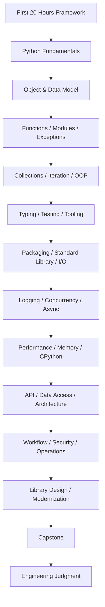
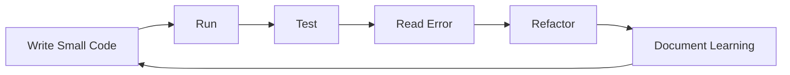
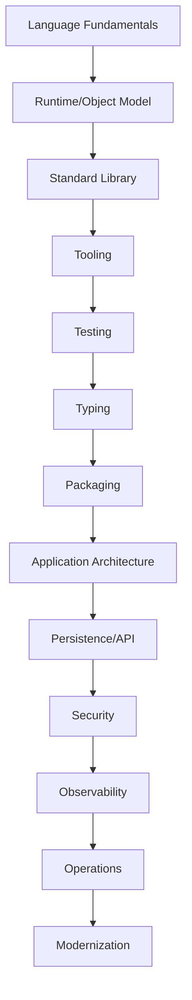
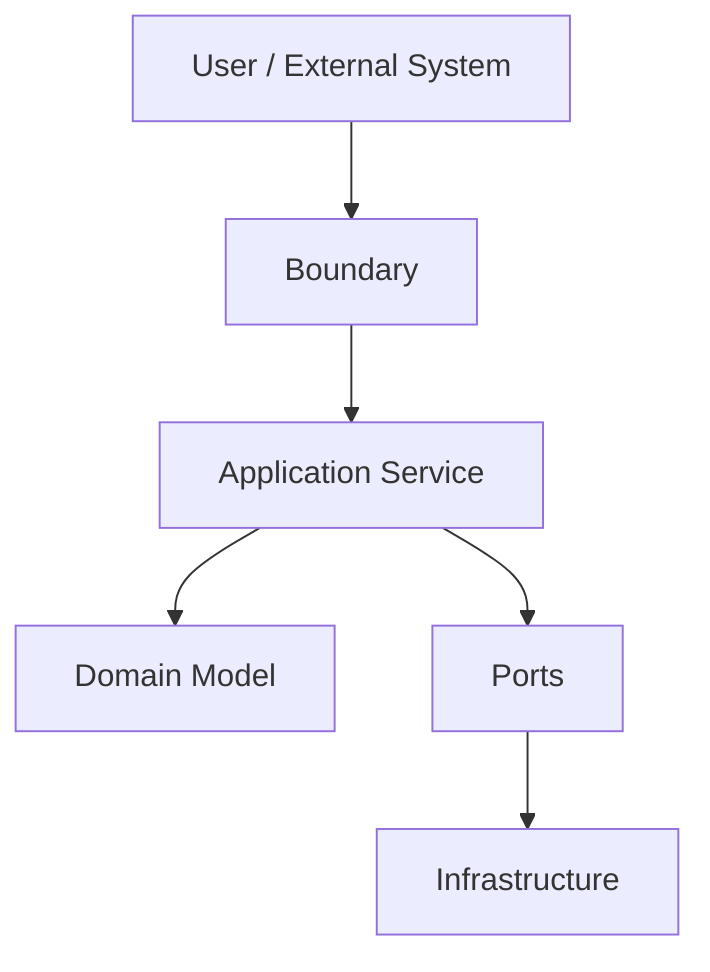

# Part 035 — Final Review: Dari 20 Jam Pertama ke Top-Tier Python Engineering Judgment

## 1. Tujuan Part Ini

Ini adalah bagian terakhir dari seri Python.

Seri ini dimulai dengan framework *The First 20 Hours*: belajar cepat bukan berarti belajar dangkal, tetapi:

1. menentukan target performa;
2. mendekonstruksi skill;
3. menghapus hambatan;
4. belajar cukup untuk self-correction;
5. praktik intens dengan feedback loop.

Kita lalu memperluas Python dari sekadar syntax menjadi engineering platform:

- language;
- runtime;
- object model;
- standard library;
- testing ecosystem;
- packaging;
- typing;
- concurrency;
- async;
- performance;
- memory;
- CPython internals;
- API;
- persistence;
- architecture;
- security;
- observability;
- modernization;
- capstone production service.

Part final ini menyatukan semuanya menjadi satu tujuan:

> Bukan hanya “bisa Python”, tetapi punya judgment Python engineering yang matang.

Target setelah part ini:

1. Mengingat big picture seluruh seri.
2. Mengetahui skill apa yang sudah dikuasai.
3. Mengetahui skill apa yang harus dilatih berikutnya.
4. Memiliki self-assessment rubric.
5. Memiliki checklist top-tier Python engineer.
6. Memahami cara menilai desain Python.
7. Memiliki plan lanjutan setelah 20 jam pertama.
8. Bisa mereview capstone dengan objektif.
9. Bisa menghadapi interview/system design Python.
10. Bisa terus meningkatkan kemampuan tanpa tersesat di tutorial.

---

## 2. Big Picture Seri Ini



Skill Python bukan linear murni. Ia berbentuk jaringan.

Syntax membantu membaca kode.
Object model membantu memahami mutability.
Testing membantu desain.
Typing membantu contract.
Packaging membantu reproducibility.
Architecture membantu maintainability.
Observability membantu production.
Security membantu trust.
Performance membantu scale.
Modernization membantu umur panjang.

Top-tier Python engineer menghubungkan semua ini.

---

## 3. The First 20 Hours: Review

Framework Kaufman yang kita pakai:

### 3.1 Deconstruct the Skill

Python dipecah menjadi sub-skill:

- syntax survival;
- environment/tooling;
- object model;
- collections;
- functions;
- modules/imports;
- exceptions;
- iteration;
- OOP/dataclass/protocol;
- typing;
- testing;
- packaging;
- I/O;
- logging;
- concurrency;
- async;
- performance;
- memory;
- API;
- data access;
- architecture;
- security;
- observability;
- modernization.

### 3.2 Learn Enough to Self-Correct

Kamu tidak harus menghafal semua dokumentasi Python. Tetapi kamu harus cukup paham untuk:

- membaca traceback;
- mencari dokumentasi resmi;
- membuat minimal reproduction;
- menulis test;
- menjalankan profiler;
- memahami error;
- membedakan bug domain vs bug boundary;
- tahu kapan perlu dependency eksternal;
- tahu kapan desain terlalu kompleks.

### 3.3 Remove Practice Barriers

Hambatan yang harus dihapus:

- environment rusak;
- command tidak standar;
- dependency tidak jelas;
- test lambat/tidak ada;
- editor salah interpreter;
- tidak ada project structure;
- tidak ada quality gate;
- tidak tahu cara menjalankan kode;
- tidak tahu cara mengukur.

### 3.4 Practice Deliberately

Bukan hanya membaca.

Latihan inti seri ini:

- bangun `case-tracker`;
- refactor bertahap;
- tulis tests;
- buat CLI;
- tambah repository;
- tambah API;
- tambah storage;
- tambah logging;
- profiling;
- capstone.

### 3.5 Feedback Loop



Feedback cepat adalah akselerator belajar.

---

## 4. What “Top-Tier Python Engineer” Means

Top-tier bukan berarti tahu setiap library.

Top-tier berarti:

1. Bisa membuat desain sederhana yang benar.
2. Bisa menjelaskan trade-off.
3. Bisa membaca failure.
4. Bisa menulis test yang memberi confidence.
5. Bisa membuat boundary yang jelas.
6. Bisa menjaga domain dari framework leakage.
7. Bisa memilih dependency dengan sadar.
8. Bisa mengukur performa sebelum optimisasi.
9. Bisa membuat sistem observable.
10. Bisa memodernisasi legacy code tanpa merusak produksi.
11. Bisa mengajari engineer lain melalui code clarity.
12. Bisa membuat keputusan sesuai context.

Top-tier engineer bukan “template collector”. Mereka punya mental model.

---

## 5. Mental Models yang Harus Tertanam

### 5.1 Python Program adalah Object Graph

```python
case = Case(...)
cases = [case]
```

List menyimpan reference ke object. Mutation dan aliasing penting.

### 5.2 Variable adalah Name Binding, Bukan Box

```python
a = []
b = a
```

`a` dan `b` menunjuk object sama.

### 5.3 Mutability adalah Design Decision

Mutable object memudahkan update, tetapi membuka aliasing/race bug.

Immutability/value object memperkuat invariant.

### 5.4 Function adalah Boundary

Function signature adalah contract.

```python
def transition_case(case_id: CaseId, *, target_status: CaseStatus) -> Case:
    ...
```

### 5.5 Module adalah Architectural Unit

Import direction mencerminkan dependency direction.

### 5.6 Exception adalah Failure Semantics

Exception bukan hanya error. Ia menyatakan jenis failure dan boundary penanganannya.

### 5.7 Tests adalah Design Feedback

Jika test sulit ditulis, desain mungkin terlalu coupled.

### 5.8 Type Hints adalah Static Reasoning

Type hints bukan runtime enforcement default, tetapi meningkatkan contract dan refactor safety.

### 5.9 Packaging adalah Reliability Boundary

Project harus bisa diinstall, dibuild, dan direproduksi.

### 5.10 Standard Library First

Dependency eksternal harus memberi leverage lebih besar dari cost.

### 5.11 Logging adalah Runtime Narrative

Logs membantu menjawab “apa yang terjadi?”

### 5.12 Concurrency Dipilih Berdasarkan Workload

Thread, process, async bukan gaya. Mereka alat untuk bottleneck berbeda.

### 5.13 Performance Harus Diukur

Tanpa baseline, optimisasi hanyalah tebakan.

### 5.14 Domain Tidak Boleh Bocor Framework

FastAPI/Pydantic/SQLAlchemy adalah boundary/infrastructure, bukan domain core.

### 5.15 Production Readiness adalah Operability

Kode harus bisa dijalankan, diamati, didiagnosis, dan dipulihkan.

---

## 6. The Python Engineering Stack



Setiap layer punya failure mode.

Contoh:

- Language: mutability bug.
- Runtime: memory leak due retained references.
- Standard library: encoding bug.
- Tooling: CI mismatch.
- Testing: over-mocking.
- Typing: `Any` leakage.
- Packaging: missing runtime dependency.
- Architecture: circular dependency.
- Persistence: transaction bug.
- Security: object-level authorization missing.
- Observability: no request id.
- Operations: no readiness check.
- Modernization: breaking change without deprecation.

---

## 7. Review Seluruh 35 Part

### Part 001 — Target Performance, Scope, dan Learning Contract

Kamu menentukan tujuan belajar dan kontrak 20 jam.

Key insight:

> Belajar cepat butuh scope yang tajam.

### Part 002 — Deconstructing Python

Python dilihat sebagai bahasa, runtime, object system, ecosystem, dan platform.

Key insight:

> Python bukan satu hal; Python adalah stack.

### Part 003 — Environment dan Toolchain

Kamu membangun environment reproducible.

Key insight:

> Friction membunuh deliberate practice.

### Part 004 — Syntax Survival

Kamu memahami syntax dasar untuk membaca/menulis program.

Key insight:

> Syntax adalah entry point, bukan tujuan akhir.

### Part 005 — Mini Project Pertama

Kamu mulai `case-tracker`.

Key insight:

> Project kecil dengan feedback loop lebih baik daripada teori tanpa praktik.

### Part 006 — Data Model

Object, identity, equality, mutability.

Key insight:

> Banyak bug Python adalah bug reference dan mutability.

### Part 007 — Collections

List, tuple, dict, set, complexity, modelling.

Key insight:

> Pilihan collection adalah pilihan desain.

### Part 008 — Functions

Function sebagai unit desain.

Key insight:

> Signature yang baik mengurangi kompleksitas caller.

### Part 009 — Modules dan Imports

Boundary, import graph, side effects.

Key insight:

> Import direction adalah architecture signal.

### Part 010 — Exceptions

Failure semantics dan defensive Python.

Key insight:

> Error handling adalah desain contract, bukan afterthought.

### Part 011 — Iteration dan Generators

Lazy thinking, iterables, pipelines.

Key insight:

> Tidak semua data harus dimaterialisasi.

### Part 012 — OOP, Dataclass, Protocol

Composition, Protocol, domain model.

Key insight:

> Python OOP kuat jika dipakai untuk behavior dan boundary, bukan ceremony.

### Part 013 — Type Hints

Gradual typing, TypedDict, Protocol, generics.

Key insight:

> Type hints membantu berpikir statis di bahasa dinamis.

### Part 014 — pytest

Testing sebagai design feedback.

Key insight:

> Test yang baik membuat desain lebih jelas.

### Part 015 — Test Architecture

Fakes, mocks, contract tests, property tests.

Key insight:

> Test suite harus mendukung refactor, bukan mengunci implementasi.

### Part 016 — Code Quality Tooling

Ruff, type checker, CI, quality gate.

Key insight:

> Tooling menghilangkan noise agar review fokus ke judgment.

### Part 017 — Packaging

pyproject, dependencies, build, reproducibility.

Key insight:

> Code yang tidak bisa diinstall dengan benar belum siap jadi software.

### Part 018 — Standard Library

Leverage dari modul bawaan.

Key insight:

> Standard library mengurangi dependency risk dan memperkuat pemahaman problem.

### Part 019 — File I/O and Serialization

Data boundary, atomic write, schema evolution.

Key insight:

> Data eksternal harus divalidasi sebelum masuk domain.

### Part 020 — Logging and Diagnostics

Runtime visibility.

Key insight:

> Sistem yang tidak bisa didiagnosis akan mahal dioperasikan.

### Part 021 — Concurrency

Threads, processes, GIL, workload classification.

Key insight:

> Concurrency adalah desain bottleneck, bukan default speedup.

### Part 022 — Async

Event loop, tasks, cancellation, backpressure.

Key insight:

> Async cocok untuk I/O concurrency, bukan solusi universal.

### Part 023 — Performance

Measurement before optimization.

Key insight:

> Optimize only after measuring.

### Part 024 — Memory

Object overhead, tracemalloc, slots, streaming.

Key insight:

> Memory bottleneck sering berasal dari representation dan allocation.

### Part 025 — CPython Internals

Bytecode, refcount, GC, GIL.

Key insight:

> Internals memberi insight, bukan alasan menulis kode fragile.

### Part 026 — API Development

FastAPI, Pydantic, service boundary.

Key insight:

> API route harus tipis; domain harus framework-agnostic.

### Part 027 — Data Access

SQLAlchemy, transactions, repository, UoW.

Key insight:

> Persistence harus punya transaction boundary yang jelas.

### Part 028 — Architecture

Layering, ports/adapters, domain modelling.

Key insight:

> Architecture adalah dependency management untuk perubahan jangka panjang.

### Part 029 — State Machines

Workflow, guards, audit, idempotency.

Key insight:

> Complex lifecycle harus dimodelkan eksplisit.

### Part 030 — Security

Threat modelling, authorization, injection, secrets.

Key insight:

> Security adalah property sistem, bukan fitur tambahan.

### Part 031 — Observability and Operations

Logs, metrics, traces, health, runbooks.

Key insight:

> Production readiness adalah kemampuan sistem untuk dioperasikan.

### Part 032 — Library Design

Public API, deprecation, compatibility.

Key insight:

> API internal juga user experience.

### Part 033 — Modernization

Legacy, migration, refactor safety.

Key insight:

> Modernization yang baik incremental dan evidence-based.

### Part 034 — Capstone

Production-grade regulatory case service.

Key insight:

> Semua skill menyatu di project yang punya domain, persistence, API, security, observability, dan operations.

### Part 035 — Final Review

Engineering judgment.

Key insight:

> Tujuan akhir bukan hafalan Python, tetapi keputusan teknis yang baik.

---

## 8. Self-Assessment Rubric

Nilai dirimu 1–5.

| Score | Meaning |
|---:|---|
| 1 | Pernah dengar, belum bisa memakai |
| 2 | Bisa mengikuti contoh |
| 3 | Bisa memakai mandiri pada project kecil |
| 4 | Bisa mendesain dan menjelaskan trade-off |
| 5 | Bisa mengajari, mereview, dan memecahkan edge case production |

---

## 9. Rubric: Python Fundamentals

| Skill | Score |
|---|---:|
| Syntax dasar |  |
| Data types |  |
| Control flow |  |
| Functions |  |
| Modules/imports |  |
| Exceptions |  |
| Iteration/generators |  |
| Collections |  |
| OOP/dataclass |  |
| Protocol/composition |  |

Target top-tier: rata-rata 4+.

---

## 10. Rubric: Engineering Tooling

| Skill | Score |
|---|---:|
| venv/environment |  |
| pyproject.toml |  |
| dependency management |  |
| editable install |  |
| pytest |  |
| fixtures/parametrize |  |
| fakes/mocks |  |
| Ruff |  |
| mypy/pyright |  |
| CI quality gate |  |

Target top-tier: bisa setup project dari nol tanpa kebingungan.

---

## 11. Rubric: Application Design

| Skill | Score |
|---|---:|
| Domain modelling |  |
| Service layer |  |
| Repository pattern |  |
| Unit of Work |  |
| API schema boundary |  |
| Error mapping |  |
| State machine |  |
| Authorization policy |  |
| Audit trail |  |
| Dependency direction |  |

Target top-tier: bisa membedakan domain, application, infrastructure, API.

---

## 12. Rubric: Production Readiness

| Skill | Score |
|---|---:|
| Logging |  |
| Metrics |  |
| Tracing concept |  |
| Health/readiness |  |
| Config management |  |
| Secrets handling |  |
| Graceful shutdown |  |
| Timeouts/retries |  |
| Runbooks |  |
| Deployment checklist |  |

Target top-tier: bisa menjelaskan bagaimana sistem gagal dan bagaimana mendiagnosisnya.

---

## 13. Rubric: Advanced Runtime Judgment

| Skill | Score |
|---|---:|
| GIL understanding |  |
| Thread/process choice |  |
| Async/event loop |  |
| Cancellation/backpressure |  |
| Profiling |  |
| Benchmarking |  |
| Memory profiling |  |
| CPython internals |  |
| Serialization boundaries |  |
| Performance trade-off |  |

Target top-tier: tidak menebak; mengukur dan memilih model sesuai bottleneck.

---

## 14. Rubric: Maintenance and Evolution

| Skill | Score |
|---|---:|
| Characterization tests |  |
| Legacy assessment |  |
| Dependency upgrade |  |
| Python version upgrade |  |
| Packaging migration |  |
| Data migration |  |
| API deprecation |  |
| Backward compatibility |  |
| Strangler pattern |  |
| Migration playbook |  |

Target top-tier: bisa mengubah sistem lama tanpa merusak production.

---

## 15. Top-Tier Python Engineer Checklist

Kamu mendekati top-tier jika bisa:

1. Membuat package Python modern dari nol.
2. Menulis domain model yang menjaga invariant.
3. Menulis tests yang meaningful.
4. Menjelaskan kapan pakai dataclass vs class biasa.
5. Menjelaskan `is` vs `==`.
6. Menjelaskan mutability dan aliasing.
7. Menjelaskan type hints runtime vs static.
8. Menulis Protocol untuk dependency inversion.
9. Memakai pytest fixtures tanpa over-fixturing.
10. Memilih fake vs mock.
11. Menggunakan Ruff/type checker/CI.
12. Mendesain serialization boundary.
13. Menulis custom exception hierarchy.
14. Memakai logging dengan context.
15. Memilih thread/process/async berdasarkan workload.
16. Mengukur performance dengan profiler.
17. Mengukur memory dengan `tracemalloc`.
18. Menjelaskan GIL secara praktis.
19. Mendesain FastAPI route tipis.
20. Menjaga domain bebas framework.
21. Mendesain repository + Unit of Work.
22. Menjelaskan transaction boundary.
23. Mendesain state machine eksplisit.
24. Menambahkan authorization policy.
25. Menghindari injection/path/deserialization risk.
26. Menambahkan health/readiness.
27. Menulis runbook.
28. Mendesain public API stabil.
29. Melakukan deprecation dengan warning dan migration path.
30. Membuat modernization plan incremental.

---

## 16. Common Gaps Setelah Seri Ini

Setelah 35 part, kamu belum otomatis ahli dalam semua library.

Gap yang mungkin masih perlu didalami:

- framework-specific production deployment;
- advanced SQLAlchemy relationship/loading strategies;
- Alembic migrations;
- real authentication/OAuth/OIDC;
- distributed systems;
- message brokers;
- full OpenTelemetry deployment;
- advanced async networking;
- data science stack;
- C extension/Rust extension;
- Python packaging publishing to PyPI;
- Kubernetes operations;
- cloud-specific managed services;
- advanced cryptography;
- formal verification/property testing advanced.

Ini normal.

Seri ini memberi foundation dan judgment agar kamu bisa mempelajari gap tersebut dengan cepat.

---

## 17. How to Continue After the First 20 Hours

### Stage 1 — Stabilize Fundamentals

Waktu: 1–2 minggu.

Focus:

- ulang part 006–014;
- tulis ulang `case-tracker` tanpa melihat materi;
- pastikan tests jalan;
- tambahkan typing;
- tambahkan Ruff;
- buat README.

Goal:

> Bisa membangun CLI Python maintainable dari nol.

### Stage 2 — Build API

Waktu: 2–3 minggu.

Focus:

- FastAPI;
- Pydantic;
- error mapping;
- API tests;
- dependency override;
- service layer.

Goal:

> Bisa expose domain service via HTTP API tanpa framework leakage.

### Stage 3 — Persistence

Waktu: 2–4 minggu.

Focus:

- SQLAlchemy;
- repository;
- transactions;
- Unit of Work;
- migrations;
- integration tests.

Goal:

> Bisa membangun persistence layer yang testable dan transactional.

### Stage 4 — Production Readiness

Waktu: 2–4 minggu.

Focus:

- config;
- logs;
- metrics;
- health checks;
- deployment;
- runbooks;
- security baseline.

Goal:

> Bisa menjelaskan bagaimana service dijalankan dan didiagnosis.

### Stage 5 — Capstone Polish

Waktu: 4–8 minggu.

Focus:

- regulatory case service;
- audit;
- idempotency;
- optimistic locking;
- outbox;
- performance baseline;
- security tests.

Goal:

> Portfolio-level project.

---

## 18. The 20-Hour Practice Plan Revisited

Jika kamu benar-benar ingin memakai 20 jam pertama secara intens:

| Hour | Practice |
|---:|---|
| 1 | Setup environment + pyproject |
| 2 | Syntax + CLI skeleton |
| 3 | Domain model `Case` |
| 4 | State transitions |
| 5 | Storage JSON |
| 6 | Service layer |
| 7 | pytest domain tests |
| 8 | pytest storage/service tests |
| 9 | Exceptions/error handling |
| 10 | Typing + Protocol repository |
| 11 | Ruff/type checker |
| 12 | CLI polish |
| 13 | Logging |
| 14 | Serialization boundary |
| 15 | Performance baseline |
| 16 | FastAPI minimal API |
| 17 | API tests |
| 18 | SQLAlchemy repository sketch |
| 19 | Architecture review |
| 20 | Final refactor + README |

20 jam tidak membuatmu master. Tetapi 20 jam bisa membuatmu cukup kuat untuk self-correct.

---

## 19. What to Build Next

Build one of these:

### 19.1 Regulatory Case Service

Melanjutkan capstone.

Best for:

- backend engineer;
- domain modelling;
- API/persistence/security.

### 19.2 CLI Data Migration Tool

Features:

- JSON/CSV input;
- validation;
- dry-run;
- progress;
- report;
- error file;
- atomic writes.

Best for:

- file I/O;
- serialization;
- operational tooling.

### 19.3 Async Enrichment Worker

Features:

- async HTTP client;
- concurrency limit;
- retries;
- backpressure;
- outbox consumption.

Best for:

- async/concurrency/observability.

### 19.4 Package/Library

Create reusable `case_tracker_core`.

Features:

- public API;
- docs;
- tests;
- deprecation example;
- packaging.

Best for:

- library design;
- compatibility;
- typing.

### 19.5 Performance Lab

Features:

- large dataset;
- profiling;
- memory optimization;
- JSON vs SQLite comparison;
- benchmark docs.

Best for:

- performance/memory/CPython.

---

## 20. Interview/System Design Preparation

Be ready to answer:

### Python Language

1. Explain mutable default argument bug.
2. Explain `is` vs `==`.
3. Explain list vs tuple vs set vs dict.
4. Explain generator vs list.
5. Explain exception chaining.
6. Explain context manager.

### Tooling

1. How do you structure a Python project?
2. Why `pyproject.toml`?
3. How do you manage dev dependencies?
4. What checks run in CI?
5. How do you use Ruff/mypy/pytest?

### Testing

1. Mock vs fake?
2. What is contract test?
3. What is property-based testing?
4. How do you test file I/O?
5. How do you avoid flaky tests?

### Architecture

1. Where should business logic live in FastAPI app?
2. Why not use Pydantic model as domain model everywhere?
3. What is repository pattern?
4. What is Unit of Work?
5. How do you enforce state transitions?

### Data

1. How do you handle schema evolution?
2. How do you design migrations?
3. How do you avoid N+1?
4. How do transactions work?
5. How do you handle optimistic locking?

### Runtime

1. What is GIL?
2. When use threads/processes/async?
3. How do you profile Python code?
4. How do you measure memory?
5. What is CPython reference counting?

### Production

1. What should be logged?
2. What metrics matter?
3. What is readiness vs liveness?
4. How do you manage config/secrets?
5. What is graceful shutdown?

---

## 21. Code Review Checklist for Python PRs

Use this checklist saat review:

### Correctness

- Are domain invariants enforced?
- Are edge cases tested?
- Are failure modes explicit?
- Are exceptions specific?
- Is state transition valid?

### Design

- Is function signature clear?
- Is dependency direction correct?
- Is framework leakage avoided?
- Is complexity justified?
- Is public API stable?

### Testing

- Are tests meaningful?
- Are failure paths tested?
- Is mocking excessive?
- Are fixtures clear?
- Are integration boundaries tested?

### Typing

- Are public functions typed?
- Is `Any` contained?
- Are optionals handled?
- Are Protocols used appropriately?

### Data

- Is input validated at boundary?
- Is serialization explicit?
- Is transaction boundary correct?
- Is migration needed?

### Security

- Is authorization checked?
- Is object-level access enforced?
- Are secrets safe?
- Are injections prevented?
- Is logging safe?

### Operations

- Are logs useful?
- Are metrics/health affected?
- Is config documented?
- Is rollback/migration considered?

### Performance

- Is complexity acceptable?
- Any obvious N+1?
- Any unbounded memory growth?
- Was optimization measured?

---

## 22. Design Review Questions

Before building new Python feature, ask:

1. What is the use case?
2. What is the domain rule?
3. What is the boundary input?
4. What is the output contract?
5. What can fail?
6. Who is authorized?
7. What must be transactional?
8. What must be audited?
9. What should be logged?
10. What metric should change?
11. What test proves it?
12. What dependency is needed?
13. What data migration is needed?
14. What is the rollback path?
15. What is the simplest design that satisfies this?

These questions prevent accidental complexity.

---

## 23. Personal Practice Log Template

Use after each practice session:

```markdown
# Python Practice Log

Date:
Duration:
Topic:
Project:

## Goal

What did I try to learn/build?

## What I Built

## What Broke

## Traceback/Error Notes

## What I Learned

## Design Decision

## Test Added

## Next Step

## Confidence 1–5
```

Learning accelerates when written.

---

## 24. Capstone Final Review Template

```markdown
# Capstone Review

## Domain

- Invariants:
- State machine:
- Errors:

## Application

- Commands:
- Services:
- Authorization:
- Transaction boundary:

## Infrastructure

- Repository:
- Unit of Work:
- Migrations:
- Contract tests:

## API

- Routes:
- Schemas:
- Error mapping:
- Pagination:

## Security

- Auth placeholder:
- Object-level auth:
- Input validation:
- Logging safety:

## Observability

- Request id:
- Logs:
- Metrics:
- Health:
- Runbooks:

## Testing

- Unit:
- Contract:
- Integration:
- API:
- Security:
- Performance:

## Risks

## Next Improvements
```

---

## 25. “Pythonic” Revisited

Pythonic bukan berarti:

- kode paling pendek;
- comprehension paling rumit;
- magic paling banyak;
- dynamic trick paling clever.

Pythonic berarti:

- readable;
- explicit where it matters;
- simple common path;
- idiomatic data structures;
- clear names;
- good errors;
- minimal surprise;
- tests;
- maintainable boundaries;
- practical use of language features.

The Zen of Python sering diringkas menjadi readability, explicitness, simplicity, dan practicality. Tetapi top-tier engineer tahu bahwa “simple” bukan berarti “under-designed”.

Simple berarti:

> Complexity berada di tempat yang tepat.

---

## 26. Final Mental Model: Boundary-Centric Python

Banyak keputusan Python bisa disederhanakan dengan boundary thinking.



At each boundary, ask:

- What data crosses?
- Is it trusted?
- Is it validated?
- What type represents it?
- What errors can happen?
- What logs/metrics should exist?
- What transaction is needed?
- What test covers it?

This applies to:

- CLI args;
- HTTP request;
- JSON file;
- database row;
- queue message;
- external API response;
- plugin call;
- library public API.

Boundary clarity is a top-tier skill.

---

## 27. Final Anti-Patterns to Avoid

1. Learning only syntax.
2. Writing code without tests.
3. Treating type hints as runtime validation.
4. Letting dicts invade domain logic.
5. Catching `Exception` and hiding failures.
6. Using global mutable state.
7. Overusing mocks.
8. Adding dependencies casually.
9. Mixing framework and domain.
10. Ignoring packaging.
11. No CI quality gate.
12. No logging context.
13. Optimizing without measurement.
14. Using async for everything.
15. Using threads for CPU-bound speedup without evidence.
16. Ignoring security until late.
17. No migration plan.
18. Breaking public API without deprecation.
19. Writing clever code nobody can maintain.
20. Confusing “works” with “production-ready”.

---

## 28. Final Positive Patterns

1. Small cohesive functions.
2. Explicit domain model.
3. Value objects for important identities.
4. Specific exceptions.
5. Pure core, imperative shell.
6. Repository Protocol.
7. Unit of Work for transactions.
8. Boundary schemas.
9. Fakes + contract tests.
10. Parametrized state-machine tests.
11. Standard library first.
12. Reproducible packaging.
13. Quality gate in CI.
14. Structured logging.
15. Health/readiness checks.
16. Measurement-driven optimization.
17. Incremental modernization.
18. Backward-compatible API evolution.
19. Runbooks.
20. Written design decisions.

---

## 29. Recommended Reference Habits

When unsure:

1. Read official Python docs.
2. Create minimal reproduction.
3. Write a test.
4. Inspect traceback.
5. Use `dir`, `help`, `inspect` if needed.
6. Use `dis` only for insight.
7. Profile before optimizing.
8. Check package docs/changelog.
9. Search issue tracker for library-specific bug.
10. Document final decision.

Do not rely solely on snippets from random posts. Use snippets to learn possibilities, then verify.

---

## 30. Final Project Artifacts Checklist

For a serious Python project, aim for:

```text
pyproject.toml
README.md
CHANGELOG.md
LICENSE
Makefile / task runner
src/
tests/
docs/
.github/workflows/ci.yml
.pre-commit-config.yaml
```

Quality:

```bash
python -m ruff format --check .
python -m ruff check .
python -m mypy src tests
python -m pytest
```

Runtime:

- config object;
- logging config;
- health endpoints if service;
- migration tooling if database;
- dependency lock if app;
- runbooks.

---

## 31. Suggested 90-Day Mastery Plan

### Days 1–15: Rebuild `case-tracker`

- CLI;
- JSON storage;
- tests;
- typing;
- tooling.

### Days 16–30: Add API

- FastAPI;
- Pydantic schemas;
- error mapping;
- API tests;
- dependency overrides.

### Days 31–45: Add SQL Persistence

- SQLAlchemy;
- migrations;
- repository;
- Unit of Work;
- transaction tests.

### Days 46–60: Add Production Readiness

- config;
- logs;
- metrics;
- health;
- runbooks;
- security baseline.

### Days 61–75: Add Advanced Reliability

- audit trail;
- idempotency;
- optimistic locking;
- outbox worker;
- async enrichment.

### Days 76–90: Polish and Publish Portfolio

- docs;
- architecture diagrams;
- performance baseline;
- deployment guide;
- migration guide;
- final code review.

At the end, you should have portfolio-level evidence of engineering maturity.

---

## 32. Final Exam: Build Without Looking

Challenge:

Build a small but serious service from scratch without looking at previous code.

Requirements:

1. `pyproject.toml`.
2. `src` layout.
3. Domain model with value object and enum.
4. Service layer.
5. Repository Protocol.
6. Fake repository.
7. JSON or SQLite repository.
8. FastAPI API.
9. Pydantic schemas.
10. Error handlers.
11. pytest unit/API tests.
12. Ruff config.
13. Type checker config.
14. Logging.
15. Health endpoint.
16. README quickstart.

Timebox: 8–12 hours.

Then compare with capstone rubric.

This is the real test of transfer.

---

## 33. Final Reflection Questions

Answer in writing:

1. What Python concept changed how I think?
2. Which bug class do I now understand better?
3. Which tool gives me most leverage?
4. Which topic still feels fuzzy?
5. What part of capstone would I implement first?
6. Where did I over-engineer?
7. Where did I under-design?
8. What is my next 20-hour target?
9. What project will prove my skill?
10. What will I teach someone else?

Teaching one concept is a strong mastery check.

---

## 34. Completion Checklist for This Series

You have completed the series if:

- Part 001–035 exist.
- You understand the roadmap.
- You built or can build the mini project.
- You can explain object/reference/mutability.
- You can write tests with pytest.
- You can setup tooling.
- You can package a project.
- You can design API boundary.
- You can design persistence boundary.
- You can explain concurrency choices.
- You can profile before optimizing.
- You can add observability.
- You can identify security risks.
- You can modernize legacy code incrementally.
- You can explain capstone architecture.

If some items are weak, revisit the corresponding part.

---

## 35. Final Words

Python mastery is not about memorizing every feature.

It is about knowing how to think:

- What is the boundary?
- What is the invariant?
- What can fail?
- What is the contract?
- What must be tested?
- What must be measured?
- What must be logged?
- What must be secured?
- What must evolve?
- What is the simplest design that remains safe?

The first 20 hours give momentum.
The next 200 hours build fluency.
The next 2,000 hours build judgment.

But judgment is not automatic. It grows when you:

- build real things;
- read good code;
- review bad code respectfully;
- debug production-like failures;
- write tests;
- write docs;
- measure;
- refactor;
- teach;
- revisit assumptions.

This series is complete. The next step is not another tutorial.

The next step is to build, measure, review, and improve.

---

## 36. Referensi Lanjutan

Gunakan referensi resmi dan primary sources terlebih dahulu:

- Python Documentation.
- Python Packaging User Guide.
- pytest Documentation.
- Ruff Documentation.
- mypy or Pyright Documentation.
- FastAPI Documentation.
- Pydantic Documentation.
- SQLAlchemy Documentation.
- OpenTelemetry Documentation.
- OWASP Top 10 and ASVS.
- CPython Developer Guide, jika ingin internals lebih dalam.

---

## 37. Status Seri

Seri **learn-python** selesai pada Part 035.

File terakhir:

```text
learn-python--part-035.mdx
```

Total:

```text
35 parts
```

Selamat. Kamu sekarang punya peta lengkap untuk bergerak dari “bisa Python” menuju “mampu mendesain, membangun, mengoperasikan, dan memodernisasi sistem Python dengan judgment software engineering yang kuat.”
