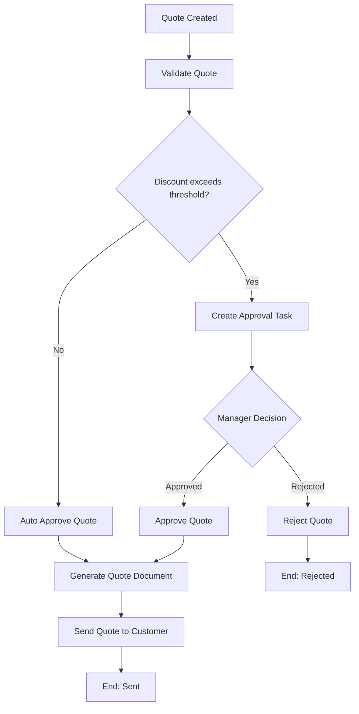

# Workflow, Business Process, and BPMN Mental Model

> Target pembaca: Senior Java Software Engineer yang kuat di backend system, tetapi belum mendalami BPMN/Camunda secara serius.
>
> Fokus part ini: membangun model mental workflow terlebih dahulu sebelum masuk ke simbol BPMN, Camunda 7, Camunda 8, Zeebe, workers, human tasks, saga, incident, dan operasi production.

---

## 1. Core idea

Workflow adalah koordinasi pekerjaan bisnis yang terjadi melewati waktu, sistem, manusia, keputusan, kegagalan, retry, timeout, dan perubahan state.

Business process adalah representasi end-to-end dari bagaimana sebuah tujuan bisnis diselesaikan. Dalam konteks CPQ/quote/order, contoh proses bisnis bisa berupa:

- membuat quote,
- memvalidasi konfigurasi produk,
- menghitung harga,
- meminta approval,
- mengirim quote ke customer,
- mengubah quote menjadi order,
- memvalidasi order,
- mengorkestrasi fulfillment,
- menangani fallout,
- meminta manual intervention,
- melakukan cancellation, amendment, atau reconciliation.

BPMN adalah notation standar untuk memodelkan proses tersebut. Dalam platform seperti Camunda, BPMN bukan hanya gambar; BPMN dapat menjadi executable model yang menentukan bagaimana runtime menggerakkan process instance dari satu aktivitas ke aktivitas lain.

Model mental yang harus dibangun:

```text
Business intent
  -> business process
  -> BPMN model
  -> deployed process definition
  -> running process instance
  -> tasks/events/gateways/jobs
  -> workers/human users/external systems
  -> completion, incident, compensation, or manual repair
```

Workflow engineering bukan tentang menggambar diagram yang indah. Workflow engineering adalah disiplin membuat proses bisnis panjang menjadi eksplisit, observable, recoverable, dan aman di production.

---

## 2. Why workflow exists

Backend engineer sering terbiasa berpikir dalam bentuk request-response:

```text
HTTP request -> validate -> execute business logic -> commit DB -> return response
```

Pola ini cocok untuk operasi pendek dan sinkron. Masalah muncul ketika proses bisnis tidak selesai dalam satu request, satu transaction, atau satu service.

Workflow ada karena banyak proses enterprise memiliki sifat berikut:

1. **Long-running**  
   Proses bisa berlangsung menit, jam, hari, atau minggu.

2. **Cross-system**  
   Satu proses menyentuh banyak service, database, external API, message broker, dan sistem legacy.

3. **Human-in-the-loop**  
   Ada approval, review, manual correction, fallout handling, atau operational task.

4. **Asynchronous**  
   Proses menunggu event eksternal, callback, message, timer, atau human action.

5. **Failure-prone**  
   Worker bisa mati, API eksternal timeout, message duplicate, database gagal commit, atau task tidak pernah diselesaikan.

6. **Auditable**  
   Business ingin tahu siapa melakukan apa, kapan, dengan input apa, dan kenapa proses gagal.

7. **Versioned**  
   Definisi proses berubah, tetapi process instance lama mungkin masih berjalan.

8. **Operationally visible**  
   Tim production perlu melihat proses mana yang stuck, job mana yang gagal, task mana yang aging, dan SLA mana yang breach.

Tanpa workflow engine, proses seperti ini biasanya tersebar di:

- status field di tabel database,
- scheduler,
- queue consumer,
- retry loop,
- cron job,
- if/else di service,
- manual SQL repair,
- dashboard custom,
- dokumentasi tidak sinkron dengan code.

Workflow engine mencoba membuat koordinasi tersebut menjadi eksplisit.

---

## 3. Business process vs application flow

Jangan menyamakan business process dengan application flow.

Application flow biasanya menjawab:

```text
Bagaimana request ini diproses oleh aplikasi?
```

Business process menjawab:

```text
Bagaimana tujuan bisnis ini selesai dari awal sampai akhir?
```

Contoh application flow:

```text
POST /quotes
  -> validate request
  -> insert quote
  -> return quoteId
```

Contoh business process:

```text
Create quote
  -> validate customer eligibility
  -> validate product configuration
  -> calculate price
  -> check discount approval threshold
  -> request sales manager approval if needed
  -> wait for approval
  -> generate document
  -> send quote
  -> wait for customer response
  -> convert to order or expire quote
```

Application flow bisa menjadi satu langkah di dalam business process. Business process biasanya lebih panjang, lebih kaya state, dan lebih dekat dengan operasi bisnis.

---

## 4. BPMN as communication artifact

BPMN harus bisa dibaca oleh beberapa pihak sekaligus:

- backend engineer,
- business analyst,
- product owner,
- solution architect,
- QA,
- SRE/platform engineer,
- support/operations,
- security/compliance reviewer.

Diagram BPMN yang baik menjawab pertanyaan berikut:

- proses dimulai oleh apa,
- siapa melakukan task manual,
- task mana yang otomatis,
- keputusan bisnis terjadi di mana,
- proses menunggu event apa,
- timeout-nya apa,
- failure path-nya apa,
- retry terjadi di mana,
- escalation terjadi kapan,
- proses dianggap selesai kapan,
- proses dianggap gagal kapan,
- compensation/manual repair dilakukan bagaimana.

BPMN yang hanya menunjukkan happy path bukan artifact engineering yang cukup. Untuk production system, BPMN harus memperlihatkan failure, timeout, retry, manual handling, dan observability concern.

---

## 5. BPMN as executable model

Dalam Camunda, BPMN dapat menjadi model yang dieksekusi oleh engine.

Secara sederhana:

```text
BPMN file (.bpmn)
  -> deployed to engine
  -> becomes process definition
  -> used to start process instance
  -> engine moves execution through BPMN elements
  -> tasks/jobs/events/gateways drive runtime behavior
```

Camunda 8 documentation menjelaskan bahwa proses dimodelkan menggunakan BPMN, dideploy sebagai process definition, lalu dieksekusi sebagai process instance. Ini adalah fondasi penting: diagram BPMN bukan hanya dokumentasi statis, tetapi bisa menjadi runtime contract.

Konsekuensi engineering-nya besar:

- perubahan diagram adalah perubahan behavior,
- versioning BPMN sama pentingnya dengan versioning code,
- expression di gateway bisa menyebabkan incident,
- variable mapping bisa merusak process instance,
- service task bisa menciptakan job yang harus diproses worker,
- user task bisa membuat process instance menunggu manusia,
- timer bisa membuat backlog,
- message correlation bisa gagal,
- retry bisa menggandakan side effect jika worker tidak idempotent.

---

## 6. Minimum vocabulary

Sebelum masuk ke Camunda detail, kuasai vocabulary berikut.

### 6.1 Process definition

Template proses yang sudah dideploy.

Analogi:

```text
Class definition dalam Java
```

Tetapi untuk workflow:

```text
BPMN model deployed as executable definition
```

### 6.2 Process instance

Satu eksekusi nyata dari process definition.

Analogi:

```text
Object instance dari class
```

Dalam domain CPQ/order:

```text
Quote approval process untuk quoteId = Q-1001
Order fulfillment process untuk orderId = O-9001
```

### 6.3 Activity

Langkah dalam proses. Bisa berupa service task, user task, script task, business rule task, subprocess, call activity, dan sebagainya.

### 6.4 Task

Unit pekerjaan. Task bisa dilakukan oleh manusia atau sistem.

- **User task**: manusia harus mengambil aksi.
- **Service task**: automation/worker menjalankan aksi.
- **Business rule task**: decision table/rule dievaluasi.

### 6.5 Event

Sesuatu yang terjadi atau ditunggu oleh proses.

Contoh:

- process started,
- message received,
- timer fired,
- error thrown,
- escalation raised,
- compensation triggered,
- process ended.

### 6.6 Gateway

Kontrol percabangan atau penggabungan flow.

Contoh:

- exclusive gateway untuk memilih satu path,
- parallel gateway untuk menjalankan beberapa path bersamaan,
- event-based gateway untuk menunggu event yang datang lebih dulu.

### 6.7 Variable

Data yang dibawa oleh process instance.

Contoh:

```json
{
  "quoteId": "Q-1001",
  "customerId": "C-100",
  "discountPercent": 35,
  "requiresApproval": true
}
```

Variable bukan pengganti database domain. Variable adalah context eksekusi proses. Data domain utama tetap sebaiknya berada di database bisnis yang memiliki constraint, indexing, audit, dan ownership jelas.

### 6.8 Business key

Identifier bisnis yang menghubungkan process instance dengan entity domain.

Contoh:

```text
quoteId
orderId
customerRequestId
fulfillmentRequestId
```

### 6.9 Correlation key

Key untuk mencocokkan event/message eksternal ke process instance yang tepat.

Contoh:

```text
externalOrderRef
quoteId
orderId
requestId
callbackCorrelationId
```

### 6.10 Job

Work item yang harus dieksekusi oleh engine atau worker.

Di Camunda 8/Zeebe, ketika service task dimasuki, job dibuat dan worker yang subscribe ke job type dapat mengambil dan menyelesaikannya.

### 6.11 Worker

Komponen aplikasi yang mengambil job/task dari engine dan menjalankan pekerjaan nyata:

- memanggil REST API,
- update PostgreSQL,
- publish event Kafka,
- send command RabbitMQ,
- hit external system,
- run validation,
- generate document.

### 6.12 Incident

Kondisi runtime ketika engine tidak bisa melanjutkan proses tanpa intervensi atau perbaikan.

Contoh:

- job retries habis,
- expression gateway invalid,
- variable missing,
- message correlation tidak bisa diselesaikan,
- worker gagal berkali-kali,
- payload tidak bisa diserialisasi.

---

## 7. Example mental model: quote approval

Contoh sederhana BPMN-level flow:



Ini terlihat sederhana, tetapi production workflow harus menjawab detail yang tidak terlihat di diagram happy path:

- Apa yang terjadi jika validation worker mati?
- Apa retry policy untuk `Validate Quote`?
- Apakah `Auto Approve Quote` idempotent?
- Apakah `Generate Quote Document` menyimpan file dua kali jika retry?
- Bagaimana jika manager tidak approve selama 3 hari?
- Apakah ada SLA timer?
- Bagaimana jika task diselesaikan oleh user yang tidak punya permission?
- Bagaimana jika quote diubah saat approval masih pending?
- Apa source of truth status quote: process instance atau database quote?
- Apakah rejection adalah terminal process state?
- Apakah audit trail mencatat user, timestamp, dan alasan?

Inilah perbedaan antara diagram proses dan workflow engineering.

---

## 8. Lifecycle of a workflow

Workflow lifecycle biasanya mengikuti urutan berikut.

### 8.1 Model

Proses dimodelkan sebagai BPMN.

Output:

```text
quote-approval.bpmn
order-fulfillment.bpmn
fallout-handling.bpmn
```

Concern:

- readability,
- correctness,
- business alignment,
- failure path,
- naming,
- variable design,
- task ownership,
- event correlation,
- versioning.

### 8.2 Validate

Model divalidasi sebelum deployment.

Validasi bisa mencakup:

- BPMN syntax,
- gateway condition,
- missing end event,
- unsupported element,
- missing task type,
- missing form/assignment,
- missing retry config,
- naming convention,
- linting custom.

### 8.3 Deploy

BPMN dideploy ke engine.

Output:

```text
process definition version N
```

Concern:

- deployment pipeline,
- environment promotion,
- version tag,
- backward compatibility,
- rollback strategy,
- running instance behavior.

### 8.4 Start

Process instance dibuat.

Trigger bisa berasal dari:

- REST API,
- message/event,
- timer,
- manual start,
- another process via call activity.

Concern:

- idempotent start,
- business key,
- correlation ID,
- authorization,
- duplicate prevention.

### 8.5 Execute

Engine menggerakkan instance melalui activities, gateways, events, dan tasks.

Concern:

- variable mutation,
- transaction boundary,
- worker behavior,
- external side effect,
- retry,
- incident,
- observability.

### 8.6 Wait

Workflow sering berhenti di wait state.

Contoh wait state:

- user task menunggu approval,
- message event menunggu callback,
- timer menunggu due date,
- external task menunggu worker,
- service task menunggu job completion.

Concern:

- timeout,
- SLA,
- task aging,
- correlation,
- manual repair,
- cancellation.

### 8.7 Resume

Process lanjut ketika event/task/job selesai.

Concern:

- duplicate completion,
- stale task,
- late callback,
- out-of-order event,
- concurrent update,
- invalid transition.

### 8.8 Complete, terminate, or fail

Process instance bisa:

- complete successfully,
- end with business rejection,
- terminate,
- create incident,
- wait forever if design buruk,
- require manual repair.

Concern:

- final state consistency,
- audit,
- notification,
- downstream event,
- cleanup,
- retention.

---

## 9. Workflow in enterprise Java/JAX-RS systems

Dalam Java/JAX-RS backend, Camunda biasanya tidak hidup sendirian. Ia berinteraksi dengan service dan infrastructure lain.

Typical shape:

```text
Client / UI / API Gateway
  -> Java/JAX-RS service
      -> start process / correlate message / complete task
      -> PostgreSQL via JDBC/MyBatis
      -> Kafka/RabbitMQ
      -> Redis
      -> external APIs
  -> Camunda engine / Zeebe cluster
      -> user tasks
      -> service tasks/jobs
      -> incidents
      -> process history
```

### 9.1 REST API as workflow boundary

REST endpoint bisa melakukan:

- start process,
- complete user task,
- correlate external message,
- query process status,
- cancel process,
- retry/manual repair operation jika authorized.

Contoh API contract:

```http
POST /quotes/{quoteId}/approval-requests
Idempotency-Key: 9a4c...
X-Correlation-Id: req-123
```

Response untuk long-running process sebaiknya tidak berpura-pura sinkron:

```http
202 Accepted
Location: /quotes/Q-1001/workflows/approval/status
```

### 9.2 Worker as side-effect boundary

Worker adalah tempat side effect nyata terjadi.

Contoh:

```text
Job: validate-quote
  -> load quote from PostgreSQL
  -> validate product configuration
  -> update validation_result
  -> complete job with small result variable
```

Worker harus:

- idempotent,
- retry-safe,
- observable,
- bounded by timeout,
- memiliki correlation ID,
- tidak mengirim payload besar ke engine,
- tidak menyimpan secret/PII sembarangan di variable.

### 9.3 PostgreSQL as business state source

Untuk domain seperti quote/order, database bisnis biasanya tetap menjadi source of truth untuk entity state.

Workflow variable sebaiknya menyimpan:

- ID,
- small decision result,
- routing information,
- correlation key,
- flags yang diperlukan process.

Workflow variable sebaiknya tidak menyimpan:

- seluruh quote payload besar,
- seluruh order decomposition tree,
- data PII lengkap,
- binary document,
- secret,
- state domain yang harusnya memiliki constraint DB.

### 9.4 Kafka/RabbitMQ as integration boundary

Workflow bisa:

- dimulai oleh event,
- menunggu event,
- publish event setelah step selesai,
- mengirim command ke downstream,
- menerima reply/callback.

Risiko utama:

- duplicate event,
- out-of-order event,
- replay,
- late callback,
- missing correlation key,
- retry ganda antara broker dan engine,
- event published after DB transaction failed,
- DB committed but event not published.

### 9.5 Redis as supporting tool

Redis bisa membantu:

- rate limiting worker,
- short-lived idempotency cache,
- feature flag/kill switch,
- distributed coordination,
- cache status read model.

Tetapi Redis tidak boleh menjadi satu-satunya source of truth untuk process state penting.

---

## 10. Camunda 7 vs Camunda 8 first mental distinction

Detail akan dibahas pada part berikutnya, tetapi dari awal perlu memisahkan dua model besar.

### 10.1 Camunda 7 mental model

Camunda 7 adalah Java-based process engine. Umumnya dipahami sebagai engine yang bisa embedded/shared di aplikasi Java atau dijalankan sebagai platform dengan database-backed runtime.

Model yang sering ditemui:

```text
Java application + Camunda 7 engine + relational database
```

Automation bisa dilakukan dengan:

- JavaDelegate,
- execution listener,
- task listener,
- external task worker,
- REST API.

Operational concern utama:

- job executor,
- database tables,
- transaction boundary,
- history level,
- failed jobs,
- Cockpit/Tasklist,
- classloading,
- deployment lifecycle.

Version note: Camunda 7 sudah berada dalam fase end-of-life planning. Camunda 7 Community Edition tidak lagi menjadi jalur strategis untuk feature development setelah final release line, sementara enterprise support memiliki timeline tersendiri. Untuk sistem enterprise, selalu verifikasi edisi, versi, support contract, dan migration plan internal.

### 10.2 Camunda 8 / Zeebe mental model

Camunda 8 menggunakan Zeebe sebagai distributed process orchestration engine.

Model yang harus dibayangkan:

```text
Java/JAX-RS services and workers
  -> remote Zeebe gateway
  -> Zeebe brokers/partitions/log stream
  -> Operate/Tasklist/Identity/Optimize
  -> Elasticsearch/OpenSearch dependency in self-managed setups
```

Automation umumnya dilakukan dengan:

- job worker,
- connector,
- API integration.

Operational concern utama:

- broker/gateway health,
- partition health,
- job activation,
- worker backpressure,
- exporter,
- Operate visibility,
- search dependency,
- Kubernetes deployment.

### 10.3 Why this matters

Kesalahan umum:

```text
"Camunda itu ya tinggal panggil JavaDelegate."
```

Itu hanya benar dalam konteks tertentu di Camunda 7. Di Camunda 8, model worker dan runtime-nya berbeda secara fundamental. Senior engineer harus selalu bertanya:

```text
Kita sedang bicara Camunda 7 atau Camunda 8/Zeebe?
Embedded engine atau remote orchestration engine?
JavaDelegate, external task, atau Zeebe job worker?
Cockpit atau Operate?
Database-backed runtime atau log-stream architecture?
```

---

## 11. Workflow is not magic distributed transaction

Workflow engine tidak membuat distributed transaction menjadi mudah secara otomatis.

Ia membantu mengorkestrasi langkah-langkah, tetapi correctness tetap bergantung pada desain sistem:

- idempotency,
- retry policy,
- compensation,
- outbox/inbox,
- optimistic locking,
- correlation key,
- external API semantics,
- manual repair path,
- audit trail,
- observability.

Jika worker melakukan ini:

```text
1. charge customer
2. timeout before completing job
3. engine retries job
4. worker charges customer again
```

Maka masalahnya bukan di BPMN symbol. Masalahnya adalah worker tidak idempotent dan side effect tidak didesain aman terhadap retry.

Workflow engine memberi struktur. Correctness tetap pekerjaan engineering.

---

## 12. Workflow vs domain state

Salah satu keputusan terpenting adalah source of truth.

Contoh quote/order:

```text
Quote table:
  quote_id
  status
  version
  approval_status
  last_updated_at

Workflow instance:
  processInstanceKey/processInstanceId
  businessKey = quote_id
  current BPMN activity
  variables
```

Pertanyaan utama:

- Apakah status quote berasal dari database quote atau workflow engine?
- Jika process instance stuck, apakah quote juga stuck?
- Jika quote diubah manual, apakah process harus ikut dikoreksi?
- Jika process selesai tapi DB update gagal, siapa yang dianggap benar?
- Apakah UI membaca task status dari engine atau dari read model sendiri?

Prinsip praktis:

1. Entity lifecycle penting tetap dimodelkan di domain/database.
2. Workflow mengorkestrasi perubahan lifecycle, bukan menggantikan domain invariant.
3. Process state dan entity state harus direkonsiliasi secara eksplisit.
4. Jangan membuat status yang sama tersebar di banyak tempat tanpa ownership.

---

## 13. Workflow failure modes

Workflow system gagal dengan cara yang berbeda dari REST API biasa.

### 13.1 Process never starts

Possible causes:

- API gagal start process,
- wrong process definition key,
- deployment belum tersedia,
- authorization gagal,
- duplicate idempotency key,
- invalid start variable,
- message start correlation gagal.

Detection:

- API logs,
- engine deployment list,
- process start metrics,
- audit table,
- idempotency table.

### 13.2 Process starts wrong version

Possible causes:

- start by latest tanpa kontrol,
- deployment baru tidak backward compatible,
- environment drift,
- rollback tidak mengembalikan deployed definition,
- wrong tenant/version tag.

Detection:

- process definition version,
- deployment timestamp,
- version tag,
- CI/CD deployment logs.

### 13.3 Process stuck at activity

Possible causes:

- user task menunggu manusia,
- worker tidak aktif,
- job timeout,
- missing message,
- timer belum firing,
- incident,
- gateway condition invalid,
- external dependency outage.

Detection:

- current activity,
- incident list,
- job backlog,
- task aging dashboard,
- worker metrics,
- message correlation failures.

### 13.4 Duplicate side effect

Possible causes:

- worker retried after partial success,
- job timeout terlalu pendek,
- worker crash after DB commit before job complete,
- duplicate message/event,
- manual retry tanpa idempotency.

Detection:

- duplicate business records,
- unique constraint violation,
- repeated external API call,
- duplicate event in Kafka,
- processed job table.

### 13.5 Process state and business state diverge

Possible causes:

- DB commit succeeded but process update failed,
- process advanced but domain update failed,
- manual DB repair tanpa process repair,
- process migration tidak update variable,
- out-of-order event changed entity state.

Detection:

- reconciliation query,
- process-business state dashboard,
- audit mismatch,
- stale process instance.

---

## 14. Debugging mindset

Saat workflow gagal, jangan langsung retry.

Gunakan urutan berpikir ini:

```text
1. Apa process definition dan version-nya?
2. Apa business key/correlation key-nya?
3. Process instance sedang berada di activity mana?
4. Apakah ini wait state normal atau stuck abnormal?
5. Apakah ada incident?
6. Apakah ada failed job atau retries exhausted?
7. Worker mana yang bertanggung jawab?
8. Side effect apa yang sudah terjadi?
9. Apakah retry aman secara idempotency?
10. Apakah perlu manual repair atau compensation?
11. Apakah customer/business impact sudah jelas?
12. Apakah root cause ada di BPMN, worker, DB, broker, external API, atau deployment?
```

Production-safe debugging berarti memahami state sebelum mengubah state.

---

## 15. What makes BPMN production-grade

BPMN production-grade bukan BPMN yang paling lengkap simbolnya. BPMN production-grade adalah BPMN yang bisa dioperasikan.

Checklist minimal:

- start trigger jelas,
- end state jelas,
- task naming business-readable,
- gateway condition eksplisit,
- user task punya owner,
- service task punya worker contract,
- retry policy jelas,
- timeout/SLA jelas,
- message correlation jelas,
- error path jelas,
- compensation/manual repair path jelas,
- variable kecil dan aman,
- business key konsisten,
- process versioning dipikirkan,
- observability tersedia,
- incident owner jelas.

---

## 16. How this affects PR review

Ketika mereview PR yang menyentuh workflow, jangan hanya melihat code style.

Pertanyaan review:

### BPMN model

- Apakah diagram menunjukkan business intent dengan jelas?
- Apakah happy path dan failure path terlihat?
- Apakah gateway condition dapat diuji?
- Apakah ada timeout untuk wait state penting?
- Apakah user task punya assignment rule?

### Worker

- Apakah worker idempotent?
- Apakah retry aman?
- Apakah timeout realistis?
- Apakah side effect terjadi sebelum atau sesudah job completion?
- Apakah ada log dengan correlation ID?

### Variables

- Apakah variable terlalu besar?
- Apakah ada PII/secret?
- Apakah variable compatible dengan process version berikutnya?
- Apakah data utama seharusnya berada di PostgreSQL?

### Integration

- Apakah event/message punya correlation key?
- Apakah duplicate/out-of-order event ditangani?
- Apakah outbox/inbox diperlukan?
- Apakah external API idempotency tersedia?

### Operations

- Apakah ada metric/alert?
- Apakah incident dapat ditangani?
- Apakah manual repair path aman?
- Apakah deployment rollback/migration sudah dipikirkan?

---

## 17. CSG-oriented mental model

Untuk konteks CSG Quote & Order, gunakan Camunda/BPMN sebagai alat untuk memahami lifecycle proses, bukan untuk mengarang detail internal.

Kemungkinan area yang relevan untuk diverifikasi:

- quote approval,
- price/discount approval,
- order capture,
- order validation,
- product/configuration validation,
- order decomposition,
- fulfillment orchestration,
- fallout handling,
- manual intervention,
- SLA escalation,
- amendment,
- cancellation,
- reconciliation.

Tetapi jangan mengasumsikan bahwa semua area tersebut memakai Camunda. Bisa saja sebagian memakai custom state machine, scheduler, Kafka choreography, RabbitMQ command queue, internal workflow engine, atau mekanisme lain.

Senior engineer yang baik tidak bertanya:

```text
Di mana BPMN-nya?
```

Ia bertanya:

```text
Di mana proses bisnis ini dimodelkan?
Apa source of truth state-nya?
Bagaimana proses ini recover dari failure?
Siapa owner incident-nya?
Bagaimana kita tahu proses ini stuck?
```

---

## 18. Internal verification checklist

Gunakan checklist ini saat mulai membaca codebase dan architecture internal.

### 18.1 Process artifact discovery

- Cari file `.bpmn`, `.dmn`, `.form`, connector template, atau workflow config.
- Cari naming seperti `process`, `workflow`, `orchestration`, `approval`, `fulfillment`, `fallout`, `saga`.
- Cari deployment pipeline untuk BPMN/DMN.
- Cari apakah process model berada di repo aplikasi, repo platform, atau repo terpisah.

### 18.2 Engine/runtime discovery

- Verifikasi apakah menggunakan Camunda 7, Camunda 8/Zeebe, engine lain, atau custom workflow.
- Jika Camunda 7: cek embedded/shared engine, database schema, job executor, Cockpit/Tasklist.
- Jika Camunda 8: cek Zeebe gateway/broker, Operate, Tasklist, Identity, search dependency.
- Cek environment: local, dev, test, staging, production.

### 18.3 Java/JAX-RS integration

- Cari endpoint yang start process.
- Cari endpoint yang complete task.
- Cari endpoint yang correlate message/callback.
- Cari worker implementation.
- Cari JavaDelegate/external task/Zeebe job worker.
- Cek correlation ID propagation.

### 18.4 Database integration

- Cek mapping process instance ke quote/order entity.
- Cek business key/correlation key di tabel bisnis.
- Cek outbox/inbox/idempotency table.
- Cek state transition table atau audit table.
- Cek manual repair script.

### 18.5 Messaging integration

- Cek event yang memulai process.
- Cek event yang menggerakkan process.
- Cek publish event dari process step.
- Cek Kafka topic/RabbitMQ queue/routing key.
- Cek duplicate/replay handling.

### 18.6 Operations

- Cek dashboard incident.
- Cek worker metrics.
- Cek job latency/failure rate.
- Cek task aging/SLA breach.
- Cek runbook stuck process.
- Cek incident notes/postmortem terkait workflow.

### 18.7 Security/privacy

- Cek PII di variable.
- Cek secret di connector/worker config.
- Cek role/group/task access.
- Cek audit log.
- Cek retention/history cleanup.

---

## 19. Practical exercise

Ambil satu proses internal atau contoh fiktif berikut:

```text
Quote with high discount requires manager approval before being sent to customer.
```

Jawab:

1. Apa business key-nya?
2. Apa process start trigger-nya?
3. Apa entity state yang harus disimpan di database?
4. Apa process variable minimal yang dibutuhkan?
5. Task mana yang human task?
6. Task mana yang service task?
7. Gateway decision berdasarkan apa?
8. Apa timeout/SLA untuk approval?
9. Apa failure path jika worker generate document gagal?
10. Apa yang terjadi jika manager approve setelah quote sudah expired?
11. Bagaimana mendeteksi stuck process?
12. Bagaimana manual repair dilakukan?

Tujuan exercise ini bukan membuat diagram sempurna. Tujuannya melatih cara berpikir workflow lifecycle.

---

## 20. Key takeaways

- Workflow adalah koordinasi bisnis jangka panjang, bukan sekadar function call.
- BPMN adalah notation, communication artifact, dan dalam Camunda bisa menjadi executable runtime contract.
- Process definition berbeda dari process instance.
- Workflow variable bukan pengganti database domain.
- Human task, timer, message, retry, incident, dan compensation adalah bagian penting dari workflow production.
- Camunda 7 dan Camunda 8 memiliki model runtime yang berbeda besar.
- Workflow engine tidak otomatis menyelesaikan distributed consistency; idempotency, retry, outbox/inbox, dan compensation tetap harus didesain.
- Senior engineer harus melihat BPMN sebagai stateful distributed system artifact.

---

## 21. References

- [Camunda 8 Docs — Processes](https://docs.camunda.io/docs/components/concepts/processes/)
- [Camunda 8 Docs — Service Tasks](https://docs.camunda.io/docs/components/modeler/bpmn/service-tasks/)
- [Camunda 8 Docs — Job Workers](https://docs.camunda.io/docs/components/concepts/job-workers/)
- [Camunda 8 Docs — Incidents](https://docs.camunda.io/docs/components/concepts/incidents/)
- [Camunda 8 Docs — Writing Good Workers](https://docs.camunda.io/docs/components/best-practices/development/writing-good-workers/)
- [Camunda 7 Docs — Get Started](https://docs.camunda.org/get-started/)
- [Camunda 7 Enterprise Release Policy](https://docs.camunda.org/enterprise/release-policy/)
- [Camunda Blog — Camunda 7 Enterprise End of Life Extension Announcement](https://camunda.com/blog/2025/02/camunda-7-enterprise-end-of-life-extension/)
