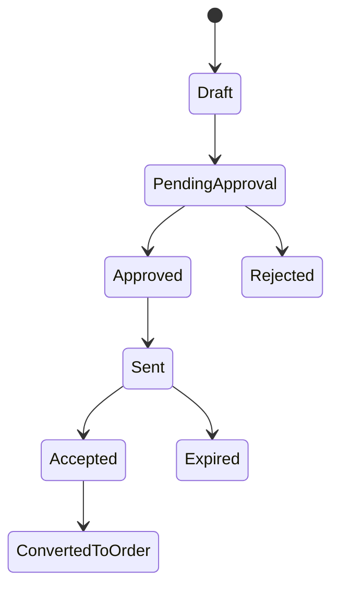
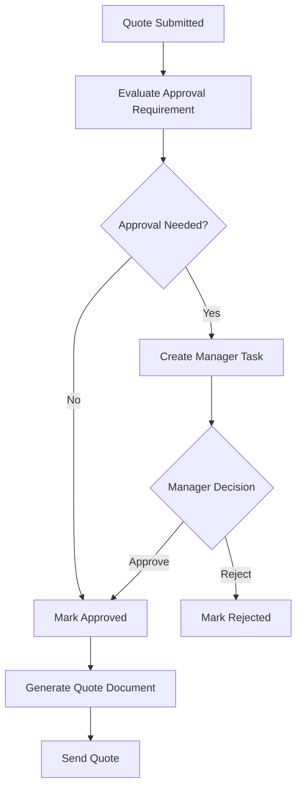
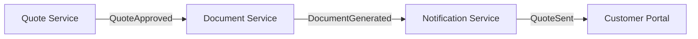
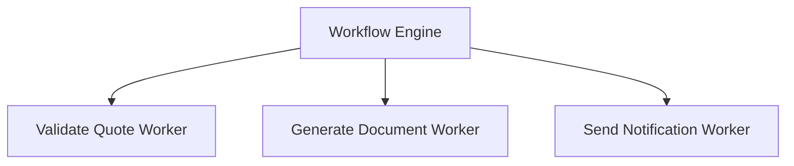

# Workflow vs State Machine vs Queue vs Scheduler vs Rules Engine

> Fokus part ini: membangun decision framework. Senior engineer tidak boleh default ke workflow engine untuk semua masalah. Workflow engine adalah alat kuat, tetapi bukan palu untuk semua paku.

---

## 1. Core question

Pertanyaan utama part ini:

```text
Kapan kita butuh workflow engine, dan kapan cukup memakai state machine, queue, scheduler, rules engine, saga choreography, atau case management?
```

Jawaban pendek:

```text
Gunakan workflow engine ketika masalah utamanya adalah koordinasi proses bisnis jangka panjang yang membutuhkan visibility, wait state, human task, timeout, retry, escalation, audit, dan recoverability.

Jangan gunakan workflow engine hanya untuk menggantikan if/else, queue consumer, cron job, atau state transition sederhana.
```

Workflow engine paling bernilai ketika proses memiliki banyak dimensi berikut sekaligus:

- long-running,
- cross-service,
- human-in-the-loop,
- async event/callback,
- SLA/timer,
- retry/incident,
- compensation/manual repair,
- auditability,
- versioned process model,
- operational dashboard,
- business-readable process contract.

Jika hanya satu atau dua dimensi sederhana yang ada, alternatif lain mungkin lebih tepat.

---

## 2. Coordination models overview

Dalam enterprise backend, ada beberapa model koordinasi umum.

```text
State machine      -> mengontrol lifecycle satu entity
Workflow engine    -> mengorkestrasi proses bisnis lintas step/entity/system/manusia
Queue              -> mendistribusikan work secara asynchronous
Scheduler          -> menjalankan pekerjaan berdasarkan waktu
Rules engine/DMN   -> mengevaluasi keputusan bisnis
Saga               -> mengelola distributed consistency lintas service
Choreography       -> koordinasi melalui event antar service tanpa central orchestrator
Case management    -> menangani kasus yang jalurnya fleksibel dan knowledge-worker-driven
```

Masalah production sering muncul ketika model ini dicampur tanpa boundary.

Contoh buruk:

```text
Quote status ada di DB.
Approval state ada di BPMN.
Retry state ada di queue.
Escalation state ada di scheduler.
Manual repair state ada di spreadsheet support.
```

Ini bukan distributed architecture. Ini distributed confusion.

---

## 3. Workflow engine decision signals

Gunakan workflow engine jika banyak sinyal berikut benar.

### 3.1 Process spans multiple steps

Contoh:

```text
Validate order -> reserve resources -> request downstream provisioning -> wait callback -> handle fallout -> notify customer
```

Jika step hanya satu operasi atomik, workflow engine mungkin berlebihan.

### 3.2 Process spans time

Jika proses selesai dalam satu HTTP request dan satu DB transaction, workflow engine mungkin tidak diperlukan.

Jika proses menunggu:

- approval,
- external callback,
- SLA timer,
- fulfillment completion,
- manual intervention,
- retry window,

maka workflow engine mulai relevan.

### 3.3 Process spans people and systems

Workflow engine bernilai tinggi ketika proses melibatkan:

- service automation,
- human task,
- manager approval,
- operations team,
- external system,
- customer action,
- partner integration.

### 3.4 Business wants visibility

Jika business atau operations sering bertanya:

```text
Order ini sekarang ada di tahap mana?
Kenapa quote ini belum dikirim?
Task approval siapa yang pending?
Berapa banyak order stuck di fulfillment?
SLA mana yang breach?
```

maka workflow visibility mungkin dibutuhkan.

### 3.5 Failure needs structured recovery

Workflow engine bernilai jika proses butuh:

- retry policy,
- incident state,
- manual repair,
- compensation,
- escalation,
- replay-like operational action,
- audit trail.

### 3.6 Process definition changes independently

Jika business process sering berubah dan harus direview sebagai artifact tersendiri, BPMN/DMN as code bisa memberi struktur.

Tetapi ini hanya aman jika ada:

- versioning,
- testing,
- deployment pipeline,
- compatibility discipline,
- migration strategy.

---

## 4. Workflow vs state machine

### 4.1 State machine mental model

State machine mengontrol lifecycle satu entity.

Contoh quote state:



State machine bagus untuk menjawab:

```text
Entity ini boleh berpindah dari state A ke state B atau tidak?
```

Contoh invariant:

```text
Quote cannot be sent before it is approved.
Order cannot be cancelled after fulfillment is complete unless reversal process exists.
```

### 4.2 Workflow mental model

Workflow menjawab:

```text
Langkah apa yang harus terjadi agar entity mencapai tujuan bisnis tertentu?
```

Contoh workflow quote approval:



Workflow bagus untuk menjawab:

```text
Siapa melakukan apa, kapan, menunggu apa, gagal bagaimana, retry bagaimana, dan selesai kapan?
```

### 4.3 Boundary rule

Gunakan state machine untuk entity invariant.

Gunakan workflow untuk process orchestration.

Contoh boundary sehat:

```text
Quote domain service:
  - validate legal transition
  - enforce invariant
  - persist quote status

Workflow:
  - call quote domain service at the right time
  - wait for approval task
  - handle timeout
  - trigger document generation
  - publish event after completion
```

### 4.4 Bad smell: workflow as state machine replacement

Bad smell:

- semua entity status hanya ada di BPMN current activity,
- database tidak tahu lifecycle entity,
- API harus query engine hanya untuk tahu status domain utama,
- manual DB repair tidak bisa dilakukan tanpa process surgery,
- process migration merusak domain state.

### 4.5 Bad smell: state machine pretending to be workflow

Bad smell sebaliknya:

- satu tabel status berisi 50 value,
- scheduler membaca status lalu menjalankan side effect,
- retry count disimpan manual,
- human approval tersembunyi sebagai flag,
- SLA dihitung query ad-hoc,
- failure path ada di wiki, bukan di model/code,
- operations tidak punya dashboard proses.

### 4.6 Decision

Gunakan state machine saja jika:

- hanya satu entity,
- transition sederhana,
- tidak ada human task kompleks,
- tidak ada long wait state,
- tidak perlu process diagram executable,
- observability cukup dari entity status.

Gunakan workflow + state machine jika:

- entity lifecycle penting,
- proses lintas step/system,
- ada human task/timer/callback,
- perlu audit proses,
- perlu retry/incident/manual repair.

---

## 5. Workflow vs saga

### 5.1 Saga mental model

Saga adalah pattern untuk distributed consistency tanpa global transaction.

Sebuah saga terdiri dari beberapa local transaction dan compensation action.

Contoh:

```text
Create order
  -> reserve inventory
  -> reserve network resource
  -> create billing account
  -> submit fulfillment
```

Jika step ketiga gagal, system mungkin perlu membatalkan step sebelumnya:

```text
Cancel billing account
Release network resource
Release inventory reservation
Cancel order
```

### 5.2 Workflow as saga orchestrator

Workflow engine bisa menjadi orchestrator saga.

```text
Workflow engine decides the next command.
Services perform local transactions.
Workers report success/failure.
Workflow triggers compensation when needed.
```

### 5.3 Saga without workflow engine

Saga bisa juga dilakukan tanpa workflow engine, misalnya dengan event choreography:

```text
OrderCreated event
  -> Inventory service reserves resource
  -> InventoryReserved event
  -> Billing service creates account
  -> BillingCreated event
  -> Fulfillment service starts provisioning
```

Keuntungan choreography:

- service lebih decoupled,
- tidak ada central process runtime,
- natural untuk event-driven architecture.

Risiko choreography:

- sulit melihat end-to-end progress,
- sulit menjawab “order ini stuck di mana?”,
- failure path tersebar,
- compensation tersebar,
- debugging butuh trace across services,
- business process tidak eksplisit.

### 5.4 Decision

Gunakan workflow-orchestrated saga jika:

- business process end-to-end harus visible,
- compensation kompleks,
- manual intervention dibutuhkan,
- order/quote lifecycle kritikal,
- operasi support perlu melihat progress,
- proses memiliki SLA dan escalation.

Gunakan choreography jika:

- service autonomy lebih penting,
- proses sederhana,
- event flow mudah dipahami,
- tidak perlu central operational view,
- setiap service punya recovery kuat,
- tracing/event observability matang.

---

## 6. Workflow vs event-driven choreography

### 6.1 Choreography mental model

Dalam choreography, tidak ada satu orchestrator pusat. Setiap service bereaksi terhadap event.



Setiap service tahu event apa yang dikonsumsi dan event apa yang dipublish.

### 6.2 Workflow orchestration mental model

Dalam orchestration, workflow menentukan urutan.



Worker tidak perlu tahu keseluruhan proses. Worker hanya menjalankan task.

### 6.3 Trade-off

| Concern | Choreography | Workflow orchestration |
|---|---|---|
| Service autonomy | Tinggi | Lebih rendah |
| End-to-end visibility | Sulit tanpa tracing matang | Lebih eksplisit |
| Business process readability | Tersebar | Terpusat di model |
| Local ownership | Kuat per service | Kuat di process owner |
| Failure recovery | Tersebar | Bisa dimodelkan eksplisit |
| Coupling | Event schema coupling | Process-worker contract coupling |
| Operational debugging | Butuh event trace | Butuh engine/worker visibility |

### 6.4 Hybrid is common

Di enterprise system, pola hybrid sering lebih realistis.

Contoh:

```text
Camunda orchestrates core order process.
Kafka distributes domain events.
Workers call services and publish events through outbox.
Some downstream services react choreographically.
```

Kuncinya adalah boundary jelas:

```text
Apa yang diorkestrasi oleh workflow?
Apa yang dibiarkan event-driven?
Apa source of truth untuk state?
```

---

## 7. Workflow vs queue

### 7.1 Queue mental model

Queue mendistribusikan pekerjaan async.

Contoh:

```text
Message: GenerateQuoteDocument
Consumer: DocumentWorker
```

Queue bagus untuk:

- decoupling producer-consumer,
- buffering load,
- async processing,
- retry delivery,
- fanout/routing,
- smoothing spikes.

### 7.2 Queue is not process model

Queue tidak secara natural menjawab:

- proses end-to-end ada di step mana,
- apakah step sebelumnya selesai,
- apakah human approval pending,
- apakah timer SLA sudah lewat,
- compensation apa yang harus dijalankan,
- process version apa yang digunakan,
- task mana yang aging,
- business process mana yang stuck.

Anda bisa membangun semua itu di atas queue, tetapi saat itulah Anda sedang membangun workflow engine custom.

### 7.3 Queue failure modes

Queue-based workflow manual biasanya gagal karena:

- poison message,
- duplicate delivery,
- retry loop tanpa business context,
- DLQ tidak dimonitor,
- message order assumption salah,
- consumer update DB lalu crash sebelum publish next message,
- replay menghasilkan duplicate side effect,
- tidak ada end-to-end process visibility.

### 7.4 Decision

Gunakan queue jika:

- tugas independen,
- hanya butuh async processing,
- tidak ada branching kompleks,
- tidak ada human task,
- tidak perlu end-to-end process model,
- DLQ/retry cukup untuk recovery.

Gunakan workflow engine jika:

- queue message adalah bagian dari proses lebih besar,
- proses perlu wait state dan branching,
- perlu human task/timer/compensation,
- operations perlu melihat progress process instance.

---

## 8. Workflow vs scheduler

### 8.1 Scheduler mental model

Scheduler menjalankan sesuatu berdasarkan waktu.

Contoh:

```text
Every 5 minutes: find pending orders and retry fulfillment.
Every night: expire old quotes.
Every hour: escalate overdue approvals.
```

Scheduler bagus untuk:

- periodic job,
- batch cleanup,
- reconciliation,
- polling external system,
- maintenance task,
- report generation.

### 8.2 Scheduler as hidden workflow smell

Scheduler menjadi masalah ketika ia menyembunyikan proses bisnis.

Bad smell:

```text
Cron job reads status = PENDING_APPROVAL and due_date < now.
Then it updates status = ESCALATED.
Another cron reads ESCALATED and sends email.
Another consumer waits for approval reply.
```

Jika business process penting tersebar dalam query scheduler, sulit untuk:

- melihat process lifecycle,
- mereview business flow,
- versioning,
- men-debug stuck state,
- menambahkan compensation,
- memberi audit trail.

### 8.3 Workflow timer vs scheduler

Workflow timer cocok ketika waktu adalah bagian dari process instance.

Contoh:

```text
Quote approval task waits 3 business days.
If not completed, escalate to regional manager.
```

Scheduler cocok ketika waktu adalah maintenance/batch concern.

Contoh:

```text
Every night, archive completed workflow history older than retention threshold.
```

### 8.4 Decision

Gunakan scheduler jika:

- pekerjaan periodik global,
- tidak perlu per-instance lifecycle,
- tidak perlu BPMN visibility,
- failure bisa ditangani batch retry/reconciliation.

Gunakan workflow timer jika:

- timeout melekat pada process instance,
- SLA per task/per order/per quote,
- escalation path berbeda per proses,
- operations perlu melihat timer backlog dan overdue task.

---

## 9. Workflow vs rules engine / DMN

### 9.1 Rules mental model

Rules engine atau DMN menjawab:

```text
Berdasarkan input ini, keputusan bisnis apa yang berlaku?
```

Contoh:

```text
If discountPercent > 30 and customerTier != ENTERPRISE:
  approvalRequired = true
  approverGroup = SALES_MANAGER
```

Rules/DMN bagus untuk:

- decision table,
- eligibility,
- approval routing,
- pricing decision,
- validation rule,
- policy rule,
- business-owned decision logic.

### 9.2 Workflow mental model

Workflow menjawab:

```text
Setelah keputusan diketahui, langkah proses apa yang harus dilakukan?
```

Contoh:

```text
Evaluate approval rule
  -> if approvalRequired: create user task
  -> else: continue auto approval
```

### 9.3 Bad smell: rules hidden in BPMN gateways

Bad smell:

```text
Gateway expression contains large business rule:
${customer.type == 'A' && product.family == 'X' && discount > 0.23 && ...}
```

Masalah:

- rule sulit diuji,
- business tidak bisa review dengan mudah,
- expression menjadi fragile,
- audit decision lemah,
- rule reuse buruk.

### 9.4 Bad smell: rules engine controlling workflow

Sebaliknya, rules engine juga tidak seharusnya mengatur long-running lifecycle.

Bad smell:

```text
Rules engine decides next process step, retry, escalation, compensation, and task assignment in one giant decision blob.
```

Rules menentukan keputusan. Workflow mengatur perjalanan proses.

### 9.5 Decision

Gunakan DMN/rules jika:

- problem adalah business decision,
- input-output jelas,
- decision perlu audit,
- rule sering berubah,
- rule bisa diuji independen.

Gunakan workflow jika:

- problem adalah orchestration,
- ada urutan task,
- ada wait state,
- ada human task,
- ada retry/timer/incident.

Gunakan keduanya jika:

```text
Workflow calls decision table to decide routing, then workflow executes the selected path.
```

---

## 10. Workflow vs case management

### 10.1 Case management mental model

Case management cocok untuk pekerjaan yang tidak sepenuhnya linear dan sangat bergantung pada judgment manusia.

Contoh:

- fraud investigation,
- legal case handling,
- complex complaint resolution,
- exception/fallout case with unpredictable path,
- regulatory enforcement case.

Case biasanya memiliki:

- banyak optional task,
- knowledge worker menentukan next action,
- data gathering,
- ad-hoc task,
- milestone,
- discretionary decision,
- collaboration.

### 10.2 Workflow mental model

Workflow cocok untuk proses yang jalurnya relatif bisa dimodelkan:

- start jelas,
- path utama jelas,
- event/timer jelas,
- completion criteria jelas,
- exception path masih bisa dimodelkan.

### 10.3 CPQ/order context

Order fulfillment bisa workflow.

Fallout handling kadang lebih mirip case management, terutama jika:

- penyebab fallout banyak variasi,
- operator menentukan langkah repair,
- perlu komunikasi lintas tim,
- task bisa dibuat ad-hoc,
- tidak semua path bisa diprediksi.

Pendekatan realistis:

```text
Workflow detects fallout and opens a fallout case.
Case management handles investigation and repair.
When case resolved, workflow receives message and continues.
```

### 10.4 Decision

Gunakan workflow jika proses dapat dimodelkan sebagai flow relatif deterministik.

Gunakan case management jika pekerjaan bersifat knowledge-worker-driven dan jalur eksekusinya tidak dapat diprediksi secara penuh.

Gunakan hybrid jika workflow utama deterministik tetapi exception handling membutuhkan case-based operation.

---

## 11. Decision matrix

Gunakan matrix berikut sebagai heuristic awal.

| Scenario | State machine | Queue | Scheduler | Rules/DMN | Workflow engine |
|---|---:|---:|---:|---:|---:|
| Simple entity lifecycle | High | Low | Low | Low | Low |
| Async one-step task | Low | High | Low | Low | Low |
| Periodic cleanup | Low | Low | High | Low | Low |
| Business decision table | Low | Low | Low | High | Medium |
| Human approval with SLA | Medium | Low | Medium | Medium | High |
| Multi-service order fulfillment | Medium | Medium | Low | Medium | High |
| Event-driven notification | Low | High | Low | Low | Low/Medium |
| Long-running saga with compensation | Medium | Medium | Low | Medium | High |
| Fallout/manual intervention | Medium | Medium | Medium | Medium | High/Case management |
| High-volume independent messages | Low | High | Low | Low | Low/Medium |
| Business-readable process needed | Low | Low | Low | Medium | High |
| End-to-end process monitoring needed | Medium | Low | Low | Low | High |

Matrix ini bukan aturan absolut. Gunakan sebagai starting point untuk architecture discussion.

---

## 12. Decision tree

Gunakan decision tree berikut saat mereview requirement.

```text
1. Apakah ini hanya validasi/keputusan bisnis murni?
   -> Ya: pertimbangkan code/DMN/rules engine.
   -> Tidak: lanjut.

2. Apakah ini hanya transition satu entity?
   -> Ya: pertimbangkan state machine/domain service.
   -> Tidak: lanjut.

3. Apakah ini hanya async one-step processing?
   -> Ya: pertimbangkan queue.
   -> Tidak: lanjut.

4. Apakah ini hanya periodic maintenance?
   -> Ya: pertimbangkan scheduler.
   -> Tidak: lanjut.

5. Apakah proses melewati banyak step, sistem, manusia, timer, callback, retry, dan failure path?
   -> Ya: workflow engine layak dipertimbangkan.
   -> Tidak: cari alternatif lebih sederhana.

6. Apakah process visibility, audit, SLA, incident handling, dan manual repair penting?
   -> Ya: workflow engine semakin kuat.
   -> Tidak: event choreography/state machine mungkin cukup.

7. Apakah proses sangat fleksibel/ad-hoc dan ditentukan knowledge worker?
   -> Ya: pertimbangkan case management atau hybrid.
   -> Tidak: BPMN workflow mungkin cocok.
```

---

## 13. Concrete CPQ/order examples

### 13.1 Quote draft update

Requirement:

```text
Sales user updates quote item quantity.
```

Better fit:

```text
Domain service + state validation + PostgreSQL transaction
```

Workflow engine biasanya berlebihan.

### 13.2 High discount approval

Requirement:

```text
If discount exceeds threshold, manager approval is required. If no response in 3 days, escalate.
```

Better fit:

```text
Workflow + DMN/rules + human task + timer + state machine
```

Why:

- decision rule,
- human approval,
- SLA timer,
- audit,
- task ownership,
- process visibility.

### 13.3 Generate quote document asynchronously

Requirement:

```text
Generate PDF after quote approved.
```

Better fit depends.

If isolated:

```text
Queue worker
```

If part of approval/send process:

```text
Workflow service task/job worker
```

### 13.4 Expire old quotes nightly

Requirement:

```text
Expire quotes older than validity date.
```

Better fit:

```text
Scheduler/batch job
```

But if each quote has explicit lifecycle timer and SLA notification, workflow timer may be justified.

### 13.5 Order fulfillment orchestration

Requirement:

```text
Validate order, decompose order, submit multiple fulfillment requests, wait for callbacks, handle fallout, reconcile completion.
```

Better fit:

```text
Workflow engine + state machine + event integration + saga/compensation
```

Why:

- multi-step,
- multi-system,
- external callbacks,
- partial failure,
- manual intervention,
- visibility,
- reconciliation.

### 13.6 Product eligibility decision

Requirement:

```text
Given customer segment, geography, product family, and contract type, decide product eligibility.
```

Better fit:

```text
DMN/rules engine or code rule module
```

Workflow may call the decision, but workflow should not contain all rule complexity.

### 13.7 Fallout investigation

Requirement:

```text
Order provisioning failed for unknown reason. Operations team investigates and decides repair path.
```

Better fit:

```text
Hybrid workflow + case management/manual task
```

Workflow detects fallout and tracks SLA. Human/case process handles investigation.

---

## 14. Architecture boundary patterns

### 14.1 State machine + workflow

```text
Workflow:
  - orchestrates quote approval process

Quote service:
  - owns quote state transition
  - enforces invariant
  - writes PostgreSQL

Workflow worker:
  - calls QuoteService.approveQuote(command)
  - completes job after domain update succeeds
```

Correctness rule:

```text
Workflow asks for transition.
Domain service decides whether transition is legal.
```

### 14.2 Workflow + queue

```text
Workflow service task/job:
  -> worker creates outbox record
  -> outbox publisher emits Kafka/RabbitMQ message
  -> downstream service processes message
  -> downstream emits completion event
  -> workflow correlates completion message
```

Correctness rule:

```text
Do not rely on in-memory publish after DB commit unless duplicate/loss behavior is understood.
```

### 14.3 Workflow + scheduler

```text
Workflow timer:
  - per-instance SLA and timeout

Scheduler:
  - global reconciliation and cleanup
```

Correctness rule:

```text
Do not use scheduler as hidden substitute for per-instance workflow timeout unless that is an explicit architecture decision.
```

### 14.4 Workflow + DMN/rules

```text
Workflow:
  - calls decision
  - routes based on decision result

DMN/rules:
  - contains decision table
  - returns approvalRequired, approverGroup, riskLevel
```

Correctness rule:

```text
Do not bury large business rules inside gateway expressions.
```

---

## 15. Failure model comparison

Different coordination models fail differently.

| Model | Common failure | Detection | Repair |
|---|---|---|---|
| State machine | illegal transition, concurrent update | DB constraint, audit log, optimistic lock error | corrective transition/manual DB-safe operation |
| Queue | poison message, duplicate delivery, DLQ buildup | broker metrics, consumer logs, DLQ dashboard | replay, dead-letter handling, idempotent consumer |
| Scheduler | missed run, overlapping run, slow batch | scheduler logs, job metrics | rerun, lock fix, batch repair |
| Rules/DMN | wrong decision, stale rule, bad input | decision audit, test failure | rule rollback/version fix |
| Workflow | stuck process, incident, failed job, missing correlation | Cockpit/Operate/dashboard, worker metrics | retry, variable fix, compensation, migration, manual repair |
| Choreography | lost trace, inconsistent event chain | distributed tracing, event audit | replay, compensating event, manual reconciliation |
| Case management | unresolved case, wrong assignment, SLA breach | case dashboard, task aging | reassignment, escalation, manual closure |

Senior engineer harus memilih model bukan hanya berdasarkan happy path, tetapi berdasarkan failure detection dan repair path.

---

## 16. Observability comparison

Workflow engine memberi process-level observability, tetapi tidak menggantikan distributed observability.

Anda tetap butuh:

- application logs,
- worker metrics,
- correlation ID,
- distributed tracing,
- DB audit,
- broker metrics,
- dashboard incident,
- business KPI dashboard.

Workflow-specific observability:

- active process count,
- stuck process count,
- current activity distribution,
- failed job count,
- incident count,
- task aging,
- SLA breach,
- timer backlog,
- message correlation failure,
- worker latency,
- retry exhaustion.

Queue-specific observability:

- queue depth,
- consumer lag,
- DLQ count,
- redelivery rate,
- publish failure,
- broker connection health.

State-machine-specific observability:

- entity count by status,
- transition failure,
- illegal transition attempt,
- state aging,
- reconciliation mismatch.

The best production systems combine these views.

---

## 17. Performance comparison

Workflow engine introduces overhead.

Common overhead:

- process instance persistence,
- job creation,
- variable serialization,
- history/audit writes,
- worker polling/activation,
- incident tracking,
- dashboard/search indexing,
- timer management.

This overhead is acceptable when process visibility and recoverability matter.

This overhead is wasteful when all you need is:

```text
consume message -> update table -> publish event
```

Performance decision questions:

- How many process instances per day?
- How many jobs per instance?
- How large are variables?
- How many timers?
- How many user tasks?
- How many workers?
- What is expected throughput?
- What latency matters: business cycle time or millisecond response time?
- What is failure cost?
- What is operational visibility worth?

Workflow engine is rarely the right tool for ultra-low-latency synchronous paths.

It is often the right tool for mission-critical, auditable, long-running processes.

---

## 18. Security and privacy comparison

Workflow engine can increase security risk if process data is copied into variables and task forms without discipline.

Risks:

- PII stored in process variables,
- secrets passed to connectors,
- sensitive data shown in Tasklist/Operate/Cockpit,
- incident payload exposing customer data,
- worker logs dumping variables,
- admin users seeing data across tenants,
- history retention longer than policy,
- process model exposing business-sensitive logic.

Alternative models also have risk:

- queue messages with PII,
- scheduler logs with payload,
- state table with weak access control,
- rules audit exposing sensitive input,
- case notes containing unredacted data.

Decision principle:

```text
Choose the model whose data exposure you can govern, audit, and operate.
```

---

## 19. Common architecture mistakes

### 19.1 Using Camunda because diagram looks professional

A BPMN diagram does not justify a workflow engine.

Justification should come from:

- lifecycle complexity,
- operational need,
- failure recovery,
- human task,
- SLA,
- audit,
- process versioning.

### 19.2 Hiding workflow in service code

If process has many steps and failures, hiding it in service code creates invisible workflow.

Symptoms:

- giant service method,
- dozens of status updates,
- manual retry endpoints,
- scheduler repair jobs,
- event handlers that encode business process implicitly,
- support team asking engineering to trace every stuck case manually.

### 19.3 Splitting one business process across too many mechanisms

Example:

```text
Approval in BPMN.
Timeout in scheduler.
Retry in RabbitMQ.
State in PostgreSQL.
Notification in Kafka.
Manual repair in script.
```

This may be valid only if ownership and observability are explicit. Otherwise it becomes un-debuggable.

### 19.4 Treating workflow engine as database

Bad:

```text
Store entire quote/order payload as process variable and query engine as primary data source.
```

Better:

```text
Store business entity in PostgreSQL.
Store IDs and small orchestration context in workflow variables.
```

### 19.5 Ignoring idempotency because engine has retries

Engine retry makes idempotency more important, not less.

---

## 20. Review checklist for architecture discussion

Use checklist berikut sebelum memilih workflow engine.

### 20.1 Business process clarity

- Apa tujuan bisnis proses ini?
- Apa start trigger-nya?
- Apa end state sukses/gagal?
- Apakah flow dapat dimodelkan dengan cukup deterministik?
- Apakah ada path manual/ad-hoc yang lebih cocok case management?

### 20.2 State ownership

- Entity apa yang diproses?
- Apa source of truth entity state?
- Apa source of truth process state?
- Bagaimana entity state dan process state direkonsiliasi?
- Apakah ada duplicate status field?

### 20.3 Human/task requirement

- Apakah ada user task?
- Siapa candidate group/assignee?
- Apakah ada claim/unclaim?
- Apakah ada SLA/due date?
- Bagaimana stale task/concurrent completion ditangani?

### 20.4 Integration complexity

- Sistem apa saja yang terlibat?
- Apakah memakai Kafka/RabbitMQ?
- Apakah external callback diperlukan?
- Apakah correlation key jelas?
- Apakah duplicate/out-of-order event aman?

### 20.5 Failure and recovery

- Apa retry policy?
- Apa incident policy?
- Apa compensation path?
- Apa manual repair path?
- Apa yang terjadi setelah partial success?

### 20.6 Operational readiness

- Dashboard apa yang tersedia?
- Alert apa yang dibutuhkan?
- Siapa owner incident?
- Apakah ada runbook?
- Apakah support team bisa memahami state proses?

### 20.7 Security/privacy

- Data apa yang masuk variable?
- Apakah ada PII/secret?
- Siapa bisa melihat task/variable/incident?
- Apa retention policy?
- Apakah audit trail cukup?

### 20.8 Deployment/versioning

- Bagaimana BPMN/DMN dideploy?
- Bagaimana process version dikelola?
- Bagaimana running instance lama ditangani?
- Apakah worker compatible dengan versi proses lama?
- Apakah rollback mungkin?

---

## 21. Internal verification checklist

Gunakan checklist ini di codebase dan environment CSG/team.

### 21.1 Identify actual coordination mechanism

- Apakah proses memakai Camunda?
- Jika ya, Camunda 7 atau Camunda 8?
- Jika tidak, apakah memakai custom workflow/state machine?
- Apakah proses memakai Kafka choreography?
- Apakah proses memakai RabbitMQ command queue?
- Apakah scheduler menjalankan sebagian lifecycle?
- Apakah Redis dipakai untuk lock/idempotency/cache?

### 21.2 Map process to business entity

- Quote/order entity apa yang terkait?
- Status entity apa saja?
- Status mana yang berasal dari workflow?
- Status mana yang berasal dari domain service?
- Apakah status duplicated di beberapa tabel/system?

### 21.3 Find hidden workflow

Cari tanda-tanda workflow tersembunyi:

- enum status sangat panjang,
- service method besar dengan banyak branching,
- cron job yang mengubah status bisnis,
- queue consumer yang memutuskan next business step,
- manual SQL script untuk stuck case,
- support runbook yang menjelaskan flow berbeda dari code.

### 21.4 Evaluate workflow need

Untuk setiap proses penting, tandai:

- long-running: yes/no,
- human task: yes/no,
- timer/SLA: yes/no,
- external callback: yes/no,
- retry/incident: yes/no,
- compensation: yes/no,
- audit requirement: yes/no,
- business visibility requirement: yes/no.

Semakin banyak `yes`, semakin kuat alasan workflow engine.

### 21.5 Check operational maturity

- Apakah ada dashboard process stuck?
- Apakah ada alert task aging?
- Apakah ada DLQ dashboard jika queue digunakan?
- Apakah ada reconciliation report?
- Apakah ada incident ownership?
- Apakah ada runbook retry/manual repair?

---

## 22. Practical exercise

Ambil tiga proses dari domain CPQ/order management:

1. quote discount approval,
2. order fulfillment,
3. nightly quote expiration.

Untuk masing-masing, jawab:

```text
1. Apakah ini entity state problem, process orchestration problem, decision problem, async work problem, atau periodic job problem?
2. Model apa yang paling cocok: state machine, workflow, queue, scheduler, DMN/rules, choreography, case management, atau hybrid?
3. Apa failure mode utama?
4. Bagaimana mendeteksi stuck/failure?
5. Bagaimana repair dilakukan?
6. Apa source of truth state-nya?
7. Apa yang harus masuk process variable jika workflow dipakai?
8. Apa yang harus tetap di PostgreSQL?
```

Tujuan exercise ini adalah melatih architecture judgment, bukan memilih Camunda untuk semua hal.

---

## 23. Key takeaways

- Workflow engine adalah alat koordinasi proses bisnis jangka panjang, bukan pengganti semua backend logic.
- State machine cocok untuk lifecycle satu entity dan invariant transition.
- Queue cocok untuk async work distribution, bukan end-to-end process visibility.
- Scheduler cocok untuk periodic job, bukan hidden business process.
- Rules/DMN cocok untuk decision logic, bukan lifecycle orchestration.
- Saga adalah pattern consistency; workflow engine bisa menjadi orchestrator saga, tetapi saga juga bisa choreographed.
- Case management cocok untuk pekerjaan ad-hoc yang knowledge-worker-driven.
- Banyak enterprise system yang sehat memakai hybrid model.
- Kunci senior-level adalah boundary placement: apa yang dimiliki workflow, domain service, database, broker, scheduler, rules, dan operations.

---

## 24. References

- [Camunda 8 Docs — Processes](https://docs.camunda.io/docs/components/concepts/processes/)
- [Camunda 8 Docs — Service Tasks](https://docs.camunda.io/docs/components/modeler/bpmn/service-tasks/)
- [Camunda 8 Docs — Job Workers](https://docs.camunda.io/docs/components/concepts/job-workers/)
- [Camunda 8 Docs — Incidents](https://docs.camunda.io/docs/components/concepts/incidents/)
- [Camunda 8 Docs — Writing Good Workers](https://docs.camunda.io/docs/components/best-practices/development/writing-good-workers/)
- [Camunda 8 Docs — Outbound Connectors vs Job Workers](https://docs.camunda.io/docs/components/concepts/outbound-connectors-job-workers/)
- [Camunda 7 Docs — Get Started](https://docs.camunda.org/get-started/)
- [Camunda Blog — Migrating Solutions from Camunda 7 to Camunda 8: Strategy Update](https://camunda.com/blog/2025/02/migrating-solutions-camunda-7-camunda-8-strategy-update/)
