# BPMN Execution Mental Model

> Fokus part ini: memahami BPMN sebagai model eksekusi, bukan hanya diagram proses. Targetnya adalah Anda bisa membaca process definition, process instance, token movement, wait state, job, variable, incident, retry, dan completion sebagai runtime behavior yang punya konsekuensi nyata ke Java/JAX-RS service, database, message broker, worker, dan operasi production.

BPMN sering terlihat seperti flowchart. Untuk level senior engineer, cara pandang itu berbahaya.

BPMN bukan hanya gambar. BPMN adalah model eksekusi proses bisnis. Ketika sebuah diagram BPMN dideploy ke engine, diagram itu menjadi process definition. Ketika process definition dijalankan, engine membuat process instance. Ketika process instance bergerak dari satu node ke node lain, engine mengelola execution state, variable, wait state, job, timer, incident, dan completion semantics.

Kalau Anda gagal memahami runtime model ini, Anda akan salah membaca masalah production.

Contoh kesalahan umum:

- mengira proses stuck karena “diagramnya salah”, padahal worker tidak menyelesaikan job;
- mengira retry aman, padahal worker sudah melakukan side effect sebelum gagal;
- mengira token berhenti secara misterius, padahal sedang menunggu message correlation;
- mengira process instance selesai, padahal masih ada parallel branch aktif;
- mengira user task hanya UI item, padahal ia adalah wait state proses;
- mengira process variable sama dengan database state;
- mengira BPMN error sama dengan Java exception;
- mengira Camunda 7 dan Camunda 8 menjalankan BPMN dengan mekanisme internal yang sama.

Part ini membangun model mental eksekusi yang akan dipakai di seluruh seri.

---

## 1. Dari Diagram ke Runtime

Secara konseptual, lifecycle BPMN di engine adalah:

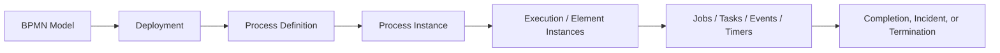

Penjelasan ringkas:

- **BPMN model** adalah file desain proses.
- **Deployment** adalah proses mendaftarkan model ke engine.
- **Process definition** adalah versi executable dari model.
- **Process instance** adalah satu eksekusi konkret dari definition.
- **Execution state** adalah posisi runtime proses.
- **Job/task/event/timer** adalah unit kerja atau wait state yang membuat proses bergerak atau berhenti.
- **Completion/incident/termination** adalah outcome runtime.

Dalam CPQ/order management:

- BPMN model: “Quote Approval Process”.
- Process definition: versi deployed dari “Quote Approval Process”.
- Process instance: quote `Q-2026-000381` sedang menjalani approval.
- Current activity: “Manager Approval”.
- Process variable: `quoteId`, `customerSegment`, `discountPercent`, `approvalLevel`.
- Job: “Validate Pricing Exception”.
- Incident: worker gagal memanggil pricing service setelah retry habis.

Mental model penting: diagram adalah blueprint; process instance adalah eksekusi nyata; engine state adalah sumber observasi runtime.

---

## 2. Process Definition

**Process definition** adalah representasi executable dari BPMN model yang sudah dideploy.

Process definition biasanya memiliki:

- process key;
- version;
- deployment id/key;
- BPMN resource name;
- tenant atau environment context jika multi-tenant;
- metadata deployment;
- reference ke activity, event, gateway, dan variable mapping.

Dalam Camunda 7, process definition tersimpan di database engine dan diakses melalui repository/runtime service.

Dalam Camunda 8/Zeebe, process definition dideploy ke cluster orchestration dan memiliki key/version yang dipakai saat process instance dibuat.

### Kesalahan umum

Kesalahan paling sering adalah menganggap “process key” selalu menunjuk ke satu model tunggal. Di production, satu process key bisa punya banyak version.

Akibatnya:

- instance lama masih berjalan di versi lama;
- instance baru bisa mulai di versi terbaru;
- worker harus compatible dengan beberapa versi proses;
- variable schema harus backward compatible;
- message correlation bisa gagal kalau nama message atau key berubah;
- debugging harus selalu dimulai dari process definition version, bukan hanya process key.

### Review question

Saat melihat incident, pertanyaan pertama bukan “diagram mana?” tetapi:

> Process instance ini berjalan di process definition key dan version berapa?

---

## 3. Process Instance

**Process instance** adalah satu eksekusi konkret dari process definition.

Contoh:

- Process definition: `quote-approval-process:v12`.
- Process instance: approval untuk quote `Q-77821`.

Satu definition bisa punya ribuan, jutaan, atau puluhan juta instance sepanjang umur sistem.

Process instance memiliki lifecycle:

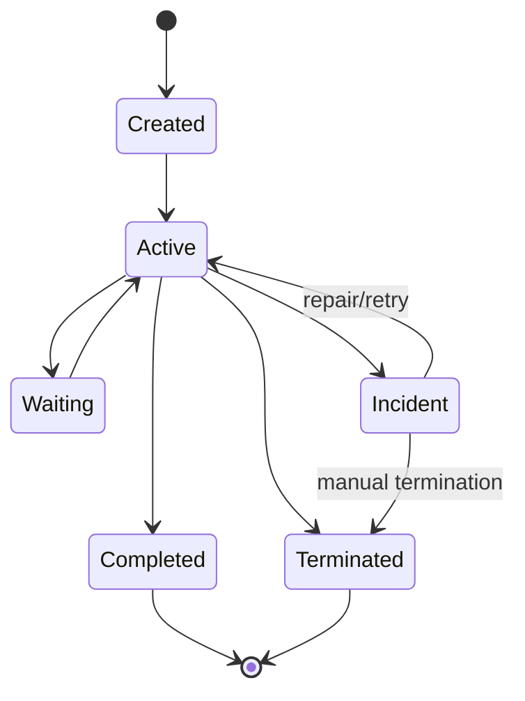

Tidak semua engine mengekspose state dengan nama yang persis sama, tetapi secara operasional inilah state yang perlu Anda pikirkan.

### Process instance bukan entity bisnis

Process instance bukan quote, bukan order, bukan customer account.

Process instance adalah execution state dari proses.

Quote/order tetap perlu domain model sendiri di database bisnis. Kalau process instance dipakai sebagai satu-satunya storage domain state, sistem akan sulit:

- query business state;
- audit business invariant;
- melakukan reporting;
- melakukan migration;
- melakukan reconciliation;
- melakukan manual repair dengan aman.

Aturan praktis:

- process instance menyimpan orchestration context;
- database bisnis menyimpan business state;
- event log/message broker menyimpan integration history;
- observability stack menyimpan operational signal.

---

## 4. Token sebagai Model Mental Eksekusi

Dalam BPMN, “token” adalah cara berpikir tentang posisi proses.

Token bergerak melalui sequence flow dari satu flow node ke flow node lain.

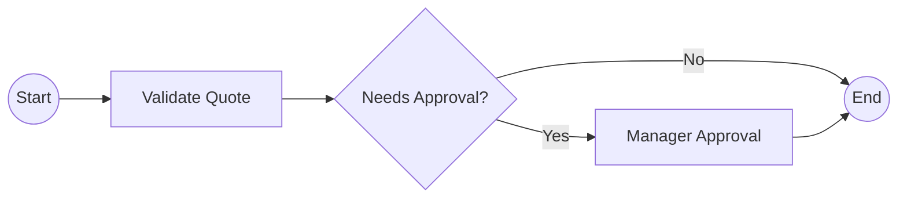

Pada proses di atas:

1. token dimulai di start event;
2. token masuk ke `Validate Quote`;
3. token masuk ke exclusive gateway;
4. token memilih satu path;
5. token berhenti di user task atau lanjut ke end event.

### Catatan penting Camunda 7 vs Camunda 8

Di Camunda 7, konsep token dekat dengan konsep execution dalam process engine.

Di Camunda 8/Zeebe, dokumentasi dan API lebih sering berbicara tentang process instance, element instance, job, dan record. Namun sebagai model mental, token tetap berguna untuk membaca aliran proses.

Jangan terlalu literal. Gunakan token untuk reasoning, bukan untuk mengasumsikan struktur internal engine sama.

---

## 5. Activity

**Activity** adalah node BPMN yang melakukan atau merepresentasikan pekerjaan.

Contoh activity:

- service task;
- user task;
- script task;
- business rule task;
- send task;
- receive task;
- subprocess;
- call activity.

Activity memiliki lifecycle:

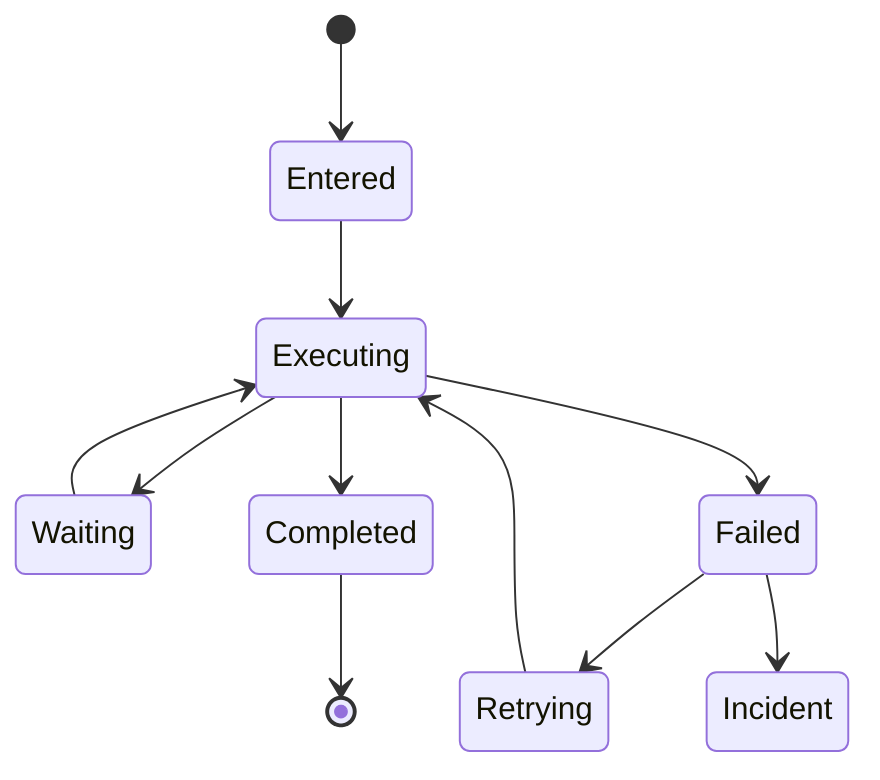

Tidak semua activity memiliki semua state. Service task bisa membuat job. User task bisa menunggu manusia. Receive task bisa menunggu message. Timer event bisa menunggu waktu.

Yang penting: setiap activity punya runtime semantics.

Saat mereview BPMN, jangan hanya bertanya:

> Ini activity apa?

Tanya juga:

> Siapa yang menjalankan? Apa input-nya? Apa output-nya? Di mana ia menunggu? Apa failure mode-nya? Apa retry policy-nya? Apa side effect-nya? Bagaimana observability-nya?

---

## 6. Sequence Flow

**Sequence flow** menentukan arah pergerakan token dari satu node ke node lain.

Sequence flow bisa:

- unconditional;
- conditional;
- default flow;
- bagian dari split;
- bagian dari join.

Kesalahan sequence flow bisa menyebabkan:

- path tidak pernah dipilih;
- path selalu dipilih;
- gateway ambiguity;
- stuck process;
- unexpected branch;
- process selesai terlalu cepat;
- parallel branch tidak pernah join.

Dalam process review, sequence flow perlu dibaca sebagai executable routing rule, bukan garis visual.

---

## 7. Gateway

Gateway mengatur flow control.

Jenis gateway umum:

- exclusive gateway;
- parallel gateway;
- inclusive gateway;
- event-based gateway;
- complex gateway, meskipun biasanya perlu dihindari kecuali benar-benar perlu.

Gateway bukan tempat ideal untuk menyimpan business rule kompleks.

Gateway idealnya menjawab pertanyaan routing yang sederhana:

- apakah approval diperlukan?
- apakah validasi sukses?
- apakah fulfillment perlu manual review?
- apakah order akan cancel, amend, atau lanjut?

Jika expression gateway mulai berisi rule yang panjang, nested, dan sulit diuji, pindahkan ke:

- domain service;
- DMN decision table;
- rules engine;
- dedicated decision service.

Gateway memengaruhi correctness secara langsung. Parallel gateway yang salah bisa membuat proses menunggu join yang tidak pernah terjadi. Exclusive gateway tanpa default path bisa gagal saat tidak ada condition yang match.

---

## 8. Event

Event merepresentasikan sesuatu yang terjadi.

Contoh:

- process dimulai;
- message diterima;
- timer jatuh tempo;
- error bisnis terjadi;
- escalation dibutuhkan;
- compensation dipanggil;
- process dihentikan.

Event membuat BPMN cocok untuk long-running process karena proses tidak harus berjalan terus-menerus di thread yang sama. Proses bisa berhenti dan menunggu event.

Contoh event-based thinking:

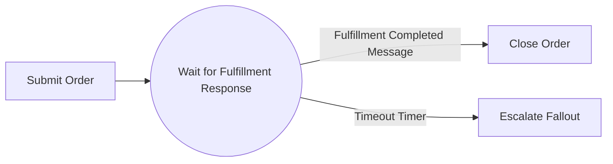

Di sini proses tidak sedang melakukan polling aktif setiap detik. Proses berada pada wait state sampai message atau timer terjadi.

---

## 9. Task

Task adalah activity yang merepresentasikan unit kerja.

Jenis task yang umum:

- **service task**: automated work;
- **user task**: pekerjaan manusia;
- **script task**: logic kecil dalam model;
- **business rule task**: decision evaluation;
- **send task**: mengirim message/request;
- **receive task**: menunggu message;
- **manual task**: dokumentasi pekerjaan manual yang tidak dieksekusi engine secara teknis.

Untuk senior backend engineer, task harus dibaca sebagai contract.

Service task contract:

- job type/topic/delegate apa?
- input variable apa?
- output variable apa?
- side effect apa?
- retry policy apa?
- timeout berapa?
- idempotency key apa?
- failure dilaporkan sebagai apa?

User task contract:

- siapa candidate group?
- siapa assignee?
- data apa yang ditampilkan?
- action apa yang boleh dilakukan?
- SLA berapa?
- audit trail apa?
- authorization bagaimana?

Task yang tidak punya contract adalah sumber incident masa depan.

---

## 10. Variable

Process variable adalah data runtime yang dipakai engine untuk routing, worker input, task form, message correlation, dan audit process context.

Variable bukan tempat menaruh seluruh aggregate bisnis.

Contoh variable yang wajar:

```json
{
  "quoteId": "Q-77821",
  "customerSegment": "enterprise",
  "discountPercent": 22.5,
  "approvalRequired": true,
  "approvalLevel": "DIRECTOR"
}
```

Contoh variable yang berbahaya:

```json
{
  "entireQuoteObject": "...large deeply nested object...",
  "customerPII": "...",
  "fullContractPdfBase64": "...",
  "accessToken": "..."
}
```

Variable design memengaruhi:

- performance;
- serialization;
- history size;
- privacy/security;
- compatibility antar process version;
- debugging;
- message correlation;
- worker testability.

Aturan praktis:

- simpan identifier dan routing data di process variable;
- simpan domain state di database bisnis;
- simpan dokumen besar di object storage/document service;
- jangan simpan secret di process variable;
- jangan menyimpan payload besar untuk kenyamanan worker.

---

## 11. Scope

Scope menentukan visibility dan lifecycle variable/event/activity.

Scope umum:

- process instance scope;
- subprocess scope;
- multi-instance scope;
- task/local variable scope;
- call activity parent-child scope.

Masalah scope sering terlihat sebagai:

- variable missing;
- variable overwritten;
- variable terlihat di level yang salah;
- child process tidak menerima input;
- parent process tidak menerima output;
- parallel branch saling menimpa data;
- form menampilkan data lama.

Dalam proses kompleks, variable scope harus direview seperti Anda mereview variable visibility dalam program concurrent.

---

## 12. Subprocess

Subprocess mengelompokkan beberapa activity dalam satu proses.

Subprocess berguna untuk:

- memperjelas diagram;
- membuat local scope;
- menangani event lokal;
- memodelkan retry/escalation lokal;
- memodelkan compensation lokal;
- membuat proses besar lebih mudah dibaca.

Namun subprocess juga bisa menyembunyikan kompleksitas.

Anti-pattern:

- setiap detail dimasukkan ke subprocess sehingga alur utama tidak terlihat;
- subprocess dipakai untuk reuse padahal sebenarnya coupling bisnis berbeda;
- variable masuk/keluar subprocess tidak jelas;
- error propagation tidak dipahami;
- boundary event pada subprocess tidak diuji.

---

## 13. Call Activity

Call activity memanggil process definition lain.

Call activity berguna untuk reusable process, misalnya:

- generic approval process;
- customer notification process;
- fulfillment subprocess reusable;
- manual intervention subprocess;
- document generation process.

Tetapi call activity membawa risiko:

- parent-child version compatibility;
- variable mapping ambiguity;
- error propagation;
- compensation propagation;
- observability lintas process hierarchy;
- migration lebih sulit;
- ownership antar team tidak jelas.

Review question:

> Apakah call activity ini benar-benar reusable process, atau hanya cara menyembunyikan diagram besar?

---

## 14. Job

Job adalah unit kerja yang harus dieksekusi asynchronous oleh engine atau worker.

Dalam Camunda 7, job bisa muncul dari:

- async continuation;
- timer;
- message;
- failed service task;
- job executor behavior.

Dalam Camunda 8/Zeebe, service task biasanya menghasilkan job yang diambil oleh job worker berdasarkan job type.

Job memiliki lifecycle konseptual:

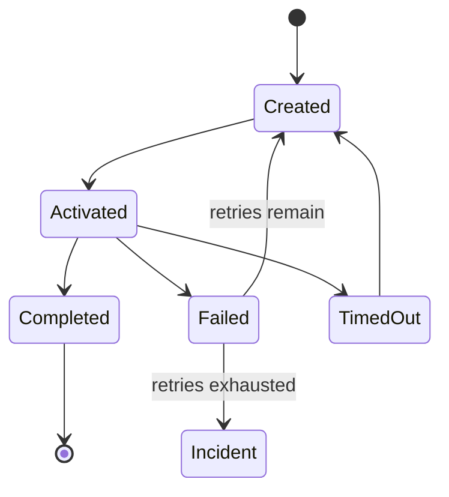

Job adalah boundary penting untuk reliability.

Saat job dibuat, proses biasanya berhenti di activity tersebut sampai job selesai, gagal, timeout, atau menjadi incident.

---

## 15. Incident

Incident adalah sinyal bahwa engine tidak bisa melanjutkan proses secara otomatis.

Incident biasanya muncul karena:

- retry habis;
- job failure berulang;
- message/timer/expression problem;
- variable serialization problem;
- missing worker;
- BPMN model/configuration error;
- technical dependency failure yang tidak recoverable otomatis.

Incident bukan sekadar error log. Incident adalah process state yang membutuhkan tindakan.

Tindakan yang mungkin:

- memperbaiki variable;
- memperbaiki worker;
- memperbaiki dependency;
- menambah retry;
- memodifikasi process instance;
- melakukan manual repair;
- terminate instance jika benar-benar aman;
- deploy process/worker fix.

Production rule:

> Jangan resolve incident sebelum memahami side effect yang sudah terjadi.

Jika worker gagal setelah melakukan DB commit atau publish event, retry bisa menggandakan efek.

---

## 16. Retry

Retry adalah mekanisme untuk mencoba ulang pekerjaan yang gagal.

Retry bisa terjadi pada beberapa level:

- engine-level retry;
- worker-level retry;
- connector retry;
- HTTP client retry;
- message broker redelivery;
- BPMN-level retry via timer loop;
- manual retry dari operator.

Masalah muncul ketika retry berlapis-lapis tanpa desain.

Contoh buruk:

- HTTP client retry 3x;
- worker retry 5x;
- engine retry 3x;
- RabbitMQ redelivery tanpa limit;
- operator klik retry manual berkali-kali;
- side effect tidak idempotent.

Akibatnya bisa terjadi retry storm, duplicate event, duplicate order update, external API rate limit, dan incident yang makin sulit dibaca.

Retry harus selalu dipasangkan dengan:

- idempotency;
- timeout;
- backoff;
- observability;
- poison task handling;
- manual intervention path.

---

## 17. Wait State

Wait state adalah titik di mana process instance berhenti dan menunggu sesuatu.

Contoh wait state:

- user task menunggu manusia;
- receive task menunggu message;
- message catch event menunggu correlation;
- timer event menunggu waktu;
- service task menunggu worker/job completion;
- external task menunggu worker fetch-and-lock;
- async continuation menunggu job executor.

Wait state adalah alasan workflow engine berguna untuk long-running process. Tanpa wait state, proses panjang sering berubah menjadi polling loop, cron job, atau state machine tersembunyi.

### Production implication

Setiap wait state harus punya jawaban atas:

- siapa atau apa yang akan membangunkan proses?
- bagaimana kalau event tidak pernah datang?
- bagaimana kalau event datang dua kali?
- bagaimana kalau event datang terlambat?
- bagaimana kalau process version berubah saat menunggu?
- bagaimana observability wait state?
- apa SLA-nya?

---

## 18. Transaction Boundary

Transaction boundary menentukan kapan perubahan runtime process dan side effect teknis di-commit.

Ini critical dalam Camunda 7 embedded/delegate model karena Java delegate bisa berjalan dalam transaction context engine.

Contoh risiko:

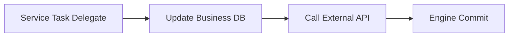

Jika external API berhasil tetapi engine commit gagal, sistem bisa berada dalam partial success.

Jika DB commit terjadi tetapi process job gagal, retry bisa mengulang worker.

Jika worker melakukan side effect sebelum complete job, lalu complete job gagal, engine bisa menganggap job belum selesai dan menjalankannya ulang.

### Senior engineer mental model

Jangan pernah menganggap “task completed” sama dengan “semua side effect aman”.

Selalu pecah pertanyaan:

1. Apakah business DB sudah berubah?
2. Apakah event sudah dipublish?
3. Apakah external API sudah dipanggil?
4. Apakah process engine sudah menerima completion?
5. Apakah operation idempotent?
6. Apakah ada outbox/inbox table?
7. Apakah operator bisa melihat partial state?

---

## 19. Completion

Process completion terjadi saat semua active path mencapai end state yang membuat instance selesai.

Dalam proses sederhana, satu end event cukup.

Dalam proses parallel, completion hanya terjadi jika semua branch yang harus selesai sudah selesai.

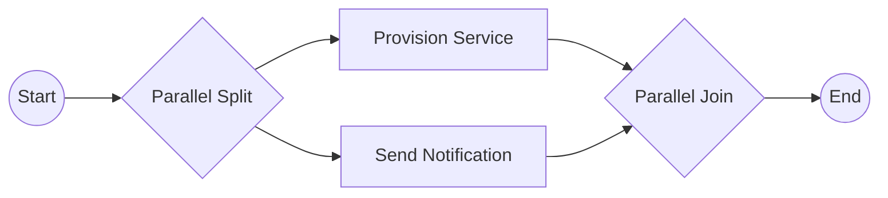

Jika branch `Send Notification` stuck, process tidak selesai meskipun `Provision Service` sudah sukses.

Jika join salah, proses bisa:

- selesai terlalu cepat;
- tidak pernah selesai;
- membuat token tertahan;
- membuat duplicate branch;
- membuat incident sulit dibaca.

---

## 20. Termination

Termination adalah penghentian process instance sebelum completion normal.

Termination bisa terjadi karena:

- terminate end event;
- operator manual termination;
- cancellation business flow;
- migration failure repair;
- process instance modification;
- admin cleanup.

Termination bukan sekadar “delete process”.

Sebelum terminate, pastikan:

- business state sudah direkonsiliasi;
- external side effect sudah diketahui;
- user task tidak menggantung;
- downstream system tidak menunggu event yang tidak akan pernah dikirim;
- audit trail mencatat alasan;
- customer impact dipahami;
- kompensasi/manual repair sudah diputuskan.

---

## 21. Camunda 7 Execution Mental Model

Camunda 7 adalah Java-based process engine yang umumnya menggunakan database sebagai runtime persistence.

Model mental penting:

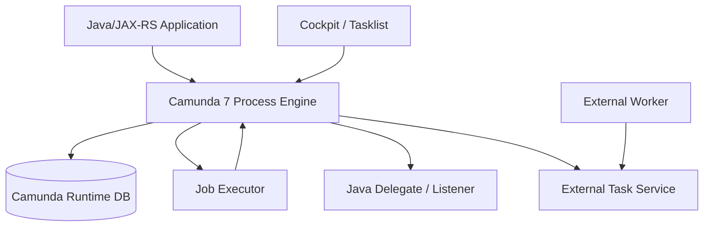

Implikasi:

- engine state disimpan di DB;
- job executor mengambil job dari DB;
- Java delegate bisa berjalan dekat dengan engine;
- transaction boundary sangat penting;
- DB load bisa menjadi bottleneck;
- history level memengaruhi storage dan audit;
- Cockpit sering menjadi tool utama untuk melihat incident dan process instance.

### Camunda 7 failure lens

Saat proses Camunda 7 bermasalah, cek:

- job table;
- incident table;
- runtime execution;
- process variables;
- job executor health;
- DB connection pool;
- delegate exception;
- external task lock;
- history cleanup;
- deployment/classloading issue.

---

## 22. Camunda 8 / Zeebe Execution Mental Model

Camunda 8/Zeebe adalah distributed process orchestration platform.

Model mental penting:

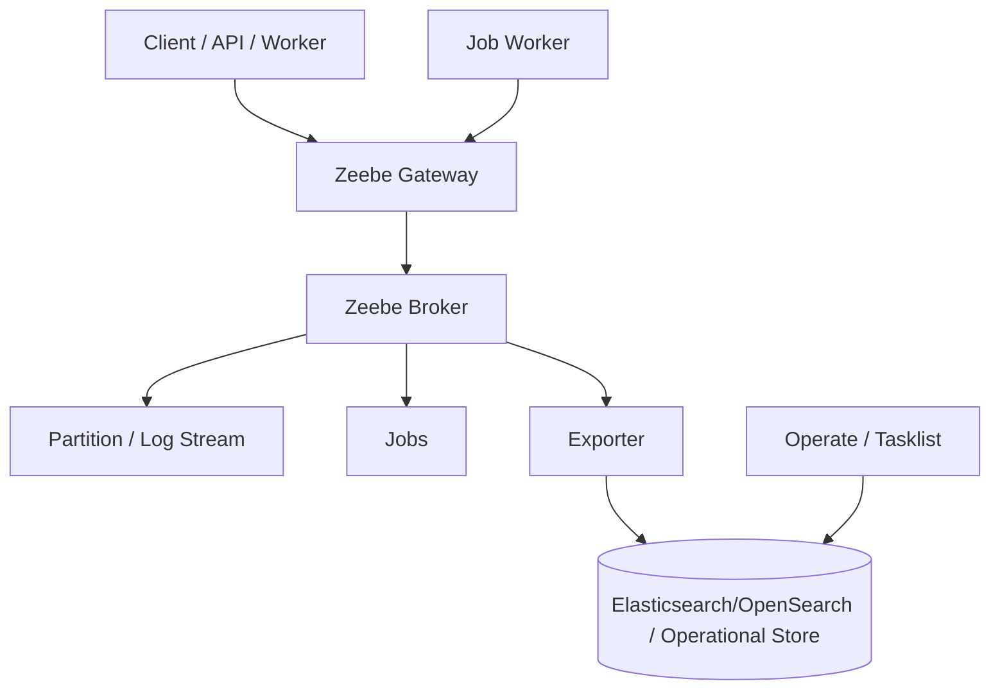

Implikasi:

- service task menghasilkan job;
- job worker mengambil dan menyelesaikan job;
- process execution didistribusikan melalui broker/partition;
- Operate digunakan untuk observability process instance/incident;
- search/operate storage dependency penting untuk operasional;
- worker connectivity, job timeout, retries, dan backpressure menjadi concern utama;
- tidak ada JavaDelegate embedded seperti Camunda 7.

### Camunda 8 failure lens

Saat proses Zeebe bermasalah, cek:

- process instance state di Operate;
- element instance/key;
- incident;
- job type;
- worker availability;
- job timeout/retries;
- gateway connectivity;
- broker/partition health;
- exporter/search health;
- message correlation;
- variable payload size.

---

## 23. Dampak ke Java/JAX-RS Backend

Untuk Java/JAX-RS service, BPMN execution model memengaruhi API design.

Pola yang umum:

- `POST /quotes/{id}/submit` memulai process instance;
- `POST /tasks/{taskId}/complete` menyelesaikan user task;
- `POST /orders/{id}/events/fulfillment-completed` mengkorelasikan message;
- `GET /orders/{id}/workflow-status` membaca status proses;
- worker Java menjalankan service task;
- JAX-RS endpoint menerima callback eksternal lalu mengirim message ke engine.

Correctness concern:

- API start process harus idempotent;
- API complete task harus authorization-aware;
- message correlation harus deterministic;
- process status endpoint tidak boleh membuat business logic bergantung pada engine internals;
- error response harus membedakan validation error, business error, technical error, dan workflow state conflict.

---

## 24. Dampak ke PostgreSQL, MyBatis, dan JDBC

Workflow engine dan business database sering hidup berdampingan.

Risiko utama:

- process variable menduplikasi business table;
- worker update DB lalu gagal complete job;
- complete job sukses lalu event publish gagal;
- DB lock membuat worker timeout;
- optimistic locking exception memicu retry yang tidak idempotent;
- migration DB mengubah schema yang masih dibutuhkan running process version lama;
- long-running process menyimpan assumption schema lama.

Pattern yang sering diperlukan:

- outbox table;
- inbox table;
- processed job table;
- idempotency key table;
- business state transition table;
- audit table;
- reconciliation query.

Senior engineer rule:

> Jangan membuat process engine menjadi pengganti database domain. Gunakan engine untuk orchestration, database untuk state/invariant domain.

---

## 25. Dampak ke Kafka, RabbitMQ, dan Redis

Workflow execution sering bergantung pada event/message/cache.

### Kafka

Workflow bisa:

- dimulai oleh event Kafka;
- menunggu event Kafka untuk message correlation;
- mempublish event setelah task selesai;
- memakai outbox untuk publish event setelah DB commit.

Concern:

- duplicate delivery;
- replay;
- out-of-order events;
- schema evolution;
- correlation key;
- event version compatibility.

### RabbitMQ

Workflow bisa:

- menerima command message;
- mengirim task command;
- menunggu reply message;
- menggunakan DLQ untuk failure.

Concern:

- retry engine vs retry broker;
- duplicate redelivery;
- routing key mismatch;
- lost reply;
- dead-letter handling.

### Redis

Redis bisa membantu:

- idempotency cache;
- distributed lock;
- rate limiter;
- feature flag;
- kill switch;
- cached process status.

Concern:

- Redis bukan source of truth;
- lock expiry;
- stale cache;
- eviction;
- Redis outage impact.

---

## 26. Dampak ke Kubernetes, AWS, Azure, On-Prem, Hybrid

Execution model juga memengaruhi deployment.

### Kubernetes

Perlu dipikirkan:

- worker graceful shutdown;
- readiness/liveness probe;
- rolling deployment;
- horizontal scaling;
- job timeout saat pod terminate;
- config/secret;
- network policy;
- resource limit;
- pod disruption budget.

### Cloud

Di AWS/Azure:

- database/search dependency bisa menjadi bottleneck;
- IAM/managed identity memengaruhi worker credential;
- private endpoint dan firewall memengaruhi connectivity;
- observability harus terhubung ke CloudWatch/Azure Monitor atau stack internal;
- backup/restore harus jelas.

### On-prem/hybrid

Perlu dipikirkan:

- firewall;
- internal CA;
- TLS/mTLS;
- offline patching;
- air-gapped deployment;
- cloud-to-on-prem callback;
- worker connectivity dari network terbatas;
- responsibility boundary dengan customer/platform team.

---

## 27. Failure Modes

| Failure mode | Gejala | Penyebab umum | Debugging awal |
|---|---|---|---|
| Process tidak start | Tidak ada instance baru | wrong process key/version, auth, deployment gagal | cek deployment, API response, engine logs |
| Instance stuck di service task | Activity tidak lanjut | worker down, job timeout, retries habis | cek job type/topic, worker logs, incident |
| Instance stuck di user task | Task aging | assignee/group salah, user tidak tahu, SLA tidak ada | cek task assignment, Tasklist, dashboard aging |
| Message tidak correlated | Process menunggu terus | correlation key salah, message name salah, message datang terlalu awal/terlambat | cek message name/key, event logs |
| Timer tidak firing | SLA tidak jalan | timer definition salah, clock/timezone issue, backlog | cek timer jobs, due date, backlog |
| Incident berulang | Retry habis lagi | root cause belum diperbaiki, non-idempotent side effect | cek error history, worker code, dependency |
| Duplicate side effect | Order/event/API call dobel | retry setelah partial success | cek idempotency key, processed job table |
| Process selesai terlalu cepat | Business step terlewati | gateway condition salah, missing join | cek path taken, variables, gateway condition |
| Process tidak pernah selesai | Active branch tertahan | parallel join, wait state, message missing | cek active tokens/element instances |
| Variable missing | Worker/task gagal | scope/mapping salah, version mismatch | cek variable scope dan input/output mapping |
| Serialization error | Job gagal sebelum logic | object variable berubah, class mismatch, payload besar | cek variable type, serializer, payload |

---

## 28. Production-Safe Debugging Flow

Gunakan urutan ini saat workflow bermasalah:

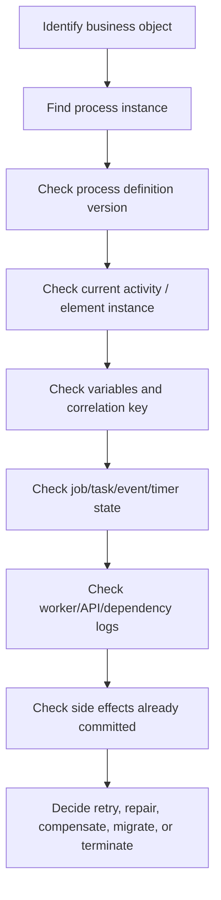

Jangan mulai dari retry.

Mulai dari observasi state.

Pertanyaan minimal:

1. Business object apa yang terdampak?
2. Process instance mana?
3. Process version berapa?
4. Activity mana yang aktif?
5. Variable penting apa nilainya?
6. Job/task/event apa yang sedang ditunggu?
7. Worker mana yang seharusnya bekerja?
8. Side effect apa yang sudah terjadi?
9. Apakah retry aman?
10. Apakah butuh manual repair atau compensation?

---

## 29. Correctness Concerns

Workflow correctness bukan hanya “diagram valid”.

Correctness berarti:

- setiap path bisnis valid;
- setiap gateway condition lengkap;
- parallel branch join dengan benar;
- process state konsisten dengan entity state;
- retry tidak menggandakan side effect;
- message correlation deterministic;
- timeout punya business meaning;
- incident punya owner;
- user task punya authorization dan SLA;
- variable schema compatible;
- process versioning aman;
- migration tidak merusak running instance;
- manual repair tidak melanggar audit.

---

## 30. Internal Verification Checklist

Gunakan checklist ini saat mulai membaca codebase atau runtime internal.

### Process definition dan deployment

- Di mana BPMN disimpan?
- Bagaimana BPMN dideploy?
- Apakah process definition version terlihat di dashboard?
- Apakah start process memakai latest version atau fixed version?
- Apakah ada version tag?

### Process instance

- Bagaimana process instance dikaitkan dengan quote/order/customer?
- Apakah business key dipakai?
- Apakah correlation key konsisten?
- Apakah ada endpoint/status view untuk process instance?

### Token/activity/wait state

- Activity apa saja yang menjadi wait state?
- User task mana yang bisa aging?
- Service task mana yang menghasilkan job?
- Message event mana yang menunggu callback?
- Timer mana yang mewakili SLA?

### Variables

- Variable apa saja yang disimpan?
- Apakah ada payload besar?
- Apakah ada PII atau secret?
- Apakah variable menduplikasi DB state?
- Apakah variable schema versioned?

### Job, retry, incident

- Task mana yang retryable?
- Berapa retry count dan backoff?
- Apa yang terjadi saat retry exhausted?
- Siapa owner incident?
- Apakah retry aman terhadap side effect?

### Java/JAX-RS integration

- Endpoint apa yang start process?
- Endpoint apa yang complete task?
- Endpoint apa yang correlate message?
- Apakah API idempotent?
- Apakah correlation ID diteruskan ke log/trace?

### PostgreSQL/MyBatis/JDBC

- Worker update table apa?
- Apakah ada outbox/inbox/processed job table?
- Apakah transaction boundary jelas?
- Apakah DB migration mempertimbangkan running process lama?

### Kafka/RabbitMQ/Redis

- Event/message apa yang start atau wake up process?
- Bagaimana duplicate event ditangani?
- Apakah replay aman?
- Apakah Redis dipakai untuk idempotency/lock/cache?
- Apa dampak Redis outage?

### Operations

- Tool observability apa yang dipakai: Cockpit, Operate, dashboard internal?
- Apakah ada alert incident?
- Apakah ada alert task aging/SLA breach?
- Apakah ada runbook stuck process?
- Apakah manual repair diaudit?

---

## 31. PR Review Checklist

Saat mereview PR yang menyentuh BPMN atau worker, tanyakan:

- Apakah process definition versioning aman?
- Apakah perubahan gateway mengubah path bisnis?
- Apakah ada running instance lama yang terdampak?
- Apakah variable baru backward compatible?
- Apakah service task punya idempotency?
- Apakah retry policy eksplisit?
- Apakah incident path jelas?
- Apakah user task punya assignee/candidate group dan SLA?
- Apakah message correlation key konsisten?
- Apakah timer punya timezone dan business meaning yang jelas?
- Apakah worker safe saat pod restart?
- Apakah DB transaction boundary jelas?
- Apakah event publish menggunakan outbox jika perlu?
- Apakah observability ditambahkan?
- Apakah security/privacy variable dicek?
- Apakah perlu ADR?

---

## 32. Kesimpulan

BPMN execution mental model adalah fondasi untuk semua pembahasan Camunda berikutnya.

Jika Anda memahami:

- process definition;
- process instance;
- token/element instance;
- activity;
- gateway;
- event;
- variable;
- scope;
- job;
- wait state;
- transaction boundary;
- retry;
- incident;
- completion;
- termination;

maka Anda tidak lagi membaca BPMN sebagai flowchart. Anda membaca BPMN sebagai runtime system.

Itulah perspektif yang dibutuhkan senior backend engineer di enterprise workflow system.

---

## 33. Referensi Konseptual

Gunakan referensi resmi berikut saat memvalidasi detail implementasi sesuai versi Camunda yang digunakan di environment Anda:

- Camunda 8 Docs — Processes.
- Camunda 8 Docs — Service tasks.
- Camunda 8 Docs — User tasks.
- Camunda 8 Docs — BPMN coverage.
- Camunda 8 Docs — Operate/process instance/incident API.
- Camunda 7 Manual dan Javadocs — process engine, BPMN model, job executor, runtime service, external task service.

Tetap verifikasi detail aktual di repository, deployment, dashboard, dan runbook internal CSG/team.
