# BPMN Modelling Fundamentals

> Fokus part ini: memahami elemen dasar BPMN dari sudut pandang modelling yang bisa dieksekusi, direview, di-debug, dan dioperasikan. Ini bukan katalog simbol BPMN. Ini adalah cara membaca dan membuat model proses yang aman untuk enterprise Java/JAX-RS system.

BPMN modelling sering gagal bukan karena engineer tidak tahu simbol. BPMN modelling gagal karena diagram tidak mencerminkan runtime reality.

Diagram bisa terlihat rapi, tetapi tetap salah jika:

- service task tidak jelas worker-nya;
- user task tidak jelas owner-nya;
- gateway menyimpan rule tersembunyi;
- boundary event tidak diuji;
- variable mapping tidak jelas;
- retry tidak dipikirkan;
- message correlation ambigu;
- timer tidak punya SLA meaning;
- process state bertabrakan dengan entity state;
- diagram tidak bisa digunakan saat incident production.

Tujuan modelling BPMN bukan membuat gambar yang indah. Tujuan modelling BPMN adalah membuat kontrak proses yang bisa dipahami business, dieksekusi engine, diintegrasikan backend, dan dioperasikan SRE/support.

---

## 1. Prinsip Dasar Modelling BPMN

Model BPMN yang baik harus memenuhi lima sifat:

1. **Business-readable**  
   BA, product, solution architect, dan operator bisa memahami alur bisnisnya.

2. **Execution-aware**  
   Engineer tahu activity mana yang dieksekusi engine, worker, manusia, timer, atau external event.

3. **Failure-aware**  
   Error, retry, timeout, escalation, incident, dan manual intervention terlihat atau punya contract jelas.

4. **Integration-aware**  
   API, database, Kafka, RabbitMQ, Redis, dan external system boundary terlihat dalam desain.

5. **Operationally debuggable**  
   Saat production incident, diagram membantu menemukan process instance, current activity, variable, wait state, owner, dan next action.

Jika BPMN tidak membantu debugging, modelnya belum production-grade.

---

## 2. BPMN sebagai Kontrak, Bukan Dekorasi

BPMN di enterprise system punya beberapa audience:

| Audience | Yang mereka butuhkan dari BPMN |
|---|---|
| Business / Product | Alur proses, approval, exception, SLA, customer impact |
| BA / Solution Architect | Business rule placement, handoff antar role/system, variation flow |
| Backend Engineer | Worker contract, variable, transaction boundary, error path |
| QA | Test scenario, happy path, failure path, timeout, user task |
| SRE / Platform | Incident point, retry, stuck process, dashboard, runbook |
| Security / Compliance | Access, sensitive data, audit, retention, tenant boundary |

Kalau model hanya bisa dipahami oleh satu role, model itu belum cukup baik.

---

## 3. Minimal Executable Process

Process paling sederhana memiliki start event, activity, dan end event.

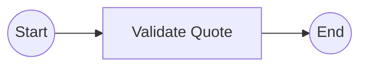

Namun untuk production, minimal process juga harus punya jawaban atas:

- Apa trigger start-nya?
- Apa input variable-nya?
- Siapa/apa yang menjalankan activity?
- Apa side effect activity?
- Apa output variable-nya?
- Apa failure mode-nya?
- Apa observability-nya?
- Apa arti end event bagi business object?

Diagram sederhana tidak otomatis berarti desain sederhana. Sering kali complexity disembunyikan di worker atau service code.

---

## 4. Start Event

Start event menandai awal process instance.

Jenis start event umum:

- none start event;
- message start event;
- timer start event;
- signal start event;
- conditional start event, jika didukung dan relevan;
- error start event untuk event subprocess tertentu.

### None start event

Dipakai saat process dimulai secara eksplisit oleh API, service, operator, atau command internal.

Contoh:

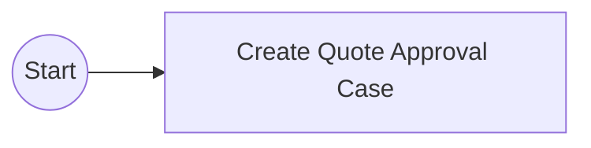

Biasanya cocok untuk:

- `POST /quotes/{id}/submit`;
- start process dari backend service;
- manual start oleh operator;
- controlled process creation.

Review checklist:

- Endpoint atau command apa yang memulai proses?
- Apakah start operation idempotent?
- Apakah business key/correlation key diset?
- Apakah authorization dicek sebelum start?
- Apakah process version yang dipakai jelas?

### Message start event

Dipakai saat process dimulai oleh message/event eksternal.

Cocok untuk:

- order submitted event;
- fulfillment request received;
- external system callback yang memulai flow baru.

Review checklist:

- Message name apa?
- Correlation/business key apa?
- Bagaimana duplicate message ditangani?
- Bagaimana replay Kafka memengaruhi process start?
- Apakah event schema version compatible?

### Timer start event

Dipakai untuk proses periodik.

Cocok untuk:

- reconciliation process;
- SLA scan;
- cleanup process;
- scheduled reminder.

Review checklist:

- Timer interval/date/cycle apa?
- Timezone apa?
- Apakah proses aman jika run terlambat?
- Apakah proses aman jika run overlap?
- Apakah scheduler engine memang tempat yang tepat, bukan Kubernetes CronJob atau scheduler lain?

---

## 5. End Event

End event menandai path selesai.

Jenis end event umum:

- none end event;
- message end event;
- error end event;
- escalation end event;
- terminate end event;
- compensation-related end behavior, tergantung model.

### None end event

Menandakan path selesai tanpa event khusus.

Review checklist:

- Apa arti selesai secara bisnis?
- Apakah quote/order state sudah diupdate?
- Apakah downstream event perlu dipublish?
- Apakah audit sudah lengkap?
- Apakah semua branch penting sudah join?

### Terminate end event

Terminate end event menghentikan seluruh scope proses.

Gunakan hati-hati.

Risiko:

- branch lain dihentikan tanpa cleanup;
- user task hilang dari alur normal;
- external system masih menunggu callback;
- audit business outcome tidak jelas;
- compensation tidak otomatis terjadi kecuali dimodelkan.

Review checklist:

- Apakah termination business-valid?
- Apakah branch lain aman dihentikan?
- Apakah side effect sudah direkonsiliasi?
- Apakah operator bisa melihat alasan terminate?
- Apakah customer impact dipahami?

---

## 6. Sequence Flow

Sequence flow adalah garis penghubung antar node.

Namun secara runtime, sequence flow adalah routing rule.

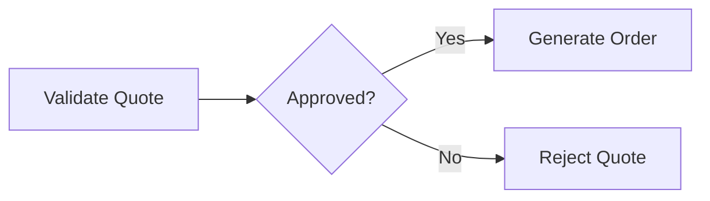

Sequence flow bisa:

- unconditional;
- conditional;
- default;
- keluar dari gateway;
- masuk ke join;
- melewati boundary event.

Review checklist:

- Apakah setiap outgoing flow punya condition yang jelas?
- Apakah ada default flow?
- Apakah expression mengakses variable yang pasti ada?
- Apakah condition terlalu kompleks?
- Apakah condition seharusnya dipindah ke DMN/domain service?

---

## 7. Service Task

Service task merepresentasikan automated work.

Di enterprise backend, service task biasanya berarti salah satu dari:

- JavaDelegate di Camunda 7;
- external task worker di Camunda 7;
- Zeebe job worker di Camunda 8;
- connector-backed integration;
- call ke Java/JAX-RS service;
- publish event ke Kafka/RabbitMQ;
- update database bisnis;
- call external API.

Contoh:

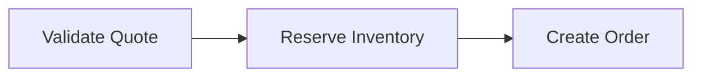

Setiap service task harus punya contract.

### Service task contract

- Task name apa?
- Job type/topic/delegate apa?
- Input variable apa?
- Output variable apa?
- Side effect apa?
- Idempotency key apa?
- Retry policy apa?
- Timeout berapa?
- Error business apa yang bisa dilempar?
- Technical failure menjadi incident atau retry?
- Log/trace/correlation ID apa?

### Service task anti-pattern

- Nama task terlalu teknis: `callRestService`.
- Nama task terlalu vague: `process data`.
- Worker melakukan banyak hal sekaligus.
- Task melakukan DB update + external API + event publish tanpa outbox/idempotency.
- Retry otomatis tetapi side effect tidak idempotent.
- Error semua dilempar sebagai generic exception.
- Output variable tidak terdokumentasi.

Nama service task yang baik menjelaskan business action:

- `Validate Quote Pricing`
- `Reserve Network Resource`
- `Submit Order To Fulfillment`
- `Publish Order Accepted Event`
- `Create Manual Fallout Case`

---

## 8. User Task

User task merepresentasikan pekerjaan manusia.

Contoh:

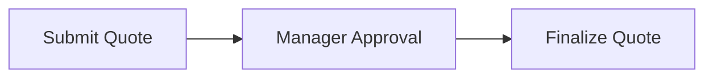

User task bukan sekadar item di UI. User task adalah wait state proses.

### User task contract

- Candidate user/group siapa?
- Assignee awal siapa?
- Bisa claim/unclaim?
- Bisa delegate?
- Due date apa?
- Follow-up date apa?
- Form apa yang dipakai?
- Variable apa yang ditampilkan?
- Variable apa yang bisa diedit?
- Action apa yang tersedia?
- Authorization bagaimana?
- Audit apa yang dicatat?
- SLA breach apa yang terjadi?

### User task failure mode

- task tidak terlihat oleh group yang benar;
- task terlihat oleh user yang tidak berhak;
- task aging tanpa alert;
- form menampilkan variable stale;
- dua user complete task bersamaan;
- task completed tetapi domain state gagal update;
- operator tidak tahu apa yang harus dilakukan;
- manual decision tidak terekam sebagai audit.

### Review checklist

- Apakah task name business-readable?
- Apakah role/group jelas?
- Apakah SLA jelas?
- Apakah form validation berada di tempat yang benar?
- Apakah complete action idempotent?
- Apakah task completion punya authorization check?

---

## 9. Script Task

Script task menjalankan script kecil di dalam process model.

Script task harus digunakan sangat hati-hati.

Cocok untuk:

- transformasi kecil;
- setting variable sederhana;
- prototype/internal tool sederhana, jika governance mengizinkan.

Tidak cocok untuk:

- business rule kompleks;
- database operation;
- external API call;
- logic yang butuh unit test kuat;
- logic yang butuh dependency injection;
- logic yang berubah sering;
- logic yang security-sensitive.

Anti-pattern:

```text
Gateway sederhana, tetapi seluruh keputusan sebenarnya dihitung dalam script task 80 baris.
```

Untuk enterprise Java system, logic penting biasanya lebih aman berada di:

- domain service;
- worker;
- DMN decision;
- rules service;
- tested Java code.

Review checklist:

- Mengapa logic ini tidak di Java/DMN?
- Apakah script bisa diuji?
- Apakah script punya observability?
- Apakah script aman terhadap null/missing variable?
- Apakah script compatible dengan runtime Camunda yang digunakan?

---

## 10. Business Rule Task

Business rule task menjalankan decision logic, biasanya dengan DMN.

Cocok untuk:

- approval routing;
- pricing exception decision;
- eligibility decision;
- risk classification;
- SLA category;
- fallout routing.

Contoh:

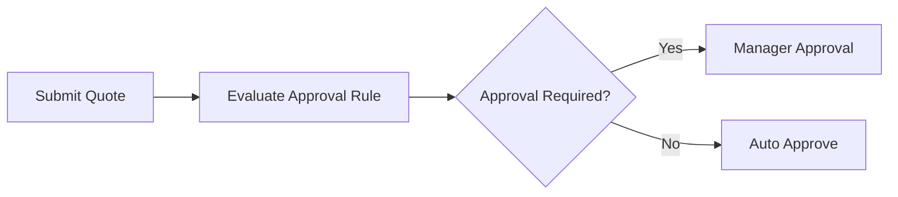

Business rule task membantu memisahkan:

- process flow;
- decision logic;
- domain invariant;
- technical orchestration.

Review checklist:

- Decision table apa yang dipanggil?
- Input variable apa?
- Output variable apa?
- Hit policy apa?
- Bagaimana versioning decision?
- Apakah decision auditable?
- Apakah business bisa mereview rule?

---

## 11. Send Task

Send task merepresentasikan pengiriman message/request.

Contoh:

- kirim command ke fulfillment;
- publish event ke Kafka;
- kirim notification;
- call integration endpoint.

Dalam banyak implementasi, send task secara teknis mirip service task yang melakukan outbound communication.

Review checklist:

- Apa yang dikirim?
- Ke sistem mana?
- Apakah pengiriman idempotent?
- Apakah menggunakan outbox?
- Apakah ada acknowledgement?
- Apa yang terjadi jika target down?
- Apakah message schema versioned?

---

## 12. Receive Task

Receive task menunggu message.

Contoh:

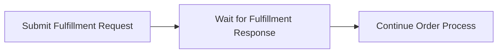

Receive task cocok saat proses harus berhenti sampai external event datang.

Review checklist:

- Message name apa?
- Correlation key apa?
- Bagaimana jika message datang sebelum proses siap?
- Bagaimana jika message duplicate?
- Bagaimana jika message tidak pernah datang?
- Apakah perlu timer boundary untuk timeout?
- Apakah Kafka/RabbitMQ consumer melakukan correlation dengan benar?

---

## 13. Manual Task

Manual task merepresentasikan pekerjaan manual yang tidak dieksekusi engine.

Contoh:

- “Customer signs offline document”.
- “Field team performs physical installation”.

Manual task bisa berguna sebagai dokumentasi proses, tetapi hati-hati.

Jika pekerjaan manual perlu assignment, tracking, SLA, audit, dan completion di sistem, gunakan user task atau case/task management pattern, bukan manual task pasif.

Review checklist:

- Apakah task ini hanya dokumentasi?
- Siapa yang memastikan pekerjaan selesai?
- Bagaimana proses lanjut?
- Apakah ada audit?
- Apakah sebenarnya perlu user task?

---

## 14. Exclusive Gateway

Exclusive gateway memilih satu path dari beberapa opsi.

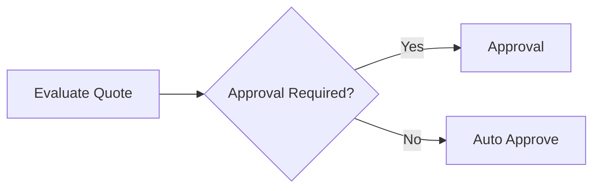

Cocok untuk decision sederhana.

Review checklist:

- Apakah conditions mutually exclusive?
- Apakah ada default flow?
- Apakah variable yang dipakai pasti tersedia?
- Apakah decision terlalu kompleks?
- Apakah perlu DMN?

Anti-pattern:

- nested exclusive gateway terlalu banyak;
- condition expression panjang;
- default flow mengarah ke happy path tanpa alasan;
- gateway diberi nama teknis seperti `checkFlag`;
- decision penting tidak auditable.

Nama gateway yang baik berbentuk pertanyaan bisnis:

- `Approval Required?`
- `Order Valid?`
- `Manual Fallout Needed?`
- `Customer Eligible?`

---

## 15. Parallel Gateway

Parallel gateway menjalankan beberapa path secara paralel.

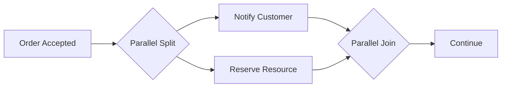

Parallel gateway tampak sederhana tetapi sering menyebabkan bug.

Risiko:

- missing join;
- join menunggu branch yang tidak pernah selesai;
- branch melakukan side effect yang saling bertabrakan;
- variable overwritten;
- race condition;
- completion terlalu cepat;
- failure satu branch tidak jelas dampaknya ke branch lain.

Review checklist:

- Apakah semua branch benar-benar boleh paralel?
- Apakah ada shared variable yang ditulis lebih dari satu branch?
- Apakah join benar?
- Apa yang terjadi jika satu branch gagal?
- Apakah side effect branch idempotent?

---

## 16. Inclusive Gateway

Inclusive gateway bisa memilih satu atau lebih path berdasarkan condition.

Ini lebih kompleks daripada exclusive dan parallel gateway.

Cocok jika beberapa cabang opsional bisa aktif sekaligus.

Contoh:

- order membutuhkan kombinasi provisioning internet, voice, dan hardware;
- quote membutuhkan beberapa approval role bergantung pada kondisi;
- fulfillment membutuhkan beberapa optional validation.

Risiko:

- join semantics sulit dipahami;
- active branch tidak jelas;
- debugging lebih sulit;
- condition overlap tidak disengaja;
- diagram menjadi ambigu.

Review checklist:

- Mengapa bukan exclusive atau parallel?
- Apakah conditions bisa menghasilkan kombinasi path yang valid?
- Apakah join inclusive benar?
- Apakah setiap kombinasi diuji?
- Apakah observability cukup untuk melihat branch aktif?

---

## 17. Event-Based Gateway

Event-based gateway menunggu salah satu dari beberapa event.

Contoh:

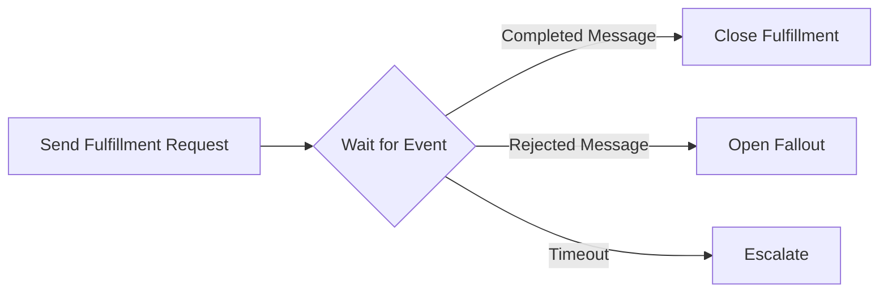

Cocok untuk race antar event eksternal.

Review checklist:

- Event apa saja yang bersaing?
- Apa yang terjadi pada event yang datang belakangan?
- Apakah timeout diperlukan?
- Apakah message correlation key sama?
- Apakah duplicate message aman?

Event-based gateway sering lebih ekspresif daripada polling status eksternal.

---

## 18. Subprocess

Subprocess mengelompokkan activity dalam process yang sama.

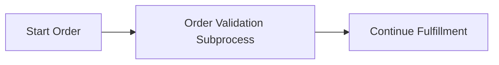

Subprocess cocok untuk:

- grouping logic;
- local variable scope;
- local error/timer handling;
- membuat diagram lebih readable;
- isolasi mini-lifecycle.

Review checklist:

- Apakah subprocess memperjelas atau menyembunyikan kompleksitas?
- Apakah variable scope jelas?
- Apakah boundary event pada subprocess diperlukan?
- Apakah error dari dalam subprocess dipropagasi dengan benar?
- Apakah subprocess terlalu besar?

---

## 19. Call Activity

Call activity memanggil process definition lain.

Cocok untuk reusable process yang benar-benar punya lifecycle sendiri.

Contoh:

- approval process reusable;
- notification process reusable;
- manual intervention process;
- document generation process.

Risiko:

- parent-child process coupling;
- version binding salah;
- variable mapping tidak lengkap;
- error propagation tidak jelas;
- debugging lintas process lebih sulit;
- migration lebih sulit.

Review checklist:

- Process yang dipanggil version berapa?
- Binding-nya latest, deployment, atau version tertentu?
- Input/output variable mapping apa?
- Siapa owner child process?
- Apakah call activity membuat reuse yang benar atau coupling tersembunyi?

---

## 20. Boundary Event

Boundary event ditempelkan ke activity untuk menangkap event saat activity sedang aktif.

Jenis umum:

- timer boundary;
- error boundary;
- message boundary;
- escalation boundary;
- compensation boundary;
- signal/conditional boundary jika relevan dan didukung.

Boundary event bisa:

- **interrupting**: menghentikan activity utama;
- **non-interrupting**: membuat path tambahan tanpa menghentikan activity utama.

Contoh timeout approval:

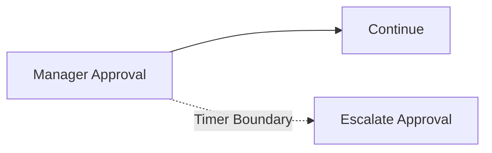

Review checklist:

- Apakah boundary event interrupting atau non-interrupting?
- Apa konsekuensi terhadap activity utama?
- Apakah timeout punya business meaning?
- Apakah escalation path punya owner?
- Apakah test mencakup boundary path?

Boundary event yang tidak diuji adalah sumber bug production.

---

## 21. Intermediate Event

Intermediate event terjadi di tengah proses.

Contoh:

- intermediate message catch;
- intermediate timer catch;
- intermediate signal;
- intermediate throw/catch event;
- link event untuk readability tertentu.

Intermediate event berguna saat proses perlu menunggu atau mengirim event eksplisit di tengah flow.

Review checklist:

- Apakah event ini benar-benar bagian dari proses bisnis?
- Apakah event name jelas?
- Apakah correlation key jelas?
- Apakah timeout/late event ditangani?
- Apakah observability event tersedia?

---

## 22. Modelling Readability

BPMN harus bisa dibaca cepat oleh manusia.

Prinsip readability:

- gunakan nama activity berbasis business action;
- gateway berbentuk pertanyaan;
- hindari line crossing;
- batasi diagram terlalu besar;
- gunakan subprocess untuk grouping yang bermakna;
- gunakan lane/pool jika membantu ownership, bukan dekorasi;
- bedakan manual, human, dan automated work;
- jangan sembunyikan failure path penting;
- jangan gunakan BPMN element eksotis tanpa alasan kuat.

Contoh nama buruk:

- `Process Data`
- `Check Flag`
- `Call API`
- `Handle Response`
- `Update Status`

Contoh nama lebih baik:

- `Validate Quote Discount`
- `Check Approval Requirement`
- `Submit Order To Fulfillment`
- `Record Fulfillment Rejection`
- `Move Order To Fallout`

---

## 23. Modelling for Execution

Model executable harus memetakan activity ke runtime behavior.

Untuk setiap activity, harus jelas:

- engine menjalankan apa?
- worker mana?
- job type/topic apa?
- input/output variable apa?
- apakah wait state?
- apakah transaction boundary?
- apakah retryable?
- bagaimana error dilaporkan?
- bagaimana observability-nya?

Jika diagram tidak menjawab ini, engineer akan mengisi gap dengan asumsi. Asumsi itulah yang sering menjadi incident.

---

## 24. Modelling for Failure

Model production-grade harus memikirkan failure sejak awal.

Failure path yang perlu dipertimbangkan:

- validation gagal;
- approval ditolak;
- user task overdue;
- external API timeout;
- Kafka event duplicate;
- RabbitMQ message dead-lettered;
- worker crash setelah DB commit;
- process message tidak correlated;
- timer backlog;
- variable missing;
- process migration mengubah activity;
- running instance masih menunggu event lama.

Tidak semua failure harus digambar di BPMN. Tetapi semua failure harus punya handling strategy.

Pilihan handling:

- BPMN error path;
- escalation path;
- timer boundary;
- incident;
- manual intervention;
- compensation;
- retry;
- reconciliation;
- operator runbook.

---

## 25. Modelling for Business Invariants

BPMN tidak boleh menggantikan domain invariant.

Contoh domain invariant:

- quote tidak boleh approved jika expired;
- order tidak boleh submitted tanpa valid customer;
- cancellation tidak boleh dilakukan setelah irreversible fulfillment step;
- discount di atas threshold butuh approval;
- tenant/customer boundary tidak boleh dilanggar.

Invariant penting harus ditegakkan di domain layer atau decision layer yang testable, bukan hanya di gateway expression.

BPMN boleh mengorkestrasi:

- kapan invariant dicek;
- siapa yang approve;
- apa yang terjadi saat gagal;
- bagaimana escalation/manual repair dilakukan.

Tetapi invariant tidak boleh hanya hidup sebagai garis diagram.

---

## 26. Modelling for Java/JAX-RS Backend

Saat BPMN terhubung ke Java/JAX-RS, pertanyaan penting:

- endpoint apa yang start process?
- endpoint apa yang complete user task?
- endpoint apa yang correlate message?
- worker mana yang menjalankan service task?
- apakah worker bagian dari service yang sama atau service terpisah?
- bagaimana correlation ID dipropagasi?
- apakah API menggunakan `202 Accepted` untuk long-running operation?
- bagaimana client membaca status?
- bagaimana authorization dicek?

Pola yang baik:

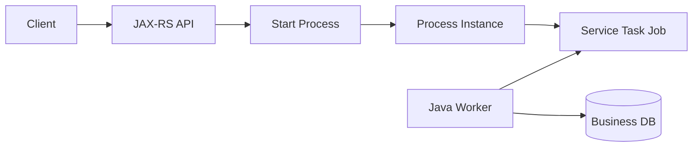

Jangan membuat API synchronous menunggu seluruh long-running workflow selesai.

Untuk proses panjang, gunakan:

- start command;
- process/business status endpoint;
- callback/webhook;
- polling;
- event notification;
- human task API.

---

## 27. Modelling for PostgreSQL/MyBatis/JDBC

BPMN harus jelas kapan process step membaca/menulis database bisnis.

Review checklist:

- Activity mana yang update quote/order table?
- Apakah update itu idempotent?
- Apakah ada optimistic locking?
- Apakah ada outbox event setelah update?
- Apakah worker bisa retry setelah commit?
- Apakah process variable menduplikasi DB state?
- Apakah DB migration compatible dengan running instance lama?

Contoh risky flow:

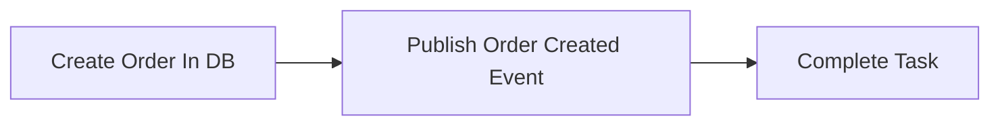

Jika event publish berhasil tetapi job completion gagal, retry bisa publish ulang.

Solusi bisa berupa:

- outbox table;
- idempotency key;
- unique constraint;
- processed job table;
- event producer transaction boundary yang jelas.

---

## 28. Modelling for Kafka, RabbitMQ, and Redis

### Kafka

Saat BPMN berhubungan dengan Kafka:

- message event harus punya correlation key;
- replay harus aman;
- duplicate event harus aman;
- schema evolution harus compatible;
- event source harus jelas.

### RabbitMQ

Saat BPMN berhubungan dengan RabbitMQ:

- command/reply pattern harus punya correlation ID;
- retry broker vs retry engine harus diselaraskan;
- DLQ harus punya owner;
- duplicate delivery harus aman.

### Redis

Saat Redis dipakai:

- jangan jadikan Redis source of truth;
- TTL harus jelas;
- lock expiry harus aman;
- cache staleness harus diterima atau dicegah;
- outage impact harus diketahui.

BPMN tidak harus menggambar semua detail broker/cache, tetapi model harus menunjukkan integration point dan failure strategy.

---

## 29. Modelling for Kubernetes and Cloud/On-Prem Operations

BPMN modelling juga harus sadar deployment reality.

Service task yang terlihat satu kotak di diagram bisa berarti:

- worker pod di Kubernetes;
- external service di network berbeda;
- DB managed service;
- Kafka cluster;
- RabbitMQ cluster;
- Redis cache;
- third-party API;
- on-prem endpoint melalui firewall.

Review checklist:

- Worker bisa graceful shutdown?
- Job timeout lebih panjang dari shutdown grace period?
- Worker scalable secara horizontal?
- Ada backpressure?
- Secret disimpan aman?
- Network policy/firewall mengizinkan traffic?
- Observability cross-service tersedia?
- Apa failure mode cloud/on-prem dependency?

---

## 30. Camunda 7 vs Camunda 8 Modelling Awareness

BPMN terlihat sama, tetapi runtime detail bisa berbeda.

### Camunda 7

Perhatikan:

- JavaDelegate;
- execution listener;
- task listener;
- external task topic;
- async before/after;
- job executor;
- transaction boundary;
- database persistence;
- Cockpit incident view.

### Camunda 8/Zeebe

Perhatikan:

- job type;
- Zeebe worker;
- job timeout;
- retries;
- Operate view;
- Tasklist implementation;
- connector behavior;
- partition/broker operational model;
- supported BPMN coverage sesuai versi.

Satu BPMN element bisa punya execution implication berbeda. Selalu verifikasi versi dan runtime yang digunakan.

---

## 31. Modelling Anti-Patterns

### 1. God process

Satu diagram berisi semua hal: approval, pricing, fulfillment, billing, notification, reconciliation, manual repair.

Dampak:

- sulit direview;
- sulit ditest;
- sulit dimigrate;
- sulit dioperasikan;
- ownership tidak jelas.

### 2. Gateway sebagai rules engine

Gateway expression terlalu kompleks.

Dampak:

- rule tidak auditable;
- business sulit review;
- testing lemah;
- debugging sulit.

### 3. Service task terlalu besar

Satu worker melakukan validasi, update DB, call API, publish event, dan update process variable.

Dampak:

- retry tidak aman;
- partial failure sulit;
- observability buruk.

### 4. User task tanpa SLA

Task dibuat tetapi tidak ada due date, escalation, atau dashboard aging.

Dampak:

- proses diam-diam stuck;
- customer impact terlambat diketahui.

### 5. Variable dumping

Seluruh object bisnis disimpan sebagai process variable.

Dampak:

- payload besar;
- serialization failure;
- privacy risk;
- migration sulit;
- history bloat.

### 6. Diagram happy-path only

Failure path tidak dimodelkan atau tidak punya runbook.

Dampak:

- incident production selalu improvisasi.

---

## 32. Example: Quote Approval Modelling Skeleton

Contoh skeleton sederhana untuk quote approval:

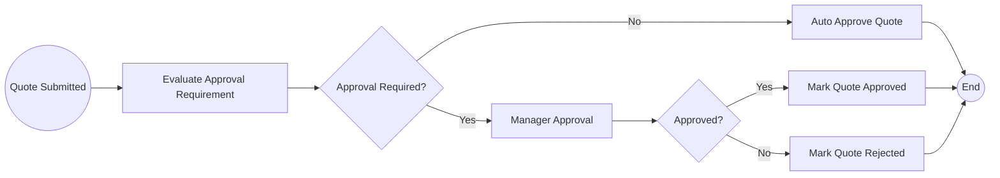

Model ini belum production-ready sampai menjawab:

- Rule approval ada di mana?
- User task candidate group siapa?
- Due date approval berapa?
- Apa timeout/escalation approval?
- Apa yang terjadi jika quote expired saat menunggu approval?
- Apakah approve/reject idempotent?
- Apakah DB state update aman?
- Apakah event `QuoteApproved` dipublish?
- Apakah process variable berisi data sensitif?
- Bagaimana audit manual decision?

---

## 33. Example: Order Fulfillment Modelling Skeleton

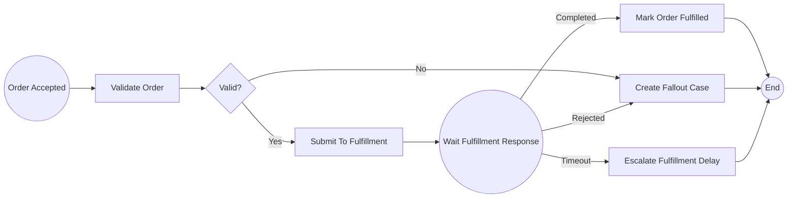

Key review points:

- fulfillment response correlation key;
- duplicate response handling;
- timeout duration;
- manual fallout ownership;
- state transition consistency;
- idempotent worker;
- external API retry;
- event publish after state update;
- observability for stuck fulfillment.

---

## 34. Internal Verification Checklist

### BPMN artifact

- Di repository mana BPMN disimpan?
- Apakah BPMN direview seperti code?
- Apakah naming convention ada?
- Apakah diagram punya owner?
- Apakah model sesuai proses bisnis aktual?

### Start/end

- Trigger start apa?
- Apakah start idempotent?
- Apakah end event punya business meaning?
- Apakah termination dipakai?
- Apakah cancellation/abort path jelas?

### Task

- Service task mapping ke worker/delegate/connector apa?
- User task candidate group/assignee siapa?
- Business rule task memanggil DMN apa?
- Send/receive task terhubung ke message apa?
- Manual task hanya dokumentasi atau perlu tracking?

### Gateway

- Gateway condition ada di mana?
- Apakah ada default flow?
- Apakah rule kompleks dipindah ke DMN/domain service?
- Apakah parallel/inclusive gateway punya join yang benar?
- Apakah semua path diuji?

### Event

- Message name dan correlation key apa?
- Timer untuk SLA atau technical timeout?
- Boundary event interrupting atau non-interrupting?
- Error event untuk business error apa?
- Escalation/manual intervention path apa?

### Variable

- Input/output variable per task apa?
- Apakah variable scope jelas?
- Apakah ada variable besar/PII/secret?
- Apakah variable mapping call activity/subprocess jelas?
- Apakah variable compatible dengan process version lama?

### Java/JAX-RS integration

- Endpoint start/complete/correlate apa?
- Worker Java mana yang menjalankan service task?
- Apakah API idempotent?
- Apakah authorization dicek?
- Apakah correlation ID masuk log/trace?

### Database/messaging/cache

- DB update terjadi di task mana?
- Apakah outbox/inbox dipakai?
- Kafka/RabbitMQ event apa yang terkait?
- Apakah duplicate/replay aman?
- Apakah Redis dipakai sebagai cache/lock/idempotency?

### Operations

- Bagaimana melihat current activity?
- Bagaimana melihat incident?
- Bagaimana melihat task aging?
- Bagaimana retry/manual repair dilakukan?
- Apakah runbook tersedia?

---

## 35. PR Review Checklist

Saat review BPMN modelling PR:

- Apakah nama proses jelas?
- Apakah process key stabil?
- Apakah activity name business-readable?
- Apakah start trigger jelas?
- Apakah end state jelas?
- Apakah user task punya owner dan SLA?
- Apakah service task punya worker contract?
- Apakah gateway punya default flow?
- Apakah business rule kompleks tidak disembunyikan di expression?
- Apakah message correlation deterministic?
- Apakah timer punya business meaning?
- Apakah boundary event diuji?
- Apakah variable scope dan mapping jelas?
- Apakah retry dan incident path jelas?
- Apakah side effect idempotent?
- Apakah observability ditambahkan?
- Apakah security/privacy variable dicek?
- Apakah process versioning/migration impact dipahami?

---

## 36. Kesimpulan

BPMN modelling fundamentals bukan tentang menghafal simbol.

Yang penting adalah memahami bahwa setiap elemen BPMN membawa runtime semantics:

- start event memulai process instance;
- end event menentukan outcome;
- sequence flow menentukan routing;
- service task memicu automation/worker;
- user task membuat human wait state;
- business rule task memisahkan decision;
- send/receive task menghubungkan message;
- gateway mengatur flow control;
- subprocess dan call activity mengatur composition;
- boundary/intermediate event menangani timeout, error, message, escalation, dan event lain.

Model BPMN yang baik harus bisa menjawab:

- apa proses bisnisnya;
- siapa/apa yang menjalankan setiap step;
- data apa yang mengalir;
- state apa yang berubah;
- event apa yang ditunggu;
- failure apa yang mungkin terjadi;
- bagaimana retry/incident/manual repair dilakukan;
- bagaimana proses diamati di production.

Itulah perbedaan antara BPMN sebagai diagram dan BPMN sebagai production workflow model.

---

## 37. Referensi Konseptual

Gunakan referensi resmi berikut saat memvalidasi detail sesuai versi Camunda yang digunakan:

- Camunda 8 Docs — BPMN coverage.
- Camunda 8 Docs — Service tasks.
- Camunda 8 Docs — User tasks.
- Camunda 8 Docs — Receive tasks.
- Camunda 8 Docs — Message events.
- Camunda 8 Docs — Task testing.
- Camunda 7 Manual/Javadocs — BPMN model API, process engine behavior, task/service/gateway/event behavior.

Tetap verifikasi detail aktual di BPMN model, DMN model, worker implementation, Java delegate, external task, Zeebe worker, process deployment, dashboard, CI/CD pipeline, dan runbook internal CSG/team.
