# BPMN Events Deep Dive

> Fokus part ini: memahami event BPMN sebagai mekanisme proses untuk merespons sesuatu yang terjadi, menunggu sesuatu terjadi, melempar sinyal bisnis, menangkap failure bisnis, mengatur timeout, dan menghubungkan proses dengan dunia luar. Targetnya bukan menghafal ikon event, tetapi mampu memilih event yang tepat untuk workflow enterprise yang berjalan di Java/JAX-RS, Kafka/RabbitMQ, PostgreSQL, Redis, Kubernetes, cloud/on-prem, dan operasi production.

Di BPMN, event adalah titik ketika proses bereaksi terhadap realitas.

Realitas itu bisa berupa:

- proses dimulai karena request API;
- proses dimulai karena event dari Kafka;
- proses menunggu callback dari external system;
- proses menunggu approval manusia;
- proses melewati deadline SLA;
- service task gagal karena business condition;
- worker gagal secara teknis;
- proses perlu mengeskalasi ke tim operasi;
- proses perlu melakukan compensation;
- proses harus dihentikan secara eksplisit.

Event adalah salah satu bagian BPMN yang paling sering disalahgunakan. Banyak diagram terlihat benar secara visual, tetapi salah secara runtime karena event dipakai tanpa memahami lifecycle, correlation, interrupting behavior, retry behavior, dan operational consequence.

Untuk senior backend engineer, pertanyaan pentingnya bukan “event apa saja yang tersedia?”, tetapi:

- event ini menangkap apa?
- event ini dilempar oleh siapa?
- event ini memengaruhi token bagaimana?
- event ini interrupting atau non-interrupting?
- event ini punya correlation key atau tidak?
- event ini membuat wait state atau tidak?
- event ini akan terlihat di monitoring bagaimana?
- event ini aman terhadap duplicate, late, missing, dan out-of-order signal/message?
- event ini cocok untuk Camunda 7, Camunda 8, atau perlu diverifikasi support-nya?

---

## 1. Mental Model: Event Adalah Kontrak Terhadap Waktu dan Kejadian

Aktivitas BPMN menjawab pertanyaan: “apa yang harus dilakukan?”

Gateway menjawab: “jalur mana yang harus diambil?”

Event menjawab: “apa yang sedang/akan terjadi sehingga proses harus mulai, menunggu, bereaksi, atau berhenti?”

Secara sederhana:

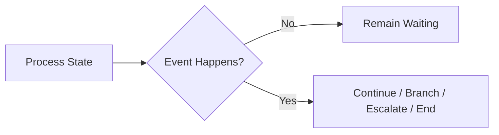

Dalam workflow CPQ/order management:

- “Quote Submitted” bisa menjadi message start event.
- “Customer Accepted Quote” bisa menjadi message catch event.
- “Approval SLA Expired” bisa menjadi timer boundary event.
- “Pricing Policy Violation” bisa menjadi BPMN error.
- “Need Manual Review” bisa menjadi escalation.
- “Order Cancelled” bisa menjadi interrupting event subprocess.
- “Rollback Reserved Inventory” bisa menjadi compensation handler.

Event membuat proses long-running menjadi eksplisit. Tanpa event, proses panjang biasanya berubah menjadi kombinasi scheduler, status polling, queue, dan if-else tersebar di banyak service.

---

## 2. Event Taxonomy: Start, Intermediate, End, Boundary, Event Subprocess

BPMN event dapat dipahami dari posisi dan arahnya.

| Jenis event | Posisi | Fungsi runtime | Contoh enterprise |
|---|---:|---|---|
| Start event | Awal process/subprocess | Membuat instance atau memulai event subprocess | quote submitted, order received |
| Intermediate catch event | Tengah proses | Menunggu kejadian | wait for payment confirmation |
| Intermediate throw event | Tengah proses | Melempar kejadian | publish escalation signal |
| End event | Akhir flow | Mengakhiri path dengan semantic tertentu | process completed, error thrown, terminate |
| Boundary event | Menempel pada activity/subprocess | Bereaksi terhadap kejadian saat activity aktif | timeout approval task |
| Event subprocess start event | Di dalam event subprocess | Menangkap event di scope proses/subprocess | cancellation received |

Cara berpikirnya:

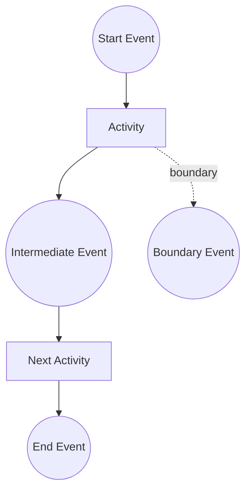

Event juga bisa dibedakan sebagai:

- **catching event**: proses menunggu atau menangkap event;
- **throwing event**: proses mengirim atau melempar event;
- **interrupting event**: menghentikan activity/scope yang ditempeli;
- **non-interrupting event**: membuat branch tambahan tanpa menghentikan activity/scope utama.

Kesalahan umum: engineer menggambar event hanya sebagai “notification” tanpa memikirkan apakah event itu catching/throwing, interrupting/non-interrupting, dan bagaimana runtime engine mengeksekusinya.

---

## 3. Lifecycle Event dalam Runtime Engine

Event bukan dekorasi diagram. Event punya lifecycle runtime.

Untuk catching event:

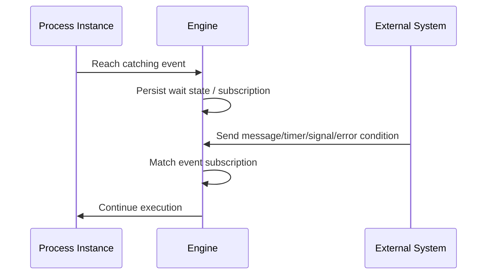

Untuk timer event:

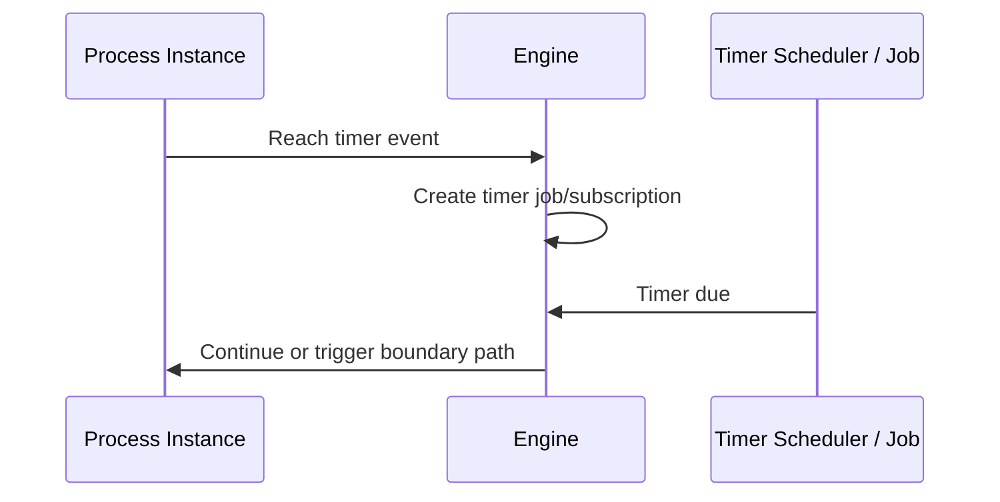

Untuk throwing event:

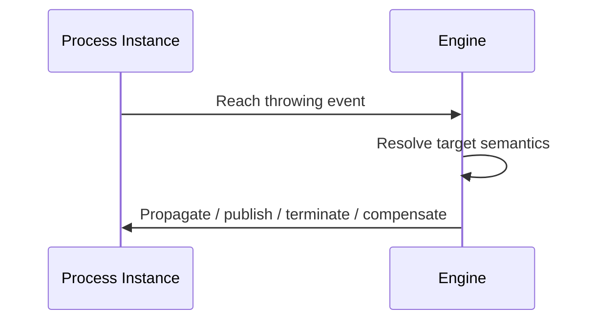

Runtime consequences:

- catching event biasanya membuat wait state;
- wait state harus bisa diobservasi;
- message/signal/timer perlu correlation atau subscription;
- boundary event mengubah lifecycle activity yang ditempeli;
- compensation event butuh handler yang sudah didefinisikan;
- terminate event bisa menghentikan flow lain secara agresif;
- event yang tidak match bisa menjadi lost signal, correlation failure, atau silent no-op tergantung jenis event dan engine behavior.

---

## 4. None Start Event

None start event adalah start event paling sederhana.

Ia berarti proses dimulai secara eksplisit oleh caller:

- REST API;
- internal service;
- scheduled command;
- operator action;
- test harness;
- process orchestration API.

Contoh:

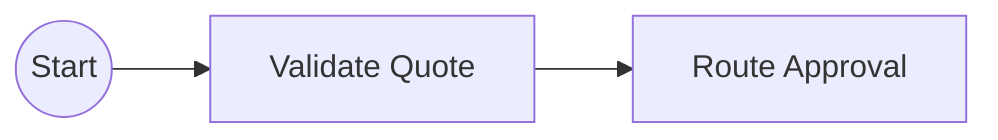

Dalam Java/JAX-RS:

```text
POST /quotes/{quoteId}/approval-process
```

Endpoint bisa memulai process instance dengan business key `quoteId` dan variable awal seperti `customerSegment`, `discountPercent`, `salesRegion`, dan `requestedBy`.

Kapan cocok:

- workflow dimulai oleh command eksplisit;
- caller tahu kapan proses harus dibuat;
- idempotency bisa dikontrol di API layer;
- tidak perlu auto-start dari event eksternal.

Failure mode:

- duplicate process instance karena request retry;
- process dimulai sebelum business entity committed;
- process dimulai tanpa variable wajib;
- process dimulai dengan version yang salah;
- API mengembalikan success padahal process start gagal.

Review checklist:

- start process harus idempotent;
- gunakan business key/correlation key;
- validasi entity state sebelum start;
- pastikan process version strategy jelas;
- response API sebaiknya mengembalikan process instance identifier atau tracking reference.

---

## 5. Message Start Event

Message start event membuat process instance ketika message tertentu diterima.

Ini cocok ketika proses dimulai oleh external event, bukan command langsung.

Contoh:

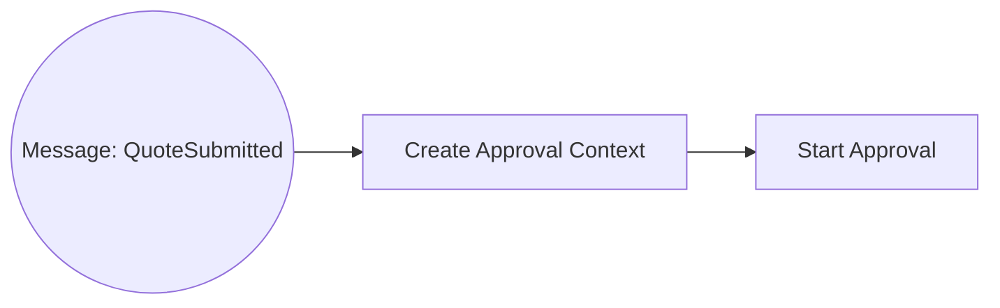

Dalam enterprise system, message start event sering dipakai untuk:

- order submitted event;
- quote submitted event;
- payment received event;
- provisioning request event;
- customer accepted quote event;
- fulfillment response event.

Namun message start event punya risiko besar: duplicate message bisa membuat duplicate process instance jika tidak ada deduplication.

### Correlation concern

Message event membutuhkan desain correlation.

Minimal harus jelas:

- message name;
- correlation key;
- business key;
- payload schema;
- expiration/TTL;
- duplicate strategy;
- late arrival strategy;
- replay strategy jika message berasal dari Kafka.

Dalam Kafka/RabbitMQ integration, jangan menganggap broker delivery sama dengan workflow correlation. Broker hanya mengirim message. Engine tetap butuh cara menentukan process definition atau process instance yang tepat.

### Camunda 7 vs Camunda 8 awareness

Pada Camunda 7, message correlation biasanya dilakukan melalui RuntimeService atau REST API engine.

Pada Camunda 8/Zeebe, message correlation menggunakan message name dan correlation key terhadap subscription yang aktif atau message start semantics. Worker/integration layer harus memastikan correlation key stabil dan payload kecil.

Hal yang harus diverifikasi secara internal:

- apakah message dikorelasikan langsung ke engine;
- apakah ada middleware service yang mengubah event broker menjadi engine command;
- apakah ada idempotency table sebelum start/correlate process;
- apakah correlation failure di-alert;
- apakah message replay dari Kafka bisa menyebabkan process duplikat.

---

## 6. Timer Start Event

Timer start event memulai proses berdasarkan waktu.

Contoh:

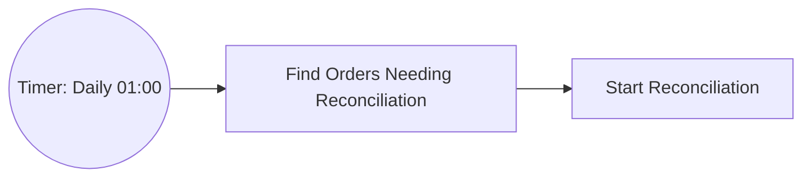

Kapan cocok:

- nightly reconciliation;
- periodic SLA scan;
- scheduled cleanup;
- batch process start;
- time-window driven workflow.

Kapan tidak cocok:

- high-frequency scheduling yang lebih tepat memakai scheduler khusus;
- job teknis tanpa business process lifecycle;
- polling ekstrem yang membebani engine;
- cron kompleks dengan business calendar khusus yang tidak didukung dengan baik.

Timer concern:

- timezone;
- daylight saving time;
- clock drift;
- cluster scheduling behavior;
- backlog saat engine/broker down;
- duplicate firing setelah recovery;
- migration impact;
- observability atas timer due vs executed.

Dalam Kubernetes/cloud/on-prem, timer harus dipikirkan sebagai distributed runtime concern. Pod restart, broker failover, database latency, dan search/export lag bisa memengaruhi persepsi “timer tidak jalan”.

---

## 7. Signal Start Event

Signal event adalah broadcast-style event. Satu signal dapat ditangkap oleh banyak listener.

Signal start event dapat memulai proses yang subscribe ke signal tersebut.

Gunakan signal dengan hati-hati karena ia bukan point-to-point correlation seperti message.

Cocok untuk:

- global operational trigger;
- broadcast change notification;
- event yang memang harus diketahui banyak process definition/instance;
- scenario administratif yang jelas scope-nya.

Tidak cocok untuk:

- event spesifik satu quote/order;
- callback external system yang harus diarahkan ke satu process instance;
- business command dengan target tunggal;
- event yang membutuhkan strict deduplication per aggregate.

Kesalahan umum: memakai signal karena “lebih gampang” daripada mendesain correlation key. Ini biasanya menghasilkan efek samping yang sulit diprediksi.

Internal verification checklist:

- cek apakah signal dipakai untuk event yang seharusnya message;
- cek jumlah process definition/instance yang dapat menangkap signal;
- cek apakah signal bisa menyebabkan process start massal;
- cek auditability siapa yang melempar signal;
- cek security authorization untuk operasi signal.

---

## 8. Error Start Event

Error start event biasanya relevan di event subprocess, bukan sebagai top-level normal process start.

Mental model: error start event menangkap BPMN error yang dilempar dari scope di bawahnya.

Contoh:

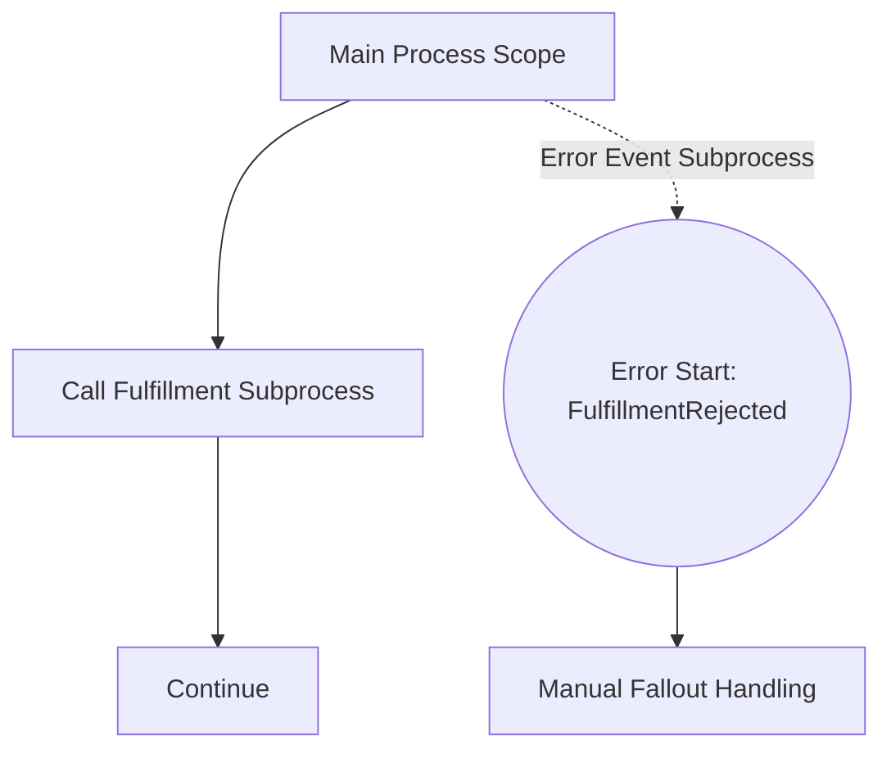

Gunakan error event untuk business deviation yang ingin dimodelkan dalam proses.

Contoh business error:

- quote tidak eligible untuk auto-approval;
- order validation rejected;
- payment authorization declined;
- provisioning rejected karena business rule;
- inventory reservation rejected.

Jangan gunakan BPMN error untuk:

- NullPointerException;
- connection timeout;
- database unavailable;
- HTTP 503 sementara;
- worker crash;
- serialization bug.

Technical failure biasanya lebih cocok menjadi retry/incident, bukan BPMN error.

---

## 9. Message Intermediate Event

Intermediate message catch event membuat proses menunggu message.

Contoh:

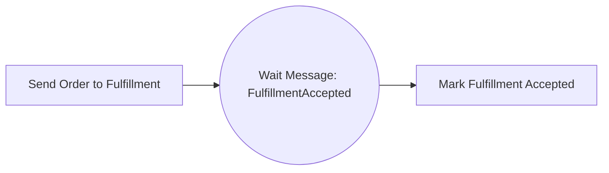

Ini sangat umum dalam long-running integration.

Use case:

- menunggu response external fulfillment;
- menunggu customer acceptance;
- menunggu payment callback;
- menunggu provisioning completion;
- menunggu asynchronous validation result.

Key design concern:

- message name harus stabil;
- correlation key harus unik dan deterministic;
- process harus punya behavior untuk timeout;
- duplicate message harus aman;
- late message setelah process selesai harus tertangani;
- missing message harus terdeteksi;
- payload tidak boleh terlalu besar;
- sensitive data tidak boleh dimasukkan sembarangan ke variable.

Pattern yang lebih sehat:

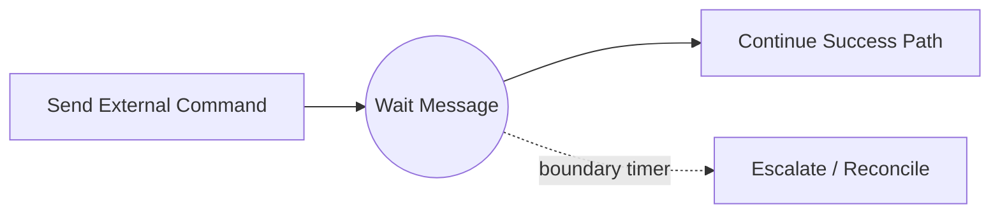

Dengan pola ini, proses tidak menunggu selamanya.

---

## 10. Timer Intermediate Event

Timer intermediate catch event membuat proses pause sampai waktu tertentu.

Contoh:

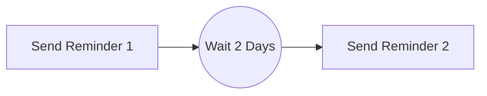

Kapan cocok:

- delay bisnis;
- cooldown period;
- reminder sequence;
- wait before retry yang memang business-visible;
- renewal window;
- grace period.

Kapan tidak cocok:

- retry teknis worker yang seharusnya engine/worker retry;
- throttling teknis yang lebih tepat di worker/rate limiter;
- high-volume timer untuk setiap small technical delay;
- sleep replacement di process model.

Timer event harus punya operational dashboard. Jika ribuan process instance menunggu timer, tim harus tahu apakah itu normal atau backlog.

---

## 11. Error Event

BPMN error event adalah mekanisme untuk memodelkan business error yang diketahui dan diharapkan bisa ditangani proses.

Contoh:

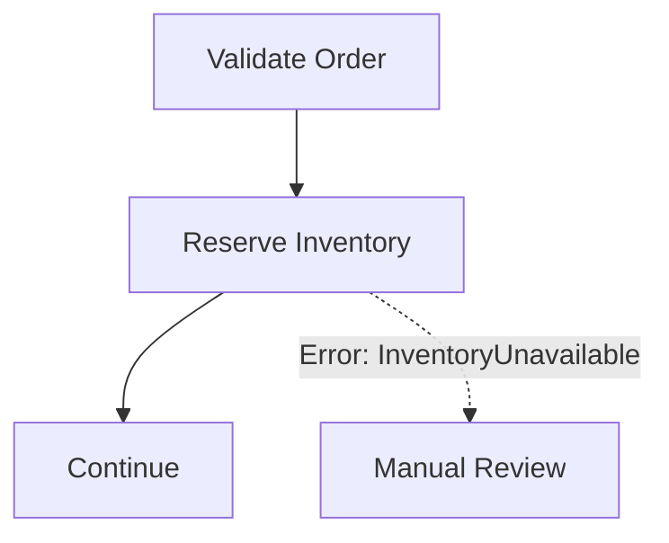

Perbedaan penting:

| Jenis masalah | Contoh | Respons yang lebih tepat |
|---|---|---|
| Business error | order rejected by rule | BPMN error / alternate path |
| Recoverable technical error | timeout service | retry, incident if exhausted |
| Programming bug | null pointer | incident, fix code |
| External outage | dependency down | retry/backoff/circuit breaker/incident |
| Policy escalation | need manager approval | escalation/user task/gateway |

Kesalahan umum adalah menangkap semua exception sebagai BPMN error agar proses “tetap jalan”. Ini berbahaya karena technical failure berubah menjadi business path palsu.

Senior review question:

> Apakah error ini merepresentasikan keputusan bisnis yang valid, atau sekadar kegagalan teknis yang harus di-retry/diincident-kan?

---

## 12. Escalation Event

Escalation event digunakan untuk menyampaikan kondisi non-critical ke scope yang lebih tinggi.

Berbeda dari error, escalation tidak selalu berarti flow gagal. Escalation bisa berarti “butuh perhatian” sambil proses tetap berjalan.

Contoh:

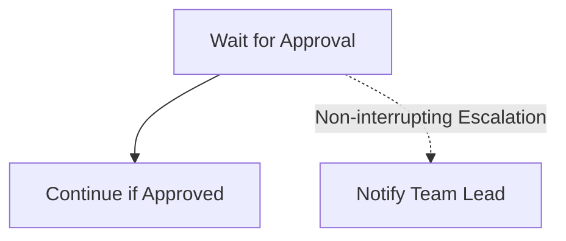

Cocok untuk:

- SLA warning;
- approval overdue;
- manual attention needed;
- operational notification;
- soft exception yang tidak menghentikan main flow.

Tidak cocok untuk:

- hard business rejection;
- technical failure;
- event yang harus membatalkan activity;
- event yang perlu strict correlation antar process instance.

Operational concern:

- escalation owner harus jelas;
- escalation yang tidak ditangkap bisa tidak menghasilkan incident tergantung engine semantics;
- alert fatigue bisa terjadi jika escalation terlalu sering;
- escalation harus punya downstream action, bukan sekadar “notify”.

---

## 13. Signal Event

Signal event adalah broadcast. Satu signal dapat ditangkap banyak process instance atau process definition.

Message event adalah point-to-point. Signal event adalah one-to-many.

| Aspek | Message | Signal |
|---|---|---|
| Target | Satu process instance/definition sesuai correlation | Banyak listener |
| Correlation | Strong correlation key | Broadcast subscription |
| Use case | order callback, payment result | global notification, broad trigger |
| Risiko | correlation failure | unintended mass reaction |

Gunakan signal jika broadcast memang semantik bisnisnya.

Contoh yang masuk akal:

- “maintenance window started” untuk menunda beberapa process;
- “catalog published” yang perlu diketahui banyak process;
- “manual operational signal” untuk banyak instance dengan guard tambahan.

Namun untuk CPQ/order management, sebagian besar event entity-specific lebih aman sebagai message event karena quote/order biasanya punya identity spesifik.

---

## 14. Compensation Event

Compensation event adalah mekanisme untuk menjalankan tindakan kompensasi setelah aktivitas tertentu sudah dilakukan.

Ini bukan rollback database transaction. Ini adalah business-level undo.

Contoh:

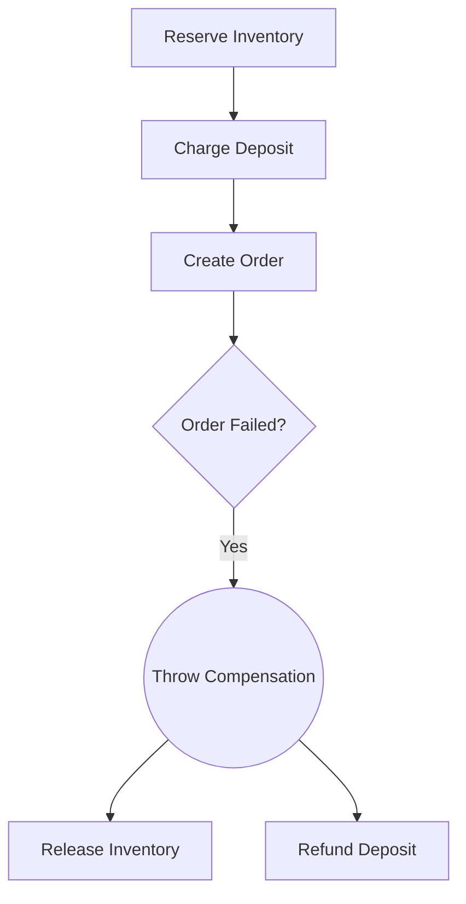

Dalam distributed system, compensation biasanya berarti:

- release inventory;
- reverse payment authorization;
- cancel external order;
- publish cancellation event;
- mark business entity as cancelled/failed;
- create manual task untuk repair.

Key concern:

- compensation handler harus idempotent;
- compensation order harus benar;
- compensation bisa gagal;
- compensation perlu audit trail;
- compensation tidak selalu mengembalikan dunia ke kondisi semula;
- external system mungkin tidak punya undo API;
- legal/business implication harus diverifikasi.

Jangan menjual compensation sebagai “rollback otomatis”. Dalam enterprise integration, compensation adalah proses bisnis baru yang juga bisa gagal.

---

## 15. Conditional Event

Conditional event menangkap kondisi berdasarkan expression terhadap variable atau state yang berubah.

Gunakan dengan hati-hati.

Conditional event bisa tampak menarik karena proses “otomatis bereaksi” saat variable berubah. Namun di production, ia bisa membuat flow sulit dipahami jika variable update tersebar di banyak worker.

Risiko:

- condition tersembunyi di expression;
- variable update dari worker lain memicu path tak terduga;
- sulit dilacak dari event logs;
- logic bisnis pindah ke expression kecil yang tidak diuji;
- behavior berbeda antara engine/version/support level.

Alternatif yang sering lebih jelas:

- explicit gateway setelah service task;
- explicit message event;
- explicit state transition command;
- DMN decision table;
- domain rule di service layer.

Internal verification checklist:

- cek apakah conditional event didukung oleh engine/version yang dipakai;
- cek siapa yang mengubah variable yang memicu condition;
- cek test untuk condition trigger;
- cek observability ketika condition match/tidak match;
- cek apakah condition sebenarnya business rule yang lebih cocok di DMN/domain service.

---

## 16. Link Event

Link event membantu menghubungkan bagian diagram yang jauh secara visual.

Fungsi utamanya biasanya readability, bukan integration runtime.

Gunakan link event jika diagram terlalu panjang dan perlu dipotong secara visual, tetapi hindari menjadikannya alat untuk menyembunyikan flow kompleks.

Risiko:

- pembaca kehilangan urutan eksekusi;
- link dipakai sebagai “goto”; 
- debugging token movement menjadi tidak intuitif;
- process model sulit direview oleh BA/product.

Untuk enterprise workflow, preferensi senior biasanya:

- pecah menjadi subprocess/call activity jika memang ada subflow konseptual;
- rapikan layout sebelum memakai link;
- gunakan link hanya jika memperjelas, bukan menyembunyikan kompleksitas.

---

## 17. Terminate End Event

Terminate end event menghentikan semua flow di scope tertentu.

Ini berbeda dari normal end event yang hanya mengakhiri path saat ini.

Contoh:

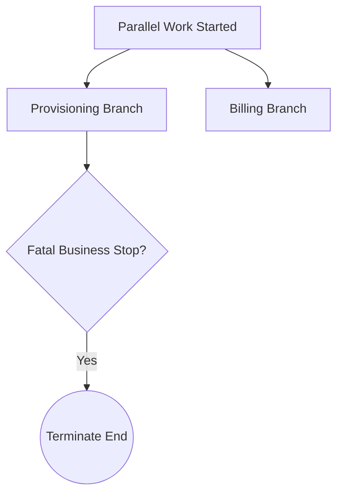

Gunakan terminate end event untuk kondisi yang memang harus menghentikan seluruh scope.

Cocok untuk:

- cancellation final;
- invalid process instance yang tidak boleh lanjut;
- fatal business stop;
- duplicate process detected;
- customer withdrew request sebelum fulfillment.

Risiko:

- branch lain dihentikan tanpa compensation;
- audit path hilang jika tidak dicatat sebelum terminate;
- worker yang sedang berjalan mungkin sudah melakukan side effect;
- downstream state bisa inconsistent;
- operator sulit memahami mengapa process berhenti.

Checklist sebelum terminate:

- apakah semua side effect sudah aman?
- apakah perlu compensation?
- apakah business entity state sudah di-update?
- apakah audit reason disimpan?
- apakah downstream event perlu dikirim?
- apakah terminate scope sudah benar?

---

## 18. Boundary Event: Interrupting vs Non-Interrupting

Boundary event menempel pada activity atau subprocess.

Ia aktif selama activity/subprocess tersebut aktif.

Ada dua jenis utama:

- **interrupting boundary event**: menghentikan activity utama;
- **non-interrupting boundary event**: membuat branch tambahan, activity utama tetap berjalan.

### Interrupting boundary event

Contoh approval timeout yang membatalkan task:

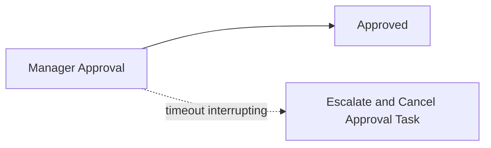

Cocok untuk:

- hard timeout;
- cancellation;
- error handling;
- activity tidak boleh lanjut setelah event terjadi.

### Non-interrupting boundary event

Contoh reminder SLA tanpa membatalkan approval:

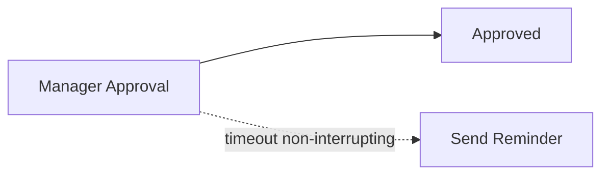

Cocok untuk:

- reminder;
- notification;
- soft escalation;
- background monitoring branch.

Kesalahan umum:

- memakai interrupting timer untuk reminder sehingga task approval hilang;
- memakai non-interrupting event untuk cancellation sehingga flow utama tetap berjalan;
- lupa bahwa non-interrupting event bisa terjadi berkali-kali jika timer cycle;
- tidak menamai boundary event sehingga reviewer tidak tahu konsekuensinya.

---

## 19. Event Subprocess

Event subprocess adalah subprocess yang dipicu oleh event dalam scope tertentu.

Ia berguna untuk menangkap event yang bisa terjadi kapan saja selama scope aktif.

Contoh cancellation:

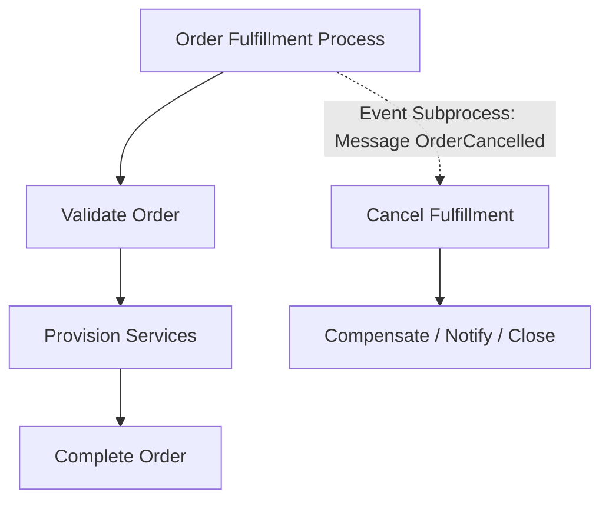

Cocok untuk:

- cancellation received;
- global timeout dalam process scope;
- external rejection;
- emergency stop;
- cross-cutting event handling;
- error handling dalam subprocess.

Design concern:

- interrupting atau non-interrupting;
- scope tempat event subprocess berada;
- variable yang tersedia dalam scope;
- compensation yang dibutuhkan;
- behavior saat event terjadi setelah process selesai;
- duplicate event handling;
- audit reason.

Event subprocess adalah alat kuat. Salah scope bisa membuat event terlalu luas atau terlalu sempit.

---

## 20. Event Selection Checklist

| Situasi | Event yang sering cocok | Catatan |
|---|---|---|
| Proses dimulai oleh API command | None start | Pastikan idempotency di API |
| Proses dimulai oleh event eksternal spesifik | Message start | Butuh message name + correlation/dedup |
| Proses periodik | Timer start | Perhatikan timezone/backlog |
| Menunggu callback external system | Intermediate message catch | Tambahkan timeout boundary |
| Approval melewati SLA tapi masih bisa lanjut | Non-interrupting timer boundary | Cocok untuk reminder/escalation |
| Approval harus dibatalkan setelah deadline | Interrupting timer boundary | Pastikan business semantics benar |
| Business rejection dari worker | BPMN error | Jangan pakai untuk technical exception |
| Perlu memberi tahu scope lebih tinggi | Escalation | Pastikan handler dan owner jelas |
| Broadcast ke banyak process | Signal | Hindari untuk entity-specific event |
| Perlu undo side effect bisnis | Compensation | Harus idempotent dan auditable |
| Harus menghentikan semua flow dalam scope | Terminate end | Pastikan compensation/audit sudah dipikirkan |
| Event bisa terjadi kapan saja selama process aktif | Event subprocess | Scope harus sangat jelas |

---

## 21. Camunda 7 vs Camunda 8 Event Awareness

Camunda 7 dan Camunda 8 sama-sama menggunakan BPMN, tetapi runtime dan support detail tidak identik.

Area yang harus dibedakan:

| Area | Camunda 7 | Camunda 8 / Zeebe |
|---|---|---|
| Runtime model | Java process engine, DB-backed runtime | Distributed orchestration engine, log/partition model |
| Message correlation | RuntimeService/REST, process engine DB state | Zeebe message correlation dengan correlation key |
| Timer execution | Job executor dan database-backed jobs | Zeebe timer records/jobs dalam broker runtime |
| Error handling | BPMN error, failed jobs, incidents | BPMN error, job failure, incidents in Operate |
| Signal behavior | Engine-level BPMN signal support | Perlu cek supported BPMN coverage/version |
| Compensation | Supported patterns perlu diverifikasi per version/use case | Perlu cek supported BPMN coverage/version |
| Event subprocess | Supported patterns perlu diverifikasi | Perlu cek supported BPMN coverage/version |

Prinsipnya: jangan hanya bertanya “BPMN mendukung event ini?” Tanyakan juga:

- apakah engine version yang dipakai mendukung execution event ini?
- apakah modelling tool membolehkan tetapi runtime tidak mengeksekusi?
- bagaimana observability-nya?
- bagaimana migration/versioning impact-nya?
- apakah event ini ada limitation dalam Camunda 7 atau Camunda 8 yang dipakai internal?

---

## 22. Java/JAX-RS Integration Impact

Event sering menjadi API boundary.

Pola umum:

```text
REST API -> validate command -> persist business state -> start/correlate process -> return tracking response
```

Contoh:

- `POST /orders/{orderId}/cancel` mengirim cancellation message ke process.
- `POST /quotes/{quoteId}/approval-callback` mengorelasikan approval result.
- `POST /fulfillment/callbacks` mengorelasikan fulfillment status.
- `POST /workflow/messages/{messageName}` mungkin dipakai internal, tetapi harus sangat dijaga authorization-nya.

Correctness concern:

- API retry harus idempotent;
- process correlation harus deterministic;
- business entity state harus konsisten dengan process state;
- authorization harus berdasarkan user/process/action, bukan hanya endpoint access;
- correlation failure harus menjadi observable error, bukan silently ignored;
- jangan expose raw engine API tanpa governance.

API response pattern:

- synchronous validation: `400/409` jika command tidak valid;
- accepted workflow command: `202 Accepted`;
- duplicate idempotent command: return existing tracking state;
- correlation not found: hati-hati, bisa berarti late/missing process, wrong key, atau business state invalid.

---

## 23. PostgreSQL/MyBatis/JDBC Impact

Event design memengaruhi database design.

Yang biasanya perlu ada:

- business key di table quote/order;
- process instance mapping table jika diperlukan;
- outbox table untuk event publish;
- inbox/dedup table untuk message consume;
- audit table untuk command/correlation;
- state transition table;
- unique constraint untuk idempotency;
- dead-letter/reconciliation table untuk failure.

Jangan mengandalkan process variable sebagai satu-satunya storage untuk state penting domain.

Contoh idempotency untuk message start:

```sql
-- pseudo DDL
create table workflow_message_dedup (
  message_id text primary key,
  business_key text not null,
  message_name text not null,
  received_at timestamptz not null,
  process_instance_ref text null
);
```

Saat message datang:

1. insert dedup key;
2. jika conflict, treat as duplicate;
3. validasi business entity;
4. start/correlate process;
5. update mapping/audit;
6. commit;
7. emit observability event/metric.

Failure mode:

- DB commit sukses tapi process correlation gagal;
- process correlation sukses tapi DB audit gagal;
- duplicate message masuk saat transaction pertama belum selesai;
- process variable berubah tetapi DB state tidak;
- reconciliation tidak tahu mana source of truth.

---

## 24. Kafka/RabbitMQ/Redis Impact

### Kafka

Kafka event bisa memicu message start/correlation. Risiko utamanya:

- replay membuat duplicate process;
- out-of-order event membuat process masuk path salah;
- compacted topic kehilangan event historis tertentu;
- schema evolution merusak variable mapping;
- consumer offset commit tidak sama dengan process correlation success.

Gunakan outbox/inbox, stable event key, schema governance, dan correlation audit.

### RabbitMQ

RabbitMQ sering dipakai untuk command/reply atau task queue.

Risiko:

- message redelivery setelah worker crash;
- DLQ tidak terkoneksi dengan incident workflow;
- retry di RabbitMQ bertabrakan dengan retry engine;
- reply message hilang atau correlation ID salah;
- routing key terlalu teknis dan tidak mencerminkan business event.

### Redis

Redis bisa membantu untuk dedup sementara, lock, rate limit, atau cache status, tetapi jangan jadikan Redis source of truth event correlation.

Risiko:

- key expired sebelum late message datang;
- Redis outage membuat dedup hilang;
- lock release salah;
- cache status tidak sinkron dengan process state.

---

## 25. Kubernetes, Cloud, and On-Prem Impact

Event behavior di production dipengaruhi runtime environment.

Hal yang perlu dipikirkan:

- worker restart saat message sedang diproses;
- pod termination sebelum worker complete/fail job;
- network partition antara worker dan engine;
- broker/database/search dependency outage;
- clock/timezone config antar pod/node;
- DNS/private endpoint issue ke external callback target;
- ingress timeout untuk callback API;
- autoscaling menyebabkan concurrency naik mendadak;
- secret rotation memutus connector/worker;
- on-prem firewall memblokir callback.

Event-driven workflow harus punya observability lintas layer:

```text
external event -> API/consumer -> dedup/audit -> engine correlation -> process movement -> worker action -> business DB/event
```

Jika salah satu link tidak terlihat, debugging production akan lambat.

---

## 26. Security and Privacy Concern

Event sering membawa data sensitif.

Checklist:

- jangan masukkan PII besar ke process variable tanpa alasan;
- jangan log payload event penuh;
- jangan expose raw message correlation endpoint publik;
- pastikan callback API punya authentication/signature/mTLS jika relevan;
- pastikan task/event authorization berdasarkan business context;
- pastikan event audit tidak menyimpan secret/token;
- pastikan Operate/Cockpit/Tasklist visibility tidak membocorkan sensitive variable;
- pastikan tenant/customer boundary tercermin dalam correlation key dan authorization check.

Dalam CPQ/order management, event payload bisa berisi customer, pricing, discount, contract, dan product data. Variable visibility dan history retention harus diperlakukan sebagai privacy/security concern, bukan detail teknis.

---

## 27. Observability Concern

Event failure harus bisa dideteksi.

Minimal metrics/logs/traces:

- message received count by message name;
- correlation success/failure count;
- duplicate message count;
- late message count;
- missing callback count;
- timer created/due/executed count;
- timer backlog;
- boundary timeout count;
- escalation count;
- BPMN error count by code;
- compensation started/completed/failed;
- process instance waiting by event type;
- average wait duration per event;
- worker failure related to event path;
- incident count after event path.

Useful log fields:

```text
correlationId
businessKey
processDefinitionKey
processInstanceKey/processInstanceId
messageName
eventType
activityId
tenantId
workerName
externalMessageId
idempotencyKey
```

Without these fields, event debugging becomes grep-driven archaeology.

---

## 28. Debugging Event Failures

### Symptom: message not correlated

Check:

1. message name exact match;
2. correlation key exact match;
3. process instance is actually waiting at matching event;
4. event subscription exists;
5. message arrived too early or too late;
6. duplicate message already consumed;
7. tenant/authorization mismatch;
8. wrong process version;
9. payload schema changed;
10. engine/broker connectivity issue.

### Symptom: timer not firing

Check:

1. timer definition syntax;
2. timezone/date/duration correctness;
3. engine/broker/job executor health;
4. timer job exists;
5. backlog due to load;
6. process instance still active;
7. migration changed timer activity;
8. node/pod clock issue;
9. DB/search/export lag causing visibility delay;
10. incident around timer path.

### Symptom: boundary event fired unexpectedly

Check:

1. interrupting vs non-interrupting marker;
2. attached activity scope;
3. timer cycle definition;
4. variable condition if conditional event;
5. duplicate external message;
6. signal broadcast scope;
7. process version deployed;
8. modelling mistake in event subprocess scope.

### Symptom: compensation did not run

Check:

1. compensation handler exists;
2. activity to compensate completed successfully;
3. compensation throw event reached;
4. scope is correct;
5. handler worker/delegate failed;
6. idempotency blocked execution incorrectly;
7. engine supports used compensation pattern;
8. incident created during compensation.

---

## 29. PR Review Checklist for BPMN Events

Gunakan checklist ini saat review BPMN/worker/API PR.

### Semantic correctness

- Event yang dipilih sesuai business meaning?
- Message vs signal sudah benar?
- Error vs incident/retry sudah benar?
- Escalation punya owner/action jelas?
- Timer merepresentasikan SLA/delay bisnis, bukan sleep teknis?
- Terminate event aman terhadap active branch lain?

### Correlation and idempotency

- Message name stabil?
- Correlation key deterministic?
- Duplicate/late/missing message ditangani?
- API/consumer idempotent?
- Business key tidak ambigu?
- Kafka replay/RabbitMQ redelivery aman?

### Runtime behavior

- Catch event membuat wait state yang observable?
- Boundary event interrupting/non-interrupting sesuai intent?
- Event subprocess scope tepat?
- Compensation handler tersedia dan idempotent?
- Timer backlog dimonitor?

### Integration

- Java/JAX-RS endpoint tidak expose engine secara raw?
- DB audit/dedup/mapping cukup?
- Worker failure dilaporkan dengan benar?
- Broker retry tidak bentrok dengan engine retry?
- Redis tidak menjadi source of truth event?

### Operations

- Ada metric correlation failure?
- Ada dashboard waiting event?
- Ada alert SLA/timer backlog?
- Ada runbook message not correlated?
- Ada security review payload/variable/log?

---

## 30. Internal Verification Checklist

Verifikasi di codebase dan platform internal:

- BPMN model yang memakai message event, timer event, signal event, error event, escalation, compensation, boundary event, dan event subprocess.
- Naming convention untuk message name, signal name, error code, escalation code, timer activity ID.
- Cara process dimulai: REST API, Kafka consumer, RabbitMQ consumer, scheduler, operator action, atau direct engine API.
- Cara message correlation dilakukan: Camunda 7 RuntimeService/REST, Camunda 8 Zeebe client/API, connector, middleware service, atau custom wrapper.
- Business key/correlation key strategy untuk quote/order.
- Deduplication/inbox/outbox table untuk event integration.
- Handling duplicate, late, missing, dan out-of-order messages.
- Retry policy untuk event consumer dan worker.
- Timer definition dan SLA escalation policy.
- Incident policy untuk failed correlation, failed worker, failed timer path, dan compensation failure.
- Cockpit/Operate dashboard untuk waiting events, incidents, timer backlog, and task aging.
- Security policy untuk callback endpoint, event payload, process variable, task form, and logs.
- Kubernetes/cloud/on-prem config yang memengaruhi event: clock, DNS, ingress timeout, private networking, secret rotation, pod shutdown.
- Diskusi dengan BA/product/solution architect: apakah event path sesuai business language dan operational responsibility.

---

## 31. Key Takeaways

- Event BPMN adalah runtime contract, bukan ikon diagram.
- Message event cocok untuk point-to-point correlation; signal event cocok untuk broadcast.
- Timer event adalah production scheduling concern, bukan sekadar delay visual.
- BPMN error adalah business deviation; technical failure lebih sering menjadi retry/incident.
- Escalation harus punya owner/action, bukan hanya notification.
- Compensation adalah business-level undo yang bisa gagal, bukan database rollback.
- Boundary event interrupting vs non-interrupting adalah correctness decision.
- Event subprocess sangat kuat, tetapi scope yang salah dapat membuat proses berbahaya.
- Setiap event yang menunggu sesuatu harus punya observability dan failure handling.
- Dalam CPQ/order management, event design harus selaras dengan quote/order identity, state transition, SLA, customer impact, dan auditability.

---

## References

- Camunda 8 Docs — BPMN Events Overview: https://docs.camunda.io/docs/components/modeler/bpmn/events/
- Camunda 8 Docs — Message Events: https://docs.camunda.io/docs/components/modeler/bpmn/message-events/
- Camunda 8 Docs — Timer Events: https://docs.camunda.io/docs/components/modeler/bpmn/timer-events/
- Camunda 8 Docs — Error Events: https://docs.camunda.io/docs/components/modeler/bpmn/error-events/
- Camunda 8 Docs — Escalation Events: https://docs.camunda.io/docs/components/modeler/bpmn/escalation-events/
- Camunda 8 Docs — Workflow Patterns: https://docs.camunda.io/docs/components/concepts/workflow-patterns/
- Camunda 8 Docs — BPMN Coverage: https://docs.camunda.io/docs/components/modeler/bpmn/bpmn-coverage/
