# Gateways and Flow Control

> Fokus part ini: memahami gateway BPMN sebagai mekanisme routing token yang menentukan correctness proses. Targetnya adalah Anda bisa mereview exclusive, parallel, inclusive, event-based, dan complex gateway awareness dengan kacamata runtime, bukan hanya layout diagram. Dalam workflow enterprise, gateway yang salah dapat menyebabkan proses stuck, branch ganda, race condition, duplicate side effect, missed SLA, atau state quote/order yang tidak konsisten.

Gateway adalah titik keputusan dan sinkronisasi dalam BPMN.

Jika event menjawab “apa yang terjadi?”, gateway menjawab “jalur mana yang harus diambil dan bagaimana branch digabungkan kembali?”

Gateway terlihat sederhana, tetapi merupakan salah satu sumber bug paling mahal di workflow production:

- exclusive gateway tanpa default flow membuat process instance gagal saat tidak ada condition match;
- parallel gateway membuka banyak branch yang memanggil external service secara bersamaan tanpa idempotency;
- parallel join menunggu branch yang tidak pernah aktif;
- inclusive gateway sulit dibaca dan salah join;
- event-based gateway menunggu event yang tidak pernah datang;
- gateway condition menyembunyikan business rule kompleks;
- process state dan entity state divergen karena branch berjalan bersamaan;
- diagram terlihat “rapi”, tetapi runtime token movement tidak sesuai intent bisnis.

Untuk senior backend engineer, gateway harus direview seperti control-flow code yang berdampak ke transaksi, worker, database, message broker, SLA, dan incident handling.

---

## 1. Gateway Mental Model

Sequence flow biasa hanya mengalir satu arah.

Gateway memungkinkan pola yang lebih kompleks:

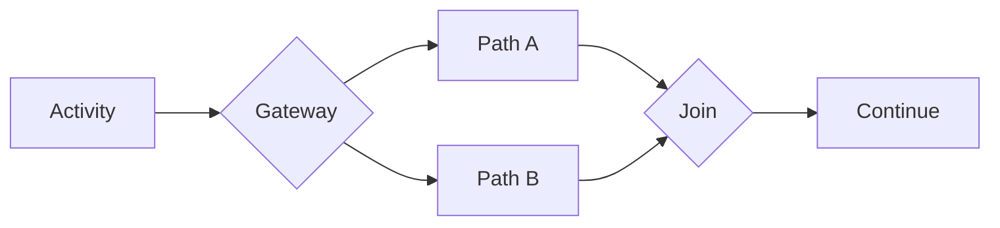

Gateway dapat berperan sebagai:

- **split**: satu token masuk, satu atau banyak token keluar;
- **join**: banyak path masuk, proses disatukan lagi;
- **decision point**: route berdasarkan data/event;
- **synchronization point**: tunggu beberapa branch selesai;
- **race point**: lanjut berdasarkan event pertama yang terjadi.

Mental model penting:

> Gateway bukan hanya diamond di diagram. Gateway adalah runtime instruction tentang token routing.

Setiap gateway harus menjawab:

- apakah gateway memilih satu path atau banyak path?
- apakah condition saling eksklusif?
- apakah ada default path?
- apakah branch paralel aman?
- apakah join akan menunggu token yang benar-benar ada?
- apakah gateway membuat process lebih readable atau lebih membingungkan?
- apakah business rule sebaiknya di gateway, DMN, atau domain service?

---

## 2. Split Semantics vs Join Semantics

Gateway split dan gateway join sering memakai simbol yang sama, tetapi semantics-nya berbeda.

### Split

Split adalah saat token masuk dari satu path dan keluar ke satu atau banyak path.

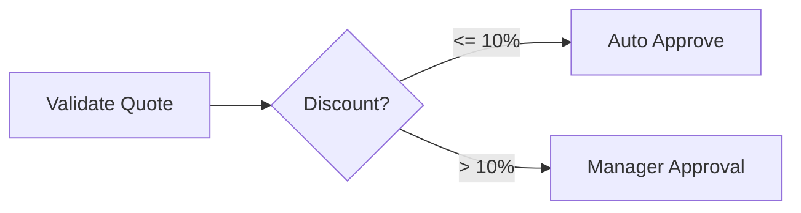

### Join

Join adalah saat beberapa path masuk disatukan kembali.

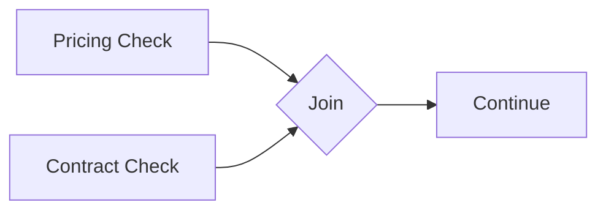

Pertanyaan review untuk join:

- gateway join ini pass-through atau synchronization?
- apakah ia menunggu semua branch?
- apakah semua incoming branch pasti pernah aktif?
- apakah ada path yang bisa dilewati sehingga join menunggu selamanya?
- apakah join sesuai gateway split sebelumnya?

Banyak bug BPMN terjadi karena modeller menggunakan gateway join yang salah.

---

## 3. Exclusive Gateway

Exclusive gateway memilih satu path dari beberapa path berdasarkan condition.

Ia mirip `if / else if / else`.

Contoh:

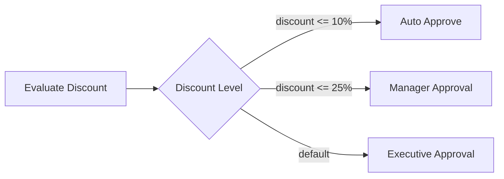

Runtime expectation:

- satu token masuk;
- condition dievaluasi;
- satu outgoing sequence flow dipilih;
- jika tidak ada condition match dan tidak ada default flow, process dapat gagal/incident/error tergantung engine/runtime behavior.

### Default flow wajib dipikirkan

Default flow bukan optional secara desain production. Hampir setiap exclusive gateway harus punya fallback eksplisit.

Fallback tidak selalu berarti “lanjut normal”. Bisa berupa:

- manual review;
- reject invalid process;
- create incident/manual task;
- terminate duplicate process;
- call decision repair path.

Tanpa default flow, perubahan payload kecil bisa membuat proses berhenti di gateway.

### Condition harus saling eksklusif

Contoh buruk:

```text
Path A: discount > 10
Path B: discount > 20
```

Jika discount `25`, dua condition benar. Exclusive gateway tetap hanya memilih satu path berdasarkan evaluation order/engine behavior. Ini rawan karena business reader mungkin mengira dua path relevan.

Lebih baik:

```text
Path A: discount > 10 and discount <= 20
Path B: discount > 20
```

Atau pindahkan decision ke DMN jika aturan mulai kompleks.

### Join exclusive gateway

Exclusive gateway dapat dipakai sebagai join pass-through untuk meningkatkan readability.

Namun ia tidak melakukan synchronization parallel branch. Jika beberapa concurrent branch masuk, ia akan melewatkan token masing-masing secara terpisah.

Kesalahan umum: memakai exclusive gateway untuk menggabungkan branch paralel. Itu bukan join sinkronisasi.

---

## 4. Parallel Gateway

Parallel gateway membuat semua outgoing paths aktif.

Ia mirip `fork`.

Contoh:

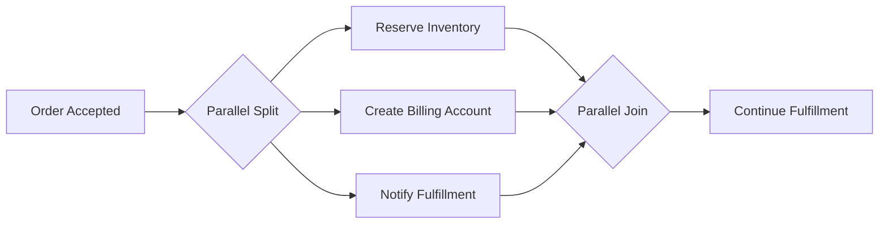

Runtime expectation:

- satu token masuk ke split;
- semua outgoing sequence flow diambil;
- branch berjalan secara concurrent secara logis;
- parallel join menunggu semua incoming flows yang diharapkan;
- setelah semua token tiba, satu token keluar dari join.

### Parallelism is not free

Parallel branch bisa meningkatkan throughput, tetapi juga meningkatkan risk:

- external API dipanggil bersamaan;
- database rows di-update bersamaan;
- worker concurrency naik;
- event publish urutan tidak deterministic;
- retry di satu branch bisa membuat process menunggu lama;
- compensation menjadi lebih kompleks;
- partial success lebih sering terjadi.

Dalam CPQ/order management, parallel branch mungkin masuk akal untuk independent validation:

- pricing check;
- contract check;
- credit check;
- product compatibility check.

Namun branch tersebut harus benar-benar independent atau punya coordination jelas.

### Parallel join failure

Parallel join bisa menyebabkan process stuck jika salah satu branch tidak pernah mencapai join.

Contoh masalah:

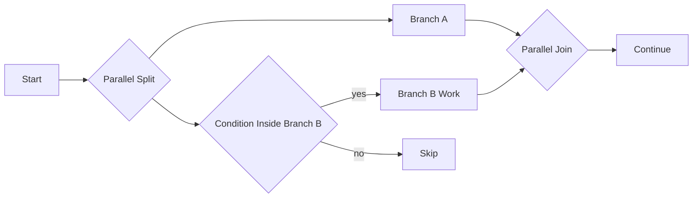

Jika path `no` tidak menuju join, join menunggu token dari branch yang mungkin tidak pernah datang. Desain ini salah.

Rule of thumb:

> Jika parallel split membuka N branch, pastikan join semantics memahami seluruh branch yang bisa aktif.

---

## 5. Inclusive Gateway

Inclusive gateway memilih satu atau lebih path berdasarkan condition.

Ia mirip kombinasi beberapa `if` yang bisa aktif bersamaan.

Contoh:

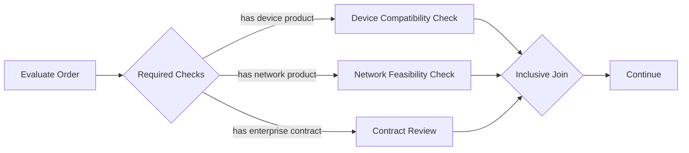

Runtime expectation:

- satu token masuk;
- satu atau lebih outgoing condition dapat diambil;
- inclusive join harus menunggu branch yang memang aktif, bukan semua possible branches;
- jika tidak ada condition match, default flow sebaiknya tersedia.

Inclusive gateway powerful tetapi lebih sulit dibaca dibanding exclusive/parallel.

### Kapan cocok

- beberapa independent optional check;
- jumlah branch tidak terlalu banyak;
- condition sederhana;
- join behavior jelas;
- reviewer bisnis bisa memahami mengapa beberapa path bisa aktif.

### Kapan harus dihindari

- condition kompleks;
- branch punya side effect berat;
- branch saling bergantung;
- perlu strict ordering;
- reviewer sering bingung membaca diagram;
- test coverage belum kuat.

Inclusive gateway sering menjadi sumber bug karena orang mengira ia sama dengan exclusive gateway atau parallel gateway.

Jika semua path selalu harus jalan, gunakan parallel gateway.

Jika hanya satu path boleh jalan, gunakan exclusive gateway.

Jika banyak optional path bisa jalan, baru pertimbangkan inclusive gateway.

---

## 6. Event-Based Gateway

Event-based gateway memilih jalur berdasarkan event pertama yang terjadi.

Berbeda dari exclusive gateway yang memilih berdasarkan data, event-based gateway memilih berdasarkan event runtime.

Contoh:

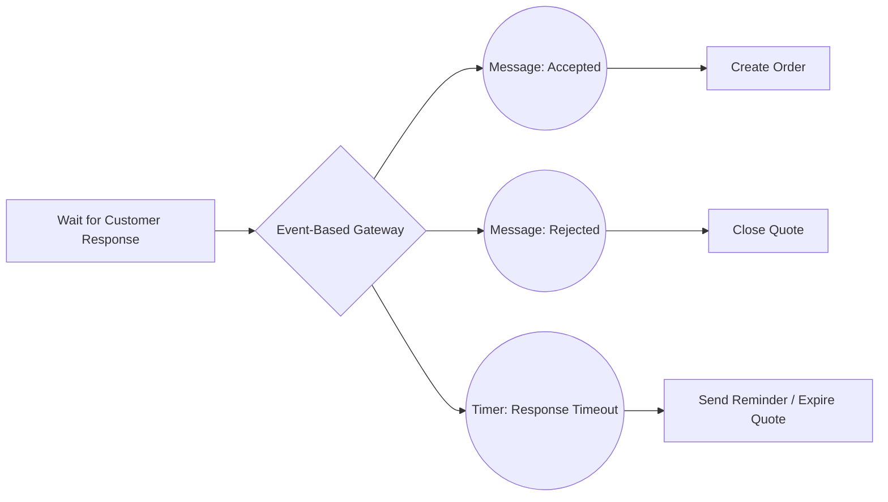

Runtime expectation:

- process mencapai event-based gateway;
- engine membuat subscription untuk event-event berikutnya;
- event pertama yang terjadi menang;
- path lain dibatalkan/diabaikan sesuai semantics;
- proses lanjut pada path pemenang.

Kapan cocok:

- menunggu salah satu dari beberapa external outcomes;
- customer accepted vs rejected vs timeout;
- payment success vs failure vs timeout;
- fulfillment accepted vs rejected vs timeout;
- manual intervention vs external callback.

Risk:

- duplicate/late event setelah salah satu path menang;
- timeout menang sebelum callback sukses yang terlambat;
- event subscription tidak terbentuk karena process belum mencapai gateway;
- message datang terlalu awal;
- correlation key salah;
- path kalah tetap punya side effect di external system;
- observability kurang jelas untuk event yang kalah/late.

Design question:

> Jika event B datang setelah timer path sudah menang, apa business behavior yang benar?

Tanpa jawaban ini, event-based gateway belum production-ready.

---

## 7. Complex Gateway Awareness

BPMN punya complex gateway untuk synchronization/routing logic kompleks.

Namun dalam praktik enterprise Camunda, complex gateway sering dihindari karena:

- sulit dipahami reviewer;
- sulit dites;
- support/runtime behavior perlu diverifikasi per engine/version;
- business semantics sering lebih jelas jika dimodelkan dengan explicit subprocess, DMN, atau service logic;
- debugging production menjadi sulit.

Senior guideline:

> Jika Anda merasa perlu complex gateway, berhenti dulu. Kemungkinan desain proses perlu disederhanakan atau dipisah.

Alternatif:

- pecah ke subprocess;
- gunakan DMN untuk decision;
- gunakan explicit state machine di domain service;
- gunakan parallel/inclusive gateway dengan join jelas;
- gunakan manual review path;
- gunakan orchestration service step yang menghitung next action secara eksplisit.

Internal verification checklist:

- apakah engine/version mendukung complex gateway execution?
- apakah test coverage mencakup semua kombinasi branch?
- apakah BA/product bisa membaca logic-nya?
- apakah ada observability untuk path yang dipilih?
- apakah logic lebih tepat di DMN/domain service?

---

## 8. Default Flow

Default flow adalah fallback path ketika condition lain tidak match.

Pada exclusive/inclusive gateway, default flow adalah safety net.

Contoh:

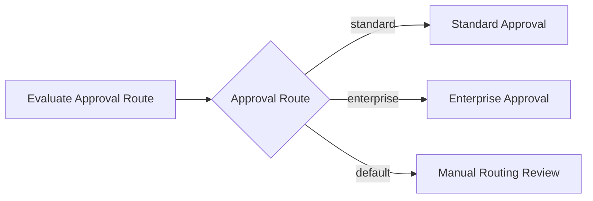

Tanpa default flow:

- process bisa gagal saat data baru muncul;
- enum baru tidak tertangani;
- null variable membuat expression false;
- deployment process baru tidak compatible dengan payload lama;
- operator sulit tahu path repair yang benar.

Default flow yang sehat:

- diberi nama jelas;
- bukan “happy path” tersembunyi;
- mengarah ke safe handling;
- mencatat reason;
- observable;
- punya owner manual review jika diperlukan.

Default flow yang buruk:

- auto-approve;
- silently continue;
- terminate tanpa audit;
- retry teknis tanpa memperbaiki data;
- set status generik “failed” tanpa reason.

---

## 9. Conditional Flow

Conditional sequence flow menentukan path berdasarkan expression.

Condition adalah code kecil yang sering luput dari review.

Contoh:

```text
= discountPercent > 20 and customerSegment = "ENTERPRISE"
```

Risk:

- variable missing/null;
- type mismatch;
- expression syntax berbeda antar engine/version;
- rule duplikat dengan Java service/DMN;
- condition overlap;
- condition gap;
- business rule sulit diuji;
- condition berubah tanpa migration consideration.

Guideline:

- condition harus pendek;
- condition harus readable oleh BA/engineer;
- rule kompleks pindahkan ke DMN/domain service;
- gunakan default flow;
- test semua branch;
- log/metric route decision jika high impact;
- hindari expression yang memanggil logic kompleks atau side effect.

Decision rule:

| Jenis logic | Tempat yang lebih tepat |
|---|---|
| Simple route berdasarkan variable | Gateway condition |
| Approval matrix | DMN |
| Domain invariant | Domain service/state machine |
| Pricing calculation | Pricing service/rules engine |
| Technical retry decision | Worker/engine retry policy |
| Authorization | Security layer/domain policy |

---

## 10. Gateway Readability

Gateway harus punya nama bisnis.

Buruk:

```text
Gateway_0k31a
Condition 1
Condition 2
```

Lebih baik:

```text
Is discount within auto-approval limit?
Path: Auto approval eligible
Path: Manager approval required
Path: Manual routing required
```

Readability matters karena BPMN adalah communication contract antara business dan engineering.

Checklist readability:

- gateway question jelas;
- outgoing path diberi label business-level;
- condition tidak hanya technical variable expression;
- default path eksplisit;
- branch count tidak berlebihan;
- join diberi label jika semantics tidak obvious;
- diagram tidak memaksa pembaca mengikuti garis silang-silang.

Kalau gateway tidak bisa dijelaskan dalam satu kalimat, kemungkinan rule terlalu kompleks atau boundary salah.

---

## 11. Gateway Misuse Patterns

### 11.1 Exclusive gateway dipakai untuk parallel logic

Jika dua check harus jalan, jangan pilih salah satu.

Buruk:

```text
if needsPricingCheck -> Pricing Check
else if needsContractCheck -> Contract Check
```

Jika order butuh keduanya, path kedua hilang.

Gunakan inclusive atau parallel tergantung semantics.

### 11.2 Parallel gateway dipakai untuk optional logic

Jika branch tidak selalu diperlukan, parallel gateway akan menjalankan semua branch.

Akibat:

- unnecessary worker execution;
- external call yang tidak perlu;
- side effect salah;
- join menunggu branch yang seharusnya tidak ada.

### 11.3 Inclusive gateway dipakai karena bingung

Inclusive gateway sering dipilih saat modeller tidak yakin apakah path satu atau banyak.

Ini tanda desain belum jelas.

Tanya business:

- apakah hanya satu route valid?
- apakah beberapa route bisa valid bersamaan?
- apakah semua route harus dijalankan?
- apa yang terjadi jika tidak ada route valid?

### 11.4 Gateway menyembunyikan rules besar

Jika gateway punya 8 outgoing path dengan expression panjang, gunakan DMN atau rules/domain service.

### 11.5 Join tidak cocok dengan split

Parallel split dengan exclusive join atau inclusive split dengan parallel join bisa membuat behavior tak terduga.

Selalu review split/join sebagai pasangan.

---

## 12. Parallelism Risk in Workflow

Parallel gateway tidak berarti thread Java langsung dibuat oleh service Anda, tetapi secara workflow ia menciptakan concurrent branches.

Dalam Camunda 7, branch parallel dapat menghasilkan jobs yang dieksekusi job executor/external workers tergantung async boundary dan task type.

Dalam Camunda 8/Zeebe, parallel branches dapat menghasilkan jobs yang diaktifkan oleh workers, berpotensi dengan concurrency tinggi.

Risiko parallelism:

- race update ke business table;
- optimistic lock conflict;
- duplicate event publish;
- external API rate limit;
- side effect ordering tidak deterministic;
- compensation order rumit;
- branch failure membuat process partial;
- worker autoscaling memperbesar throughput tanpa readiness downstream.

Mitigation:

- idempotent worker;
- optimistic locking;
- unique constraint;
- outbox pattern;
- worker concurrency limit;
- rate limiter;
- clear compensation strategy;
- timeout per branch;
- observability per branch;
- process variable update discipline.

---

## 13. Race Condition

Race condition terjadi ketika dua branch/event bersaing mengubah state yang sama.

Contoh:

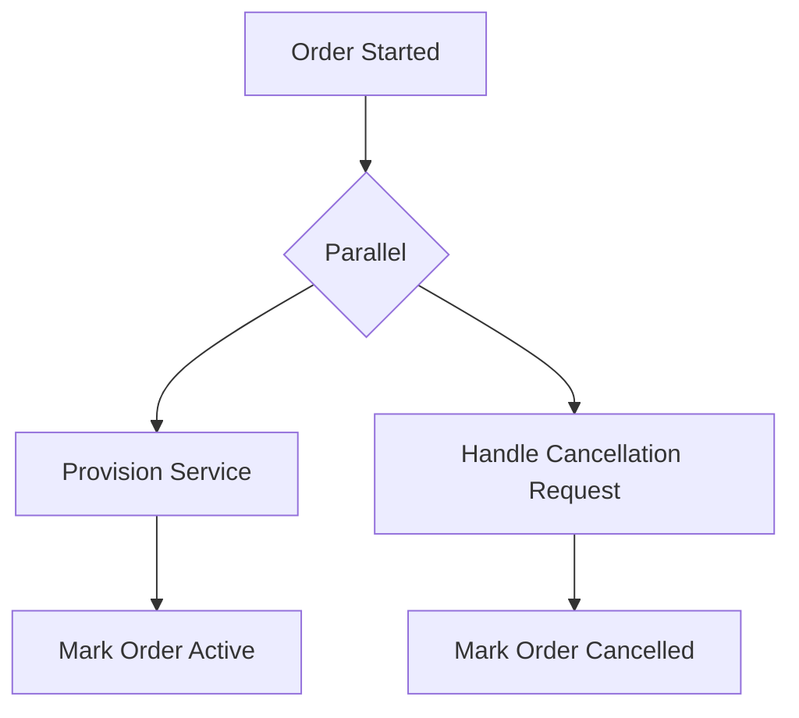

Jika cancellation dan provisioning berjalan bersamaan, state akhir bisa tergantung timing.

Ini tidak boleh diselesaikan hanya dengan menggambar gateway.

Perlu domain guard:

- state transition validation;
- optimistic locking;
- command idempotency;
- cancellation precedence rule;
- compensation if provisioning already completed;
- event ordering policy;
- audit trail.

Rule penting:

> Workflow mengorkestrasi, tetapi domain layer tetap harus melindungi invariant.

Jangan mengandalkan BPMN sebagai satu-satunya penjaga illegal transition.

---

## 14. Missing Join

Missing join terjadi ketika branch parallel/inclusive tidak pernah disatukan atau disatukan dengan gateway salah.

Gejala:

- process instance terlihat stuck;
- satu branch completed tapi process belum lanjut;
- token menunggu di gateway;
- tidak ada incident teknis;
- operator bingung karena “semua task sudah selesai”.

Penyebab:

- branch skip tidak menuju join;
- boundary event interrupting membatalkan path yang join tunggu;
- event subprocess mengubah scope;
- migration menghapus activity sebelum join;
- inclusive join tidak memahami condition karena model rumit;
- modeller memakai gateway join yang salah.

Debugging steps:

1. lihat current activities/element instances;
2. identifikasi gateway yang menunggu;
3. trace branch yang dibuka dari split;
4. cek branch mana yang belum tiba;
5. cek boundary event/timer/error yang mengambil path lain;
6. cek process version model;
7. cek variable/condition saat split;
8. cek apakah incident tersembunyi di branch lain;
9. tentukan apakah repair perlu process instance modification/manual action.

---

## 15. Dead Path and Unreachable Flow

Dead path adalah path yang secara model ada, tetapi secara runtime tidak mungkin atau hampir tidak mungkin tercapai.

Contoh:

- condition overlap membuat path bawah tidak pernah dipilih;
- default flow tidak pernah diuji;
- gateway path butuh variable yang tidak pernah diset;
- event-based gateway menunggu message yang tidak pernah dikirim;
- signal name mismatch;
- branch hanya aktif di process version lama;
- inclusive gateway condition saling meniadakan.

Dead path berbahaya karena memberi ilusi bahwa failure sudah ditangani.

Detection:

- BPMN linting;
- scenario testing per path;
- production metrics path execution count;
- code review condition expressions;
- process mining/Optimize jika digunakan;
- incident review.

If a failure path exists only in diagram but never tested, it is not a real recovery path.

---

## 16. Gateways in Camunda 7 vs Camunda 8

Camunda 7 dan Camunda 8 sama-sama mengeksekusi BPMN gateway, tetapi runtime consequence berbeda karena arsitektur berbeda.

| Concern | Camunda 7 | Camunda 8 / Zeebe |
|---|---|---|
| Runtime storage | Database-backed process engine | Distributed broker/partition runtime |
| Parallel branch execution | Tergantung async continuation, job executor, external task | Job creation/activation by workers |
| Condition expression | Engine expression support perlu dicek | FEEL/expression behavior perlu dicek per model/version |
| Operational view | Cockpit/history DB | Operate/exporter/search |
| Failure symptom | failed job/incident/DB issue | incident/job failure/backpressure/worker issue |
| Migration impact | migration plan activity mapping | versioning/migration support perlu dicek per capability |

Gateway design harus mempertimbangkan:

- bagaimana condition dievaluasi;
- bagaimana jobs dibuat setelah gateway;
- apakah branch parallel menghasilkan worker load;
- bagaimana incident muncul;
- bagaimana process instance ditampilkan di Cockpit/Operate;
- apakah modelling tool mendukung gateway tetapi runtime version mendukung execution semantics penuh.

---

## 17. Java/JAX-RS Backend Impact

Gateway sering merepresentasikan hasil dari service layer atau API command.

Contoh flow:

```text
POST /quotes/{id}/submit
  -> Java service validates quote
  -> process starts with variables
  -> gateway routes approval path
```

Gateway condition biasanya membaca variable seperti:

- `discountPercent`;
- `customerSegment`;
- `orderType`;
- `riskScore`;
- `requiresManualReview`;
- `hasEnterpriseAgreement`;
- `isAmendment`.

Correctness concern:

- variable harus diset sebelum gateway;
- type harus stabil;
- null handling jelas;
- API request schema evolution tidak merusak gateway;
- backend domain invariant tidak boleh hanya ada di gateway;
- route decision perlu audit jika berdampak bisnis besar;
- authorization tidak boleh diputuskan hanya oleh gateway variable.

Jika gateway menentukan approval route bernilai bisnis tinggi, pertimbangkan DMN atau decision service agar rule lebih auditable dan testable.

---

## 18. PostgreSQL/MyBatis/JDBC Impact

Gateway condition sering berasal dari data di PostgreSQL.

Pilihan desain:

1. load data ke process variable sebelum gateway;
2. panggil service task/worker untuk menghitung decision;
3. pakai DMN dengan input yang disiapkan worker/service;
4. simpan route decision ke database audit;
5. gunakan domain service untuk state transition.

Jangan membuat process variable menjadi copy besar dari database entity.

Pattern yang lebih aman:

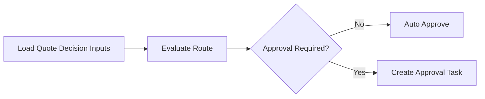

Worker `Load Quote Decision Inputs` membaca PostgreSQL dan hanya menyimpan variable kecil yang dibutuhkan:

```json
{
  "quoteId": "Q-123",
  "discountTier": "HIGH",
  "customerSegment": "ENTERPRISE",
  "requiresLegalReview": true
}
```

Failure mode:

- variable route stale karena quote berubah setelah gateway;
- gateway route tidak sesuai DB state terbaru;
- concurrent update mengubah eligibility;
- decision tidak diaudit;
- MyBatis query berbeda dengan rule di BPMN.

Mitigation:

- state transition guard di DB/domain layer;
- decision audit table;
- optimistic locking;
- revalidation sebelum final commit;
- minimal process variable;
- route decision event/log.

---

## 19. Kafka/RabbitMQ/Redis Impact

Gateway output sering menentukan integration path.

Contoh:

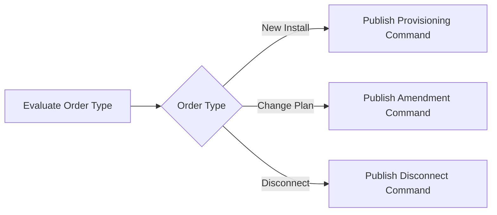

Kafka/RabbitMQ concern:

- branch event harus punya schema benar;
- event key/routing key sesuai business key;
- duplicate publish aman;
- branch yang kalah tidak boleh publish;
- route decision harus auditable;
- replay tidak boleh mengubah route lama tanpa migration policy;
- event order harus dipahami.

Redis concern:

- jangan gunakan Redis cache sebagai satu-satunya input gateway untuk keputusan penting;
- cache staleness bisa membuat route salah;
- lock/rate limiter perlu failure behavior;
- feature flag yang memengaruhi gateway harus diaudit.

Jika routing path memengaruhi fulfillment/customer impact, input gateway harus berasal dari source yang reliable dan decision harus direkam.

---

## 20. Kubernetes, Cloud, and On-Prem Impact

Gateway yang membuka parallel branch dapat mengubah load profile sistem.

Di Kubernetes:

- worker autoscaling bisa membuat branch dieksekusi lebih cepat tetapi membebani downstream;
- rolling restart bisa membuat job retry di branch tertentu;
- pod termination bisa meninggalkan side effect sebelum job completion;
- network policy bisa memblokir salah satu branch integration;
- resource limit bisa membuat worker branch lambat dan join menunggu;
- backpressure di Camunda 8 bisa memperlambat job activation.

Di cloud/on-prem/hybrid:

- branch ke external API cloud mungkin punya latency berbeda dari branch on-prem;
- firewall/private endpoint issue bisa membuat hanya satu path gagal;
- DNS issue bisa tampak seperti branch-specific incident;
- regional dependency bisa menyebabkan parallel branch asymmetry.

Gateway review harus melihat runtime topology, bukan hanya diagram.

---

## 21. Security and Privacy Concern

Gateway condition sering memakai sensitive business information:

- discount percent;
- customer segment;
- contract value;
- risk score;
- credit status;
- regulatory flag;
- enterprise agreement condition.

Security/privacy concerns:

- jangan log condition variable sembarangan;
- jangan expose variable ke Tasklist/Operate/Cockpit tanpa access control;
- route decision bisa mengungkap informasi sensitif;
- approval path bisa menjadi authorization boundary;
- tenant-specific rules harus tidak bocor ke tenant lain;
- feature flag/rule override harus auditable.

Jika gateway route menentukan siapa boleh approve apa, jangan hanya mengandalkan UI filtering. Backend authorization tetap wajib.

---

## 22. Observability for Gateways

Gateway decision harus bisa dilacak, terutama untuk high-impact process.

Metrics/logs yang berguna:

- gateway path count by process definition/version;
- default flow count;
- manual review fallback count;
- branch execution duration;
- parallel join wait duration;
- inclusive branch combination frequency;
- event-based gateway winning event count;
- timeout path count;
- route decision failure count;
- process instances stuck at join;
- incidents after specific gateway path;
- worker failures by branch.

Log fields:

```text
processDefinitionKey
processDefinitionVersion
processInstanceKey/processInstanceId
businessKey
gatewayId
gatewayName
selectedPath
conditionInputs
routeDecisionId
correlationId
tenantId
```

Condition inputs harus dipilih hati-hati agar tidak membocorkan PII/secrets.

---

## 23. Testing Gateway Logic

Gateway logic harus dites seperti business control flow.

Minimum test scenarios:

- each exclusive path;
- default path;
- no condition match;
- null/missing variable;
- type mismatch;
- boundary values;
- inclusive single path;
- inclusive multiple paths;
- inclusive no path/default;
- parallel all branches complete;
- parallel one branch fails;
- parallel one branch times out;
- event-based each event wins;
- event-based timeout wins;
- late event after timeout;
- duplicate event after path selected;
- process migration with token before/after gateway.

Testing guideline:

> Every gateway path that can affect customer outcome, money, order state, SLA, or manual work must have a test.

---

## 24. Debugging Gateway Failures

### Symptom: process took wrong path

Check:

1. process definition version;
2. gateway condition expression;
3. variable values at gateway time;
4. variable type/null handling;
5. default flow behavior;
6. recent code/DMN/model changes;
7. payload schema changes;
8. feature flag/config;
9. route decision audit/log;
10. whether domain service disagreed with BPMN route.

### Symptom: process stuck at join

Check:

1. gateway type;
2. active tokens/element instances;
3. branches opened at split;
4. branch completion status;
5. incidents in one branch;
6. boundary event interrupted branch;
7. missing path to join;
8. inclusive gateway semantics;
9. migration around split/join;
10. process instance modification history.

### Symptom: duplicate side effect

Check:

1. parallel branch duplication;
2. retry after branch worker failed;
3. non-idempotent worker;
4. event publish in multiple paths;
5. message redelivery;
6. job timeout too short;
7. duplicate process instance;
8. branch merge executed more than once.

### Symptom: event-based gateway timeout won incorrectly

Check:

1. message arrival time;
2. correlation key;
3. message subscription existence;
4. timer due time/timezone;
5. queue/consumer lag;
6. broker/engine downtime;
7. late message handling;
8. whether timer should have been non-final reminder instead.

---

## 25. Flow Correctness Review Checklist

Gunakan checklist ini saat mereview BPMN gateway.

### Gateway selection

- Apakah gateway type sesuai intent: exclusive, parallel, inclusive, event-based?
- Apakah complex gateway dihindari atau benar-benar justified?
- Apakah gateway punya nama bisnis yang jelas?
- Apakah outgoing path diberi label meaningful?

### Condition correctness

- Apakah condition saling eksklusif jika exclusive?
- Apakah semua possible input tertangani?
- Apakah default flow tersedia?
- Apakah null/type mismatch tertangani?
- Apakah rule terlalu kompleks untuk gateway?
- Apakah DMN/domain service lebih tepat?

### Split/join correctness

- Apakah split dan join cocok?
- Apakah parallel join menunggu branch yang benar?
- Apakah optional branch tidak membuat join stuck?
- Apakah inclusive join mudah dipahami?
- Apakah ada branch yang tidak kembali ke flow utama tanpa alasan?

### Parallelism and side effect

- Apakah branch paralel benar-benar independent?
- Apakah worker idempotent?
- Apakah DB update aman terhadap race?
- Apakah event publish aman terhadap duplicate?
- Apakah external API punya rate limit?
- Apakah compensation path tersedia?

### Event-based gateway

- Apakah semua event punya correlation strategy?
- Apakah timeout behavior benar secara bisnis?
- Apakah late/duplicate event ditangani?
- Apakah message datang terlalu awal bisa ditangani?
- Apakah winning path diaudit?

### Operations

- Apakah decision path observable?
- Apakah default/manual fallback di-alert?
- Apakah stuck join punya runbook?
- Apakah path coverage bisa dilihat di dashboard?
- Apakah process migration impact terhadap gateway sudah dinilai?

---

## 26. Internal Verification Checklist

Verifikasi di codebase, BPMN model, dan platform internal:

- Gateway apa saja yang dipakai di BPMN internal: exclusive, parallel, inclusive, event-based, atau complex.
- Gateway naming convention dan label outgoing sequence flow.
- Gateway condition expression dan variable yang dipakai.
- Default flow di exclusive/inclusive gateway.
- Branch yang memanggil Java delegate, external task, Zeebe worker, connector, Kafka/RabbitMQ publisher, PostgreSQL update, atau Redis interaction.
- Split/join pairing untuk parallel dan inclusive gateway.
- Process instances yang pernah stuck di join/gateway.
- Incident notes terkait wrong route, missing variable, condition failure, atau stuck token.
- Test coverage untuk setiap gateway path.
- Route decision audit di database/log/trace.
- Worker idempotency pada branch parallel.
- Locking/optimistic locking untuk branch yang update quote/order state.
- Kafka/RabbitMQ event yang hanya boleh dipublish oleh selected branch.
- Observability dashboard untuk path count, default path, branch latency, join wait, and incident by gateway.
- Camunda 7/Camunda 8 engine version support untuk gateway yang digunakan.
- Diskusi dengan BA/product/solution architect: apakah gateway mencerminkan business decision yang benar.

---

## 27. Key Takeaways

- Gateway adalah runtime control flow, bukan sekadar percabangan visual.
- Exclusive gateway memilih satu path; condition harus eksklusif dan punya default.
- Parallel gateway menjalankan semua path; branch harus aman secara idempotency, transaction, dan side effect.
- Inclusive gateway memilih satu atau lebih path; gunakan hanya jika optional multi-branch semantics benar-benar dibutuhkan.
- Event-based gateway memilih berdasarkan event pertama; late/duplicate event dan timeout semantics harus jelas.
- Complex gateway biasanya red flag untuk readability, testing, dan support.
- Split/join harus direview sebagai pasangan.
- Gateway condition yang kompleks lebih cocok di DMN/domain service.
- Parallelism di BPMN berdampak ke worker concurrency, database locking, broker event, external API, dan compensation.
- Setiap gateway path yang berdampak ke customer/order/SLA harus observable, testable, dan auditable.

---

## References

- Camunda 8 Docs — Gateways Overview: https://docs.camunda.io/docs/components/modeler/bpmn/gateways/
- Camunda 8 Docs — Exclusive Gateway: https://docs.camunda.io/docs/components/modeler/bpmn/exclusive-gateways/
- Camunda 8 Docs — Parallel Gateway: https://docs.camunda.io/docs/components/modeler/bpmn/parallel-gateways/
- Camunda 8 Docs — Inclusive Gateway: https://docs.camunda.io/docs/components/modeler/bpmn/inclusive-gateways/
- Camunda 8 Docs — Event-Based Gateway: https://docs.camunda.io/docs/components/modeler/bpmn/event-based-gateways/
- Camunda 8 Docs — BPMN Coverage: https://docs.camunda.io/docs/components/modeler/bpmn/bpmn-coverage/
- Camunda 8 Docs — Process Instance Modification: https://docs.camunda.io/docs/components/concepts/process-instance-modification/
