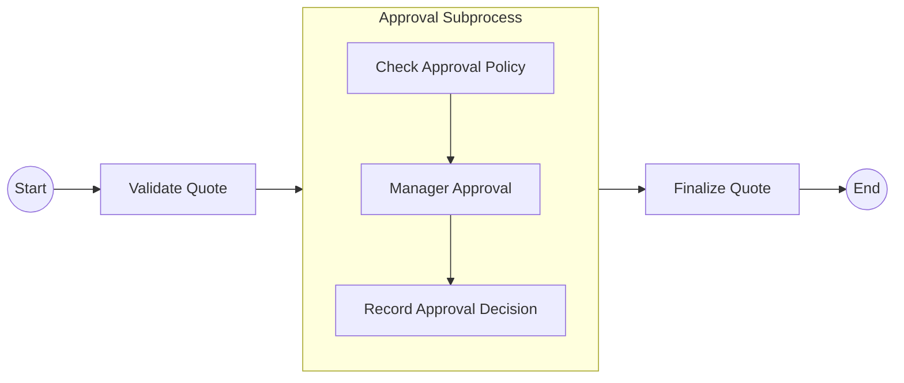
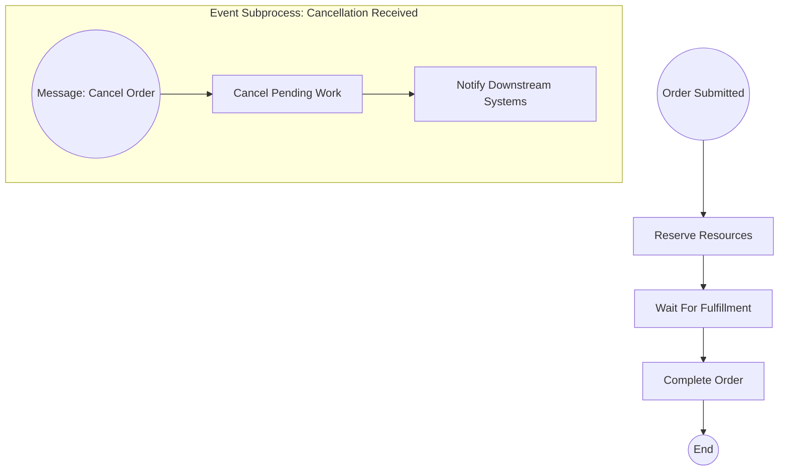
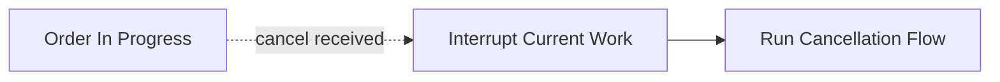
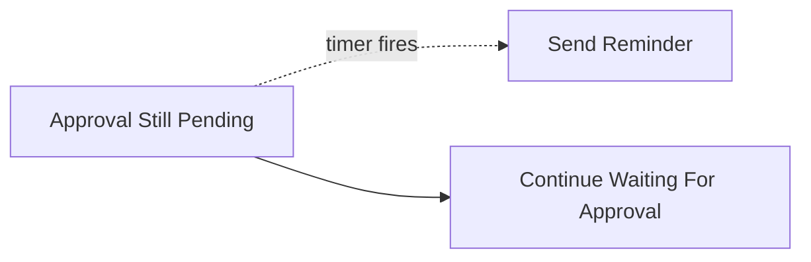
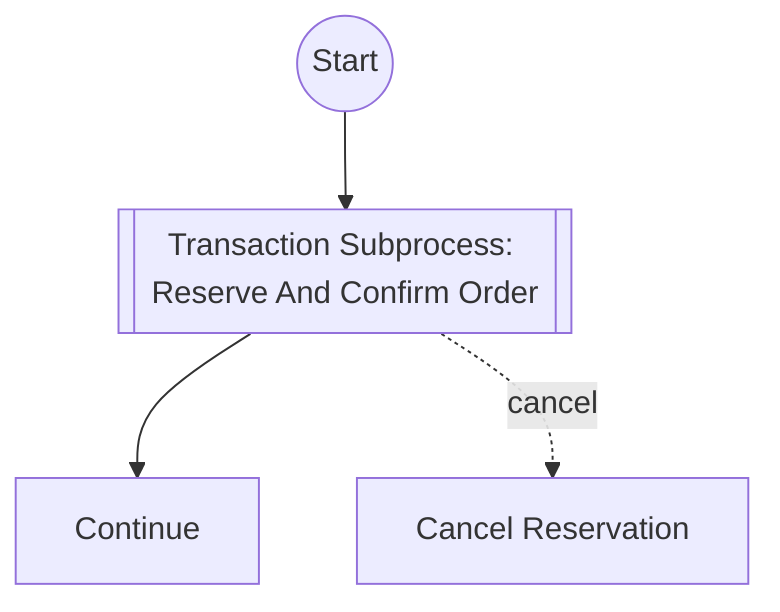
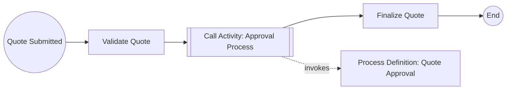
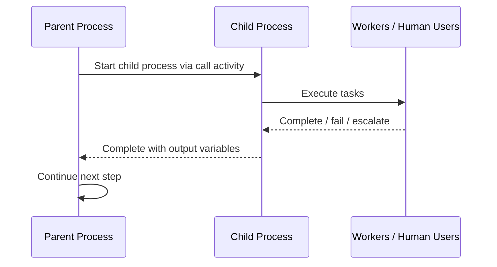
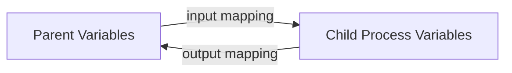
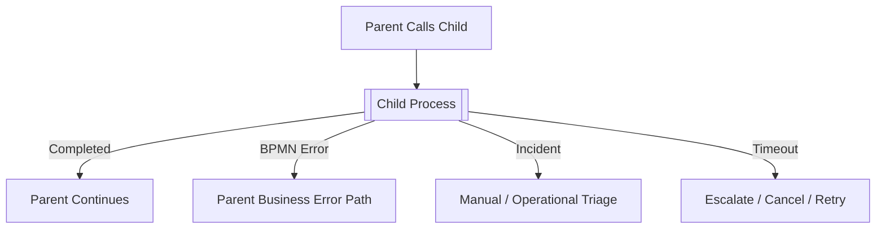
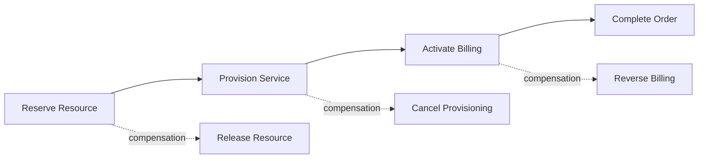

# Subprocess, Call Activity, and Process Composition

> Fokus part ini: memahami cara memecah workflow besar menjadi struktur yang tetap readable, executable, testable, versionable, dan aman di production. Targetnya bukan sekadar tahu ikon subprocess dan call activity, tetapi mampu mengambil keputusan arsitektural: kapan proses perlu digrup, kapan perlu diekstrak sebagai reusable process, kapan composition justru menciptakan coupling, dan bagaimana efeknya terhadap Java/JAX-RS service, worker, database, message correlation, observability, migration, dan incident handling.

BPMN yang baik bukan hanya benar secara simbol. BPMN yang baik harus bisa dibaca sebagai _business story_, dieksekusi sebagai _runtime graph_, dan dioperasikan sebagai _production system_.

Ketika proses makin besar, engineer biasanya tergoda melakukan salah satu dari dua ekstrem:

1. membuat satu diagram raksasa yang berisi semua detail;
2. memecah terlalu agresif menjadi banyak call activity sehingga proses utama hanya menjadi kumpulan kotak abstrak.

Keduanya bisa bermasalah.

Diagram raksasa sulit direview, sulit dites, dan sulit dipakai saat incident. Diagram yang terlalu terfragmentasi sulit dipahami end-to-end, rentan version coupling, dan membuat variable mapping menjadi sumber bug.

Subprocess dan call activity adalah alat komposisi. Seperti semua alat arsitektur, nilainya muncul hanya jika boundary-nya tepat.

---

## 1. Mental Model: Composition Adalah Boundary, Bukan Hiasan Diagram

Dalam BPMN, composition menjawab pertanyaan:

> “Bagian proses ini sebaiknya tetap inline, digrup secara lokal, atau dipanggil sebagai proses terpisah?”

Ada tiga level pemecahan yang paling penting:

| Bentuk | Lokasi definisi | Runtime ownership | Cocok untuk |
|---|---|---|---|
| Embedded subprocess | Di dalam process definition yang sama | Parent process | Mengelompokkan langkah lokal yang masih milik proses utama |
| Event subprocess | Di dalam process/subprocess scope | Scope tempat event ditangkap | Cancellation, escalation, timeout, interrupting event, exception path |
| Call activity | Memanggil process definition lain | Parent-child process instance | Reusable process, shared lifecycle, cross-process orchestration |

Pikirkan seperti modularisasi di software engineering:

- embedded subprocess mirip private method untuk readability;
- call activity mirip service/module publik yang punya contract;
- event subprocess mirip interrupt/handler yang aktif pada scope tertentu;
- transaction subprocess mirip unit of work bisnis yang punya compensation/cancel semantics.

Tetapi analogi ini tidak sempurna. Dalam BPMN, boundary bukan hanya struktur kode. Boundary memengaruhi:

- variable scope;
- wait state;
- token movement;
- incident visibility;
- migration;
- retry;
- compensation;
- error propagation;
- version binding;
- observability;
- ownership proses.

---

## 2. Embedded Subprocess

Embedded subprocess adalah subprocess yang didefinisikan di dalam process definition yang sama.

Contoh sederhana:



Embedded subprocess cocok ketika beberapa activity:

- secara bisnis merupakan satu fase;
- terlalu detail jika ditampilkan di level utama;
- tidak perlu dipakai ulang oleh proses lain;
- harus tetap ikut lifecycle parent process;
- harus tetap mudah dimigrasikan bersama parent process;
- tidak punya version lifecycle independen.

Dalam konteks CPQ/order management:

- “Validate Order” bisa menjadi embedded subprocess yang berisi syntax validation, product validation, account validation, dan eligibility validation.
- “Prepare Quote Approval” bisa menjadi embedded subprocess yang berisi pricing check, discount threshold check, margin check, dan approver resolution.
- “Post Fulfillment Cleanup” bisa menjadi embedded subprocess untuk update status, publish event, dan cleanup temporary state.

### Kapan embedded subprocess tepat?

Gunakan embedded subprocess jika boundary-nya adalah _readability boundary_, bukan _reuse boundary_.

Tanda embedded subprocess tepat:

- aktivitasnya tidak masuk akal dijalankan sendiri;
- aktivitasnya selalu mengikuti parent process;
- owner-nya sama dengan parent process;
- variable-nya sebagian besar berasal dari parent scope;
- deployment/versioning-nya harus ikut parent;
- incident-nya akan ditangani oleh team yang sama.

### Risiko embedded subprocess

Embedded subprocess bisa menjadi tempat menyembunyikan kompleksitas.

Anti-pattern umum:

- subprocess bernama terlalu generik: `Handle Order`, `Process Quote`, `Do Fulfillment`;
- subprocess berisi terlalu banyak gateway;
- subprocess memiliki banyak entry/exit mental model meskipun secara BPMN hanya satu start/end;
- subprocess dipakai untuk menyembunyikan failure path;
- subprocess membuat diagram utama terlihat simpel, tetapi debugging tetap sulit.

Nama subprocess harus menjawab fase bisnis yang jelas:

- buruk: `Process Data`;
- lebih baik: `Validate Commercial Terms`;
- lebih baik lagi: `Validate Discount And Approval Eligibility`.

---

## 3. Event Subprocess

Event subprocess adalah subprocess yang dipicu oleh event pada scope tertentu. Ia tidak dimasuki oleh sequence flow normal. Ia aktif karena event terjadi.

Contoh:



Event subprocess cocok untuk:

- cancellation;
- timeout escalation;
- external interrupt;
- business exception yang bisa terjadi kapan saja selama scope aktif;
- global process-level handler;
- local subprocess-level handler.

Event subprocess penting karena long-running process tidak berjalan dalam dunia ideal. Selama proses order berjalan, customer bisa membatalkan order, downstream system bisa mengirim rejection, SLA bisa lewat, atau operator bisa melakukan manual intervention.

### Interrupting vs non-interrupting event subprocess

Event subprocess bisa bersifat:

- **interrupting**: menghentikan scope utama;
- **non-interrupting**: membuat branch tambahan tanpa menghentikan scope utama.

Untuk cancellation order, biasanya interrupting lebih masuk akal:



Untuk SLA reminder, non-interrupting bisa lebih tepat:



### Failure mode event subprocess

Event subprocess sering bermasalah ketika:

- correlation key tidak stabil;
- event datang sebelum process instance siap menangkap;
- event datang setelah scope selesai;
- event interrupting mematikan work yang seharusnya tetap jalan;
- event non-interrupting menciptakan side effect berulang;
- cancellation flow tidak idempotent;
- tidak ada audit mengapa process berpindah ke cancellation/escalation path.

Untuk Java/JAX-RS backend, endpoint seperti `POST /orders/{id}/cancel` harus jelas apakah:

- hanya update order state di database;
- correlate message ke process instance;
- publish event ke Kafka/RabbitMQ;
- menjalankan command yang nanti diambil worker;
- atau kombinasi dengan outbox.

Jika cancellation direpresentasikan sebagai event subprocess, API harus menjaga idempotency. Request cancel yang dikirim dua kali tidak boleh menjalankan compensation dua kali.

---

## 4. Transaction Subprocess

Transaction subprocess adalah BPMN construct untuk mengelompokkan aktivitas yang dianggap sebagai satu transaksi bisnis dan dapat memiliki cancel/compensation behavior.

Dalam praktik enterprise, transaction subprocess harus dipakai hati-hati. Ia bukan distributed database transaction. Ia tidak membuat PostgreSQL, Kafka, external API, dan downstream system menjadi atomic.

Ia lebih tepat dibaca sebagai:

> “Ini adalah unit bisnis yang jika dibatalkan perlu menjalankan cancel/compensation path yang eksplisit.”

Contoh konseptual:



Dalam CPQ/order management:

- reserve inventory/resource;
- request provisioning;
- confirm order with downstream system;
- generate billing instruction;
- activate service.

Jika salah satu langkah gagal, compensation mungkin diperlukan:

- release reserved inventory;
- cancel provisioning request;
- reverse billing instruction;
- notify customer service;
- open manual fallout task.

### Batas penting

Transaction subprocess tidak menggantikan saga design.

Untuk sistem microservices, saga tetap membutuhkan:

- idempotency key;
- durable command/event record;
- outbox/inbox;
- retry policy;
- compensation semantics;
- audit trail;
- manual recovery path.

BPMN hanya membantu membuat alur bisnis dan recovery path eksplisit.

---

## 5. Call Activity

Call activity memanggil process definition lain. Ini berbeda dari embedded subprocess karena proses yang dipanggil adalah process definition terpisah.

Contoh:



Call activity cocok ketika:

- proses yang dipanggil dipakai ulang oleh banyak parent process;
- proses child punya lifecycle, owner, dan versioning yang relatif independen;
- proses child cukup kompleks sehingga layak diuji dan dioperasikan sendiri;
- child process bisa punya own incidents, metrics, tasks, timers, dan human intervention;
- parent process tidak perlu tahu semua detail internal child process.

Contoh CPQ/order management:

- approval process dipakai oleh quote, amendment, renewal;
- customer eligibility validation dipakai oleh quote dan order;
- fulfillment subflow dipakai oleh beberapa product line;
- manual fallout handling dipakai lintas order type.

### Call activity bukan sekadar “extract method”

Call activity memiliki contract yang harus stabil:

- input variable apa yang dikirim;
- output variable apa yang dikembalikan;
- error apa yang bisa dilempar;
- business result apa yang mungkin terjadi;
- process version mana yang dipanggil;
- siapa owner child process;
- bagaimana observability parent-child dilakukan;
- bagaimana migration dan rollback dilakukan.

Jika contract ini tidak eksplisit, call activity menjadi sumber coupling tersembunyi.

---

## 6. Parent Process dan Child Process

Saat parent process memanggil child process, ada dua lifecycle yang perlu dipikirkan:



Pertanyaan review penting:

- Apa yang terjadi jika child process stuck?
- Apa yang terjadi jika child process incident?
- Apakah parent menunggu child selesai?
- Apakah child punya timeout sendiri?
- Jika parent dibatalkan, apakah child ikut dibatalkan?
- Jika child gagal business error, parent menangkap atau ikut gagal?
- Bagaimana trace dari parent ke child dilakukan?

Dalam production, parent-child relationship harus terlihat di observability. Operator harus bisa menjawab:

- order ini sedang stuck di parent atau child?
- child process mana yang membuat SLA breach?
- incident terjadi di process utama atau reusable subflow?
- apakah safe untuk retry child task?

---

## 7. Variable Mapping

Variable mapping adalah salah satu sumber bug terbesar dalam process composition.

Pada embedded subprocess, variable biasanya masih berada di process scope yang sama atau scope lokal yang dekat.

Pada call activity, input/output mapping jauh lebih penting karena child process punya contract.

Contoh mapping konseptual:



### Prinsip input mapping

Kirim hanya data yang dibutuhkan child process.

Jangan mengirim seluruh payload quote/order jika child hanya butuh:

- `quoteId`;
- `customerSegment`;
- `discountPercentage`;
- `totalContractValue`;
- `requestedApproverGroup`.

Payload besar membuat:

- history membengkak;
- variable serialization rawan gagal;
- sensitive data tersebar;
- migration sulit;
- debugging membingungkan;
- Camunda 7 database load naik;
- Camunda 8 exporter/search load naik.

### Prinsip output mapping

Child process harus mengembalikan result yang eksplisit, bukan variable acak.

Contoh output yang baik:

```json
{
  "approvalResult": "APPROVED",
  "approvedBy": "manager-123",
  "approvalCompletedAt": "2026-07-11T10:15:00Z",
  "approvalReasonCode": "DISCOUNT_WITHIN_POLICY"
}
```

Buruk:

```json
{
  "status": "OK",
  "flag": true,
  "data": {...}
}
```

Output harus menjadi contract, bukan dumping ground.

### Variable compatibility

Jika child process version berubah, parent process lama mungkin masih mengirim variable lama. Karena itu, call activity contract harus backward-compatible atau version-bound dengan jelas.

Checklist compatibility:

- Apakah input baru optional atau required?
- Apakah output lama masih tersedia?
- Apakah enum result berubah?
- Apakah field rename memecahkan parent lama?
- Apakah worker child process membaca variable dengan default aman?
- Apakah data sensitif baru ikut masuk history?

---

## 8. Version Binding

Call activity menimbulkan pertanyaan versioning: parent process harus memanggil child process versi mana?

Kemungkinan strategi:

| Strategi | Arti | Risiko |
|---|---|---|
| Latest | Selalu pakai child process versi terbaru | Parent lama bisa terkena behavior baru tak terduga |
| Fixed version | Parent memanggil versi tertentu | Upgrade lebih terkendali, tetapi maintenance lebih berat |
| Deployment binding | Parent memakai child yang dideploy bersama | Cocok untuk controlled release, tetapi perlu pipeline disiplin |
| Version tag / semantic versioning | Binding berdasarkan tag/version semantic | Butuh governance naming dan compatibility rule |

Dalam enterprise production, “latest” sering berbahaya untuk process yang long-running. Parent process lama bisa tiba-tiba memanggil child process baru yang contract-nya berubah.

Gunakan “latest” hanya jika:

- child process dijamin backward-compatible;
- input/output contract stabil;
- behavior change tidak breaking;
- observability dapat membedakan versi;
- rollback strategy jelas.

Untuk flow critical seperti order fulfillment, approval, billing instruction, dan fallout, binding harus dirancang eksplisit.

---

## 9. Error Propagation

Child process dapat selesai normal, gagal secara teknis, melempar BPMN error, atau menciptakan incident.

Parent process harus tahu failure semantic-nya.



### Business error vs technical incident

Jangan mencampur business rejection dengan technical failure.

Contoh business error:

- quote rejected because discount exceeds approval limit;
- order invalid because product combination not allowed;
- customer not eligible;
- requested change violates contract.

Contoh technical failure:

- database timeout;
- worker crashed;
- external API unavailable;
- message broker down;
- serialization error;
- missing worker deployment.

Business error boleh menjadi modeled path. Technical failure biasanya harus menjadi retry/incident, bukan gateway “if failed”.

### Parent error boundary

Jika call activity bisa melempar BPMN error, parent harus punya boundary error atau event subprocess yang relevan.

Tanpa catch yang benar:

- business error bisa berubah menjadi incident;
- process bisa berhenti tidak sesuai business expectation;
- operator tidak tahu apakah harus retry atau reject;
- customer status bisa menggantung.

---

## 10. Compensation Propagation

Composition memengaruhi compensation.

Jika child process melakukan side effect, parent cancellation mungkin perlu memicu compensation di child atau menjalankan compensation terpisah.

Pertanyaan penting:

- Side effect apa yang dilakukan child?
- Apakah side effect reversible?
- Siapa yang bertanggung jawab melakukan compensation?
- Apakah compensation idempotent?
- Apakah compensation bisa gagal?
- Jika compensation gagal, apakah incident owner jelas?

Contoh order flow:



Dalam distributed system, compensation bukan rollback database. Compensation adalah aksi bisnis baru yang memperbaiki atau menetralkan efek sebelumnya.

Karena itu, compensation harus:

- punya audit trail;
- punya idempotency key;
- punya retry policy;
- punya owner;
- bisa dimonitor;
- punya manual fallback.

---

## 11. Reuse vs Clarity

Call activity sering dipakai atas nama reuse. Tetapi reuse dalam workflow tidak selalu positif.

Reuse baik jika:

- business process benar-benar sama;
- contract stabil;
- owner jelas;
- versioning dikelola;
- observability parent-child jelas;
- perubahan child process memang harus berlaku ke semua parent.

Reuse buruk jika:

- proses hanya tampak mirip tetapi memiliki invariant berbeda;
- parent butuh banyak flag untuk mengubah behavior child;
- child process dipenuhi gateway berdasarkan `callerType`;
- output child makin generik;
- debugging butuh membuka banyak diagram;
- perubahan child membuat banyak parent regress.

Anti-pattern:

```text
ReusableFulfillmentProcess(
  orderType,
  productType,
  customerSegment,
  region,
  channel,
  isAmendment,
  isCancellation,
  isRenewal,
  isEnterprise,
  skipValidation,
  forceManualReview,
  ...
)
```

Ini bukan reusable process yang sehat. Ini god process yang dibungkus call activity.

Lebih baik punya beberapa process yang lebih eksplisit jika business invariant-nya berbeda.

---

## 12. Composition untuk Java/JAX-RS Backend

Di Java/JAX-RS system, process composition akan memengaruhi API dan service boundary.

Contoh endpoint:

```http
POST /quotes/{quoteId}/submit
POST /quotes/{quoteId}/approval-tasks/{taskId}/complete
POST /orders/{orderId}/cancel
GET  /orders/{orderId}/workflow-status
```

Jika BPMN memakai call activity, API layer harus bisa:

- menyimpan mapping business entity ke process instance;
- mengembalikan status end-to-end, bukan hanya parent process;
- menghubungkan parent process instance key dan child process instance key;
- melindungi action berdasarkan task/process authorization;
- melakukan idempotency untuk start/cancel/complete/correlate command.

Jangan biarkan API hanya bergantung pada process variable untuk state bisnis. Quote/order state harus tetap punya model domain yang jelas di PostgreSQL.

Workflow boleh mengorkestrasi, tetapi domain service harus tetap menjaga invariant:

- quote tidak boleh approved jika expired;
- order tidak boleh fulfilled jika validation failed;
- cancellation tidak boleh diproses setelah irreversible activation tanpa business rule;
- task completion tidak boleh dilakukan oleh user tanpa authorization.

---

## 13. Composition dan PostgreSQL/MyBatis/JDBC

Composition memengaruhi data access karena parent dan child process mungkin menyentuh tabel yang sama atau entity yang sama.

Risiko umum:

- parent update `order_status`, child juga update `order_status`;
- child membaca variable lama sementara DB sudah berubah;
- parent process lanjut setelah child complete, tetapi DB commit worker child gagal;
- compensation child mengubah DB state yang parent anggap sudah final;
- migration child process mengubah variable format yang dipakai query MyBatis.

Prinsip aman:

1. Tentukan source of truth untuk entity state.
2. Gunakan command/event yang eksplisit untuk state transition.
3. Gunakan optimistic locking untuk mencegah concurrent transition.
4. Gunakan outbox untuk event publish setelah DB commit.
5. Gunakan inbox/processed-job table untuk idempotency worker.
6. Jangan menyimpan entire aggregate sebagai process variable jika cukup simpan ID dan snapshot kecil.

Contoh idempotency table:

```sql
create table workflow_processed_command (
    command_id text primary key,
    process_instance_key text not null,
    business_key text not null,
    command_type text not null,
    processed_at timestamptz not null default now()
);
```

Untuk MyBatis/JDBC, pastikan worker punya transaction boundary jelas:

```text
activate job
  -> begin DB transaction
  -> load entity by ID
  -> validate expected state
  -> apply idempotent state transition
  -> insert outbox event
  -> commit
  -> complete job
```

Jika crash terjadi setelah DB commit tetapi sebelum job complete, job bisa diulang. Karena itu DB operation harus idempotent.

---

## 14. Composition dan Messaging: Kafka/RabbitMQ

Call activity dan subprocess sering terkait event eksternal.

Contoh:

- child fulfillment process menunggu Kafka event `ProvisioningCompleted`;
- parent order process menerima RabbitMQ reply dari downstream system;
- cancellation event harus diterima baik oleh parent maupun child;
- child process publish event `ApprovalCompleted`.

Pertanyaan penting:

- Event dikorelasikan ke parent atau child?
- Correlation key apa yang dipakai?
- Apakah event bisa datang sebelum child process siap menunggu?
- Apakah event dari Kafka replay bisa memicu child process baru?
- Apakah duplicate RabbitMQ reply bisa complete task dua kali?
- Apakah cancellation harus memengaruhi semua child process aktif?

Untuk Kafka, replay adalah concern utama. Event consumer yang start/correlate process harus idempotent.

Untuk RabbitMQ, retry/DLQ interaction harus jelas agar tidak terjadi retry ganda antara broker, worker, dan engine.

---

## 15. Composition di Kubernetes, Cloud, On-Prem, dan Hybrid

Process composition juga punya konsekuensi deployment.

Jika parent dan child process bergantung pada worker berbeda:

- worker parent dan child harus dideploy compatible;
- rolling deployment harus mempertahankan backward compatibility;
- scaling child worker tidak otomatis menyelesaikan bottleneck parent;
- network boundary bisa membuat child worker tidak bisa connect ke engine/broker;
- on-prem/hybrid connectivity bisa menyebabkan message correlation delay;
- GitOps deployment harus menjaga urutan deployment process definition dan worker.

Risiko umum di Kubernetes:

- worker versi baru deploy sebelum BPMN baru;
- BPMN baru deploy sebelum worker support job type baru;
- old process instance masih membutuhkan worker lama;
- ConfigMap/Secret berubah dan memengaruhi child worker;
- pod termination menghentikan worker saat job sedang diproses;
- liveness probe terlalu agresif menyebabkan duplicate execution.

Untuk call activity, deployment plan harus menjawab:

```text
1. Deploy backward-compatible child worker.
2. Deploy child process version.
3. Deploy parent process version yang memanggil child baru.
4. Monitor running instances.
5. Drain old versions jika perlu.
6. Cleanup setelah tidak ada instance lama.
```

---

## 16. Observability untuk Process Composition

Composition membuat observability lebih kompleks. Dashboard harus bisa menjawab end-to-end, bukan hanya per process definition.

Minimal observability:

- parent process instance count;
- child process instance count;
- parent-child correlation;
- call activity duration;
- child process incident count;
- child process SLA breach;
- variable mapping failure;
- BPMN error count per child process;
- stuck parent waiting for child;
- child completed but parent not continued;
- cancellation propagation failure.

Log dan trace harus membawa:

- business key;
- process instance key;
- parent process instance key jika ada;
- child process instance key jika ada;
- job key/external task ID;
- correlation ID;
- worker name/version;
- BPMN activity ID.

Tanpa correlation, incident triage akan menjadi pencarian manual lintas Operate/Cockpit, logs, DB, Kafka, RabbitMQ, dan dashboard internal.

---

## 17. Migration Impact

Composition memperbesar risiko migration.

Perubahan embedded subprocess adalah perubahan pada parent process definition.

Perubahan call activity bisa memengaruhi:

- parent process definition;
- child process definition;
- variable contract;
- version binding;
- running parent instances;
- running child instances;
- migration plan;
- worker compatibility.

Contoh breaking change:

- child process menghapus activity yang menjadi migration target;
- child output `approvalStatus` diganti menjadi `decisionStatus`;
- parent boundary error menangkap error code lama;
- child process mengubah message correlation key;
- child worker mengubah variable type dari string ke object.

Migration checklist harus dibuat sebelum deploy, bukan setelah incident.

---

## 18. Review Heuristics: Kapan Inline, Embedded, atau Call Activity?

Gunakan decision matrix berikut.

| Pertanyaan | Inline activity | Embedded subprocess | Call activity |
|---|---:|---:|---:|
| Hanya satu langkah sederhana? | Ya | Tidak | Tidak |
| Perlu grouping agar diagram readable? | Tidak | Ya | Mungkin |
| Dipakai ulang oleh proses lain? | Tidak | Tidak | Ya |
| Perlu version lifecycle independen? | Tidak | Tidak | Ya |
| Punya owner berbeda? | Tidak | Mungkin | Ya |
| Punya SLA/incident terpisah? | Tidak | Mungkin | Ya |
| Punya contract input/output formal? | Tidak | Ringan | Wajib |
| Perubahan child harus tidak otomatis memengaruhi parent? | Tidak | Tidak | Ya, dengan binding |
| Membutuhkan observability parent-child? | Tidak | Ringan | Wajib |

Aturan praktis:

- Jangan gunakan call activity hanya agar diagram utama terlihat simpel.
- Jangan gunakan embedded subprocess jika sebenarnya proses itu reusable dan punya owner/version sendiri.
- Jangan gunakan subprocess untuk menyembunyikan gateway buruk.
- Jangan gunakan child process generik yang dikendalikan banyak flag.
- Jangan biarkan variable mapping implicit dan tidak dites.

---

## 19. Failure Modes

Composition failure mode yang sering muncul:

1. **Child process tidak ditemukan**  
   Parent memanggil process key/version yang belum dideploy.

2. **Wrong child version**  
   Parent lama memanggil child terbaru yang contract-nya berubah.

3. **Variable mapping missing**  
   Child worker gagal karena required variable tidak ada.

4. **Variable mapping stale**  
   Child memakai snapshot lama sementara DB state sudah berubah.

5. **Error tidak tertangkap**  
   Child melempar BPMN error, parent tidak punya boundary handler.

6. **Incident tersembunyi di child**  
   Parent terlihat menunggu, tetapi root cause ada di child.

7. **Cancellation tidak propagasi**  
   Parent dibatalkan, child tetap berjalan dan melakukan side effect.

8. **Duplicate compensation**  
   Retry/cancellation menjalankan compensation dua kali.

9. **Migration gagal**  
   Activity mapping parent-child tidak valid.

10. **Observability putus**  
   Logs tidak membawa parent-child correlation.

---

## 20. Production Debugging Flow

Saat incident terjadi pada process composition, gunakan flow berikut.

```text
1. Identifikasi business key.
2. Temukan parent process instance.
3. Cek current activity parent.
4. Jika parent berada di call activity, temukan child process instance.
5. Cek current activity child.
6. Cek incident/failure child.
7. Cek worker logs berdasarkan activity/job type.
8. Cek variable input child.
9. Cek DB state entity terkait.
10. Cek event/message correlation history.
11. Tentukan apakah safe retry, manual repair, cancel, atau migrate.
```

Jangan langsung retry parent process tanpa memahami apakah child sudah melakukan side effect. Retry buta bisa menciptakan duplicate order action.

---

## 21. Camunda 7 vs Camunda 8 Considerations

### Camunda 7

Pada Camunda 7, call activity dan subprocess berjalan di process engine yang database-backed. Concern utama:

- process definition deployment;
- binding called process;
- Java delegate classloading;
- transaction boundary;
- job executor retry;
- runtime/history table growth;
- variable serialization;
- Cockpit visibility;
- process instance migration.

Jika embedded engine dipakai di Java/JAX-RS service, deployment dan classpath dapat menjadi sumber coupling.

### Camunda 8 / Zeebe

Pada Camunda 8, process execution berjalan di Zeebe. Concern utama:

- process deployment ke cluster;
- called process ID/version binding;
- job worker compatibility;
- variable payload JSON;
- Operate visibility;
- exporter/search dependency;
- incident resolution;
- partitioning/backpressure;
- worker graceful shutdown.

Karena worker remote, call activity contract harus lebih disiplin. Parent process tidak bisa mengandalkan Java in-process delegate seperti pada Camunda 7 embedded style.

---

## 22. Implementation-Oriented Checklist

Sebelum approve BPMN composition, tanyakan:

### Boundary

- Apakah boundary subprocess/call activity punya alasan bisnis atau hanya estetika diagram?
- Apakah nama subprocess menjelaskan fase bisnis konkret?
- Apakah call activity benar-benar reusable?
- Apakah owner child process jelas?

### Contract

- Apa input variable minimal?
- Apa output variable eksplisit?
- Apakah contract backward-compatible?
- Apakah error code/business result terdokumentasi?
- Apakah sensitive data dikirim ke child?

### Runtime

- Apa wait state-nya?
- Apa timeout-nya?
- Apa retry policy-nya?
- Apa incident owner-nya?
- Apa cancellation behavior-nya?
- Apakah compensation dibutuhkan?

### Integration

- Apakah worker child process idempotent?
- Apakah DB state transition aman?
- Apakah Kafka/RabbitMQ correlation jelas?
- Apakah REST/JAX-RS API bisa menampilkan status parent-child?
- Apakah Redis/cache/lock tidak menjadi source of truth?

### Operations

- Apakah dashboard bisa menunjukkan stuck parent-child?
- Apakah log punya parent-child correlation?
- Apakah migration plan tersedia?
- Apakah rollback strategy jelas?
- Apakah runbook menjelaskan safe retry/manual repair?

---

## 23. Internal Verification Checklist

Gunakan checklist ini saat membaca codebase, BPMN model, worker, dan deployment internal.

### BPMN model

- Cari embedded subprocess, event subprocess, transaction subprocess, dan call activity.
- Catat process key parent dan child.
- Cek apakah call activity binding menggunakan latest, version, deployment, atau strategy lain.
- Cek apakah child process punya owner dan lifecycle terpisah.
- Cek apakah subprocess hanya menyembunyikan kompleksitas.

### Variable mapping

- Cek input/output mapping parent-child.
- Cek required variable worker child.
- Cek apakah payload terlalu besar.
- Cek sensitive data/PII.
- Cek compatibility antar versi.

### Worker implementation

- Cek job type/external task topic pada child process.
- Cek idempotency worker.
- Cek failure reporting.
- Cek BPMN error vs technical exception.
- Cek safe shutdown dan retry behavior.

### Java/JAX-RS API

- Cek endpoint start/cancel/complete/correlate.
- Cek mapping business key ke parent/child process instance.
- Cek API status apakah hanya parent atau end-to-end.
- Cek authorization task/process.
- Cek idempotency key untuk command.

### PostgreSQL/MyBatis/JDBC

- Cek tabel yang disentuh parent dan child worker.
- Cek optimistic locking.
- Cek outbox/inbox.
- Cek duplicate command protection.
- Cek apakah process variable menduplikasi DB state.

### Kafka/RabbitMQ/Redis

- Cek event/message correlation ke parent atau child.
- Cek duplicate/out-of-order handling.
- Cek replay impact.
- Cek DLQ/retry interaction.
- Cek Redis lock/cache/idempotency correctness jika digunakan.

### Kubernetes/cloud/on-prem

- Cek deployment order BPMN/worker.
- Cek backward compatibility saat rolling deployment.
- Cek worker connectivity ke engine/broker.
- Cek probes/resource limits.
- Cek GitOps drift.

### Observability/operations

- Cek dashboard parent-child process.
- Cek incident ownership.
- Cek runbook stuck call activity.
- Cek logs/traces punya business key dan process instance key.
- Cek manual repair procedure.

---

## 24. Common Review Comments

Gunakan komentar seperti ini saat review PR/ADR:

```text
Call activity ini membutuhkan contract input/output yang eksplisit.
Saat ini parent mengirim banyak variable tanpa boundary yang jelas.
Tolong batasi payload ke field yang dibutuhkan child process dan tambahkan test untuk missing/invalid variable.
```

```text
Child process dipanggil dengan binding latest.
Untuk process long-running dan critical seperti fulfillment, ini berisiko karena parent instance lama bisa terkena behavior child versi baru.
Tolong jelaskan compatibility guarantee atau gunakan binding yang lebih terkontrol.
```

```text
Cancellation path parent tidak menjelaskan nasib child process yang sedang aktif.
Perlu diperjelas apakah child ikut dibatalkan, dibiarkan selesai, atau menjalankan compensation.
```

```text
Subprocess ini terlalu generik dan berisi banyak gateway berbasis flag.
Sepertinya ini god process terselubung. Pertimbangkan split berdasarkan business invariant, bukan berdasarkan reuse visual.
```

```text
Tidak ada observability parent-child.
Saat incident, operator perlu tahu child process mana yang membuat parent stuck di call activity.
Tolong tambahkan correlation logging dan dashboard/metric minimal.
```

---

## 25. Ringkasan

Subprocess dan call activity adalah mekanisme komposisi BPMN, tetapi dampaknya jauh lebih besar daripada struktur diagram.

Embedded subprocess cocok untuk readability lokal. Event subprocess cocok untuk event handler pada scope tertentu. Transaction subprocess membantu memodelkan unit bisnis dengan cancellation/compensation semantics. Call activity cocok untuk reusable process dengan contract, owner, versioning, dan observability yang jelas.

Untuk senior backend engineer, pertanyaan utamanya adalah:

- Apakah boundary ini benar secara bisnis?
- Apakah contract-nya eksplisit?
- Apakah variable mapping aman?
- Apakah retry, incident, cancellation, dan compensation jelas?
- Apakah parent-child process bisa diobservasi?
- Apakah deployment dan migration aman?
- Apakah worker dan DB operation idempotent?
- Apakah workflow tetap menjaga domain invariant, bukan menggantikannya?

Composition yang baik membuat proses besar bisa dipahami. Composition yang buruk membuat incident tersebar di banyak diagram, worker, variable, database row, message topic, dan dashboard.

---

## Prerequisite

Sebelum membaca part ini, pahami:

- Part 005 — BPMN Execution Mental Model
- Part 006 — BPMN Modelling Fundamentals
- Part 007 — BPMN Events Deep Dive
- Part 008 — Gateways and Flow Control
- konsep dasar Java/JAX-RS backend service
- konsep dasar transaction, idempotency, dan message correlation

---

## Depth Level

**Intermediate**

