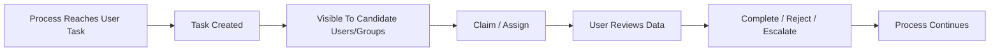
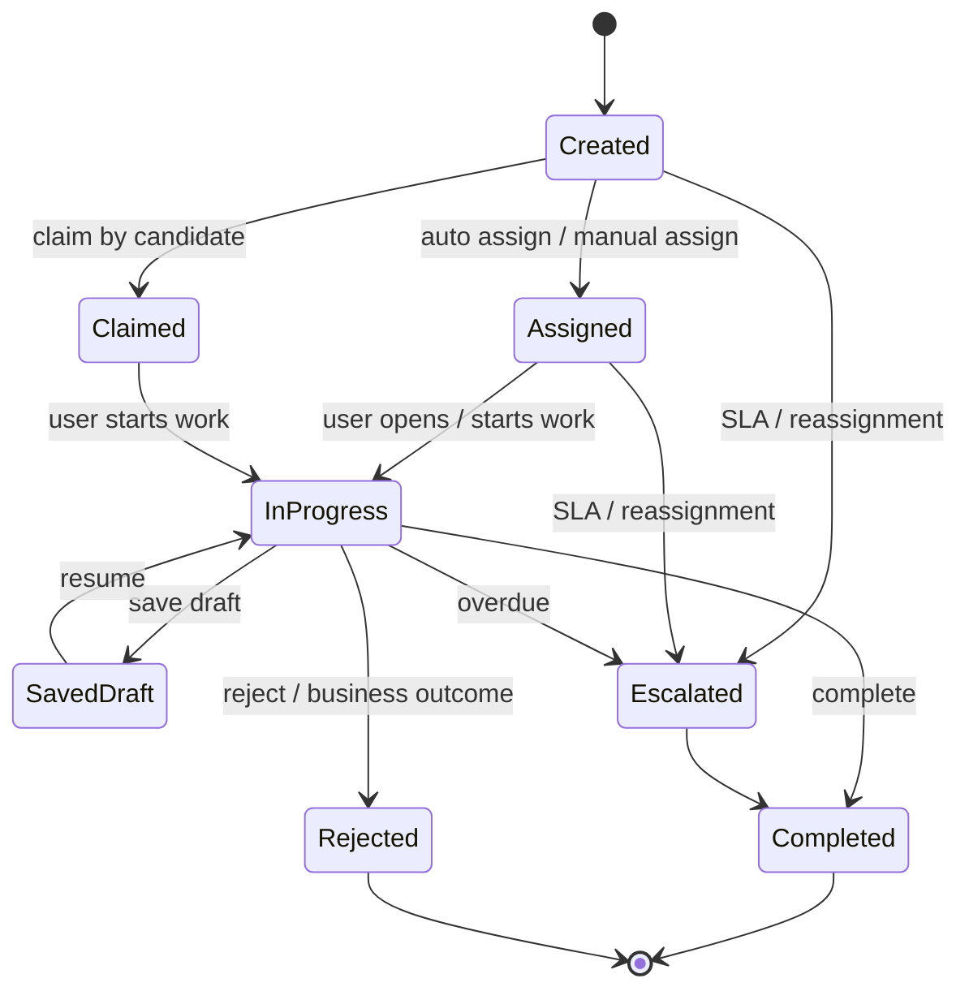
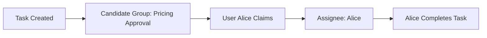
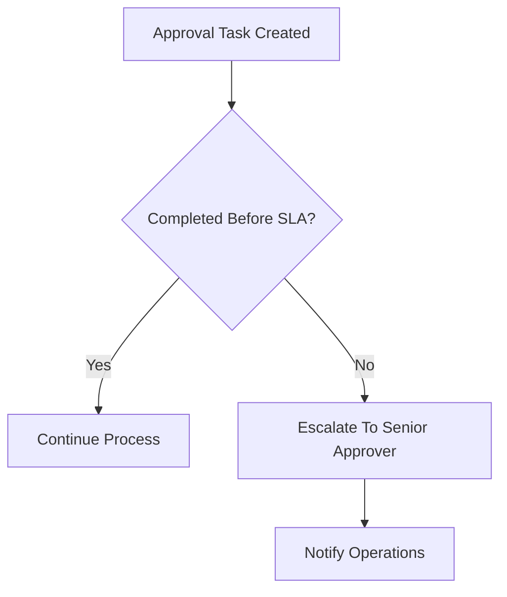
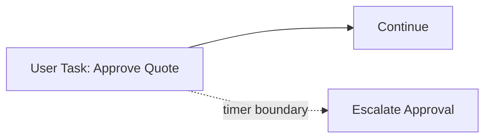
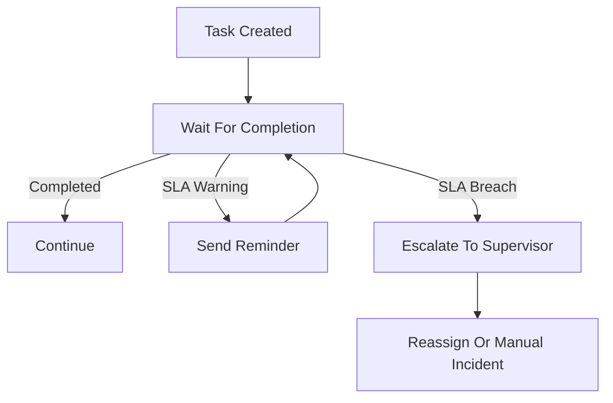
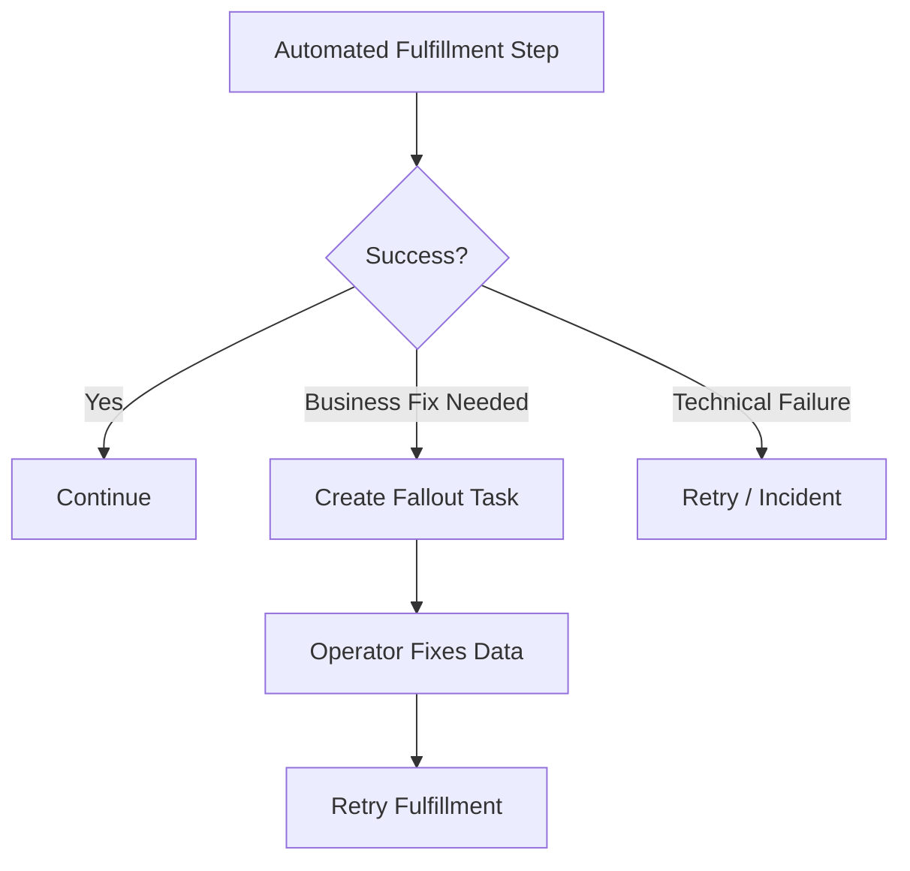
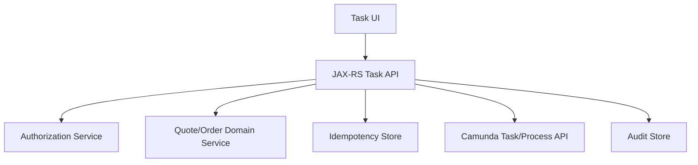

# Human Tasks and User Task Lifecycle

> Fokus part ini: memahami human task sebagai bagian dari workflow production, bukan sekadar “task untuk manusia”. Targetnya adalah mampu merancang user task yang punya assignment jelas, authorization benar, form contract stabil, SLA terukur, audit lengkap, race condition terkendali, dan jalur escalation/manual intervention yang operasional.

Human task adalah salah satu alasan utama workflow engine dipakai di enterprise system.

Banyak proses bisnis tidak bisa sepenuhnya otomatis karena membutuhkan:

- approval;
- manual review;
- data correction;
- exception handling;
- dispute resolution;
- fallout handling;
- compliance check;
- customer service intervention;
- business decision yang belum bisa/riskan diotomasi.

Dalam CPQ/order management, human task sering muncul pada:

- quote approval;
- discount approval;
- margin exception review;
- contract deviation review;
- order fallout handling;
- manual provisioning correction;
- cancellation approval;
- amendment review;
- reconciliation exception;
- SLA breach handling.

User task bukan “pause process dan tunggu orang klik tombol”. User task adalah operational contract antara process engine, backend API, task UI, identity/authorization, audit, SLA, dan business ownership.

---

## 1. Mental Model: Human Task Adalah Work Item yang Durable

User task adalah work item yang dibuat oleh process instance dan menunggu aksi manusia.



Dari sudut pandang runtime, user task adalah wait state. Process instance berhenti di titik itu sampai task diselesaikan, dibatalkan, dieskalasi, atau diinterupsi oleh event lain.

Dari sudut pandang business operations, task adalah pekerjaan yang harus dimiliki oleh seseorang atau sebuah grup.

Dari sudut pandang backend engineering, task adalah entity operasional dengan:

- identity;
- candidate users/groups;
- assignee;
- lifecycle;
- authorization;
- variables/form data;
- due date/SLA;
- audit history;
- concurrency control;
- API contract;
- failure mode.

---

## 2. User Task vs Manual Task

BPMN memiliki user task dan manual task. Keduanya sering disalahpahami.

| Elemen | Makna | Runtime implication |
|---|---|---|
| User task | Task yang dikelola engine dan diselesaikan user melalui aplikasi/tasklist/API | Durable task, queryable, assignable, completable |
| Manual task | Aktivitas manual di luar engine, biasanya tidak memerlukan task lifecycle engine | Lebih sebagai dokumentasi proses, bukan work item engine |

Untuk enterprise system, approval, review, fallout, dan correction biasanya harus menjadi user task, bukan manual task, karena perlu:

- assignment;
- search/filter;
- SLA;
- audit;
- authorization;
- completion data;
- monitoring;
- escalation.

Manual task cocok untuk langkah yang tidak perlu dikelola engine, misalnya “Customer signs paper document offline” jika sistem hanya menunggu message/callback setelahnya. Tetapi jika user internal harus mengerjakan dan menyelesaikan task di UI, gunakan user task.

---

## 3. User Task Lifecycle

Lifecycle task minimal:



Camunda dan BPMN tidak selalu memaksa semua state UI ini sebagai BPMN state. Banyak state seperti “opened”, “draft”, atau “in progress” bisa menjadi application-level state. Jangan menggambar setiap klik user sebagai BPMN activity.

Rule penting:

> BPMN harus menangkap business-relevant lifecycle, bukan seluruh UI interaction lifecycle.

Contoh yang perlu dimodelkan di BPMN:

- approval completed;
- approval rejected;
- SLA timer expired;
- task escalated;
- cancellation received while task pending;
- manual fallout resolved.

Contoh yang sering tidak perlu dimodelkan di BPMN:

- user membuka task detail;
- user mengetik form field;
- user menyimpan draft lokal;
- user mengganti tab;
- UI melakukan autosave;
- user melihat history panel.

Kecuali aksi tersebut punya efek bisnis/audit yang wajib menjadi bagian process model.

---

## 4. Candidate User, Candidate Group, and Assignee

Tiga konsep ini sering tercampur.

| Konsep | Arti | Contoh |
|---|---|---|
| Candidate user | User tertentu yang boleh mengambil/mengerjakan task | `alice`, `bob` |
| Candidate group | Grup yang anggotanya boleh mengambil/mengerjakan task | `pricing-approval`, `order-fallout-l2` |
| Assignee | User yang saat ini ditugaskan untuk task | `alice` |

Assignment yang sehat biasanya dimulai dari candidate group, lalu user melakukan claim.



### Candidate group design

Candidate group harus berbasis operating model, bukan technical team name yang tidak stabil.

Contoh baik:

- `quote-pricing-approver`;
- `enterprise-contract-reviewer`;
- `order-fallout-l1`;
- `order-fallout-l2`;
- `billing-exception-reviewer`.

Contoh buruk:

- `team-a`;
- `backend-devs`;
- `ops`;
- `misc-approvers`;
- `all-users`.

Candidate group memengaruhi security, SLA, dashboard, dan workload distribution. Jangan treat ini sebagai field tambahan di BPMN.

### Assignment rule

Assignment bisa ditentukan melalui:

- static BPMN assignment;
- expression berdasarkan process variable;
- DMN decision table;
- Java delegate/listener;
- external task/worker;
- identity/organization service;
- custom task routing service.

Untuk enterprise order workflow, assignment rule sering bergantung pada:

- product line;
- region;
- customer segment;
- deal value;
- discount percentage;
- order type;
- escalation level;
- tenant/customer;
- support queue ownership.

Jika assignment rule kompleks, jangan sembunyikan di expression BPMN yang sulit dites. Pertimbangkan DMN atau routing service.

---

## 5. Claim, Unclaim, Delegate, Reassign

Task lifecycle operasional perlu mendefinisikan aksi user.

### Claim

Claim berarti user mengambil task dari candidate pool.

Concern:

- dua user bisa mencoba claim bersamaan;
- UI harus menangani conflict;
- claim harus diaudit;
- claim tidak boleh bypass authorization;
- claim mungkin harus dicegah jika task sudah expired/cancelled.

### Unclaim

Unclaim mengembalikan task ke pool.

Concern:

- apakah semua assignee boleh unclaim?
- apakah manager/admin boleh force unclaim?
- apakah unclaim setelah draft disimpan diperbolehkan?
- apakah task aging reset atau tetap dihitung dari creation time?

### Delegate

Delegate berarti assignee meminta user lain mengerjakan atau membantu.

Concern:

- apakah delegatee harus berasal dari candidate group?
- apakah original assignee tetap accountable?
- apakah task harus kembali ke original assignee setelah delegatee selesai?
- apakah delegation tercatat di audit?

### Reassign

Reassign biasanya dilakukan supervisor/admin/system.

Concern:

- authorization lebih ketat;
- alasan reassign harus dicatat;
- reassign bisa memengaruhi SLA ownership;
- reassign tidak boleh digunakan untuk menyembunyikan overdue task.

---

## 6. Complete Task

Complete adalah aksi yang membuat process instance lanjut.

Completion bukan sekadar submit form. Completion adalah command bisnis.

Contoh:

```http
POST /workflow/tasks/{taskId}/complete
Content-Type: application/json
Idempotency-Key: 712c3f7a-7d6a-4b79-b0d7-0d0d1716e7ad

{
  "decision": "APPROVED",
  "reasonCode": "DISCOUNT_ACCEPTABLE",
  "comment": "Approved based on enterprise contract threshold.",
  "formVersion": "quote-approval-v3"
}
```

Backend harus memvalidasi:

- task masih aktif;
- task milik user atau user berwenang;
- task belum completed/cancelled;
- form version compatible;
- required fields valid;
- decision value valid;
- entity state masih memungkinkan;
- idempotency key belum diproses;
- process instance masih di expected activity.

### Completion variable

Saat task completed, completion data sering masuk process variable.

Jangan menyimpan semua UI form raw jika tidak perlu. Pisahkan:

- data bisnis yang dibutuhkan process selanjutnya;
- audit/comment yang perlu disimpan di domain/audit table;
- UI-only field yang tidak perlu menjadi process variable;
- sensitive data yang harus dibatasi retention dan visibility-nya.

---

## 7. Due Date, Follow-Up Date, and SLA

Human task tanpa SLA adalah antrian gelap.

Konsep waktu umum:

| Konsep | Fungsi |
|---|---|
| Due date | Batas waktu task harus selesai |
| Follow-up date | Waktu task mulai perlu diperhatikan/ditampilkan |
| SLA timer | Business commitment untuk penyelesaian |
| Escalation timer | Timer untuk mengirim reminder, reassign, atau escalate |
| Aging | Durasi task aktif sejak creation atau sejak assignment |

Contoh pattern:



BPMN bisa memakai boundary timer pada user task:



### SLA design questions

- SLA dihitung dari task creation atau assignment?
- SLA pakai calendar time atau business hours?
- Apakah weekend/holiday dihitung?
- Timezone apa yang dipakai?
- Apa aksi saat SLA breach: notify, reassign, escalate, auto-reject, auto-approve, create incident?
- Apakah escalation interrupting atau non-interrupting?
- Apakah SLA breach memengaruhi customer-visible status?

Jangan menggambar timer tanpa menentukan operational behavior.

---

## 8. Forms and Task Data Contract

User task biasanya membutuhkan form.

Form bukan hanya UI. Form adalah contract antara:

- BPMN process;
- task application;
- backend API;
- process variable;
- domain validation;
- audit requirement;
- authorization;
- data retention.

Minimal form contract:

```json
{
  "formKey": "quote-approval-form",
  "formVersion": "3",
  "taskType": "QUOTE_APPROVAL",
  "input": {
    "quoteId": "Q-10001",
    "customerName": "Example Corp",
    "totalContractValue": 1200000,
    "discountPercentage": 18.5,
    "riskFlags": ["HIGH_DISCOUNT"]
  },
  "output": {
    "decision": "APPROVED|REJECTED|NEEDS_MORE_INFO",
    "reasonCode": "string",
    "comment": "string"
  }
}
```

### Input data

Input data harus cukup untuk user mengambil keputusan, tetapi tidak boleh bocor.

Pertanyaan:

- Apakah user berwenang melihat semua field?
- Apakah PII perlu masking?
- Apakah data berasal dari process variable atau query ke domain service?
- Apakah data snapshot atau live?
- Jika live data berubah saat task pending, apa yang terjadi?

### Output data

Output data harus minimal, typed, dan validated.

Jangan mengandalkan free-text comment sebagai input process decision.

Buruk:

```json
{
  "comment": "looks okay"
}
```

Baik:

```json
{
  "decision": "APPROVED",
  "reasonCode": "POLICY_THRESHOLD_OK",
  "comment": "Reviewed against enterprise discount policy."
}
```

---

## 9. Task Variables vs Process Variables vs Domain Data

Human task sering membuat state tersebar.

Bedakan:

| Data | Tempat ideal | Contoh |
|---|---|---|
| Process routing data | Process variable | `approvalDecision`, `approvalLevel` |
| Domain state | PostgreSQL/domain service | `quote.status`, `order.status` |
| Task UI state | Task/application table | draft form, selected tab, UI notes |
| Audit data | Audit table/history | who approved, when, reason |
| Sensitive document/data | Secure document/domain store | contract document, customer PII |

Process variable bukan database utama. Jangan menyimpan seluruh quote/order aggregate sebagai variable hanya untuk menampilkan task UI.

Lebih aman:

- process variable menyimpan `quoteId`;
- task UI memanggil quote service untuk detail terbaru;
- completion command mengirim decision terstruktur;
- domain service validasi state sebelum menerima decision;
- audit table menyimpan decision event.

---

## 10. Task Listener and Lifecycle Hooks

Di Camunda 7, task listener sering digunakan pada event seperti create, assignment, complete, delete. Di Camunda 8, task lifecycle dan listener/workers perlu dilihat berdasarkan fitur dan versi yang digunakan.

Task listener/hook bisa berguna untuk:

- resolve candidate group;
- enrich task metadata;
- notify user;
- validate completion;
- sync audit;
- trigger side effect tertentu.

Tetapi listener juga berbahaya karena logic tersembunyi.

Anti-pattern:

- business rule approval disembunyikan di task listener;
- listener melakukan external API call synchronous tanpa retry strategy;
- listener update DB state tanpa idempotency;
- listener failure membuat task tidak bisa dibuat/complete;
- listener tidak punya observability;
- listener tidak dites.

Prinsip:

> Listener boleh membantu lifecycle task, tetapi jangan menjadi tempat utama business process logic.

Jika logic penting, buat eksplisit sebagai service task, DMN decision, atau domain service command.

---

## 11. Escalation and Aging Task

Task aging adalah sinyal production penting.

Aging task bisa berarti:

- user workload terlalu tinggi;
- assignment rule salah;
- candidate group kosong;
- task tidak visible di UI;
- authorization salah;
- process menunggu approval yang tidak ada owner;
- SLA tidak realistis;
- downstream data tidak lengkap sehingga user tidak bisa complete task.

Escalation pattern:



Escalation bisa berupa:

- notification;
- reassignment;
- adding candidate group;
- creating higher-level task;
- opening incident;
- moving process to fallout path;
- auto decision jika business policy mengizinkan.

Auto-approve/auto-reject harus sangat hati-hati. Itu bukan technical fallback, melainkan business policy.

---

## 12. Manual Intervention and Fallout Handling

Manual intervention adalah kenyataan enterprise workflow. Jangan diperlakukan sebagai failure memalukan. Justru harus dimodelkan dengan jelas.

Fallout task biasanya muncul ketika:

- validation gagal tetapi bisa diperbaiki;
- downstream system menolak request;
- data mismatch;
- external callback tidak datang;
- provisioning partial failure;
- customer/account data tidak sinkron;
- order membutuhkan exception handling.

Pattern:



Manual task harus punya:

- reason code;
- clear remediation options;
- link ke entity/domain data;
- audit trail;
- retry button/action yang aman;
- escalation path;
- ownership group;
- SLA;
- visibility di dashboard.

Jangan membuat generic “Manual Review” task tanpa instruksi. Itu hanya memindahkan kebingungan dari system ke operator.

---

## 13. Authorization and Task Visibility

Human task adalah security boundary.

Task visibility harus menjawab:

- siapa boleh melihat task?
- siapa boleh claim?
- siapa boleh complete?
- siapa boleh reassign?
- siapa boleh melihat form data?
- siapa boleh melihat comments/audit?
- siapa boleh melihat process variables?
- apakah tenant/customer isolation berlaku?

Authorization tidak boleh hanya di UI. Backend endpoint complete task harus enforce authorization.

Contoh authorization failure mode:

- user bisa complete task via API meskipun UI menyembunyikan task;
- candidate group terlalu luas;
- task reassignment bisa dilakukan semua user;
- PII terlihat di task variable dashboard;
- admin permission dipakai sebagai shortcut operasional;
- service account worker punya akses terlalu luas.

Untuk multi-tenant environment, task query harus selalu mempertimbangkan tenant/customer boundary. Jangan mengandalkan filter UI saja.

---

## 14. Concurrent Completion and Race Conditions

Human task punya race condition.

Contoh:

- dua browser tab mencoba complete task yang sama;
- user A dan user B melihat task sebelum salah satu claim;
- task di-cancel oleh process event saat user sedang submit form;
- SLA escalation reassign task saat user complete;
- admin reassign saat assignee menyimpan draft;
- retry API complete terjadi setelah timeout client.

Backend harus defensif.

Prinsip:

1. Complete task harus idempotent.
2. Task harus dicek masih aktif.
3. Assignee/authorization harus dicek pada saat command diproses.
4. Domain entity state harus dicek ulang.
5. Idempotency key harus disimpan.
6. Conflict harus dikembalikan jelas.

Contoh response:

```http
409 Conflict

{
  "errorCode": "TASK_ALREADY_COMPLETED",
  "message": "The approval task has already been completed by another user.",
  "currentStatus": "COMPLETED"
}
```

Jangan mengembalikan 500 untuk conflict bisnis/lifecycle yang bisa diprediksi.

---

## 15. REST/JAX-RS API Contract untuk User Task

Contoh API minimal:

```http
GET  /workflow/tasks?status=OPEN&candidateGroup=quote-approval
GET  /workflow/tasks/{taskId}
POST /workflow/tasks/{taskId}/claim
POST /workflow/tasks/{taskId}/unclaim
POST /workflow/tasks/{taskId}/assign
POST /workflow/tasks/{taskId}/complete
POST /workflow/tasks/{taskId}/save-draft
GET  /workflow/tasks/{taskId}/audit
```

Untuk JAX-RS backend, pisahkan:

- orchestration adapter ke Camunda;
- domain validation service;
- authorization service;
- task application service;
- audit writer;
- idempotency store.

Contoh layering:



Complete task tidak boleh langsung forwarding payload UI ke Camunda tanpa validation.

---

## 16. PostgreSQL/MyBatis/JDBC Considerations

Human task sering punya data di luar Camunda.

Kemungkinan tabel tambahan:

- `task_draft`;
- `task_audit`;
- `task_comment`;
- `workflow_command_idempotency`;
- `manual_intervention_case`;
- `fallout_reason`;
- `approval_decision`.

Contoh idempotency complete task:

```sql
create table workflow_task_command (
    command_id text primary key,
    task_id text not null,
    command_type text not null,
    requested_by text not null,
    result_status text not null,
    created_at timestamptz not null default now()
);
```

Transaction boundary penting:

```text
receive complete-task request
  -> validate authorization
  -> begin DB transaction
  -> insert idempotency command if absent
  -> validate domain state
  -> write domain/audit data
  -> commit DB transaction
  -> complete Camunda task
```

Tetapi urutan ini memiliki risiko: DB commit sukses, complete Camunda task gagal. Alternatifnya complete Camunda dulu lalu DB commit juga punya risiko sebaliknya.

Untuk critical path, gunakan desain command/outbox atau idempotent repair:

- simpan command durable;
- worker/processor menyelesaikan task;
- retry safe;
- reconcile command status dengan task status.

Tidak ada urutan sempurna tanpa trade-off. Yang penting: failure mode diketahui dan repair path tersedia.

---

## 17. Kafka/RabbitMQ Integration Around Human Tasks

Human task sering berinteraksi dengan event-driven architecture.

Contoh event:

- `QuoteApprovalTaskCreated`;
- `QuoteApproved`;
- `QuoteRejected`;
- `OrderFalloutTaskCreated`;
- `ManualInterventionResolved`;
- `TaskEscalated`.

Pertanyaan:

- Apakah event diterbitkan oleh process engine, backend API, atau domain service?
- Apakah event keluar setelah task complete atau setelah domain state commit?
- Apakah event idempotent?
- Apakah event key menggunakan quote/order ID?
- Apakah duplicate event bisa membuat downstream melakukan aksi dua kali?
- Apakah RabbitMQ retry bisa menyebabkan double completion?

Untuk Kafka, gunakan outbox jika event merepresentasikan domain state change.

Untuk RabbitMQ command/reply, pastikan completion command punya idempotency key dan task status dicek ulang.

---

## 18. Redis Around Human Tasks

Redis bisa membantu, tetapi tidak boleh menjadi source of truth.

Kemungkinan penggunaan Redis:

- cache task counts;
- cache task search result sementara;
- rate limit complete/claim request;
- short-lived lock untuk UX;
- feature flag/kill switch;
- session/task UI state;
- cache identity group membership.

Risiko:

- cached task list stale;
- distributed lock salah memberi rasa aman;
- Redis outage membuat task UI tampak kosong;
- cache group membership membuat authorization stale;
- kill switch tidak terdokumentasi.

Rule:

> Jika data memengaruhi correctness, simpan di durable store atau engine/domain system. Redis boleh mempercepat, bukan menentukan kebenaran.

---

## 19. Observability for Human Tasks

Human task observability harus melihat workload manusia sebagai bagian dari production health.

Metric penting:

- open task count by type;
- open task count by candidate group;
- average task age;
- p95/p99 task age;
- overdue task count;
- task completion rate;
- task rejection rate;
- escalation count;
- reassignment count;
- claim-to-complete duration;
- create-to-claim duration;
- task stuck in assigned state;
- task visibility/query errors;
- complete task API error rate;
- authorization denial rate.

Dashboard minimal:

```text
Task type | Open | Overdue | Avg age | P95 age | Completion/day | Escalated | Owner group
```

Alert contoh:

- `order-fallout-l1` overdue task > threshold;
- no task completion for critical queue in last N hours;
- task creation spike;
- complete-task API 5xx spike;
- candidate group has open tasks but no active users;
- high conflict rate on claim/complete.

---

## 20. Debugging Human Task Issues

Common issue:

### Task tidak muncul di UI

Cek:

- process instance benar berada di user task?
- task sudah dibuat?
- candidate user/group benar?
- user group mapping benar?
- tenant filter benar?
- tasklist index/search sehat?
- authorization backend benar?
- task sudah claimed/completed/cancelled?

### Task tidak bisa diclaim

Cek:

- task masih open?
- user termasuk candidate?
- task sudah assigned ke orang lain?
- optimistic locking/conflict?
- API auth token benar?
- task listener blocking/gagal?

### Task tidak bisa complete

Cek:

- assignee benar?
- form valid?
- required variable ada?
- process instance masih aktif?
- boundary event sudah menginterupsi task?
- completion listener/worker gagal?
- domain state sudah berubah?
- idempotency conflict?

### Task aging/overdue

Cek:

- assignment group salah?
- tidak ada user aktif di group?
- UI filter menyembunyikan task?
- SLA terlalu pendek?
- task butuh data yang tidak tersedia?
- operator tidak tahu remediation action?
- escalation tidak jalan?

---

## 21. Camunda 7 vs Camunda 8 Considerations

### Camunda 7

Camunda 7 memiliki Task Service dan Tasklist/Cockpit ecosystem. Concern utama:

- task listener pada create/assignment/complete;
- candidate group/user;
- assignee/claim/complete;
- form key;
- task query;
- authorization;
- history/audit;
- Java delegate/listener classloading;
- transaction boundary;
- database load pada task/history query.

Jika embedded engine dipakai, user task operations bisa berjalan dekat dengan aplikasi Java, tetapi coupling transaction/classpath/deployment perlu diperhatikan.

### Camunda 8

Camunda 8 memakai model user task dan Tasklist/Orchestration Cluster API sesuai versi yang digunakan. Concern utama:

- task assignment dan lifecycle API;
- task listener/worker jika digunakan;
- Tasklist visibility dan access restrictions sesuai model/versi;
- Operate/Tasklist indexing/search dependency;
- Identity/authorization;
- worker-backed behavior untuk lifecycle hooks;
- API timeout/retry jika listener processing lambat;
- self-managed vs SaaS operational differences.

Karena Camunda 8 lebih remote/distributed, backend task API harus lebih eksplisit soal retry, idempotency, dan failure handling saat memanggil API task/process.

---

## 22. Anti-Patterns

### 1. User task tanpa owner

Task dibuat tetapi candidate group kosong atau terlalu generik.

### 2. User task tanpa SLA

Task bisa menunggu selamanya tanpa alert.

### 3. Approval logic di comment

Decision ditafsirkan dari free-text comment, bukan structured field.

### 4. UI-only authorization

Backend complete endpoint tidak mengecek permission.

### 5. Task form mengandung seluruh aggregate

PII, pricing, contract, dan order payload besar disimpan sebagai process variable.

### 6. Manual intervention tanpa remediation

Operator mendapat task “Fix Order” tanpa reason code atau instruksi.

### 7. Listener sebagai hidden business logic

Task complete menjalankan banyak rule tersembunyi di listener.

### 8. Tidak ada concurrency handling

Double submit membuat duplicate decision atau process incident.

### 9. Escalation yang hanya mengirim email

Email terkirim, tetapi task ownership tidak berubah dan dashboard tidak mencerminkan escalation.

### 10. Tasklist sebagai source of truth domain

Quote/order status dibaca dari task status, bukan domain state.

---

## 23. Production-Safe Design Checklist

Sebelum approve user task design, cek:

### Business semantics

- Apa arti task ini secara bisnis?
- Siapa owner task?
- Apa possible outcomes?
- Apa remediation action?
- Apa yang terjadi jika task ditolak?
- Apa yang terjadi jika task tidak dikerjakan?

### Assignment

- Candidate group/user jelas?
- Assignment rule bisa dites?
- Group mapping terintegrasi dengan identity provider?
- Reassign/delegate policy jelas?
- Tenant/customer boundary aman?

### Form and data

- Input data minimal dan aman?
- Output decision structured?
- Form versioning jelas?
- Sensitive data dimasking/dibatasi?
- Data snapshot vs live jelas?

### API and backend

- Complete/claim/reassign endpoint enforce authorization?
- Complete command idempotent?
- Conflict handling jelas?
- Domain state divalidasi ulang?
- Audit ditulis?

### Process

- Boundary timer/SLA jelas?
- Escalation path jelas?
- Cancellation saat task pending jelas?
- Error path jelas?
- Process variable output minimal?

### Operations

- Dashboard task aging tersedia?
- Alert overdue tersedia?
- Runbook untuk stuck task tersedia?
- Manual repair procedure tersedia?
- Incident owner jelas?

---

## 24. Internal Verification Checklist

Gunakan checklist ini saat masuk ke codebase dan environment internal.

### BPMN model

- Cari semua user task.
- Catat task name, task ID, candidate group, assignee expression, due date, boundary timer.
- Cek apakah user task punya outcome eksplisit.
- Cek apakah rejection/escalation path dimodelkan.
- Cek apakah cancellation dapat terjadi saat task pending.

### Tasklist / UI

- Cek task list yang digunakan: Camunda Tasklist, custom UI, atau internal operations console.
- Cek filter task berdasarkan group, tenant, status, priority, due date.
- Cek claim/unclaim/complete/reassign support.
- Cek stale task behavior di UI.
- Cek audit/comment display.

### Backend API

- Cek endpoint task query/detail/claim/complete/reassign.
- Cek authorization enforcement.
- Cek idempotency complete command.
- Cek error mapping untuk conflict, forbidden, not found, already completed.
- Cek correlation ID logging.

### Worker/listener

- Cek task listener atau lifecycle hook.
- Cek apakah listener melakukan side effect.
- Cek retry/failure behavior listener.
- Cek observability listener.
- Cek test coverage.

### PostgreSQL/MyBatis/JDBC

- Cek apakah task draft/audit/comment disimpan di DB internal.
- Cek transaction boundary task completion.
- Cek optimistic locking/domain state validation.
- Cek idempotency command table.
- Cek audit evidence.

### Kafka/RabbitMQ/Redis

- Cek event yang dipublish saat task created/completed/escalated.
- Cek outbox untuk domain event.
- Cek duplicate message handling.
- Cek cache task count/status jika Redis digunakan.
- Cek Redis outage behavior.

### Security/privacy

- Cek candidate group terlalu luas.
- Cek PII di task form/process variable/log.
- Cek tenant isolation.
- Cek admin override audit.
- Cek retention task history/comment.

### Observability/operations

- Cek dashboard open/overdue task.
- Cek alert task aging/SLA breach.
- Cek incident notes terkait stuck/hidden task.
- Cek runbook manual intervention.
- Cek ownership queue per team.

---

## 25. Common Review Comments

Gunakan komentar seperti ini saat review PR/ADR:

```text
User task ini belum punya candidate group yang jelas.
Tanpa owner operasional, task bisa menjadi invisible queue di production.
Tolong definisikan assignment rule dan dashboard owner-nya.
```

```text
Completion payload masih terlalu bebas.
Decision approval sebaiknya structured dengan enum dan reasonCode, bukan hanya comment string.
Ini penting untuk audit, reporting, dan downstream process routing.
```

```text
Complete task endpoint harus enforce authorization di backend, bukan hanya mengandalkan Task UI.
Tolong tambahkan check assignee/candidate group/tenant sebelum complete.
```

```text
Task ini punya SLA bisnis, tetapi tidak ada boundary timer, metric aging, atau escalation path.
Tolong jelaskan apa yang terjadi saat task overdue.
```

```text
Form input mengambil seluruh quote payload sebagai process variable.
Ini berisiko untuk PII, history bloat, serialization, dan compatibility.
Lebih aman simpan quoteId dan fetch detail dari domain service dengan authorization.
```

---

## 26. Ringkasan

Human task adalah durable work item yang menghubungkan process engine dengan manusia, UI, identity, backend API, audit, dan operasi bisnis.

Desain user task yang baik harus menjawab:

- siapa yang boleh melihat task?
- siapa yang harus mengerjakan task?
- apa outcome yang valid?
- data apa yang dibutuhkan user?
- bagaimana completion divalidasi?
- apa yang terjadi jika task overdue?
- bagaimana task dieskalasi?
- bagaimana audit disimpan?
- bagaimana conflict dan duplicate submit ditangani?
- bagaimana task failure dimonitor dan didebug?

Dalam enterprise CPQ/order management, human task sering menjadi titik di mana automation bertemu realitas bisnis. Jika didesain buruk, ia menjadi queue gelap dan sumber SLA breach. Jika didesain baik, ia menjadi mekanisme kontrol, audit, dan recovery yang membuat workflow production lebih aman.

---

## Prerequisite

Sebelum membaca part ini, pahami:

- Part 006 — BPMN Modelling Fundamentals
- Part 007 — BPMN Events Deep Dive
- Part 008 — Gateways and Flow Control
- Part 009 — Subprocess, Call Activity, and Process Composition
- konsep dasar REST/JAX-RS API
- konsep dasar authorization, audit, dan database transaction

---

## Depth Level

**Intermediate**

