# Service Tasks and Automation

> Fokus part ini: memahami **service task** sebagai boundary otomatisasi dalam workflow production. Targetnya bukan hanya tahu bahwa service task “memanggil service”, tetapi mampu merancang automation step yang retry-safe, idempotent, observable, secure, dan tidak menghancurkan consistency ketika worker, database, queue, atau external API gagal di tengah jalan.

Service task adalah titik paling berbahaya sekaligus paling bernilai dalam BPMN.

Di diagram, service task terlihat seperti satu kotak kecil. Di production, satu kotak itu bisa berarti:

- memanggil external API;
- menulis ke PostgreSQL;
- menjalankan command ke service order management;
- mem-publish event ke Kafka;
- mengirim command ke RabbitMQ;
- membaca cache Redis;
- menunggu provider telco merespons;
- menjalankan validation engine;
- memanggil pricing service;
- membuat order decomposition;
- mengirim notification;
- mengubah state domain entity.

Karena itu, service task harus diperlakukan sebagai **automation contract**, bukan sekadar implementasi teknis.

---

## 1. Mental Model: Service Task adalah Work Item Otomatis

Dalam BPMN, service task merepresentasikan pekerjaan otomatis yang dilakukan oleh sistem, bukan manusia.

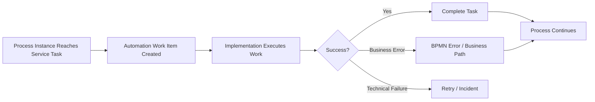

Yang penting: service task bukan selalu synchronous method call.

Di Camunda 7, service task bisa diimplementasikan dengan beberapa model, antara lain:

- Java delegate;
- delegate expression;
- expression;
- external task;
- connector/script pattern jika digunakan.

Di Camunda 8/Zeebe, service task secara umum menghasilkan job dengan `type` tertentu, lalu job worker mengambil dan menyelesaikannya.

Jadi service task harus selalu dibaca dari dua sisi:

1. **Process side**: proses membutuhkan sebuah pekerjaan otomatis selesai sebelum lanjut.
2. **Implementation side**: ada kode/worker/connector yang benar-benar melakukan pekerjaan tersebut.

Jika dua sisi ini tidak sinkron, diagram BPMN akan menipu.

---

## 2. Kenapa Service Task Ada?

Workflow engine tidak seharusnya menyimpan semua business logic dan integration logic di dalam diagram.

Service task ada untuk menjadi boundary antara:

- process orchestration;
- domain service;
- external integration;
- database mutation;
- event publication;
- validation;
- decision execution;
- side effect.

Contoh dalam CPQ/order management:

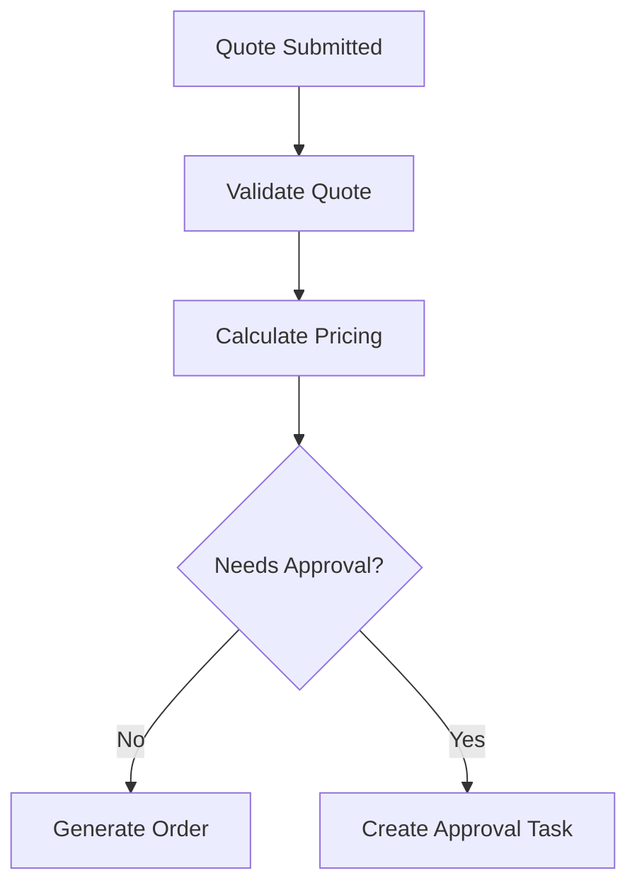

Pada diagram di atas:

- `Validate Quote` bisa service task ke validation service.
- `Calculate Pricing` bisa service task ke pricing engine.
- `Generate Order` bisa service task ke order management API.
- `Create Approval Task` bisa user task atau service task yang membuat work item di task platform.

Service task ada supaya process flow tetap eksplisit, sementara detail implementasi tetap berada di service/worker yang bisa dites, diobservasi, dan di-scale.

---

## 3. Service Task Bukan Tempat Semua Logic

Kesalahan umum: semua logic dimasukkan ke dalam service task tanpa boundary yang jelas.

Contoh buruk:

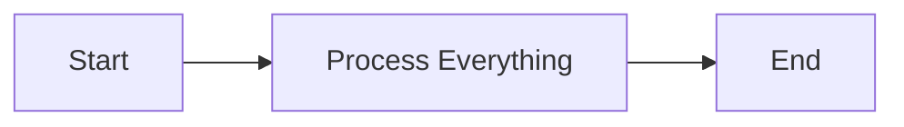

Masalah:

- diagram tidak menjelaskan proses bisnis;
- retry satu step bisa mengulang terlalu banyak side effect;
- debugging sulit karena semua terjadi di satu worker;
- business stakeholder tidak bisa membaca flow;
- observability per tahap hilang;
- compensation sulit;
- incident tidak punya owner spesifik.

Contoh lebih baik:

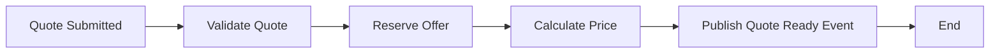

Di sini setiap automation step punya:

- nama bisnis yang jelas;
- input/output jelas;
- retry policy sendiri;
- idempotency key sendiri;
- observability sendiri;
- failure path sendiri.

---

## 4. Automation Boundary: Pertanyaan yang Harus Dijawab

Untuk setiap service task, senior engineer harus bisa menjawab:

1. Apa pekerjaan bisnis yang dilakukan task ini?
2. Siapa owner implementation-nya?
3. Apakah task ini punya side effect?
4. Apakah side effect-nya idempotent?
5. Apakah task ini boleh retry otomatis?
6. Apa beda business error dan technical error?
7. Variable apa yang dibaca?
8. Variable apa yang ditulis?
9. Data apa yang harus tetap di database, bukan process variable?
10. Bagaimana task ini diobservasi?
11. Bagaimana task ini di-debug saat stuck?
12. Apa dampak jika worker mati setelah side effect berhasil tetapi sebelum task complete?

Kalau jawaban tidak jelas, service task belum siap production.

---

## 5. Jenis Implementasi Service Task

### 5.1 Java Delegate

Pada Camunda 7, Java delegate adalah class Java yang dieksekusi oleh process engine ketika service task dicapai.

Model mental:

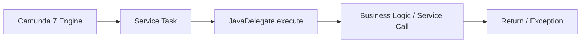

Kelebihan:

- sederhana untuk aplikasi Java monolith/modular monolith;
- bisa ikut transaction boundary aplikasi;
- mudah akses bean/service internal;
- latency rendah karena in-process.

Risiko:

- engine sangat coupled ke classpath aplikasi;
- deployment BPMN terkait deployment Java;
- exception teknis bisa rollback command context;
- scaling mengikuti aplikasi engine;
- side effect bisa terjadi di transaction boundary yang sulit dipahami;
- buruk untuk long-running external call;
- buruk jika service task membutuhkan dependency eksternal yang lambat/tidak stabil.

Gunakan Java delegate ketika:

- Camunda 7 embedded memang dipilih secara sadar;
- logic singkat dan lokal;
- transaction boundary dipahami;
- failure/retry behavior jelas;
- coupling ke codebase diterima.

Hindari Java delegate ketika:

- call ke external system lambat;
- worker perlu di-scale terpisah;
- deployment engine dan worker perlu dipisahkan;
- tim ingin mengarah ke remote orchestration model;
- ada risiko classloading/deployment conflict.

---

### 5.2 External Task

External task adalah pola Camunda 7 di mana engine membuat task eksternal, lalu worker mengambil task tersebut menggunakan fetch-and-lock.

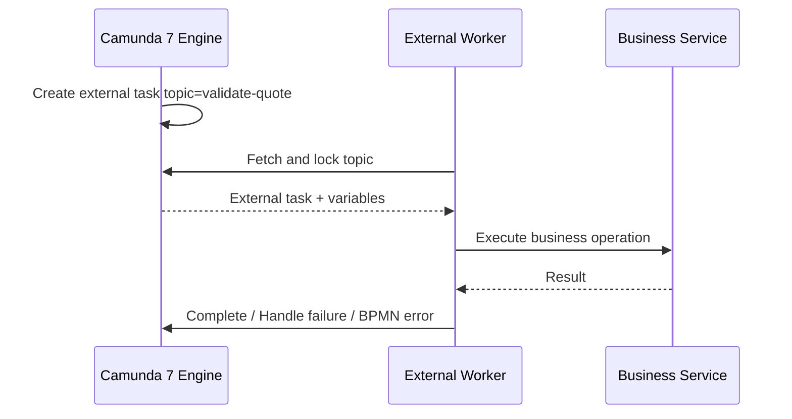

Kelebihan:

- worker terpisah dari engine;
- bisa ditulis dalam bahasa berbeda;
- lebih cocok untuk microservices;
- scaling worker lebih fleksibel;
- engine tidak perlu melakukan outbound call langsung;
- dependency eksternal tidak mencemari process engine.

Risiko:

- lock duration salah bisa menyebabkan duplicate processing;
- worker crash setelah side effect tapi sebelum complete;
- fetch/polling tuning perlu diperhatikan;
- retry policy harus eksplisit;
- butuh idempotency serius;
- observability tersebar antara engine dan worker.

External task cocok untuk enterprise microservices yang masih memakai Camunda 7 tetapi ingin automation logic tidak embedded di engine.

---

### 5.3 Zeebe Job Worker

Pada Camunda 8/Zeebe, service task menghasilkan job. Worker mengaktifkan job berdasarkan job type, menjalankan logic, lalu complete/fail/throw BPMN error.

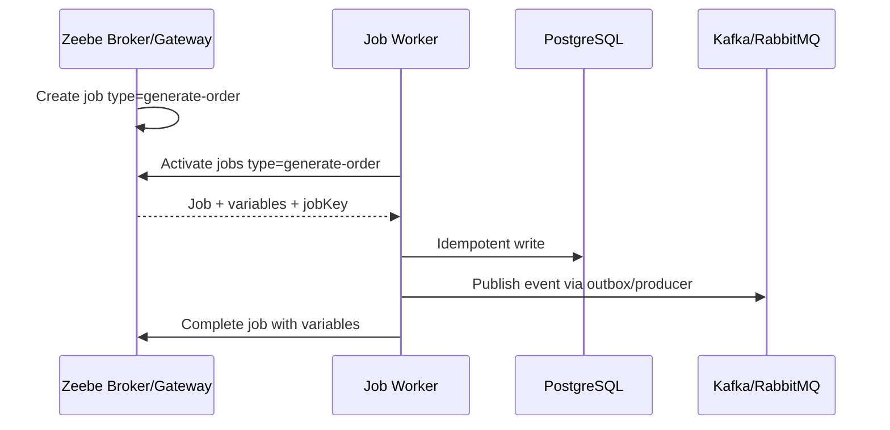

Kelebihan:

- distributed orchestration native;
- worker bisa di-scale horizontal;
- cocok untuk microservices;
- engine tidak embedded di Java app;
- worker lifecycle terpisah;
- lebih natural untuk Kubernetes/cloud deployment.

Risiko:

- distributed failure lebih banyak;
- job timeout/retry harus dirancang;
- worker concurrency bisa menyebabkan pressure ke downstream;
- variable payload size harus dikontrol;
- observability harus melintasi Zeebe, worker, DB, queue, external API;
- compatibility worker-process version harus dijaga.

Zeebe worker adalah default mental model untuk Camunda 8.

---

### 5.4 Connector-Backed Task

Connector adalah abstraction untuk integrasi umum, misalnya HTTP call, inbound event, atau integration connector lain jika tersedia dan digunakan.

Connector cocok untuk:

- integrasi standar;
- simple HTTP call;
- low-code integration;
- prototyping;
- proses yang butuh konfigurasi lebih dari custom code.

Connector kurang cocok untuk:

- business logic kompleks;
- transaksi database kompleks;
- idempotency custom;
- heavy transformation;
- retry/compensation yang sangat domain-specific;
- observability yang butuh custom metric detail.

Rule praktis:

> Jika task butuh domain invariant, transaction boundary, idempotency table, outbox, atau complex failure handling, gunakan custom worker, bukan connector sederhana.

---

## 6. Service Task Lifecycle

Lifecycle service task secara konseptual:

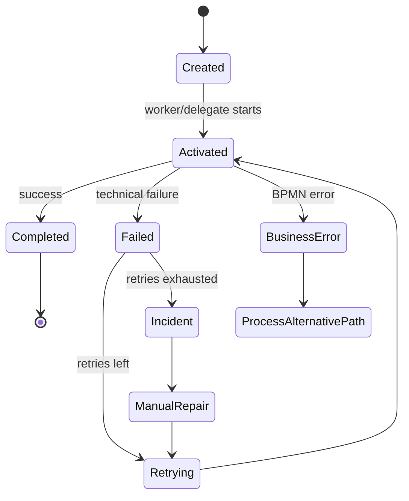

Lifecycle ini harus eksplisit di desain.

Jangan hanya berpikir:

> “Worker jalan lalu selesai.”

Pikirkan juga:

- siapa yang membuat work item;
- kapan worker mengambilnya;
- berapa lama lock/timeout;
- apa yang terjadi saat worker crash;
- apakah retry otomatis;
- kapan incident dibuat;
- siapa yang boleh retry manual;
- apakah side effect aman diulang;
- apakah output variable compatible dengan process version berikutnya.

---

## 7. Retryable vs Non-Retryable Service Task

Tidak semua service task boleh retry otomatis.

### Retryable Task

Cocok untuk failure teknis sementara:

- HTTP 503 dari downstream;
- timeout network;
- transient DB connection failure;
- broker unavailable;
- rate limit dengan backoff;
- temporary lock conflict.

Contoh:

```text
Task: Fetch Customer Profile
Failure: Customer service timeout
Policy: Retry 3x with exponential backoff, then incident
```

### Non-Retryable Task

Tidak cocok retry otomatis jika failure adalah business-invalid atau side effect berisiko.

Contoh:

- quote invalid;
- customer not eligible;
- duplicate order detected;
- illegal state transition;
- external system says product cannot be provisioned;
- payment/charge command tanpa idempotency key.

```text
Task: Submit Order to Fulfillment
Failure: Order state is CANCELLED
Policy: Throw BPMN error or route to fallout, not technical retry
```

Rule penting:

> Retry teknis menangani kondisi sementara. BPMN error menangani kondisi bisnis yang valid tetapi membutuhkan jalur proses berbeda.

---

## 8. Business Error vs Technical Failure

### Business Error

Business error adalah hasil bisnis yang diketahui dan harus dimodelkan.

Contoh:

- quote rejected;
- discount exceeds policy;
- product unavailable;
- customer eligibility failed;
- order validation failed;
- missing required document;
- provisioning rejected by business rule.

Business error seharusnya mengalir ke path BPMN:

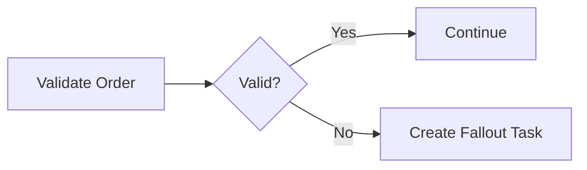

Atau memakai BPMN error boundary bila implementasi automation menemukan kondisi bisnis tersebut.

### Technical Failure

Technical failure adalah kegagalan infrastruktur/teknis:

- timeout;
- connection refused;
- DB deadlock;
- serialization error;
- service unavailable;
- worker crash;
- auth token expired;
- malformed response dari dependency;
- broker unavailable.

Technical failure biasanya menuju retry/incident.

Kesalahan umum:

- semua exception dilempar sebagai technical failure;
- semua failure dilempar sebagai BPMN error;
- business invalid dibuat incident;
- transient failure langsung masuk manual task;
- retry digunakan untuk memperbaiki data bisnis yang salah.

---

## 9. Side Effect Taxonomy

Service task yang tidak punya side effect relatif aman. Service task yang punya side effect harus dirancang jauh lebih hati-hati.

### No Side Effect

Contoh:

- membaca configuration;
- menghitung skor sementara;
- validasi murni;
- transformasi data lokal.

Risiko utama:

- performance;
- variable correctness;
- deterministic output.

### Internal Side Effect

Contoh:

- update PostgreSQL business table;
- insert audit record;
- update state machine;
- insert outbox event;
- write idempotency record.

Risiko utama:

- transaction boundary;
- optimistic locking;
- duplicate update;
- process variable vs DB state divergence.

### External Side Effect

Contoh:

- submit order ke downstream;
- reserve resource di inventory;
- publish Kafka event;
- send RabbitMQ command;
- call external billing/provisioning API;
- send notification.

Risiko utama:

- unknown outcome;
- timeout after success;
- retry duplicate;
- external system has no idempotency;
- compensation may be required.

---

## 10. The Most Dangerous Failure: Side Effect Succeeds, Completion Fails

Ini failure mode paling penting untuk worker.

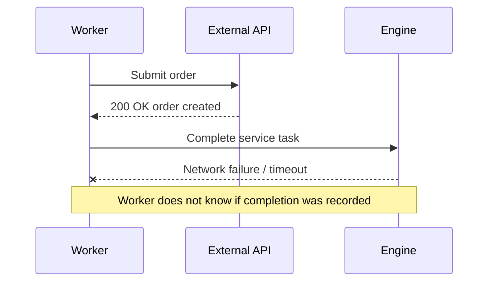

Kemungkinan outcome:

1. External side effect berhasil.
2. Engine completion gagal.
3. Engine retry task.
4. Worker menjalankan side effect lagi.
5. Duplicate order/event/charge/provisioning terjadi.

Solusi bukan “jangan retry”. Solusi adalah idempotency.

Minimal:

- gunakan stable idempotency key;
- simpan processed job/external command table;
- gunakan unique constraint;
- gunakan outbox untuk event;
- cek external API idempotency support;
- complete task hanya setelah durable state tercatat;
- treat completion uncertainty as expected distributed failure.

---

## 11. Idempotency Pattern untuk Service Task

Contoh pattern sederhana untuk worker database mutation:

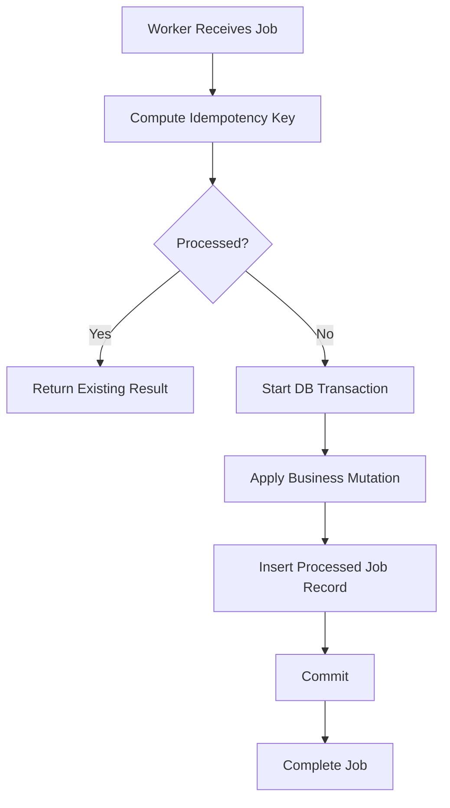

Contoh idempotency key:

```text
<processDefinitionKey>:<processInstanceKey>:<activityId>:<businessKey>
```

Atau untuk command bisnis:

```text
ORDER_SUBMIT:<orderId>:<workflowStepVersion>
```

Pilihan key bergantung pada semantics:

- ingin deduplicate per job attempt?
- per process activity?
- per business command?
- per external system request?
- per order state transition?

Untuk enterprise order management, biasanya business command idempotency lebih penting daripada job attempt idempotency.

---

## 12. Service Task dan PostgreSQL/MyBatis/JDBC

Service task sering melakukan database operation melalui MyBatis/JDBC.

Pertanyaan penting:

- Apakah worker DB transaction sama dengan engine transaction?
- Apakah update business state terjadi sebelum atau sesudah complete job?
- Apakah process variable menyalin state yang sudah ada di DB?
- Apakah optimistic locking dipakai untuk mencegah concurrent transition?
- Apakah ada outbox untuk event publish?
- Apakah ada inbox/processed-job table untuk idempotency?

### Pattern: Worker Owns Business Transaction

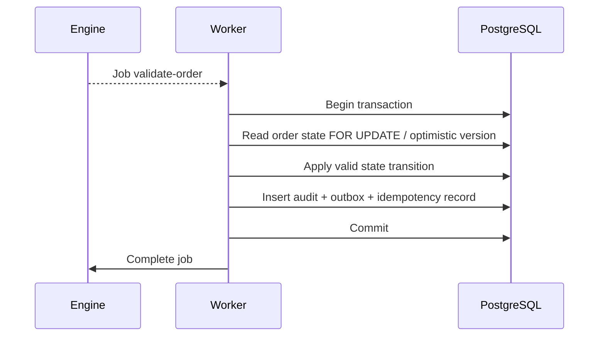

Ini umum untuk remote worker model.

Konsekuensi:

- DB commit bisa berhasil tapi job completion gagal;
- job bisa retry;
- idempotency wajib;
- outbox lebih aman daripada publish event langsung di tengah transaction.

### Pattern yang Berbahaya

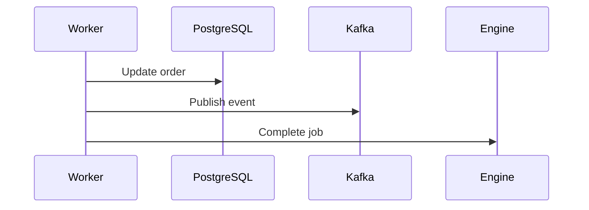

Jika publish Kafka berhasil tetapi complete job gagal, retry dapat publish event lagi.

Lebih aman:

1. DB transaction update order + insert outbox.
2. Outbox publisher publish event idempotently.
3. Worker complete job setelah durable mutation tercatat.

---

## 13. Service Task dan Kafka/RabbitMQ

### Publish Event dari Service Task

Jangan menganggap `publish event` adalah operasi kecil. Publish event adalah side effect.

Risiko:

- event published tetapi job completion gagal;
- duplicate event karena retry;
- out-of-order event;
- schema berubah;
- consumer melakukan side effect ganda;
- replay memicu workflow lama.

Recommended pattern:

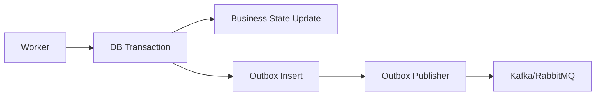

### Consume Event untuk Correlate Message

Jika Kafka/RabbitMQ event digunakan untuk melanjutkan process:

- correlation key harus stabil;
- duplicate event harus aman;
- late event harus punya policy;
- missing event harus punya timer/timeout;
- event schema harus versioned;
- event metadata harus membawa trace/correlation ID.

---

## 14. Service Task dan Redis

Redis bisa membantu, tapi jangan jadikan Redis sebagai source of truth proses.

Use case yang masuk akal:

- short-lived idempotency cache untuk low-risk operation;
- distributed rate limiter;
- worker kill switch;
- feature flag cache;
- cache external lookup;
- temporary process status cache;
- lock untuk resource tertentu jika correctness-nya sudah dipahami.

Risiko:

- eviction menghapus key idempotency;
- TTL terlalu pendek;
- distributed lock salah dipakai;
- Redis outage membuat worker gagal massal;
- cache stale membuat process mengambil path salah;
- data penting hilang karena Redis bukan durable store utama.

Rule praktis:

> Untuk correctness, pakai PostgreSQL unique constraint atau durable store. Untuk optimization, boleh pakai Redis.

---

## 15. Timeout, Lock Duration, and Worker Backpressure

Service task harus punya batas waktu.

Tanpa timeout:

- process bisa stuck;
- worker bisa menggantung;
- downstream outage tidak terlihat;
- SLA tidak bisa dihitung;
- retry tidak jalan;
- incident terlambat dibuat.

Untuk Camunda 7 external task:

- lock duration harus lebih panjang dari expected processing time;
- worker harus extend lock jika pekerjaan panjang;
- lock terlalu pendek menyebabkan duplicate processing;
- lock terlalu panjang memperlambat recovery saat worker mati.

Untuk Zeebe worker:

- job timeout harus sesuai expected execution;
- max jobs active harus sesuai kapasitas worker dan downstream;
- retry/backoff harus mencegah retry storm;
- graceful shutdown harus menghentikan activation baru dan menyelesaikan/menyerahkan job aktif secara aman.

Backpressure bukan hanya masalah engine. Backpressure harus dilihat dari:

- process engine;
- worker thread pool;
- DB connection pool;
- external API rate limit;
- Kafka/RabbitMQ throughput;
- Redis latency;
- Kubernetes CPU/memory;
- network egress;
- tenant/customer-specific load.

---

## 16. Service Task Naming

Nama service task harus business-readable dan implementation-actionable.

Buruk:

```text
Call API
Process Data
Do Validation
Update DB
Worker Task
```

Lebih baik:

```text
Validate Quote Eligibility
Reserve Product Offering
Calculate Contract Price
Submit Order to Fulfillment
Publish Quote Approved Event
Create Fallout Case
```

Nama yang baik menjawab:

- business action apa yang dilakukan;
- entity apa yang disentuh;
- outcome apa yang diharapkan;
- apakah ini command, validation, publish, reserve, calculate, atau notify.

Nama BPMN tidak harus sama dengan nama class/worker, tetapi mapping-nya harus jelas.

---

## 17. Variable Input/Output Contract

Setiap service task harus punya input/output contract.

Contoh:

```yaml
serviceTask: Validate Quote Eligibility
input:
  - quoteId
  - customerId
  - productOfferingIds
  - requestedEffectiveDate
output:
  - eligibilityStatus
  - eligibilityReasons
  - validationReferenceId
failure:
  businessErrors:
    - QUOTE_NOT_ELIGIBLE
    - PRODUCT_NOT_AVAILABLE
  technicalFailures:
    - CUSTOMER_SERVICE_TIMEOUT
    - VALIDATION_SERVICE_UNAVAILABLE
```

Anti-pattern:

- worker membaca semua variables;
- worker menulis object besar ke process variable;
- variable naming tidak versioned;
- output variable berbeda antar worker version;
- variable menyimpan data sensitif tanpa masking;
- variable menyalin seluruh aggregate quote/order.

Rule praktis:

> Process variable adalah context orchestration, bukan database alternatif.

---

## 18. Security and Privacy Concerns

Service task sering membawa data sensitif.

Risiko:

- PII masuk process variable;
- token/secret masuk variable;
- credential connector disimpan plain text;
- worker log mencetak payload penuh;
- incident detail mengekspos data customer;
- task failure message berisi raw external response;
- trace/span attribute berisi data sensitif.

Minimum controls:

- jangan simpan secret di process variable;
- gunakan secret manager/Kubernetes Secret/Key Vault/Secrets Manager sesuai platform;
- mask PII di logs;
- batasi variable yang dikirim ke worker;
- gunakan correlation ID, bukan payload penuh, untuk debugging;
- pastikan worker credential least privilege;
- audit access ke task/process/variable jika data sensitif.

---

## 19. Observability for Service Tasks

Service task yang production-ready harus menghasilkan sinyal berikut:

- job/external task count;
- activation/fetch rate;
- completion rate;
- failure rate;
- retry count;
- incident count;
- task duration;
- queue/wait time;
- worker latency;
- downstream latency;
- timeout count;
- business error count;
- duplicate/idempotency hit count;
- payload/variable size;
- correlation ID coverage.

Contoh metric naming:

```text
workflow_worker_jobs_activated_total{task_type="validate-quote"}
workflow_worker_jobs_completed_total{task_type="validate-quote"}
workflow_worker_jobs_failed_total{task_type="validate-quote",reason="timeout"}
workflow_worker_duration_seconds{task_type="validate-quote"}
workflow_worker_idempotency_hits_total{task_type="submit-order"}
```

Log minimal harus membawa:

- process definition key;
- process instance key/id;
- activity id;
- job key/external task id;
- business key;
- correlation ID;
- worker name/version;
- attempt/retry count;
- sanitized error code.

---

## 20. Debugging Service Task Failure

Saat service task gagal, jangan langsung retry manual.

Gunakan urutan hipotesis:

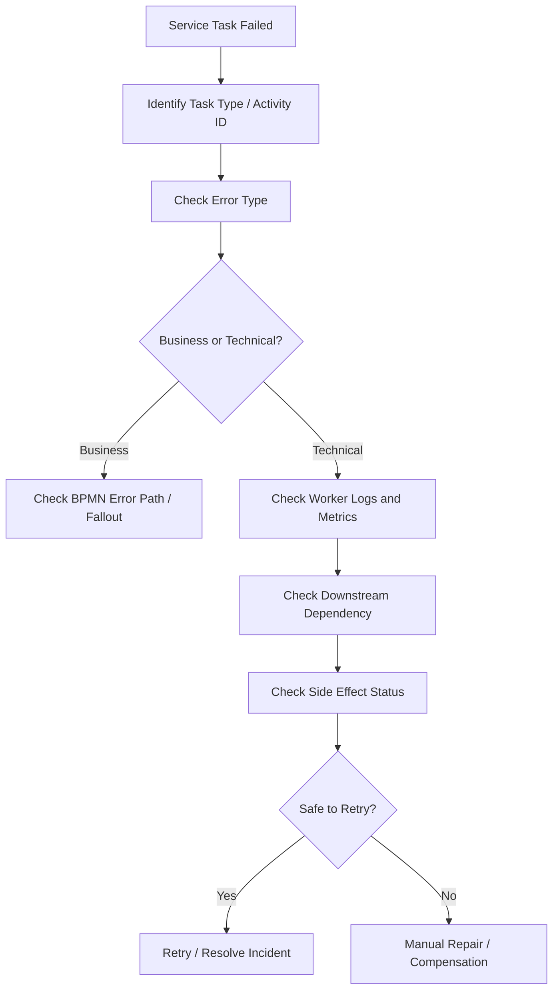

Checklist debugging:

- process instance berada di activity apa;
- job/external task id apa;
- retries tersisa berapa;
- error message sanitized apa;
- worker version berapa;
- deployment BPMN version berapa;
- input variables apa;
- output partial ada atau tidak;
- DB mutation sudah terjadi atau belum;
- event sudah ter-publish atau belum;
- external command sudah diterima downstream atau belum;
- duplicate protection aktif atau tidak.

---

## 21. Service Task Anti-Patterns

### 21.1 God Service Task

Satu task melakukan semua hal.

Dampak:

- retry terlalu kasar;
- observability hilang;
- business process tidak terlihat;
- compensation sulit.

### 21.2 Non-Idempotent Worker

Worker melakukan side effect tanpa deduplication.

Dampak:

- duplicate order;
- duplicate event;
- duplicate charge;
- double state transition.

### 21.3 Infinite Retry

Retry tanpa batas atau tanpa backoff.

Dampak:

- downstream overload;
- incident tersembunyi;
- retry storm.

### 21.4 Business Error as Incident

Data bisnis invalid dibuat technical incident.

Dampak:

- operasi manual bingung;
- SLA salah;
- process tidak punya jalur bisnis yang benar.

### 21.5 Sensitive Payload in Variables

Worker menyimpan payload penuh dari external API.

Dampak:

- PII bocor di history/logs/incidents;
- DB/search bloat;
- compliance risk.

### 21.6 Worker as Hidden Orchestrator

Worker memanggil banyak service dan menentukan flow internal sendiri.

Dampak:

- BPMN kehilangan makna;
- BA/product tidak bisa review flow;
- process observability palsu.

---

## 22. Camunda 7 vs Camunda 8 Perspective

| Concern | Camunda 7 Java Delegate | Camunda 7 External Task | Camunda 8 Zeebe Worker |
|---|---|---|---|
| Execution location | In engine/application JVM | External worker | External worker |
| Coupling | High | Medium | Medium/low |
| Scaling | With engine/app | Worker independent | Worker independent |
| Transaction | Can share app transaction | Separate | Separate |
| Best for | Local Java automation | Microservice automation on C7 | Distributed orchestration |
| Main risk | Classpath/transaction coupling | Lock/idempotency | Timeout/retry/backpressure |
| Migration impact | Must replace delegate | Can map to worker pattern | Native worker pattern |

Migration awareness:

- JavaDelegate-heavy Camunda 7 systems are harder to migrate to Camunda 8.
- External task pattern is conceptually closer to Zeebe job workers.
- Worker contract, variable model, retry policy, and business error semantics must be revisited during migration.

---

## 23. Production-Ready Service Task Template

Gunakan template ini saat mendesain service task.

```yaml
serviceTask:
  name: "Submit Order to Fulfillment"
  bpmnActivityId: "submitOrderToFulfillment"
  implementationType: "zeebe-worker | external-task | java-delegate | connector"
  owner: "backend-order-team"
  inputVariables:
    - orderId
    - customerId
    - correlationId
  outputVariables:
    - fulfillmentRequestId
    - fulfillmentStatus
  businessErrors:
    - ORDER_INVALID
    - PRODUCT_NOT_FULFILLABLE
  technicalFailures:
    - FULFILLMENT_TIMEOUT
    - FULFILLMENT_UNAVAILABLE
  retryPolicy:
    retries: 3
    backoff: "exponential"
    incidentAfterExhausted: true
  idempotency:
    key: "SUBMIT_ORDER:<orderId>"
    durableStore: "postgresql"
    uniqueConstraint: true
  sideEffects:
    - "external fulfillment command"
    - "business audit insert"
  observability:
    metrics:
      - completion_rate
      - failure_rate
      - latency
      - retry_count
      - idempotency_hit_count
    logs:
      - processInstanceKey
      - activityId
      - businessKey
      - correlationId
  security:
    piiInVariables: false
    secretsInVariables: false
    workerCredential: "least privilege"
  operationalRunbook:
    safeManualRetry: "only after checking fulfillmentRequestId"
    compensation: "cancel fulfillment request if accepted downstream"
```

---

## 24. PR Review Checklist

Untuk setiap perubahan service task, review:

- [ ] Nama task jelas secara bisnis.
- [ ] Activity ID stabil dan readable.
- [ ] Implementation type jelas: delegate, external task, worker, connector.
- [ ] Input/output variables eksplisit.
- [ ] Tidak ada payload besar tanpa alasan.
- [ ] Tidak ada PII/secret di variable/log/incident.
- [ ] Business error dan technical failure dibedakan.
- [ ] Retry count/backoff jelas.
- [ ] Incident ownership jelas.
- [ ] Side effect teridentifikasi.
- [ ] Idempotency key stabil.
- [ ] Durable deduplication tersedia untuk side effect penting.
- [ ] DB transaction boundary jelas.
- [ ] Kafka/RabbitMQ publish memakai outbox jika perlu.
- [ ] Worker concurrency sesuai kapasitas downstream.
- [ ] Timeout/lock duration sesuai expected runtime.
- [ ] Graceful shutdown dipertimbangkan.
- [ ] Metrics/logs/traces cukup untuk debugging.
- [ ] Security credential least privilege.
- [ ] Backward compatibility dengan running process dicek.

---

## 25. Internal Verification Checklist

Gunakan checklist ini di codebase/team CSG. Jangan asumsikan detail internal sebelum diverifikasi.

### BPMN Model

- [ ] Service task apa saja yang ada di process model?
- [ ] Activity ID dan nama task konsisten?
- [ ] Apakah ada service task yang terlalu besar/god task?
- [ ] Apakah failure path dimodelkan atau hanya mengandalkan incident?
- [ ] Apakah BPMN error boundary dipakai untuk business error?

### Implementation

- [ ] Apakah memakai JavaDelegate, external task, Zeebe worker, connector, atau custom integration?
- [ ] Di repository mana implementasi worker/delegate berada?
- [ ] Bagaimana mapping task type/topic/activity ID ke class/worker?
- [ ] Apakah worker versioning jelas?
- [ ] Apakah deployment worker dan BPMN terkoordinasi?

### Variables

- [ ] Variable apa yang dibaca/ditulis?
- [ ] Apakah variable besar atau sensitive?
- [ ] Apakah business key/correlation key konsisten?
- [ ] Apakah output variable compatible antar version?

### Retry and Incident

- [ ] Retry policy di-set di BPMN/engine/worker?
- [ ] Berapa retry count dan backoff?
- [ ] Kapan incident dibuat?
- [ ] Siapa owner incident?
- [ ] Apakah manual retry aman?

### Idempotency and Side Effects

- [ ] Task punya side effect apa?
- [ ] Apakah ada idempotency key?
- [ ] Apakah deduplication durable di PostgreSQL?
- [ ] Apakah external API mendukung idempotency?
- [ ] Apakah event publication memakai outbox?

### Operations

- [ ] Metrics worker tersedia?
- [ ] Logs punya process instance/business key/correlation ID?
- [ ] Dashboard menunjukkan failure/retry/latency?
- [ ] Ada alert untuk worker down/job backlog/incident?
- [ ] Ada runbook untuk task failure?

---

## 26. Latihan Praktis

Ambil satu service task nyata atau kandidat service task, lalu isi:

```yaml
name:
activityId:
implementationType:
businessPurpose:
inputVariables:
outputVariables:
sideEffects:
businessErrors:
technicalFailures:
retryPolicy:
idempotencyKey:
owner:
metrics:
manualRepairSteps:
```

Kemudian jawab:

1. Apa yang terjadi jika worker crash setelah DB commit tetapi sebelum task complete?
2. Apa yang terjadi jika external API timeout tetapi sebenarnya berhasil?
3. Apa yang terjadi jika process variable hilang atau berubah tipe?
4. Apa yang terjadi jika task retry 1000 kali saat downstream outage?
5. Apa bukti observability bahwa task ini sehat?

Jika jawaban belum jelas, task belum production-ready.

---

## 27. Ringkasan

Service task adalah automation boundary dalam workflow.

Hal yang harus diingat:

- Service task bukan sekadar “call service”.
- Setiap service task punya lifecycle, retry, timeout, failure path, dan ownership.
- Java delegate, external task, Zeebe worker, dan connector punya trade-off berbeda.
- Side effect adalah sumber risiko utama.
- Idempotency wajib untuk task yang bisa retry.
- Business error harus dibedakan dari technical failure.
- Process variable bukan database.
- Observability service task harus cukup untuk debugging production.
- Manual retry tanpa memahami side effect bisa memperparah incident.

Untuk senior backend engineer, service task review adalah salah satu titik tertinggi leverage dalam workflow system. Banyak incident workflow tidak berasal dari simbol BPMN yang salah, tetapi dari service task yang tidak punya idempotency, retry policy, transaction boundary, observability, atau owner yang jelas.
