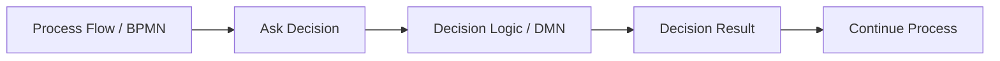
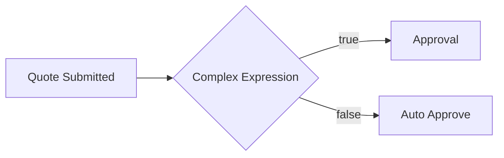
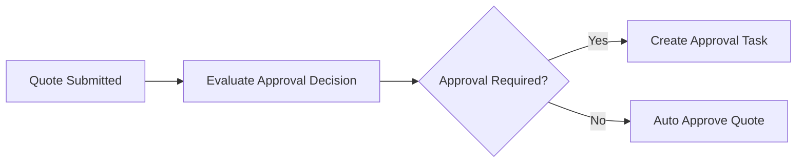
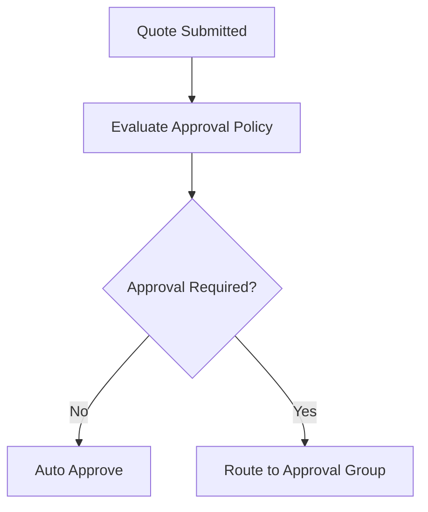
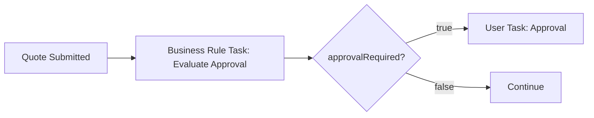
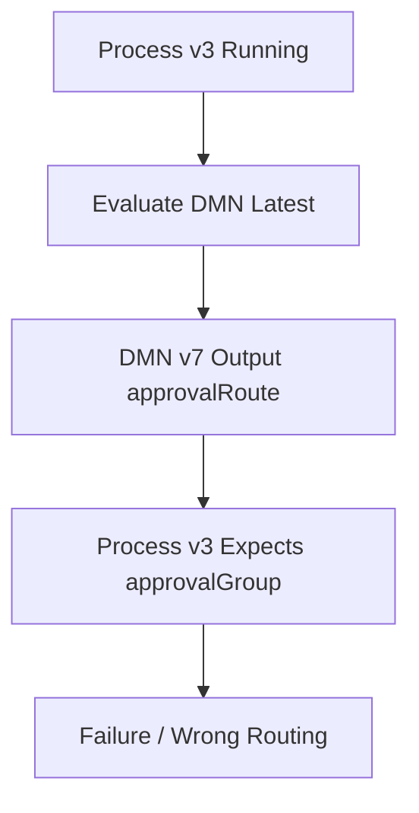
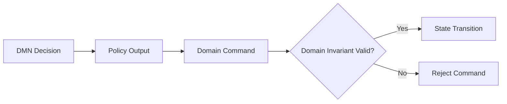
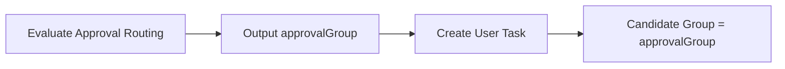

# DMN and Decision Automation

> Fokus part ini: memahami **DMN** sebagai cara memisahkan business decision dari process flow. Targetnya bukan sekadar tahu bentuk decision table, tetapi mampu menilai kapan decision layak dimodelkan sebagai DMN, kapan lebih baik tetap di Java/domain code, dan kapan butuh rules engine khusus.

BPMN menjawab:

> “Urutan pekerjaan bisnisnya apa?”

DMN menjawab:

> “Keputusan bisnisnya apa, berdasarkan input apa, dan menghasilkan output apa?”

Dalam enterprise CPQ/order management, keputusan bisnis sering berubah lebih sering daripada flow utama.

Contoh keputusan:

- apakah quote perlu approval;
- siapa approver berdasarkan discount/margin/customer segment;
- apakah customer eligible untuk product offering;
- apakah order harus masuk manual review;
- apakah amendment membutuhkan approval tambahan;
- apakah cancellation boleh otomatis;
- SLA priority berdasarkan customer tier;
- fallout routing berdasarkan error code;
- risk category berdasarkan contract deviation.

Jika semua keputusan itu ditanam di gateway expression atau Java `if/else`, proses menjadi sulit diaudit, sulit direview BA/Product, dan sulit diubah tanpa deploy code.

---

## 1. Mental Model: Flow vs Decision

Pisahkan dua pertanyaan:



BPMN seharusnya menggambarkan lifecycle proses:

- submitted;
- validated;
- priced;
- approved;
- ordered;
- fulfilled;
- failed;
- compensated;
- completed.

DMN seharusnya menggambarkan business decision:

- approval required or not;
- approval level;
- routing group;
- eligibility result;
- exception category;
- priority;
- next policy action.

Jika decision logic kompleks disembunyikan di gateway condition, BPMN menjadi tidak transparan.

Contoh buruk:



Masalah:

- expression sulit dibaca business;
- rule tidak punya table/audit yang jelas;
- perubahan rule membutuhkan developer membaca expression;
- test case rule tidak eksplisit;
- gateway berubah menjadi mini-rules-engine.

Contoh lebih baik:



`Evaluate Approval Decision` bisa business rule task yang mengevaluasi DMN.

---

## 2. Apa itu DMN?

DMN adalah Decision Model and Notation: standar untuk memodelkan keputusan bisnis, terutama dalam bentuk decision table.

Decision table biasanya terdiri dari:

- input columns;
- output columns;
- rules/rows;
- hit policy;
- optional annotations;
- decision ID/name;
- version/deployment metadata.

Contoh konseptual:

| customerTier | discountPercent | marginPercent | approvalRequired | approvalGroup |
|---|---:|---:|---|---|
| STANDARD | <= 10 | >= 20 | false | none |
| STANDARD | > 10 | >= 15 | true | SALES_MANAGER |
| ENTERPRISE | > 20 | >= 10 | true | DEAL_DESK |
| ANY | ANY | < 10 | true | FINANCE_APPROVAL |

Decision table membuat logic lebih eksplisit daripada nested `if` di code.

Tetapi DMN bukan magic. DMN tetap butuh:

- input yang benar;
- hit policy yang tepat;
- test coverage;
- versioning;
- ownership;
- deployment discipline;
- observability;
- auditability;
- boundary dengan domain invariants.

---

## 3. Kenapa DMN Ada?

DMN ada karena banyak keputusan bisnis:

- berubah lebih sering daripada process flow;
- perlu dibaca BA/Product/Solution Architect;
- perlu diaudit;
- memiliki banyak kombinasi input;
- lebih natural sebagai tabel daripada procedural code;
- perlu dites secara data-driven;
- perlu dipisahkan dari orchestration step.

Contoh di CPQ/order management:



DMN bisa menjawab:

```yaml
input:
  customerTier: ENTERPRISE
  discountPercent: 22
  marginPercent: 14
  contractDeviation: true
output:
  approvalRequired: true
  approvalGroup: DEAL_DESK
  reasonCode: HIGH_DISCOUNT_ENTERPRISE
```

BPMN tidak perlu tahu detail tabel rule. BPMN hanya memakai hasil keputusan.

---

## 4. Business Rule Task

Dalam BPMN, business rule task merepresentasikan evaluasi business rule.



Business rule task dapat:

- mengevaluasi DMN decision;
- memanggil rule service;
- dijalankan oleh worker jika platform/versi menggunakan worker model;
- menjadi semantic marker bahwa task ini adalah decision, bukan generic service call.

Perbedaan penting:

- **Service task**: melakukan pekerjaan otomatis.
- **Business rule task**: mengevaluasi keputusan bisnis.

Secara runtime, implementasinya bisa mirip. Secara modelling, semantiknya berbeda.

Gunakan business rule task ketika pembaca BPMN perlu tahu:

> “Di titik ini proses mengambil keputusan berbasis policy/rule.”

---

## 5. Anatomy of a Decision Table

Decision table yang baik memiliki struktur jelas.

```text
Decision Name: Quote Approval Decision
Decision ID: quoteApprovalDecision
Inputs:
  - customerTier
  - discountPercent
  - marginPercent
  - contractDeviation
Outputs:
  - approvalRequired
  - approvalGroup
  - reasonCode
Hit Policy:
  - FIRST / UNIQUE / COLLECT / etc.
Owner:
  - Deal Desk / Product / Pricing / BA / Backend
```

### Input

Input adalah data yang dibutuhkan decision.

Input harus:

- eksplisit;
- minimal;
- typed;
- berasal dari source of truth yang jelas;
- tidak bergantung pada payload besar;
- tidak ambigu secara unit/format;
- tidak membawa PII yang tidak perlu.

Contoh buruk:

```yaml
input:
  quotePayload: "entire quote JSON"
```

Contoh lebih baik:

```yaml
input:
  customerTier: "ENTERPRISE"
  totalContractValue: 250000
  discountPercent: 18
  marginPercent: 12
  hasNonStandardTerms: true
```

### Output

Output harus digunakan oleh process atau domain service.

Output yang baik:

- kecil;
- typed;
- punya enum/value set jelas;
- compatible antar version;
- bisa diaudit;
- bisa dites.

Contoh:

```yaml
output:
  approvalRequired: true
  approvalLevel: "L2"
  approvalGroup: "DEAL_DESK"
  reasonCode: "HIGH_DISCOUNT"
```

---

## 6. Hit Policy Awareness

Hit policy menentukan bagaimana rule rows dievaluasi ketika satu atau lebih row cocok.

Secara praktis, senior engineer harus memahami risiko berikut:

### UNIQUE

Hanya boleh satu rule match.

Cocok untuk decision yang mutually exclusive.

Risiko:

- jika dua rule match, decision error;
- table harus dijaga agar tidak overlap.

### FIRST

Rule pertama yang match menang.

Cocok jika row order memang prioritas bisnis.

Risiko:

- urutan row menjadi semantic penting;
- perubahan row order bisa mengubah hasil;
- reviewer harus sadar bahwa top-to-bottom order matters.

### COLLECT

Mengumpulkan banyak hasil.

Cocok untuk scoring, daftar reason, daftar required checks.

Risiko:

- output bisa banyak;
- process harus tahu cara memakai collection;
- duplicate result perlu dipikirkan.

### ANY / PRIORITY / RULE ORDER

Bisa berguna, tetapi reviewer harus paham semantics-nya.

Rule praktis:

> Hit policy adalah bagian dari business semantics, bukan setting teknis kecil.

Jika hit policy salah, keputusan bisa salah walaupun isi row terlihat benar.

---

## 7. FEEL Awareness

FEEL adalah expression language yang sering digunakan dalam DMN/Camunda decision modelling.

Senior backend engineer tidak harus menjadi ahli FEEL sejak awal, tetapi harus sadar bahwa FEEL memengaruhi:

- comparison;
- ranges;
- date/time;
- null handling;
- list handling;
- string matching;
- type conversion;
- expression readability;
- migration compatibility.

Contoh concern:

```text
discountPercent > 10
customerTier = "ENTERPRISE"
requestedDate >= date("2026-01-01")
```

Yang perlu dicek:

- apakah input numeric benar-benar numeric, bukan string;
- apakah date memakai timezone/format yang benar;
- bagaimana null diperlakukan;
- apakah enum case-sensitive;
- apakah range boundary inclusive/exclusive;
- apakah expression bisa dibaca BA/Product.

Rule praktis:

> FEEL expression yang terlalu rumit adalah bau desain. Kalau expression panjang dan procedural, mungkin logic lebih cocok di code atau rules service.

---

## 8. Decision Versioning

Decision adalah artifact production. Ia harus versioned.

Pertanyaan penting:

- decision version mana yang dipakai process version ini?
- apakah running process boleh memakai decision latest?
- apakah decision change backward compatible?
- apakah output variable berubah?
- apakah rule row dihapus atau ditambah?
- apakah hit policy berubah?
- apakah process lama bisa menerima output decision baru?

Contoh risiko:



Jika process instance lama mengevaluasi decision versi baru dengan output berbeda, proses bisa gagal atau mengambil path salah.

Production rule:

> Versioning BPMN dan DMN harus dipikirkan bersama.

---

## 9. Decision Auditability

Decision automation harus bisa menjawab:

- input apa yang dievaluasi;
- decision version mana yang dipakai;
- rule row mana yang match;
- output apa yang dihasilkan;
- siapa/apa yang memicu decision;
- kapan decision terjadi;
- process instance mana yang memakai decision;
- apakah output diubah manual setelah decision;
- apakah decision memengaruhi customer/business outcome.

Auditability penting untuk:

- approval justification;
- dispute handling;
- compliance evidence;
- incident investigation;
- regression analysis;
- business sign-off.

Minimal audit record:

```yaml
decisionAudit:
  decisionId: quoteApprovalDecision
  decisionVersion: 12
  processInstanceKey: 2251799813688123
  businessKey: QUOTE-12345
  evaluatedAt: "2026-07-11T10:15:00+07:00"
  inputHash: "..."
  matchedRuleIds:
    - R-042
  output:
    approvalRequired: true
    approvalGroup: DEAL_DESK
    reasonCode: HIGH_DISCOUNT
```

Hati-hati: audit tidak boleh membocorkan PII/secret. Gunakan hash/redaction bila perlu.

---

## 10. DMN vs Gateway Expression

Gunakan gateway expression untuk routing sederhana yang langsung terkait output proses.

Contoh wajar:

```text
approvalRequired = true
orderValid = false
paymentStatus = "PAID"
```

Gunakan DMN jika:

- ada banyak kondisi;
- decision perlu direview business;
- rule berubah cukup sering;
- output lebih dari satu;
- decision perlu audit;
- decision perlu test case data-driven;
- rule ingin dipakai oleh beberapa process.

Jangan gunakan gateway expression untuk logic seperti:

```text
(customerTier == 'ENTERPRISE' && discount > 15 && margin < 20 && region in ['APAC','EMEA'] && hasNonStandardTerms && ...)
```

Itu bukan routing sederhana. Itu policy decision.

---

## 11. DMN vs Java Code

DMN bukan pengganti semua code.

### Cocok untuk DMN

- decision table stabil secara struktur;
- input/output jelas;
- business ingin membaca rule;
- rule berbasis kombinasi kondisi;
- audit penting;
- perubahan rule relatif sering;
- logic tidak membutuhkan complex algorithm.

Contoh:

- approval routing;
- eligibility classification;
- SLA priority;
- fallout category;
- manual review required;
- risk tier.

### Cocok untuk Java Code

- domain invariant kritikal;
- algorithm kompleks;
- performance-critical computation;
- membutuhkan banyak data access;
- membutuhkan transaction boundary;
- logic butuh type safety tinggi;
- logic berubah bersama domain model;
- butuh library khusus.

Contoh:

- price calculation engine yang kompleks;
- product compatibility algorithm;
- inventory allocation;
- state transition guard;
- financial computation presisi tinggi;
- validation yang membutuhkan banyak aggregate data.

Rule penting:

> Domain invariant jangan dipindahkan ke DMN hanya karena mudah diedit. Invariant harus tetap dijaga di domain layer.

---

## 12. DMN vs Rules Engine

DMN cocok untuk banyak decision table yang relatif eksplisit.

Rules engine khusus mungkin lebih cocok jika:

- rule sangat banyak dan saling bergantung;
- membutuhkan forward/backward chaining;
- membutuhkan agenda/conflict resolution kompleks;
- decision membutuhkan reasoning atas object graph besar;
- rule authoring lifecycle sangat kompleks;
- membutuhkan simulation/what-if tingkat lanjut;
- business rule menjadi produk tersendiri.

Jangan menjadikan DMN sebagai rules engine besar jika rule domain terlalu kompleks.

Tanda DMN mulai dipaksakan:

- table sangat besar dan sulit dibaca;
- terlalu banyak nested decisions;
- expression sangat procedural;
- decision memanggil banyak service;
- test matrix tidak terkendali;
- performance evaluation berat;
- BA tidak lagi bisa memahami table.

---

## 13. Decision Boundary with Domain Model

Decision bisa memberi rekomendasi atau classification. Tetapi domain model tetap harus menjaga correctness.

Contoh:

DMN output:

```yaml
approvalRequired: false
```

Domain layer tetap harus mengecek:

- quote masih dalam state yang bisa di-approve;
- quote belum expired;
- version quote tidak stale;
- user/service punya permission;
- mandatory fields lengkap;
- no illegal transition.

DMN menjawab policy. Domain model menjaga invariant.



Jangan percaya DMN sebagai satu-satunya guard untuk entity state.

---

## 14. Decision Input Source of Truth

Salah satu failure paling umum adalah decision mengevaluasi input yang salah/stale.

Pertanyaan:

- input berasal dari process variable atau database?
- process variable disalin kapan?
- apakah quote/order sudah berubah sejak variable dibuat?
- apakah worker membaca latest DB state?
- apakah decision harus deterministic terhadap snapshot lama?
- apakah decision harus memakai current state terbaru?

Dua model:

### Snapshot Decision

Decision memakai snapshot saat proses mencapai titik tertentu.

Cocok untuk:

- audit approval saat submit;
- pricing quote versi tertentu;
- customer eligibility pada saat order capture.

### Current-State Decision

Decision membaca state terbaru saat dievaluasi.

Cocok untuk:

- routing operational task;
- retry/fallout classification;
- SLA priority saat ini.

Yang penting: pilih secara sadar.

---

## 15. DMN in CPQ and Order Management

Contoh decision yang cocok untuk CPQ/order management.

### Quote Approval Decision

```yaml
inputs:
  customerTier
  discountPercent
  marginPercent
  contractDeviation
  totalContractValue
outputs:
  approvalRequired
  approvalLevel
  approvalGroup
  reasonCode
```

### Order Fallout Routing Decision

```yaml
inputs:
  failureCode
  productType
  customerSegment
  orderPriority
  retryCount
outputs:
  falloutQueue
  manualReviewRequired
  escalationRequired
  reasonCode
```

### Cancellation Policy Decision

```yaml
inputs:
  orderState
  fulfillmentStage
  cancellationReason
  customerTier
outputs:
  cancellable
  compensationRequired
  approvalRequired
  reasonCode
```

### SLA Priority Decision

```yaml
inputs:
  customerTier
  orderType
  productCriticality
  contractSla
outputs:
  priority
  dueDuration
  escalationGroup
```

Decision table membuat policy ini eksplisit dan bisa direview lintas tim.

---

## 16. DMN and Human Task Routing

DMN sering dipakai untuk menentukan assignment user task.



Contoh output:

```yaml
approvalRequired: true
candidateGroup: DEAL_DESK_APAC
priority: HIGH
slaDuration: PT8H
reasonCode: HIGH_DISCOUNT_LOW_MARGIN
```

Risiko:

- group output tidak cocok dengan identity provider;
- group rename memecahkan routing;
- DMN output tidak diaudit;
- fallback group tidak ada;
- task terlihat oleh user yang salah;
- tenant/customer isolation tidak dipertimbangkan.

Review routing decision harus melibatkan:

- backend engineer;
- BA/product;
- operations team;
- identity/access owner;
- compliance/security jika data sensitif.

---

## 17. DMN and Retry/Incident Handling

Decision evaluation bisa gagal.

Failure modes:

- input variable missing;
- input type mismatch;
- invalid expression;
- no rule matched;
- multiple rules matched padahal hit policy UNIQUE;
- decision definition not found;
- wrong decision version;
- output missing;
- engine/worker issue;
- migration/deployment mismatch.

Perlakuan failure:

- no rule matched bisa business error atau model defect, tergantung decision;
- missing input biasanya model/worker contract defect;
- type mismatch biasanya technical/model defect;
- decision not found adalah deployment/config defect;
- wrong output bisa compatibility defect.

Jangan otomatis menganggap semua DMN failure sebagai retryable transient failure.

---

## 18. Testing Decision Tables

Decision table harus dites seperti production logic.

Test minimal:

- happy path;
- boundary value;
- no-match case;
- overlapping rule case;
- null/missing input;
- invalid enum;
- date/time boundary;
- high-risk customer/order scenarios;
- regression cases dari incident;
- backward compatibility output.

Contoh test matrix:

| Case | customerTier | discount | margin | expected approvalRequired | expected group |
|---|---|---:|---:|---|---|
| standard low discount | STANDARD | 5 | 25 | false | none |
| standard high discount | STANDARD | 15 | 18 | true | SALES_MANAGER |
| enterprise high discount | ENTERPRISE | 25 | 12 | true | DEAL_DESK |
| low margin | ANY | 5 | 8 | true | FINANCE_APPROVAL |

Test harus berada di CI, bukan hanya manual di modeler.

---

## 19. Deployment and Promotion

DMN harus masuk lifecycle CI/CD/GitOps seperti code.

Checklist deployment:

- DMN disimpan di repository;
- perubahan melalui PR;
- BA/Product sign-off jika rule bisnis berubah;
- automated tests berjalan;
- model validation/linting berjalan;
- version tag jelas;
- dependency BPMN-DMN diketahui;
- deployment environment staged;
- rollback strategy tersedia;
- impact ke running process dicek.

Anti-pattern:

- decision table diubah langsung di environment tanpa PR;
- tidak ada test;
- tidak tahu process mana yang memakai decision;
- output berubah tanpa update process/worker;
- decision latest dipakai oleh process lama tanpa compatibility review.

---

## 20. Observability for Decision Automation

Sinyal yang perlu dimonitor:

- decision evaluation count;
- decision latency;
- decision failure count;
- no-match count;
- multiple-match/unique violation count;
- output distribution;
- decision version usage;
- top reason codes;
- approval required ratio;
- fallout category ratio;
- unexpected output ratio.

Contoh metrics:

```text
workflow_decision_evaluations_total{decision_id="quoteApprovalDecision",version="12"}
workflow_decision_failures_total{decision_id="quoteApprovalDecision",reason="missing_input"}
workflow_decision_latency_seconds{decision_id="quoteApprovalDecision"}
workflow_decision_output_total{decision_id="quoteApprovalDecision",output="approvalRequired",value="true"}
```

Output distribution penting untuk mendeteksi rule drift.

Contoh:

- approval required biasanya 15%, tiba-tiba 80%;
- fallout manual review biasanya 5%, tiba-tiba 35%;
- no-match muncul setelah product baru launch;
- decision v13 dipakai di process lama.

---

## 21. Security and Privacy

DMN dapat mengekspos data melalui:

- input variables;
- output variables;
- audit records;
- decision history;
- logs;
- incident messages;
- test fixtures;
- exported decision tables.

Controls:

- minimalkan input;
- jangan masukkan PII jika tidak diperlukan;
- redact audit payload;
- batasi akses ke decision history;
- review output yang bisa mengungkap risk scoring/customer tier sensitif;
- pastikan test data bukan production data mentah;
- pastikan decision table tidak menyimpan secret atau credential.

Decision table juga bisa menjadi sensitive business IP, misalnya pricing/discount policy. Aksesnya perlu dikontrol.

---

## 22. Performance Concerns

DMN biasanya ringan, tetapi bisa menjadi bottleneck jika:

- decision table sangat besar;
- dipanggil sangat sering;
- expression kompleks;
- nested decision banyak;
- input object besar;
- decision dipanggil dalam loop process;
- decision evaluation melakukan remote call melalui custom implementation;
- history/audit terlalu verbose.

Guideline:

- keep input minimal;
- hindari large object variable;
- pisahkan decision besar menjadi decision kecil yang jelas;
- cache reference data di tempat yang benar, bukan di process variable besar;
- load test decision yang high-volume;
- monitor latency dan failure rate.

---

## 23. DMN Anti-Patterns

### 23.1 Rules Hidden in BPMN Gateway

Gateway expression menjadi rule engine tersembunyi.

Dampak:

- sulit diaudit;
- sulit dites;
- business tidak bisa review;
- perubahan berisiko.

### 23.2 DMN as Domain Invariant Store

Invariant domain dipindahkan ke DMN.

Dampak:

- command bisa melewati invariant jika dipanggil dari path lain;
- correctness tersebar;
- domain model melemah.

### 23.3 Huge Decision Table

Satu decision table berisi ratusan/ribuan row tanpa struktur.

Dampak:

- overlap sulit dideteksi;
- performance/test matrix buruk;
- reviewer tidak efektif.

### 23.4 No Version Strategy

Process selalu pakai latest decision tanpa compatibility check.

Dampak:

- running process lama bisa rusak;
- output variable mismatch;
- audit sulit.

### 23.5 No-Match Not Modelled

Tidak ada rule fallback.

Dampak:

- incident saat data baru muncul;
- process stuck;
- manual repair meningkat.

### 23.6 Decision Output Too Broad

Decision output mengembalikan object besar.

Dampak:

- process variable bloat;
- coupling ke table internal;
- compatibility buruk.

---

## 24. Camunda 7 vs Camunda 8 Perspective

| Concern | Camunda 7 | Camunda 8 |
|---|---|---|
| BPMN integration | Business rule task can evaluate decision depending on configuration | Business rule task commonly evaluates deployed DMN or can be worker-backed depending implementation |
| Runtime style | Java process engine, DB-backed runtime | Distributed orchestration platform with Zeebe worker model |
| Versioning concern | BPMN/DMN deployment and binding must be understood | BPMN/DMN deployment and worker/process compatibility must be understood |
| Failure concern | Engine/delegate/expression/deployment issues | Job/worker/decision deployment/input/output issues |
| Migration concern | DMN may need compatibility review | Decision invocation and FEEL/output compatibility need review |

Jangan mengasumsikan detail runtime hanya dari simbol business rule task. Verifikasi actual engine version, binding, deployment, dan implementation pattern.

---

## 25. Production-Ready Decision Template

Gunakan template ini untuk mendesain DMN.

```yaml
decision:
  name: "Quote Approval Decision"
  decisionId: "quoteApprovalDecision"
  owner: "Deal Desk / Product / Backend"
  usedByProcesses:
    - "quoteApprovalProcess"
  input:
    - name: customerTier
      type: string
      source: "customer profile snapshot"
      required: true
    - name: discountPercent
      type: decimal
      source: "quote calculation result"
      required: true
    - name: marginPercent
      type: decimal
      source: "pricing service output"
      required: true
  output:
    - name: approvalRequired
      type: boolean
    - name: approvalGroup
      type: string
    - name: reasonCode
      type: string
  hitPolicy: "UNIQUE"
  fallbackRule: true
  versioning:
    backwardCompatibleOutputs: true
    processBindingReviewed: true
  audit:
    recordDecisionVersion: true
    recordMatchedRule: true
    redactSensitiveInput: true
  tests:
    boundaryCases: true
    noMatchCase: true
    overlapCase: true
    incidentRegressionCases: true
  observability:
    metrics:
      - evaluation_count
      - failure_count
      - latency
      - output_distribution
  security:
    piiInput: false
    sensitiveBusinessPolicy: true
```

---

## 26. PR Review Checklist

Untuk setiap perubahan DMN/business rule task, review:

- [ ] Decision name dan ID jelas.
- [ ] Owner bisnis dan technical owner jelas.
- [ ] Input minimal dan typed.
- [ ] Source of truth input jelas.
- [ ] Output kecil, typed, dan backward compatible.
- [ ] Hit policy sesuai business semantics.
- [ ] Rule overlap dicek.
- [ ] No-match/fallback behavior jelas.
- [ ] Boundary values dites.
- [ ] Null/missing input behavior dites.
- [ ] Decision versioning dicek terhadap BPMN version.
- [ ] Running process impact dicek.
- [ ] Audit record cukup tetapi tidak membocorkan data sensitif.
- [ ] Observability tersedia.
- [ ] Security/privacy review dilakukan jika ada PII/sensitive policy.
- [ ] BA/Product sign-off tersedia untuk policy change.
- [ ] Rollback/promotion strategy jelas.

---

## 27. Internal Verification Checklist

Gunakan checklist ini di codebase/team CSG. Jangan mengarang detail internal sebelum diverifikasi.

### DMN Artifact

- [ ] Apakah ada file `.dmn` di repository?
- [ ] Decision apa saja yang digunakan oleh BPMN?
- [ ] Apakah decision table disimpan sebagai code-reviewed artifact?
- [ ] Apakah ada naming convention untuk decision ID?
- [ ] Apakah DMN version tag digunakan?

### BPMN Integration

- [ ] Business rule task mana yang memanggil decision?
- [ ] Binding ke decision version/latest bagaimana?
- [ ] Output decision dipakai gateway, user task assignment, service task, atau variable mapping?
- [ ] Apakah process lama bisa menerima output decision baru?

### Rule Ownership

- [ ] Siapa owner rule: BA, product, pricing, deal desk, backend, solution architect?
- [ ] Siapa yang approve perubahan rule?
- [ ] Apakah ada evidence sign-off?
- [ ] Apakah ada audit untuk perubahan decision?

### Testing

- [ ] Apakah decision table punya automated tests?
- [ ] Apakah test mencakup boundary/no-match/overlap/null?
- [ ] Apakah incident regression case dimasukkan?
- [ ] Apakah CI menjalankan decision tests?

### Operations

- [ ] Apakah decision evaluation failure dimonitor?
- [ ] Apakah no-match count terlihat?
- [ ] Apakah output distribution dimonitor?
- [ ] Apakah decision version usage terlihat?
- [ ] Apakah ada runbook jika decision deployment salah?

### Security and Compliance

- [ ] Apakah input decision mengandung PII?
- [ ] Apakah output decision sensitive?
- [ ] Apakah audit record di-redact?
- [ ] Apakah access ke decision table/history dibatasi?
- [ ] Apakah retention decision history sesuai policy?

---

## 28. Latihan Praktis

Ambil satu keputusan dari domain CPQ/order management, misalnya:

- quote approval required;
- approval routing;
- order fallout routing;
- cancellation allowed;
- SLA priority.

Isi template:

```yaml
decisionName:
decisionId:
businessOwner:
technicalOwner:
inputs:
outputs:
hitPolicy:
fallbackRule:
usedByBpmnProcess:
usedByGateway:
versioningStrategy:
auditRequirement:
testCases:
observability:
securityConcerns:
```

Kemudian jawab:

1. Apakah decision ini lebih cocok DMN, Java code, atau rules engine?
2. Apakah input berasal dari snapshot atau current state?
3. Apa yang terjadi jika tidak ada rule yang match?
4. Apa yang terjadi jika dua rule match?
5. Apakah output decision bisa berubah tanpa merusak running process?
6. Bagaimana BA/Product mereview decision ini?
7. Apa dashboard yang menunjukkan decision ini sehat?

---

## 29. Ringkasan

DMN adalah alat untuk membuat decision logic eksplisit, reviewable, testable, dan auditable.

Hal yang harus diingat:

- BPMN mengatur flow; DMN mengatur decision.
- Business rule task adalah semantic marker bahwa proses mengevaluasi decision.
- Hit policy adalah business semantics, bukan detail kecil.
- Input/output contract decision harus stabil.
- Decision versioning harus disejajarkan dengan BPMN/process versioning.
- DMN bukan pengganti domain invariant.
- DMN bukan rules engine universal.
- Gateway expression sebaiknya hanya untuk routing sederhana.
- Decision harus dites, dimonitor, dan diaudit.
- Sensitive data dalam decision input/output harus dikontrol.

Untuk senior backend engineer, kemampuan penting bukan hanya membuat decision table, tetapi menempatkan decision di boundary yang benar: cukup dekat dengan process agar business flow terlihat, cukup terpisah dari BPMN agar rule bisa dikelola, dan tetap dilindungi oleh domain model agar correctness tidak bergantung pada tabel rule semata.
