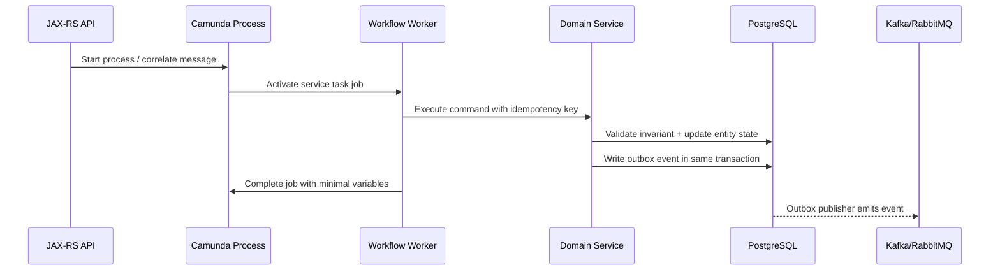
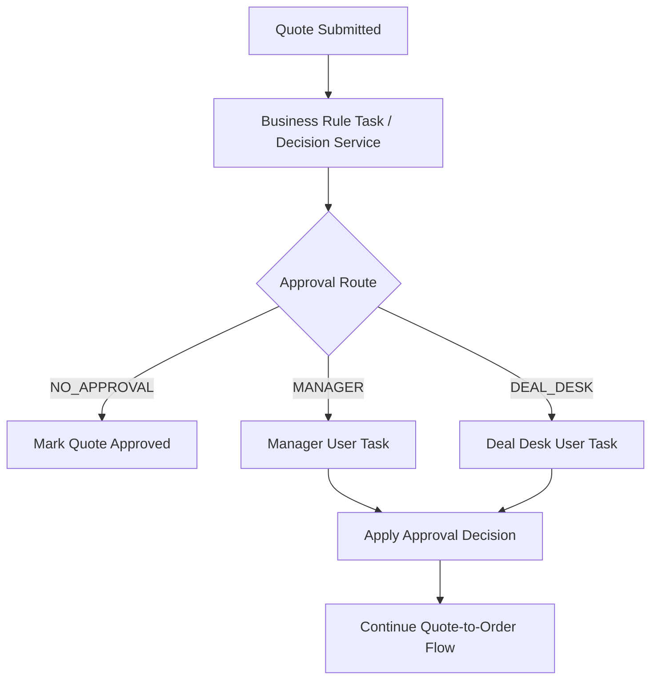

# Part 013 — Workflow, Rules, and State Boundary Placement

> Fokus part ini: mencegah BPMN, Camunda, rules, state machine, database state, dan service code saling mengambil tanggung jawab secara tidak jelas.

Dalam sistem enterprise, problem workflow jarang gagal karena engineer tidak tahu simbol BPMN. Problem workflow biasanya gagal karena **boundary tanggung jawab kabur**:

- approval rule disembunyikan di gateway expression;
- business invariant hanya dijaga oleh process model;
- process variable menjadi database kedua;
- entity status dan process status tidak sinkron;
- worker menjalankan state transition tanpa guard domain;
- event choreography dan workflow orchestration saling tumpang tindih;
- BPMN berubah menjadi “god process” yang memegang semua keputusan.

Camunda bukan pengganti domain model. BPMN bukan pengganti rules engine. Workflow engine bukan database bisnis. State machine bukan orchestration engine. Queue bukan process visibility layer.

Boundary yang sehat membuat workflow bisa dibaca, diuji, dioperasikan, dan diperbaiki saat production incident.

---

## 1. Core Mental Model

Gunakan pemisahan berikut:

```text
Domain model     = apa yang boleh benar secara bisnis
State machine    = lifecycle valid sebuah entity
Rules / DMN      = keputusan bisnis berdasarkan input
Workflow / BPMN  = orkestrasi langkah lintas waktu, actor, sistem, dan failure
Worker / delegate = eksekusi technical side effect
Database         = source of truth durable untuk entity bisnis
Queue/event bus  = transport asynchronous dan integration boundary
Cache/Redis      = acceleration / coordination helper, bukan source of truth utama
```

Workflow menjawab pertanyaan: **langkah apa berikutnya, siapa/apa yang harus melakukannya, kapan harus menunggu, bagaimana timeout/retry/escalation terjadi, dan bagaimana proses dilihat oleh operator.**

Domain model menjawab pertanyaan: **apakah transisi bisnis ini valid.**

Rules menjawab pertanyaan: **keputusan bisnis apa yang dihasilkan dari fakta tertentu.**

State machine menjawab pertanyaan: **status entity saat ini apa, dan transisi apa yang legal.**

Worker menjawab pertanyaan: **bagaimana side effect dieksekusi secara aman.**

---

## 2. Boundary Matrix

| Concern | Seharusnya tinggal di | Jangan dipindah ke | Kenapa |
|---|---|---|---|
| Quote/order invariant | Domain service + DB constraint bila relevan | BPMN gateway saja | Invariant harus tetap benar walau process dipanggil ulang, worker retry, atau API dipanggil langsung |
| Approval routing | DMN/rules service, atau domain policy | Hardcoded gateway expression yang panjang | Rule berubah lebih sering dari flow; perlu audit dan test terpisah |
| Long-running approval process | BPMN/workflow | Single status column + scheduler | Butuh visibility, task lifecycle, SLA, escalation, manual intervention |
| Entity lifecycle | State machine/domain layer | Process variable saja | Entity state harus queryable dan durable di sistem bisnis |
| Process progress | Camunda runtime/history | Business table sebagai pseudo-token | Engine sudah punya model execution; jangan duplikasi token movement |
| External API call | Worker/delegate | Gateway/script task yang menyimpan logic teknis | Butuh timeout, retry, idempotency, observability |
| Message transport | Kafka/RabbitMQ/API callback | BPMN sebagai broker | Workflow engine mengorkestrasi, bukan menggantikan broker |
| Cached task summary | Redis/read model | Camunda runtime sebagai high-QPS query backend | Runtime engine bukan read-optimized product API |
| Pricing calculation | Domain/rules/pricing service | BPMN diagram | Pricing butuh precision, versioning, testability, audit |
| Fallout/manual repair | Workflow + tasklist + runbook | Hidden retry loop | Failure harus punya owner, visibility, dan stop condition |

---

## 3. Workflow Responsibility

Workflow bertanggung jawab atas **process coordination**:

- start process berdasarkan command/event/API;
- menentukan langkah berikutnya secara eksplisit;
- menunggu human task, message, timer, atau external work;
- mengorkestrasi service task / worker;
- mencatat process progress;
- membuka jalur retry, escalation, compensation, manual intervention;
- menyediakan observability untuk process instance, task aging, failed job, incident, dan SLA breach;
- menjaga lifecycle long-running process agar tidak tersebar di banyak scheduler, cron, dan queue consumer.

Workflow cocok saat ada kombinasi:

- multi-step business process;
- human approval/manual intervention;
- long-running state;
- external callback/message correlation;
- SLA timer;
- retry dan incident ownership;
- business-level traceability;
- compensation atau recovery path.

Workflow tidak cocok untuk:

- validasi satu field;
- query sederhana;
- pure CRUD;
- synchronous stateless transformation;
- rule calculation yang lebih cocok di code/DMN/rules engine;
- high-frequency low-latency internal routing yang lebih cocok pakai code atau queue.

---

## 4. Rules Responsibility

Rules bertanggung jawab atas **decision logic**.

Contoh rules dalam CPQ/order management:

- quote butuh approval level apa;
- discount threshold masuk approval siapa;
- customer segment eligible untuk product/bundle apa;
- order harus melewati validation path apa;
- fallout category masuk queue/group mana;
- renewal/amendment perlu approval ulang atau tidak;
- SLA escalation severity berdasarkan customer tier.

Rules sebaiknya dipisahkan dari BPMN ketika:

- berubah sering;
- perlu dimiliki BA/product;
- perlu audit decision input/output;
- perlu test matrix;
- punya banyak kombinasi;
- digunakan oleh lebih dari satu process/API;
- perlu versioning independen dari flow.

Rules boleh sederhana di BPMN expression jika:

- hanya routing kecil;
- kondisi stabil;
- mudah dibaca;
- tidak menyimpan business policy besar;
- tidak perlu reuse besar.

### Smell: rule tersembunyi di gateway

```text
${customer.type == 'ENTERPRISE' && quote.discount > 17.5 && region == 'EU' && productFamily != 'Legacy' && ...}
```

Expression seperti ini terlihat praktis, tetapi buruk untuk maintainability. Ia sulit diuji, sulit diaudit, dan sering tidak terlihat oleh business owner.

Lebih sehat:

```text
Business Rule Task: Determine Approval Route
  input: quoteId, customerSegment, discount, productFamily, region
  output: approvalRoute, requiredApproverGroup, approvalReasonCode

Exclusive Gateway:
  if approvalRoute == "NO_APPROVAL" -> continue
  if approvalRoute == "MANAGER" -> manager approval task
  if approvalRoute == "DEAL_DESK" -> deal desk approval task
```

---

## 5. State Machine Responsibility

State machine bertanggung jawab atas **legal lifecycle** sebuah entity.

Contoh quote state:

```text
DRAFT -> CONFIGURED -> PRICED -> SUBMITTED -> APPROVED -> ACCEPTED -> ORDERED
                      -> REJECTED
                      -> EXPIRED
                      -> CANCELLED
```

Contoh order state:

```text
CAPTURED -> VALIDATED -> SUBMITTED -> IN_FULFILLMENT -> COMPLETED
                         -> FALLOUT
                         -> CANCELLED
```

State machine harus menjawab:

- status apa yang legal saat ini;
- command apa yang boleh dilakukan;
- siapa yang boleh melakukan command;
- invariant apa yang harus benar sebelum transisi;
- event apa yang diterbitkan setelah transisi;
- concurrency conflict bagaimana ditangani;
- optimistic lock/version column dipakai atau tidak;
- apakah transition idempotent.

Workflow boleh memerintahkan transition, tetapi domain layer tetap harus memvalidasi.

### Prinsip penting

> BPMN boleh berkata “complete approval step”, tetapi domain service harus tetap menolak `approveQuote()` jika quote sudah cancelled, expired, atau version-nya stale.

Ini penting karena workflow bukan satu-satunya entry point. API, admin tool, migration script, replay event, atau manual repair bisa menyentuh entity.

---

## 6. Domain Invariant Placement

Domain invariant adalah aturan yang tidak boleh dilanggar walau workflow salah.

Contoh invariant:

- quote tidak boleh di-approve jika mandatory product validation gagal;
- order tidak boleh masuk fulfillment jika payment/credit validation belum valid;
- cancellation tidak boleh dilakukan setelah completion final tertentu;
- fulfillment item tidak boleh diproses dua kali;
- customer tenant tidak boleh mengakses quote tenant lain;
- price effective date harus valid;
- state transition harus monoton sesuai lifecycle.

Tempatkan invariant di:

1. **Domain service** — guard utama.
2. **Database constraint** — guard struktural bila bisa diekspresikan.
3. **Worker idempotency table / unique constraint** — guard duplicate side effect.
4. **Workflow model** — flow guidance, bukan satu-satunya guard.

Jangan meletakkan invariant hanya di:

- BPMN gateway;
- process variable;
- UI validation;
- form field;
- Kafka consumer assumption;
- task assignment rule.

---

## 7. Process State vs Entity State vs Task State

Tiga jenis state ini sering tercampur.

### Entity state

Contoh:

- `quote.status = SUBMITTED`
- `order.status = IN_FULFILLMENT`

Entity state milik domain dan database bisnis.

### Process state

Contoh:

- process instance sedang menunggu approval;
- token berada di service task `Validate Order`;
- process instance punya incident di `Publish Fulfillment Command`.

Process state milik Camunda runtime/history.

### Task state

Contoh:

- user task belum claimed;
- task assigned ke `deal-desk`;
- task due date sudah lewat;
- task completed oleh user tertentu.

Task state milik task engine / tasklist / workflow runtime.

### Boundary sehat

```text
Entity state:       Quote.SUBMITTED
Process state:      Waiting at Deal Desk Approval User Task
Task state:         candidateGroup=deal-desk, assignee=null, dueDate=2026-07-15
```

Jangan membuat semua state menjadi satu field `status`.

---

## 8. Source of Truth Strategy

Pertanyaan wajib dalam design review:

> Untuk pertanyaan tertentu, source of truth-nya apa?

| Pertanyaan | Source of truth yang sehat |
|---|---|
| Apakah quote sudah approved? | Quote table / domain read model |
| Approval step sedang di mana? | Camunda process/task runtime/history |
| Siapa yang harus approve? | Task assignment + rule decision audit |
| Apakah order boleh masuk fulfillment? | Domain state + invariant validation |
| Kenapa workflow stuck? | Engine incident/job/task/process state + worker logs |
| Apakah event fulfillment sudah dikirim? | Outbox/published event audit |
| Apakah worker pernah memproses job ini? | Worker idempotency/processed-job table |

Jika satu pertanyaan punya dua source of truth yang dapat berbeda, Anda butuh reconciliation strategy.

---

## 9. Workflow + State Machine Integration Pattern

Pola aman:



Kunci pola ini:

- workflow mengorkestrasi;
- worker menerjemahkan process step menjadi domain command;
- domain service menjaga invariant;
- database menyimpan entity state;
- outbox menjaga event publish setelah state change;
- workflow variable hanya menyimpan context minimal;
- correlation ID dan business key menghubungkan semuanya.

---

## 10. Rules + Workflow Integration Pattern



Rules menghasilkan **decision output**, workflow menggunakan output itu untuk menentukan route.

Output rule harus eksplisit:

```json
{
  "approvalRequired": true,
  "approvalRoute": "DEAL_DESK",
  "requiredGroup": "deal-desk",
  "reasonCodes": ["DISCOUNT_THRESHOLD", "ENTERPRISE_ACCOUNT"],
  "decisionVersion": "approval-routing-v12"
}
```

Jangan hanya output boolean `true/false` jika operasional butuh alasan.

---

## 11. Process Model as Communication Contract

BPMN adalah kontrak komunikasi antara:

- product/BA: “ini alur bisnisnya”;
- backend engineer: “ini execution dan integration boundary-nya”;
- QA: “ini path yang harus dites”;
- SRE/platform: “ini titik failure dan observability-nya”;
- operator: “ini lokasi manual intervention dan SLA”;
- architect: “ini coupling antar service dan dependency eksternal”.

Karena itu BPMN harus menunjukkan:

- business step yang meaningful;
- wait state;
- human task;
- external dependency;
- timer/SLA;
- retry/incident path;
- compensation/recovery path;
- message correlation point.

BPMN tidak harus menunjukkan:

- setiap method call;
- setiap SQL query;
- setiap DTO mapping;
- internal validation detail;
- low-level loop yang lebih cocok di code.

---

## 12. Anti-Pattern: BPMN as God Object

Gejala:

- satu diagram memodelkan semua domain logic;
- gateway expression panjang;
- process variable sangat besar;
- service task terlalu granular seperti `LoadQuote`, `ValidateFieldA`, `ValidateFieldB`, `MapDTO`, `SaveEntity`;
- error handling technical bercampur dengan business escalation;
- semua service menjadi worker pasif tanpa domain ownership;
- perubahan kecil business rule selalu memerlukan process migration;
- debugging harus membuka BPMN untuk memahami logic yang seharusnya ada di domain service.

Akibat:

- sulit dites;
- sulit dimigrasikan;
- coupling tinggi;
- process instance lama mudah rusak saat model berubah;
- production incident sulit dianalisis;
- business dan engineering sama-sama kehilangan ownership.

Desain yang lebih baik:

- BPMN coarse-grained untuk process milestone;
- domain service memegang invariant;
- DMN/rules memegang decision matrix;
- worker memegang integration side effect;
- database memegang durable business state;
- observability menghubungkan semua dengan correlation ID.

---

## 13. Boundary with Kafka/RabbitMQ Choreography

Workflow orchestration dan event choreography bisa hidup bersama.

### Orchestration cocok untuk

- proses yang butuh central visibility;
- human task;
- SLA timer;
- manual intervention;
- deterministic compensation;
- operator harus tahu “instance ini sedang di mana”.

### Choreography cocok untuk

- fan-out event;
- loose coupling;
- downstream service bereaksi independen;
- event replay;
- domain event stream;
- read model update.

### Smell boundary buruk

- workflow menunggu event yang tidak punya correlation key stabil;
- Kafka event dianggap command tetapi tidak punya idempotency;
- process publish event tanpa outbox;
- service consumer mengubah entity state tanpa memberi tahu process;
- workflow dan choreographed service sama-sama memutuskan next step.

### Boundary sehat

```text
Workflow decides orchestration step.
Domain service applies state transition.
Outbox publishes domain event.
Other services react to domain event.
External replies are correlated back to workflow using explicit key.
```

---

## 14. Boundary with PostgreSQL/MyBatis/JDBC

Dalam aplikasi Java/JAX-RS, worker sering melakukan operasi database menggunakan MyBatis/JDBC.

Prinsip penting:

- process variable bukan pengganti table bisnis;
- domain table bukan pengganti token engine;
- worker DB transaction harus idempotent;
- gunakan optimistic locking untuk entity state transition;
- gunakan unique constraint untuk deduplication;
- gunakan outbox untuk event publish setelah commit;
- jangan complete job sebelum side effect durable;
- jangan menganggap complete job dan DB commit satu transaksi global jika engine remote.

### Failure mode klasik

| Failure | Dampak | Mitigasi |
|---|---|---|
| DB commit sukses, worker crash sebelum complete job | Job retry, side effect bisa dobel | Idempotency table + idempotent domain command |
| Complete job sukses, event publish gagal | Process lanjut tapi downstream tidak tahu | Outbox di transaksi domain, jangan publish langsung tanpa audit |
| Process variable update sukses, DB update gagal | Process state dan entity state beda | Worker hanya complete setelah DB command sukses |
| Gateway route berdasarkan variable stale | Salah route approval/fulfillment | Ambil decision dari domain/rules service saat boundary penting |
| Manual DB repair tanpa process repair | Process stuck atau entity sudah berubah | Repair runbook harus mencakup entity + process + outbox |

---

## 15. Boundary with Redis

Redis boleh membantu workflow, tetapi hati-hati.

Redis cocok untuk:

- cache read model;
- rate limiter;
- short-lived coordination;
- feature flag/kill switch;
- distributed lock dengan fencing bila benar-benar perlu;
- temporary idempotency marker untuk low-risk operation.

Redis tidak cocok sebagai satu-satunya source of truth untuk:

- process instance state;
- quote/order state;
- approval decision audit;
- completion proof;
- durable compensation status.

Jika Redis hilang, sistem harus bisa menjawab:

- apakah process masih benar;
- apakah entity state masih benar;
- apakah worker bisa retry aman;
- apakah cache bisa direbuild;
- apakah lock expiry bisa menyebabkan double execution.

---

## 16. Camunda 7 vs Camunda 8 Relevance

Boundary principle sama, tetapi execution model berbeda.

### Camunda 7

- Java delegate bisa berjalan dalam process engine transaction.
- Embedded engine dapat terasa seperti bagian dari aplikasi.
- Risiko: engineer menaruh terlalu banyak domain/service logic langsung dalam delegate.
- External task memberi boundary lebih jelas, tetapi tetap harus idempotent.
- Database engine Camunda 7 dapat menjadi bottleneck jika variable/history/job load besar.

### Camunda 8 / Zeebe

- Worker remote secara natural.
- Boundary dengan domain service lebih eksplisit.
- Tidak ada asumsi Java delegate in-process seperti Camunda 7.
- Job completion dan business DB transaction adalah dua hal terpisah.
- Idempotency dan correlation design menjadi lebih penting.

Kesimpulan: Camunda 8 lebih memaksa distributed-systems discipline; Camunda 7 lebih mudah membuat coupling karena bisa embedded/in-process.

---

## 17. Review Heuristic: Apa yang Harus Ditanyakan Senior Engineer?

Saat melihat PR/ADR/BPMN model, tanyakan:

1. Apa source of truth untuk entity state?
2. Apa source of truth untuk process state?
3. Rule apa yang ada di BPMN expression?
4. Apakah rule itu harus menjadi DMN/rules service?
5. Invariant apa yang tetap dijaga domain service?
6. Apakah worker idempotent jika job diulang?
7. Apakah process variable terlalu besar atau sensitif?
8. Apakah process state dan entity state bisa divergen?
9. Apa reconciliation strategy?
10. Apa yang terjadi jika worker crash setelah DB commit?
11. Apa yang terjadi jika message datang dua kali?
12. Apa yang terjadi jika process migration mengubah gateway/rules?
13. Apakah manual repair membutuhkan perubahan Camunda dan DB sekaligus?
14. Apakah task assignment rule bisa diaudit?
15. Apakah observability cukup untuk menjawab “kenapa order ini stuck?”

---

## 18. Practical Boundary Decision Table

| Situasi | Pilihan yang biasanya benar |
|---|---|
| Flow approval multi-step dengan human task dan SLA | BPMN workflow |
| Approval routing berdasarkan banyak threshold | DMN/rules service + BPMN gateway sederhana |
| Quote status lifecycle | Domain state machine + DB |
| Order fulfillment lintas banyak service | Workflow orchestration atau saga, tergantung visibility dan coupling |
| Event fan-out ke downstream read models | Kafka/RabbitMQ choreography |
| Retry external API call | Worker retry + engine retry + idempotency, dengan stop condition |
| Manual fallout queue | User task/case-management style process + clear ownership |
| High-QPS status endpoint | Business read model/cache, bukan query runtime engine langsung |
| Complex price calculation | Pricing service/rules, bukan BPMN gateway |
| Duplicate request prevention | API idempotency + DB/Redis strategy sesuai criticality |

---

## 19. Internal Verification Checklist

Gunakan checklist ini di codebase, repository BPMN/DMN, dan diskusi team.

### Workflow usage

- Apakah CSG Quote & Order memakai Camunda, custom workflow, state machine, scheduler, Kafka/RabbitMQ choreography, atau kombinasi?
- Proses apa yang benar-benar long-running?
- Proses apa yang punya human task, SLA, manual intervention, retry, incident, dan compensation?
- Apakah ada BPMN/DMN artifact yang menjadi source of truth flow?

### Boundary ownership

- Siapa owner BPMN model?
- Siapa owner domain state machine?
- Siapa owner rules/DMN?
- Siapa owner worker/delegate?
- Siapa owner incident dan manual repair?

### Domain and state

- Di mana quote/order state disimpan?
- Apakah ada state transition guard di domain service?
- Apakah DB memakai optimistic locking/version column?
- Apakah process variable menduplikasi entity state?
- Apakah process state dan entity state punya reconciliation mechanism?

### Rules

- Apakah approval/pricing/eligibility rule ada di DMN, code, config, database, atau gateway expression?
- Apakah rule punya versioning?
- Apakah decision input/output diaudit?
- Apakah rule test matrix ada?

### Worker and side effect

- Apakah worker idempotent?
- Apakah ada processed job/inbox/outbox table?
- Apakah external API memakai idempotency key?
- Apakah worker complete job setelah side effect durable?
- Apakah failure setelah DB commit aman terhadap retry?

### Integration

- Apakah Kafka/RabbitMQ event punya correlation ID, causation ID, business key, tenant ID?
- Apakah process publish event via outbox?
- Apakah message correlation tahan duplicate/late/out-of-order event?
- Apakah Redis dipakai sebagai helper atau source of truth?

### Observability and operations

- Bisa kah operator menjawab: “quote/order ini sedang stuck di mana?”
- Ada dashboard process instance, failed job/incident, task aging, SLA breach?
- Ada runbook untuk process state dan entity state mismatch?
- Ada manual repair approval path?

---

## 20. PR Review Checklist

Sebelum approve perubahan workflow/rules/state:

- [ ] BPMN hanya mengorkestrasi, tidak mengambil seluruh domain logic.
- [ ] Domain invariant tetap dijaga domain service/database.
- [ ] Rule kompleks dipisahkan ke DMN/rules/domain policy.
- [ ] Entity state, process state, task state punya boundary jelas.
- [ ] Process variable tidak menjadi database kedua.
- [ ] Worker command idempotent.
- [ ] Retry tidak menggandakan side effect.
- [ ] Kafka/RabbitMQ integration punya correlation dan dedup strategy.
- [ ] PostgreSQL transaction boundary jelas.
- [ ] Redis tidak menjadi source of truth kritikal tanpa durability plan.
- [ ] Manual repair dan reconciliation dipikirkan.
- [ ] Observability bisa menjawab business dan technical failure.
- [ ] Security/tenant/data sensitivity dicek di variable, task, logs, event.
- [ ] Migration/versioning impact dipahami.

---

## 21. Key Takeaways

- Workflow adalah orchestration layer, bukan domain model.
- BPMN harus readable sebagai process contract, bukan tempat menaruh semua logic.
- Rules harus bisa diuji, diaudit, dan di-version secara tepat.
- State machine menjaga legal lifecycle entity.
- Domain invariant tidak boleh hanya bergantung pada process path.
- Worker harus aman terhadap retry, duplicate, timeout, dan crash.
- Database bisnis tetap source of truth untuk entity state.
- Camunda runtime/history adalah source of truth untuk process/task execution state.
- Boundary yang jelas mengurangi production incident dan mempercepat debugging.

---

## References

- Camunda 7 Architecture Overview: https://docs.camunda.org/manual/7.21/introduction/architecture/
- Camunda 7 Process Engine API Javadocs: https://docs.camunda.org/javadoc/camunda-bpm-platform/7.21/org/camunda/bpm/engine/package-summary.html
- Camunda 7 Database Schema: https://docs.camunda.org/manual/7.21/user-guide/process-engine/database/database-schema/
