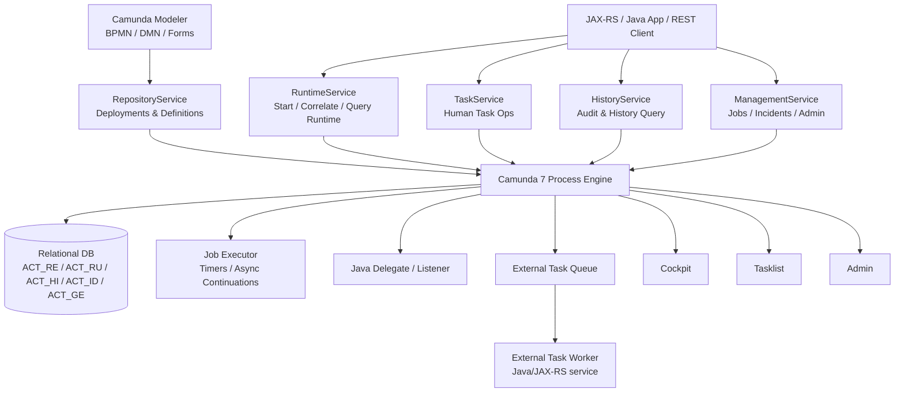

# Part 014 — Camunda 7 Architecture Deep Dive

> Fokus part ini: memahami Camunda 7 sebagai **Java-based, database-backed BPMN process engine** yang bisa embedded/shared/standalone, bukan sebagai sekadar “tool gambar BPMN”.

Camunda 7 penting dipahami secara arsitektural karena modelnya sangat berbeda dari Camunda 8/Zeebe. Camunda 7 hidup dekat dengan JVM application architecture. Ia dapat embedded di aplikasi Java, berjalan sebagai shared engine di application server, atau diakses via REST sebagai remote engine. Ia menyimpan runtime state ke relational database dan menjalankan async work melalui job executor.

Dalam konteks enterprise Java/JAX-RS, pemahaman ini menentukan:

- transaction boundary;
- classloading delegate;
- deployment model;
- database pressure;
- retry/incident lifecycle;
- history retention;
- operational debugging;
- scaling pattern;
- migration risk menuju Camunda 8.

---

## 1. Big Picture: Apa Itu Camunda 7?

Camunda 7 adalah process engine berbasis Java untuk mengeksekusi BPMN/DMN/CMMN model. Untuk seri ini, fokus kita adalah BPMN dan DMN.

Mental model:

```text
BPMN/DMN files
   -> deployment repository
   -> process definition / decision definition
   -> process instance runtime
   -> execution/token/task/job/variable state
   -> async job executor / external task worker / Java delegate
   -> history and operational tooling
```

Camunda 7 bukan broker event. Bukan database bisnis. Bukan replacement untuk domain service. Ia adalah engine yang mengelola lifecycle process instance.

---

## 2. High-Level Architecture



Arsitektur ini punya implikasi besar: process execution, public API, command context, persistence, job acquisition, delegate execution, dan history semuanya berhubungan erat dengan database dan transaction model.

---

## 3. Deployment Modes

Camunda 7 dapat dipakai dalam beberapa mode.

### 3.1 Embedded Engine

Process engine berada di dalam aplikasi Java.

```text
JAX-RS application JVM
  ├─ REST resources
  ├─ domain services
  ├─ MyBatis/JDBC
  ├─ Camunda process engine
  ├─ Java delegates/listeners
  └─ job executor, jika aktif
```

Kelebihan:

- integrasi Java mudah;
- delegate bisa memanggil service internal langsung;
- deployment sederhana untuk aplikasi kecil/menengah;
- transaction integration bisa dekat dengan aplikasi.

Risiko:

- process engine lifecycle mengikuti aplikasi;
- job executor bisa aktif di banyak replica;
- classloading dan deployment coupling tinggi;
- BPMN change bisa ikut release aplikasi;
- sulit memisahkan engine operation dari service operation;
- scale process engine dan business API tidak bisa dipisah mudah.

### 3.2 Shared Engine

Engine dikontrol oleh runtime container seperti Tomcat/application server. Aplikasi process menggunakan engine yang sama.

Kelebihan:

- engine lifecycle bisa dipisah dari app;
- beberapa application bisa memakai engine yang sama;
- deployment process application bisa lebih modular.

Risiko:

- classloading lebih kompleks;
- dependency version harus hati-hati;
- shared resource contention;
- operational ownership harus jelas;
- kesalahan satu process application dapat memengaruhi engine bersama.

### 3.3 Standalone / Remote Engine via REST

Aplikasi mengakses Camunda 7 lewat REST API.

Kelebihan:

- boundary lebih jelas;
- engine bisa dioperasikan terpisah;
- non-Java client bisa integrasi;
- service tidak harus embed engine.

Risiko:

- REST latency;
- transaction tidak shared dengan business DB;
- idempotency dan retry lebih penting;
- API compatibility dan auth harus dikelola;
- operational debugging perlu korelasi antar service/engine.

---

## 4. Process Engine Core Components

### 4.1 Public Services API

Camunda 7 mengekspos API service-oriented. Service yang umum:

| Service | Tanggung jawab |
|---|---|
| `RepositoryService` | Deployment, process definition, decision definition |
| `RuntimeService` | Start/query process instance, correlate message, variable runtime |
| `TaskService` | Human task: claim, assign, complete, query |
| `HistoryService` | Query historical process/task/activity/variable/decision data |
| `ManagementService` | Job, incident, deployment, metrics, admin/maintenance operations |
| `ExternalTaskService` | Fetch/lock/complete/fail external task |
| `IdentityService` | User/group identity jika digunakan |
| `AuthorizationService` | Authorization model jika enabled |
| `DecisionService` | Evaluate DMN decision |
| `FormService` | Start/task form data untuk model form tertentu |

Dalam aplikasi JAX-RS, resource method biasanya tidak langsung memanipulasi table `ACT_*`; ia memanggil service API atau REST API.

### 4.2 BPMN Core Engine

BPMN engine bertugas:

- parse BPMN XML;
- membangun internal process definition;
- menjalankan token/execution semantics;
- mengeksekusi gateway, event, task, subprocess;
- membuat job untuk async/timer;
- membuat event subscription untuk message/signal;
- membuat user task;
- mengelola incident saat job gagal.

### 4.3 Command Context

Mayoritas operasi engine berjalan melalui command-style execution.

Mental model:

```text
API call enters engine
  -> command interceptor chain
  -> command context created
  -> transaction resources attached
  -> engine reads/writes runtime state
  -> flush DB operations
  -> commit/rollback
```

Kenapa ini penting?

Karena delegate, listener, job executor, API call, dan task completion bisa berjalan dalam transaction boundary tertentu. Jika exception terjadi, state engine dan side effect bisa rollback atau tidak, tergantung letak boundary.

---

## 5. Process Application

Process application adalah packaging/deployment concept yang menghubungkan process definition dengan application code/resource.

Dalam Camunda 7 Java application, process application dapat menyediakan:

- BPMN/DMN/forms artifact;
- Java delegate classes;
- listener classes;
- expression-resolved beans;
- deployment descriptor `processes.xml`;
- process archive;
- classloader context.

Operational concern:

- apakah BPMN di-deploy saat startup;
- apakah deployment duplicate terjadi di setiap pod;
- apakah process application redeploy mengubah definition version;
- apakah old process instance masih butuh class lama;
- apakah job executor node bisa memuat delegate class yang benar.

---

## 6. Repository Layer

Repository layer menyimpan deployed artifact:

- process definition;
- decision definition;
- case definition jika digunakan;
- deployment metadata;
- BPMN XML resource;
- diagram/resource terkait.

Pertanyaan review:

- Apakah deployment process dilakukan oleh aplikasi, pipeline, atau manual upload?
- Apakah setiap release membuat version baru?
- Apakah process key stabil?
- Apakah version tag digunakan?
- Apakah rollback process definition dipahami?
- Apakah running instances tetap berjalan pada old version?

---

## 7. Runtime Layer

Runtime layer menyimpan process instance aktif.

Konsep utama:

- process instance;
- execution tree;
- current activity;
- variable;
- event subscription;
- job;
- incident;
- active user task.

Di database, runtime state berada di table `ACT_RU_*`.

Prinsip:

- runtime table harus relatif kecil;
- data runtime hilang dari runtime table saat process selesai;
- audit pindah ke history table sesuai history level;
- query runtime untuk product API high-QPS biasanya bukan ide baik;
- gunakan read model jika user-facing status butuh scale tinggi.

---

## 8. Task Layer

User task di Camunda 7 dikelola oleh `TaskService` dan dapat terlihat di Tasklist.

Task data umumnya mencakup:

- task id;
- process instance id;
- execution id;
- assignee;
- candidate group/user;
- create time;
- due date;
- follow-up date;
- task local variable;
- form key/data;
- delegation/claim state.

Failure mode:

- task tidak muncul karena candidate group salah;
- task completed dua kali oleh user/API berbeda;
- task visible lintas tenant karena authorization salah;
- task aging tidak ter-alert;
- task form menyimpan PII tanpa retention/logging policy;
- domain state sudah berubah tetapi task masih aktif.

---

## 9. History Layer

History layer menyimpan data historis berdasarkan `historyLevel`.

History penting untuk:

- audit;
- debugging;
- SLA analysis;
- process mining;
- compliance evidence;
- root cause incident;
- user operation log.

Tetapi history juga menyebabkan:

- table growth;
- storage cost;
- slow query;
- sensitive data retention risk;
- cleanup complexity;
- migration/upgrade concern.

Review `historyLevel`:

| Level | Implikasi umum |
|---|---|
| none/low | Observability dan audit terbatas |
| activity | Activity history tersedia, variable detail mungkin terbatas |
| audit/full | Debugging dan audit lebih kaya, DB load dan retention risk lebih besar |

Nama level dan capability spesifik perlu diverifikasi pada versi Camunda 7 yang digunakan.

---

## 10. Job Executor

Job executor adalah komponen yang mengambil dan menjalankan job asynchronous.

Job dibuat oleh:

- timer event;
- async before;
- async after;
- failed retry;
- beberapa operation internal;
- batch operation.

Lifecycle job:

```text
Job created
  -> job due date reached
  -> job executor acquisition
  -> job locked by executor
  -> command execution
  -> success: job removed / process continues
  -> failure: retries decremented / due date recalculated
  -> retries exhausted: incident created
```

### Kenapa async boundary penting?

Tanpa async boundary, beberapa step bisa berjalan dalam satu transaction. Jika step terakhir gagal, step sebelumnya bisa ikut rollback.

Dengan async boundary, engine menyimpan state sebelum/atau sesudah activity tertentu dan melanjutkan via job executor.

Contoh:

```text
Start -> Validate Quote -> asyncBefore Publish Event -> End
```

Jika `Publish Event` gagal, process bisa berhenti di failed job/incident tanpa mengulang `Validate Quote`, tergantung boundary dan side effect design.

### Failure mode job executor

- job executor tidak aktif;
- job acquisition lambat;
- thread pool habis;
- DB lock contention;
- deployment-aware config salah;
- delegate class tidak ditemukan;
- retry storm;
- timer backlog;
- incident tidak dimonitor;
- multiple pods mengambil job dengan topology yang tidak diharapkan.

---

## 11. Java Delegate and Listener Execution

Camunda 7 mendukung eksekusi custom Java code melalui:

- `JavaDelegate`;
- `ExecutionListener`;
- `TaskListener`;
- expression/bean method;
- script task;
- connector.

Arsitektur ini kuat, tetapi berbahaya jika tidak disiplin.

### Risiko delegate

- side effect terjadi dalam transaction yang tidak dipahami;
- external API call dilakukan sinkron tanpa timeout;
- exception technical dianggap business error;
- retry menggandakan side effect;
- delegate terlalu besar dan mengambil domain logic;
- delegate bergantung classloader/dependency versi tertentu;
- unit test tidak memadai;
- log tidak memiliki process instance id/correlation id.

### Prinsip delegate sehat

- delegate tipis;
- panggil domain/application service yang testable;
- gunakan timeout untuk external call;
- bedakan technical exception dan BPMN business error;
- pastikan idempotency;
- jangan simpan payload besar sebagai variable;
- log process instance id, business key, tenant id, activity id.

---

## 12. External Task Service

External task pattern memindahkan work execution keluar dari engine JVM.

Camunda engine membuat external task dengan topic tertentu. Worker melakukan:

```text
fetchAndLock(topic)
  -> execute work
  -> complete / handleFailure / handleBpmnError
```

Kelebihan:

- worker bisa di-scale terpisah;
- language-agnostic;
- boundary service lebih jelas;
- engine tidak menjalankan external API call langsung;
- deployment worker tidak harus sama dengan engine.

Risiko:

- lock duration salah;
- worker crash setelah side effect;
- duplicate execution saat lock expired;
- retry policy tidak jelas;
- topic naming tidak terkontrol;
- worker tidak graceful shutdown;
- no backoff/long polling tuning;
- incident tidak dimonitor.

---

## 13. Database Architecture

Camunda 7 menggunakan relational database untuk runtime dan history.

Table prefix utama:

| Prefix | Meaning | Isi umum |
|---|---|---|
| `ACT_RE_*` | Repository | Deployment, process definition, decision definition, resources |
| `ACT_RU_*` | Runtime | Execution, task, variable, job, incident, event subscription |
| `ACT_HI_*` | History | Historic process/task/activity/variable/decision data |
| `ACT_ID_*` | Identity | User/group/identity data jika digunakan |
| `ACT_GE_*` | General | Byte arrays, properties, schema log, general data |

### Database performance concern

- runtime table harus tetap kecil;
- history cleanup wajib untuk high-volume process;
- variable serialization dapat membengkakkan byte array table;
- query Cockpit/Tasklist dapat menjadi berat;
- job acquisition sensitif terhadap DB latency/lock;
- process engine schema bukan public API untuk aplikasi bisnis;
- upgrade schema harus dikelola sesuai versi engine.

### PostgreSQL-specific awareness

Jika Camunda 7 memakai PostgreSQL:

- monitor connection pool;
- monitor locks dan deadlocks;
- cek slow query pada `ACT_RU_JOB`, `ACT_RU_EXECUTION`, `ACT_RU_VARIABLE`, `ACT_HI_*`;
- pastikan vacuum/autovacuum sehat;
- pastikan history cleanup tidak mengganggu peak traffic;
- jangan join langsung table Camunda untuk product API tanpa konsekuensi version/compatibility.

---

## 14. Deployment Cache

Camunda 7 memiliki deployment cache untuk process definition dan metadata.

Manfaat:

- mengurangi DB read untuk definition;
- mempercepat execution;
- menyimpan parsed BPMN model.

Risiko:

- memory pressure jika banyak definition/version;
- cache stale perception saat deployment/rollback;
- cluster node tidak punya resource/delegate sama;
- process definition lama masih dibutuhkan running instances.

Review:

- berapa banyak process definition version aktif;
- apakah old versions dibersihkan sesuai policy;
- apakah process application deployment konsisten di semua node;
- apakah job executor deployment-aware jika topology membutuhkan.

---

## 15. Cockpit, Tasklist, Admin, Optimize

### Cockpit

Dipakai untuk:

- melihat process definition;
- melihat process instance;
- melihat failed jobs;
- incident triage;
- process modification/restart/migration;
- operational inspection.

Risiko:

- akses terlalu luas;
- operator melakukan modification tanpa runbook;
- data variable sensitif terlihat;
- Cockpit dianggap monitoring lengkap padahal alerting belum ada.

### Tasklist

Dipakai untuk:

- user task inbox;
- claim/complete task;
- form interaction;
- candidate group filtering.

Risiko:

- authorization salah;
- task stale;
- task aging tidak termonitor;
- form validation tidak sinkron dengan domain invariant.

### Admin

Dipakai untuk user/group/authorization/tenant/system management jika fitur ini digunakan.

### Optimize

Jika digunakan, Optimize membantu analytics/process intelligence, tetapi perlu verifikasi internal karena tidak semua deployment memakai Optimize.

---

## 16. Transaction Boundary in Camunda 7

Camunda 7 sangat sensitif terhadap transaction boundary.

Contoh synchronous path:

```text
JAX-RS call
  -> runtimeService.startProcessInstanceByKey()
  -> start event
  -> service task JavaDelegate
  -> user task created
  -> DB commit
```

Jika JavaDelegate melempar exception sebelum commit, process start bisa rollback.

Contoh async path:

```text
JAX-RS call
  -> runtimeService.startProcessInstanceByKey()
  -> reaches asyncBefore service task
  -> job created
  -> DB commit
  -> job executor later executes delegate
```

Async boundary membuat failure lebih observable sebagai failed job/incident, tetapi membutuhkan retry/idempotency design.

### Rule of thumb

- Gunakan async boundary sebelum external side effect yang riskan.
- Gunakan domain idempotency untuk semua side effect yang bisa retry.
- Jangan asumsikan Camunda transaction dan business DB transaction selalu sama, terutama jika engine remote/external task.
- Jangan complete process/job sebelum side effect durable.

---

## 17. Cluster and Scaling Model

Camunda 7 scaling bergantung pada deployment mode.

### Embedded multi-pod

Jika banyak pod menjalankan engine dan job executor:

- semua pod berbagi Camunda DB;
- job acquisition bisa dilakukan banyak node;
- delegate class harus tersedia di node yang mengeksekusi job;
- deployment-aware setting mungkin diperlukan;
- rolling deployment bisa membuat old/new code coexist;
- process instance lama mungkin memerlukan code lama.

### Remote/shared engine

Jika engine cluster dipisah:

- API service memanggil engine via REST/Java remote integration;
- engine scale dan app scale lebih terpisah;
- worker/external task scale terpisah;
- transaction boundary lebih distributed.

### Scaling concern

- DB is central bottleneck;
- job executor concurrency harus sesuai DB capacity;
- history level memengaruhi write amplification;
- Cockpit/Tasklist query load bisa memengaruhi DB;
- process variable besar memperlambat execution.

---

## 18. Camunda 7 in Java/JAX-RS Systems

Pola integrasi umum:

### Start process from API

```text
POST /quotes/{quoteId}/submit
  -> validate command
  -> update quote state to SUBMITTED
  -> start process with businessKey=quoteId
  -> return 202 Accepted / current status
```

Perlu diputuskan:

- start process sebelum atau sesudah DB commit?
- apakah start process idempotent?
- apakah quote status dan process instance bisa divergen?
- apakah business key unique?
- apakah process start menghasilkan duplicate instance saat retry API?

### Complete task from API

```text
POST /tasks/{taskId}/complete
  -> authorize user
  -> validate form/decision
  -> call TaskService.complete()
  -> worker/domain service applies state transition later or within same command
```

Perlu diputuskan:

- apakah task completion langsung mengubah domain state?
- apakah stale task dicegah?
- apakah user masih authorized saat complete?
- apakah optimistic lock domain entity dicek?

### External task worker as service

```text
Worker fetches topic "validate-order"
  -> loads order from PostgreSQL
  -> validates domain invariants
  -> writes result/audit
  -> completes external task
```

Perlu idempotency dan failure handling.

---

## 19. Failure Modes by Component

| Component | Failure mode | Detection | Mitigation |
|---|---|---|---|
| Repository | wrong process version deployed | process definition version mismatch | deployment approval, version tag, tests |
| Runtime | process stuck at activity | Cockpit/current activity | incident runbook, message/timer check |
| Job executor | job not acquired | job backlog, acquisition logs | executor config, DB health, thread pool |
| Delegate | exception/retry storm | failed job, logs | idempotency, timeout, classify errors |
| External task | lock expired duplicate work | duplicate side effect, worker logs | lock duration, extend lock, idempotency |
| DB | slow query/lock/deadlock | DB metrics, slow query logs | indexes, tuning, cleanup, pool sizing |
| History | table bloat | storage growth, slow Cockpit | history TTL, cleanup, archive |
| Tasklist | task not visible | task query, auth logs | candidate group/tenant/auth review |
| Cockpit | operator unsafe repair | audit/user operation log | runbook, RBAC, approval workflow |

---

## 20. Observability Requirements

Minimal production signals:

- process instances started/completed/failed per process key;
- active process count;
- incident count by process/activity;
- failed jobs by exception type;
- job acquisition latency;
- job execution duration;
- timer backlog;
- external task backlog by topic;
- worker success/failure rate;
- task aging by candidate group;
- database connection pool saturation;
- Camunda table growth;
- history cleanup duration;
- business key/correlation ID in logs.

Debugging harus bisa menjawab:

```text
Untuk quote/order X:
  - process instance id/key apa?
  - definition version apa?
  - current activity apa?
  - waiting task/job/message/timer apa?
  - variable penting apa?
  - incident/failure terakhir apa?
  - worker log trace id apa?
  - domain entity state apa?
  - event/outbox status apa?
```

---

## 21. Security and Privacy Concerns

Camunda 7 architecture dapat mengekspos data melalui:

- process variable;
- serialized object/JSON variable;
- task form;
- history table;
- Cockpit variable view;
- incident stacktrace/message;
- job exception log;
- user operation log;
- Tasklist filters;
- REST API.

Review:

- apakah PII masuk variable/history;
- apakah variable redaction strategy ada;
- apakah authorization enabled dan benar;
- apakah Tasklist/Cockpit access dibatasi;
- apakah service account untuk worker aman;
- apakah logs mengandung sensitive payload;
- apakah history cleanup memenuhi retention/privacy policy.

---

## 22. Camunda 7 Architecture Review Checklist

### Version and support

- [ ] Versi Camunda 7 yang digunakan diketahui.
- [ ] Support/EOL timeline diverifikasi dengan vendor/internal platform.
- [ ] Migration awareness ke Camunda 8 sudah masuk roadmap jika relevan.

### Deployment model

- [ ] Embedded/shared/remote engine jelas.
- [ ] Engine lifecycle owner jelas.
- [ ] BPMN/DMN deployment pipeline jelas.
- [ ] Duplicate deployment saat pod startup dicegah.
- [ ] Running old instances dengan old code dipertimbangkan.

### Engine configuration

- [ ] Process engine config terdokumentasi.
- [ ] Job executor aktif/tidak aktif jelas per node.
- [ ] History level dan cleanup dikonfigurasi.
- [ ] Metrics/reporting config diketahui.
- [ ] Authorization/identity/tenant config diketahui.

### Database

- [ ] DB vendor dan version diverifikasi.
- [ ] Camunda schema ownership jelas.
- [ ] Connection pool sizing dicek.
- [ ] Slow query dan lock monitoring ada.
- [ ] History cleanup/retention ada.
- [ ] Direct query ke `ACT_*` oleh aplikasi bisnis dicek dan dibatasi.

### Process application

- [ ] `processes.xml` / deployment descriptor dicek jika digunakan.
- [ ] Classloading delegate/listener dipahami.
- [ ] Deployment-aware job executor dipertimbangkan.
- [ ] BPMN resource packaging jelas.
- [ ] Old process definition compatibility dicek.

### Java delegate / external task

- [ ] Delegate tipis dan testable.
- [ ] External task topic naming jelas.
- [ ] Retry policy eksplisit.
- [ ] Idempotency diterapkan.
- [ ] Timeout dan exception classification jelas.

### Operations

- [ ] Cockpit access dan runbook ada.
- [ ] Tasklist usage dan authorization dicek.
- [ ] Incident dashboard ada.
- [ ] Failed job retry procedure aman.
- [ ] Manual repair approval path ada.

---

## 23. Internal Verification Checklist for CSG/Team

Karena detail internal tidak tersedia, semua item berikut harus diverifikasi di codebase, deployment repo, atau diskusi dengan team:

### Codebase

- Cari dependency `org.camunda.bpm`, `camunda-engine`, `camunda-bpm-spring-boot-starter`, external task client, atau REST client.
- Cari file `.bpmn`, `.dmn`, `.form`, `processes.xml`, `bpm-platform.xml`.
- Cari class `JavaDelegate`, `ExecutionListener`, `TaskListener`.
- Cari penggunaan `RuntimeService`, `RepositoryService`, `TaskService`, `HistoryService`, `ManagementService`, `ExternalTaskService`.
- Cari worker external task dengan `fetchAndLock`, topic, lock duration, `handleFailure`, `handleBpmnError`.

### Runtime/deployment

- Verifikasi apakah engine embedded di service Java/JAX-RS, shared di container, atau remote.
- Verifikasi apakah job executor aktif di semua replica atau node tertentu.
- Verifikasi deployment BPMN/DMN: startup, pipeline, manual, GitOps.
- Verifikasi DB schema Camunda dan DB owner.
- Verifikasi Cockpit/Tasklist/Admin/Optimize usage.

### Operations

- Verifikasi dashboard incident/failed job/task aging.
- Verifikasi runbook retry/manual repair/process migration.
- Verifikasi history cleanup dan retention.
- Verifikasi alert untuk job backlog dan DB health.
- Verifikasi audit trail untuk operation di Cockpit/Tasklist.

### Architecture

- Verifikasi boundary antara Camunda process state dan quote/order domain state.
- Verifikasi apakah process variable menyimpan payload besar atau PII.
- Verifikasi apakah domain state transition tetap dijaga domain service.
- Verifikasi integration dengan PostgreSQL/MyBatis, Kafka, RabbitMQ, Redis.
- Verifikasi migration roadmap jika ada Camunda 7 dependency jangka panjang.

---

## 24. Key Takeaways

- Camunda 7 adalah Java-based, database-backed process engine.
- Ia bisa embedded, shared, atau remote; setiap mode punya trade-off.
- Public service API adalah cara normal aplikasi berinteraksi dengan engine.
- Runtime state, job, task, variable, incident, dan history sangat bergantung pada relational database.
- Job executor adalah komponen sentral untuk timer dan async continuation.
- Java delegate powerful tetapi mudah menciptakan coupling dan side effect risk.
- External task memberi boundary lebih baik tetapi membutuhkan idempotency discipline.
- Cockpit/Tasklist membantu operasi, tetapi bukan pengganti alerting/runbook.
- Untuk senior engineer, memahami Camunda 7 berarti memahami transaction, DB, job execution, deployment, classloading, observability, dan operational repair.

---

## References

- Camunda 7 Architecture Overview: https://docs.camunda.org/manual/7.21/introduction/architecture/
- Camunda 7 Process Engine API Javadocs: https://docs.camunda.org/javadoc/camunda-bpm-platform/7.21/org/camunda/bpm/engine/package-summary.html
- Camunda 7 Database Schema: https://docs.camunda.org/manual/7.21/user-guide/process-engine/database/database-schema/
- Camunda 7 Job Executor: https://docs.camunda.org/manual/7.21/user-guide/process-engine/the-job-executor/
- Camunda 7 Shared Process Engine guide: https://docs.camunda.org/get-started/archive/spring/shared-process-engine/
