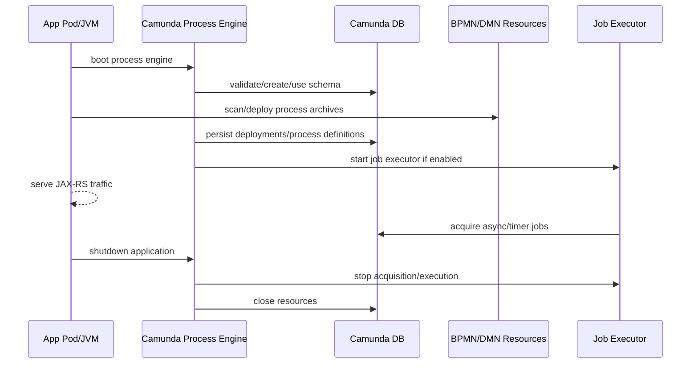
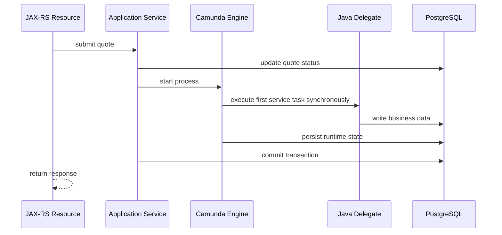

# Part 015 — Camunda 7 Embedded Engine in Java/JAX-RS Applications

> Fokus part ini: memahami apa artinya menjalankan Camunda 7 **di dalam** aplikasi Java/JAX-RS, bukan hanya mengakses workflow engine dari luar.

Camunda 7 bisa sangat dekat dengan aplikasi Java. Ini adalah kekuatan sekaligus risiko. Jika process engine embedded di service backend, BPMN deployment, Java delegate, job executor, transaction, classloader, database connection, dan application lifecycle menjadi satu kesatuan operasional.

Untuk senior backend engineer, pertanyaan pentingnya bukan hanya:

```text
Bagaimana start process dari Java?
```

Pertanyaan yang lebih penting:

```text
Jika pod restart di tengah delegate?
Jika dua replica menjalankan job executor?
Jika BPMN baru deploy tapi running instance masih pakai class lama?
Jika DB commit berhasil tapi external side effect gagal?
Jika class delegate hilang setelah rolling deployment?
Siapa yang mengoperasikan engine saat engine ikut service lifecycle?
```

Camunda 7 embedded engine membuat workflow terasa seperti bagian natural dari aplikasi Java. Tetapi karena proses bisnis sering long-running, keputusan embedding harus dilihat sebagai keputusan arsitektur production, bukan convenience teknis.

---

## 1. Core Mental Model

Dalam Camunda 7 embedded mode, process engine berjalan di JVM aplikasi.

```text
Java/JAX-RS service
  ├─ REST resources
  ├─ application services
  ├─ domain services
  ├─ MyBatis/JDBC repositories
  ├─ Camunda process engine
  ├─ BPMN/DMN deployment resources
  ├─ Java delegates / listeners
  ├─ job executor, jika aktif
  └─ shared datasource / transaction integration
```

Ini berbeda dari Camunda 8/Zeebe:

```text
Camunda 8 / Zeebe
  process engine remote
  workers external
  application talks through client/API
```

Camunda 7 embedded:

```text
process engine local to app JVM
Java delegate can call app code directly
engine persists runtime state to relational DB
async work may run inside same app cluster
```

Konsekuensinya:

- process execution bisa ikut transaction aplikasi;
- delegate bisa langsung memanggil service/repository internal;
- deployment BPMN bisa ikut artifact aplikasi;
- crash aplikasi berarti engine lokal juga mati;
- scaling app berarti scaling potential job executor;
- classloading menjadi bagian dari runtime correctness.

---

## 2. Deployment Modes yang Harus Dibedakan

Camunda 7 sering dibicarakan dengan istilah embedded, shared, standalone, dan remote. Jangan campur.

### 2.1 Application-Managed Embedded Engine

Aplikasi membuat dan mengelola process engine sendiri.

```text
App owns engine lifecycle
App owns BPMN deployment
App owns delegate classes
App usually owns datasource configuration
```

Cocok jika:

- workflow sangat dekat dengan domain service;
- tim aplikasi siap mengoperasikan engine;
- proses tidak terlalu banyak lintas aplikasi;
- coupling ke Java code memang disengaja;
- kebutuhan deployment sederhana lebih penting dari loose coupling.

Risiko:

- engine restart mengikuti aplikasi;
- sulit memisahkan scaling API traffic dari workflow/job traffic;
- upgrade engine berarti upgrade aplikasi;
- BPMN version dan Java class version bisa saling mengunci;
- incident workflow bisa terlihat seperti incident aplikasi biasa.

### 2.2 Shared Container-Managed Engine

Runtime container, misalnya Tomcat/WildFly, mengelola process engine, sedangkan process application menyediakan deployment dan delegate/bean.

```text
Container owns engine
Multiple process applications may share engine
App exposes delegates/beans to engine
```

Cocok jika:

- organisasi memakai application server model;
- beberapa aplikasi berbagi engine;
- ingin engine lifecycle lebih terpusat;
- ingin deploy process application secara lebih terpisah.

Risiko:

- classloader lebih kompleks;
- ownership engine vs application bisa kabur;
- dependency antar process application bisa muncul;
- troubleshooting butuh pemahaman container runtime.

### 2.3 Standalone / Remote Engine

Engine berjalan sebagai service/distribution terpisah, aplikasi mengakses via REST/API.

```text
App -> REST/API -> Camunda 7 engine
```

Ini lebih decoupled dari embedded Java delegate, tetapi masih Camunda 7 database-backed process engine.

Cocok jika:

- ingin memisahkan lifecycle engine dari service;
- aplikasi non-Java juga perlu berinteraksi;
- integrasi dilakukan via external task/REST;
- tim platform mengoperasikan engine sebagai shared component.

Risiko:

- network/API dependency;
- service task langsung via Java delegate tidak natural;
- model authorization/API governance lebih penting;
- latency dan failure mode remote perlu ditangani.

---

## 3. Process Application sebagai Boundary

Dalam Camunda 7, `ProcessApplication` adalah konsep penting untuk aplikasi Java yang membawa BPMN/DMN artifact dan delegation code.

Mental model:

```text
Process Application
  ├─ Java application boundary
  ├─ BPMN/DMN resources
  ├─ processes.xml
  ├─ delegates/listeners/beans
  ├─ deployment metadata
  └─ bridge to process engine
```

Dokumentasi resmi Camunda menjelaskan process application sebagai aplikasi Java biasa yang menggunakan process engine untuk BPM/workflow, dapat memulai engine sendiri atau memakai engine dari runtime container, men-deploy BPMN, dan berinteraksi dengan process instance.

### Kenapa ini penting?

Karena process application adalah tempat tiga lifecycle bertemu:

1. lifecycle aplikasi;
2. lifecycle process definition;
3. lifecycle Java delegation code.

Jika BPMN menunjuk ke class:

```xml
<serviceTask id="validateOrder"
             camunda:class="com.company.order.workflow.ValidateOrderDelegate" />
```

maka BPMN runtime bergantung pada class tersebut tersedia di classpath saat token mencapai service task.

BPMN bukan artifact netral lagi. Ia terikat ke Java deployment.

---

## 4. `processes.xml` dan Auto Deployment

`processes.xml` biasanya berada di:

```text
src/main/resources/META-INF/processes.xml
```

Ia dapat berperan sebagai:

- marker bahwa aplikasi adalah process application;
- descriptor deployment process archive;
- konfigurasi process engine atau process archive;
- pengatur scanning BPMN resources;
- penghubung deployment dengan engine tertentu.

Contoh konseptual:

```xml
<process-application
  xmlns="http://www.camunda.org/schema/1.0/ProcessApplication">

  <process-archive name="quote-order-workflows">
    <process-engine>default</process-engine>
    <properties>
      <property name="isDeleteUponUndeploy">false</property>
      <property name="isScanForProcessDefinitions">true</property>
    </properties>
  </process-archive>

</process-application>
```

Hal yang harus dicek:

- apakah scanning otomatis aktif;
- apakah deployment eksplisit atau implicit;
- apakah BPMN lama tetap terdeploy;
- apakah process definition duplikat muncul karena beberapa artifact;
- apakah deployment terjadi pada startup semua replica;
- apakah deployment idempotent;
- apakah artifact BPMN/DMN dipromosikan melalui CI/CD yang jelas.

---

## 5. Typical JAX-RS Integration Pattern

Dalam aplikasi JAX-RS, workflow biasanya diakses dari resource/controller layer melalui application service.

```text
HTTP request
  -> JAX-RS resource
  -> application service
  -> domain validation
  -> RuntimeService.startProcessInstanceByKey(...)
  -> response 202 Accepted / 201 Created / domain-specific response
```

Contoh konseptual:

```java
@Path("/quotes")
public class QuoteResource {

  private final QuoteWorkflowService workflowService;

  @POST
  @Path("/{quoteId}/submit")
  public Response submitQuote(@PathParam("quoteId") String quoteId,
                              SubmitQuoteRequest request,
                              @HeaderParam("Idempotency-Key") String idempotencyKey) {

    WorkflowStartResult result = workflowService.submitQuote(
        quoteId,
        request,
        idempotencyKey
    );

    return Response.accepted(result).build();
  }
}
```

Application service:

```java
public class QuoteWorkflowService {

  private final RuntimeService runtimeService;
  private final QuoteRepository quoteRepository;

  public WorkflowStartResult submitQuote(String quoteId,
                                          SubmitQuoteRequest request,
                                          String idempotencyKey) {

    Quote quote = quoteRepository.findRequired(quoteId);
    quote.assertCanBeSubmitted();

    Map<String, Object> variables = Map.of(
        "quoteId", quoteId,
        "customerId", quote.customerId(),
        "requestedBy", request.requestedBy(),
        "correlationId", request.correlationId()
    );

    ProcessInstance instance = runtimeService.startProcessInstanceByKey(
        "quoteApprovalProcess",
        quoteId,
        variables
    );

    return new WorkflowStartResult(instance.getProcessInstanceId(), quoteId);
  }
}
```

Catatan senior-level:

- jangan biarkan JAX-RS resource langsung membangun variable map besar;
- jangan masukkan seluruh aggregate quote/order sebagai serialized variable;
- gunakan business key/correlation key yang stabil;
- validasi domain tetap di domain/application layer;
- workflow start harus idempotent jika endpoint bisa di-retry client;
- response API harus jujur: proses panjang sebaiknya memakai `202 Accepted`.

---

## 6. Engine Lifecycle

Embedded engine mengikuti lifecycle aplikasi.



Important lifecycle questions:

- Apakah engine start sebelum REST endpoint ready?
- Apakah readiness probe menunggu engine siap?
- Apakah deployment BPMN selesai sebelum app menerima traffic?
- Apakah shutdown memberi waktu job executor berhenti dengan aman?
- Apakah in-flight delegate bisa dibatalkan saat pod termination?
- Apakah rolling deployment mencampur versi delegate lama dan BPMN baru?

---

## 7. Startup Deployment Risk

Startup deployment terasa praktis, tetapi berisiko di cluster.

Misalnya aplikasi berjalan 6 replica:

```text
Replica A starts -> deploy BPMN v12
Replica B starts -> deploy BPMN v12 again?
Replica C starts -> deploy BPMN v12 again?
```

Camunda bisa melakukan duplicate filtering jika dikonfigurasi, tetapi Anda tetap harus memahami deployment policy.

Risiko:

- process definition version naik tanpa perubahan nyata;
- deployment race saat rolling update;
- process instance baru start pada versi tak terduga;
- deployment terjadi dari pod yang belum sepenuhnya siap;
- BPMN/DMN environment-specific masuk ke artifact yang salah;
- rollback aplikasi tidak otomatis rollback process definition.

Production stance:

```text
BPMN deployment should be intentional, observable, versioned, and auditable.
```

Untuk sistem mission-critical, pertimbangkan memisahkan:

- app deployment;
- worker deployment;
- process model deployment;
- process migration;
- config/secret promotion.

---

## 8. Classloading and Delegate Resolution

Embedded engine membuat classloading sederhana secara lokal, tetapi tetap rawan saat versioning.

### 8.1 `camunda:class`

```xml
<serviceTask id="reserveInventory"
             camunda:class="com.company.workflow.ReserveInventoryDelegate" />
```

Karakteristik:

- engine membuat instance class saat execution mencapai activity;
- class harus tersedia di classpath;
- refactoring package/class name bisa merusak running instance lama;
- constructor dependency injection tidak otomatis berlaku kecuali integration framework mendukungnya.

Risiko PR:

```text
Rename delegate class + deploy app
Running process instance from old BPMN reaches old class name
Class not found -> failed job / incident
```

### 8.2 `camunda:delegateExpression`

```xml
<serviceTask id="reserveInventory"
             camunda:delegateExpression="${reserveInventoryDelegate}" />
```

Karakteristik:

- resolved melalui expression/bean context;
- lebih cocok untuk Spring/CDI/Jakarta style dependency injection;
- bean name menjadi runtime contract;
- rename bean bisa merusak process definition lama.

### 8.3 Expression Method Invocation

```xml
<serviceTask id="calculateRisk"
             camunda:expression="${riskService.calculate(execution)}" />
```

Gunakan sangat hati-hati.

Risiko:

- BPMN menjadi terlalu dekat dengan method signature;
- business logic tersembunyi di expression;
- refactoring method menjadi breaking change;
- observability dan testing lebih sulit;
- error path sering tidak jelas.

Guideline:

```text
Prefer explicit delegate/worker contract over hidden expression logic.
```

---

## 9. Transaction Integration

Ini salah satu bagian paling penting.

Dalam Camunda 7 embedded engine, process execution dapat berjalan dalam transaksi database yang sama atau berdekatan dengan aplikasi, tergantung konfigurasi engine, transaction manager, dan integration framework.

Mental model:

```text
JAX-RS request transaction?
  -> domain DB update
  -> runtimeService.startProcessInstanceByKey
  -> process executes synchronously until wait state / async boundary
  -> engine writes runtime state
  -> commit / rollback
```

Tanpa async boundary, beberapa step awal process bisa dieksekusi dalam call stack yang sama dengan request.



Risk:

- request latency menjadi panjang;
- external API call terjadi sebelum transaction commit;
- rollback bisa membatalkan process state tapi side effect eksternal sudah terjadi;
- exception delegate bisa menggagalkan whole request;
- retry semantics tidak jelas jika tidak ada async boundary.

Senior guideline:

```text
Put async boundaries before unreliable side effects.
```

Contoh:

```xml
<serviceTask id="notifyBilling"
             camunda:asyncBefore="true"
             camunda:class="com.company.workflow.NotifyBillingDelegate" />
```

Dengan async boundary:

```text
transaction 1:
  start process and create job
  commit

transaction 2:
  job executor executes delegate
  if fails, retry/incident lifecycle applies
```

Ini membuat failure lebih operasional, tetapi menambah latency dan job load.

---

## 10. Embedded Engine + PostgreSQL/MyBatis/JDBC

Jika aplikasi memakai PostgreSQL/MyBatis/JDBC, jangan campur process variable dengan business table secara sembarangan.

### Pattern yang lebih aman

```text
Business DB tables
  source of truth for quote/order/entity state

Camunda runtime tables
  source of truth for process execution state

Process variables
  routing/context snapshot, not full aggregate storage
```

Worker/delegate pattern:

```java
public class ValidateOrderDelegate implements JavaDelegate {

  private final OrderRepository orderRepository;

  @Override
  public void execute(DelegateExecution execution) {
    String orderId = (String) execution.getVariable("orderId");
    String processInstanceId = execution.getProcessInstanceId();

    Order order = orderRepository.findForUpdate(orderId);
    order.validateForFulfillment();

    orderRepository.updateValidationResult(
        orderId,
        "VALID",
        processInstanceId
    );

    execution.setVariable("orderValidationResult", "VALID");
  }
}
```

Review questions:

- Apakah DB update idempotent?
- Apakah process variable hanya menyimpan result minimal?
- Apakah process instance id disimpan untuk traceability?
- Apakah optimistic locking bisa memunculkan retry aman?
- Apakah delegate bisa diulang tanpa double side effect?

---

## 11. Embedded Job Executor in Kubernetes

Jika app berjalan di Kubernetes dan job executor aktif di setiap replica:

```text
Deployment replicas: 6
Each pod has Camunda engine
Each pod may run job executor
All compete to acquire jobs from Camunda DB
```

Ini bukan selalu salah. Camunda 7 memang mendukung job acquisition melalui DB-backed locking. Tetapi operational assumptions harus jelas.

Risiko:

- terlalu banyak job executor thread;
- database job acquisition pressure;
- noisy neighbor antara API traffic dan job execution;
- pod autoscaling API ikut menaikkan job capacity tanpa rencana;
- job executor di pod yang menerima traffic berat memperburuk latency;
- shutdown pod bisa memotong in-flight job.

Alternatif topology:

```text
Option A: API pods + job executor enabled
Option B: API pods job executor disabled + worker/job pods dedicated
Option C: Shared/remote engine + external task workers
Option D: Move orchestration to Camunda 8/Zeebe for remote worker model
```

Production guideline:

```text
Do not let HPA for REST traffic accidentally become HPA for workflow execution.
```

---

## 12. Startup, Readiness, and Shutdown

### Startup Checklist

A pod should not be ready before:

- datasource reachable;
- engine bootstrapped;
- required BPMN/DMN deployment completed or intentionally skipped;
- delegate dependencies initialized;
- required config/secrets loaded;
- job executor state known;
- health endpoint reflects engine dependency.

### Shutdown Checklist

Before termination:

- stop accepting new HTTP traffic;
- stop job acquisition if possible;
- allow in-flight jobs to complete within grace period;
- avoid killing delegate during non-idempotent side effect;
- release DB connections;
- make failed/incomplete jobs retryable.

Kubernetes example concern:

```yaml
terminationGracePeriodSeconds: 60
readinessProbe:
  httpGet:
    path: /health/ready
    port: 8080
```

A good readiness check should not simply return `UP` because the web server is alive. It should reflect critical dependencies needed for safe operation.

---

## 13. Embedded Engine Operational Trade-Off

| Concern | Embedded Camunda 7 Benefit | Embedded Camunda 7 Risk |
|---|---|---|
| Java integration | Direct delegates and services | Tight coupling to app code |
| Deployment | BPMN ships with app | Model rollout tied to app release |
| Transaction | Can share transaction context | Boundary becomes subtle and dangerous |
| Scaling | Scale app and engine together | API scale and job scale become coupled |
| Debugging | Logs in same app | Process failure mixed with app failure |
| Ownership | App team owns everything | Platform/SRE boundary less clear |
| Migration | Familiar Java model | Harder migration to Camunda 8 workers |

Decision rule:

```text
Embedded engine is acceptable when operational ownership is explicit.
Embedded engine is dangerous when chosen only because it is easy to call from Java.
```

---

## 14. Failure Modes

### 14.1 Engine Fails to Start

Possible causes:

- database unreachable;
- schema version mismatch;
- invalid engine config;
- failed BPMN deployment;
- duplicate process definition conflict;
- missing license/config if enterprise features used;
- incompatible dependency versions.

Debug path:

1. Check startup logs.
2. Check datasource connectivity.
3. Check Camunda schema version.
4. Check deployment exception.
5. Check classpath dependency conflict.
6. Check recent BPMN/DMN change.

### 14.2 Process Starts but Delegate Class Not Found

Possible causes:

- refactored class name;
- BPMN references old package;
- running instance on old process definition;
- shared engine cannot resolve app-local class;
- class removed during rolling deployment.

Debug path:

1. Identify process definition version.
2. Inspect BPMN XML for `camunda:class`/`delegateExpression`.
3. Check artifact version running in pod.
4. Check class exists in jar/war.
5. Check process application registration.

### 14.3 Job Executor Not Picking Jobs

Possible causes:

- job executor disabled;
- pod not configured for job execution;
- acquisition query blocked/slow;
- job due date not reached;
- retries exhausted;
- exclusive job waiting;
- DB lock issue.

Debug path:

1. Check job executor config.
2. Query failed jobs/incidents.
3. Check due date and retries.
4. Check DB load and locks.
5. Check thread pool saturation.

### 14.4 Duplicate Deployment Versions

Possible causes:

- every replica deploys on startup;
- duplicate filtering disabled or ineffective;
- BPMN generated with changing metadata;
- deployment pipeline repeated.

Debug path:

1. Check deployment table/process definition versions.
2. Compare BPMN bytes/checksum.
3. Check startup deployment logs across replicas.
4. Check CI/CD deployment step.

### 14.5 Request Timeout During Process Start

Possible causes:

- process executes too much synchronously before first wait state;
- service task calls external API without async boundary;
- DB lock contention;
- delegate slow query;
- large variable serialization.

Debug path:

1. Trace request span.
2. Identify first wait state.
3. Check asyncBefore/asyncAfter.
4. Check delegate execution time.
5. Check variable payload size.

---

## 15. Embedded Engine Review Heuristics

When reviewing architecture or PR, ask:

```text
Is the process engine part of this app because it owns the domain workflow,
or because it was convenient to embed?
```

```text
Can this app be scaled for API traffic without accidentally scaling job execution?
```

```text
Can running process instances survive app refactoring?
```

```text
Are BPMN deployment and app deployment intentionally coupled?
```

```text
Does shutdown protect in-flight workflow side effects?
```

```text
Can SRE see workflow health separately from HTTP health?
```

---

## 16. Internal Verification Checklist

Gunakan checklist ini di codebase/team CSG. Jangan asumsikan jawabannya.

### Engine Mode

- Apakah CSG menggunakan Camunda 7 embedded engine, shared engine, remote engine, atau tidak memakai Camunda 7?
- Jika embedded, service mana yang memiliki engine?
- Jika shared, container/runtime apa yang mengelola engine?
- Jika remote, apakah aplikasi memakai REST API, external task, atau library client?
- Apakah job executor aktif di aplikasi yang sama dengan JAX-RS API?

### Process Application

- Apakah ada `@ProcessApplication` class?
- Apakah ada `META-INF/processes.xml`?
- Apakah BPMN/DMN di-scan otomatis atau deployed eksplisit?
- Apakah process archive name konsisten?
- Apakah deployment terjadi saat startup semua replica?

### BPMN Deployment

- Di mana file `.bpmn`, `.bpmn20.xml`, `.dmn` berada?
- Apakah BPMN deployment melalui app startup, CI/CD step, Cockpit, atau script?
- Apakah duplicate filtering aktif?
- Apakah version tag digunakan?
- Apakah ada approval/review untuk model deployment?

### Classloading and Delegates

- Apakah BPMN memakai `camunda:class`, `delegateExpression`, atau expression method?
- Apakah delegate class ada di artifact aplikasi?
- Apakah ada delegate yang pernah di-rename?
- Apakah running instance lama masih mungkin membutuhkan class lama?
- Apakah shared engine bisa resolve application-local bean?

### Transactions

- Apakah process start terjadi dalam transaction yang sama dengan DB business update?
- Apakah service task pertama berjalan synchronous?
- Apakah async boundary dipakai sebelum external side effect?
- Apakah rollback behavior dipahami?
- Apakah outbox/inbox/idempotency table digunakan?

### Kubernetes / Operations

- Apakah readiness probe mencakup engine/database readiness?
- Apakah shutdown graceful untuk job executor?
- Apakah HPA memengaruhi job executor capacity?
- Apakah API pod dan job executor pod dipisah?
- Apakah dashboard membedakan API health dan workflow health?

---

## 17. PR Review Checklist

Sebelum approve perubahan yang menyentuh embedded Camunda 7:

- [ ] Apakah perubahan BPMN compatible dengan running instance?
- [ ] Apakah delegate class/bean name tidak merusak process definition lama?
- [ ] Apakah deployment process definition intentional dan auditable?
- [ ] Apakah ada async boundary di sekitar unreliable side effect?
- [ ] Apakah transaction boundary dijelaskan?
- [ ] Apakah retry behavior aman?
- [ ] Apakah worker/delegate idempotent?
- [ ] Apakah process variable minimal dan tidak berisi aggregate besar?
- [ ] Apakah logs membawa business key/correlation ID/process instance ID?
- [ ] Apakah readiness/shutdown behavior aman di Kubernetes?
- [ ] Apakah rollback plan mencakup process definition dan app artifact?
- [ ] Apakah internal runbook diperbarui?

---

## 18. Senior-Level Summary

Camunda 7 embedded engine adalah trade-off besar:

```text
It gives Java convenience by accepting lifecycle coupling.
```

Gunakan embedded engine jika:

- workflow memang owned oleh aplikasi;
- delegate coupling disengaja;
- transaction semantics dipahami;
- deployment process controlled;
- job executor topology jelas;
- operasi engine menjadi tanggung jawab eksplisit.

Hindari atau challenge embedded engine jika:

- proses lintas banyak service dan tim;
- lifecycle model harus independen dari app;
- scaling workflow berbeda dari scaling API;
- delegate refactoring sering terjadi;
- operational visibility belum matang;
- migration ke Camunda 8 sudah menjadi target.

Untuk konteks enterprise Quote & Order, embedded Camunda 7 dapat berguna untuk workflow yang sangat dekat dengan domain service. Tetapi untuk orchestration lintas sistem, long-running saga, cloud/hybrid worker topology, dan integration-heavy process, decoupling sering menjadi concern utama.

---

## References

- Camunda 7 Docs — Process Engine Bootstrapping: https://docs.camunda.org/manual/7.24/user-guide/process-engine/process-engine-bootstrapping/
- Camunda 7 Docs — Process Applications: https://docs.camunda.org/manual/7.24/user-guide/process-applications/
- Camunda 7 Docs — Delegation Code: https://docs.camunda.org/manual/7.24/user-guide/process-engine/delegation-code/
- Camunda 7 Docs — Transactions in Processes: https://docs.camunda.org/manual/7.24/user-guide/process-engine/transactions-in-processes/
- Camunda 7 Docs — The Job Executor: https://docs.camunda.org/manual/7.24/user-guide/process-engine/the-job-executor/
