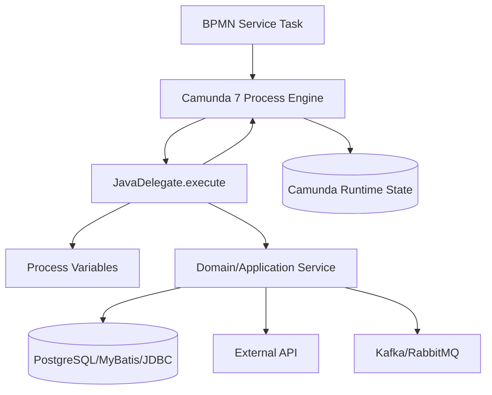
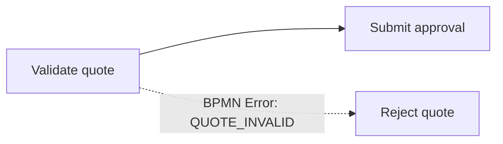

# Part 016 — Camunda 7 Java Delegate and Listener Model

> Fokus part ini: memahami Java Delegate dan listener sebagai **runtime code boundary** antara BPMN process model dan Java backend system.

Di Camunda 7, BPMN bisa memanggil Java code secara langsung melalui Java Delegate, expression, delegate expression, execution listener, dan task listener. Ini sangat powerful, tetapi juga berbahaya jika dianggap sekadar callback biasa.

Java delegation code berada di titik yang sensitif:

```text
BPMN token arrives at activity/event/task lifecycle
  -> engine invokes Java code
  -> code reads/writes process variables
  -> code may call DB/API/message broker
  -> exception controls retry/error/incident behavior
  -> transaction may commit or rollback process state
```

Dengan kata lain, delegate bukan helper class. Delegate adalah bagian dari process execution semantics.

---

## 1. Core Mental Model

Java Delegate adalah adapter antara process engine dan application code.



Delegate idealnya tipis:

```text
Read process context
Validate minimal preconditions
Call application service
Map result back to process variables
Convert known business outcome to BPMN error if appropriate
Let unexpected technical failure fail the job/request
```

Delegate seharusnya tidak menjadi:

- tempat business logic besar;
- pengganti domain service;
- pengganti repository layer;
- tempat menyimpan state jangka panjang;
- hidden orchestration di luar BPMN;
- catch-all exception suppressor.

---

## 2. JavaDelegate

Interface utama:

```java
public interface JavaDelegate {
  void execute(DelegateExecution execution) throws Exception;
}
```

Contoh minimal:

```java
public class ValidateQuoteDelegate implements JavaDelegate {

  private final QuoteApplicationService quoteService;

  public ValidateQuoteDelegate(QuoteApplicationService quoteService) {
    this.quoteService = quoteService;
  }

  @Override
  public void execute(DelegateExecution execution) throws Exception {
    String quoteId = (String) execution.getVariable("quoteId");
    String correlationId = (String) execution.getVariable("correlationId");

    QuoteValidationResult result = quoteService.validateQuote(quoteId, correlationId);

    execution.setVariable("quoteValid", result.valid());
    execution.setVariable("validationReason", result.reasonCode());
  }
}
```

Dalam praktik Camunda 7, constructor injection tergantung integration style. Jika memakai `camunda:class`, engine membuat instance class. Jika memakai Spring/CDI delegate expression, dependency injection lebih natural.

---

## 3. DelegateExecution

`DelegateExecution` adalah interface runtime untuk execution context.

Ia memberi akses ke:

- process variables;
- local variables;
- business key;
- process instance id;
- process definition id;
- current activity id/name;
- event name untuk listener;
- process engine services;
- tenant id jika multi-tenancy digunakan.

Contoh safe context extraction:

```java
public final class WorkflowContextExtractor {

  public WorkflowContext extract(DelegateExecution execution) {
    return new WorkflowContext(
        requiredString(execution, "quoteId"),
        optionalString(execution, "correlationId"),
        execution.getProcessInstanceId(),
        execution.getProcessBusinessKey(),
        execution.getCurrentActivityId()
    );
  }

  private String requiredString(DelegateExecution execution, String name) {
    Object value = execution.getVariable(name);
    if (!(value instanceof String s) || s.isBlank()) {
      throw new IllegalStateException("Missing required process variable: " + name);
    }
    return s;
  }

  private String optionalString(DelegateExecution execution, String name) {
    Object value = execution.getVariable(name);
    return value instanceof String s ? s : null;
  }
}
```

Guideline:

```text
Do not scatter raw execution.getVariable("...") calls across complex business logic.
```

Buat adapter/context object agar variable contract eksplisit.

---

## 4. Delegate Binding Options

### 4.1 `camunda:class`

```xml
<serviceTask id="validateQuote"
             name="Validate quote"
             camunda:class="com.company.workflow.ValidateQuoteDelegate" />
```

Kelebihan:

- eksplisit;
- mudah dibaca dari BPMN XML;
- tidak butuh bean resolver.

Risiko:

- class name menjadi runtime contract;
- refactoring package/class name breaking untuk running instance lama;
- dependency injection lebih terbatas;
- sulit mocking jika logic terlalu besar di delegate.

### 4.2 `camunda:delegateExpression`

```xml
<serviceTask id="validateQuote"
             name="Validate quote"
             camunda:delegateExpression="${validateQuoteDelegate}" />
```

Kelebihan:

- cocok untuk Spring/CDI/DI container;
- delegate bisa punya dependency normal;
- bean dapat diuji seperti component biasa.

Risiko:

- bean name menjadi runtime contract;
- rename bean breaking;
- expression resolution tergantung process application/container integration;
- error pada bean resolution sering baru muncul saat runtime.

### 4.3 `camunda:expression`

```xml
<serviceTask id="calculateApproval"
             camunda:expression="${approvalService.calculate(execution)}" />
```

Gunakan hanya untuk logic sangat kecil dan jelas.

Risiko:

- BPMN berisi coupling ke method signature;
- refactoring Java merusak BPMN;
- rules tersembunyi di expression;
- error handling/retry kurang eksplisit;
- observability buruk.

Senior guideline:

```text
Use delegateExpression for application code.
Use class only when lifecycle/classloading is deliberately controlled.
Avoid expression method calls for business-critical behavior.
```

---

## 5. ExecutionListener

Execution listener dipanggil pada lifecycle execution tertentu.

Event umum:

- start process;
- end process;
- start activity;
- end activity;
- take sequence flow;
- start/end gateway;
- start/end intermediate event.

Contoh:

```java
public class AuditExecutionListener implements ExecutionListener {

  private final WorkflowAuditService auditService;

  @Override
  public void notify(DelegateExecution execution) throws Exception {
    auditService.record(
        execution.getProcessInstanceId(),
        execution.getProcessBusinessKey(),
        execution.getCurrentActivityId(),
        execution.getEventName()
    );
  }
}
```

BPMN XML konseptual:

```xml
<serviceTask id="validateQuote" name="Validate quote">
  <extensionElements>
    <camunda:executionListener
      event="start"
      delegateExpression="${auditExecutionListener}" />
  </extensionElements>
</serviceTask>
```

Kapan berguna:

- audit teknis;
- trace enrichment;
- lifecycle metrics;
- generic validation;
- migration/compatibility instrumentation.

Kapan berbahaya:

- menjalankan business side effect besar;
- mengubah banyak variable secara tersembunyi;
- memanggil external API;
- mengganti explicit BPMN activity;
- menyembunyikan rule dari process diagram.

Rule of thumb:

```text
If business users must understand it, model it as BPMN activity, not hidden listener.
```

---

## 6. TaskListener

Task listener dipanggil pada lifecycle user task.

Event umum:

- create;
- assignment;
- complete;
- delete;
- update/timeout tergantung dukungan dan usage.

Contoh:

```java
public class UserTaskAssignmentListener implements TaskListener {

  private final AssignmentService assignmentService;

  @Override
  public void notify(DelegateTask delegateTask) {
    String quoteId = (String) delegateTask.getVariable("quoteId");
    Assignment assignment = assignmentService.resolveApprovalOwner(quoteId);

    delegateTask.setAssignee(assignment.userId());
    delegateTask.setDueDate(assignment.dueDate());
  }
}
```

Kapan berguna:

- dynamic assignment;
- due date calculation;
- candidate group enrichment;
- task audit;
- form metadata preparation.

Kapan berbahaya:

- membuat task completion punya side effect besar;
- meletakkan approval rule kompleks di listener;
- menyembunyikan SLA/escalation logic;
- tidak idempotent pada repeated invocation;
- mengubah process variable tanpa trace.

---

## 7. Variable Access Discipline

Delegate sering menjadi sumber variable chaos.

Bad pattern:

```java
String quoteId = (String) execution.getVariable("quote_id");
Boolean valid = (Boolean) execution.getVariable("isValid");
Map quote = (Map) execution.getVariable("quote");
execution.setVariable("status", "DONE");
```

Masalah:

- naming tidak konsisten;
- type cast fragile;
- variable besar;
- status generic;
- tidak ada contract;
- sulit migration.

Better pattern:

```java
public record ValidateQuoteInput(
    String quoteId,
    String customerId,
    String correlationId
) {}

public record ValidateQuoteOutput(
    boolean valid,
    String reasonCode
) {}
```

Mapper:

```java
public class ValidateQuoteVariableMapper {

  public ValidateQuoteInput read(DelegateExecution execution) {
    return new ValidateQuoteInput(
        requiredString(execution, "quoteId"),
        requiredString(execution, "customerId"),
        optionalString(execution, "correlationId")
    );
  }

  public void write(DelegateExecution execution, ValidateQuoteOutput output) {
    execution.setVariable("quoteValidationValid", output.valid());
    execution.setVariable("quoteValidationReasonCode", output.reasonCode());
  }
}
```

Guidelines:

- variable names are API contracts;
- use stable names, not UI labels;
- prefer primitive/string/small JSON payload;
- avoid full domain aggregate variables;
- do not store secrets/PII unless explicitly approved;
- version variable contracts when process versions diverge;
- log variable names, not sensitive values.

---

## 8. Exception Handling Semantics

Delegate exception controls workflow behavior.

### 8.1 Technical Exception

```java
throw new RuntimeException("Billing API unavailable");
```

Meaning:

```text
Technical work failed.
Engine should retry if async job/external task semantics apply.
If retries exhaust, incident/failed job should be visible.
```

Use for:

- database timeout;
- external API unavailable;
- network issue;
- transient broker failure;
- serialization failure;
- unexpected bug.

Do not swallow:

```java
try {
  billingClient.reserve(...);
} catch (Exception e) {
  log.warn("Failed but continuing", e);
}
```

This creates false success.

### 8.2 BPMN Error

```java
throw new BpmnError("QUOTE_REJECTED_BY_POLICY");
```

Meaning:

```text
A known business outcome occurred.
Process model should route it using error boundary/event handling.
```

Use for:

- not eligible;
- inventory unavailable as business outcome;
- approval policy rejected;
- customer account blocked;
- validation failed in expected business way.

Do not use BPMN error for:

- NullPointerException;
- database down;
- Kafka unavailable;
- HTTP 500 from dependency;
- malformed variable caused by code bug.

### 8.3 Escalation vs BPMN Error

Use escalation when the process should continue or notify/branch for attention without treating it as terminal business failure.

Example:

```text
Approval task overdue -> escalation path
Quote invalid -> BPMN error / rejection path
Billing API timeout -> technical exception / retry / incident
```

---

## 9. Retry Behavior and Async Boundary

In Camunda 7, retry semantics depend heavily on async continuation/job executor behavior.

If a service task executes synchronously during process start:

```text
runtimeService.startProcessInstanceByKey(...)
  -> service task delegate executes immediately
  -> exception propagates to caller
  -> transaction rolls back
  -> no async retry unless async boundary exists
```

If service task has `asyncBefore="true"`:

```text
process reaches async job
transaction commits job
job executor executes delegate later
exception decrements retries
retries exhausted -> incident/failed job
```

Production guideline:

```text
Any delegate that performs unreliable I/O should usually sit behind an async boundary.
```

Example:

```xml
<serviceTask id="sendOrderToFulfillment"
             name="Send order to fulfillment"
             camunda:asyncBefore="true"
             camunda:delegateExpression="${sendOrderToFulfillmentDelegate}" />
```

Trade-off:

| Choice | Benefit | Risk |
|---|---|---|
| Synchronous delegate | Immediate result, simpler call stack | Request latency, rollback coupling, poor retry |
| Async delegate | Retry/incident lifecycle, transaction separation | More jobs, eventual consistency, monitoring needed |

---

## 10. Side Effect Risk

A delegate often performs side effects:

- update PostgreSQL row;
- call external API;
- publish Kafka event;
- send RabbitMQ command;
- write Redis key;
- create user task metadata;
- call billing/provisioning/fulfillment system.

Risk scenario:

```text
Delegate calls external API successfully
Delegate then fails before Camunda job completes
Job retries
Delegate calls external API again
Duplicate side effect
```

Mitigation:

- use idempotency key;
- record processed command/job;
- use outbox for event publish;
- make domain transition idempotent;
- check current business state before acting;
- treat job/process/business key as dedupe material;
- do not assume delegate executes exactly once.

Example idempotent delegate shape:

```java
public class ReserveCapacityDelegate implements JavaDelegate {

  private final CapacityService capacityService;
  private final WorkflowCommandRepository commandRepository;

  @Override
  public void execute(DelegateExecution execution) {
    String orderId = requiredString(execution, "orderId");
    String activityId = execution.getCurrentActivityId();
    String processInstanceId = execution.getProcessInstanceId();

    String commandKey = processInstanceId + ":" + activityId;

    if (commandRepository.alreadyProcessed(commandKey)) {
      return;
    }

    capacityService.reserve(orderId, commandKey);
    commandRepository.markProcessed(commandKey);
  }
}
```

Important:

```text
The idempotency record must be protected by a unique constraint or equivalent atomicity.
```

---

## 11. BPMN Error Handling Pattern

Example process fragment:



Delegate:

```java
public class ValidateQuoteDelegate implements JavaDelegate {

  @Override
  public void execute(DelegateExecution execution) {
    String quoteId = (String) execution.getVariable("quoteId");

    try {
      validationService.validate(quoteId);
    } catch (QuoteNotEligibleException e) {
      execution.setVariable("rejectionReason", e.reasonCode());
      throw new BpmnError("QUOTE_INVALID");
    }
  }
}
```

Review questions:

- Is `QUOTE_INVALID` defined in BPMN boundary/error event?
- Is the error code stable?
- Is this truly a business error?
- Is rejection reason safe to store as variable?
- What happens if no boundary catches it?
- Is the process path observable in Cockpit/history?

---

## 12. Listener Error Semantics

Throwing `BpmnError` from delegation code is supported, including certain execution/task listener contexts, but listener context matters.

Senior stance:

```text
Do not rely on listener-thrown BPMN errors unless the lifecycle point is explicitly tested.
```

Why?

Because listener execution may happen:

- during normal flow;
- during process deletion;
- during process modification;
- due to interrupting boundary event;
- outside the intuitive activity path.

Safer approach:

- use BPMN service task for business decision/action;
- use listener for instrumentation/assignment/light metadata;
- test error boundary behavior if listener can throw;
- avoid external side effect in listener.

---

## 13. Accessing Engine Services from Delegates

`DelegateExecution` can expose process engine services.

Example:

```java
TaskService taskService = execution
    .getProcessEngineServices()
    .getTaskService();
```

Use sparingly.

Risks:

- delegate starts manipulating unrelated process/task state;
- hidden control flow outside BPMN;
- transaction coupling becomes unclear;
- process model no longer tells the truth;
- testing becomes harder.

Acceptable uses:

- small query needed for local context;
- controlled operational/audit enrichment;
- infrastructure integration with clear wrapper.

Avoid:

- completing other tasks from delegate;
- starting unrelated processes secretly;
- modifying process instances in generic delegate;
- creating process coupling hidden in Java code.

---

## 14. Delegate Testability

A delegate should be testable without starting full process engine for most logic.

Recommended decomposition:

```text
JavaDelegate
  -> variable mapper
  -> application service
  -> domain service/repository/client
```

Unit test application service separately.

Delegate unit test focuses on:

- variable read contract;
- variable write contract;
- exception mapping;
- BPMN error mapping;
- idempotency key generation;
- logging context.

Example pseudo-test:

```java
@Test
void mapsBusinessRejectionToBpmnError() {
  DelegateExecution execution = mockExecution(Map.of("quoteId", "Q-123"));
  when(validationService.validate("Q-123"))
      .thenThrow(new QuoteNotEligibleException("LIMIT_EXCEEDED"));

  BpmnError error = assertThrows(
      BpmnError.class,
      () -> delegate.execute(execution)
  );

  assertEquals("QUOTE_INVALID", error.getErrorCode());
  verify(execution).setVariable("rejectionReason", "LIMIT_EXCEEDED");
}
```

Integration/process test should cover:

- BPMN route after delegate success;
- BPMN route after BpmnError;
- retry after technical exception;
- incident after retry exhaustion;
- variable compatibility;
- user task visibility if delegate sets task routing variables.

---

## 15. Observability Pattern

Every delegate should log with workflow context.

Minimum context:

- process instance id;
- business key;
- process definition key/version if available;
- current activity id;
- business entity id, such as quoteId/orderId;
- correlation ID/request ID;
- delegate name;
- retry/job id if accessible.

Example:

```java
log.info(
    "Executing workflow delegate delegate={} processInstanceId={} businessKey={} activityId={} quoteId={} correlationId={}",
    "ValidateQuoteDelegate",
    execution.getProcessInstanceId(),
    execution.getProcessBusinessKey(),
    execution.getCurrentActivityId(),
    quoteId,
    correlationId
);
```

Do not log:

- full process variable map;
- PII;
- secrets;
- access tokens;
- raw customer contract payload;
- large JSON blobs.

Metrics to expose:

- delegate execution duration;
- success/failure count;
- BPMN error count by code;
- technical exception count by type;
- retry count if available;
- downstream dependency latency;
- idempotency duplicate count.

---

## 16. Production Failure Modes

### 16.1 Delegate Class Not Found

Symptoms:

- failed job;
- incident;
- `ClassNotFoundException` / `ProcessEngineException`;
- process stuck at service task.

Likely causes:

- class renamed;
- package changed;
- BPMN old version still references old class;
- artifact missing dependency;
- shared engine classloader cannot see process app class.

Debug:

1. Find process definition version.
2. Inspect BPMN XML binding.
3. Check app artifact version.
4. Check class exists in deployed jar/war.
5. Check process application registration.

### 16.2 Delegate Succeeds but Process Variable Wrong

Symptoms:

- gateway routes incorrectly;
- message correlation fails;
- user task assigned incorrectly;
- later delegate missing variable.

Likely causes:

- wrong variable name;
- type mismatch;
- local vs global scope confusion;
- variable overwritten by listener;
- old process version expects old contract.

Debug:

1. Inspect variable history.
2. Compare expected variable contract.
3. Check input/output mapping.
4. Check gateway expressions.
5. Check delegate logs.

### 16.3 Technical Failure Treated as Business Error

Symptoms:

- process routes to rejection/cancellation path;
- no incident created;
- customer sees business failure though dependency was down.

Likely causes:

- catch `Exception` and throw `BpmnError`;
- HTTP 500 mapped to business error;
- validation service unable to distinguish technical vs domain failure.

Debug:

1. Check delegate exception mapping.
2. Check downstream response category.
3. Check logs around BPMN error throw.
4. Check model boundary event.

### 16.4 Duplicate External Side Effect

Symptoms:

- duplicate event;
- duplicate provisioning command;
- duplicate billing reservation;
- duplicate order update.

Likely causes:

- retry after partial success;
- delegate not idempotent;
- no unique command key;
- external API lacks idempotency;
- DB commit/order of side effect unsafe.

Debug:

1. Check job retry history.
2. Check process instance/activity id.
3. Check external system request logs.
4. Check idempotency table/unique constraint.
5. Check transaction boundary.

---

## 17. Anti-Patterns

### Anti-pattern: Fat Delegate

```text
Delegate contains 600 lines of business logic, DB queries, API calls, routing rules, and variable mutations.
```

Better:

```text
Delegate is adapter.
Domain/application service owns business logic.
BPMN owns process flow.
DMN/rules layer owns business decision if appropriate.
```

### Anti-pattern: Catch and Continue

```java
try {
  externalClient.call();
} catch (Exception e) {
  log.warn("ignored", e);
}
```

This hides workflow failure and makes process state lie.

### Anti-pattern: BPMN Error for Everything

```java
catch (Exception e) {
  throw new BpmnError("FAILED");
}
```

This destroys retry/incident semantics.

### Anti-pattern: Variable Dump

```java
execution.setVariable("order", entireOrderAggregate);
```

This creates serialization, privacy, history, migration, and performance risk.

### Anti-pattern: Listener as Hidden Workflow

```text
Task complete listener calls billing, updates order state, publishes Kafka event, and starts another process.
```

If it is business-visible flow, model it.

---

## 18. Internal Verification Checklist

Gunakan checklist ini di codebase/team CSG.

### Delegate Discovery

- Cari semua BPMN yang memakai `camunda:class`.
- Cari semua BPMN yang memakai `camunda:delegateExpression`.
- Cari semua BPMN yang memakai `camunda:expression`.
- Buat mapping: BPMN activity -> Java class/bean -> downstream dependency.
- Tandai delegate yang melakukan DB write, API call, Kafka/RabbitMQ publish, Redis write, atau state transition.

### Listener Discovery

- Cari execution listener di BPMN XML.
- Cari task listener di user task.
- Bedakan listener untuk audit/assignment vs listener yang menjalankan business side effect.
- Cek listener yang mengubah process variable.
- Cek listener yang bisa throw exception/BpmnError.

### Variable Contract

- Cek variable yang wajib ada sebelum delegate.
- Cek variable yang ditulis delegate.
- Cek type variable.
- Cek variable yang berisi PII/secret/large payload.
- Cek compatibility dengan process version lama.

### Error and Retry

- Cek delegate yang catch `Exception`.
- Cek mapping technical exception vs `BpmnError`.
- Cek asyncBefore/asyncAfter pada service task unreliable.
- Cek retry policy.
- Cek incident ownership.

### Idempotency

- Cek apakah delegate bisa dieksekusi lebih dari sekali.
- Cek idempotency key.
- Cek unique constraint/inbox/processed table.
- Cek external API idempotency support.
- Cek duplicate Kafka/RabbitMQ message handling.

### Observability

- Cek log context: process instance id, business key, activity id, quote/order id, correlation ID.
- Cek metrics per delegate.
- Cek dashboard failed job/incident.
- Cek trace propagation ke downstream service.
- Cek redaction sensitive data.

---

## 19. PR Review Checklist

Sebelum approve PR yang mengubah delegate/listener:

- [ ] Apakah delegate hanya adapter tipis?
- [ ] Apakah business logic berada di service/domain/rules layer yang tepat?
- [ ] Apakah variable input/output contract jelas?
- [ ] Apakah variable names stabil dan version-compatible?
- [ ] Apakah large/sensitive variable dihindari?
- [ ] Apakah technical exception tidak diubah menjadi business error?
- [ ] Apakah `BpmnError` hanya untuk known business outcome?
- [ ] Apakah service task unreliable memiliki async boundary?
- [ ] Apakah side effect idempotent?
- [ ] Apakah retry tidak menyebabkan duplicate external action?
- [ ] Apakah delegate punya unit test?
- [ ] Apakah BPMN path success/error/retry diuji?
- [ ] Apakah logs/metrics/traces cukup untuk production debugging?
- [ ] Apakah class/bean rename aman untuk running instance lama?
- [ ] Apakah listener tidak menyembunyikan business flow penting?

---

## 20. Senior-Level Summary

Java Delegate dan listener di Camunda 7 adalah titik paling mudah untuk membuat workflow kuat — dan titik paling mudah untuk membuat workflow rapuh.

Prinsip utama:

```text
BPMN should show the business flow.
Delegate should adapt workflow context to application services.
Domain service should enforce business invariants.
Retry/incident should reflect technical failure.
BPMN error should reflect expected business outcome.
```

Delegate yang baik:

- kecil;
- typed melalui mapper/context;
- idempotent;
- observable;
- testable;
- jelas error semantics-nya;
- tidak menyimpan aggregate besar di variable;
- tidak menyembunyikan process flow dari BPMN.

Delegate yang buruk:

- besar;
- banyak `getVariable` acak;
- catch-all exception;
- external side effect tanpa idempotency;
- hidden workflow di listener;
- coupling ke class/bean yang sering berubah;
- tidak punya metrics/log context;
- sukses palsu saat dependency gagal.

Dalam konteks enterprise Quote & Order, Java Delegate biasanya menjadi jembatan antara workflow dan domain service seperti quote validation, approval routing, order decomposition, fulfillment command, fallout creation, atau reconciliation. Treat it as a production contract, not glue code.

---

## References

- Camunda 7 Docs — Delegation Code: https://docs.camunda.org/manual/7.24/user-guide/process-engine/delegation-code/
- Camunda 7 Docs — JavaDelegate Javadoc: https://docs.camunda.org/javadoc/camunda-bpm-platform/7.24/org/camunda/bpm/engine/delegate/JavaDelegate.html
- Camunda 7 Docs — DelegateExecution Javadoc: https://docs.camunda.org/javadoc/camunda-bpm-platform/7.24/org/camunda/bpm/engine/delegate/DelegateExecution.html
- Camunda 7 Docs — Error Handling: https://docs.camunda.org/manual/7.24/user-guide/process-engine/error-handling/
- Camunda 7 Docs — Transactions in Processes: https://docs.camunda.org/manual/7.24/user-guide/process-engine/transactions-in-processes/
