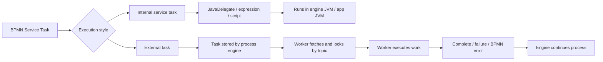
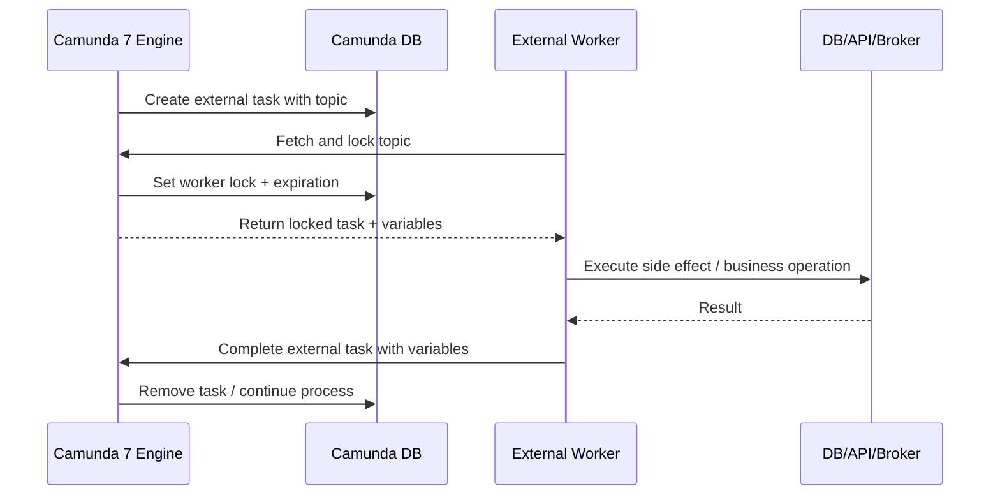
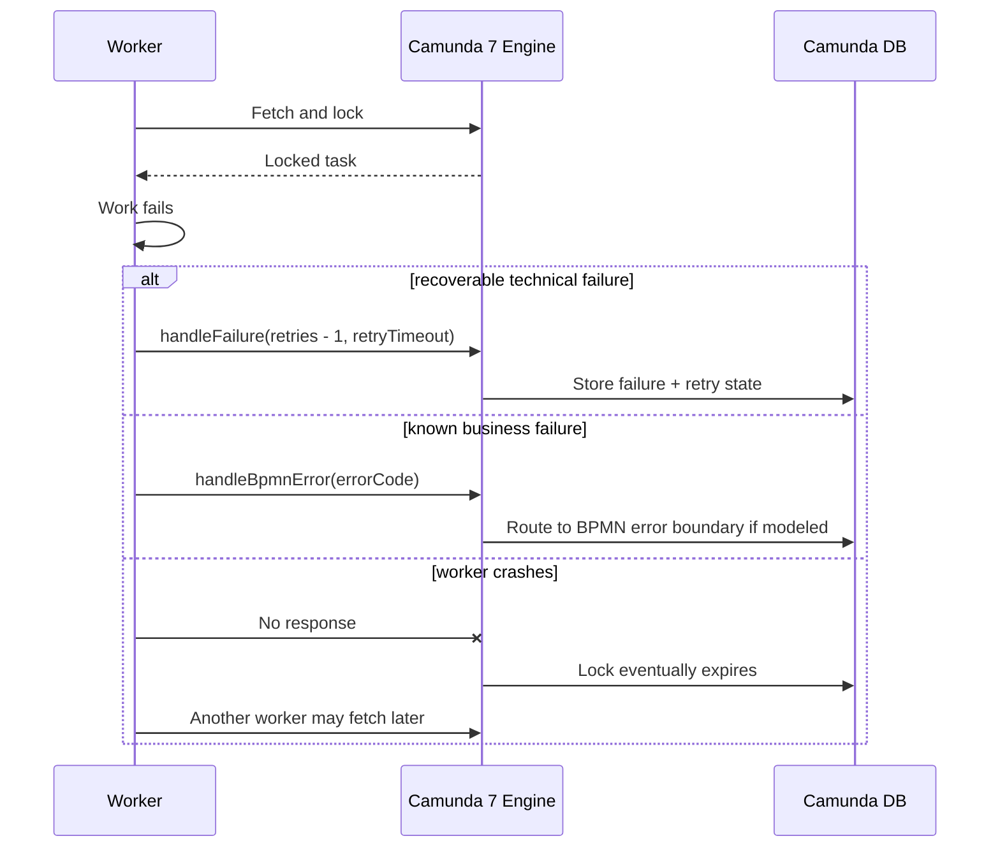
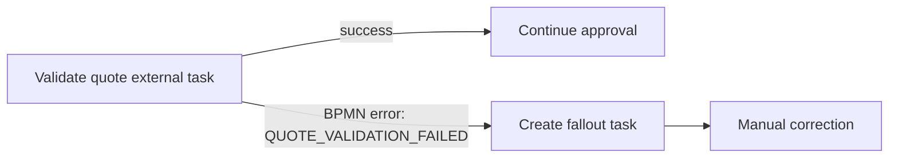
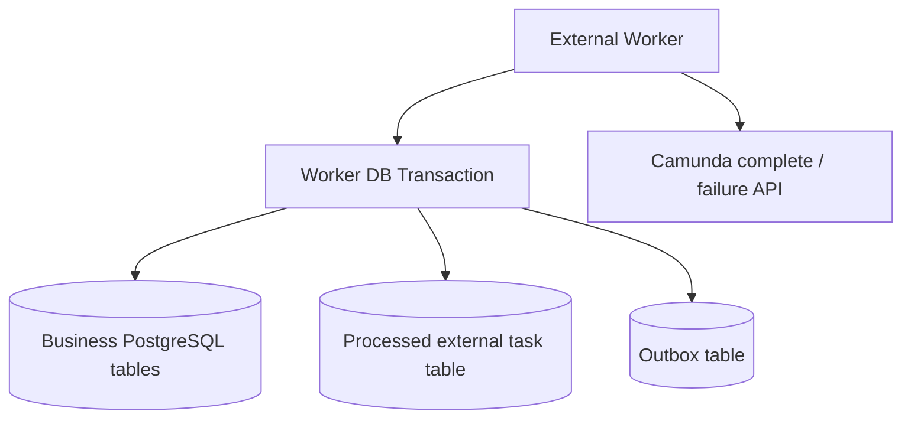

# Part 017 — Camunda 7 External Task Pattern

> Fokus part ini: memahami external task sebagai **remote worker boundary** di Camunda 7 — bukan sekadar polling API, tetapi kontrak distribusi kerja yang punya konsekuensi retry, locking, idempotency, observability, dan operasional.

External task adalah pola eksekusi service task di mana Camunda 7 tidak memanggil Java code secara langsung seperti `JavaDelegate`. Engine membuat work item, menyimpannya sebagai external task, lalu worker eksternal melakukan `fetch and lock`, memproses pekerjaan, dan memberi tahu engine apakah task selesai, gagal, atau harus masuk business error path.

Mental model ringkas:

```text
BPMN service task reached
  -> engine creates external task with topic
  -> worker polls topic
  -> engine locks task for worker
  -> worker does side effect / remote integration / DB work
  -> worker completes task OR reports failure OR throws BPMN error
  -> engine continues, retries later, or routes to error boundary
```

External task adalah salah satu bridge paling relevan untuk enterprise Java/JAX-RS microservices karena worker bisa dipisah dari process engine, diskalakan sendiri, di-deploy sendiri, dan memakai teknologi berbeda. Tetapi decoupling ini datang dengan biaya: duplicate execution, expired lock, retry storm, worker crash window, dan observability gap.

---

## 1. Core Mental Model

Camunda 7 service task bisa dieksekusi secara internal atau external.



Perbedaan utamanya bukan hanya lokasi kode.

| Aspect | Java Delegate | External Task |
|---|---|---|
| Invocation | Engine calls code | Worker polls engine |
| Coupling | Stronger classpath/runtime coupling | Looser deployment coupling |
| Transaction | Often same transaction as engine until async boundary | Worker transaction separate from engine transaction |
| Scaling | Tied to engine/application nodes | Scale worker per topic |
| Language | Mostly JVM integration | Any client that can call REST/Java API |
| Failure window | Exception rolls back to wait state/job semantics | Worker may crash after side effect before completion |
| Operational concern | Job executor, classloading, delegate errors | Lock duration, worker ID, fetch rate, duplicate work |

External task cocok ketika:

- work perlu dijalankan di service berbeda;
- worker perlu diskalakan per workload type;
- integration boundary harus explicit;
- service task memanggil external API, Kafka/RabbitMQ, PostgreSQL business database, Redis, atau cloud service;
- engine dan business worker perlu deployment lifecycle berbeda;
- team ingin menghindari classpath coupling JavaDelegate.

External task tidak otomatis membuat sistem lebih reliable. Ia hanya memindahkan failure boundary ke worker.

---

## 2. Why External Task Exists

Java Delegate nyaman untuk embedded Camunda 7, tetapi ada trade-off besar:

```text
Engine and business code live close together
  -> easier transaction/context access
  -> harder independent scaling and deployment
  -> classpath/version coupling
  -> engine node can become integration-heavy
```

External task mengubah arah control flow:

```text
Engine does not call worker.
Worker calls engine.
```

Ini penting untuk production:

- Engine tidak perlu tahu endpoint worker.
- Worker bisa berada di Kubernetes namespace berbeda.
- Worker bisa berada di network zone berbeda, selama bisa reach engine REST API.
- Worker bisa ditulis dalam Java, Go, Node.js, Python, atau teknologi lain.
- Worker downtime tidak langsung membuat engine call timeout; task tetap menunggu di engine.
- Worker bisa di-scale berdasarkan topic backlog dan processing latency.

Untuk Java/JAX-RS backend, external task sering menjadi pola adapter:

```text
Camunda external task worker
  -> validates variables
  -> calls internal application service or remote JAX-RS API
  -> writes PostgreSQL through MyBatis/JDBC
  -> publishes Kafka/RabbitMQ event through outbox
  -> reports completion/failure to Camunda
```

---

## 3. BPMN Declaration

Di Camunda 7, service task menjadi external task melalui extension attribute.

```xml
<serviceTask id="validateQuote"
             name="Validate quote"
             camunda:type="external"
             camunda:topic="quote-validation" />
```

Kontrak utama di sini adalah `topic`.

Topic bukan nama teknis acak. Topic adalah contract antara BPMN model dan worker deployment.

Bad topic:

```text
serviceTask1
java-worker
process-order
misc-task
```

Better topic:

```text
quote.validation.requested
order.decomposition.execute
fulfillment.submit-command
fallout.case-create
billing.precheck
```

Topic harus cukup stabil, observable, dan meaningful untuk operasi.

---

## 4. External Task Lifecycle

Lifecycle normal:



Lifecycle failure:



Important implication:

```text
An expired lock is not proof the previous worker did nothing.
It only proves the engine did not receive completion while the lock was valid.
```

This is why idempotency is mandatory.

---

## 5. Fetch and Lock

`fetch and lock` adalah operasi worker untuk mengambil external task yang tersedia pada topic tertentu dan mengunci task tersebut selama `lockDuration`.

Pseudo-flow:

```java
List<LockedExternalTask> tasks = externalTaskService
    .fetchAndLock(10, "quote-worker-01")
    .topic("quote-validation", 60_000L)
    .variables("quoteId", "correlationId", "tenantId")
    .execute();
```

Dalam REST/client worker, bentuknya mirip secara konsep:

```json
{
  "workerId": "quote-worker-01",
  "maxTasks": 10,
  "topics": [
    {
      "topicName": "quote-validation",
      "lockDuration": 60000,
      "variables": ["quoteId", "correlationId", "tenantId"]
    }
  ]
}
```

Yang perlu dipahami:

- `maxTasks` mengontrol batch size, bukan throughput final.
- `workerId` dipakai untuk ownership lock.
- `topicName` adalah routing contract.
- `lockDuration` adalah lease, bukan timeout bisnis.
- Variable selection membatasi payload yang dikirim ke worker.

---

## 6. Topic Design

Topic design yang buruk membuat operasi sulit:

```text
one-topic-for-everything
  -> worker harus switch logic internal
  -> metrics tidak granular
  -> scaling tidak spesifik
  -> failure domain campur
```

Topic design yang terlalu granular juga buruk:

```text
one-topic-per-minor-code-function
  -> terlalu banyak deployment/worker mapping
  -> observability fragmented
  -> process model coupling tinggi
```

Heuristic:

```text
A topic should represent a stable type of business/technical work
that can be owned, scaled, retried, and observed independently.
```

Contoh untuk Quote & Order:

| Topic | Meaning | Owner candidate |
|---|---|---|
| `quote.validate` | Validate quote against domain rules | Quote backend team |
| `quote.approval-route.resolve` | Resolve approver/candidate group | Workflow/backend team |
| `order.decompose` | Decompose order into fulfillment units | Order backend team |
| `fulfillment.command-submit` | Submit command to downstream fulfillment | Integration team |
| `fallout.case-create` | Create fallout/manual intervention case | Order operations/backend |
| `event.publish` | Publish workflow milestone event | Platform/backend |

Internal naming convention must be verified. Do not invent CSG topic names without checking codebase and BPMN XML.

---

## 7. Lock Duration

`lockDuration` is one of the most dangerous settings in external task worker design.

Too short:

```text
worker fetches task
worker still executing
lock expires
another worker fetches same task
both perform side effect
duplicate external operation
```

Too long:

```text
worker dies after fetch
task stays locked too long
process appears stuck
recovery latency increases
operator waits unnecessarily
```

Treat lock duration as a lease over Camunda task ownership, not as a guarantee over downstream side effects.

Rule of thumb:

```text
lockDuration > typical processing time + network jitter + engine API latency
lockDuration < acceptable recovery delay after worker crash
```

For long-running worker operations, use one of these approaches:

1. Break the work into smaller workflow steps.
2. Start external operation and correlate callback later.
3. Extend lock safely during work.
4. Avoid external task for operation that is actually asynchronous business workflow.

---

## 8. Extend Lock

`extendLock` can be used when worker legitimately needs more time.

Pseudo-code:

```java
externalTaskService.extendLock(externalTaskId, workerId, 120_000L);
```

Do not use lock extension to hide bad design.

Good use:

- large but bounded file validation;
- known long API call with heartbeat progress;
- controlled batch operation with progress checkpoints.

Bad use:

- waiting for human decision;
- waiting for async third-party callback;
- waiting for Kafka event to arrive;
- processing huge multi-hour fulfillment under one task.

If the work is long-running at business level, model it as process wait state with message/timer, not as one external task with extended lock forever.

---

## 9. Complete

`complete` tells Camunda the worker finished successfully and the process can continue.

Pseudo-code:

```java
externalTaskService.complete(
    externalTask.getId(),
    workerId,
    Map.of(
        "quoteValidationStatus", "VALID",
        "validatedAt", Instant.now().toString()
    )
);
```

Completion should be treated as the final acknowledgement after side effects are safe.

Risk window:

```text
worker writes PostgreSQL
worker publishes event
worker crashes before complete
lock expires
another worker repeats work
```

Therefore successful completion must be idempotent from the business perspective.

Avoid this pattern:

```text
external side effect first with no idempotency
complete task later
```

Safer pattern:

```text
derive idempotency key
check processed table / business state
perform side effect with idempotency
commit local transaction
complete task
```

Even safer for event publishing:

```text
business DB update + outbox insert in one PostgreSQL transaction
complete Camunda task
outbox publisher emits event separately
```

The exact order between DB update and Camunda completion is an architecture decision; what matters is explicit recovery behavior.

---

## 10. Handle Failure

`handleFailure` reports technical failure to Camunda.

Pseudo-code:

```java
externalTaskService.handleFailure(
    externalTask.getId(),
    workerId,
    "Downstream timeout",
    "Timeout calling fulfillment API after 2 seconds; correlationId=abc-123",
    remainingRetries,
    retryTimeoutMillis
);
```

Use `handleFailure` for recoverable technical failures:

- transient HTTP timeout;
- database connection issue;
- temporary downstream 503;
- rate limit that should retry later;
- infrastructure issue;
- serialization problem that may be fixed by deployment/config.

Do not use `handleFailure` for business decisions:

- quote is invalid;
- approval denied;
- product is not eligible;
- order cannot be decomposed due to known domain reason;
- customer does not meet business rule.

Those should become normal BPMN paths, often via BPMN error, gateway, or explicit result variable.

---

## 11. Handle BPMN Error

`handleBpmnError` tells the process that a known business error occurred.

Pseudo-code:

```java
externalTaskService.handleBpmnError(
    externalTask.getId(),
    workerId,
    "QUOTE_VALIDATION_FAILED",
    "Quote failed validation due to incompatible product configuration",
    Map.of("validationReason", "INCOMPATIBLE_PRODUCT_CONFIGURATION")
);
```

Use BPMN error only when the process model has a meaningful business path for it.



If the BPMN model has no boundary error or error event path, throwing BPMN error may create unexpected failure semantics.

Senior review question:

```text
Is this really an expected business outcome, or just a technical exception being renamed?
```

---

## 12. Retry Count and Retry Timeout

External task retry is explicit. Worker reports remaining retries and timeout.

Example strategy:

```text
attempt 1 fails -> retries=4, retryTimeout=PT1M
attempt 2 fails -> retries=3, retryTimeout=PT5M
attempt 3 fails -> retries=2, retryTimeout=PT15M
attempt 4 fails -> retries=1, retryTimeout=PT30M
attempt 5 fails -> retries=0 -> incident/manual intervention
```

Avoid infinite retry.

Infinite retry hides incidents, burns infrastructure, and can amplify outages.

Retry policy must answer:

- What failures are retryable?
- How many times?
- How long between attempts?
- Who owns the incident after exhaustion?
- What dashboard shows retry exhaustion?
- Is the worker idempotent under retry?
- Is downstream safe under retry storm?

---

## 13. Long Polling and Backoff

Worker polling can overload engine REST API if naïve.

Bad loop:

```java
while (true) {
  fetchAndLock();
}
```

Better pattern:

```text
long polling enabled
bounded maxTasks
adaptive backoff on empty response
jitter between workers
separate concurrency limit from polling batch size
metrics emitted per cycle
```

Long polling reduces empty request churn because the request can wait until tasks are available or timeout occurs.

Backoff matters when:

- no tasks are available;
- engine REST API is slow;
- network failure occurs;
- worker gets 429/503/5xx;
- downstream system is degraded.

Do not synchronize all workers to retry at the same interval. Add jitter.

---

## 14. Worker ID

Worker ID is not a cosmetic field. It appears in lock ownership and operational debugging.

Bad worker ID:

```text
worker
localhost
app
```

Better worker ID:

```text
quote-validation-worker/pod-abc123/instance-7
order-decomposition-worker/az-a/pod-xyz789
```

A good worker ID helps answer:

- Which deployment locked the task?
- Which pod processed it?
- Was the worker restarted?
- Are duplicate workers using the same identity?
- Did lock ownership mismatch occur?

In Kubernetes, worker ID should usually include stable workload name and pod identity.

---

## 15. Worker Implementation Skeleton

Example Java-oriented skeleton:

```java
public final class QuoteValidationExternalTaskHandler {

  private final QuoteApplicationService quoteService;
  private final ProcessedExternalTaskRepository processedTasks;

  public void handle(LockedExternalTask task, ExternalTaskService service) {
    String taskId = task.getId();
    String workerId = currentWorkerId();
    String quoteId = requiredString(task, "quoteId");
    String correlationId = requiredString(task, "correlationId");

    String idempotencyKey = "camunda7:external-task:" + taskId;

    try {
      if (processedTasks.exists(idempotencyKey)) {
        service.complete(taskId, workerId);
        return;
      }

      QuoteValidationResult result = quoteService.validate(quoteId, correlationId, idempotencyKey);

      if (!result.valid()) {
        service.handleBpmnError(
            taskId,
            workerId,
            "QUOTE_VALIDATION_FAILED",
            result.reason(),
            Map.of("validationReason", result.reasonCode())
        );
        return;
      }

      processedTasks.markProcessed(idempotencyKey, quoteId, taskId);

      service.complete(taskId, workerId, Map.of(
          "quoteValidationStatus", "VALID",
          "quoteValidatedAt", Instant.now().toString()
      ));

    } catch (TransientDownstreamException e) {
      service.handleFailure(
          taskId,
          workerId,
          e.getMessage(),
          safeDetails(e, correlationId),
          nextRetries(task),
          nextRetryTimeout(task)
      );
    } catch (Exception e) {
      service.handleFailure(
          taskId,
          workerId,
          "Unexpected worker failure",
          safeDetails(e, correlationId),
          0,
          0
      );
    }
  }
}
```

This is not copy-paste production code. It shows separation of concerns:

```text
task variable extraction
idempotency guard
business service call
business error mapping
technical failure mapping
completion
```

---

## 16. Transaction Boundary with PostgreSQL/MyBatis

External worker usually has its own transaction boundary separate from Camunda engine.



Common failure windows:

| Step | Failure | Risk |
|---|---|---|
| Before DB commit | Worker crashes | task retries; no side effect if transaction rolled back |
| After DB commit, before complete | Worker crashes | duplicate processing unless idempotent |
| After complete, before event publish | Event may be missing if no outbox |
| After external API call, before DB mark | duplicate external API call unless API idempotency exists |
| During complete API call | worker may not know if engine accepted completion | completion retry must be safe |

For MyBatis/JDBC worker:

- use explicit transaction boundary;
- use unique constraints for idempotency;
- avoid relying only on Redis TTL for processed task memory;
- write audit rows for side effects;
- include process instance id, external task id, business key, correlation ID.

---

## 17. Kafka/RabbitMQ Integration

External worker often publishes event or sends command.

Bad pattern:

```text
worker completes Camunda task
then publishes Kafka event
publish fails
process moved forward but event missing
```

Better patterns:

### Pattern A — Outbox in worker transaction

```text
worker updates business state + inserts outbox event
worker completes Camunda task
separate publisher emits Kafka/RabbitMQ event
```

### Pattern B — Event publish is the business side effect with idempotency

```text
worker uses deterministic event id
publisher uses outbox/deduplication
consumer handles duplicate event
worker completes task after publish accepted
```

### Pattern C — Workflow waits for message correlation

```text
worker sends command
process waits on message event
reply/callback correlates message later
```

Do not turn one external task into a hidden long-running choreography loop.

---

## 18. Redis Use Around External Tasks

Redis can help, but it should not become the source of truth for external task correctness.

Useful:

- short-lived rate limiter;
- circuit breaker coordination;
- worker kill switch;
- cache for external lookup;
- temporary dedup guard if backed by durable DB;
- lease-like coordination where correctness does not depend only on Redis.

Risky:

- Redis-only processed-task record;
- Redis-only distributed lock for irreversible side effect;
- Redis key TTL shorter than retry window;
- cache process status as if it were authoritative;
- using Redis queue to duplicate Camunda external task queue semantics.

If side effect is business-critical, durable idempotency belongs in PostgreSQL or downstream system with idempotency guarantee.

---

## 19. Worker Scaling

External task worker can be scaled horizontally, but throughput does not scale linearly by default.

Constraints:

- Camunda engine REST/API capacity;
- Camunda DB load;
- topic backlog;
- lock contention;
- downstream API capacity;
- business DB transaction contention;
- worker CPU/memory;
- Kafka/RabbitMQ producer limits;
- rate limits;
- idempotency table hot keys.

Scaling knobs:

```text
number of worker pods
maxTasks per fetch
handler concurrency
lockDuration
long polling timeout
backoff strategy
per-topic worker count
downstream rate limit
connection pool size
```

Do not scale worker pods without observing:

- task fetch latency;
- task processing latency;
- failure rate;
- retry count;
- downstream saturation;
- Camunda REST/API latency;
- database load.

---

## 20. Backpressure

External task gives you pull-based backpressure.

Worker can slow down by:

- fetching fewer tasks;
- reducing concurrency;
- increasing backoff;
- pausing specific topic;
- activating kill switch;
- failing tasks with controlled retry timeout;
- not completing work until downstream capacity recovers.

But pull-based backpressure only works if the worker is intentionally designed for it.

Bad pattern:

```text
fetch maxTasks=1000
spawn unbounded threads
call downstream without rate limit
fail everything quickly
create retry storm
```

Production worker should have bounded queues and bounded concurrency.

---

## 21. Error Taxonomy

Map failure to the right Camunda action.

| Situation | Worker action | Why |
|---|---|---|
| Downstream HTTP timeout | `handleFailure` | likely technical/transient |
| PostgreSQL connection unavailable | `handleFailure` | infra failure |
| Validation says quote invalid | `handleBpmnError` or result variable | expected business outcome |
| Missing required process variable | usually `handleFailure` with zero/low retry | model/contract bug |
| Unauthorized worker credential | `handleFailure`, alert immediately | config/security issue |
| Duplicate already processed | `complete` idempotently | safe replay |
| Unknown exception | `handleFailure` with bounded retries | avoid silent success |
| Poison data cannot be processed | retries to zero + incident/manual repair | needs operator/engineering intervention |

Do not convert every exception into BPMN error.
Do not convert every business outcome into technical failure.

---

## 22. Observability

Minimum logs per task attempt:

```text
externalTaskId
processInstanceId
processDefinitionKey
businessKey
activityId
topic
workerId
quoteId/orderId if available
correlationId
attempt/retries
lockExpirationTime
outcome: complete/failure/bpmnError
failureCode/failureClass
latencyMs
```

Metrics:

- tasks fetched per topic;
- tasks completed per topic;
- tasks failed per topic;
- BPMN errors per topic/error code;
- handler latency;
- fetch latency;
- completion API latency;
- retry exhaustion count;
- lock expiration / duplicate detection count;
- idempotency hit count;
- downstream error rate;
- worker concurrency saturation;
- backlog by topic if available.

Traces:

```text
Camunda process instance -> external worker -> DB/API/broker -> completion call
```

Propagate correlation ID from process variables into logs, traces, downstream requests, and events.

---

## 23. Common Failure Modes

### 23.1 Worker not fetching task

Possible causes:

- wrong topic name;
- worker disabled;
- worker cannot reach engine REST API;
- auth failure;
- task not created because token never reached service task;
- task locked by another worker;
- process deployed wrong version;
- tenant mismatch;
- external task suspended.

Debug:

```text
Check BPMN deployed version
Check external task query by topic
Check worker logs and auth
Check lock owner and lock expiration
Check process instance activity
Check engine REST/API latency
```

### 23.2 Worker processes duplicate task

Possible causes:

- lock duration too short;
- worker paused after side effect;
- complete request timed out;
- engine accepted completion but worker retried incorrectly;
- idempotency missing;
- multiple workers share bad worker ID and logs are ambiguous.

Debug:

```text
Check processed-task table
Check downstream idempotency key
Check lock expiration timeline
Check worker pod restart timeline
Check duplicate event/API call records
```

### 23.3 Task stuck locked

Possible causes:

- long lock duration;
- worker crash after fetch;
- worker network partition;
- engine clock/time issue;
- operator misreads locked task as active processing.

Debug:

```text
Check lock expiration time
Check worker health
Check pod restart/OOMKilled
Check whether lock extension is active
Wait for expiration or apply operational repair if justified
```

### 23.4 Retry storm

Possible causes:

- too many retries with short timeout;
- downstream outage;
- no circuit breaker;
- worker autoscaling reacts to backlog but dependency is down;
- all tasks fail immediately and re-enter queue.

Debug:

```text
Check failure rate by topic
Check downstream health
Pause/scale down worker if needed
Increase retry timeout
Use kill switch
Create incident and communicate impact
```

---

## 24. External Task vs Java Delegate

Use Java Delegate when:

- engine is embedded in the same Java app;
- logic is simple and local;
- transaction coupling is desired and understood;
- classpath coupling is acceptable;
- operational model is simple.

Use external task when:

- worker should scale independently;
- worker should deploy independently;
- integration crosses service/network/language boundary;
- team wants explicit worker observability;
- work calls external APIs or messaging systems;
- long-running operations need decoupling from engine thread.

But remember:

```text
External task solves deployment/runtime coupling.
It does not solve idempotency, transaction consistency, or bad process design.
```

---

## 25. Kubernetes Deployment Considerations

For external workers on Kubernetes:

- set graceful shutdown;
- stop fetching new tasks before pod termination;
- allow in-flight tasks to complete or fail explicitly;
- keep lock duration aligned with termination grace period;
- expose metrics endpoint;
- configure liveness/readiness correctly;
- keep connection pools bounded;
- use service account/secret management properly;
- add resource requests/limits;
- avoid HPA based only on CPU if backlog is the real signal.

Shutdown mental model:

```text
SIGTERM received
  -> readiness false
  -> stop fetching new external tasks
  -> finish bounded in-flight tasks if possible
  -> fail/let-lock-expire tasks that cannot finish safely
  -> close HTTP/DB/broker clients
  -> exit before terminationGracePeriodSeconds
```

---

## 26. Internal Verification Checklist

Cek di codebase/BPMN/deployment:

- [ ] Apakah external task dipakai atau hanya Java Delegate?
- [ ] Daftar semua `camunda:type="external"` dan `camunda:topic`.
- [ ] Topic naming convention.
- [ ] Worker implementation per topic.
- [ ] Worker language/runtime.
- [ ] Worker deployment topology di Kubernetes/cloud/on-prem.
- [ ] Engine REST endpoint dan authentication.
- [ ] `workerId` strategy.
- [ ] `maxTasks` dan `lockDuration`.
- [ ] Long polling configuration.
- [ ] Backoff strategy.
- [ ] Retry count dan retry timeout policy.
- [ ] `handleFailure` usage.
- [ ] `handleBpmnError` usage.
- [ ] Boundary error event yang menangkap BPMN error.
- [ ] Idempotency strategy.
- [ ] Processed external task table atau dedup store.
- [ ] PostgreSQL/MyBatis transaction boundary.
- [ ] Outbox/inbox usage untuk Kafka/RabbitMQ.
- [ ] Redis usage around worker coordination.
- [ ] Worker graceful shutdown.
- [ ] Metrics/logs/traces per topic.
- [ ] Dashboard untuk failed external task/retry/incident.
- [ ] Runbook untuk worker outage, duplicate side effect, retry storm.

---

## 27. PR Review Checklist

Sebelum approve PR yang menambah/mengubah external task:

- [ ] Apakah topic stabil dan meaningful?
- [ ] Apakah worker contract terdokumentasi?
- [ ] Apakah variable input/output eksplisit?
- [ ] Apakah worker mengambil hanya variable yang dibutuhkan?
- [ ] Apakah lock duration sesuai processing time dan recovery expectation?
- [ ] Apakah idempotency key jelas?
- [ ] Apakah duplicate execution aman?
- [ ] Apakah completion/failure/BPMN error semantics benar?
- [ ] Apakah retry policy bounded?
- [ ] Apakah retry timeout tidak membuat storm?
- [ ] Apakah failure details aman dari PII/secret?
- [ ] Apakah worker logs menyertakan process instance id, task id, business key, correlation ID?
- [ ] Apakah metrics per topic tersedia?
- [ ] Apakah worker graceful shutdown benar?
- [ ] Apakah downstream API/DB/broker punya timeout dan rate limit?
- [ ] Apakah external task lebih tepat daripada Java Delegate atau Zeebe worker?

---

## 28. Senior-Level Summary

External task adalah pattern untuk membuat Camunda 7 berinteraksi dengan dunia luar secara lebih decoupled.

Ia kuat karena:

- worker bisa dipisah dari engine;
- worker bisa diskalakan per topic;
- worker bisa ditulis dengan teknologi berbeda;
- engine tidak perlu call worker;
- downtime worker dapat degrade menjadi backlog.

Ia berbahaya karena:

- lock expiry bisa menyebabkan duplicate execution;
- complete/failure call punya ambiguity saat timeout;
- transaction boundary terpisah dari engine;
- retry bisa menggandakan side effect;
- observability sering tersebar antara engine, worker, DB, dan broker.

Prinsip utama:

```text
Design external task workers as distributed systems components.
Not as simple callbacks.
```

Untuk enterprise Quote & Order, external task worker harus diperlakukan sebagai production contract: topic, variable schema, idempotency, retry, timeout, metrics, runbook, dan ownership harus jelas.

---

## References

- Camunda 7 Docs — External Tasks: https://docs.camunda.org/manual/7.24/user-guide/process-engine/external-tasks/
- Camunda 7 Docs — REST API External Task: https://docs.camunda.org/manual/7.24/reference/rest/external-task/
- Camunda 7 Docs — Error Handling: https://docs.camunda.org/manual/7.24/user-guide/process-engine/error-handling/
- Camunda 7 Docs — Transactions in Processes: https://docs.camunda.org/manual/7.24/user-guide/process-engine/transactions-in-processes/
