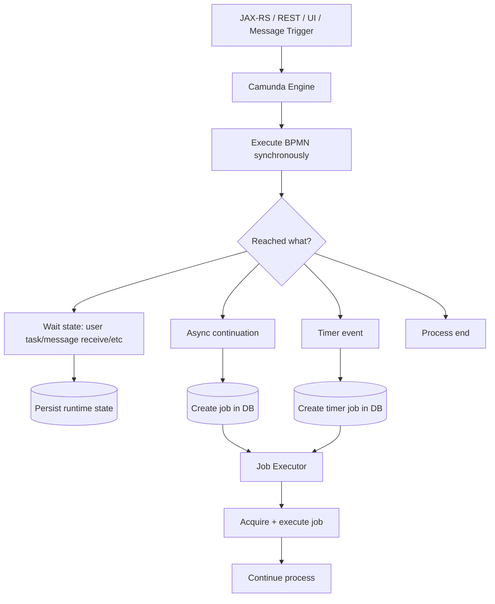
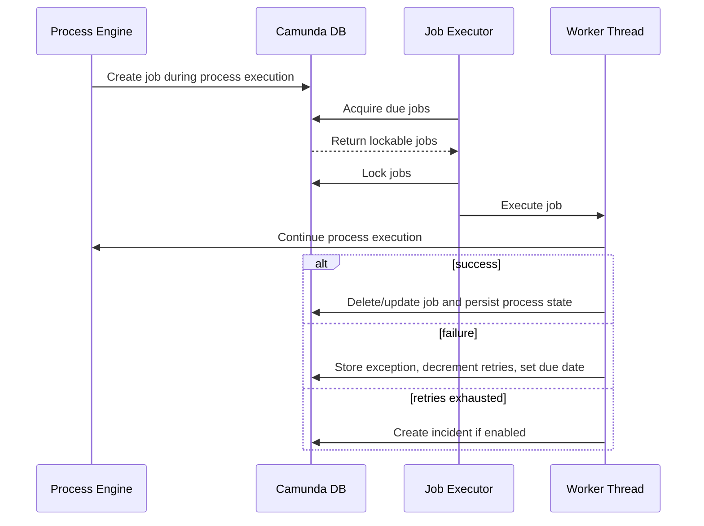
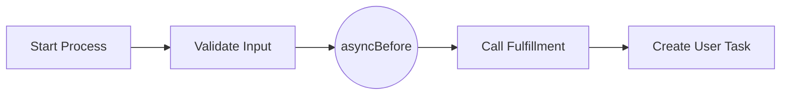
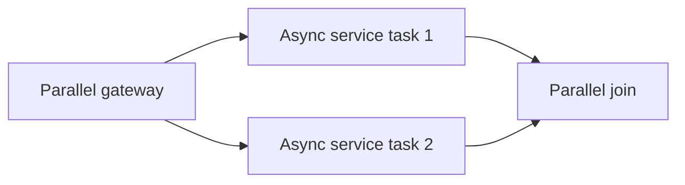

# Part 018 — Camunda 7 Job Executor and Async Continuation

> Fokus part ini: memahami job executor dan async continuation sebagai **transaction boundary + background execution mechanism** di Camunda 7.

Di Camunda 7, tidak semua langkah proses dieksekusi langsung oleh thread request yang memanggil engine. Ketika proses mencapai timer, async continuation, atau job tertentu, engine membuat job di database. Job executor kemudian mengambil job tersebut dan menjalankannya di background thread.

Mental model singkat:

```text
External trigger enters engine
  -> engine advances process synchronously
  -> engine reaches wait state or async boundary
  -> engine persists state/job to DB
  -> request transaction commits
  -> job executor later acquires due job
  -> job executor executes continuation
  -> success continues process, failure decrements retry / creates incident
```

Job executor adalah salah satu komponen paling penting untuk production debugging Camunda 7. Banyak masalah yang tampak seperti “BPMN stuck” sebenarnya adalah masalah job creation, job acquisition, transaction boundary, retry exhaustion, DB load, optimistic locking, atau worker thread starvation.

---

## 1. Core Mental Model

Camunda 7 engine pada dasarnya passive Java code yang berjalan di thread caller sampai mencapai wait state. Wait state menyimpan process state ke database dan menunggu trigger berikutnya.



Key idea:

```text
Async continuation turns part of process execution into a job.
Job executor is the runtime component that picks up and executes that job later.
```

---

## 2. What Is a Job?

A job is an explicit database-backed work item that tells Camunda to continue process execution later.

Jobs are created for:

- async continuations;
- timer events;
- async handling of BPMN events;
- some batch/management operations depending on feature usage.

A job usually carries:

- job id;
- process instance id;
- execution id;
- process definition id;
- due date;
- retries;
- lock owner;
- lock expiration time;
- exception message/details when failed;
- job handler type/configuration;
- priority if enabled.

Production interpretation:

```text
If a process is waiting at an async continuation or timer, look for a job.
If the job exists but is not executed, debug acquisition/executor/due date/lock.
If the job fails, debug retries/exception/incident.
If the job does not exist, debug whether the token ever reached that async/timer point.
```

---

## 3. Job Executor Lifecycle

The job executor has three conceptual phases.



Important: job creation happens during process execution; job acquisition and execution are responsibility of job executor.

---

## 4. Async Before

`asyncBefore` creates a transaction boundary before an activity executes.

```xml
<serviceTask id="validateQuote"
             name="Validate quote"
             camunda:asyncBefore="true"
             camunda:class="com.company.workflow.ValidateQuoteDelegate" />
```

Runtime behavior:

```text
token reaches service task
  -> engine creates job before executing delegate
  -> current transaction commits
  -> job executor later invokes delegate
```

Use `asyncBefore` when:

- service task has external side effect;
- you need retry/incident semantics around delegate execution;
- you want request thread to return before work starts;
- class may not exist on node that starts process, but exists on worker node in heterogeneous cluster;
- process should persist before risky work.

Danger if missing:

```text
REST request starts process
  -> engine immediately invokes delegate
  -> delegate calls downstream and fails
  -> process start transaction rolls back
  -> process instance may never be visible in Cockpit
```

For production debugging, this is a big deal: without async boundary, a failure may disappear into the caller exception path instead of becoming a visible failed job/incident.

---

## 5. Async After

`asyncAfter` creates a transaction boundary after an activity completes.

```xml
<serviceTask id="validateQuote"
             name="Validate quote"
             camunda:asyncAfter="true"
             camunda:class="com.company.workflow.ValidateQuoteDelegate" />
```

Runtime behavior:

```text
engine enters service task
  -> delegate executes in current transaction
  -> engine creates job after activity end
  -> current transaction commits
  -> job executor later continues outgoing flow
```

Use `asyncAfter` when:

- activity should complete and commit before downstream continuation;
- next gateway/path may be risky;
- multi-instance join or parallel join needs retry around continuation;
- you need a save point after side effect.

But be careful:

```text
asyncAfter does not make the activity side effect safer by itself.
It persists after the activity. If the activity side effect fails before that, asyncAfter may not help.
```

---

## 6. Transaction Boundary Reasoning

Async continuation is transaction boundary design.

Without async:

```text
JAX-RS request
  -> start process
  -> service task A
  -> service task B
  -> gateway
  -> user task
  -> commit all engine state
```

One exception anywhere before commit can roll back the whole execution to the previous wait state.

With async boundary:

```text
JAX-RS request
  -> start process
  -> reach asyncBefore service task A
  -> create job
  -> commit process state

Job executor later
  -> execute service task A
  -> continue until next wait state/async boundary
  -> commit or fail job
```

This gives you:

- persistence checkpoint;
- retry semantics;
- incident visibility;
- decoupling from request latency;
- operational repair point.

But it also creates:

- background execution;
- more DB job load;
- possible ordering differences;
- retry/duplicate side-effect risks;
- need for job executor capacity.

---

## 7. Save Point Mental Model

A wait state or async boundary acts like a save point for process execution.



If `Call Fulfillment` fails after `asyncBefore`, process state remains persisted before `D`, and job failure can be retried or incidented.

Without `asyncBefore`, the failure may rollback to start request boundary or previous wait state.

Senior-level principle:

```text
Place async boundaries before unreliable side effects and at useful recovery points.
Do not scatter async everywhere without operational intent.
```

---

## 8. Failed Job

When job execution throws unhandled exception:

```text
job executor catches exception
  -> transaction rolls back to last persisted state
  -> retries decremented unless special case such as optimistic locking
  -> retry due date set
  -> exception stored
  -> if retries reach zero, incident may be created
```

Failed job is a technical failure signal.

Common sources:

- JavaDelegate exception;
- expression evaluation failure;
- missing class/bean;
- serialization problem;
- database exception;
- external API timeout;
- optimistic locking conflict;
- variable type mismatch;
- authorization/config issue;
- null/missing variable.

Do not treat failed job as normal business rejection. Business rejection should be modeled explicitly.

---

## 9. Retry Cycle

Camunda 7 job retry can be globally configured and also configured locally in BPMN via extension elements.

Example:

```xml
<serviceTask id="submitFulfillment"
             name="Submit fulfillment command"
             camunda:asyncBefore="true"
             camunda:class="com.company.workflow.SubmitFulfillmentDelegate">
  <extensionElements>
    <camunda:failedJobRetryTimeCycle>R5/PT5M</camunda:failedJobRetryTimeCycle>
  </extensionElements>
</serviceTask>
```

Meaning:

```text
R5/PT5M = retry up to 5 times with 5 minutes interval
```

Retry design checklist:

- Is failure transient?
- Is delegate idempotent?
- Is downstream protected from retry storm?
- Is retry interval long enough?
- What happens after retries reach zero?
- Who owns the incident?
- Is error detail useful and safe?

Bad retry policy:

```text
R100/PT1S for external API outage
```

Better policy:

```text
few retries
increasing delay or operationally reasonable delay
incident after exhaustion
alert with ownership
manual repair/retry runbook
```

---

## 10. Incident

An incident is an operational signal that process execution cannot continue automatically.

For failed jobs, incident usually appears after retries are exhausted.

Incident should answer:

```text
Which process instance?
Which activity/job?
What failed?
How many retries left?
What business object is affected?
Who owns repair?
Can retry be safely triggered?
What customer impact exists?
```

Incident anti-pattern:

```text
Incident exists but no one owns it.
Incident dashboard is not monitored.
Incident detail contains PII or secret.
Incident is retried manually without understanding idempotency.
Incident is resolved by modifying variables blindly.
```

---

## 11. Timer Job

Timer events create timer jobs.

Timer examples:

- SLA escalation timer;
- approval timeout;
- retry reminder;
- scheduled process start;
- boundary timeout;
- reconciliation trigger.

Timer job lifecycle:

```text
timer event reached
  -> timer job persisted with due date
  -> job executor periodically acquires due timer
  -> process continues on timer path
```

Timer failure modes:

- timer not visible before transaction commits;
- wrong timezone/date expression;
- timer due date far in future;
- timer backlog due to job executor overload;
- timer migration issue;
- timer path creates large burst of jobs;
- boundary timer attached to wrong scope.

Debug timer:

```text
Check process reached timer event
Check job due date
Check lock owner/lock expiration
Check job executor enabled
Check DB/job table backlog
Check timezone assumptions
Check incident/exception on timer continuation
```

---

## 12. Message Job and Async Event Handling

Some BPMN event handling can result in jobs, especially when asynchronous behavior is configured.

Operational concern:

```text
Message correlation may succeed, but async continuation after correlation may fail as a job.
```

This distinction matters:

- API caller sees correlation accepted;
- process later fails in job executor;
- incident is created after retries;
- user thinks message worked, but process did not finish downstream step.

Therefore message correlation endpoint should log:

- process instance id;
- message name;
- correlation key/business key;
- resulting execution/activity if available;
- async job created if relevant.

---

## 13. Exclusive Jobs

By default, jobs are often treated in a way that avoids concurrent execution conflicts for the same process instance. Exclusive job behavior is intended to reduce optimistic locking and consistency problems.

Mental model:

```text
same process instance has multiple async jobs
  -> job executor tries to avoid executing exclusive jobs concurrently
  -> reduces parallel join conflicts and non-transactional side-effect duplicates
```

This matters in parallel gateways and multi-instance activities.

Example risk:



If two branches reach the join concurrently, optimistic locking can happen. Camunda can retry technical conflict, but side effects done before the conflict may not roll back if they happened outside the engine transaction.

Design implication:

- Keep side effects idempotent.
- Use async boundaries intentionally.
- Understand exclusive job behavior before changing it.
- Avoid parallel non-idempotent service tasks against same business object.

---

## 14. Optimistic Locking

Optimistic locking is not always a bug. In Camunda it is part of concurrency control.

Typical case:

```text
parallel paths update same process execution state
one transaction commits first
other transaction detects stale revision
optimistic locking exception occurs
job executor retries later
```

Important nuance:

```text
Optimistic locking can be harmless for process state,
but dangerous if the failed transaction already performed non-transactional side effects.
```

Example:

```text
delegate calls external API
then engine hits optimistic locking at join
transaction rolls back process state
job retries
external API called again
```

Mitigation:

- make external API call idempotent;
- persist idempotency record before side effect;
- place async boundaries to isolate side effect and join;
- avoid parallel branches calling same external side-effect domain;
- use outbox/inbox for messaging.

---

## 15. Job Acquisition

Job acquisition is how job executor selects due jobs from the database and locks them for execution.

Questions to verify:

- Is job executor active?
- How many acquisition threads?
- What max jobs per acquisition?
- Is acquisition by priority enabled?
- What backoff strategy is configured?
- Are due jobs locked but not executing?
- Is database query slow?
- Are necessary indexes present?
- Are multiple engine nodes competing properly?

Symptoms of acquisition problem:

- many due jobs but no execution;
- job executor logs show acquisition failure;
- DB CPU high from job queries;
- lock owner set but job not completed;
- jobs picked very slowly under load;
- timer backlog grows.

---

## 16. Job Prioritization

Job priority can help when backlog contains mixed criticality.

Possible examples:

| Job type | Priority logic |
|---|---|
| customer-facing order submit | higher |
| nightly cleanup | lower |
| SLA escalation | high |
| background reconciliation | medium/low |
| bulk migration | carefully isolated |

But prioritization is not free:

- acquisition by priority may need DB index tuning;
- priority expressions can hide business rules;
- low-priority jobs may starve;
- incident handling must still be clear;
- priority must align with business criticality.

Use priority only if there is operational evidence of mixed-criticality backlog.

---

## 17. Job Executor Activation

Embedded and shared engine setups can differ in job executor activation defaults/configuration.

Operational concern:

```text
Process instances start, jobs are created, but nothing executes because job executor is disabled or not running on expected node.
```

Verification points:

- process engine configuration;
- `jobExecutorActivate` setting;
- app server/shared engine config;
- Spring Boot/Camunda Run config if relevant;
- Kubernetes deployment responsible for job execution;
- whether all nodes or only dedicated nodes execute jobs;
- classpath availability on job executor nodes.

In heterogeneous clusters, be careful: a node that acquires a job must have the code/classes/dependencies needed to execute it.

---

## 18. Async Boundary Placement Patterns

### Pattern A — Before unreliable side effect

```xml
<serviceTask id="callExternalApi"
             camunda:asyncBefore="true"
             camunda:class="com.company.workflow.CallExternalApiDelegate" />
```

Use when failure should become failed job/incident rather than rollback caller.

### Pattern B — After state-changing task before complex gateway

```xml
<serviceTask id="updateOrderState"
             camunda:asyncAfter="true"
             camunda:class="com.company.workflow.UpdateOrderStateDelegate" />
```

Use when you want state update checkpoint before downstream branching.

### Pattern C — Around parallel joins

```text
parallel service tasks
  -> async boundaries around tasks/join
  -> allow retry of technical conflicts
```

Use carefully, with idempotent side effects.

### Pattern D — Start process asynchronously

```xml
<startEvent id="start" camunda:asyncBefore="true" />
```

Use when API should persist process creation and defer execution, or when execution code may not exist on the node starting the process.

---

## 19. Anti-Patterns

### 19.1 Async everywhere

```text
Every activity has asyncBefore and asyncAfter.
```

Impact:

- DB job table grows;
- process execution becomes fragmented;
- debugging becomes harder;
- latency increases;
- incidents appear at arbitrary boundaries;
- operations must handle many jobs with little value.

### 19.2 No async before external side effect

```text
REST request starts process and immediately calls external system synchronously.
```

Impact:

- request latency grows;
- failure may rollback process creation;
- no failed job/incident visibility;
- retry responsibility falls to API caller.

### 19.3 Retrying non-idempotent delegate

```text
job retries payment/order submission without idempotency.
```

Impact:

- duplicate orders;
- duplicate events;
- duplicate downstream commands;
- inconsistent process/business state.

### 19.4 Incident without ownership

```text
retries exhausted, incident created, no one monitors it.
```

Impact:

- process silently stuck;
- SLA breach;
- operational backlog;
- customer impact discovered late.

---

## 20. Debugging Playbook

### Process stuck after service task

Check:

1. Is token actually at async service task?
2. Is job created?
3. Is job due?
4. Does job have retries > 0?
5. Is job locked?
6. Is lock expired?
7. Is job executor active?
8. Are job executor logs clean?
9. Is delegate class/bean available?
10. Is DB/job acquisition slow?

### Job repeatedly failing

Check:

1. Exception message and stack trace.
2. Variable values and types.
3. Downstream dependency health.
4. Retry cycle and remaining retries.
5. Idempotency of delegate.
6. Recent deployment/config change.
7. Whether failure should be BPMN business path instead.

### Timer not firing

Check:

1. Timer job exists.
2. Due date and timezone.
3. Current DB/server time.
4. Job executor active.
5. Job lock owner/expiration.
6. Backlog of due timers.
7. Incident on timer continuation.

### Incident created

Check:

1. Affected business object.
2. Last activity/job.
3. Failure class.
4. Retry history.
5. Duplicate side-effect risk before manual retry.
6. Repair option: retry, variable correction, process modification, or business/manual intervention.

---

## 21. Observability

Minimum metrics:

- jobs created per process/activity;
- due jobs count;
- acquired jobs count;
- executed jobs count;
- failed jobs count;
- incident count;
- retry exhaustion count;
- timer backlog;
- acquisition latency;
- execution latency;
- job executor thread pool saturation;
- DB query latency for job acquisition;
- optimistic locking exception count;
- priority backlog if used.

Minimum logs:

```text
jobId
processInstanceId
processDefinitionKey
activityId
businessKey
jobHandlerType
retries
dueDate
lockOwner
exceptionClass
exceptionMessage
correlationId
```

Dashboard slices:

- by process definition;
- by activity id;
- by job type;
- by business process area;
- by worker/deployment version;
- by tenant/customer if multi-tenant and safe.

---

## 22. Performance and Capacity

Job executor performance depends heavily on database and configuration.

Watch:

- job table size;
- due job backlog;
- lock contention;
- DB CPU and IO;
- acquisition query latency;
- indexes for job acquisition/priority;
- history level overhead;
- incident volume;
- timer burst patterns;
- worker thread pool saturation;
- external dependency latency.

Tuning without understanding workload is dangerous.

Bad tuning:

```text
increase job executor threads aggressively
  -> more DB pressure
  -> more downstream calls
  -> more optimistic locking
  -> more failures
```

Better tuning:

```text
measure backlog and latency
identify bottleneck
separate critical/background workloads
adjust acquisition/thread pool gradually
protect downstream with rate limits
load test representative processes
```

---

## 23. Relation to External Tasks

External tasks and job executor are different mechanisms.

| Concern | Job Executor | External Task Worker |
|---|---|---|
| Who executes work? | Camunda job executor thread | External worker process |
| Work source | Job table | External task topic/list |
| Main API | internal engine job acquisition | fetch and lock / complete / failure |
| Code location | engine/app JVM | separate worker service |
| Retry | failed job retry cycle | worker reports retries/retry timeout |
| Locking | job locks | external task locks |
| Best for | async delegate/timer/event continuation | remote service/language/deployment boundary |

Do not assume external task is controlled by job executor in the same way as async JavaDelegate jobs.

---

## 24. JAX-RS API Implication

For REST endpoints that start/correlate workflow:

Without async boundary:

```text
POST /orders
  -> starts process
  -> process executes multiple delegates synchronously
  -> endpoint latency includes process work
  -> exception may become HTTP 500
```

With async boundary:

```text
POST /orders
  -> starts process
  -> reaches asyncBefore
  -> commits process instance/job
  -> returns 202 Accepted or 201 Created with process reference
  -> job executor continues work
```

This aligns better with long-running workflow APIs.

API contract should expose:

- request id/idempotency key;
- process/business key;
- status endpoint;
- correlation ID;
- async failure handling path;
- user-visible state derived from business state, not raw job internals.

---

## 25. PostgreSQL/MyBatis Implication

When delegate job writes business database through MyBatis/JDBC:

- engine transaction and business DB transaction may be same or separate depending configuration;
- if same transaction manager is not used, side effects may not roll back with engine;
- retry can repeat DB writes;
- optimistic locking in Camunda does not protect business tables;
- idempotency should be enforced by unique constraints/business state transition guard.

Pattern:

```text
delegate job starts
  -> validate process variables
  -> call application service
  -> application service updates business table with optimistic locking
  -> insert outbox event if needed
  -> return result variables
  -> engine commits process/job state
```

If DB update commits outside engine transaction before job fails, retry must be safe.

---

## 26. Kubernetes / Cloud / On-Prem Implication

For Camunda 7 job executor in Kubernetes or app server clusters:

- know which pods run job executor;
- avoid every pod executing jobs if code/dependencies differ;
- ensure graceful shutdown does not kill active jobs abruptly;
- align rolling deployment with job execution and classpath compatibility;
- monitor DB connection pool separately for engine/job executor;
- avoid pod autoscaling that creates job executor stampede;
- verify network path to database is stable;
- check time synchronization for timers;
- check persistent DB performance across cloud/on-prem latency.

In on-prem/hybrid environments, DB latency and network partitions can make job acquisition appear flaky.

---

## 27. Internal Verification Checklist

Cek di codebase/config/deployment:

- [ ] Apakah Camunda 7 job executor aktif?
- [ ] Di node/pod mana job executor berjalan?
- [ ] Apakah embedded atau shared engine?
- [ ] Nilai `jobExecutorActivate`.
- [ ] Thread pool/acquisition configuration.
- [ ] Backoff strategy.
- [ ] Job priority usage dan DB index terkait.
- [ ] Daftar BPMN activity dengan `camunda:asyncBefore`.
- [ ] Daftar BPMN activity dengan `camunda:asyncAfter`.
- [ ] Async start event usage.
- [ ] Retry cycle default/global.
- [ ] Local `failedJobRetryTimeCycle` di BPMN.
- [ ] Incident creation setting.
- [ ] Failed job dashboard di Cockpit.
- [ ] Timer job backlog monitoring.
- [ ] Optimistic locking exception frequency.
- [ ] Delegate idempotency pada async job.
- [ ] Classpath availability di job executor nodes.
- [ ] Rolling deployment strategy.
- [ ] DB connection pool dan job acquisition query performance.
- [ ] Runbook untuk failed job, timer backlog, incident, dan manual retry.

---

## 28. PR Review Checklist

Sebelum approve PR yang mengubah async/job behavior:

- [ ] Apakah async boundary ditempatkan dengan alasan operasional jelas?
- [ ] Apakah unreliable side effect punya `asyncBefore` atau external task pattern?
- [ ] Apakah `asyncAfter` dipakai sebagai checkpoint yang benar?
- [ ] Apakah retry cycle bounded dan reasonable?
- [ ] Apakah delegate idempotent saat retry?
- [ ] Apakah business error tidak dimodelkan sebagai failed job?
- [ ] Apakah incident ownership jelas?
- [ ] Apakah timer behavior diuji?
- [ ] Apakah parallel path punya risiko optimistic locking?
- [ ] Apakah side effect di parallel branch aman?
- [ ] Apakah job priority jika dipakai punya alasan bisnis?
- [ ] Apakah observability cukup: logs, metrics, Cockpit dashboard?
- [ ] Apakah deployment/rolling upgrade aman untuk running jobs?
- [ ] Apakah job executor capacity cukup untuk volume baru?
- [ ] Apakah ada test untuk failure/retry/incident path?

---

## 29. Senior-Level Summary

Job executor adalah active component yang membuat Camunda 7 bisa menjalankan proses secara asynchronous.

Async continuation adalah cara Anda menggambar transaction boundary di BPMN.

Prinsip utama:

```text
Synchronous execution is simple but fragile for unreliable work.
Async continuation creates save points, retry, and incident visibility.
Job executor turns those save points into background execution.
```

Gunakan async boundary untuk recovery point, bukan sebagai dekorasi.

Job executor yang sehat harus memiliki:

- konfigurasi jelas;
- retry policy eksplisit;
- incident ownership;
- dashboard failed job/timer backlog;
- DB capacity yang cukup;
- idempotent delegates;
- runbook manual retry/repair;
- deployment strategy yang sadar classpath dan running jobs.

Dalam enterprise Quote & Order, job executor failure bisa berarti order tidak lanjut, SLA timer tidak firing, approval escalation tidak jalan, atau fallout tidak dibuat. Treat job executor as production infrastructure, not background magic.

---

## References

- Camunda 7 Docs — The Job Executor: https://docs.camunda.org/manual/7.24/user-guide/process-engine/the-job-executor/
- Camunda 7 Docs — Transactions in Processes: https://docs.camunda.org/manual/7.24/user-guide/process-engine/transactions-in-processes/
- Camunda 7 Docs — Error Handling: https://docs.camunda.org/manual/7.24/user-guide/process-engine/error-handling/
- Camunda 7 Docs — Incidents: https://docs.camunda.org/manual/7.24/user-guide/process-engine/incidents/
