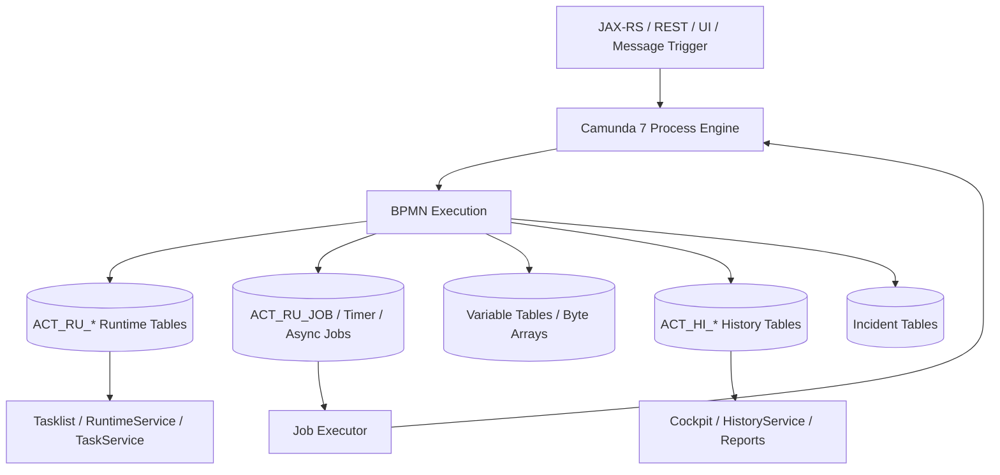

# Part 019 — Camunda 7 Persistence, History, and Database Load

> Fokus part ini: memahami Camunda 7 sebagai **database-backed process engine**. Jika Camunda 7 dipakai di production, database bukan sekadar storage. Database adalah runtime state store, job queue, lock coordination mechanism, history store, audit surface, dan salah satu bottleneck utama sistem.

Di Camunda 7, process engine menyimpan runtime state, job, task, variable, incident, deployment, dan history ke relational database. Ini membuat Camunda 7 sangat cocok untuk deployment Java enterprise klasik, tetapi juga berarti performa workflow sangat dipengaruhi oleh kualitas schema, index, transaction boundary, connection pool, history level, variable size, cleanup policy, dan pola query operasional.

Mental model sederhananya:

```text
Camunda 7 runtime = Java engine + relational database

Java engine:
  - evaluates BPMN
  - invokes delegates/listeners
  - creates jobs/tasks/incidents
  - exposes RuntimeService/TaskService/HistoryService/etc

Database:
  - stores process definitions
  - stores active process instances
  - stores jobs and locks
  - stores process variables
  - stores task state
  - stores incidents
  - stores history/audit data
  - coordinates job executor acquisition
```

Jika proses Anda lambat, stuck, atau gagal, jangan hanya melihat BPMN diagram. Lihat juga database behavior.

---

## 1. Core Mental Model

Camunda 7 persistence bukan detail internal yang bisa diabaikan. Dalam production system, persistence menentukan:

- apakah process instance terlihat setelah request selesai;
- apakah job bisa diambil job executor;
- apakah retry dan incident tercatat;
- apakah user task muncul di Tasklist;
- apakah history bisa diaudit;
- apakah process variable bisa dibaca;
- apakah cleanup berjalan;
- apakah database mulai menjadi bottleneck.

Runtime Camunda 7 dapat dipikirkan seperti ini:



Key idea:

```text
In Camunda 7, SQL writes are part of process execution.
Every variable update, job creation, task transition, incident, and history event can become database pressure.
```

---

## 2. Why Persistence Matters More Than It Looks

A workflow engine gives you long-running state. Long-running state must live somewhere durable. In Camunda 7, that durable store is the relational database.

This has advantages:

- process state survives JVM restart;
- process execution can pause for hours, days, or months;
- user tasks can wait for humans;
- timers can fire later;
- failed jobs can be retried;
- incidents can be inspected;
- history can be audited;
- process instances can be queried.

But it has costs:

- high write amplification;
- many small transactions;
- lock contention;
- variable serialization overhead;
- history table growth;
- cleanup pressure;
- index maintenance cost;
- connection pool contention;
- upgrade/schema migration risk.

For enterprise Quote & Order systems, this matters because workflows are rarely short. Quote approval, order validation, fallout handling, manual intervention, cancellation, amendment, and reconciliation can all become long-running processes with many state transitions.

---

## 3. Camunda 7 Table Family Mental Model

Camunda 7 table names start with `ACT`. The second prefix indicates the table family.

| Prefix | Meaning | Production interpretation |
|---|---|---|
| `ACT_RE_*` | Repository | Static deployed artifacts: process definitions, decision definitions, resources. |
| `ACT_RU_*` | Runtime | Active runtime state: executions, tasks, variables, jobs, incidents, external tasks. |
| `ACT_HI_*` | History | Historical/audit data for completed and running process activity depending on history level. |
| `ACT_GE_*` | General | Shared/general data, often byte arrays and properties. |
| `ACT_ID_*` | Identity | Users, groups, memberships, tenants if internal identity is used. |

Important interpretation:

```text
ACT_RU_* should represent active work.
ACT_HI_* represents recorded history.
ACT_RE_* represents deployed definitions.
ACT_GE_* often contains supporting binary/serialized data.
```

If `ACT_RU_*` grows without bound, you may have active/stuck processes, jobs, tasks, or external tasks that never complete.

If `ACT_HI_*` grows without bound, you may have missing TTL, excessive history level, cleanup not running, or audit retention requirements that need capacity planning.

---

## 4. Repository Tables: Deployment State

Repository tables hold deployed process and decision artifacts.

Typical concerns:

- BPMN deployment count;
- process definition versions;
- deployment resources;
- duplicate deployments;
- version tags;
- old definitions still referenced by running instances;
- process application deployment behavior;
- class/resource mismatch between deployment and application version.

Repository tables are not usually the highest volume tables, but they are critical for versioning.

Example failure mode:

```text
A new BPMN is deployed repeatedly by every app startup.
  -> repository table grows
  -> many process definition versions exist
  -> new process starts latest unexpected version
  -> running instances remain on old version
  -> support team sees inconsistent behavior across instances
```

Review questions:

- Is duplicate deployment filtering enabled where appropriate?
- Does deployment happen once per release or every pod startup?
- Is `processDefinitionKey` stable?
- Are version tags used?
- Can operators tell which BPMN version a process instance is running?

---

## 5. Runtime Tables: Active Process State

Runtime tables store active process data. They are performance-critical because they are used during process execution.

Common runtime concepts:

- process instance;
- execution tree;
- active activity;
- user task;
- job;
- external task;
- variable;
- event subscription;
- incident;
- identity link;
- authorization if enabled.

Runtime tables should stay relatively small compared to history tables because completed process runtime data is removed after process completion.

Production smell:

```text
ACT_RU_* tables keep growing.
```

Possible causes:

- process instances never complete;
- user tasks are aging forever;
- timers are waiting far into the future;
- failed jobs have exhausted retries;
- external tasks are locked and abandoned;
- message correlation never arrives;
- compensation/manual repair path is missing;
- process model intentionally represents long-lived entities but capacity planning ignores it.

---

## 6. Execution Tree and Runtime State

A process instance is not just one row. It may have an execution tree, especially with:

- parallel gateways;
- inclusive gateways;
- subprocesses;
- multi-instance activities;
- event subprocesses;
- boundary events;
- call activities.

Mental model:

```text
one business process instance
  -> one or more runtime executions
  -> zero or more tasks
  -> zero or more jobs
  -> zero or more variables at different scopes
  -> zero or more event subscriptions
```

This matters for debugging. A process can be active even when there is no currently executing Java code. It may be waiting on:

- user task;
- receive task;
- message event;
- timer event;
- external task;
- async continuation job;
- compensation handler;
- child process.

Do not ask only “is the process running?” Ask:

```text
What runtime wait state is this process instance currently persisted at?
```

---

## 7. Job Table as Background Work Queue

In Camunda 7, jobs represent background work for:

- async continuations;
- timers;
- some message continuations;
- batch operations;
- history cleanup.

The job table is effectively a database-backed work queue used by the job executor.

Key fields conceptually include:

- job id;
- process instance id;
- execution id;
- due date;
- retries;
- lock owner;
- lock expiration;
- exception message/details;
- priority if used;
- handler type/configuration.

Production interpretation:

```text
Job exists, due date reached, retries > 0, not locked:
  -> should be acquired.

Job exists, locked by dead node:
  -> wait until lock expiration, then reacquire.

Job exists, retries = 0:
  -> incident likely exists or should exist.

Job does not exist but BPMN expects async/timer:
  -> token may not have reached that point, transaction rolled back, or model is different.
```

---

## 8. Incident Table

Incidents are not “just errors”. They are durable markers that say process execution requires attention.

Common incident causes:

- failed job retries exhausted;
- failed external task retry exhausted;
- failed timer continuation;
- failed async continuation;
- missing deployment/class in delegate execution;
- expression/serialization errors;
- database exception during job execution;
- custom incident handler if implemented.

Incident design matters operationally:

```text
A workflow incident without owner, alert, triage path, and repair procedure is only delayed production failure.
```

Incident review questions:

- Who owns each incident type?
- Which incidents page the team?
- Which incidents are business fallout and which are technical outage?
- Can operators retry safely?
- Is retry idempotent?
- Does the incident message leak sensitive data?
- Can the incident be correlated with quote/order/customer/correlation ID?

---

## 9. Variable Tables and Variable Storage

Process variables are persisted because they are part of process runtime state.

This makes them powerful:

- they can drive gateway decisions;
- they can be used by delegates;
- they can be queried;
- they can be shown in Cockpit;
- they can be used in forms and task completion;
- they can be captured in history.

But process variables are not a replacement for business database tables.

Bad mental model:

```text
Put the whole quote/order JSON into process variables so workflow can use it later.
```

Better mental model:

```text
Put stable workflow context in variables.
Keep authoritative domain state in business tables.
Use IDs and minimal snapshots deliberately.
```

Good candidate variables:

- `quoteId`;
- `orderId`;
- `customerId` if allowed by privacy policy;
- `businessKey`;
- `correlationId`;
- `tenantId`;
- `approvalLevel`;
- `requiresManualReview`;
- `retryableFailureCode`;
- `externalCorrelationKey`.

Risky variables:

- full quote payload;
- full order decomposition result;
- full customer profile;
- access tokens;
- credentials;
- PII-heavy objects;
- large serialized Java objects;
- mutable DTOs tied to application class versions.

---

## 10. Byte Array Table and Large Variable Risk

Large serialized values, BPMN deployment resources, exception stack traces, and binary content may be stored in general/byte-array storage.

Practical risks:

- table bloat;
- slow Cockpit variable inspection;
- expensive history writes;
- expensive backup/restore;
- serialization incompatibility after deployment;
- large object memory pressure during deserialization;
- sensitive data exposure;
- cleanup lag.

A common production anti-pattern:

```text
Every service task updates a large process variable.
History level records each update.
History tables and byte array storage grow quickly.
Cockpit becomes slow.
DB backup size grows.
Cleanup competes with job execution.
```

Safer pattern:

```text
Store canonical large payload in business DB or object storage.
Store only stable references and small workflow decisions in Camunda variables.
```

Example:

```json
{
  "quoteId": "Q-100245",
  "orderId": "O-778120",
  "correlationId": "corr-abc-123",
  "approvalTier": "SENIOR_MANAGER",
  "pricingDecisionVersion": "pricing-approval-v17",
  "requiresLegalReview": true
}
```

---

## 11. Java Serialization Risk

Camunda 7 can serialize Java object variables. This is convenient in embedded Java applications, but dangerous in long-running workflow.

Why:

- process instances can outlive application class versions;
- serialized objects can become unreadable after class refactor;
- classloading differs across nodes;
- REST clients cannot easily understand Java serialized objects;
- Cockpit visibility may be poor;
- security risk increases with Java serialization;
- migration to Camunda 8 becomes harder.

Preferred strategy:

```text
Use primitives and JSON-like typed values for process variables.
Use domain IDs, not full Java DTOs.
Treat variable schema as a versioned external contract.
```

PR review smell:

```java
execution.setVariable("quote", quoteDto);
```

Better:

```java
execution.setVariable("quoteId", quote.getId());
execution.setVariable("approvalTier", decision.getApprovalTier());
execution.setVariable("pricingDecisionVersion", decision.getDecisionVersion());
```

---

## 12. History Tables: Audit and Operational Memory

History tables store historical process data depending on history level. They are used by:

- Cockpit history views;
- HistoryService;
- audit reports;
- troubleshooting;
- compliance evidence;
- process analytics;
- SLA analysis;
- post-incident review.

Typical history data includes:

- historic process instances;
- historic activity instances;
- historic task instances;
- historic variable instances;
- historic variable updates;
- historic job logs;
- historic incidents;
- historic decision instances if DMN is used;
- historic identity links/user operations depending on configuration.

History is valuable, but it is expensive.

Production trade-off:

```text
More history = better audit/debugging + more DB writes/storage/cleanup.
Less history = lower overhead + weaker forensic/debugging ability.
```

---

## 13. History Level

History level determines how much history Camunda records.

Common levels:

| History level | Meaning | Trade-off |
|---|---|---|
| `none` | Minimal/no history | Lowest overhead, weak debugging/audit. |
| `activity` | Activity-level history | Useful for process path analysis, limited variable detail. |
| `audit` | Audit-friendly default in many setups | More useful operationally, more DB writes. |
| `full` | Includes detailed variable updates | Best forensic detail, highest write/storage cost. |

Important operational point:

```text
History level is not just a feature toggle. It changes runtime write volume and storage growth.
```

For enterprise workflow, `audit` or `full` may be requested by compliance or support teams. But the database must be sized accordingly.

Questions to ask:

- What history level is configured?
- Was it selected intentionally?
- Does Cockpit require a higher level for needed views?
- Are variable updates needed for audit, or only final values?
- Is history retention configured?
- Is history cleanup actually running?
- Is this setting consistent across multiple engines sharing the same DB?

---

## 14. History Time To Live and Cleanup

History cleanup prevents history tables from growing forever.

Conceptual flow:

```text
Process/decision definition has TTL
  -> process instance completes
  -> removal time is calculated
  -> history cleanup job eventually deletes expired history rows
```

History cleanup is itself job-executor work. That means cleanup can compete with normal workflow jobs.

Production implication:

```text
Aggressive cleanup parallelism can steal job executor threads and DB connections.
Weak cleanup can cause history tables to grow until queries and backups become painful.
```

Review questions:

- Does every deployed process have history TTL?
- Are long-retention workflows intentionally configured?
- Is cleanup window set to low-traffic hours?
- Is cleanup batch size safe for DB transaction timeouts?
- Is cleanup parallelism safe for connection pool capacity?
- Are old definitions missing TTL?
- Are retention rules aligned with legal/compliance requirements?

---

## 15. Database Load Sources

Camunda 7 database load comes from several paths.

### 15.1 Runtime execution writes

Examples:

- create process instance;
- create/update execution rows;
- create/delete runtime tasks;
- create/update jobs;
- update variables;
- create event subscriptions;
- create incidents.

### 15.2 History writes

Examples:

- process start/end history;
- activity start/end history;
- task history;
- variable history;
- variable update detail;
- job log;
- incident history;
- decision history.

### 15.3 Job executor queries

Examples:

- acquire due jobs;
- lock jobs;
- update retries;
- delete completed jobs;
- create incidents.

### 15.4 Operator queries

Examples:

- Cockpit process search;
- failed job search;
- incident search;
- task search;
- history reports;
- custom operational dashboards.

### 15.5 Cleanup jobs

Examples:

- history cleanup;
- batch operation cleanup;
- custom cleanup.

---

## 16. PostgreSQL-Specific Concerns

If Camunda 7 uses PostgreSQL, watch these concerns:

- connection pool sizing;
- transaction duration;
- lock wait;
- deadlock;
- index bloat;
- table bloat;
- autovacuum behavior;
- slow query plans;
- history table growth;
- large byte arrays;
- backup/restore duration;
- schema migration lock impact;
- query pattern from Cockpit/custom dashboards.

Production smell:

```text
Job executor throughput drops during business hours.
DB CPU high.
ACT_RU_JOB query latency increases.
History cleanup window overlaps with peak load.
```

Possible causes:

- job acquisition query slowed by table/index bloat;
- long-running transactions holding locks;
- cleanup deletes too much per transaction;
- variable history writes too heavy;
- connection pool saturated;
- custom query scans history tables;
- missing/ineffective index for custom reporting query;
- DB maintenance not tuned for write-heavy workload.

Important principle:

```text
Do not add random indexes to Camunda tables casually.
Measure query plans, upgrade impact, write overhead, and vendor support constraints first.
```

---

## 17. MyBatis/JDBC Integration Boundary

In many enterprise Java systems, Camunda 7 is used alongside application database access through JDBC/MyBatis.

Key question:

```text
Does the Camunda engine transaction share the same transaction boundary as the business database update?
```

Possible patterns:

### Pattern A — Shared transaction

```text
JAX-RS request
  -> begin transaction
  -> update business table via MyBatis
  -> call Camunda RuntimeService
  -> Camunda writes runtime tables
  -> commit transaction
```

Advantage:

- business update and process start can commit atomically if using same DB/transaction manager.

Risk:

- transaction becomes longer;
- Camunda and business schema failures rollback together;
- delegate side effects inside same transaction can create confusion;
- scaling is constrained by DB coupling.

### Pattern B — Separate transaction with outbox

```text
Business service commits domain change + outbox event
  -> publisher emits event
  -> workflow starter consumes event
  -> starts/correlates process
```

Advantage:

- clearer distributed boundary;
- better resilience across services;
- aligns with Kafka/RabbitMQ integration.

Risk:

- eventual consistency;
- duplicate event handling required;
- correlation and idempotency must be strong.

### Pattern C — Worker owns local transaction

```text
Camunda job/external task worker
  -> load process variables
  -> begin business DB transaction
  -> perform idempotent state transition
  -> commit
  -> complete job/external task
```

Advantage:

- service task side effects are isolated;
- retry can re-run worker.

Risk:

- DB commit can succeed but job completion can fail;
- idempotency table or state guard is required.

---

## 18. Transaction Mismatch Failure

Classic failure:

```text
Worker performs DB update successfully.
Before completing Camunda job, worker crashes.
Camunda retries job.
Worker performs DB update again.
```

If DB update is not idempotent, you get duplicate side effects.

Safer pattern:

```text
worker receives task/job
  -> derive idempotency key
  -> begin DB transaction
  -> check processed_job table or domain state
  -> if already applied: no-op
  -> else apply state transition
  -> commit
  -> complete Camunda task/job
```

Pseudo-table:

```sql
create table workflow_processed_task (
  task_key varchar(128) primary key,
  process_instance_id varchar(128) not null,
  business_key varchar(128) not null,
  action varchar(128) not null,
  processed_at timestamptz not null default now()
);
```

For Camunda 7 Java delegate, the key could be derived from execution id + activity id + business key. For external task, use external task id plus business id. Be careful: exact strategy depends on the execution pattern.

---

## 19. Database Schema Migration Risk

Camunda 7 schema changes during engine upgrade. Business schema changes can also affect delegates/workers that load domain data.

Two migration tracks exist:

```text
Camunda engine schema migration
Business application schema migration
```

They are related but not the same.

Failure modes:

- engine version incompatible with schema;
- app pods running different Camunda versions against same DB;
- rolling deployment violates Camunda upgrade guidance;
- delegate expects new business column but old process instance reaches old code path;
- variable JSON schema changed but old running instances contain old shape;
- history cleanup fails after schema change;
- custom reports break due to schema changes.

Production rule:

```text
Treat Camunda schema as vendor-managed. Treat process variables as versioned contracts. Treat worker/business schema evolution as backward-compatible until old instances drain or migrate.
```

---

## 20. What Not To Do With Camunda Database

Avoid these practices:

- manually update runtime tables to “fix” process state;
- delete incidents directly from DB;
- delete jobs directly from DB;
- edit variable byte arrays manually;
- build business logic that depends on internal Camunda table shape;
- create unreviewed custom reports that scan large history tables during peak hours;
- use Camunda runtime tables as integration API;
- assume table structure is stable across versions;
- bypass RuntimeService/TaskService/ManagementService for state changes.

Safer alternatives:

- use engine API;
- use Cockpit operations where appropriate;
- use migration/modification API where supported;
- use documented REST/Java APIs;
- take backup before repair;
- rehearse repair in lower environment;
- log every manual operation;
- involve platform/SRE/DBA when DB-level operation is unavoidable.

---

## 21. Production Debugging: Database-Oriented Checklist

When a Camunda 7 process appears stuck:

1. Identify business key / process instance id.
2. Identify process definition key and version.
3. Check current active activity/wait state using API/Cockpit.
4. Check active jobs for the instance.
5. Check failed jobs and retries.
6. Check incidents.
7. Check user tasks.
8. Check event subscriptions.
9. Check variables required for gateway/message correlation.
10. Check history trail for last completed activity.
11. Check job executor health.
12. Check DB slow queries, locks, connection pool, and CPU.
13. Check whether cleanup/backup/reporting is competing with runtime execution.

Do not jump immediately to retry. First classify the failure.

```text
Retry is safe only if the failed step is idempotent or protected by a state guard.
```

---

## 22. Example: Quote Approval Runtime Footprint

Imagine quote approval process:

```text
Start quote approval
  -> calculate approval level
  -> wait for sales manager task
  -> if discount high, wait for finance task
  -> publish quote-approved event
  -> end
```

Runtime footprint while waiting for sales manager:

- active process instance;
- execution at user task;
- runtime task row;
- process variables like `quoteId`, `approvalLevel`, `correlationId`;
- maybe timer job for SLA boundary event;
- history rows for start and previous service task;
- maybe identity links for candidate group.

When manager completes task:

- task runtime row removed;
- history task updated;
- variables may be updated;
- gateway condition evaluated;
- new finance task or publish event job created.

This is why a “simple approval” is not one row.

---

## 23. Example: Large Variable Anti-Pattern

Bad pattern:

```java
public void execute(DelegateExecution execution) {
  Quote quote = quoteRepository.loadFullQuote(quoteId);
  execution.setVariable("quote", quote);
}
```

Risk:

- Java serialization;
- class version coupling;
- large DB payload;
- history bloat;
- Cockpit deserialization issue;
- PII exposure;
- migration pain.

Better:

```java
public void execute(DelegateExecution execution) {
  Quote quote = quoteRepository.loadForDecision(quoteId);

  execution.setVariable("quoteId", quote.getId());
  execution.setVariable("discountPercent", quote.getDiscountPercent());
  execution.setVariable("approvalTier", approvalPolicy.resolveTier(quote));
  execution.setVariable("approvalPolicyVersion", approvalPolicy.version());
}
```

Even better for sensitive fields:

```text
Store sensitive details in business DB.
Expose only decision result and stable reference in workflow variable.
```

---

## 24. Observability Signals

Monitor at least:

- active process instance count;
- runtime table row growth;
- failed job count;
- incident count by process definition/activity;
- job acquisition latency;
- job executor throughput;
- job retries exhausted;
- timer backlog;
- external task locked/expired counts;
- task aging;
- history table growth;
- cleanup duration/failure;
- DB connection pool usage;
- slow query count;
- DB lock wait/deadlock count;
- byte array table growth;
- backup duration.

Useful derived metrics:

```text
incident_rate = incidents_created / process_instances_started
retry_exhaustion_rate = jobs_with_zero_retries / jobs_created
task_aging_p95 = p95(now - task_created_at)
history_growth_per_day = history_table_size_today - history_table_size_yesterday
job_backlog_age_p95 = p95(now - due_date for due unlocked jobs)
```

---

## 25. Security and Privacy Concerns

Persistence means data lives beyond execution.

Check for:

- PII in process variables;
- PII in history variable updates;
- PII in user task forms;
- secrets in process variables;
- credentials in exception messages;
- stack traces in byte arrays/history;
- incident messages exposing customer data;
- Cockpit access too broad;
- direct DB access by analysts/operators;
- retention policy mismatch.

Rule:

```text
If a value would be unsafe in logs, think twice before putting it in process variables.
```

---

## 26. Performance Review Checklist

For a BPMN or worker PR, ask:

- Does this introduce more variable updates?
- Does it store large object variables?
- Does it use Java serialized objects?
- Does it add high-volume async boundaries?
- Does it add timers for every instance?
- Does it increase history volume?
- Does it add multi-instance parallelism?
- Does it add Cockpit/custom queries over large tables?
- Does it create long-running transactions?
- Does it depend on direct database table access?
- Does it have cleanup/retention configured?
- Does it have dashboard coverage?

---

## 27. Internal Verification Checklist

Use this checklist in CSG/team context. Do not assume details without verifying.

### Version and deployment

- Verify whether Camunda 7 is used at all.
- Verify Camunda 7 version and edition.
- Verify whether engine is embedded, shared, remote, or Camunda Run.
- Verify whether multiple services share the same Camunda DB.
- Verify process deployment strategy.
- Verify schema upgrade procedure.

### Database

- Verify database engine: PostgreSQL, Oracle, SQL Server, etc.
- Verify DB version and compatibility.
- Verify connection pool configuration.
- Verify DB owner: app team, platform, DBA, customer, managed cloud service.
- Verify backup/restore procedure.
- Verify PITR requirements.
- Verify maintenance windows.

### Runtime tables

- Check active process instance count.
- Check active user task count.
- Check active job count.
- Check failed job count.
- Check incident count.
- Check external task count if external tasks are used.
- Check event subscription count for message/timer usage.

### History

- Verify configured history level.
- Verify whether history level was chosen intentionally.
- Verify history TTL per process/decision definition.
- Verify history cleanup strategy.
- Verify cleanup window.
- Verify cleanup failures.
- Verify retention/compliance requirements.

### Variables

- Inspect common process variables.
- Check for large payload variables.
- Check for Java serialized objects.
- Check for PII/sensitive fields.
- Check variable naming convention.
- Check variable versioning strategy.
- Check variable compatibility across running process versions.

### Operations

- Verify Cockpit usage.
- Verify custom dashboards.
- Verify incident alerting.
- Verify job executor metrics.
- Verify DB slow query dashboards.
- Verify manual repair procedures.
- Verify who can retry jobs or modify process instances.

### Integration with business DB

- Verify whether Camunda DB and business DB are the same database.
- Verify transaction boundary with MyBatis/JDBC.
- Verify idempotency table or state transition guard.
- Verify outbox/inbox usage.
- Verify failure behavior after DB commit but before task completion.

---

## 28. Senior Engineer Review Heuristics

Use these heuristics during PR/architecture review:

```text
If process variable grows with business payload size, challenge it.
If history level is full, ask for storage and cleanup plan.
If retry can repeat DB/API side effect, ask for idempotency proof.
If process state and DB state duplicate each other, ask for source of truth.
If direct SQL touches Camunda tables, ask why engine API is not enough.
If old process instances can reach new code, ask for backward compatibility.
If history cleanup is disabled, ask for retention and capacity plan.
If incidents are expected, ask who owns them operationally.
```

---

## 29. Production Failure Modes

| Failure mode | Symptom | Likely cause | First safe action |
|---|---|---|---|
| Runtime table grows | Many active instances/tasks/jobs | Stuck processes, aging tasks, missing messages | Identify wait states by process definition/activity. |
| History table grows | DB storage rising | Missing TTL, cleanup disabled, high history level | Check TTL and cleanup job health. |
| Job backlog | Due jobs not executed | Executor down, DB slow, lock contention | Check job executor, due jobs, locks, DB latency. |
| Incidents spike | Processes failing | Delegate/worker/downstream/serialization error | Group incidents by activity and root exception. |
| Cockpit slow | UI queries hang | Huge history/runtime tables, slow DB | Check DB load and query patterns. |
| Variable deserialization fails | Delegate/Cockpit error | Java class changed or missing | Avoid retry loops; inspect variable type/version. |
| Cleanup fails | History keeps growing | Cleanup transaction timeout, DB load | Lower batch size/window; inspect cleanup job exception. |
| DB connection exhausted | App/engine slowdown | Job executor, cleanup, Cockpit, custom queries | Check pool usage and long transactions. |

---

## 30. Minimal Production Readiness Checklist

Before a Camunda 7 workflow is considered production-ready:

- process definition versioning is understood;
- business key/correlation ID is present;
- variables are small and intentional;
- no sensitive data is stored unnecessarily;
- history level is selected deliberately;
- history TTL is configured;
- cleanup is monitored;
- job executor is monitored;
- incidents are monitored;
- failed jobs have owner/runbook;
- DB connection pool is sized;
- slow queries and table growth are observable;
- worker/delegate side effects are idempotent;
- process and business DB state consistency is defined;
- upgrade/schema migration procedure exists;
- direct DB modifications are prohibited except emergency runbook.

---

## 31. Key Takeaways

- Camunda 7 is deeply database-backed.
- Runtime tables are active state; history tables are operational/audit memory.
- History level is an architecture decision, not a cosmetic setting.
- Process variables are persisted contracts, not temporary Java locals.
- Large variables and Java serialization create long-term production risk.
- History cleanup competes for job executor and DB resources.
- Database load is driven by process complexity, variable updates, jobs, timers, tasks, history, and operator queries.
- Workflow correctness depends on transaction boundary and idempotency around business DB updates.
- Senior engineers should review persistence implications of every BPMN/worker change.

---

## 32. References

- Camunda 7 Database Schema: https://docs.camunda.org/manual/latest/user-guide/process-engine/database/database-schema/
- Camunda 7 History Configuration: https://docs.camunda.org/manual/latest/user-guide/process-engine/history/history-configuration/
- Camunda 7 History Cleanup: https://docs.camunda.org/manual/latest/user-guide/process-engine/history/history-cleanup/
- Camunda 7 Process Variables: https://docs.camunda.org/manual/latest/user-guide/process-engine/variables/
- Camunda 7 Job Executor: https://docs.camunda.org/manual/latest/user-guide/process-engine/the-job-executor/
