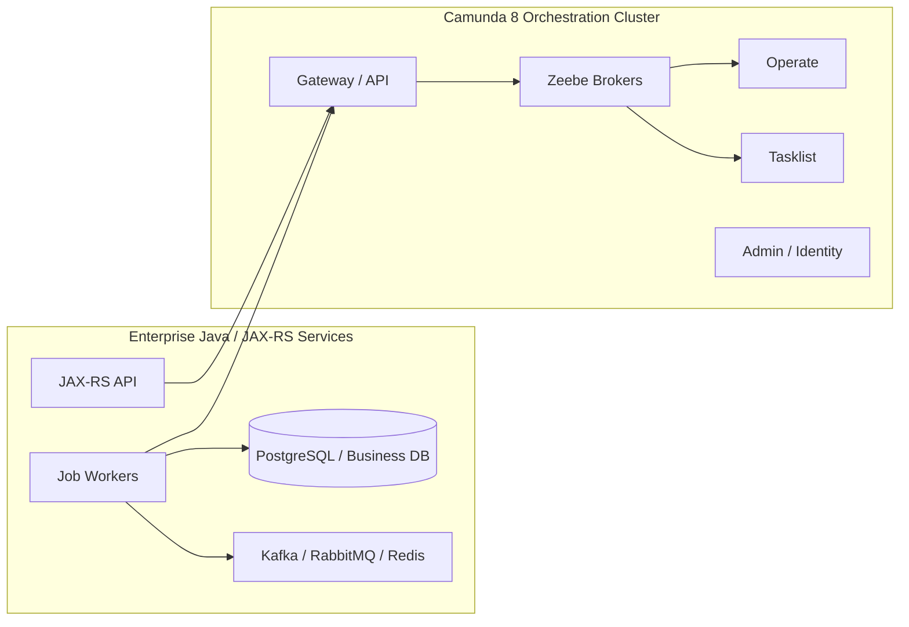
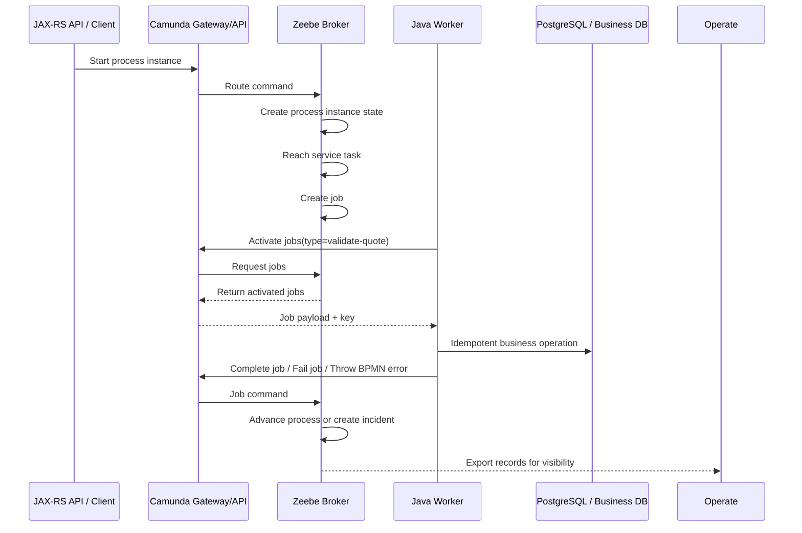
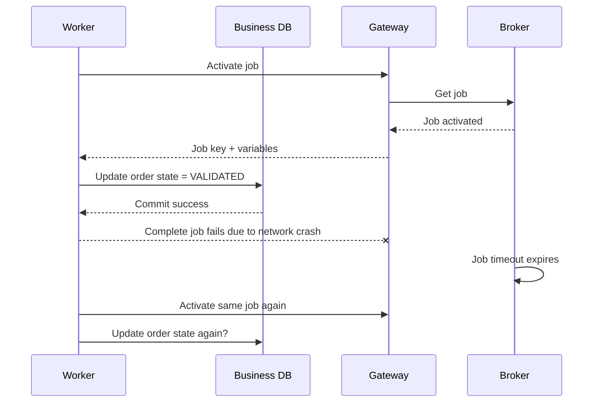
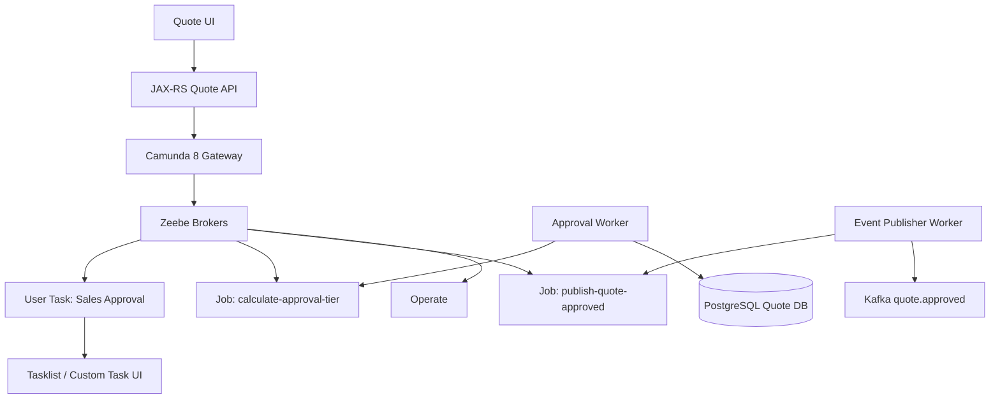

# Part 020 — Camunda 8 and Zeebe Architecture Deep Dive

> Fokus part ini: memahami Camunda 8 sebagai **distributed process orchestration platform**, bukan embedded Java process engine. Jika Camunda 7 mental model Anda adalah “Java engine + relational database”, maka Camunda 8/Zeebe mental model Anda harus menjadi “remote orchestration cluster + log/partition-based execution + external workers + exported operational views”.

Camunda 8 berbeda secara fundamental dari Camunda 7. Camunda 8 tidak menjalankan Java delegate di dalam process engine. Business logic hidup di worker, connector runtime, atau external service. Zeebe broker menjaga state proses, membuat job, mengelola partition, memproses command, dan mengekspor record untuk tooling seperti Operate/Tasklist/Optimize.

Mental model singkat:

```text
Camunda 8 / Zeebe = remote orchestration platform

Clients:
  - deploy process
  - start process instance
  - correlate message
  - activate/complete/fail jobs

Gateway/API:
  - entry point for clients
  - routes commands to brokers/partitions

Brokers:
  - process BPMN commands
  - maintain active process state
  - create jobs
  - assign work to workers
  - replicate partition state
  - export records

Workers:
  - run business/application logic
  - call Java/JAX-RS services, DB, Kafka, RabbitMQ, Redis, external APIs
  - complete/fail jobs

Operate/Tasklist/Optimize:
  - operational views, human task surfaces, analytics
```

---

## 1. The Most Important Mental Shift

In Camunda 7, you may embed the process engine in a Java application and run Java delegates in the same JVM.

In Camunda 8, treat the engine as a remote distributed system.



Key principle:

```text
No business logic should live inside the Zeebe broker.
Business logic belongs in workers, services, connectors, or domain applications.
```

This affects everything:

- transaction boundaries;
- retry strategy;
- worker idempotency;
- deployment topology;
- network reliability;
- authorization;
- observability;
- Kubernetes scaling;
- incident response;
- migration from Camunda 7.

---

## 2. Camunda 8 Component Map

Camunda 8 commonly includes these conceptual components:

| Component | Role | Senior engineer concern |
|---|---|---|
| Zeebe Broker | Distributed workflow engine/state processor | Partition health, replication, log, state, backpressure, exporter. |
| Gateway / API | Entry point for clients/workers | Load balancing, gRPC/REST, authentication, routing, network path. |
| Job Worker | External application logic executor | Idempotency, concurrency, timeout, retries, safe shutdown. |
| Operate | Operational monitoring UI | Incidents, process instance visibility, repair workflow. |
| Tasklist | Human task UI/API | Assignment, authorization, SLA, task completion semantics. |
| Optimize | Analytics/reporting | Export pipeline load, search/storage cost, process insight. |
| Admin / Identity | Access and authorization | Users, groups, tenants, service accounts, OIDC. |
| Connectors | Reusable integration tasks | Secret handling, reliability, custom worker trade-off. |
| Elasticsearch/OpenSearch/RDBMS/export storage | Secondary storage / read model | Sizing, backup, retention, query performance, data lag. |

Terminology can vary by version and deployment mode. In newer Camunda 8 self-managed architecture, documentation refers to the Orchestration Cluster and separates cluster-level access/admin concerns from broader platform management concerns. Always verify the exact version and packaging used internally.

---

## 3. High-Level Runtime Flow

A typical service task flow in Camunda 8:



Important:

```text
The broker does not call your Java code.
Your worker calls Camunda to activate jobs and report results.
```

This reduces engine/application coupling but introduces distributed systems concerns.

---

## 4. Clients

Clients interact with Camunda 8 through APIs. Typical client actions:

- deploy process;
- start process instance;
- publish/correlate message;
- activate jobs;
- complete jobs;
- fail jobs;
- throw BPMN errors;
- update variables;
- query/operate through API depending on component;
- complete human tasks through Tasklist API.

In a Java/JAX-RS backend, clients can appear in several places:

- REST endpoint starts process;
- scheduled/reconciliation job correlates message;
- Kafka consumer starts process;
- RabbitMQ consumer publishes message to workflow;
- Zeebe worker completes service tasks;
- admin tool retries or cancels instances.

Review question:

```text
Is this code acting as business API, workflow client, worker, operator tool, or integration adapter?
```

Those roles should not be mixed casually.

---

## 5. Gateway/API Layer

The gateway is the contact point for Zeebe clients. It receives client requests and routes them to brokers/partitions.

Conceptually:

```text
Client/worker -> Gateway/API -> Broker/Partition
```

Gateway responsibilities:

- provide API endpoint;
- route commands;
- hide broker topology from clients;
- help with load balancing/high availability;
- terminate/authenticate traffic depending on deployment;
- expose REST/gRPC depending on version/configuration.

Gateway is not where business logic belongs.

Production concerns:

- gateway endpoint DNS/service discovery;
- ingress/load balancer;
- mTLS/TLS/OIDC/client credentials;
- gRPC HTTP/2 support if used;
- network path from worker pods to gateway;
- gateway saturation;
- API version compatibility;
- timeouts between workers and gateway.

Failure symptoms:

- workers cannot activate jobs;
- process start requests timeout;
- message publication fails;
- gateway health check fails;
- intermittent network errors during rolling deployment;
- client library mismatch after platform upgrade.

---

## 6. Brokers

Zeebe brokers are the core distributed workflow engine components.

Broker responsibilities:

- process commands;
- store/manage active process instance state;
- create jobs;
- assign jobs to workers;
- handle timers/messages/incidents;
- replicate partition state;
- export records to secondary storage.

A broker is not:

- a Java delegate runtime;
- a business service;
- a SQL database replacement;
- a Kafka broker;
- a general task queue;
- a rules engine.

Operationally, broker health is central. If broker partitions are unhealthy, process execution may degrade or stop for affected partitions.

---

## 7. Partitions

A partition is a unit of Zeebe processing/state distribution. Partitions allow horizontal scalability and fault-tolerance through replication.

Mental model:

```text
Process instances are distributed over partitions.
Each partition has a leader and followers.
Commands for a process instance are processed by the responsible partition.
```

Why partitions matter:

- throughput scaling;
- fault isolation;
- leader election;
- replication;
- job distribution;
- backpressure;
- operational health.

Production review questions:

- How many partitions are configured?
- What is the replication factor?
- How many brokers exist?
- Is each partition healthy?
- Does every partition have exactly one leader?
- Are followers healthy enough for quorum?
- Are certain partitions hotter than others?
- Is partition count compatible with expected throughput?

Important caveat:

```text
Increasing partition count is a capacity decision. It affects operations, backup, monitoring, and routing. Do not treat it like a simple thread count.
```

---

## 8. Log Stream, Records, and State

Zeebe is built around a log/record processing model. At a simplified level:

```text
client command -> append/process record -> update state -> emit/export records
```

You do not need to implement Zeebe internals, but you do need the mental model because it explains:

- why execution is asynchronous;
- why operational views depend on exported records;
- why exporter lag matters;
- why backup needs coordination;
- why partition health matters;
- why duplicate worker execution must be handled;
- why Operate/Tasklist may have read-model delay.

Practical interpretation:

```text
Broker state is the execution truth.
Operate/Tasklist/search indices are operational read models built from exported data.
```

This means a UI/read model delay is not always the same as process execution failure.

---

## 9. Jobs

In Camunda 8, service tasks and similar automated work create jobs. Workers activate and complete/fail them.

Job contains conceptually:

- job key;
- process instance key;
- element instance key;
- process definition key;
- job type;
- variables or variable subset;
- custom headers;
- retries;
- timeout;
- worker name;
- BPMN element id.

The worker lifecycle:

```text
activate job
  -> perform work
  -> complete job with variables
  OR fail job with retries/backoff
  OR throw BPMN error
```

Production interpretation:

```text
A Zeebe job is an execution request, not proof that side effects have happened.
Side effects happen only when the worker performs them.
```

---

## 10. Workers

Workers are external applications. In a Java/JAX-RS enterprise environment, workers may be:

- embedded in existing backend service;
- separate worker microservice;
- Spring Boot worker;
- Quarkus/Micronaut worker;
- plain Java process;
- containerized Kubernetes deployment;
- adapter around Kafka/RabbitMQ/REST systems;
- connector runtime for simpler integrations.

Worker design concerns:

- job type naming;
- max jobs active;
- concurrency;
- timeout;
- retry count;
- backoff;
- idempotency;
- deduplication;
- variable mapping;
- correlation ID propagation;
- business DB transaction;
- external API timeout;
- event publishing;
- graceful shutdown;
- deployment compatibility.

Golden rule:

```text
Every worker must be safe to run more than once for the same business action.
```

Why? Because failure can happen after side effect but before job completion.

---

## 11. Worker Side Effect Failure Timeline

Classic failure:



If the DB operation is not idempotent, this creates duplicate side effects.

Safer worker:

```text
derive idempotency key
begin DB transaction
if action already applied:
  no-op
else:
  apply transition with optimistic lock / unique constraint
commit
complete job
```

For quote/order workflows, this is non-negotiable.

---

## 12. Operate

Operate is the operational visibility surface for process instances and incidents.

Use Operate to inspect:

- process instance state;
- active/failing element;
- incidents;
- variables;
- process definition/version;
- timeline/execution path;
- failed jobs;
- repair/retry operations depending on permissions/version.

Production concern:

```text
Operate visibility depends on exported/indexed data. If exporter/search is lagging or unhealthy, Operate may be stale even while broker execution continues.
```

Debugging question:

```text
Is the process stuck in broker execution, or is Operate's read model delayed?
```

---

## 13. Tasklist

Tasklist is the human task surface.

Tasklist concerns:

- user task visibility;
- assignment;
- candidate groups;
- claiming/unclaiming;
- completion;
- form data;
- authorization;
- stale task views;
- task aging;
- SLA handling;
- identity integration.

In enterprise systems, you may use:

- Camunda Tasklist UI;
- Tasklist API with custom UI;
- internal operations UI backed by Camunda task APIs;
- hybrid model.

Internal verification matters. Do not assume CSG uses Tasklist just because user tasks exist.

---

## 14. Optimize

Optimize provides analytics and process insights. It can help answer:

- where bottlenecks occur;
- how long approvals take;
- which paths are most common;
- which tasks breach SLA;
- where incidents cluster;
- which process versions perform differently.

But Optimize is not free. Analytics increases storage and query load. Variable-heavy analytics can become expensive.

Review questions:

- Is Optimize enabled?
- Which variables are exported/analyzed?
- Are sensitive variables excluded?
- Does Optimize share Elasticsearch/OpenSearch with Operate/Tasklist?
- Is Optimize import lag monitored?
- Are analytics needs worth the storage/CPU cost?

---

## 15. Identity, Admin, and Authorization

Camunda 8 authorization depends on version and deployment architecture. In recent self-managed architecture, cluster-level Admin handles access for Orchestration Cluster components, while broader platform management may involve Management Identity for components like Web Modeler, Console, and Optimize.

Do not rely on generic assumptions. Verify internally:

- authentication mode;
- OIDC provider;
- service account/client credentials;
- user/group mapping;
- tenant configuration;
- worker permissions;
- API access policy;
- admin privileges;
- task permissions;
- variable visibility.

Security concern:

```text
A worker credential that can start any process, complete any job, and read all variables is a high-impact secret.
```

---

## 16. Connectors

Connectors are reusable integration building blocks.

Possible connector uses:

- HTTP call;
- webhook/inbound trigger;
- Kafka/RabbitMQ integration if available and used;
- SaaS integration;
- custom connector templates;
- connector runtime deployment.

Connector vs custom worker decision:

| Use connector when | Use custom worker when |
|---|---|
| Integration is simple and standardized. | Logic is domain-heavy. |
| Secret/template can be governed safely. | You need custom retry/idempotency semantics. |
| Team wants low-code modelled integration. | You need advanced observability and testability. |
| Failure behavior is acceptable. | Failure behavior must be explicitly controlled. |

Review question:

```text
Would this connector be safe if called twice? If not, how is idempotency enforced?
```

---

## 17. Exporters and Secondary Storage

Zeebe exports records so other components can build read models and analytics.

Export targets can include:

- Elasticsearch;
- OpenSearch;
- Camunda exporter;
- RDBMS depending on version/configuration;
- custom exporters.

Exporter mental model:

```text
Broker execution emits records.
Exporters ship records to secondary storage.
Operate/Tasklist/Optimize read from secondary storage/read models.
```

Failure modes:

- exporter lag;
- exporter failure;
- search cluster unavailable;
- index retention deletes records before analytics import;
- broker disk usage grows because export position cannot advance;
- Operate/Tasklist stale;
- backup inconsistent if components are backed up independently.

Production rule:

```text
Do not treat search/read model health as optional. It is part of operational visibility.
```

---

## 18. Elasticsearch/OpenSearch Dependency

Camunda 8 self-managed often depends on Elasticsearch/OpenSearch or another configured secondary storage path for operational views and analytics.

Concerns:

- index sizing;
- shard count;
- disk usage;
- CPU usage;
- retention;
- backup/snapshot;
- query latency;
- exporter lag;
- cluster health;
- version compatibility;
- sensitive variable indexing;
- multi-environment isolation.

Production smell:

```text
Zeebe is healthy, but Operate is delayed or failing.
```

Possible cause:

```text
Secondary storage/export/read model issue, not necessarily broker execution issue.
```

---

## 19. Backup and Restore Architecture

Camunda 8 backup is more complex than a simple database dump because state is distributed across:

- Zeebe broker partition data;
- Operate data;
- Tasklist data;
- Optimize data if used;
- search indices;
- Web Modeler data if used;
- identity/admin data depending on deployment.

Backup must be coordinated. Taking independent disk snapshots without component awareness can produce inconsistent restore points.

Review questions:

- What is RPO/RTO?
- Are Zeebe backups configured?
- Are Operate/Tasklist/Optimize backups configured?
- Is Elasticsearch/OpenSearch snapshot configured?
- Are backups tested by restore drill?
- Who owns restore procedure?
- Does backup cover secrets/configuration as well as data?

---

## 20. Self-Managed vs SaaS/Cloud

Camunda 8 can be consumed as SaaS/cloud or deployed self-managed.

### SaaS/cloud mental model

You operate:

- workers;
- clients;
- integration services;
- process models;
- identity integration/client credentials;
- business observability;
- incident response around your processes.

Camunda operates much of the platform infrastructure.

### Self-managed mental model

You operate:

- Orchestration Cluster;
- brokers/gateways;
- storage/search dependencies;
- backup/restore;
- upgrades;
- network/security;
- Kubernetes/VM deployment;
- observability stack;
- workers and clients.

Decision factor:

```text
Self-managed gives deployment control but increases platform operations responsibility.
SaaS reduces platform burden but adds cloud dependency, networking, compliance, and tenancy considerations.
```

---

## 21. Kubernetes Topology

In Kubernetes, Camunda 8 architecture often maps to:

- StatefulSet for brokers/stateful cluster components;
- Deployment for gateways/API components where stateless;
- Deployment for Operate/Tasklist/Admin depending on packaging/version;
- Deployment for connector runtime;
- Deployment/HPA for workers;
- PersistentVolume for broker data where required;
- Service for internal communication;
- Ingress/load balancer for external/API access;
- ConfigMap/Secret for configuration;
- NetworkPolicy for restricted traffic;
- PodDisruptionBudget for availability;
- anti-affinity for broker distribution;
- resource requests/limits for predictable scheduling.

Production questions:

- Are brokers scheduled across nodes/availability zones?
- Are persistent volumes sized and backed up?
- Are resource limits too tight?
- Are liveness/readiness probes correct?
- Can workers reach gateway during rolling upgrade?
- Does HPA scale workers based on useful metrics?
- Are network policies blocking gRPC/REST traffic?

---

## 22. AWS/Azure/On-Prem/Hybrid Implications

Camunda 8 architecture touches cloud/platform choices.

### AWS concerns

- EKS topology;
- VPC/subnet routing;
- security groups;
- IAM/service account mapping;
- OpenSearch or self-managed search;
- S3 backup repository;
- CloudWatch logging/metrics;
- private endpoints;
- Route 53/load balancer;
- RDS if RDBMS components are used.

### Azure concerns

- AKS topology;
- VNet/NSG;
- managed identity;
- Key Vault;
- Azure Monitor;
- Azure Database if RDBMS components are used;
- Blob storage backup;
- Application Gateway/private endpoint;
- managed search equivalent or self-managed search.

### On-prem/hybrid concerns

- firewall paths;
- TLS/internal CA;
- air-gapped deployment;
- patching;
- backup storage;
- monitoring stack;
- worker connectivity across network boundary;
- latency between workers and orchestration cluster;
- customer/platform responsibility boundary.

---

## 23. Message and Event Integration

Camunda 8 often sits between APIs, services, and event streams.

Common patterns:

- REST API starts process;
- Kafka event starts process;
- RabbitMQ command starts process;
- external system callback correlates message;
- process step publishes Kafka event via worker;
- process step sends RabbitMQ command;
- process waits for message from fulfillment system.

Architecture concern:

```text
Camunda 8 orchestrates process state. Kafka/RabbitMQ transport events/commands. PostgreSQL stores domain truth. Redis may support cache/idempotency/rate limit. Do not collapse all responsibilities into workflow variables.
```

---

## 24. Correlation and Business Keys

In Camunda 8, process instance keys are engine-generated technical identifiers. Business systems need stable business identifiers.

Use deliberate identifiers:

- `quoteId`;
- `orderId`;
- `customerAccountId` if allowed;
- `tenantId`;
- `businessKey` concept if implemented at application level;
- `correlationId`;
- `messageCorrelationKey`;
- `externalRequestId`.

Review questions:

- Can every process instance be mapped to quote/order?
- Can every worker log be mapped to process instance key and business key?
- Can every Kafka/RabbitMQ message be correlated to workflow?
- Can Operate incident be mapped to customer impact?
- Are correlation keys stable across retries and process versions?

---

## 25. Variables and Payload Strategy

Camunda 8 variables are JSON-like process data. Avoid using variables as a dumping ground.

Good variable strategy:

```text
small, stable, explicit, versioned, non-sensitive where possible
```

Bad strategy:

```text
large quote/order payload copied at every process step
```

Variable concerns:

- payload size;
- worker activation payload;
- network transfer;
- search/export cost;
- Operate visibility;
- Optimize analytics overhead;
- sensitive data exposure;
- compatibility across worker versions;
- migration difficulty.

Worker input pattern:

```text
variables contain IDs and decision flags
worker loads authoritative data from business DB/service
worker writes small result variables back
```

---

## 26. Backpressure and Flow Control

Distributed orchestration systems need backpressure. Backpressure protects the cluster from being overloaded.

Backpressure can appear as:

- rejected/throttled client commands;
- activation delays;
- process start latency;
- message correlation latency;
- exporter lag;
- high broker CPU/disk;
- search cluster overload;
- worker saturation.

Do not solve every latency issue by increasing worker concurrency. Sometimes the bottleneck is:

- broker partition capacity;
- gateway saturation;
- exporter/search lag;
- downstream database;
- external API rate limit;
- network latency;
- worker CPU;
- variable payload size.

Architecture rule:

```text
Scale the bottleneck, not the symptom.
```

---

## 27. Version Compatibility

Camunda 8 versions matter across:

- orchestration cluster components;
- client libraries;
- worker SDKs;
- Spring Zeebe/Spring Boot starter;
- connector runtime;
- Operate/Tasklist/Admin/Identity;
- exporters;
- APIs.

Recent Camunda 8 architecture has stricter component compatibility expectations across orchestration cluster components. Always verify exact version matrix before upgrading.

Review questions:

- Are all cluster components on compatible versions?
- Are Java clients compatible with cluster version?
- Are workers deployed with compatible SDK?
- Are connector templates/runtime compatible?
- Are API changes tested?
- Is rollback possible?

---

## 28. Migration Contrast With Camunda 7

Do not migrate Camunda 7 to Camunda 8 by “changing dependencies”.

Major differences:

| Camunda 7 | Camunda 8 / Zeebe |
|---|---|
| Java process engine | Distributed orchestration cluster |
| Embedded/shared engine possible | Remote engine model |
| JavaDelegate inside engine JVM | External job workers |
| Relational DB runtime | Broker state/log/partition model |
| Job executor | Job activation by workers |
| Cockpit | Operate |
| Tasklist 7 | Tasklist 8 |
| Java object variables common in some apps | JSON-like variable model preferred |
| DB-backed history | Exported read models/search/analytics |

Migration impact:

- JavaDelegate must become worker or connector;
- transaction boundary changes;
- variable serialization changes;
- incidents/tooling differ;
- deployment pipeline changes;
- operational runbook changes;
- worker topology becomes mandatory;
- running instance migration is not trivial.

---

## 29. Example: Quote Approval in Camunda 8

Architecture sketch:



Important boundaries:

- Quote API starts process and returns 202/accepted style response.
- Worker loads quote from PostgreSQL by `quoteId`.
- User task assignment must use identity/group mapping.
- Event publisher worker uses outbox or idempotent publish strategy.
- Operate incident must map to `quoteId` and `correlationId`.
- Sensitive quote/customer details should not be dumped into variables.

---

## 30. Production Failure Modes

| Failure mode | Symptom | Likely cause | First safe action |
|---|---|---|---|
| Worker not receiving jobs | Job backlog, no worker activity | Wrong job type, gateway/network/auth issue, worker down | Verify job type, worker logs, gateway connectivity. |
| Job repeatedly fails | Incident or retry exhaustion | Worker exception, downstream failure, bad variables | Group by BPMN element and error code. |
| Operate stale | UI does not show latest state | Exporter/search lag | Check exporter and secondary storage health. |
| Process start timeout | API/client timeout | Gateway/broker/backpressure/network | Check gateway and broker metrics. |
| Partition unhealthy | Requests timeout for affected instances | broker/quorum/disk/network issue | Escalate platform/SRE; do not retry blindly. |
| Search storage full | Operate/Tasklist/Optimize failures | retention/sizing issue | Protect cluster, expand/cleanup per runbook. |
| Duplicate side effect | Duplicate event/order update | Worker retried after side effect | Add idempotency guard and repair business state. |
| Authorization failure | Worker/API denied | credential/tenant/scope change | Verify client credentials and permissions. |
| Upgrade breaks workers | Activation/complete errors | client SDK/API mismatch | Check version matrix, rollback/upgrade workers. |

---

## 31. Observability Signals

Monitor:

- broker health;
- gateway health;
- partition leader/follower status;
- replication health;
- command latency;
- job activation latency;
- job completion/failure rate;
- incidents by process/activity;
- worker throughput;
- worker failure rate;
- worker timeout rate;
- worker concurrency/max active jobs;
- exporter lag;
- Operate/Tasklist health;
- Elasticsearch/OpenSearch health;
- search disk usage;
- backpressure;
- process instance start rate;
- message correlation failure;
- variable payload size;
- task aging/SLA breach.

Correlate logs using:

- process instance key;
- job key;
- element id;
- job type;
- business key/quoteId/orderId;
- correlation ID;
- tenant ID;
- worker name;
- deployment version.

---

## 32. Security Review

Review:

- TLS/mTLS between workers and gateway;
- OIDC/client credentials;
- service account scope;
- secret storage;
- connector secrets;
- user/group/task authorization;
- tenant isolation;
- sensitive process variables;
- Operate variable visibility;
- Tasklist form data exposure;
- logs from workers;
- incident messages;
- audit trail.

Security smell:

```text
All workers share one admin credential.
```

Better:

```text
Workers use scoped service accounts aligned to environment, tenant, and responsibility.
```

---

## 33. Internal Verification Checklist

Use this for CSG/team verification. Do not assume internal architecture.

### Platform/version

- Verify whether Camunda 8 is used.
- Verify exact Camunda 8 version.
- Verify SaaS/cloud vs self-managed.
- Verify whether Orchestration Cluster packaging is used.
- Verify component version matrix.
- Verify client SDK versions.

### Zeebe topology

- Verify broker count.
- Verify gateway count.
- Verify partition count.
- Verify replication factor.
- Verify leader/follower health.
- Verify backpressure metrics.
- Verify broker disk and resource limits.

### Worker topology

- List worker services.
- Map BPMN job types to worker deployments.
- Verify worker concurrency and max jobs active.
- Verify worker timeout/retry settings.
- Verify idempotency implementation.
- Verify graceful shutdown on Kubernetes rolling deploy.

### Operate/Tasklist/Optimize

- Verify Operate usage.
- Verify Tasklist usage or custom task UI.
- Verify Optimize usage.
- Verify search/index dependency.
- Verify exporter lag monitoring.
- Verify task/incident operational ownership.

### Identity/security

- Verify authentication mode.
- Verify OIDC provider.
- Verify service account credentials.
- Verify tenant configuration.
- Verify worker permissions.
- Verify process/task/variable authorization.

### Storage/backup

- Verify Elasticsearch/OpenSearch/RDBMS secondary storage choice.
- Verify retention policy.
- Verify backup/restore procedure.
- Verify restore drill evidence.
- Verify disaster recovery RPO/RTO.

### Integration

- Verify Java/JAX-RS start/correlate APIs.
- Verify Kafka/RabbitMQ integration pattern.
- Verify PostgreSQL transaction boundary.
- Verify Redis usage if any.
- Verify outbox/inbox/idempotency strategy.
- Verify correlation ID propagation.

---

## 34. Senior Engineer Review Heuristics

Ask these questions during architecture review:

```text
What is the job type and which worker owns it?
What happens if the worker runs the same job twice?
What happens if DB commit succeeds but job completion fails?
What happens if worker is down for one hour?
What happens if gateway is reachable but Operate is stale?
What happens if Elasticsearch/OpenSearch is full?
What happens if a partition is unhealthy?
What happens during rolling worker deployment?
What happens when old process instances send jobs to new workers?
What data is stored in variables and exported to read models?
What is the customer-impact view of an incident?
```

---

## 35. Architecture Anti-Patterns

Avoid:

- treating Camunda 8 like embedded Camunda 7;
- trying to run JavaDelegate in Zeebe broker;
- storing full business payloads as variables;
- workers without idempotency;
- one giant worker handling unrelated job types;
- retrying non-retryable business errors;
- using workflow as database;
- relying only on Operate without worker metrics;
- ignoring exporter/search lag;
- over-scaling workers while downstream DB is bottleneck;
- no process version compatibility plan;
- no backup/restore drill;
- no incident owner;
- no task aging/SLA monitoring.

---

## 36. Minimum Production Readiness Checklist

Before running Camunda 8 workflow in production:

- process model has clear job types;
- every job type has an owning worker;
- every worker is idempotent;
- retry/timeout/backoff are defined;
- incidents have owner and runbook;
- variables are minimal and non-sensitive where possible;
- correlation IDs are propagated;
- process instance maps to business entity;
- Operate/Tasklist health is monitored;
- broker/gateway/partition health is monitored;
- exporter/search lag is monitored;
- backup/restore is tested;
- Kubernetes resources/probes/PDB/affinity are reviewed;
- version compatibility is documented;
- rollout/rollback plan exists;
- security model is reviewed;
- customer impact triage path exists.

---

## 37. Key Takeaways

- Camunda 8 is not Camunda 7 with new APIs; it is a different architecture.
- Zeebe brokers process workflow state; workers execute business logic externally.
- Gateway/API is the client entry point and routing layer.
- Partitions, replication, exporter health, and read model lag matter operationally.
- Operate and Tasklist are operational surfaces, not the entire truth of execution health.
- Elasticsearch/OpenSearch or secondary storage must be sized and monitored.
- Worker idempotency is mandatory because completion can fail after side effects.
- SaaS vs self-managed is an operations responsibility decision.
- Senior engineers must review workflow changes as distributed systems changes.

---

## 38. References

- Camunda 8 Zeebe Architecture: https://docs.camunda.io/docs/components/zeebe/technical-concepts/architecture/
- Camunda 8 Self-Managed Reference Architecture: https://docs.camunda.io/docs/self-managed/reference-architecture/
- Camunda 8 Zeebe on Self-Managed: https://docs.camunda.io/docs/self-managed/components/orchestration-cluster/zeebe/overview/
- Camunda 8 Manual Deployment Overview: https://docs.camunda.io/docs/self-managed/reference-architecture/manual/
- Camunda 8 Health Concepts: https://docs.camunda.io/docs/components/zeebe/technical-concepts/health/
- Camunda 8 Backup and Restore: https://docs.camunda.io/docs/self-managed/operational-guides/backup-restore/backup-and-restore/
- Camunda 8 Sizing Guidance: https://docs.camunda.io/docs/components/best-practices/architecture/sizing-your-environment/
