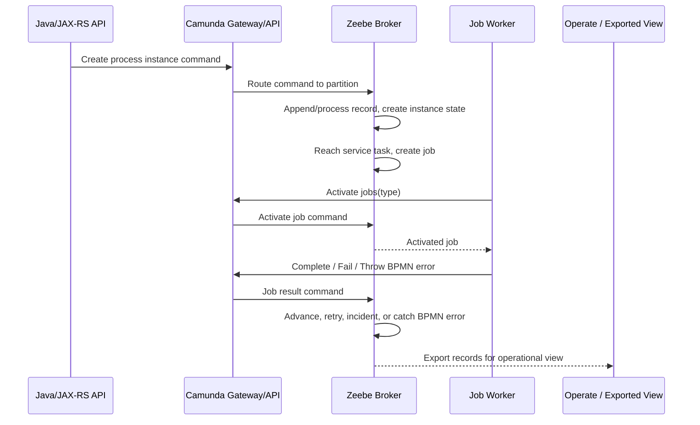
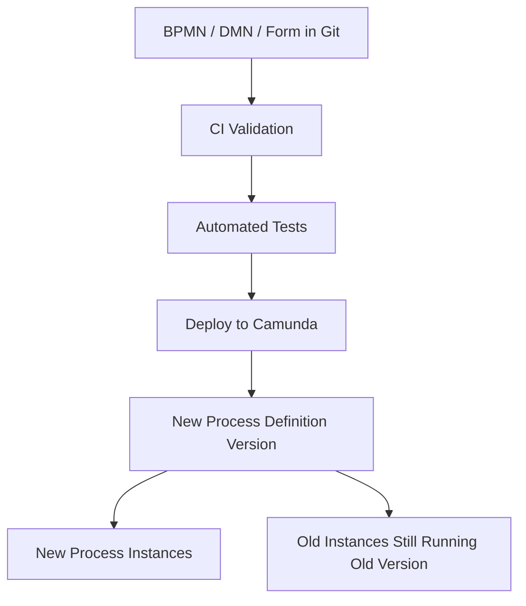
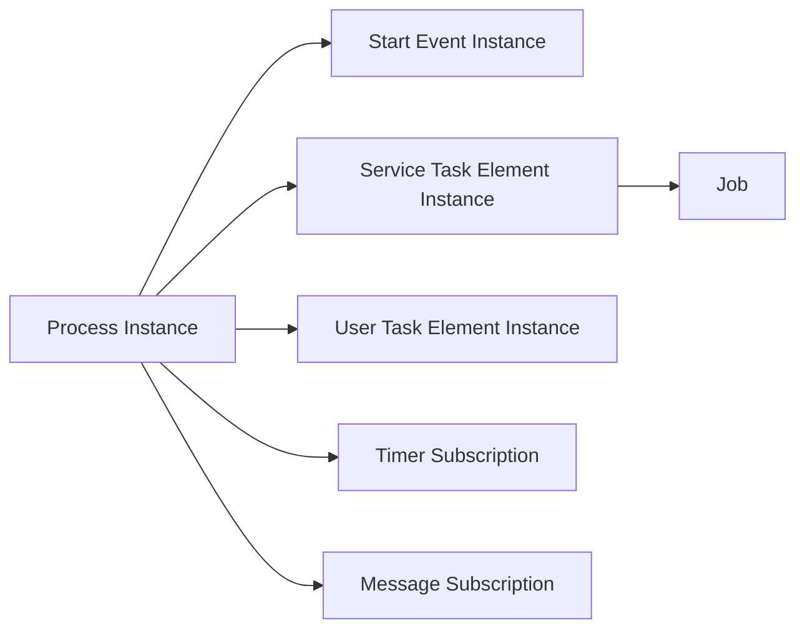
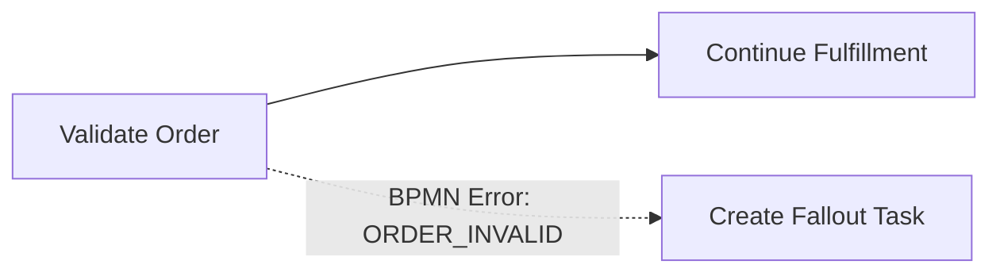
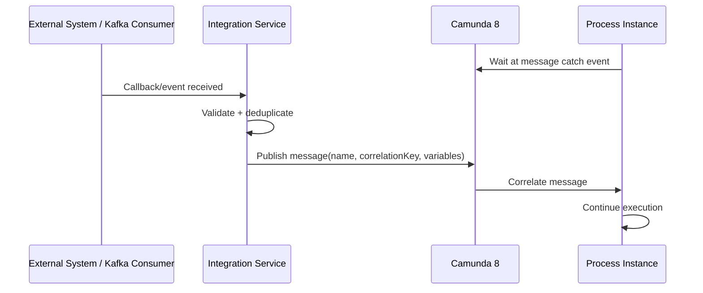

# Part 021 — Zeebe Process Execution Model

> Fokus part ini: memahami bagaimana Camunda 8/Zeebe benar-benar mengeksekusi BPMN. Targetnya bukan sekadar tahu bahwa ada process instance dan job worker, tetapi mampu membaca runtime state: process deployment, process instance, element instance, job creation, job activation, job completion, job failure, BPMN error, incident, variable update, message correlation, timer, partition routing, dan process version.

Camunda 8/Zeebe adalah orchestration engine. Ia tidak memanggil method Java Anda secara langsung. Ia memproses command, menyimpan state proses, membuat job, menunggu worker mengaktifkan job, menerima hasil worker, lalu memajukan process instance.

Mental model paling penting:

```text
BPMN model     = definition of allowed process flow
Process deploy = publish executable definition to cluster
Process start  = create one runtime instance of that definition
Element enter  = process reaches a BPMN element
Job created    = service task needs external work
Job activated  = worker claims work for limited timeout
Job completed  = worker reports success + output variables
Job failed     = worker reports technical failure + remaining retries
BPMN error     = worker reports modeled business error
Incident       = execution cannot continue without intervention
```

Di Java/JAX-RS system, Zeebe execution model harus dipahami sebagai remote state machine yang memandu long-running business process. Worker Anda adalah adaptor antara process intent dan side effect nyata: update PostgreSQL, call downstream API, publish Kafka event, send RabbitMQ command, read Redis cache, atau trigger manual intervention.

---

## 1. Why This Part Matters

Banyak production incident workflow terjadi karena engineer membaca BPMN sebagai diagram, bukan sebagai runtime execution model.

Contoh failure nyata:

```text
"Service task sudah dilewati di diagram, tapi order belum berubah di database."
"Worker sudah memproses job, tapi process masih stuck."
"Message callback sudah masuk, tapi tidak correlated."
"Timer SLA telat firing."
"Operate menunjukkan incident, tapi tim tidak tahu apakah aman retry."
"Process instance jalan di versi lama, sementara worker sudah berubah kontraknya."
```

Semua ini bukan masalah gambar BPMN. Ini masalah execution model.

Senior engineer harus bisa menjawab:

- process instance sedang berada di element mana;
- element itu membuat job atau wait state apa;
- job type apa yang harus diambil worker;
- variable apa yang visible pada element itu;
- command apa yang sudah diterima Zeebe;
- kenapa token-like execution tidak maju;
- apakah kegagalan harus retry, BPMN error, incident, compensation, atau manual repair;
- apakah masalah ada di model, worker, variable, message, timer, partition, gateway, atau observability lag.

---

## 2. Zeebe Execution Is Command-Driven

Di Camunda 8, client dan worker mengirim command ke cluster:

- deploy resource;
- create process instance;
- publish message;
- activate jobs;
- complete job;
- fail job;
- throw BPMN error;
- set variables;
- update job retries;
- resolve incident;
- cancel process instance.

Zeebe memproses command tersebut dan menghasilkan record/state transition.



Operational implication:

```text
If a worker performed a side effect but the complete command did not succeed,
Zeebe may retry or reactivate the job. Your worker must be idempotent.
```

---

## 3. Deployment vs Runtime

A BPMN file is not a running workflow. It becomes executable only after deployment.

```text
BPMN XML file
  -> deployed process definition
  -> versioned process definition
  -> process instance
  -> active element instances
  -> jobs, timers, messages, incidents, variables
```

Important terms:

| Term | Meaning | Production concern |
|---|---|---|
| BPMN process ID | Logical process identifier in the BPMN model | Stable naming and version strategy. |
| Process definition key | Engine-level unique key for deployed definition | Useful for runtime/debugging, not business identity. |
| Process version | Version number of deployed definition | Running instances may stay on old versions. |
| Process instance key | Unique runtime execution identifier | Use for workflow traceability, not as only business ID. |
| Business key / correlation key | Business-level correlation concept | Must map to quote/order/customer context consistently. |

In enterprise systems, never confuse:

```text
processInstanceKey != orderId
processDefinitionKey != BPMN process ID
process version != application release version
correlation key != arbitrary request ID
```

---

## 4. Process Deployment Lifecycle

A typical deployment lifecycle:

```text
1. Developer/BA updates BPMN in Modeler.
2. BPMN is committed to repository.
3. CI validates model syntax and conventions.
4. Tests run against process scenarios.
5. Artifact is deployed to target Camunda environment.
6. Zeebe registers new process definition version.
7. New process instances may use the new version.
8. Existing process instances usually continue on their original definition version.
```

Mermaid view:



Failure modes:

- wrong BPMN file deployed;
- wrong environment deployed;
- process starts on unexpected latest version;
- worker does not support new job type;
- variable contract changed without compatibility;
- message correlation changed between versions;
- form/task contract changed while old tasks still exist;
- deployment succeeds but operational tooling/exporter lags.

Production rule:

```text
Treat BPMN deployment like application deployment.
It changes runtime behavior.
It needs review, test, rollback/migration thinking, and observability.
```

---

## 5. Process Instance Lifecycle

A process instance is one execution of a deployed process definition.

Basic lifecycle:

```text
Created
  -> start event activated
  -> activities/gateways/events executed
  -> wait states created as needed
  -> jobs/timers/messages/user tasks handled
  -> incident if execution cannot continue
  -> completed, terminated, or canceled
```

Example for quote approval:

```text
Process definition: quote-approval-process v12
Process instance: one approval journey for quote Q-10092
Business entity: quote row in PostgreSQL
Workflow state: where the process instance is waiting/executing
Task state: pending/claimed/completed approval task
Domain state: draft/pendingApproval/approved/rejected/expired
```

Correctness concern:

```text
The process instance is not automatically your business source of truth.
You must define how it maps to quote/order state.
```

For CSG-like Quote & Order systems, verify whether:

- quote/order status lives in PostgreSQL business tables;
- Camunda process state is orchestration state only;
- both states must reconcile;
- process instance key is stored on business entity;
- business entity ID is stored as a variable/correlation key;
- process status endpoint reads Camunda, DB, or a combined read model.

---

## 6. Element Instance Mental Model

When a process reaches a BPMN element, Zeebe creates or updates runtime state for that element.

Examples:

- start event activated/completed;
- service task activated and job created;
- user task created;
- gateway evaluated;
- timer scheduled;
- message catch event subscribed;
- subprocess scope created;
- call activity starts child process;
- boundary event subscribed;
- end event reached.

Think of element instances as the runtime footprint of BPMN elements.



Debugging question:

```text
Which element instance is active, waiting, failed, or incidented?
```

This is usually more useful than asking, “Where is the diagram?”

---

## 7. Token-Like Execution

Zeebe documentation and tooling may not always use the same “token” language as classic BPMN explanations, but the mental model remains useful: process execution moves through BPMN elements.

```text
Token-like execution = the active path of execution through the BPMN graph.
```

Examples:

```text
Start -> Validate Quote -> Exclusive Gateway -> Approval User Task -> End
```

At each element:

- Zeebe activates the element;
- evaluates expressions/mappings as needed;
- creates job/timer/subscription/task if it is a wait state;
- waits for external signal if needed;
- completes the element;
- follows outgoing sequence flow.

Failure mode:

```text
A process can appear stuck because execution is waiting correctly.
Stuck is not always failed.
It may be waiting for job worker, user task, timer, or message.
```

Senior debugging distinction:

| Situation | Meaning | Next check |
|---|---|---|
| Waiting at service task | Job exists or should exist | Worker activation, job type, retries, incident. |
| Waiting at user task | Human action required | Assignee, group, task visibility, SLA. |
| Waiting at message catch | External event required | Message name, correlation key, TTL, producer. |
| Waiting at timer | Time condition required | timer expression, due date, load/backlog. |
| Incidented | Engine cannot proceed | Incident reason, variables, job retries, expression. |
| Completed | Process reached end | DB/business state must still be verified. |

---

## 8. Wait States

A wait state is a point where the process stops progressing until something happens.

Common Zeebe wait states:

- service task waiting for worker completion;
- user task waiting for human completion;
- receive task/message catch waiting for message correlation;
- timer catch/boundary event waiting for due time;
- event-based gateway waiting for one of multiple events;
- call activity waiting for child process completion;
- subprocess waiting for internal path completion.

Why wait states matter:

```text
Wait states are where long-running processes become observable, repairable, and failure-prone.
```

Bad design hides wait states in code:

```text
JAX-RS request -> blocks for external fulfillment for 10 minutes -> timeout -> unknown state
```

Better design makes wait explicit:

```text
Start order process -> create fulfillment job -> wait for worker/message/timer -> continue
```

---

## 9. Service Task Execution

A Zeebe service task typically becomes a job.

Lifecycle:

```text
Process reaches service task
  -> job is created with job type
  -> worker activates job
  -> worker executes business logic
  -> worker completes/fails/throws BPMN error
  -> Zeebe advances/retries/incidents/routes error path
```

Example:

```text
BPMN Service Task: Validate Order
Job type: validate-order
Worker: Java service deployed in Kubernetes
Side effects:
  - read order from PostgreSQL
  - validate domain invariant
  - call catalog/pricing service
  - write validation result
  - complete job with minimal variables
```

Correctness rule:

```text
The service task name is business-readable.
The job type is technical-worker-readable.
The worker code is production-owned.
```

Avoid:

- generic job type like `service-task`;
- one worker doing everything based on task name;
- job type renamed without BPMN/process deployment compatibility;
- worker depending on full object payload from process variable;
- worker completing job before durable side effect is committed;
- worker performing side effect without idempotency.

---

## 10. Job Creation

A job is created when a BPMN element requires external work.

For a service task, key fields conceptually include:

- job key;
- job type;
- process instance key;
- process definition key/version;
- BPMN process ID;
- element ID;
- element instance key;
- retries;
- worker name when activated;
- variables visible at activation time;
- tenant ID if multi-tenancy is used.

Production meaning:

```text
A job is not just a queue message.
It is tied to process state and controls whether process execution can advance.
```

Debugging checklist:

- Was the job created?
- What is the job type?
- Is a worker polling/streaming for that exact type?
- Are retries still positive?
- Has the job timed out?
- Is there an incident?
- Are variables present and valid?
- Is the worker connected to the correct cluster/tenant/environment?

---

## 11. Job Activation

Job activation is how workers receive work.

Worker asks for jobs of a type:

```text
ActivateJobs(type = "validate-order", worker = "order-worker-a", timeout = 60s, maxJobsToActivate = 32)
```

Zeebe returns activated jobs if available. Activated jobs are assigned to that worker for a timeout window.

Operational meaning:

```text
The activation timeout is not business SLA.
It is the lease window for worker processing.
```

Bad configuration examples:

| Mistake | Consequence |
|---|---|
| Timeout too short | Same job can be reactivated while first worker still runs. |
| Timeout too long | Failed worker delays reprocessing. |
| maxJobsActive too high | Worker overloads itself or downstream DB/API. |
| Fetching all variables | Large payload, memory pressure, sensitive data exposure. |
| Worker name not meaningful | Harder audit/debug. |
| Wrong tenant IDs | Worker sees no jobs or wrong jobs. |

---

## 12. Job Completion

When a worker completes a job, it tells Zeebe:

```text
This work succeeded. Merge these output variables. Continue the process.
```

Completion usually includes:

- job key;
- optional output variables;
- sometimes result/correction data for listener-specific use cases.

Example output variable design:

```json
{
  "validationStatus": "VALID",
  "validatedAt": "2026-07-11T09:15:00Z"
}
```

Avoid completing with giant domain object:

```json
{
  "entireOrder": { "...": "hundreds of KB or MB" }
}
```

Completion failure mode:

```text
Worker commits DB update.
Worker tries to complete job.
Network timeout occurs.
Worker does not know whether completion reached Zeebe.
Job may be retried or completion may have succeeded.
```

Therefore:

- DB operation must be idempotent;
- completion command should be retry-aware;
- worker should log job key, process instance key, business ID, correlation ID;
- worker should not assume local success equals process advancement.

---

## 13. Job Failure

A job failure means:

```text
The worker could not complete the technical work now.
```

It is not the same as a modeled business outcome.

Example technical failures:

- downstream API unavailable;
- PostgreSQL deadlock/timeout;
- Kafka producer unavailable;
- Redis timeout;
- malformed variable payload;
- transient network failure;
- worker bug;
- unexpected null or schema mismatch.

When failing a job, the worker controls remaining retries and may set retry backoff.

Decision matrix:

| Situation | Use |
|---|---|
| Temporary external outage | Fail job with retries and backoff. |
| Payload invalid but fixable manually | Fail job to incident after retries exhausted, or immediate incident. |
| Business rejection expected by model | Throw BPMN error. |
| Non-retryable domain violation | BPMN error or modeled rejection path. |
| Worker bug | Fail to incident, fix code, retry after deployment. |
| Duplicate side effect risk | Stop/review before retry. |

Important:

```text
Do not use job failure to represent normal business decisions.
```

Example:

```text
Credit check rejected customer = business outcome -> BPMN error / gateway path / decision result.
Credit check API timed out = technical failure -> fail job with retry/backoff.
```

---

## 14. BPMN Error

A BPMN error is a modeled business error thrown by worker/connector/process logic and caught by a BPMN error boundary event or event subprocess.

Use BPMN error when the process designer intentionally modeled a recovery/alternate business path.

Examples:

- quote approval rejected;
- order validation failed due to business rule;
- customer not eligible;
- product unavailable;
- pricing requires manual exception;
- external fulfillment declined request in a known way.

Mermaid example:



Worker behavior:

```text
If known business error -> throw BPMN error with code.
If unexpected technical exception -> fail job.
```

Failure mode:

```text
Worker throws BPMN error code ORDER_INVALID,
but BPMN has no matching error boundary/event subprocess.
Result: incident.
```

PR review questions:

- Is the BPMN error code stable?
- Is it caught by the model?
- Is the catch path business-owned?
- Does the catch path preserve auditability?
- Is this really business error, not technical failure?

---

## 15. Incidents

An incident means process execution cannot continue without intervention.

Common incident causes:

- job failed and no retries remain;
- expression evaluation error;
- timer expression invalid;
- decision evaluation failure;
- BPMN error thrown but not caught;
- variable format incompatible with model expression;
- operational dependency failure leading to retry exhaustion.

Incident is not only a technical alert. It is a business process stoppage.

```text
Incident = "this process instance is blocked here".
```

Incident handling lifecycle:

```text
Detect incident
  -> identify element/process/business entity
  -> diagnose root cause
  -> decide repair path
  -> fix data/code/config/external dependency
  -> update variables/retries if needed
  -> resolve incident
  -> observe process continuation
  -> record post-incident learning
```

Never blindly resolve incidents.

Ask:

- Did the worker already perform side effects?
- Is retry idempotent?
- Is business state consistent?
- Are variables correct?
- Is downstream dependency healthy?
- Is the process model itself wrong?
- Is this one instance or systemic?

---

## 16. Variable Update and Propagation

Variables are process context, not a replacement for domain database.

Variables can be set when:

- process instance starts;
- job completes;
- job fails with variables;
- message correlates;
- explicit set variables command is used;
- input/output mapping executes;
- task/user form completes;
- subprocess/call activity mapping occurs.

Variable propagation matters:

```text
A variable written at task completion may propagate to parent scope.
A local variable may disappear when the scope exits.
A variable with the same name in an inner scope may shadow parent variable.
```

Design principle:

```text
Use variables for routing context and lightweight process facts.
Use PostgreSQL/business DB for authoritative domain state.
```

Good variables:

```json
{
  "orderId": "O-9910",
  "tenantId": "enterprise-a",
  "approvalRequired": true,
  "correlationId": "corr-abc-123"
}
```

Bad variables:

```json
{
  "fullOrderAggregate": "large nested object",
  "customerPii": "sensitive data",
  "accessToken": "secret",
  "entireProductCatalogSnapshot": "huge payload"
}
```

---

## 17. Message Correlation

Message correlation connects an external event to a waiting process instance or message start event.

Examples:

- payment callback received;
- fulfillment response arrived;
- quote approval event published;
- order amendment accepted;
- external OSS/BSS system returned result;
- reconciliation process found matching update.

Message correlation usually depends on:

- message name;
- correlation key;
- optional TTL;
- process instance waiting at correct message catch;
- correct process version/model;
- producer and consumer agreeing on correlation semantics.

Sequence:



Failure modes:

- wrong message name;
- wrong correlation key;
- message arrives before subscription and no TTL/buffering strategy;
- message arrives after process already moved on;
- duplicate message;
- producer emits out-of-order event;
- correlation key uses mutable business field;
- event replay accidentally re-correlates process;
- process version changed message catch semantics.

Production rule:

```text
Every message correlation design must define duplicate, early, late, missing, and replay behavior.
```

---

## 18. Timers

Timers are execution wait states driven by time.

Zeebe supports patterns such as:

- timer start event;
- intermediate timer catch event;
- interrupting timer boundary event;
- non-interrupting timer boundary event;
- time date;
- time duration;
- time cycle.

Use cases in Quote & Order:

- quote approval deadline;
- manual fallout aging;
- order fulfillment timeout;
- SLA escalation;
- retry-after delay modeled explicitly;
- periodic reconciliation trigger;
- reminder task notification.

Timer correctness concerns:

```text
Timer due time is not the same as guaranteed execution time.
Distributed systems can fire timers later under load, but should not rely on exact wall-clock precision for hard real-time behavior.
```

Design checklist:

- Is this a business SLA or technical timeout?
- Should timer interrupt the activity or just notify/escalate?
- Is timezone explicit?
- Does the timer expression evaluate to valid type/format?
- What happens during deployment/migration?
- What happens if many timers fire at once?
- Who owns SLA breach handling?

---

## 19. Partition Routing

Zeebe is partitioned. Process instances are distributed across partitions.

Mental model:

```text
A partition owns execution state for a subset of process instances.
Gateway routes commands to the right broker/partition.
Broker leader for that partition processes commands.
Followers replicate state for high availability.
```

Why this matters to backend engineers:

- process instance key is not random decoration;
- load distribution depends on partitioning;
- one unhealthy partition can affect only some instances;
- metrics must be partition-aware;
- worker scaling does not fix broker partition bottleneck;
- gateway availability is not the same as all partitions healthy;
- exported read models can lag behind broker execution.

Debugging example:

```text
Some orders process normally. Others stuck at job activation.
Possible cause: specific partition unhealthy, not worker code globally broken.
```

Internal verification should check whether operational dashboards expose:

- broker health;
- partition leadership;
- partition replication;
- job activation latency per partition;
- exporter lag;
- gateway errors;
- worker activation errors.

---

## 20. Process Version Runtime Semantics

When a new process version is deployed, new process instances may start on the latest version, but existing instances generally continue on the version they started with.

Implication:

```text
Workers and APIs must remain compatible with old process instances until they finish or are migrated/canceled.
```

Example:

```text
v12 service task job type: validate-order
v13 service task job type: validate-order-v2
Existing v12 instances still create validate-order jobs.
If old worker is removed, v12 instances may stall.
```

Compatibility checklist:

- job type stable or intentionally versioned;
- worker supports old and new variable contracts;
- message names/correlation keys remain compatible;
- task forms for old user tasks still work;
- DMN decision output remains compatible;
- process status API understands both versions;
- operational runbook knows old versions exist.

---

## 21. Execution and Java/JAX-RS Backend

Common API patterns:

```text
POST /orders/{id}/workflow/start
  -> validate command
  -> idempotency check
  -> create process instance
  -> return 202 Accepted + process/business tracking ID

POST /orders/{id}/events/fulfillment-result
  -> validate callback
  -> deduplicate
  -> publish/correlate message
  -> return 202 or 204

GET /orders/{id}/workflow-status
  -> combine business DB state + process read model
```

Do not expose raw process engine details as your domain API without thought.

Bad API smell:

```text
POST /camunda/process-instance/{key}/complete-element/{elementId}
```

Better API:

```text
POST /orders/{orderId}/approval/complete
POST /orders/{orderId}/fulfillment/callback
GET  /orders/{orderId}/lifecycle
```

The API should speak domain language; the implementation can coordinate with Camunda.

---

## 22. Execution and PostgreSQL/MyBatis/JDBC

Zeebe stores process execution state in its own cluster/state. Your business service likely stores domain state in PostgreSQL.

Risk:

```text
Process state and business state can diverge.
```

Example divergence:

```text
Worker updates order status to VALIDATED.
Worker fails to complete Zeebe job.
Zeebe retries job.
Worker attempts validation again.
```

Mitigation:

- idempotent business command;
- unique command ID/job key table;
- optimistic locking on order state;
- processed job table;
- outbox for events;
- reconciliation between process instance and business entity;
- explicit state transition guard.

MyBatis/JDBC review:

- SQL statements must be idempotent where retryable;
- transaction boundaries must be clear;
- partial DB commit must be recoverable;
- process variable should not duplicate full DB entity;
- worker should fetch current domain state by ID, not trust stale variable payload.

---

## 23. Execution and Kafka/RabbitMQ/Redis

Zeebe execution often interacts with messaging and cache layers.

Kafka patterns:

- Kafka event starts process;
- Kafka event correlates message;
- worker publishes domain event after process step;
- outbox protects event publish after DB commit;
- replay behavior must be controlled.

RabbitMQ patterns:

- command message triggers process;
- worker sends command and waits for reply message;
- DLQ interacts with workflow incident policy;
- retry at RabbitMQ and workflow layer must not multiply unexpectedly.

Redis patterns:

- idempotency cache;
- distributed lock;
- rate limit;
- kill switch;
- process status cache;
- temporary correlation cache.

Warning:

```text
Redis cache is not authoritative workflow state.
Kafka replay is not automatically safe for message correlation.
RabbitMQ retry is not automatically aligned with Zeebe retries.
```

---

## 24. Execution in Kubernetes

In Kubernetes, Zeebe process execution crosses many failure boundaries:

```text
worker pod restart
worker rolling deployment
gateway network interruption
broker partition leadership change
DNS issue
secret rotation
resource throttling
pod eviction
node drain
service mesh timeout
```

Worker design must handle:

- SIGTERM graceful shutdown;
- stop activating new jobs during shutdown;
- finish or safely abandon in-flight jobs;
- not complete job after lease timeout without handling rejection;
- retry client commands safely;
- expose readiness/liveness based on real dependencies;
- avoid over-consuming jobs compared to CPU/DB capacity.

Production smell:

```text
Worker has maxJobsActive=500, CPU limit=500m, DB pool=5, and no backpressure.
```

---

## 25. Execution in AWS/Azure/On-Prem/Hybrid

The execution model does not change, but failure modes do.

AWS concerns:

- EKS networking to gateway;
- IAM/service account identity;
- RDS/OpenSearch dependency if self-managed;
- CloudWatch alert visibility;
- cross-AZ latency/failover.

Azure concerns:

- AKS networking;
- managed identity;
- Azure PostgreSQL/search dependency;
- Key Vault rotation;
- Azure Monitor.

On-prem/hybrid concerns:

- firewall path worker ↔ gateway;
- TLS/internal CA;
- patch windows;
- air-gapped deployment;
- customer-managed database/search;
- responsibility boundary for incident repair;
- cloud-to-on-prem event latency.

Senior review question:

```text
If a workflow is waiting on an external system across a network boundary,
what tells us whether it is waiting correctly, late, failed, or lost?
```

---

## 26. Observability Model

A process instance is observable through multiple surfaces:

- Operate/process monitoring;
- worker logs;
- worker metrics;
- Zeebe broker/gateway metrics;
- exporter/search health;
- application trace/correlation IDs;
- PostgreSQL business tables;
- Kafka/RabbitMQ event streams;
- incident management system;
- customer-facing status.

Minimum correlation fields:

```text
processInstanceKey
processDefinitionKey
bpmnProcessId
processDefinitionVersion
elementId
elementInstanceKey
jobKey
jobType
businessEntityId/orderId/quoteId
tenantId
correlationId/requestId
workerName
```

If logs cannot connect these fields, production debugging will be slow.

---

## 27. Production Debugging Decision Tree

When process is not progressing:

```text
1. Is the process instance created?
   - no: check API/start command/deployment/version/authorization.

2. What element is active?
   - service task: check job/worker.
   - user task: check assignment/task visibility.
   - message catch: check producer/correlation/TTL.
   - timer: check due date/load/timer expression.
   - gateway: check expression/variables.
   - incident: read incident reason.

3. If service task:
   - is job type correct?
   - are workers connected?
   - are jobs activated?
   - are retries left?
   - did worker side effect happen?
   - is completion/failure command accepted?

4. If incident:
   - is root cause variable/model/worker/dependency?
   - is retry safe?
   - does data need repair?
   - who approves manual repair?
```

---

## 28. Common Failure Modes

### 28.1 Process not starting

Possible causes:

- process not deployed;
- wrong BPMN process ID;
- wrong version/environment;
- auth/tenant issue;
- invalid start variables;
- gateway unavailable;
- client timeout;
- start command succeeded but response lost.

### 28.2 Job not created

Possible causes:

- process did not reach service task;
- gateway condition routed elsewhere;
- incident before service task;
- BPMN model has wrong task type;
- element disabled/changed in version.

### 28.3 Worker not receiving job

Possible causes:

- wrong job type;
- worker connected to wrong cluster;
- tenant mismatch;
- no jobs available;
- jobs incidented/no retries;
- worker backoff due to errors;
- gateway/broker issue;
- maxJobsActive already saturated.

### 28.4 Job repeatedly failing

Possible causes:

- downstream outage;
- invalid variables;
- worker bug;
- missing DB row;
- non-idempotent operation conflicting with retry;
- schema mismatch;
- secret/config issue.

### 28.5 Message not correlated

Possible causes:

- wrong message name;
- wrong correlation key;
- subscription not active yet;
- TTL expired;
- process already completed/moved;
- duplicate/replay semantics incorrect;
- tenant/environment mismatch.

### 28.6 Timer not firing as expected

Possible causes:

- timer expression invalid;
- timezone assumption wrong;
- due date in future;
- load/backlog;
- process not at timer element;
- migration/deployment changed timer start behavior;
- operational view lag.

---

## 29. Production-Safe Repair Principles

Before repair:

```text
Do not mutate workflow state until you understand side effects.
```

Checklist:

- identify business entity;
- identify process instance key;
- identify active element/incident;
- inspect variables;
- inspect worker logs by job key/correlation ID;
- inspect DB state;
- inspect emitted Kafka/RabbitMQ events;
- inspect downstream side effects;
- decide whether retry is idempotent;
- document operator action.

Repair options:

- update variable then resolve incident;
- increase retries then resolve incident;
- deploy fixed worker then retry;
- correlate missing message;
- complete/cancel human task through authorized path;
- cancel process instance if business-approved;
- start compensating/manual process;
- reconcile business state and process state.

---

## 30. PR Review Checklist

For every BPMN/worker change, ask:

```text
Process start
- Does this change how process instances start?
- Is idempotency defined for start requests/events?

Versioning
- What happens to already running instances?
- Are old job types still supported?
- Are variable contracts backward compatible?

Service tasks
- Is job type stable and explicit?
- Which worker owns it?
- What is timeout/retry/backoff?
- Is the worker idempotent?

Variables
- Are variables minimal?
- Are sensitive values avoided?
- Are input/output mappings clear?

Messages/timers
- Are correlation keys stable?
- Are duplicate/late/early messages handled?
- Are timer semantics and timezone clear?

Failure
- What creates incident?
- What throws BPMN error?
- What is manual repair path?

Observability
- Are processInstanceKey, jobKey, elementId, business ID, and correlation ID logged?
- Are worker metrics and alerts defined?
```

---

## 31. Internal Verification Checklist

Use this checklist against the actual CSG/team codebase and platform. Do not assume the answer.

### Process deployment

- Where are BPMN/DMN/form artifacts stored?
- How are they deployed to Camunda 8/Zeebe?
- Are deployments versioned and traceable to Git commit/build?
- Is process deployment coupled or decoupled from worker deployment?

### Runtime identity

- Is `processInstanceKey` stored in quote/order database tables?
- Is quote/order ID stored as process variable?
- Is correlation ID propagated from REST/event to worker logs?
- Is tenant/customer context explicit?

### Job execution

- What job types exist?
- Which service owns each job type?
- What are default timeout/retry/backoff settings?
- Are workers idempotent?
- Is `maxJobsActive` tuned to DB/downstream capacity?

### Variables

- What variables are passed at process start?
- Are large payloads or PII stored?
- Are input/output mappings reviewed?
- Is variable contract versioned?

### Message/timer

- What message names/correlation keys exist?
- Are early/late/duplicate events handled?
- Are timer expressions using timezone-safe values?
- Is SLA timer monitored?

### Incidents

- Who owns incidents?
- Is there an Operate dashboard or equivalent?
- Are incidents linked to business/customer impact?
- Is retry/manual repair controlled?

### Platform

- Is Zeebe SaaS or self-managed?
- How are partitions monitored?
- How are gateway/broker/exporter/search health monitored?
- Are worker deployments Kubernetes-safe?

---

## 32. Key Takeaways

- Zeebe execution is command-driven and distributed.
- A deployed BPMN model becomes a versioned process definition.
- A process instance is one runtime execution of that definition.
- Service tasks create jobs; workers activate, complete, fail, or throw BPMN errors.
- Job failure is technical failure; BPMN error is modeled business error.
- Incidents mean execution cannot continue without intervention.
- Variables are process context, not authoritative business storage.
- Message correlation requires explicit duplicate/early/late/missing behavior.
- Timers are not hard real-time guarantees; they are workflow wait states.
- Process versioning affects running instances and worker compatibility.
- Senior engineers debug workflow by connecting BPMN element, job, worker, variables, business state, and platform health.

---

## 33. References

- Camunda 8 Processes: https://docs.camunda.io/docs/components/concepts/processes/
- Camunda 8 Job Workers: https://docs.camunda.io/docs/components/concepts/job-workers/
- Camunda 8 Java Client Job Worker: https://docs.camunda.io/docs/apis-tools/java-client/job-worker/
- Camunda 8 Zeebe Gateway API: https://docs.camunda.io/docs/apis-tools/zeebe-api/gateway-service/
- Camunda 8 Incidents: https://docs.camunda.io/docs/components/concepts/incidents/
- Camunda 8 Variables: https://docs.camunda.io/docs/components/concepts/variables/
- Camunda 8 Messages: https://docs.camunda.io/docs/components/concepts/messages/
- Camunda 8 Message Events: https://docs.camunda.io/docs/components/modeler/bpmn/message-events/
- Camunda 8 Timer Events: https://docs.camunda.io/docs/components/modeler/bpmn/timer-events/
