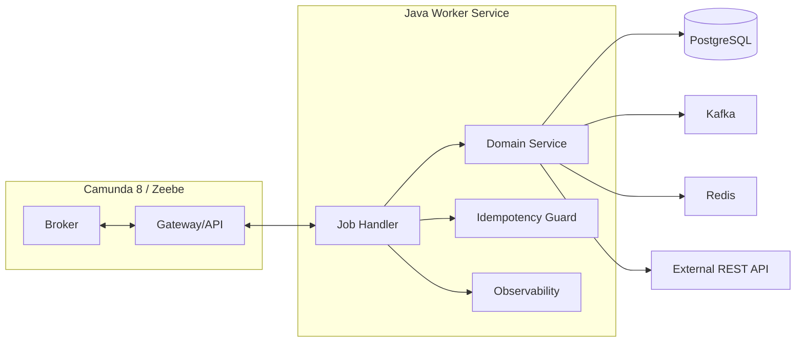

# Part 022 — Zeebe Job Workers

> Fokus part ini: mendesain Zeebe job worker sebagai production-grade distributed system component. Worker bukan sekadar class yang menjalankan task; worker adalah boundary antara workflow orchestration dan side effect nyata: database, REST API, Kafka, RabbitMQ, Redis, external systems, human operation, dan customer-impacting state transition.

Dalam Camunda 8/Zeebe, broker tidak menjalankan Java code Anda. Broker membuat job. Worker Anda mengambil job, menjalankan business/application logic, lalu melaporkan hasilnya.

Mental model:

```text
Zeebe Broker owns orchestration state.
Worker owns business side effect.
Job activation is a lease.
Job completion is a command to advance process.
Job failure is a retry/incident signal.
BPMN error is a modeled business outcome.
```

Jika worker salah didesain, workflow system akan terlihat rapi di BPMN tetapi rapuh di production.

---

## 1. What Is a Zeebe Job Worker?

A Zeebe job worker is a client-side process that:

- subscribes/polls/streams jobs of a specific job type;
- receives activated jobs with variables and metadata;
- executes business/application logic;
- completes the job with output variables;
- fails the job with remaining retries/backoff;
- throws BPMN error for modeled business errors;
- handles timeout, duplicate execution, shutdown, and observability.

In Java/JAX-RS ecosystem, a worker may be:

- a Spring Boot application;
- a Jakarta EE service;
- a standalone Java service;
- a worker module inside an existing backend service;
- a Kubernetes Deployment;
- a sidecar-like integration component;
- a connector runtime/custom connector alternative.

Architecture view:



---

## 2. Worker Is Not a Queue Consumer Only

It is tempting to think:

```text
Zeebe job = queue message
worker = queue consumer
```

This is incomplete.

A Zeebe job is tied to process execution. If the job does not complete, the process does not advance.

Differences from generic queue consumer:

| Aspect | Queue consumer | Zeebe job worker |
|---|---|---|
| Work source | Message queue | Process instance waiting at BPMN element |
| Completion meaning | Ack message | Advance process execution |
| Failure meaning | Nack/retry/DLQ | Retry or incident in workflow |
| Business context | Message payload | Process variables + metadata |
| Visibility | Queue metrics | Process instance + job + incident + worker metrics |
| Retry owner | Broker/consumer/app | Worker + Zeebe retry/incident model |
| Correlation | Message key/header | Process instance key, element ID, job key, variables |

Senior engineer concern:

```text
Worker failure is workflow failure, not just background job failure.
```

---

## 3. Job Type Design

Job type is the contract between BPMN model and worker.

Good job type examples:

```text
validate-order
reserve-inventory
create-fallout-task
publish-order-accepted-event
request-fulfillment
apply-price-override
sync-customer-profile
```

Bad examples:

```text
task
service-task
worker
java
process-step
handler
camunda-job
```

Rules:

- use business-action names, not implementation class names;
- keep names stable;
- version only when contract breaks;
- avoid one generic job type that multiplexes unrelated tasks;
- document owner service/team;
- map job type to metrics and alerting.

Job type review table:

| Question | Why it matters |
|---|---|
| Who owns this job type? | Incident ownership. |
| What side effects can it perform? | Retry/idempotency risk. |
| What variables does it require? | Contract stability. |
| What variables does it output? | Downstream BPMN correctness. |
| What errors can it throw? | BPMN error path design. |
| What retry/timeout does it need? | Reliability behavior. |
| Is it safe to run concurrently? | Scaling and race conditions. |

---

## 4. Worker Handler Skeleton

Conceptual Java handler shape:

```java
public final class ValidateOrderWorker {

    private final OrderRepository orderRepository;
    private final ProcessedJobRepository processedJobRepository;
    private final OrderValidationService validationService;
    private final CamundaClient camundaClient;

    public void handle(ActivatedJob job) {
        String orderId = readRequired(job, "orderId");
        String correlationId = readOptional(job, "correlationId");
        long jobKey = job.getKey();
        long processInstanceKey = job.getProcessInstanceKey();

        if (processedJobRepository.alreadyProcessed(jobKey)) {
            completeJob(jobKey, Map.of("validationStatus", "ALREADY_PROCESSED"));
            return;
        }

        try {
            ValidationResult result = validationService.validate(orderId, correlationId);

            if (result.isBusinessRejected()) {
                throwBpmnError(jobKey, "ORDER_VALIDATION_FAILED", result.reason());
                return;
            }

            processedJobRepository.markProcessed(jobKey, orderId, processInstanceKey);
            completeJob(jobKey, Map.of(
                "validationStatus", "VALID",
                "validatedAt", Instant.now().toString()
            ));
        } catch (TransientDependencyException ex) {
            failJob(job, ex, nextRetries(job), Duration.ofMinutes(2));
        } catch (Exception ex) {
            failJob(job, ex, 0, Duration.ZERO);
        }
    }
}
```

This is illustrative, not a copy-paste production implementation.

Core ideas:

- extract minimal variables;
- use business ID, not giant payload;
- guard idempotency;
- distinguish business error from technical failure;
- complete with minimal output;
- fail with deliberate retry/backoff;
- log job/process/business correlation fields.

---

## 5. Job Activation

A worker activates jobs by asking for a job type.

Conceptual activation parameters:

```text
job type           = validate-order
worker name        = order-worker-prod-a
job timeout        = 60 seconds
max jobs active    = 32
fetch variables    = orderId, tenantId, correlationId
request timeout    = long polling / streaming setting
```

Activation is a lease:

```text
During activation timeout, Zeebe expects this worker to complete or fail the job.
If timeout expires, the job can be made available again to another worker.
```

Important consequence:

```text
Two workers can temporarily work on the same logical job if the first worker exceeds timeout and the job is reactivated.
Only one completion may be accepted, but side effects can already have happened twice.
```

Therefore, activation timeout is a correctness parameter, not just performance tuning.

---

## 6. Completion

Completing a job means:

```text
The worker successfully performed the work.
Zeebe can merge output variables and move the process forward.
```

Good completion payload:

```json
{
  "inventoryReserved": true,
  "reservationId": "RES-9821"
}
```

Bad completion payload:

```json
{
  "fullInventoryResponse": { "veryLarge": "..." },
  "internalAuthToken": "...",
  "rawHttpHeaders": "..."
}
```

Completion design checklist:

- Are output variables minimal?
- Are output variables stable across versions?
- Do variable names match BPMN expressions?
- Is sensitive data excluded?
- Is completion done only after durable side effect commits?
- If completion fails, can worker retry safely?

Correct ordering example:

```text
1. Validate input.
2. Execute idempotent DB/API operation.
3. Commit durable state.
4. Complete Zeebe job.
5. If complete response uncertain, rely on idempotency on retry.
```

Wrong ordering:

```text
1. Complete Zeebe job.
2. Then update database.
```

This can advance process while business state was never updated.

---

## 7. Failure

Failing a job is for technical failure.

Examples:

- database unavailable;
- downstream API returns 503;
- Kafka publish temporarily fails;
- Redis timeout;
- network failure;
- serialization issue;
- unexpected worker exception;
- variable format invalid and requires repair.

Fail command should include deliberate retry behavior:

```text
remainingRetries = currentRetries - 1
retryBackoff = duration before reactivation
errorMessage = diagnostic summary
```

Failure policy examples:

| Failure | Recommended behavior |
|---|---|
| HTTP 503 from dependency | fail with retries + exponential/fixed backoff. |
| PostgreSQL deadlock | retry with short backoff. |
| Missing required variable | fail to incident or BPMN error depending cause. |
| Business validation rejected | BPMN error, not fail job. |
| Non-idempotent ambiguous side effect | stop/incident/manual review. |
| Worker bug | fail to incident, deploy fix, retry. |

Anti-pattern:

```text
catch (Exception e) { completeJob(); }
```

This hides failure and corrupts the business process.

---

## 8. BPMN Error from Worker

A BPMN error represents a modeled business outcome.

Use when BPMN has an error boundary event or event subprocess prepared to catch it.

Examples:

```text
ORDER_VALIDATION_FAILED
QUOTE_REQUIRES_MANUAL_APPROVAL
CUSTOMER_NOT_ELIGIBLE
PRODUCT_NOT_AVAILABLE
FULFILLMENT_REJECTED
```

Do not use BPMN error for:

- database outage;
- worker null pointer bug;
- Kafka unavailable;
- REST timeout;
- malformed configuration;
- unknown exception.

Decision table:

| Condition | Worker command |
|---|---|
| Known business alternative path | Throw BPMN error. |
| Temporary technical issue | Fail job with retry/backoff. |
| Permanent technical/data repair needed | Fail job to incident. |
| Success | Complete job. |

PR review:

- Does BPMN catch the error code?
- Does the catch path match business language?
- Are error codes stable and documented?
- Are error payload variables safe and minimal?
- Does product/BA agree this is a business path?

---

## 9. Timeout

Job timeout is how long the worker has the job activated.

Timeout is not:

- customer SLA;
- HTTP timeout;
- database transaction timeout;
- business approval deadline.

It is:

```text
The lease duration before Zeebe can make the job available again.
```

Timeout too short:

- duplicate concurrent processing;
- completion command rejected after timeout;
- excessive retry/reactivation;
- confusing worker logs.

Timeout too long:

- slow recovery after worker crash;
- process waits longer than needed;
- incident detection delayed.

Guideline:

```text
Set timeout slightly above normal worst-case processing time,
but below unacceptable recovery delay.
```

For long-running external operations, do not keep a single job active for hours if the worker is only waiting. Model the wait explicitly with message/timer instead.

Bad:

```text
Worker calls external fulfillment API and blocks for 2 hours.
```

Better:

```text
Worker sends request -> completes job -> process waits at message catch/timer for callback/timeout.
```

---

## 10. Retries

Retries must be owned deliberately.

Questions:

- Who decrements retries?
- What backoff is used?
- Which errors are retryable?
- Which errors create incident immediately?
- What is the maximum retry duration?
- How are retry storms prevented?
- What alerts fire before business SLA is breached?

Bad retry policy:

```text
Retry everything 100 times immediately.
```

Better:

```text
Network timeout -> retry 5 times with backoff.
Business rejection -> BPMN error.
Invalid variable -> incident for repair.
External outage -> retry with backoff and circuit-breaker/kill switch.
```

Retry storm risk:

```text
100k active process instances all fail because downstream API is down.
All retry every 5 seconds.
Downstream never recovers.
Camunda/worker/network also degrade.
```

Mitigation:

- backoff;
- jitter where applicable;
- circuit breaker;
- worker-level rate limit;
- maxJobsActive tuning;
- kill switch;
- bulkhead per job type/downstream;
- alert on failure rate early.

---

## 11. Backoff

Backoff is the delay before retrying after failure.

Use backoff to protect:

- downstream APIs;
- PostgreSQL connection pool;
- Kafka/RabbitMQ brokers;
- Redis;
- Zeebe cluster;
- worker CPU/memory;
- operator attention.

Patterns:

| Pattern | Use when |
|---|---|
| Fixed backoff | Predictable short transient issue. |
| Exponential backoff | Dependency may need recovery time. |
| Exponential + jitter | Many jobs may fail together. |
| Long backoff | External system outage or business-hour dependency. |
| No retry | Non-retryable business/data condition. |

Backoff is not a substitute for incident ownership.

---

## 12. Worker Name

Worker name appears in audit/logging/diagnostics.

Good worker names:

```text
order-validation-worker-prod-v2
quote-approval-worker-eu-west
fulfillment-callback-worker-aks-blue
```

Bad worker names:

```text
worker
localhost
java-client
pod-123-only
```

A good name helps answer:

- which service activated the job;
- which environment processed it;
- which version/build was active;
- whether blue/green/canary worker touched it;
- whether a stale worker is still running.

In Kubernetes, include stable service identity in worker name and rely on logs/metadata for pod ID/build SHA.

---

## 13. Max Jobs Active

`maxJobsActive` controls how many jobs a worker may have buffered/in-flight.

It is a backpressure control.

Do not set it based only on Camunda throughput. Set it based on the weakest downstream dependency.

Example:

```text
Worker pod CPU: 1 core
DB pool: 10 connections
External API rate limit: 50 RPS
Average job time: 500 ms
Job type can be parallelized: yes
```

Then `maxJobsActive=500` is likely unsafe.

Review factors:

- CPU per job;
- memory per job payload;
- DB connection pool;
- API rate limit;
- Kafka producer throughput;
- Redis latency;
- idempotency table contention;
- process SLA;
- retry storm risk;
- number of pod replicas.

Cluster-level view:

```text
total in-flight jobs = replicas * maxJobsActive
```

If you scale from 4 to 20 pods and keep `maxJobsActive=100`, you may jump from 400 to 2000 concurrent downstream operations.

---

## 14. Fetch Variables

Workers should fetch only variables they need.

Bad:

```text
Fetch all variables by default for every worker.
```

Problems:

- larger network payload;
- memory pressure;
- sensitive data exposure;
- accidental dependency on unrelated variables;
- stronger coupling to process context;
- harder schema evolution.

Better:

```text
validate-order worker fetches:
  - orderId
  - tenantId
  - correlationId
  - validationProfile
```

Design rule:

```text
Worker input contract should be explicit.
```

If worker needs domain data, fetch it from authoritative database/service using IDs, not from huge process variable payload.

---

## 15. Polling, Long Polling, and Streaming

Workers can receive jobs through polling/long polling and, depending on configuration/version/client, streaming-style activation.

Concepts:

- polling: worker repeatedly asks for jobs;
- long polling: request waits until job becomes available or timeout;
- streaming: long-lived stream pushes jobs with lower activation latency;
- backoff: worker waits after polling error before retrying.

Operational trade-offs:

| Mode | Benefit | Risk/concern |
|---|---|---|
| Frequent polling | Simple mental model | Wasteful when idle. |
| Long polling | Lower idle overhead | Long-lived connection behavior matters. |
| Streaming | Lower latency | Client/gateway buffering, readiness, version support. |
| Aggressive polling | Fast when jobs appear | Load on gateway/broker. |

Review:

- Is client protocol supported in the deployment?
- Are gateway/network timeouts compatible?
- Does service mesh kill long-lived connections?
- Does worker recover cleanly after connection loss?
- Are activation errors visible in metrics?

---

## 16. Worker Concurrency

Concurrency has multiple levels:

```text
process instance concurrency
job activation concurrency
handler thread concurrency
DB transaction concurrency
external API concurrency
pod replica concurrency
cluster-wide concurrency
```

Do not assume increasing worker replicas improves throughput. It may move the bottleneck.

Example bottleneck chain:

```text
Worker replicas increased
  -> more jobs activated
  -> more DB writes
  -> DB lock contention
  -> job duration increases
  -> timeouts increase
  -> duplicates increase
  -> incidents increase
```

Concurrency review checklist:

- Is the job type safe to run in parallel for same business entity?
- Is there optimistic locking on entity state?
- Are idempotency keys unique?
- Is downstream rate-limited?
- Is work partitioned by tenant/customer/order?
- Is there a risk of two process instances updating same order?
- Does worker use bounded thread pools?

---

## 17. Idempotency

Worker idempotency is mandatory.

Why:

- job can time out and be reactivated;
- worker can crash after side effect before completion;
- complete command can time out;
- network can drop response;
- retry can re-run code;
- process version/worker deployment can cause duplicate attempts;
- external API may process request even when worker sees timeout.

Possible idempotency keys:

- job key;
- process instance key + element ID;
- business command ID;
- order ID + operation type;
- external API idempotency key;
- outbox event ID;
- unique DB constraint.

Recommended strategy:

```text
Use business-level idempotency for business side effects.
Use job-level idempotency for worker execution tracking.
Do not rely on only one if operation crosses external systems.
```

Example table:

```sql
create table processed_workflow_job (
  job_key bigint primary key,
  process_instance_key bigint not null,
  job_type text not null,
  business_id text not null,
  result_hash text,
  processed_at timestamptz not null default now()
);
```

For business operation:

```sql
create unique index ux_order_operation
on order_operation_log(order_id, operation_type, command_id);
```

---

## 18. Database Transaction Boundary

A worker usually has a local DB transaction, but Zeebe completion is a separate remote command.

There is no single ACID transaction across:

```text
PostgreSQL business DB + Zeebe broker + Kafka + external API
```

Therefore design for partial success.

Common sequence:

```text
1. Worker activates job.
2. Worker starts DB transaction.
3. Worker applies idempotent state transition.
4. Worker writes outbox/event/processed marker.
5. Worker commits DB transaction.
6. Worker completes Zeebe job.
```

Failure windows:

| Window | Risk | Mitigation |
|---|---|---|
| Before DB commit | No side effect | Retry safe. |
| After DB commit, before completion | Duplicate worker attempt | Idempotency/processed marker. |
| After completion, before event publish | Process advances but event missing | Outbox pattern. |
| External API success, local failure | Unknown external state | External idempotency/reconciliation. |

---

## 19. External API Calls

External API calls are dangerous in workers because they often have ambiguous outcomes.

Example:

```text
Worker calls billing API.
HTTP request times out.
Did billing receive and process it?
Unknown.
```

Requirements:

- idempotency key sent to external API;
- timeout lower than job activation timeout;
- retry policy aligned with external API semantics;
- circuit breaker/rate limiter;
- audit log of request/response metadata;
- no secrets in variables/logs;
- reconciliation for unknown outcomes.

If external operation is long-running:

```text
Send command -> complete job -> wait for callback message.
```

Do not block worker for minutes/hours if the process can model the wait.

---

## 20. Kafka Integration from Worker

Worker may publish Kafka events after a process step.

Correctness concern:

```text
If DB commit succeeds but Kafka publish fails, what is the source of truth?
```

Recommended:

- write business state + outbox event in same DB transaction;
- separate outbox publisher publishes to Kafka;
- worker completes Zeebe job after durable local transaction;
- process advancement and event emission consistency are explicitly designed.

Avoid:

```text
worker updates DB;
worker publishes Kafka directly;
worker completes job;
no outbox;
no idempotency;
no retry accounting.
```

Kafka metadata should include:

- event ID;
- event type;
- aggregate ID;
- process instance key;
- job key;
- correlation ID;
- causation ID;
- schema version;
- tenant ID.

---

## 21. RabbitMQ Integration from Worker

RabbitMQ is often command/reply oriented.

Risks:

- RabbitMQ message retry plus Zeebe retry multiplies attempts;
- DLQ may hide process blockage;
- reply message may arrive after process timeout;
- duplicate command message may create duplicate downstream side effect;
- routing key changes break workers.

Design rules:

- define whether retry is owned by RabbitMQ, worker, Zeebe, or downstream;
- use correlation ID and command ID;
- use DLQ alerts tied to process incident view;
- make downstream command idempotent;
- model reply wait as BPMN message event if async.

Pattern:

```text
Worker sends RabbitMQ command
  -> completes job
  -> process waits at message catch for reply
  -> integration service correlates reply message
  -> boundary timer handles timeout
```

---

## 22. Redis Usage in Workers

Redis can help but must not become invisible source of truth.

Valid uses:

- short-lived idempotency guard with DB backup;
- rate limiter;
- circuit breaker state;
- feature flag/kill switch;
- cache external lookup;
- distributed lock with strict correctness review.

Risks:

- Redis eviction loses idempotency marker;
- lock expires while work continues;
- stale cache drives wrong decision;
- Redis outage blocks all workers;
- key naming leaks tenant/customer data;
- TTL mismatch with process lifetime.

Rule:

```text
Use Redis to optimize or coordinate.
Use PostgreSQL/domain DB for durable correctness.
```

---

## 23. Graceful Shutdown

Kubernetes will terminate worker pods during deployment, scaling, eviction, or node drain.

A worker must handle shutdown:

```text
1. Receive SIGTERM.
2. Stop activating new jobs.
3. Finish in-flight jobs if possible.
4. Complete/fail jobs safely.
5. Respect termination grace period.
6. Let unfinished jobs time out and become available again.
```

Bad shutdown behavior:

- keeps activating jobs after SIGTERM;
- kills process mid-DB transaction;
- does not flush logs/metrics;
- uses job timeout longer than pod termination grace period without strategy;
- completes job after business operation was rolled back;
- has no idempotency for timed-out jobs.

Review Kubernetes settings:

- terminationGracePeriodSeconds;
- readiness probe flips false before shutdown;
- preStop hook if needed;
- worker close/stop activation behavior;
- deployment rolling update maxUnavailable/maxSurge;
- PDB if critical;
- HPA behavior during incidents.

---

## 24. Worker Observability

Minimum metrics:

- activated jobs count;
- completed jobs count;
- failed jobs count;
- BPMN errors thrown;
- job handler duration;
- job activation latency;
- in-flight jobs;
- job timeout count;
- retry count distribution;
- incident-causing failures;
- downstream API latency/error rate;
- DB transaction latency/deadlock count;
- Kafka/RabbitMQ publish/consume failures;
- worker backoff state;
- shutdown/in-flight drain stats.

Minimum log fields:

```text
jobKey
jobType
workerName
processInstanceKey
processDefinitionKey
processDefinitionVersion
bpmnProcessId
elementId
elementInstanceKey
businessId / quoteId / orderId
tenantId
correlationId
retry count
outcome: completed|failed|bpmn_error
```

Trace propagation:

```text
REST request -> process start -> worker job -> DB/API/Kafka -> message correlation
```

If tracing cannot connect these, debugging becomes archaeology.

---

## 25. Security

Worker security concerns:

- worker credential to Camunda cluster;
- service account permissions;
- tenant isolation;
- secrets for downstream APIs;
- TLS/mTLS;
- OAuth/OIDC token handling;
- sensitive variables;
- PII in logs;
- connector/worker secret separation;
- least privilege;
- auditability of manual retry/repair.

Worker should not:

- log full variables;
- store access tokens in process variables;
- output PII to incidents;
- fetch all variables unnecessarily;
- use admin credentials for normal job processing;
- process tenant data without tenant authorization context.

Security review:

```text
Can this worker process jobs from tenant/customer it should not see?
Can an operator see sensitive variable data in Operate/logs?
Can a compromised worker complete arbitrary jobs?
```

---

## 26. Worker Deployment Patterns

### Dedicated worker service

Best when:

- job type has clear ownership;
- logic is complex;
- scaling independent from API service;
- deployment isolation is useful.

### Worker inside existing backend service

Best when:

- worker uses same domain service/repository;
- operational coupling is acceptable;
- lifecycle is understood;
- scaling API and worker together is acceptable.

Risk:

```text
API traffic and worker load compete for same CPU/DB pool.
```

### Generic worker platform

Best when:

- many small integration tasks;
- governance exists;
- strong routing/config/observability standards exist.

Risk:

```text
Generic worker becomes god-worker and hides ownership.
```

### Connector instead of worker

Best when:

- integration is simple;
- connector reliability/security is acceptable;
- no complex domain logic;
- observability is sufficient.

Risk:

```text
Complex business logic hidden in connector configuration.
```

---

## 27. Worker Scaling

Scaling knobs:

- pod replicas;
- maxJobsActive;
- handler thread pool;
- DB pool size;
- HTTP client pool;
- Kafka producer config;
- rate limiter;
- job type partitioning;
- tenant isolation;
- HPA metric.

Scaling principle:

```text
Scale to the bottleneck, not past it.
```

Useful HPA signals:

- worker CPU/memory;
- in-flight jobs;
- job activation latency;
- completed jobs per second;
- downstream latency;
- queue/job backlog where available;
- failure rate guardrail.

Do not autoscale blindly on backlog if downstream is failing. That creates retry storms.

---

## 28. Multi-Tenancy

If tenant isolation is relevant, worker must respect tenant context.

Questions:

- Does worker activate jobs for all tenants or specific tenants?
- Is tenant ID present in job metadata/variables?
- Is DB query tenant-scoped?
- Are logs/metrics tenant-safe?
- Are secrets tenant-specific?
- Are retries isolated to prevent one tenant outage affecting all?
- Are rate limits tenant-aware?

Failure example:

```text
Worker fetches order by orderId without tenantId.
Duplicate orderId exists across tenants.
Wrong tenant order is updated.
```

Tenant-safe worker rule:

```text
Every domain read/write must include tenant/customer boundary when applicable.
```

---

## 29. Human Task Listener Jobs

In newer Camunda 8 concepts, listener jobs may exist for execution or user task lifecycle hooks depending on feature/version.

Treat listener jobs carefully:

- they can affect assignment, due date, candidate groups, validation, or task transition behavior;
- they are not ordinary business service tasks;
- failure may block task lifecycle operation;
- completion result semantics may differ;
- observability and ownership must be clear.

Review questions:

- Is this listener necessary or should logic be in backend API/domain service?
- Does listener have deterministic behavior?
- What happens if listener fails?
- Can listener deny/correct user task transition?
- Are task authorization and audit preserved?

Always verify feature availability and semantics against the Camunda version used internally.

---

## 30. Worker Testing Strategy

Minimum test layers:

### Unit test

- variable extraction;
- business decision mapping;
- BPMN error vs failure decision;
- idempotency guard;
- output variable shape.

### Integration test

- worker with PostgreSQL/Testcontainers;
- idempotency table unique constraint;
- outbox behavior;
- downstream API mock;
- failure/retry path.

### Workflow test

- BPMN reaches job type;
- worker completes and process advances;
- worker throws BPMN error and boundary catches;
- worker fails and incident is created after retries;
- message/timer paths interact correctly.

### Chaos/failure test

- worker crashes after DB commit before completion;
- completion command timeout;
- job timeout and duplicate activation;
- downstream API timeout;
- pod shutdown with in-flight jobs.

---

## 31. Production Incident Scenarios

### Worker down

Symptoms:

- jobs created but not activated;
- process instances waiting at service tasks;
- worker metrics flatline;
- no new completions;
- SLA/task backlog grows.

Check:

- deployment status;
- logs/crashloop;
- credentials;
- gateway connectivity;
- job type mismatch;
- tenant mismatch;
- HPA/cluster resources.

### Worker repeatedly failing

Symptoms:

- high fail job count;
- retries decreasing;
- incidents appear;
- downstream error rate high.

Check:

- failure classification;
- variable contract;
- DB/API health;
- recent deployment;
- secret/config changes;
- retry storm.

### Duplicate side effect

Symptoms:

- duplicate event;
- duplicate DB transition;
- duplicate external command;
- customer sees repeated action.

Check:

- job timeout;
- completion uncertainty;
- idempotency key;
- processed job table;
- external API idempotency;
- retry policy.

### Worker overload

Symptoms:

- handler duration increases;
- job timeouts;
- DB pool saturation;
- downstream 429/503;
- pod CPU throttling;
- incidents grow.

Check:

- maxJobsActive;
- replicas;
- DB pool;
- HPA behavior;
- rate limiter;
- downstream limits.

---

## 32. Worker Code Review Checklist

```text
Contract
- Is job type explicit and stable?
- Are required input variables documented?
- Are output variables minimal and stable?

Correctness
- Is the worker idempotent?
- Is duplicate execution safe?
- Is timeout longer than normal processing time?
- Is business state transition guarded?

Failure handling
- Are business errors thrown as BPMN errors?
- Are technical errors failed with retries/backoff?
- Are non-retryable failures sent to incident deliberately?
- Are retry storms prevented?

Transaction
- Is DB transaction boundary clear?
- Is outbox/inbox used where needed?
- Are external API ambiguous outcomes handled?

Concurrency
- Is maxJobsActive safe?
- Are per-entity race conditions handled?
- Are DB locks/optimistic locks used correctly?

Operations
- Are metrics/logs/traces sufficient?
- Is shutdown graceful?
- Are alerts defined?
- Is runbook updated?

Security
- Are secrets excluded from variables/logs?
- Is tenant context enforced?
- Does worker use least privilege?
```

---

## 33. Internal Verification Checklist

Use this against the real CSG/team implementation.

### Worker inventory

- List all Zeebe job types.
- Map each job type to owning service/team.
- Map each worker deployment to Kubernetes namespace/environment.
- Identify which workers are Java/JAX-RS, connector, or other language/runtime.

### Configuration

- Check default job timeout.
- Check maxJobsActive per worker.
- Check polling/streaming configuration.
- Check retry/backoff policy.
- Check worker name convention.
- Check tenant activation settings if relevant.

### Idempotency

- Check whether worker has processed job table/inbox/command log.
- Check unique constraints.
- Check external API idempotency keys.
- Check duplicate Kafka/RabbitMQ publish prevention.
- Check retry after DB commit behavior.

### Failure handling

- Check BPMN error codes thrown by workers.
- Check which errors are retried vs incidented.
- Check incident owner and runbook.
- Check retry storm guardrails.
- Check poison job detection.

### Observability

- Check logs include job key, process instance key, business ID, correlation ID.
- Check metrics per job type.
- Check dashboards for activation/completion/failure latency.
- Check alerts for worker down, high failure, high timeout, incident creation.

### Kubernetes/operations

- Check graceful shutdown handling.
- Check readiness/liveness probes.
- Check termination grace period.
- Check HPA and resource limits.
- Check rolling deployment behavior with in-flight jobs.

### Security

- Check worker credentials.
- Check secret storage.
- Check tenant isolation.
- Check PII/sensitive variable exposure.
- Check least privilege access to Camunda and downstream services.

---

## 34. Key Takeaways

- Zeebe workers are distributed systems components, not simple callbacks.
- Job type is a contract between BPMN and worker deployment.
- Job activation is a lease; timeout can cause duplicate execution risk.
- Completion advances process and should happen after durable side effects.
- Failure is technical; BPMN error is modeled business outcome.
- Retries/backoff must protect downstream systems and prevent storms.
- `maxJobsActive` is a backpressure control tied to DB/API capacity.
- Fetch only required variables.
- Idempotency is mandatory for every side-effecting worker.
- Graceful shutdown is required in Kubernetes production environments.
- Observability must connect job key, process instance key, business ID, and correlation ID.
- Security review must cover credentials, tenant isolation, variables, logs, and secrets.

---

## 35. References

- Camunda 8 Job Workers Concept: https://docs.camunda.io/docs/components/concepts/job-workers/
- Camunda 8 Java Client Job Worker: https://docs.camunda.io/docs/apis-tools/java-client/job-worker/
- Camunda 8 Zeebe Gateway API: https://docs.camunda.io/docs/apis-tools/zeebe-api/gateway-service/
- Camunda 8 Incidents: https://docs.camunda.io/docs/components/concepts/incidents/
- Camunda 8 Variables: https://docs.camunda.io/docs/components/concepts/variables/
- Camunda 8 BPMN Error Events: https://docs.camunda.io/docs/components/modeler/bpmn/error-events/
- Camunda 8 Messages: https://docs.camunda.io/docs/components/concepts/messages/
