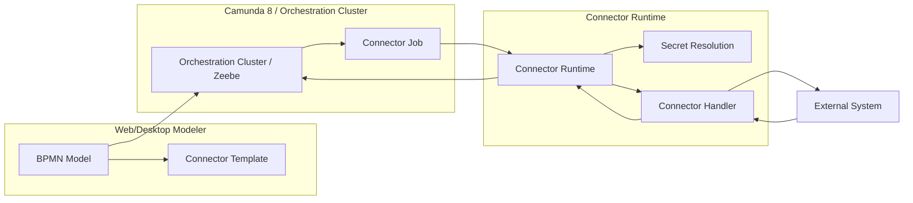
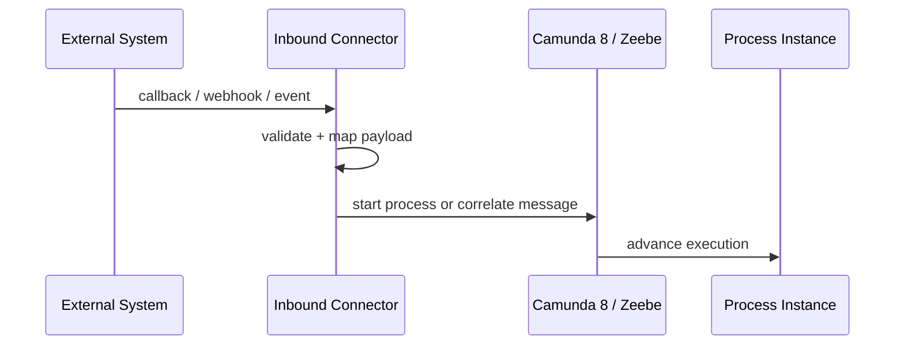
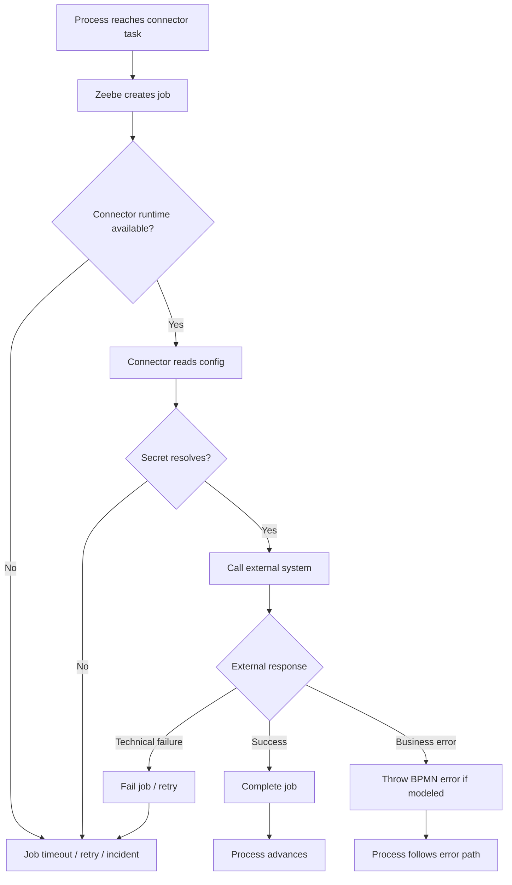

# Part 023 — Camunda 8 Connectors

> Fokus part ini: memahami Camunda 8 Connectors sebagai integration abstraction, bukan sekadar shortcut HTTP call dari BPMN. Connector bisa mempercepat integrasi, tetapi tetap membawa risiko reliability, security, observability, idempotency, payload, dan ownership yang harus direview seperti production worker.

Dalam Camunda 8, **worker** bukan satu-satunya cara menjalankan service task atau integrasi. Camunda menyediakan **Connectors** sebagai mekanisme siap pakai atau reusable untuk menghubungkan workflow dengan sistem eksternal.

Mental model:

```text
Connector = managed/reusable integration worker pattern.
Outbound connector = process triggers external system.
Inbound connector = external system triggers/correlates process.
Connector template = modelling-time contract.
Connector runtime = execution-time component.
Secret = sensitive runtime configuration, not BPMN data.
```

Untuk senior backend engineer, pertanyaan utamanya bukan "bisa pakai connector atau tidak", tetapi:

```text
Apakah connector ini cukup reliable, observable, secure, testable, and owned for this production process?
```

---

## 1. What Is a Camunda 8 Connector?

A connector is a prebuilt or custom integration component that lets a BPMN process interact with external systems without every team writing a custom worker from scratch.

Connector biasanya digunakan untuk:

- HTTP/REST call;
- webhook/inbound trigger;
- messaging integration;
- SaaS integration;
- cloud service integration;
- reusable enterprise integration pattern;
- low-code/modeller-friendly integration;
- standardized secret handling;
- standardized request/response mapping.

Connector does **not** remove distributed systems problems.

It still has to deal with:

- timeout;
- retry;
- authentication;
- authorization;
- rate limit;
- payload mapping;
- duplicate request;
- partial failure;
- idempotency;
- auditability;
- production debugging.

Bad mental model:

```text
Connector = safe integration by default.
```

Better mental model:

```text
Connector = integration code packaged behind BPMN-friendly configuration.
```

---

## 2. Connector Runtime Architecture

At runtime, connector logic is not magically executed by the BPMN diagram itself.

A simplified architecture:



Core idea:

```text
BPMN defines the connector configuration.
Zeebe creates executable work.
Connector runtime executes connector logic.
External system receives side effect.
Result is mapped back into process variables.
```

Production implication:

```text
If connector runtime is down, affected connector-backed tasks cannot progress.
```

---

## 3. Outbound Connectors

An outbound connector is used when a workflow step needs to call or trigger an external system.

Examples:

- call pricing service;
- create CRM case;
- invoke fulfillment API;
- publish message to integration endpoint;
- call notification service;
- request validation from external BSS/OSS system;
- call internal Java/JAX-RS service via REST;
- trigger cloud function or SaaS workflow.

Typical BPMN shape:


Outbound connector review questions:

| Question | Why it matters |
|---|---|
| Is the external call idempotent? | Retry may duplicate side effect. |
| What timeout is used? | Slow API can block workflow progress. |
| What is the retry policy? | Bad retry can cause storm. |
| Where are credentials stored? | Prevent secrets in BPMN/XML. |
| What response is mapped back? | Prevent large/sensitive variable payload. |
| How is failure represented? | Technical failure vs BPMN business error. |
| Who owns the connector config? | Incident ownership. |

---

## 4. Inbound Connectors

An inbound connector is used when an external system sends data into Camunda.

It may:

- start a new process;
- correlate a message to an existing process;
- receive webhook events;
- receive external callbacks;
- convert external payload into process variables;
- expose an integration endpoint managed by connector runtime.

Typical shape:



Inbound connector risks:

- unauthenticated webhook;
- spoofed event;
- duplicate callback;
- late callback;
- correlation key mismatch;
- payload schema drift;
- hidden public endpoint;
- no replay strategy;
- weak auditability;
- missing rate limit;
- unclear tenant boundary.

Senior engineer rule:

```text
Inbound connector is an API surface. Treat it like a production endpoint.
```

That means:

- authentication;
- authorization;
- request validation;
- schema versioning;
- rate limiting;
- idempotency;
- audit log;
- correlation tracing;
- alerting.

---

## 5. Connector Template

A connector template defines how the connector appears and is configured in the modeler.

It usually controls:

- visible fields;
- required properties;
- input mapping;
- output mapping;
- secret references;
- validation hints;
- user-friendly labels;
- connector-specific metadata.

This matters because connector configuration becomes a process contract.

Bad connector template design:

```text
Free-text URL
Free-text auth header
No required timeout
No output schema
No error mapping
No owner
```

Better connector template design:

```text
Named endpoint
Secret reference
Explicit timeout
Explicit retry policy
Typed input fields
Typed output mapping
Business error mapping
Owner/team metadata
```

Design principle:

```text
A connector template should prevent unsafe configurations, not merely make unsafe configurations prettier.
```

---

## 6. Connector Secrets

Secrets should not be stored in BPMN XML, process variables, task forms, logs, or incidents.

Connector secrets may include:

- API key;
- bearer token;
- OAuth client secret;
- basic auth password;
- endpoint credential;
- certificate reference;
- queue credential;
- cloud service credential.

Unsafe pattern:

```xml
<camunda:inputParameter name="Authorization">Bearer eyJ...</camunda:inputParameter>
```

Safer conceptual pattern:

```text
BPMN stores: {{secrets.FULFILLMENT_API_TOKEN}}
Secret manager stores actual token.
Connector runtime resolves token at execution time.
```

Review checklist:

- Is the secret referenced, not embedded?
- Who can read or update the secret?
- Is the secret environment-specific?
- Is rotation supported?
- Is secret usage audited?
- Does connector log resolved secret accidentally?
- Does failed incident expose secret?
- Is local testing using safe override secrets?

For CSG-like enterprise systems, secrets often cross multiple responsibility boundaries:

```text
Backend team owns integration logic.
Platform/SRE owns secret management mechanism.
Security owns policy.
Product/BA owns business process.
```

Do not let that become an ownership gap.

---

## 7. Connector vs Custom Worker

Connector and custom worker are both ways to implement automated work.

The trade-off is not "low-code vs code" only. It is about ownership, complexity, risk, and operational control.

| Dimension | Connector | Custom worker |
|---|---|---|
| Speed | Fast for standard integration | Slower initially |
| Logic complexity | Best for simple/reusable integration | Best for complex domain logic |
| Testability | Depends on connector tooling | Full code-level tests |
| Observability | Depends on runtime/connector | Fully customizable |
| Idempotency | Must be configured/designed | Can be enforced in code/DB |
| Security | Template + secret mechanism | App security stack |
| Ownership | Can be ambiguous | Usually service team owns it |
| Debugging | Config/runtime focused | Code/log/trace focused |
| Versioning | Template/config versioning | Application release versioning |

Use connector when:

- integration is standard and low-complexity;
- mapping is straightforward;
- connector has mature retry/error behavior;
- security model is clear;
- observability is enough;
- process owner can safely configure it;
- operational team understands connector runtime.

Use custom worker when:

- business logic is complex;
- side effect must be idempotent through DB constraints;
- multiple systems are updated in one step;
- domain invariants must be enforced;
- failure handling is nuanced;
- high-volume performance tuning is needed;
- security/auth logic is non-trivial;
- you need deep logs, metrics, tracing, and tests.

Decision rule:

```text
If the step mutates core quote/order state, prefer custom worker unless the connector has strong, reviewed semantics.
```

---

## 8. HTTP Connector in Enterprise Backend Context

HTTP connector is attractive because many internal systems expose REST/JAX-RS APIs.

But an HTTP call inside a process is still a distributed command.

Risks:

- endpoint timeout;
- retry duplicates command;
- 500 response after side effect succeeded;
- 202 Accepted without completion tracking;
- inconsistent error response schema;
- authentication expiration;
- payload too large;
- PII exposed in request/response variables;
- no correlation ID propagation;
- synchronous call to slow downstream system.

For Java/JAX-RS services, design the target endpoint as workflow-aware:

```http
POST /orders/{orderId}/fulfillment-requests
Idempotency-Key: <processInstanceKey>:<elementId>:<jobKey-or-commandId>
X-Correlation-Id: <business-correlation-id>
Content-Type: application/json
```

Response pattern:

```json
{
  "requestId": "fulfillment-request-123",
  "status": "ACCEPTED",
  "correlationKey": "order-456"
}
```

Avoid returning entire domain aggregates as process variables.

Prefer:

```text
Return reference IDs and outcome flags.
Keep canonical state in PostgreSQL/domain service.
```

---

## 9. Kafka and RabbitMQ Connector Awareness

If Kafka/RabbitMQ connectors are used, treat them as integration points with messaging semantics.

Questions for Kafka connector usage:

- Is this publish or consume/correlate?
- What is the event key?
- Is ordering required?
- What schema version is used?
- What happens on replay?
- How are duplicates handled?
- Is the process started from event or merely notified?
- Does event carry PII?
- Is outbox still needed?

Questions for RabbitMQ connector usage:

- What exchange and routing key are used?
- Is the message a command, event, or reply?
- Is there a DLQ?
- Who owns retry: RabbitMQ, connector, worker, or workflow engine?
- How is reply correlation handled?
- Is the message idempotent?
- What happens if message is delivered but process correlation fails?

Important:

```text
Connector does not remove the need for event design discipline.
```

For high-value quote/order workflows, do not let connector config become a shadow integration architecture undocumented by backend teams.

---

## 10. Custom Connectors

A custom connector is useful when integration logic should be reusable but still standardized through modelling-time configuration.

Good use cases:

- standardized internal API call pattern;
- common authentication and headers;
- standard correlation ID propagation;
- reusable validation;
- common error mapping;
- common response extraction;
- platform-approved integration pattern;
- domain-specific reusable connector, such as `Create Fallout Case` or `Notify Order Status`.

Bad use cases:

- hiding complex quote/order domain logic in connector code;
- bypassing service ownership;
- making connector a god integration layer;
- putting business rules into connector template fields;
- creating connector without test/observability/ownership.

Custom connector should have:

- versioned contract;
- owner team;
- test suite;
- sample BPMN;
- failure mode documentation;
- secret handling policy;
- observability standard;
- release process;
- backward compatibility policy.

---

## 11. Connector Reliability Model

Connector-backed task can fail in several places:



Failure categories:

| Failure | Likely handling |
|---|---|
| Connector runtime down | retry/incident, platform/SRE action |
| Secret missing | configuration incident, deployment/config fix |
| Auth failure | secret rotation/auth policy fix |
| External 4xx business rejection | BPMN error if expected business outcome |
| External 5xx/transient | retry with backoff |
| Timeout | retry if idempotent; incident if unsafe |
| Response mapping failure | configuration/model bug |
| Output variable too large | variable design bug |
| Duplicate side effect | idempotency design bug |

---

## 12. Connector Retry and Error Mapping

The biggest modelling mistake is treating all connector failures the same.

Separate:

```text
Business outcome      -> BPMN error / explicit branch
Technical transient   -> retry
Technical permanent   -> incident/manual repair
Security/config error -> incident/config remediation
Data contract error   -> incident + fix producer/model/connector
```

Example:

| Scenario | Should it be retry? | Better handling |
|---|---:|---|
| Fulfillment API temporarily unavailable | Yes, with backoff | retry then incident |
| Customer not eligible | No | BPMN business error / gateway branch |
| Missing required token | No | incident/config fix |
| Duplicate request accepted idempotently | Safe | complete with existing result |
| Duplicate request creates new downstream object | Dangerous | redesign idempotency |
| HTTP 400 due to model mapping bug | No | incident + fix BPMN/config |

Connector retry must be evaluated with side effect semantics.

```text
Retry-safe connector = external operation is idempotent or guarded by idempotency key.
```

---

## 13. Connector Output Mapping

Connector response should not be dumped into process variables blindly.

Bad pattern:

```text
Store full HTTP response body as variable externalResponse
```

Problems:

- large payload;
- sensitive data;
- unstable schema;
- downstream expressions depend on raw integration shape;
- difficult migration;
- poor audit boundary;
- history/search bloat.

Better pattern:

```json
{
  "fulfillmentRequestId": "FR-123",
  "fulfillmentAccepted": true,
  "fulfillmentStatus": "PENDING"
}
```

Mapping rule:

```text
Map connector output to process-relevant facts only.
Store canonical integration details in domain database/log/audit store.
```

For CPQ/order workflow, process variables should answer:

- what branch should process take?
- what reference ID is needed later?
- what business outcome occurred?
- what correlation key is needed?
- what human task should be created?

They should not become:

- full quote object;
- full order aggregate;
- raw external API response;
- customer PII dump;
- debug log storage.

---

## 14. Connector Observability

Connector-backed integration must expose enough signals to debug production issues.

Minimum signals:

- connector task count;
- connector success/failure count;
- connector latency;
- external dependency latency;
- timeout count;
- retry count;
- incident count;
- auth/secret failure count;
- response mapping failure count;
- correlation ID;
- process instance key;
- element ID;
- connector type;
- external endpoint/service name.

Useful log fields:

```json
{
  "processInstanceKey": "2251799813685249",
  "processDefinitionId": "order-fulfillment",
  "elementId": "callFulfillmentApi",
  "connectorType": "http-json",
  "externalService": "fulfillment-api",
  "correlationId": "order-123",
  "businessKey": "ORDER-123",
  "attempt": 2,
  "status": "FAILED_TIMEOUT"
}
```

Do not log:

- bearer tokens;
- API keys;
- passwords;
- full PII payload;
- raw authorization headers;
- full task form data;
- private customer/order details unless explicitly approved and redacted.

---

## 15. Connector Security Review

Connector security review must cover both modelling time and runtime.

Modelling-time concerns:

- who can add connector to BPMN?
- who can modify endpoint/config?
- are unsafe fields allowed?
- are templates reviewed?
- are secrets referenced safely?
- are environment-specific values separated?

Runtime concerns:

- connector runtime identity;
- network egress policy;
- TLS/mTLS;
- OAuth/OIDC credential flow;
- service account permission;
- secret resolution;
- audit trail;
- tenant isolation;
- request signing if needed;
- rate limit and abuse protection for inbound connectors.

Security principle:

```text
A connector can become an unreviewed production integration endpoint if model governance is weak.
```

For regulated enterprise systems, connector changes should be reviewed like code changes if they affect:

- customer data;
- financial outcome;
- order state;
- entitlement;
- approval path;
- external API side effect;
- audit/legal evidence.

---

## 16. Connector Versioning

Connector versioning has multiple layers:

- BPMN process definition version;
- connector template version;
- connector runtime version;
- external API version;
- secret/config version;
- output variable contract version;
- worker/consumer version if connector emits messages.

Failure example:

```text
BPMN v5 expects response field `status`.
External API v2 returns `state`.
Connector runtime maps nothing.
Gateway condition sees missing variable.
Process takes default/failure path or creates incident.
```

Versioning checklist:

- Is the connector template version pinned?
- Can old running instances still complete?
- Does connector runtime support old config?
- Are output variables backward compatible?
- Are external API changes coordinated?
- Does deployment pipeline validate connector config?
- Is there rollback strategy?

---

## 17. Connector Testing

Connector-backed process must be tested at multiple levels.

Test levels:

| Level | Purpose |
|---|---|
| Template validation | Prevent invalid config in BPMN. |
| Unit test for custom connector | Validate mapping/error handling. |
| Integration test with mock external API | Validate request/response/failure. |
| BPMN process test | Validate branch behavior. |
| End-to-end test | Validate connector runtime + Zeebe + service. |
| Chaos/failure test | Validate timeout/retry/incident. |
| Security test | Validate secret handling and auth failure. |

Testing scenarios:

- success response;
- business rejection;
- HTTP 400 mapping issue;
- HTTP 401/403;
- HTTP 429 rate limit;
- HTTP 500;
- network timeout;
- malformed response;
- missing secret;
- duplicate callback;
- large response;
- PII redaction;
- retry exhaustion.

---

## 18. Connector in Kubernetes

In self-managed environments, connector runtime is operational infrastructure.

Kubernetes review points:

- Deployment or component ownership;
- replica count;
- resource requests/limits;
- liveness/readiness probes;
- secret mounting/reference;
- network egress policy;
- service account permissions;
- logs and metrics scraping;
- rolling deployment behavior;
- graceful shutdown;
- dependency on Orchestration Cluster/Zeebe;
- environment-specific config;
- GitOps reconciliation.

Failure modes:

- connector runtime pod crashloop;
- missing secret after deployment;
- network policy blocks external API;
- DNS failure;
- TLS certificate expired;
- connector runtime upgraded before template compatibility check;
- too few replicas causing backlog;
- too much concurrency causing downstream overload.

---

## 19. Connector in AWS/Azure/On-Prem/Hybrid

Cloud/on-prem environment affects connector reliability.

AWS examples:

- Secrets Manager integration;
- IAM role/service account;
- VPC egress;
- PrivateLink/private endpoint;
- CloudWatch logs/metrics;
- RDS/OpenSearch dependencies indirectly affecting process visibility;
- outbound NAT bottleneck.

Azure examples:

- Key Vault;
- managed identity;
- VNet/NSG/private endpoint;
- Azure Monitor;
- Application Gateway or private routing;
- certificate management.

On-prem/hybrid examples:

- firewall allowlist;
- internal CA;
- proxy requirement;
- air-gapped secret management;
- patch window;
- customer-managed network;
- cross-boundary latency;
- responsibility split between vendor/customer/platform.

Checklist:

```text
Can connector runtime reach every system it calls?
Can every external system safely call inbound connector endpoints?
Are credentials, DNS, TLS, and network boundaries documented?
Is failure observable by the team that must fix it?
```

---

## 20. Connector Anti-Patterns

Common anti-patterns:

1. **Connector as hidden business logic**
   - Business decision lives in connector config or mapping expression.

2. **Connector as database replacement**
   - Full domain object stored in variables after connector call.

3. **Connector without owner**
   - Process team thinks platform owns it; platform thinks app team owns it.

4. **Connector without idempotency**
   - Retry duplicates external side effect.

5. **Connector with embedded secrets**
   - Credential appears in BPMN XML, logs, incident, or Git.

6. **Connector with raw response propagation**
   - Downstream BPMN depends on unstable external schema.

7. **Connector with no timeout discipline**
   - Slow external system blocks process progress.

8. **Connector used for high-complexity domain transaction**
   - Logic should be custom worker/domain service.

9. **Inbound connector as unauthenticated public endpoint**
   - External caller can start/correlate process unsafely.

10. **Connector config changed without CI/CD review**
    - Production behavior changes outside code review.

---

## 21. Internal Verification Checklist

Use this checklist against your actual CSG/team environment.

### Camunda usage

- Is Camunda 8 used, or is this only future/migration awareness?
- Are Connectors enabled?
- Is connector runtime deployed?
- Is this SaaS or self-managed?
- Which connector types are allowed?

### Connector inventory

- List all BPMN elements using connectors.
- Identify connector type per task.
- Identify owner team per connector.
- Identify external system touched.
- Identify side effect performed.
- Identify security classification.

### Connector runtime

- Where is connector runtime deployed?
- How many replicas?
- What resource limits?
- What health checks?
- How are logs/metrics collected?
- How are runtime upgrades performed?

### Secrets

- Where are connector secrets stored?
- Are any secrets embedded in BPMN/XML/Git?
- Is secret rotation documented?
- Who can update secrets?
- Are failed incidents/logs redacted?

### Reliability

- What timeout per connector?
- What retry policy?
- What errors map to BPMN error?
- What errors become incidents?
- Is external call idempotent?
- Is there a deduplication key?

### Integration

- Which Java/JAX-RS services are called?
- Are correlation IDs propagated?
- Are idempotency keys propagated?
- Are response schemas stable?
- Are Kafka/RabbitMQ connector usages governed?

### Observability

- Can you find connector failures in Operate?
- Can you correlate connector failure with application logs?
- Are connector latency/failure metrics available?
- Are alerts configured?
- Are connector runtime failures visible to SRE/platform?

### Security and compliance

- Are inbound connectors authenticated?
- Are endpoints private or public?
- Is tenant/customer isolation enforced?
- Are PII fields mapped into variables?
- Is audit evidence sufficient?

---

## 22. PR Review Checklist

When reviewing connector-related changes, ask:

- Why connector instead of custom worker?
- What side effect does the connector perform?
- Is the side effect idempotent?
- What is the timeout?
- What is the retry policy?
- What is the incident path?
- What is the BPMN business error path?
- What variables are input/output?
- Are outputs minimal and stable?
- Are secrets referenced safely?
- Is endpoint/environment config controlled?
- Is authorization model clear?
- Is correlation ID propagated?
- Is observability enough?
- Is there a test for failure path?
- Does running instance compatibility matter?
- Is deployment/rollback documented?
- Who owns production incident for this connector?

---

## 23. Practical Decision Matrix

| Scenario | Prefer connector | Prefer custom worker |
|---|---:|---:|
| Simple HTTP notification | Yes | Maybe |
| Complex order state mutation | Rarely | Yes |
| Needs DB transaction/outbox | No | Yes |
| Needs custom idempotency table | No | Yes |
| Standard SaaS integration | Yes | Maybe |
| High-volume low-latency processing | Maybe | Usually |
| Sensitive regulated data handling | Maybe, after review | Often |
| Business rule-heavy logic | No | Yes |
| Reusable enterprise integration pattern | Yes, if governed | Maybe |
| Requires deep custom metrics/tracing | Maybe | Yes |

Rule of thumb:

```text
Connector is good for standardized integration.
Custom worker is better for domain-critical side effects.
```

---

## 24. Key Takeaways

- Connector is an integration abstraction, not a reliability guarantee.
- Outbound connector triggers external systems; inbound connector receives external input.
- Connector runtime is production infrastructure and must be monitored.
- Secrets must be referenced, not embedded in BPMN or variables.
- Connector output must be minimal, stable, and process-relevant.
- Connector retry must be reviewed against side effect idempotency.
- Inbound connector is an API surface and needs authentication, validation, rate limiting, and audit.
- Connector vs custom worker is an architecture decision, not a convenience preference.
- In CSG-like quote/order systems, connector usage must be reviewed for correctness, security, and operational ownership.

---

## 25. Suggested Exercises

1. Pick one service task in an internal or sample BPMN process. Decide whether it should be connector-backed or worker-backed.
2. Design an HTTP connector call to a Java/JAX-RS service with idempotency key and correlation ID.
3. Write a failure table for a connector that calls an external fulfillment API.
4. Define safe output variable mapping for a connector response.
5. Create a PR review checklist for connector-based BPMN changes in your team.

---

## 26. References

- Camunda 8 Docs — Connectors introduction
- Camunda 8 Docs — Connector types
- Camunda 8 Docs — Use connectors
- Camunda 8 Docs — Inbound connectors
- Camunda 8 Docs — Connector runtime configuration
- Camunda 8 Docs — Testing connectors
- Camunda 8 Docs — Variables and input/output mappings
