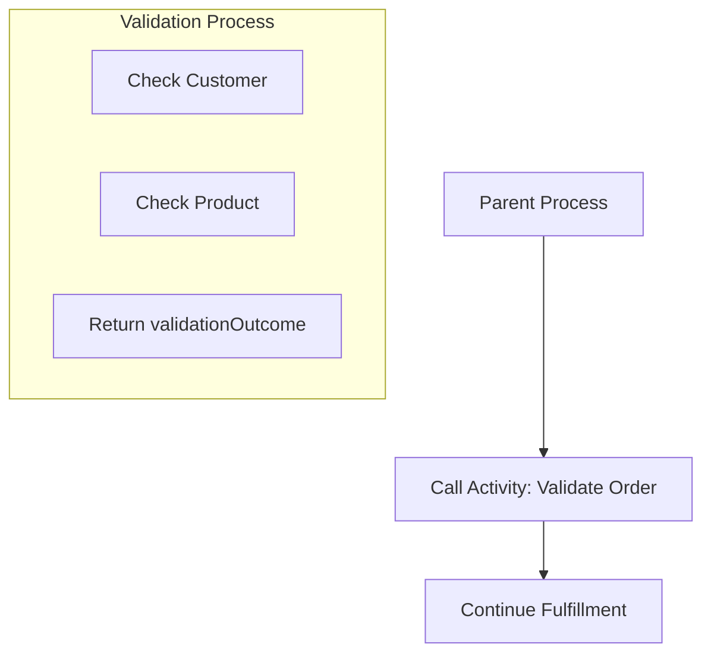
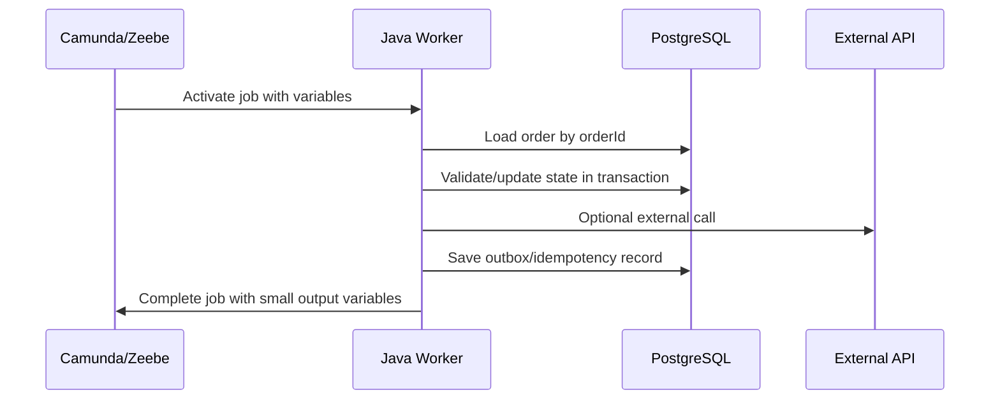

# Part 024 — Variables, Payload, and Data Modelling

> Fokus part ini: mendesain process variables sebagai runtime context yang kecil, stabil, aman, dan audit-friendly. Variable bukan tempat menyimpan seluruh domain object. Variable adalah data minimum yang diperlukan agar process dapat bergerak, mengambil keputusan, menunggu message, menjalankan worker, dan menghasilkan audit trail yang masuk akal.

Dalam workflow system, variable sering menjadi sumber bug tersembunyi:

- variable missing;
- variable punya tipe berbeda antar version;
- variable terlalu besar;
- variable menyimpan PII;
- variable menduplikasi database state;
- variable hasil connector berubah schema;
- gateway expression membaca field yang tidak stabil;
- worker mengandalkan raw payload yang tidak versioned;
- migration gagal karena variable contract berubah.

Mental model:

```text
Database owns canonical domain state.
Workflow variables own process execution context.
Messages/events own integration facts.
Logs/traces own debugging evidence.
Audit store owns compliance evidence.
```

Process variable harus cukup untuk menjalankan proses, tetapi tidak boleh berubah menjadi database bayangan.

---

## 1. What Is a Process Variable?

A process variable is data associated with a process execution.

It may be used by:

- gateway condition;
- service task input;
- worker input;
- user task form;
- DMN decision input;
- message correlation;
- timer expression;
- connector configuration;
- output mapping;
- audit/operation tooling;
- process instance search/filtering.

Example process variables:

```json
{
  "quoteId": "Q-1001",
  "orderId": "O-9001",
  "customerSegment": "ENTERPRISE",
  "approvalRequired": true,
  "approvalLevel": "DIRECTOR",
  "fulfillmentRequestId": "FR-123",
  "correlationId": "corr-abc-123"
}
```

Bad process variables:

```json
{
  "entireQuoteAggregate": { "...": "thousands of fields" },
  "rawFulfillmentApiResponse": { "...": "unstable vendor response" },
  "accessToken": "eyJ...",
  "customerFullProfileWithPII": { "...": "sensitive data" }
}
```

Senior engineer rule:

```text
A process variable should be intentionally designed, not accidentally accumulated.
```

---

## 2. Variable as Runtime Contract

Every variable is a contract between:

- BPMN model;
- worker implementation;
- connector configuration;
- DMN decision table;
- task form;
- API layer;
- database layer;
- message/event layer;
- observability/debugging tools;
- migration/versioning process.

If one side changes the variable shape, another side can break.

Example:

```text
Gateway condition: = approvalRequired = true
Worker output changes approvalRequired -> needsApproval
Process silently takes default path or fails expression evaluation.
```

Variable contract should specify:

| Field | Meaning |
|---|---|
| name | Stable variable name. |
| type | String, boolean, number, object, list. |
| owner | Which task/service produces it. |
| consumer | Which task/gateway/DMN/form consumes it. |
| required? | Is process invalid without it? |
| sensitivity | Public/internal/PII/secret. |
| versioning | Can shape change? |
| retention | Should it remain in history? |

---

## 3. Global vs Local Variables

Process variables can exist at different scopes.

Conceptual distinction:

```text
Global/root variable = visible broadly across process instance.
Local variable = scoped to a specific activity/subprocess/call activity context.
```

Use global variables for stable process-wide facts:

- quoteId;
- orderId;
- customerId reference;
- businessKey;
- correlationId;
- tenantId;
- approvalRequired;
- current major process outcome.

Use local variables for temporary task/subprocess data:

- raw API response needed only in one task;
- intermediate calculation;
- connector-specific request body;
- temporary validation result;
- subprocess-specific branch flag.

Bad pattern:

```text
Every task writes every intermediate value to root process scope.
```

Why it hurts:

- variable namespace pollution;
- accidental downstream dependency;
- difficult migration;
- larger history/search payload;
- sensitive data exposure;
- debugging confusion.

Better pattern:

```text
Keep temporary data local.
Promote only stable process facts to root scope.
```

---

## 4. Variable Scope in Subprocess and Call Activity

Subprocess/call activity composition makes variable scoping more important.

Example:



Variable questions:

- What does parent pass into child?
- What does child return?
- Are child internals hidden?
- Does child mutate parent state directly?
- Is version compatibility clear?
- Are error variables mapped back intentionally?

Good call activity mapping:

```text
Input:
  orderId
  quoteId
  tenantId
  validationRequestId

Output:
  validationOutcome
  validationFailureReasonCode
```

Bad mapping:

```text
Input: all variables
Output: all variables
```

Why bad:

- parent and child become tightly coupled;
- child internals leak;
- variable name collisions;
- migration becomes risky;
- debugging becomes harder.

---

## 5. Business Key, Correlation ID, and Correlation Key

These terms are often confused.

### Business key

A business key identifies the business entity/process from business perspective.

Examples:

```text
QUOTE-123
ORDER-456
CUSTOMER-789
```

Use it for:

- human debugging;
- process search;
- logs;
- operational dashboard;
- linking process to domain entity;
- customer-impact investigation.

### Correlation ID

A correlation ID ties logs/traces/events/API calls together.

Examples:

```text
corr-2026-07-11-abc123
traceparent header
request ID from API gateway
```

Use it for:

- distributed tracing;
- log correlation;
- incident investigation;
- request lifecycle tracking.

### Correlation key

A correlation key is used to match external message/event to a waiting process subscription.

Examples:

```text
orderId
fulfillmentRequestId
paymentRequestId
approvalRequestId
```

Use it for:

- message catch event;
- receive task;
- inbound connector correlation;
- callback/event matching.

Do not mix them blindly.

| Concept | Primary purpose | Example |
|---|---|---|
| Business key | Business lookup | `ORDER-456` |
| Correlation ID | Technical traceability | `corr-abc-123` |
| Correlation key | Message matching | `fulfillmentRequestId=FR-123` |

Important:

```text
A value can sometimes serve more than one role, but each role must be explicit.
```

---

## 6. Variable Naming

Variable names should be stable, explicit, and business-readable.

Good names:

```text
quoteId
orderId
tenantId
approvalRequired
approvalLevel
fulfillmentRequestId
fulfillmentStatus
falloutReasonCode
customerSegment
correlationId
```

Bad names:

```text
data
payload
response
result
flag
tmp
x
body
obj
status
```

`status` is especially dangerous because it is ambiguous:

```text
status of what?
order status?
process status?
fulfillment status?
task status?
approval status?
external API status?
```

Prefer explicit status names:

```text
orderStatus
approvalStatus
fulfillmentStatus
validationStatus
processOutcome
```

Naming principles:

- use domain language;
- avoid implementation details;
- avoid raw external field names unless intentionally mapped;
- avoid generic variables;
- use suffixes like `Id`, `Code`, `Status`, `Outcome`, `Reason` consistently;
- document producer and consumers.

---

## 7. Type Discipline

Variable type changes can break gateways, forms, workers, and DMN.

Common dangerous changes:

```text
approvalRequired: boolean -> string "true"
orderId: string -> number
amount: number -> string with currency
customer: object -> customerId string
reasons: list -> comma-separated string
```

Type design table:

| Variable | Good type | Avoid |
|---|---|---|
| `approvalRequired` | boolean | string flag |
| `orderId` | string | numeric if ID has business format |
| `totalAmount` | number + currency field | formatted string |
| `reasonCodes` | list of string | comma-separated string |
| `validationOutcome` | enum-like string | arbitrary text |
| `customerRef` | object with IDs only | full customer profile |

Recommended pattern:

```json
{
  "pricingDecision": {
    "outcome": "APPROVED_WITH_OVERRIDE",
    "reasonCodes": ["DISCOUNT_THRESHOLD_EXCEEDED"],
    "approvedByPolicy": false
  }
}
```

Avoid unstable raw payload:

```json
{
  "pricingResponse": {
    "vendorSpecificNestedShape": "..."
  }
}
```

---

## 8. Object Variables and JSON Variables

Object/JSON variables are useful, but dangerous when unconstrained.

Use object variables for cohesive process data:

```json
{
  "approvalContext": {
    "quoteId": "Q-1001",
    "requestedDiscountPercent": 22.5,
    "customerSegment": "ENTERPRISE",
    "approvalLevel": "VP"
  }
}
```

Avoid using object variables for entire domain aggregates:

```json
{
  "quote": {
    "lineItems": ["... thousands ..."],
    "customer": { "... PII ..." },
    "pricing": { "... complex ..." },
    "history": ["... huge ..."]
  }
}
```

Risk areas:

- serialization compatibility;
- classpath dependency in Camunda 7;
- history table bloat;
- search/index pressure in Camunda 8 tooling;
- FEEL/expression complexity;
- accidental PII exposure;
- migration difficulty;
- debugging noise.

Guideline:

```text
Use JSON-like objects for small, versioned process DTOs.
Do not store ORM/domain entities as workflow variables.
```

---

## 9. Camunda 7 Variable Serialization Awareness

In Camunda 7, variables are persisted in the engine database.

Object variables can involve serialization format choices and classpath/deserialization concerns.

Production risks:

- Java serialized object requires compatible class on classpath;
- class renamed or package changed;
- deployment has different class version;
- REST API deserialization exposes classpath issues;
- large object stored in byte array table;
- history cleanup becomes expensive;
- Cockpit variable inspection becomes slow or unsafe;
- sensitive data lands in history.

Safer direction:

```text
Prefer primitive/string/JSON process DTOs over Java serialized domain objects.
```

For Java/JAX-RS applications:

- do not store JPA/MyBatis domain entity as variable;
- do not rely on Java serialization for long-running compatibility;
- store domain entity in PostgreSQL;
- store stable IDs and small DTOs in process variable;
- treat variable shape as API contract.

Example:

```text
Instead of variable: OrderEntity
Use variables: orderId, orderVersion, validationOutcome, fulfillmentRequestId
```

---

## 10. Camunda 8 Variable Awareness

In Camunda 8/Zeebe, variables are part of process execution state and are exchanged with workers through the Zeebe API.

Production implications:

- variables are sent to workers;
- large variables increase network and processing overhead;
- variables may be exported to Operate/search infrastructure;
- variable updates are records in the stream;
- variable mapping affects process instance state;
- worker output can overwrite variables if poorly named;
- FEEL expressions depend on variable shape.

Good worker completion output:

```json
{
  "validationOutcome": "PASSED",
  "validationCompletedAt": "2026-07-11T10:15:00Z"
}
```

Bad worker completion output:

```json
{
  "data": { "... giant response ..." },
  "status": "ok",
  "result": true
}
```

Camunda 8 design rule:

```text
Assume every variable can affect broker state size, worker payload, Operate visibility, and debugging cost.
```

---

## 11. Input and Output Mapping

Input/output mapping controls what data a task/subprocess receives and what data it returns.

Why it matters:

- reduces accidental variable dependency;
- keeps worker input small;
- protects sensitive data;
- improves versioning;
- prevents downstream pollution;
- documents contract;
- supports reusable subprocess/call activity.

Bad worker input:

```text
Worker receives all process variables.
Worker picks whatever it needs.
```

Better worker input:

```json
{
  "orderId": "O-9001",
  "tenantId": "TENANT-A",
  "correlationId": "corr-123"
}
```

Bad output:

```json
{
  "response": { "raw": "everything" }
}
```

Better output:

```json
{
  "fulfillmentRequestId": "FR-123",
  "fulfillmentAccepted": true
}
```

Review question:

```text
If this task receives only the mapped input variables, can it still execute correctly?
```

If not, your task contract is implicit.

---

## 12. Process Variable vs Database State

This is one of the most important architecture boundaries.

Database state:

- canonical quote/order data;
- transactional updates;
- domain invariants;
- optimistic locking;
- audit tables;
- relational queries;
- state machine enforcement;
- source of truth for business entity.

Process variables:

- workflow routing context;
- process-local decision facts;
- external correlation keys;
- task form context;
- worker input/output contract;
- process debugging context.

Anti-pattern:

```text
Order status exists in PostgreSQL, process variable, Redis cache, Kafka event, task table, and UI state with no reconciliation rule.
```

Better pattern:

```text
PostgreSQL owns orderStatus.
Workflow variable owns processOutcome/current orchestration context.
Events communicate state changes.
Redis caches only derived/read-optimized view with TTL.
```

Example mapping:

| Data | Source of truth |
|---|---|
| `orderStatus` | PostgreSQL/domain service |
| `processInstanceKey` | Camunda/Zeebe |
| `fulfillmentRequestId` | External/domain integration table + variable reference |
| `approvalRequired` | Decision result variable, possibly persisted as audit |
| `currentUserTaskId` | Camunda task runtime |
| `orderVersion` | PostgreSQL optimistic lock/version |

---

## 13. Variable and MyBatis/JDBC Boundary

In Java/JAX-RS + PostgreSQL/MyBatis systems, worker often follows this pattern:



Do not trust process variable blindly as canonical domain data.

Worker should usually:

1. read IDs from variables;
2. load canonical state from DB;
3. validate domain invariant;
4. perform transaction/side effect safely;
5. complete job with process-relevant outcome.

Example:

```text
Variable says orderStatus = VALIDATED.
DB says orderStatus = CANCELLED.
```

Correct behavior is not to follow the variable blindly. The worker must detect inconsistency and fail safely or take modeled business path.

---

## 14. Sensitive Variables

Sensitive variables include:

- PII;
- customer identity details;
- pricing discount details;
- contract terms;
- payment data;
- access token;
- API key;
- credentials;
- internal security decision;
- personally identifiable task form data;
- customer-specific network/config data.

Never store as process variable unless explicitly required and approved:

- password;
- bearer token;
- refresh token;
- private key;
- raw authorization header;
- full customer profile;
- full payment card data;
- unredacted customer document.

If sensitive data is required:

- store reference ID instead of full data;
- fetch from secure service when needed;
- use short retention;
- mask logs;
- restrict variable visibility;
- avoid exposing in task forms/incidents;
- define deletion/retention strategy;
- verify compliance requirements.

Rule:

```text
If a variable appears in Operate/Cockpit/history/logs/task forms, assume it may be seen by more people than expected.
```

---

## 15. Large Variable Risk

Large variables hurt:

- database storage;
- history cleanup;
- job activation payload;
- worker memory;
- network transfer;
- Operate/Cockpit rendering;
- Elasticsearch/OpenSearch indexing;
- backup/restore;
- migration;
- troubleshooting speed.

Large variable examples:

- full order with thousands of line items;
- large quote pricing response;
- full customer profile;
- binary/file content;
- large external API response;
- accumulated audit history;
- nested product catalog snapshot;
- serialized Java object graph.

Better alternatives:

- store document/blob in object storage and variable holds reference;
- store canonical data in PostgreSQL;
- store audit events in audit table/log platform;
- store only IDs/outcomes in variables;
- use pagination/query API for large data;
- use domain service for read model.

Variable size review:

```text
Could this variable grow with number of order lines, customer products, retries, or time?
```

If yes, do not store it as a process variable.

---

## 16. Variable Versioning

Long-running processes make variable versioning unavoidable.

A process instance started today may complete after:

- BPMN changed;
- worker changed;
- DTO changed;
- external API changed;
- DMN changed;
- database schema changed;
- task form changed.

Breaking changes:

- remove variable consumed by old gateway;
- rename variable;
- change boolean to string;
- change object shape;
- change enum values;
- stop producing correlation key;
- change meaning of `status`;
- move field from root to nested object.

Safer changes:

- add optional variable;
- produce both old and new names temporarily;
- version object field explicitly;
- use backward-compatible worker input;
- keep old worker behavior until old instances drain;
- migrate running instances with validated mapping.

Example versioned variable:

```json
{
  "approvalContext": {
    "schemaVersion": 2,
    "quoteId": "Q-1001",
    "approvalLevel": "DIRECTOR",
    "reasonCodes": ["HIGH_DISCOUNT"]
  }
}
```

---

## 17. Variable Ownership

Every important variable needs an owner.

Ownership questions:

- Which BPMN element creates it?
- Which worker/connector writes it?
- Which gateway reads it?
- Which DMN uses it?
- Which form displays it?
- Which API exposes it?
- Which team owns its schema?
- What is the compatibility policy?

Without ownership, variables become tribal knowledge.

Variable registry example:

| Variable | Producer | Consumers | Owner | Sensitivity |
|---|---|---|---|---|
| `orderId` | Start API | all workers | Order service team | internal |
| `approvalRequired` | DMN approval decision | approval gateway | Pricing/BA + backend | internal |
| `fulfillmentRequestId` | fulfillment worker | message correlation | Fulfillment integration team | internal |
| `tenantId` | Start API/auth context | auth filters/workers | platform/backend | sensitive-ish |
| `customerSegment` | customer lookup worker | approval DMN | customer domain team | internal/PII-adjacent |

---

## 18. Variable Auditability

Workflow variables can support audit, but they should not be your only audit mechanism.

Audit questions:

- Which decision was made?
- What input facts were used?
- Who completed task?
- What worker performed side effect?
- What external request was sent?
- What response/outcome was received?
- When did each step happen?
- What changed between retries?
- Was compensation triggered?
- Was manual repair performed?

Process variables can store audit-relevant facts:

```json
{
  "approvalDecision": "APPROVED",
  "approvalReasonCodes": ["WITHIN_POLICY"],
  "approvedBy": "user-123",
  "approvedAt": "2026-07-11T10:20:00Z"
}
```

But detailed audit often belongs in:

- domain audit table;
- event log;
- compliance evidence store;
- task history;
- process history;
- application logs/traces;
- immutable audit pipeline.

Rule:

```text
Use variables for process facts. Use audit store for audit evidence.
```

---

## 19. Variables in Human Tasks and Forms

Human task variables are especially sensitive because they may be shown to users.

Review:

- Which variables are visible in task form?
- Can user edit them?
- Are edits validated?
- Are hidden variables trusted?
- Is PII masked?
- Is task completion authorized?
- Can stale task form overwrite newer state?
- Is draft data persisted safely?
- Is task form schema versioned?

Bad pattern:

```text
Task form submits entire process variable object back to engine.
```

Better pattern:

```text
Task form submits explicit command payload.
Backend validates command against DB/process/task state.
Only approved process variables are updated.
```

Example completion payload:

```json
{
  "decision": "APPROVE",
  "comment": "Approved under enterprise discount policy",
  "clientTaskVersion": 3
}
```

Backend should map to controlled variables:

```json
{
  "approvalDecision": "APPROVED",
  "approvalCommentId": "COMMENT-123",
  "approvalCompletedAt": "2026-07-11T10:20:00Z"
}
```

---

## 20. Variables in DMN

DMN decision tables depend on stable inputs.

Bad DMN input style:

```text
input: customer.type.value.rawCode
input: response.data.pricing.discount.level
input: status
```

Better DMN input style:

```text
customerSegment
requestedDiscountPercent
contractValue
regionCode
productFamily
approvalPolicyVersion
```

DMN variable rules:

- normalize input before DMN;
- keep DMN input names stable;
- avoid raw API response fields;
- version decision context;
- record decision output;
- test hit policy with representative variable values.

Example decision context:

```json
{
  "approvalDecisionInput": {
    "schemaVersion": 1,
    "customerSegment": "ENTERPRISE",
    "requestedDiscountPercent": 22.5,
    "annualContractValue": 1200000,
    "regionCode": "APAC"
  }
}
```

---

## 21. Variables and Message Correlation

Message correlation depends on stable correlation keys.

Example:

```text
Process waits for fulfillment callback.
Message correlation key = fulfillmentRequestId.
```

Required variable lifecycle:

1. fulfillment worker creates external request;
2. external system returns `fulfillmentRequestId`;
3. process stores `fulfillmentRequestId`;
4. process reaches message catch event;
5. subscription uses `fulfillmentRequestId` as correlation key;
6. inbound message arrives with same key;
7. engine correlates message to waiting process.

Failure modes:

- correlation key missing;
- key stored after message subscription expected it;
- external system sends different ID;
- duplicate callback;
- late callback after process moved on;
- multiple instances share same key;
- key changed by later worker;
- tenant ID not included in correlation where needed.

Correlation key rule:

```text
A correlation key must be unique enough, stable enough, and available before the process waits for the message.
```

---

## 22. Variables and Events/Kafka/RabbitMQ

Events and messages often become process variables.

Do not store entire event envelope unless needed.

Typical event envelope:

```json
{
  "eventId": "evt-123",
  "eventType": "OrderValidated",
  "eventVersion": 3,
  "occurredAt": "2026-07-11T10:00:00Z",
  "correlationId": "corr-123",
  "payload": { "...": "..." }
}
```

Process variable should usually store:

```json
{
  "lastOrderEventId": "evt-123",
  "orderValidatedAt": "2026-07-11T10:00:00Z",
  "validationOutcome": "PASSED"
}
```

Kafka/RabbitMQ considerations:

- event ID for deduplication;
- correlation ID propagation;
- schema version;
- out-of-order events;
- replay impact;
- event payload size;
- tenant/customer isolation;
- PII in event payload;
- mapping from event fact to process fact.

Rule:

```text
Map integration event into process facts. Do not let process depend on raw event schema unnecessarily.
```

---

## 23. Variables and Redis

Redis may be used around workflow for:

- idempotency cache;
- rate limiting;
- distributed lock;
- short-lived process status cache;
- feature flag;
- kill switch;
- worker coordination;
- lookup cache.

But Redis should not own canonical process variable state.

Bad pattern:

```text
Process variable missing? Read from Redis cache and continue as if canonical.
```

Better pattern:

```text
Use Redis as optimization or guard.
Use PostgreSQL/domain service/Camunda as source of truth depending on data type.
```

Redis variable-related risks:

- TTL expiration;
- cache staleness;
- eviction;
- split-brain lock assumption;
- stale process status displayed to UI;
- idempotency key lost too early;
- fallback path silently changes process behavior.

---

## 24. Variable Retention and Cleanup

Variables may live longer than expected because process history, audit, backups, and search indexes retain them.

Retention questions:

- How long are runtime variables kept?
- How long is history kept?
- Are variables exported to search/Operate/Optimize?
- Are variables included in backups?
- Can sensitive data be deleted?
- Is retention aligned with legal/compliance requirements?
- Does history cleanup remove PII fast enough?
- Are old process versions retaining old variable schemas?

Data minimization principle:

```text
The best way to comply with retention rules is not to store unnecessary data in variables in the first place.
```

---

## 25. Failure Modes Caused by Bad Variable Design

| Failure | Likely root cause |
|---|---|
| Gateway takes wrong path | variable missing/wrong type/default flow abuse |
| Worker fails immediately | required variable absent or renamed |
| Message not correlated | wrong/missing correlation key |
| Timer expression invalid | date/duration variable malformed |
| DMN returns unexpected result | input variable not normalized |
| User task shows wrong data | stale or overbroad variable mapping |
| Incident exposes PII | sensitive variable in error/context |
| Migration fails | variable shape incompatible |
| Operate/Cockpit slow | large variables/history bloat |
| Duplicate side effect | missing idempotency variable/key |
| Process and DB disagree | duplicated source of truth |
| Retry keeps failing | bad variable value persists across attempts |

Debug approach:

1. identify BPMN element currently active;
2. list variables visible to that scope;
3. check producer of missing/wrong variable;
4. compare variable value with DB canonical state;
5. inspect worker output mapping;
6. inspect connector output mapping;
7. inspect message/event payload;
8. check process version and variable compatibility;
9. avoid manual variable modification until impact is understood.

---

## 26. Variable Design Review Checklist

For every important variable, review:

- Is the name explicit?
- Is the type stable?
- Is the producer known?
- Are all consumers known?
- Is it required or optional?
- Is it global or local?
- Is it process fact or domain state?
- Is it sensitive?
- Is it too large?
- Does it contain PII?
- Is it versioned if object-shaped?
- Is it backward compatible?
- Is it safe for history/search?
- Is it needed after process completion?
- Can it be reconstructed from database if needed?
- Is it used for message correlation?
- Is it used by DMN/gateway expressions?
- Is it exposed in task forms?
- Is it logged?
- Is it included in alert/incident context?

---

## 27. Internal Verification Checklist

Use this against actual CSG/team systems.

### Inventory

- List variables used by each BPMN process.
- Identify root/global variables.
- Identify local/task/subprocess variables.
- Identify variables used in gateways.
- Identify variables used in DMN.
- Identify variables used in task forms.
- Identify variables used in message correlation.

### Source of truth

- Which variables duplicate PostgreSQL state?
- Which state belongs to quote/order domain tables?
- Which variables are merely references to DB rows?
- Is there reconciliation between process state and entity state?
- Are variable values trusted blindly by workers?

### Payload size

- Are full quote/order/customer objects stored?
- Are raw API responses stored?
- Are large arrays stored?
- Are binary/file contents stored?
- Are variables indexed/exported to search tooling?

### Sensitive data

- Which variables contain PII?
- Which variables contain commercial-sensitive pricing/contract data?
- Are secrets ever stored as variables?
- Are variables visible in Operate/Cockpit/Tasklist/logs/incidents?
- Is retention aligned with security/privacy requirements?

### Compatibility

- Have variable names changed across versions?
- Have variable types changed?
- Do old running instances still work with new workers?
- Is object variable schema versioned?
- Are migrations needed?

### Integration

- Are correlation keys stable?
- Are Kafka/RabbitMQ event payloads normalized into process facts?
- Are connector outputs mapped intentionally?
- Are JAX-RS APIs using idempotency/correlation IDs?
- Are Redis caches clearly non-canonical?

---

## 28. PR Review Checklist

When reviewing BPMN/worker/API changes involving variables:

- What new variables are introduced?
- What variables are removed or renamed?
- Are any variable types changed?
- Are object variable schemas versioned?
- Are variables global when they should be local?
- Are output mappings minimal?
- Are raw API/event/connector responses stored?
- Is sensitive data stored or exposed?
- Is correlation key stable and unique?
- Does worker validate DB state instead of trusting variable blindly?
- Is variable backward compatible with running instances?
- Do tests cover missing/wrong variable paths?
- Are task forms protected from stale/overbroad updates?
- Are DMN inputs normalized?
- Are history/retention implications reviewed?

---

## 29. Practical Variable Design Template

Use this template for important variables:

```md
## Variable: approvalRequired

Type: boolean
Scope: root process
Producer: evaluate-approval-policy DMN / worker
Consumers:
  - approval gateway
  - task creation branch
Required: yes before approval gateway
Sensitivity: internal
Source of truth: process decision result; persisted audit record optional
Backward compatibility: must remain boolean
Failure if missing: incident or explicit validation failure before gateway
Notes:
  - Do not replace with string "true"/"false".
  - Do not infer from discount percent directly in gateway.
```

For object variables:

```md
## Variable: approvalContext

Type: object
Schema version: 1
Scope: local to approval subprocess unless needed globally
Producer: build-approval-context worker
Consumers:
  - approval DMN
  - approval user task form
Fields:
  - quoteId: string
  - customerSegment: string
  - requestedDiscountPercent: number
  - annualContractValue: number
  - regionCode: string
Sensitivity: commercial-sensitive, no secret
Retention: verify with compliance/security
Compatibility: additive fields only without version bump
```

---

## 30. Key Takeaways

- Variables are runtime contracts, not casual key-value storage.
- Keep process variables small, stable, explicit, and process-relevant.
- PostgreSQL/domain services should own canonical quote/order state.
- Use variables for process facts, routing, correlation, and task context.
- Avoid raw API responses, full domain aggregates, secrets, and large payloads.
- Distinguish business key, correlation ID, and correlation key.
- Use local variables to reduce root scope pollution.
- Input/output mapping is a correctness and security tool.
- Variable changes are versioning/migration risks in long-running processes.
- Sensitive variables can leak through history, logs, incidents, Tasklist, Cockpit, Operate, and search indexes.
- Bad variable design causes gateway bugs, worker failures, message correlation failures, migration issues, and production incidents.

---

## 31. Suggested Exercises

1. Pick one BPMN process and create a variable registry table.
2. Identify three variables that should be local instead of global.
3. Identify one variable that duplicates database state and define the correct source of truth.
4. Design a correlation key lifecycle for a callback-driven order process.
5. Rewrite a raw connector response mapping into minimal process facts.
6. Create a migration risk table for changing a variable name or type.

---

## 32. References

- Camunda 8 Docs — Variables
- Camunda 8 Docs — Data handling in Modeler
- Camunda 8 Docs — Messages and correlation keys
- Camunda 8 Docs — Process instance modification and local variables
- Camunda 7 Docs — Variables and typed variables API
- Camunda 7 REST API — serialized variable deserialization behavior
