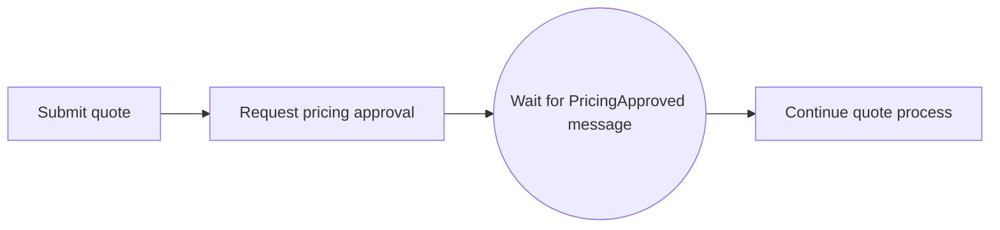
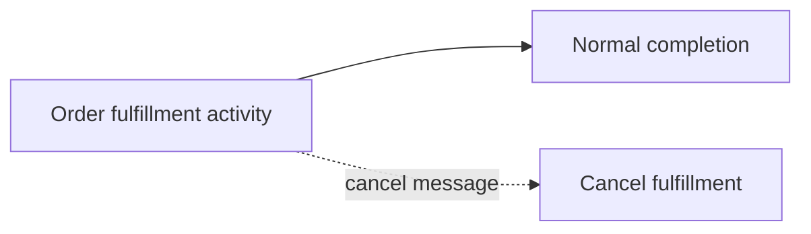
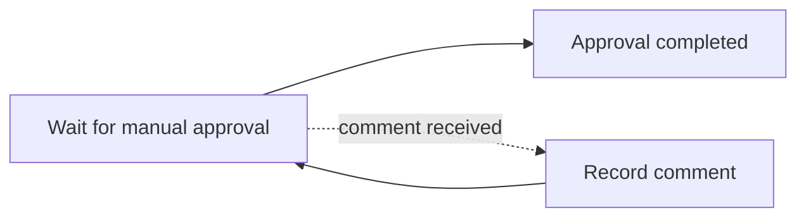
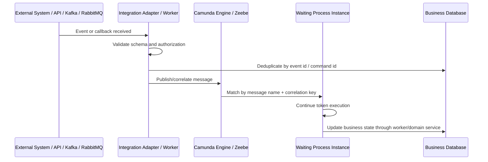
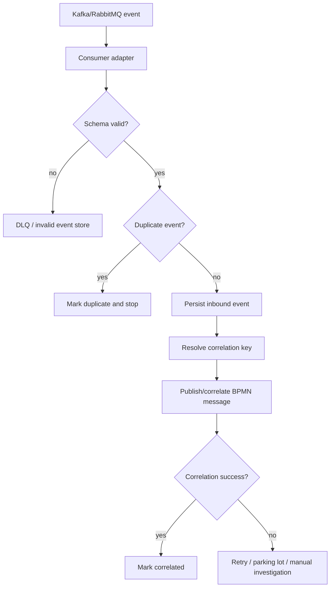

# Part 025 — Messages, Signals, and Correlation

> Goal: understand how external facts enter a running process safely.
>
> A workflow without correlation is just a diagram waiting for perfect synchronous calls. Real enterprise workflows receive callbacks, status updates, approvals, fulfillment events, timeout signals, retry notifications, and customer-driven amendments. The hard part is not drawing the message event. The hard part is making sure the right message reaches the right process instance exactly once from a business perspective.

---

## 1. Core mental model

A **message** is a targeted event intended for a specific process instance or for starting a new process instance.

A **signal** is a broadcast-style event. Any process instance waiting for that signal may react.

A **correlation key** is the value used to match an incoming message to the correct waiting process instance.

A **business key** is a domain-facing identifier that helps humans and systems relate the process instance to a business entity such as quote ID, order ID, amendment ID, fulfillment request ID, or customer account ID.

In production systems, the critical distinction is this:

| Concept | Meaning | Typical scope | Production risk |
|---|---|---:|---|
| Message | Targeted external fact | One process instance or one process start | Wrong correlation, duplicate event, late event |
| Signal | Broadcast notification | Many process instances | Accidental mass reaction |
| Correlation key | Matching value used by the engine | Runtime routing | Non-unique, missing, changed, malformed |
| Business key | Human/domain traceability key | Domain debugging | Inconsistent naming, not indexed, not propagated |
| Message name | Semantic event type | Process contract | Version drift, producer/consumer mismatch |

A message says: **this event belongs to this process context**.

A signal says: **something globally relevant happened; whoever listens may proceed**.

For enterprise quote/order systems, most integration events should be modelled as messages, not signals, because order updates, quote approvals, fallout resolutions, and fulfillment callbacks normally belong to one specific entity.

---

## 2. Why correlation exists

A long-running workflow often waits outside one transaction boundary.

Example:

1. Quote process starts.
2. Pricing approval is requested.
3. Process waits for external approval result.
4. Approval service emits result later.
5. Workflow must resume the correct quote approval instance.

Without correlation, the engine cannot know which process instance should consume the approval result.

Correlation solves this runtime question:

> Given this external event, which process instance is waiting for it?

The correlation decision must be deterministic, stable, observable, and secure.

Bad correlation creates dangerous failures:

- message is ignored even though the business event happened;
- message resumes the wrong instance;
- duplicate event repeats a side effect;
- late event reopens a completed business step;
- replayed Kafka event creates a new process unexpectedly;
- message name changes during deployment and old instances cannot continue;
- correlation key is derived from mutable state and stops matching.

---

## 3. BPMN elements involved

### 3.1 Message start event

Use when an external message should create a new process instance.

Typical examples:

- `QuoteSubmitted`
- `OrderCaptured`
- `FulfillmentRequestReceived`
- `CustomerAmendmentRequested`
- `CancellationRequested`

Use carefully: a start event is creation, not continuation.

Key design concern:

> Can duplicate starts create duplicate process instances for the same business entity?

Camunda 8 message start events can use a `correlationKey` to ensure only one active process instance per key for that message-start pattern. Still, your domain layer should not rely exclusively on this for business correctness. Use database uniqueness and idempotency around the business command as well.

### 3.2 Intermediate catch message event

Use when a running process waits for a specific external event.

Example:



The process is already running. The external event is not starting the process; it is resuming it.

### 3.3 Boundary message event

Use when an activity can be interrupted or supplemented by an external message.

Common examples:

- customer cancels while order fulfillment is running;
- external system sends amendment while approval task is open;
- fulfillment partner sends exception while service task waits;
- manual override arrives while SLA timer is active.

Interrupting boundary message:



Non-interrupting boundary message:



### 3.4 Receive task

A receive task is a wait state that waits for a message. It can be useful when the process language should show an explicit activity like “Wait for Fulfillment Result”.

Use it when readability improves. Avoid using it just because it feels more “task-like”.

### 3.5 Signal event

A signal is a broadcast.

Use signals for rare global events, such as:

- maintenance mode notification;
- global business calendar update;
- platform-wide pause/resume pattern;
- broad operational notification that many instances should observe.

Do **not** use a signal when the event belongs to one quote, one order, one customer, or one fulfillment request.

---

## 4. Message lifecycle

A message lifecycle in production usually looks like this:



The engine part is only one segment. Correctness depends on all boundaries:

- producer emits correct event type;
- adapter preserves correlation metadata;
- deduplication prevents duplicate business effect;
- engine matches the right waiting instance;
- worker updates domain state idempotently;
- observability allows humans to explain what happened.

---

## 5. Message name design

A message name should be business-semantic, stable, and version-aware.

Good names:

- `QuoteApprovalCompleted`
- `PricingApprovalRejected`
- `OrderValidationCompleted`
- `FulfillmentFailed`
- `CustomerCancellationRequested`

Weak names:

- `Message1`
- `Callback`
- `StatusUpdate`
- `EventReceived`
- `ContinueProcess`

A message name should answer:

1. What happened?
2. Who produced it?
3. What process step consumes it?
4. Is it stable across versions?
5. Can it be searched in logs, dashboards, and code?

### Naming pattern

Prefer this pattern:

```text
<DomainNoun><BusinessFactPastTense>
```

Examples:

```text
QuoteApproved
OrderValidated
FulfillmentCompleted
ManualFalloutResolved
CancellationAccepted
```

Avoid technical names tied to one transport:

```text
KafkaOrderTopicMessage
RabbitReplyReceived
HttpCallbackResponse
```

The BPMN model should express business facts, not transport implementation.

---

## 6. Correlation key design

A correlation key must be:

- unique enough to target the correct process instance;
- stable for the life of the waiting point;
- known to both producer and consumer;
- not derived from mutable display fields;
- propagated across API, messaging, logs, DB, and workflow variables;
- safe to expose where it appears in operational tooling.

Common candidates:

| Process type | Possible correlation key | Notes |
|---|---|---|
| Quote approval | `quoteId` or `approvalRequestId` | Prefer request-level key if multiple approvals can exist per quote |
| Order fulfillment | `orderId` or `fulfillmentRequestId` | Prefer fulfillment request if order decomposes into multiple flows |
| Amendment | `amendmentId` | Avoid using only original order ID if multiple amendments can run |
| Cancellation | `cancellationRequestId` | Helps separate cancellation attempt from base order |
| Partner callback | `externalRequestId` mapped to internal ID | Store mapping in DB |
| Manual fallout | `falloutCaseId` | Avoid overloading order ID if multiple fallout cases exist |

### The dangerous question

Ask this for every message catch:

> Can more than one active process instance be waiting for the same message name and correlation key?

If yes, your model is ambiguous.

You need one of these:

- more specific correlation key;
- more specific message name;
- process-level uniqueness invariant;
- intermediate domain table that resolves external event to exact process instance;
- separate process instance per child entity;
- explicit fan-out model.

---

## 7. Correlation key vs business key

These are often confused.

| Dimension | Correlation key | Business key |
|---|---|---|
| Primary purpose | Runtime message matching | Human/domain traceability |
| Used by engine to resume instance | Yes | Sometimes, engine/version-dependent |
| Should be stable | Yes | Yes |
| May be same value | Sometimes | Sometimes |
| Should be globally unique | Depends | Often useful |
| Example | `approvalRequestId` | `quoteId` |

For CSG-style quote/order systems, `quoteId` or `orderId` may be a good business key, but not always a good correlation key.

Example:

- One quote may have multiple approval rounds.
- One order may have multiple fulfillment items.
- One customer may have multiple active amendments.

In those cases, the correlation key should target the specific wait state, not only the parent entity.

---

## 8. Camunda 7 view

In Camunda 7, message correlation is typically done through engine API calls such as runtime service message correlation.

Important Camunda 7 concerns:

- process instances are stored in relational database runtime tables;
- message correlation may use process variables and/or business key depending on API usage;
- correlation can fail if no matching execution exists;
- correlation can fail if multiple executions match ambiguously;
- transaction boundary matters when correlating a message and updating business DB state;
- message correlation may happen inside the same Java/JAX-RS application if engine is embedded;
- correlation may happen from an external adapter if the engine is remote/shared.

### Camunda 7 production concerns

| Concern | Why it matters |
|---|---|
| DB transaction | Correlating message and committing business update may not be atomic across systems |
| Variable indexing | Correlating by variable can become expensive if badly modelled |
| Duplicate callbacks | Engine correlation alone may not prevent duplicate business effects |
| Runtime vs history | Completed instances may only be visible in history, not runtime |
| Locking/optimistic locking | Concurrent correlations may conflict |
| Embedded engine coupling | REST request thread may directly affect process engine runtime |

### Camunda 7 anti-pattern

Do not make a JAX-RS endpoint directly execute a large amount of business logic after message correlation inside the same request without clear transaction and failure semantics.

Better pattern:

1. API receives callback.
2. Validate and persist inbound event.
3. Deduplicate.
4. Correlate message.
5. Let process continue asynchronously via job/delegate/external task.

---

## 9. Camunda 8 / Zeebe view

In Camunda 8, messages are published to Zeebe with a message name, correlation key, and time-to-live. A waiting catch event or receive task subscribes to a message. When a matching message exists, the process continues.

Camunda 8 documentation emphasizes that messages use a TTL and correlation key; patterns such as message aggregation and single-instance creation rely on these mechanics.

Important Camunda 8 concerns:

- message publication is remote from the application;
- process instance key is not the same as business correlation key;
- the message may be buffered until a subscription appears, depending on TTL;
- if TTL is too short, the message may expire before the process waits;
- if TTL is too long, stale messages may correlate unexpectedly;
- duplicate messages require application-level deduplication;
- message correlation may resume a process on a Zeebe partition;
- downstream workers must still be idempotent.

### TTL design

Message TTL is not just a technical field. It encodes business tolerance for early arrival.

| TTL choice | Meaning | Risk |
|---|---|---|
| `0` | Only correlate if subscription exists now | Misses early events |
| Short TTL | Allow small ordering gap | May expire under outage/backlog |
| Long TTL | Allow long early arrival | Stale event may match future wait state |

For enterprise workflows, TTL should be decided per business event, not copied blindly.

Examples:

- payment authorization callback: likely short and tightly controlled;
- fulfillment completion callback: may need longer TTL due to partner delay;
- manual approval response: likely should not be represented as pre-published message with long TTL unless UX contract is explicit.

---

## 10. Event-driven integration pattern

A robust message correlation pattern around Kafka/RabbitMQ often looks like this:



The key design is that correlation is not the first operation.

You usually need:

- schema validation;
- producer authenticity check;
- deduplication;
- event persistence;
- correlation key resolution;
- correlation attempt;
- failure handling;
- observability.

---

## 11. Java/JAX-RS integration

Common JAX-RS endpoints:

```text
POST /quotes/{quoteId}/approval-callback
POST /orders/{orderId}/fulfillment-callback
POST /workflow/messages/{messageName}
POST /workflow/processes/{processInstanceId}/messages/{messageName}
```

Avoid over-generic public workflow endpoints unless access is tightly controlled. Most business APIs should expose domain language, not engine internals.

### Safer domain endpoint pattern

```text
POST /orders/{orderId}/fulfillment-results
```

Request body:

```json
{
  "externalRequestId": "fulfillment-req-9921",
  "eventId": "partner-event-771",
  "status": "COMPLETED",
  "completedAt": "2026-07-11T10:15:30Z",
  "payloadVersion": 3
}
```

Backend responsibilities:

1. authenticate caller;
2. authorize source system;
3. validate schema;
4. deduplicate `eventId`;
5. map `externalRequestId` to internal `fulfillmentRequestId`;
6. publish/correlate message `FulfillmentCompleted`;
7. return a safe response.

Recommended HTTP semantics:

| Case | Response |
|---|---:|
| accepted for async processing | `202 Accepted` |
| duplicate but already processed | `200 OK` or `202 Accepted` with idempotent response |
| invalid schema | `400 Bad Request` |
| unauthorized source | `401/403` |
| unknown external request | `404` or domain-specific `422` |
| temporary workflow engine unavailable | `503` or enqueue for async retry |

Do not leak engine incident details directly to external clients.

---

## 12. PostgreSQL/MyBatis/JDBC integration

Workflow correlation should usually be supported by a relational state table.

Example table concepts:

```sql
-- inbound_event
-- Stores external events before or during correlation.

id                    uuid primary key
source_system          text not null
event_id               text not null
message_name           text not null
correlation_key        text
business_key           text
payload_hash           text
status                 text not null -- RECEIVED, CORRELATED, DUPLICATE, FAILED, PARKED
received_at            timestamptz not null
correlated_at          timestamptz
failure_reason         text

unique(source_system, event_id)
```

```sql
-- workflow_correlation_mapping
-- Maps external identifiers to stable internal correlation keys.

external_request_id    text primary key
business_entity_type   text not null
business_entity_id     text not null
correlation_key        text not null
process_instance_ref   text
created_at             timestamptz not null
```

### Why this matters

If you only rely on engine correlation and do not persist inbound events:

- duplicate detection becomes weak;
- audit trail is incomplete;
- replay is dangerous;
- manual investigation is harder;
- failed correlation may lose the original event.

### MyBatis/JDBC concern

Make correlation records explicit in mapper/repository code. Avoid burying correlation logic inside scattered service methods.

A good repository contract says:

```java
InboundEventResult recordInboundEvent(InboundEventCommand command);
CorrelationMapping findCorrelationMapping(String externalRequestId);
void markCorrelated(UUID inboundEventId, String processInstanceRef);
void markCorrelationFailed(UUID inboundEventId, String reason);
```

---

## 13. Kafka integration

Kafka introduces these concerns:

- at-least-once delivery;
- duplicate messages;
- replay;
- out-of-order events across partitions;
- schema evolution;
- consumer group rebalancing;
- lag/backlog;
- poison event handling;
- event key design.

### Kafka event key vs workflow correlation key

The Kafka message key may be the same as the workflow correlation key, but it does not have to be.

| Kafka key | Workflow correlation key | Example |
|---|---|---|
| `orderId` | `fulfillmentRequestId` | Multiple fulfillment requests per order |
| `quoteId` | `approvalRequestId` | Multiple approvals per quote |
| `customerId` | `caseId` | Multiple cases per customer |

Do not assume Kafka partitioning key is always specific enough for BPMN correlation.

### Replay safety

Before replaying a topic, ask:

- Will old events correlate to active waiting instances?
- Will old events create new process instances?
- Are completed process instances protected from duplicate side effects?
- Does inbound event table reject duplicates?
- Are message TTLs compatible with replay?
- Do workers have idempotency keys?

---

## 14. RabbitMQ integration

RabbitMQ is commonly used for command/reply or work-queue patterns.

Workflow-specific concerns:

- routing key maps to command or business fact;
- reply queue may contain correlation ID;
- DLQ may hold events that should have resumed processes;
- RabbitMQ retry and engine retry can conflict;
- duplicate delivery still happens;
- consumer ack timing matters;
- message TTL/dead-lettering may interact with BPMN timer semantics.

### Dangerous pattern

```text
RabbitMQ retries message 10 times
Camunda worker also retries job 10 times
External API also retries internally
```

This can create a retry multiplication problem.

For workflow correlation, define which layer owns retry:

- broker delivery retry;
- adapter retry;
- workflow engine retry;
- worker retry;
- external API retry;
- manual repair.

Only one layer should be the main owner for each failure class.

---

## 15. Redis integration

Redis can support message correlation but should not become the durable source of truth.

Acceptable supporting uses:

- short-lived dedup cache;
- rate limiter for callbacks;
- temporary lock during correlation;
- feature flag / kill switch;
- quick lookup cache for correlation mapping.

Risky uses:

- only storing inbound events in Redis;
- only storing correlation mappings in Redis;
- using Redis locks without DB constraints;
- assuming Redis cache means correlation succeeded;
- losing audit trail after TTL expiration.

For mission-critical workflows, PostgreSQL or another durable store should hold the audit and dedup record.

---

## 16. Duplicate, late, missing, and wrong messages

### 16.1 Duplicate message

Symptoms:

- repeated event ID;
- repeated worker execution;
- duplicate downstream side effect;
- second correlation fails because process already moved;
- second correlation starts another process instance.

Mitigation:

- unique constraint on inbound event key;
- idempotent message adapter;
- idempotent worker;
- domain invariant in DB;
- start-process deduplication;
- idempotent external API keys.

### 16.2 Late message

A late message arrives after the process already passed or completed the wait state.

Mitigation:

- define message validity window;
- check current business state before correlation;
- park late messages for manual analysis;
- model cancellation/amendment explicitly;
- avoid long TTL unless needed.

### 16.3 Missing message

The process waits forever because the external event never arrives.

Mitigation:

- boundary timer;
- SLA escalation;
- reconciliation job;
- external system polling fallback;
- dashboard for waiting instances age;
- incident or manual task creation.

### 16.4 Wrong message

A message has valid shape but belongs to the wrong process instance.

Mitigation:

- stronger correlation key;
- source-system authorization;
- signed callback payload;
- mapping table;
- domain consistency check;
- trace/correlation IDs in logs.

---

## 17. Observability model

Correlation needs its own operational signals.

Minimum metrics:

| Metric | Why it matters |
|---|---|
| inbound events received | Detect producer activity |
| correlation success count | Detect healthy routing |
| correlation failure count | Detect mismatched keys/names |
| duplicate event count | Detect replay/retry storms |
| late event count | Detect timing and lifecycle mismatch |
| parked event count | Detect manual investigation backlog |
| waiting process age | Detect stuck wait states |
| message TTL expiration count | Detect early/late timing bugs |
| message by name volume | Detect abnormal event type spikes |
| correlation latency | Detect engine/adapter/backlog issues |

Minimum log fields:

```text
messageName
correlationKey
businessKey
processDefinitionKey
processInstanceKey/processInstanceId
eventId
sourceSystem
traceId
spanId
payloadVersion
correlationStatus
failureReason
```

For Java/JAX-RS services, always propagate:

- request ID;
- correlation ID;
- business key;
- event ID;
- process instance reference if known.

---

## 18. Production debugging checklist

When a message did not correlate:

1. Confirm message was produced.
2. Confirm consumer/adapter received it.
3. Confirm schema version is supported.
4. Confirm event was not deduplicated incorrectly.
5. Confirm message name exactly matches BPMN model.
6. Confirm correlation key value matches the waiting instance variable/key.
7. Confirm process instance is still active.
8. Confirm token is actually waiting at the message event/receive task.
9. Confirm message TTL did not expire.
10. Confirm process definition version is expected.
11. Confirm environment mismatch did not occur.
12. Confirm authorization/tenant/source-system constraints.
13. Confirm no incident prevented reaching the wait state.
14. Confirm no concurrent path already consumed or bypassed the message.
15. Check Operate/Cockpit/runtime tables/logs depending on platform.

When a message correlated to the wrong process:

1. Freeze manual retries.
2. Identify actual event ID and payload.
3. Identify process instance that consumed it.
4. Identify expected process instance.
5. Compare correlation key derivation.
6. Check whether key was reused across active instances.
7. Check mapping table history.
8. Check process model version.
9. Assess business state damage.
10. Execute manual repair only through approved runbook.

---

## 19. Security and privacy concerns

Correlation fields appear in many places:

- API logs;
- Kafka/RabbitMQ headers;
- process variables;
- task forms;
- incidents;
- Operate/Cockpit views;
- database audit tables;
- dashboards;
- traces.

Do not use sensitive identifiers as raw correlation keys if they will be widely exposed.

Avoid:

- customer national ID;
- payment token;
- full account number;
- secret external reference;
- email address if unnecessary;
- PII-heavy compound key.

Prefer:

- opaque internal IDs;
- UUID request IDs;
- hashed external IDs if needed;
- separate secure mapping table.

Authorization matters: a user or service allowed to publish a message can potentially advance a process. Message endpoints and workers must be treated as state-changing command surfaces.

---

## 20. Performance concerns

Correlation can become expensive or fragile when:

- too many active instances wait on broad message names;
- correlation keys are not indexed/resolved efficiently;
- huge payloads are included in process variables;
- adapters synchronously wait for engine response under high volume;
- Kafka replay floods the engine with stale messages;
- RabbitMQ retry loops cause burst correlation attempts;
- message TTL causes large buffered message volume;
- process model waits at many message events simultaneously.

Design techniques:

- keep correlation payload small;
- store large payload in DB/object storage and pass reference;
- use durable inbound event table;
- batch or throttle correlation attempts if engine is under pressure;
- monitor correlation latency;
- protect engine with backpressure-aware adapters;
- isolate noisy integrations.

---

## 21. Correctness rules

Use these as hard review rules:

1. Every message event must have a clearly documented producer.
2. Every message event must have a stable message name.
3. Every correlation key must be stable for the wait state lifetime.
4. Every incoming external event must be deduplicated outside the engine.
5. Every message correlation path must be observable.
6. Every message wait must have timeout or reconciliation unless infinite waiting is explicitly valid.
7. Every duplicate/late/missing event behavior must be defined.
8. Every process version change must preserve message compatibility or include migration/drain strategy.
9. Every message endpoint must be authenticated and authorized.
10. Every worker after message correlation must be idempotent.

---

## 22. PR review checklist

Review any BPMN/message/integration PR with these questions:

- What business fact does this message represent?
- Who produces the message?
- Who consumes the message?
- Is the message name stable and searchable?
- What is the correlation key?
- Can two active instances share this message name + key?
- What happens if the message arrives twice?
- What happens if the message arrives before the process waits?
- What happens if the message arrives after the process moved on?
- What happens if the message never arrives?
- Is there a timer, escalation, reconciliation, or manual task?
- Are event ID and payload version stored?
- Is schema evolution handled?
- Are Kafka/RabbitMQ replay semantics safe?
- Is the API endpoint idempotent?
- Are process variables minimal and non-sensitive?
- Are logs/traces sufficient to debug correlation?
- Does deployment/versioning preserve old running instances?
- Is tenant/source-system authorization enforced?
- Is there an operational dashboard for waiting/failed correlations?

---

## 23. Internal verification checklist

Verify these in the CSG/team environment before assuming architecture details:

### BPMN model

- Which BPMN models contain message start events?
- Which contain intermediate catch message events?
- Which contain boundary message events?
- Which contain receive tasks?
- Are signal events used? If yes, are they truly broadcast semantics?
- Are message names business-semantic or transport-semantic?
- Are message names versioned or stable across versions?

### Correlation design

- What fields are used as correlation keys?
- Are correlation keys process variables, business keys, external request IDs, or DB mapping values?
- Can the same quote/order have multiple active child workflows?
- Is there any possibility of ambiguous correlation?
- Are correlation keys mutable?
- Are correlation keys exposed to users or external systems?

### Java/JAX-RS implementation

- Which endpoints start processes?
- Which endpoints correlate messages?
- Are endpoints domain-specific or generic workflow endpoints?
- Are incoming callbacks authenticated and authorized?
- Are idempotency keys required?
- Are correlation failures returned synchronously or parked asynchronously?

### PostgreSQL/MyBatis/JDBC

- Is there an inbound event table?
- Is there a correlation mapping table?
- Are duplicate events protected by unique constraints?
- Are process instance references stored against domain entities?
- Are failed/parked events queryable?

### Kafka/RabbitMQ/Redis

- Which Kafka topics can start or resume workflows?
- Which RabbitMQ queues can start or resume workflows?
- Are event IDs propagated?
- What happens during replay?
- Are DLQs monitored?
- Is Redis used for dedup/lock/cache? If yes, what is the durable fallback?

### Operations

- Where are correlation failures visible?
- Is there a dashboard for waiting processes by age?
- Is message TTL expiration monitored?
- Who owns parked events?
- What is the manual repair process?
- Are correlation fields present in logs and traces?

---

## 24. Senior engineer summary

Message correlation is a distributed systems problem wearing BPMN notation.

The BPMN event is the visible part. The real design is the contract among:

- process model;
- external producer;
- API/consumer adapter;
- durable database state;
- workflow engine;
- worker implementation;
- observability stack;
- operational runbook.

For quote/order systems, correlation is often where hidden production risk accumulates. A senior engineer should not only ask “does the BPMN message event exist?” but also:

- Is the correlation key correct?
- Is duplicate delivery safe?
- Is late delivery defined?
- Is missing delivery detected?
- Is replay safe?
- Is the process version compatible?
- Is the business state protected?
- Can operations explain what happened at 3 AM?

If those answers are unclear, the workflow is not production-ready.

---

## References

- Camunda 8 Docs — Messages: https://docs.camunda.io/docs/components/concepts/messages/
- Camunda 8 Docs — Message events: https://docs.camunda.io/docs/components/modeler/bpmn/message-events/
- Camunda 8 Docs — Incidents: https://docs.camunda.io/docs/components/concepts/incidents/
- Camunda 8 Docs — Job workers: https://docs.camunda.io/docs/components/concepts/job-workers/
