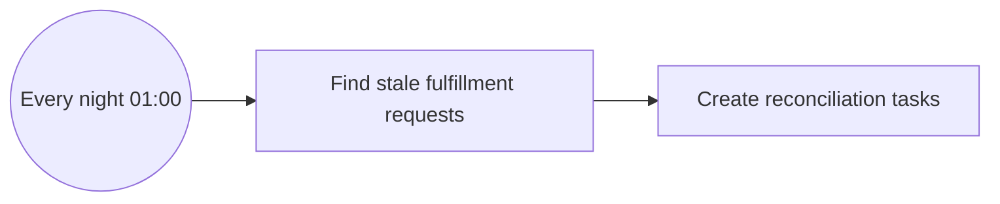
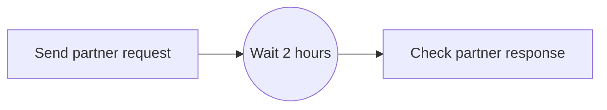
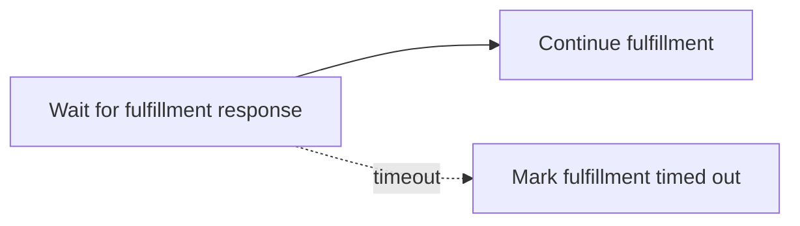
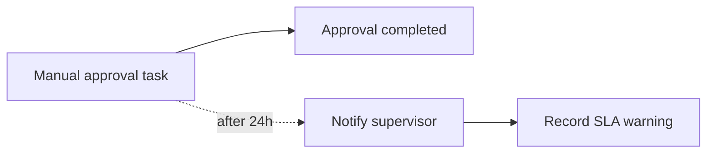
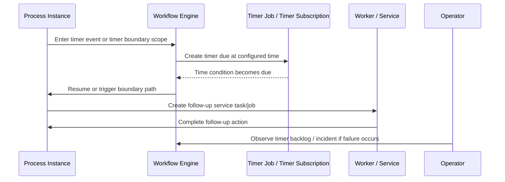
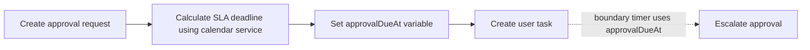
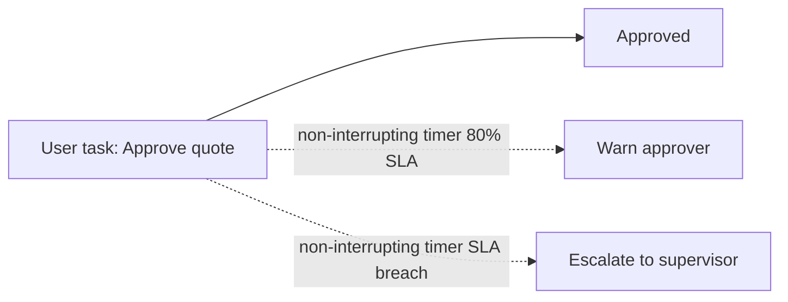
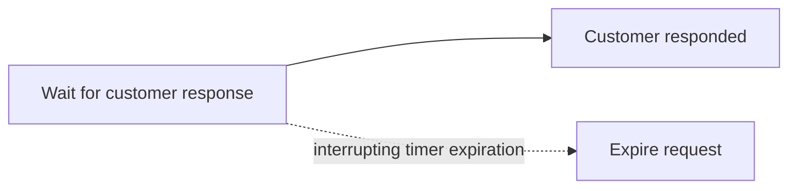
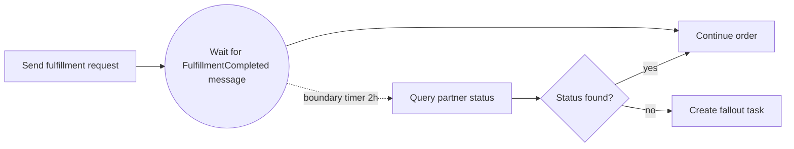
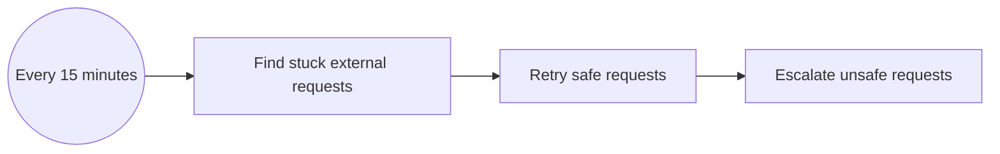

# Part 026 — Timers, SLA, and Time-Based Workflow

> Goal: treat time as a first-class production concern.
>
> Timer events look simple in BPMN, but production time is messy: timezones, clock drift, holidays, retries, SLA definitions, customer promises, queue backlogs, process migration, engine outage, and worker downtime. A timer is not just “wait 2 hours”. It is a business commitment encoded as executable infrastructure.

---

## 1. Core mental model

A **timer** is a workflow wait condition based on time.

A **timeout** is a technical or business limit after which the current path should no longer wait silently.

An **SLA timer** encodes a service-level expectation: “this task should be completed within this time window.”

An **escalation timer** triggers additional action when the normal path is too slow.

A **retry timer** delays another attempt after a recoverable failure.

A **business calendar** defines working hours, holidays, weekends, or region-specific schedules. BPMN timer semantics do not automatically solve all business calendar requirements.

A timer asks the workflow engine:

> Resume this process path when a time condition becomes true.

The harder engineering question is:

> What should happen if time passes but the system, worker, external partner, or human actor did not behave as expected?

---

## 2. Why timers exist

Long-running enterprise workflows cannot assume every step completes immediately.

Examples in CPQ/order management:

- pricing approval must complete within 24 business hours;
- enterprise agreement review escalates after 3 days;
- customer amendment request expires after 7 days;
- fulfillment partner must respond within 2 hours;
- fallout case should be reviewed before SLA breach;
- cancellation request should be reconciled if no response arrives;
- order validation should not block forever if a downstream system is unavailable.

Timers exist to make waiting explicit.

Without timers:

- process instances become stuck silently;
- human tasks age without visibility;
- external callbacks are assumed to arrive but never do;
- customer SLA breaches are detected too late;
- operations discovers issues from complaints instead of dashboards;
- manual workarounds bypass the workflow system.

---

## 3. BPMN timer elements

### 3.1 Timer start event

A timer start event starts a process on a schedule.

Typical use cases:

- nightly reconciliation process;
- daily SLA scan;
- periodic fulfillment status polling;
- monthly renewal process;
- scheduled cleanup or archival orchestration.

Example:



Use timer start events for business-scheduled process starts, not for every background job. If the job is purely technical and has no process visibility requirement, a scheduler may be simpler.

### 3.2 Intermediate catch timer event

An intermediate timer pauses the process until the time condition is met.

Example:



Use it when waiting itself is part of the business process.

### 3.3 Boundary timer event

A boundary timer attaches to an activity.

It can be interrupting or non-interrupting.

#### Interrupting boundary timer

Use when the activity should stop if time expires.



#### Non-interrupting boundary timer

Use when the activity continues, but an escalation path also starts.



For human tasks, non-interrupting timers are often better than interrupting timers. You usually do not want to delete the task just because an SLA warning fired.

---

## 4. Timer definitions: date, duration, cycle

Camunda 8 timer events are defined using one of three forms:

| Form | Meaning | Example use |
|---|---|---|
| Date | Fire at a specific point in time | Approval expires on exact timestamp |
| Duration | Fire after a relative period | Wait `PT2H` after sending request |
| Cycle | Fire repeatedly | Daily reconciliation |

### 4.1 Date timer

Use a date timer when the business rule has an absolute deadline.

Example:

```text
2026-07-15T17:00:00+07:00
```

Use explicit timezone/offset. Never assume the runtime timezone is the business timezone.

### 4.2 Duration timer

Use a duration timer for relative waiting.

Examples:

```text
PT15M  # 15 minutes
PT2H   # 2 hours
P3D    # 3 days
```

Duration is simple but can hide business-calendar ambiguity.

Question:

> Does `P3D` mean 72 hours, 3 business days, or 3 calendar dates in a customer timezone?

Those are not the same.

### 4.3 Cycle timer

Use a cycle timer for repeated execution.

Examples:

- every hour;
- every day at midnight;
- every weekday;
- retry-like periodic polling;
- scheduled reconciliation.

Recurring timers must be reviewed for load. A small cycle across many process instances can create a large timer backlog.

---

## 5. SLA timer vs technical timeout

Do not mix these two casually.

| Type | Meaning | Example | Owner |
|---|---|---|---|
| Technical timeout | A system call or worker must not wait too long | HTTP call timeout 5s | Engineering/SRE |
| BPMN timeout | A process path waited too long | No partner response after 2h | Workflow/domain |
| SLA timer | Business commitment is at risk or breached | Approval not done within 24h | Product/operations/business |
| Escalation timer | Trigger extra action because delay matters | Notify supervisor after 4h | Operations/business |
| Retry delay | Wait before retrying recoverable failure | retry after 5m | Engineering |

A worker HTTP timeout should not be your business SLA. It is only a technical guard.

A BPMN timer should not be used to simulate every low-level retry. It should express process-relevant time.

---

## 6. Timer lifecycle

A typical timer lifecycle:



Important details:

- Timer creation happens when the token reaches the timer scope.
- Timer due time depends on the timer definition and evaluated variables.
- Timer firing does not mean downstream work succeeded.
- A timer firing may create a job, user task, escalation, message, or compensation path.
- If the engine is down, timers may fire late after recovery.
- If workers are down, the timer may fire but follow-up tasks may not complete.

---

## 7. Business calendar reality

Many business SLAs are not raw durations.

Examples:

- “respond within 2 business days”;
- “approval due by next working day 5 PM local branch time”;
- “do not escalate on public holidays”;
- “enterprise customers use contractual calendar”; 
- “region-specific order cutoff applies”.

A BPMN timer expression may not be enough by itself.

Better pattern:

1. Domain service calculates deadline using business calendar.
2. Deadline is stored as a process variable and business DB field.
3. BPMN timer uses the calculated deadline.
4. Dashboard displays the same deadline.
5. Human task due date uses the same source.

Example flow:



This avoids duplicating calendar logic in BPMN expressions, Java code, UI, and reporting.

---

## 8. Timer expressions and variables

Timers can often be static or dynamic.

Static:

```text
PT2H
```

Dynamic:

```text
= approvalDueAt
```

or calculated from variables, depending on engine expression support.

### Design rule

Do not make timer expressions so complex that only one engineer can explain them.

If the due time has business meaning, calculate it in a tested domain service and pass the result to the process.

Good variable names:

```text
approvalDueAt
fulfillmentResponseDeadlineAt
falloutEscalationAt
customerResponseExpiresAt
```

Weak names:

```text
timeout
sla
waitTime
x
limitDate
```

---

## 9. Camunda 7 view

In Camunda 7, timers are represented as jobs handled by the job executor.

Key implications:

- timer jobs are stored in the relational database;
- job executor acquisition determines when due jobs are picked up;
- database health affects timer behavior;
- job executor tuning affects timer latency;
- failed follow-up jobs can create incidents;
- large numbers of timers can increase DB load;
- async boundaries and exclusive jobs interact with timer behavior;
- history level affects audit visibility.

### Camunda 7 timer production risks

| Risk | Explanation |
|---|---|
| Timer backlog | Job executor cannot acquire/execute timer jobs fast enough |
| DB contention | Many timers compete with runtime/history writes |
| Wrong timezone | Due date computed in server timezone instead of business timezone |
| Timer migration issue | Process version change invalidates timer expectations |
| History bloat | Timer-heavy processes generate large history volume |
| Cluster duplication concern | Misconfigured job executor/locking creates unexpected behavior |

### Camunda 7 debugging hints

For timer issues, inspect:

- job table due dates;
- job retries;
- job exception message;
- job executor health;
- DB connection pool;
- slow query logs;
- Cockpit failed jobs/incidents;
- process instance current activity;
- timer definition in deployed BPMN version.

---

## 10. Camunda 8 / Zeebe view

In Camunda 8, timer events are part of Zeebe process execution. When a process reaches a timer event, Zeebe manages the timer and resumes the process when the timer is due.

Key implications:

- timer behavior depends on Zeebe broker/partition health;
- due timers may resume late during broker outage or backpressure;
- follow-up work becomes jobs consumed by workers;
- timer-driven volume can pressure broker, gateway, workers, and exporters;
- timer state is part of process execution, while visibility is usually via Operate/search/exported data;
- process instance version and migration can affect active timers.

### Camunda 8 timer production risks

| Risk | Explanation |
|---|---|
| Partition pressure | Many timer events due on same partition can create bursts |
| Worker lag after timer | Timer fires, but worker cannot handle resulting jobs |
| Search/export lag | Operate/dashboard may show delayed visibility |
| Wrong dynamic expression | Timer variable missing or malformed |
| Long outage | Timers fire late after recovery |
| Migration limitation | Active timers may require careful migration planning |

### Camunda 8 debugging hints

For timer issues, inspect:

- process instance state in Operate;
- current element instance;
- timer event definition;
- variable values used in timer expression;
- incident state;
- Zeebe broker/gateway health;
- partition health;
- worker backlog after timer fires;
- exporter/search lag;
- deployment version.

---

## 11. SLA patterns

### 11.1 Warning before breach



Use when human work continues but needs visibility.

### 11.2 Hard expiration



Use when late action should no longer be accepted.

### 11.3 Reconciliation after missing callback



Use when external systems can fail to send messages.

### 11.4 Periodic cleanup/retry process



Use when timeout detection is easier as a separate process than as thousands of embedded timers.

---

## 12. Timer vs scheduler vs queue delay

A BPMN timer is not always the right tool.

| Need | Better fit |
|---|---|
| Business-visible waiting state | BPMN timer |
| Human task SLA/escalation | BPMN boundary timer or due date + monitoring |
| Technical retry delay | Worker retry/backoff or queue delay |
| Batch reconciliation | Scheduler or timer start event |
| High-volume short delay | Queue delay or dedicated scheduler may be safer |
| Cron-like technical job | Scheduler/Kubernetes CronJob |
| Process-visible recurring business workflow | Timer start event |

Use BPMN timers when the wait is part of the business process lifecycle.

Do not overload BPMN timers for every low-level polling loop.

---

## 13. Java/JAX-RS backend impact

Timer-related API design usually appears in these flows:

- start process with deadline input;
- update deadline due to amendment/contract rule;
- complete human task before due date;
- expose task due date in UI;
- return SLA status in process/entity status endpoint;
- receive callback after timeout has already occurred;
- manually extend deadline;
- cancel pending timer by moving process path.

### API contract example

```http
POST /quotes/{quoteId}/approval-requests
```

Request body:

```json
{
  "approvalPolicy": "ENTERPRISE_DEAL",
  "requestedBy": "user-123",
  "submittedAt": "2026-07-11T09:00:00+07:00"
}
```

Backend response:

```json
{
  "approvalRequestId": "appr-9921",
  "quoteId": "quote-123",
  "approvalDueAt": "2026-07-12T17:00:00+07:00",
  "slaPolicy": "NEXT_BUSINESS_DAY_5PM",
  "workflowStatus": "WAITING_FOR_APPROVAL"
}
```

The API should expose the business deadline, not just “timer exists”.

### Manual extension endpoint

```http
POST /approval-requests/{approvalRequestId}/deadline-extension
```

This should be audited and authorized. Extending a business deadline is a business action, not just an engine variable update.

---

## 14. PostgreSQL/MyBatis/JDBC impact

Do not store time only inside workflow variables.

For business-important deadlines, store them in business tables too.

Example concepts:

```sql
-- approval_request
id                      text primary key
quote_id                text not null
status                  text not null
submitted_at             timestamptz not null
approval_due_at          timestamptz not null
sla_policy               text not null
sla_warning_sent_at      timestamptz
sla_breached_at          timestamptz
process_instance_ref     text
version                  bigint not null
```

Why store deadline in DB?

- UI can query without engine-specific joins;
- reporting can use business schema;
- audit can explain deadline calculation;
- reconciliation can compare DB and process state;
- migration can be validated;
- manual repair has durable data.

### Transaction boundary concern

If a worker updates DB state after a timer fires, ask:

- What if timer fires and worker crashes before DB update?
- What if DB update succeeds but job completion fails?
- What if timer fires twice due to retry?
- What if manual user completed the task concurrently?
- What if deadline was extended while timer job was due?

Use optimistic locking and idempotent state transitions.

---

## 15. Kafka/RabbitMQ/Redis impact

### Kafka

Timer firing may produce events:

- `QuoteApprovalSlaWarningRaised`
- `QuoteApprovalSlaBreached`
- `FulfillmentResponseTimedOut`
- `FalloutCaseAged`

Use outbox if DB update and event publish must be coordinated.

Avoid producing SLA breach events directly from a non-idempotent worker without deduplication.

### RabbitMQ

RabbitMQ delayed messages or TTL/DLQ patterns can overlap with BPMN timers.

Decide explicitly:

- Is RabbitMQ delay responsible for retry?
- Is BPMN timer responsible for business timeout?
- Is worker retry responsible for technical retry?

Do not let all three trigger the same action independently.

### Redis

Redis can help with:

- rate limiting escalation notifications;
- kill switch for timer-triggered workers;
- cache of SLA policies;
- short-lived duplicate suppression.

Redis should not be the only store of SLA deadlines or breach audit.

---

## 16. Kubernetes/cloud/on-prem impact

Timer reliability is affected by infrastructure.

### Kubernetes

Check:

- pod restarts during timer-heavy workloads;
- resource limits causing CPU throttling;
- liveness/readiness probes causing restart loops;
- worker deployment rolling update during timer bursts;
- cluster autoscaling delay;
- node clock synchronization;
- PDB/anti-affinity for engine/broker availability.

### AWS/Azure

Check:

- database/search latency;
- managed database failover;
- OpenSearch/Elasticsearch health for visibility;
- CloudWatch/Azure Monitor alerting;
- NTP/clock synchronization;
- network path between workers and engine;
- backup/restore timestamp semantics.

### On-prem/hybrid

Check:

- internal NTP reliability;
- firewall/network partitions;
- offline maintenance windows;
- air-gapped patching;
- customer-specific timezone/calendar;
- responsibility boundary for SLA monitoring.

---

## 17. Failure modes

### 17.1 Timer never created

Possible causes:

- process never reached timer event;
- gateway condition routed elsewhere;
- model deployment version different from expected;
- timer expression failed before creation;
- process instance ended earlier;
- message/event path consumed token before timer scope.

### 17.2 Timer created with wrong due date

Possible causes:

- timezone mismatch;
- malformed duration;
- wrong business calendar calculation;
- variable value in wrong format;
- server/local timezone assumption;
- date stored without offset;
- daylight saving transition issue.

### 17.3 Timer fires late

Possible causes:

- engine/broker outage;
- job executor backlog;
- Zeebe partition pressure;
- worker unavailable after timer;
- database/search/export lag;
- Kubernetes resource throttling;
- cloud/network issue.

### 17.4 Timer fires but nothing useful happens

Possible causes:

- follow-up worker down;
- job failed and created incident;
- escalation notification failed;
- DB update failed;
- authorization failure;
- process variable missing;
- manual task creation failed.

### 17.5 Timer fires after business state changed

Possible causes:

- concurrent user completed task;
- deadline extension not reflected in process;
- cancellation happened but timer remained active;
- old process version still running;
- boundary timer semantics misunderstood.

---

## 18. Detection and alerting

Minimum timer/SLA metrics:

| Metric | Purpose |
|---|---|
| timer jobs/subscriptions active | Understand time-based workload |
| due timers backlog | Detect late firing risk |
| timer firing latency | Detect engine or broker delay |
| SLA warning count | Detect operational pressure |
| SLA breach count | Detect customer/business impact |
| task aging | Detect human bottleneck |
| timeout path count | Detect external system degradation |
| timer-triggered incidents | Detect broken escalation path |
| worker lag after timer | Detect capacity issue |
| deadline extension count | Detect process/policy pressure |

Useful dashboard slices:

- by process definition;
- by process version;
- by tenant/customer segment;
- by product/order type;
- by team/candidate group;
- by region/timezone;
- by external partner;
- by worker type.

---

## 19. Production debugging checklist

When timer did not fire:

1. Confirm deployed BPMN version.
2. Confirm process reached the timer scope.
3. Confirm timer definition type: date, duration, or cycle.
4. Confirm evaluated variable value.
5. Confirm timezone/offset.
6. Confirm current engine/broker time.
7. Confirm timer job/subscription exists.
8. Confirm due date is expected.
9. Confirm job executor or Zeebe broker health.
10. Confirm no incident blocks process before timer.
11. Confirm boundary event interrupting/non-interrupting semantics.
12. Confirm timer was not cancelled by completing the attached activity.
13. Confirm migration did not alter active timer state.

When SLA breach alert is wrong:

1. Compare SLA policy in business DB.
2. Compare timer variable in process instance.
3. Compare UI due date.
4. Compare dashboard calculation.
5. Check business calendar version.
6. Check timezone conversion.
7. Check deadline extension audit.
8. Check process version.
9. Check duplicate timer/escalation path.
10. Check whether alert uses runtime or history data.

When timer caused duplicate action:

1. Identify timer event and process instance.
2. Identify worker/job created by timer.
3. Check retries and duplicate execution.
4. Check DB idempotency constraint.
5. Check whether user action completed concurrently.
6. Check boundary timer interrupting semantics.
7. Check outbox/event duplication.
8. Stop unsafe retries before manual repair.

---

## 20. Process versioning and migration concerns

Timers make migration harder.

Questions before changing a timer in BPMN:

- Are there active instances currently waiting on this timer?
- Does the new version change timer type?
- Does it change due date calculation?
- Does it change boundary interrupting behavior?
- Does it remove the activity that owns the boundary timer?
- Does it rename variables used by timer expressions?
- Does it alter SLA business meaning?
- Does it change downstream worker contract?
- Are old instances allowed to finish on old SLA rules?
- Is migration required, or can old instances drain?

Safe approaches:

| Situation | Safer strategy |
|---|---|
| Minor display label change | Deploy new version, let old run |
| SLA policy change for new requests only | Start new instances on new version |
| SLA change for active instances | Explicit migration + deadline recalculation |
| Boundary timer semantics changed | High-risk migration review |
| Timer variable renamed | Backward-compatible mapping or migration |
| Process activity removed | Drain old instances if possible |

---

## 21. Security and compliance concerns

Timers can trigger business-impacting actions automatically.

Examples:

- cancel quote request;
- expire approval;
- escalate to supervisor;
- notify customer;
- mark SLA breach;
- trigger compensation;
- create fallout case;
- publish contractual breach event.

Therefore:

- deadline changes must be authorized;
- SLA policy must be auditable;
- escalation recipients must be correct;
- customer notification must be controlled;
- logs must not expose sensitive data;
- timer-triggered actions must be traceable;
- manual deadline extension must have reason and actor;
- tenant/customer isolation must apply to timer queries and dashboards.

---

## 22. Performance and capacity concerns

Timer-heavy systems can fail through load amplification.

Patterns that create timer load:

- one boundary timer per human task across millions of tasks;
- short polling timers per process instance;
- recurring timers inside many active instances;
- timer start event with heavy batch work;
- timer-triggered worker burst at same clock time;
- same due date for many instances;
- SLA batch starting at business-day boundary.

Mitigations:

- distribute due times with jitter where business allows;
- prefer batch reconciliation for very high-volume technical scanning;
- separate warning and breach paths carefully;
- scale workers for timer bursts;
- monitor due timer backlog;
- avoid storing huge variables in timer-heavy processes;
- load test timer firing, not just process starts;
- use queue/backpressure between timer and heavy external calls.

---

## 23. Correctness rules

Use these as hard review rules:

1. Every timer must have a business or technical owner.
2. Every timer must define what happens when it fires.
3. Every wait state must have timeout, reconciliation, or explicit infinite-wait justification.
4. Every SLA timer must use a clear business calendar assumption.
5. Every deadline must use explicit timezone/offset.
6. Every timer-triggered worker must be idempotent.
7. Every timer-triggered state transition must be guarded by current business state.
8. Every human task SLA must be visible to operators.
9. Every process version change touching timers must review active instances.
10. Every timer failure path must be observable and debuggable.

---

## 24. PR review checklist

Review timer-related changes with these questions:

- What business meaning does the timer encode?
- Is this a timer, SLA, escalation, retry delay, or technical timeout?
- Is BPMN timer the right tool, or should this be scheduler/queue/worker retry?
- Is the timer date/duration/cycle explicit?
- Is timezone handled correctly?
- Is business calendar logic centralized and tested?
- What happens if the timer fires late?
- What happens if the user/external system responds just before the timer fires?
- What happens if response arrives after timeout?
- Is the boundary timer interrupting or non-interrupting intentionally?
- Is follow-up worker idempotent?
- Is state transition guarded by DB/domain invariant?
- Are SLA warnings and breaches observable?
- Are old process instances affected by deployment?
- Does migration need a plan?
- Is deadline visible in UI and reporting?
- Is manual extension audited and authorized?
- Is timer load included in capacity planning?

---

## 25. Internal verification checklist

Verify these in the CSG/team environment before assuming implementation details:

### BPMN model

- Which processes use timer start events?
- Which use intermediate timer events?
- Which use boundary timers?
- Which timers are interrupting vs non-interrupting?
- Which timers represent SLA vs retry vs polling vs expiration?
- Are timer expressions static or dynamic?
- Are timer variables named clearly?

### SLA and business policy

- Where is SLA policy defined?
- Is there a business calendar service/table?
- Are customer/tenant-specific calendars supported?
- Are deadline extensions allowed?
- Who can approve deadline extension?
- Are SLA breaches audited?

### Java/JAX-RS backend

- Which APIs create deadline-bearing processes/tasks?
- Which APIs expose due date/SLA status?
- Which APIs allow deadline extension/cancellation?
- Are timer-triggered actions idempotent?
- Are timer-triggered state transitions guarded by domain state?

### PostgreSQL/MyBatis/JDBC

- Are due dates stored in business tables?
- Are SLA warning/breach timestamps stored?
- Is optimistic locking used for concurrent user/timer actions?
- Is there an audit trail for deadline changes?
- Can DB queries find stuck/aged records independent of engine?

### Kafka/RabbitMQ/Redis

- Do timer-triggered workers publish events?
- Is outbox used for SLA breach/fallout events?
- Are RabbitMQ delayed retries overlapping with BPMN timers?
- Is Redis used for rate limiting/kill switch/cache?
- What happens when timer burst triggers many messages?

### Operations

- Where is timer backlog visible?
- Where is task aging visible?
- Where is SLA breach visible?
- Are timer-triggered incidents alerted?
- Are dashboards sliced by process/version/team/tenant?
- Who owns manual repair for wrong deadline or late timer?

### Kubernetes/cloud/on-prem

- Are engine/broker pods resource-limited safely?
- Are workers scaled for timer bursts?
- Are clocks synchronized?
- Are cloud DB/search dependencies monitored?
- Are maintenance windows considered for SLA timers?

---

## 26. Senior engineer summary

Timers are where process design meets reality.

A weak timer design says:

> Wait 2 hours, then do something.

A production-grade timer design says:

> Based on this business calendar and this contractual SLA, calculate a deadline, store it durably, expose it to operators, attach a non-interrupting warning timer and a breach path, guard the follow-up action with domain state, make the worker idempotent, emit audit and metrics, and define migration behavior for active instances.

For senior backend engineers, the key is not memorizing timer symbols. The key is recognizing that time creates distributed consistency problems:

- human action may race with timeout;
- external callback may arrive late;
- engine may fire late after outage;
- worker may duplicate escalation;
- old process version may use old deadline rule;
- dashboard may calculate SLA differently from workflow;
- customer contract may not match a raw duration.

A timer is production-ready only when its business meaning, operational behavior, failure modes, and repair path are all explicit.

---

## References

- Camunda 8 Docs — Timer events: https://docs.camunda.io/docs/components/modeler/bpmn/timer-events/
- Camunda 8 Docs — Expressions: https://docs.camunda.io/docs/components/concepts/expressions/
- Camunda 8 Docs — Job workers: https://docs.camunda.io/docs/components/concepts/job-workers/
- Camunda 8 Docs — Incidents: https://docs.camunda.io/docs/components/concepts/incidents/
