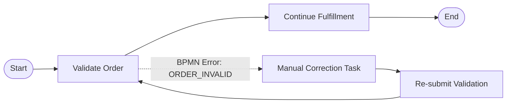
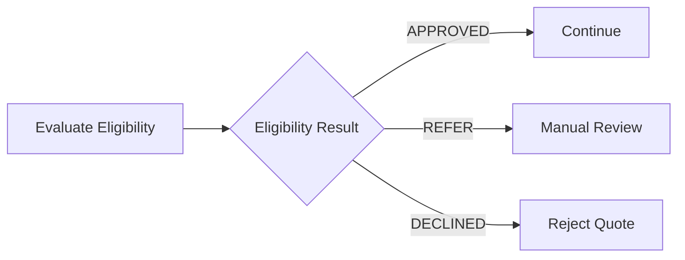
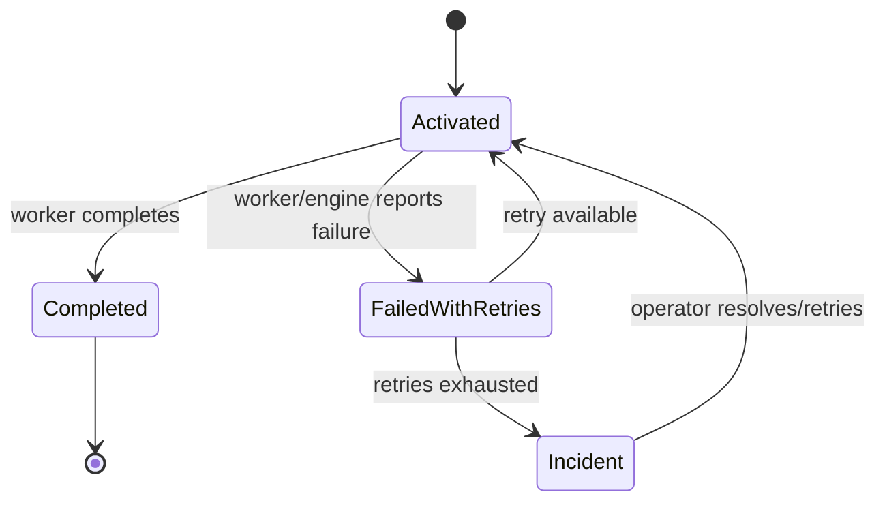
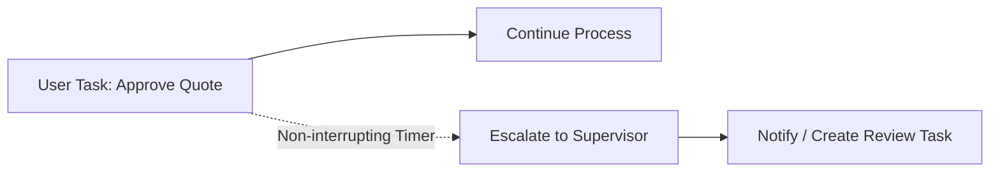

# Part 027 — Errors, Escalations, Incidents, and Compensation

> Goal: model failure as part of the process, not as an afterthought.
>
> In a workflow system, failure is not exceptional. It is normal business reality encoded into execution. A quote may fail approval. A partner API may be down. A customer may cancel halfway through fulfillment. A worker may crash after committing a database update. A message may arrive late. A human task may breach SLA. The difference between a reliable workflow system and a fragile one is whether these outcomes are explicit, observable, and repairable.

---

## 1. Core mental model

A workflow engine coordinates long-running business execution.

Because execution is long-running, distributed, and cross-team, the workflow must distinguish several different things:

- **business error**: expected business deviation that the process can handle;
- **technical error**: infrastructure, dependency, serialization, database, network, or worker failure;
- **BPMN error**: modelled business exception thrown to a catch event;
- **escalation**: non-critical signal to a higher process scope or operational actor;
- **incident**: runtime failure that requires intervention before execution can continue;
- **failed job**: executable work item that could not complete successfully;
- **retry exhaustion**: repeated failure until automatic retry budget is depleted;
- **compensation**: logical undo or mitigation step after partial success;
- **manual repair**: controlled human action to fix or move a process forward.

The central question is not:

> How do I catch every exception?

The real question is:

> Which failures are part of the business process, which failures are transient technical problems, which failures require human decision, and which failures must stop execution until repaired?

---

## 2. Why explicit failure modelling exists

In a normal Java/JAX-RS request-response service, failure is often collapsed into an HTTP error, exception, log, or transaction rollback.

In a long-running workflow, that is not enough.

A workflow may span:

- multiple Java services;
- PostgreSQL/MyBatis updates;
- external APIs;
- Kafka or RabbitMQ events;
- Redis-backed coordination;
- human approval;
- timers and SLA windows;
- cloud/on-prem boundaries;
- workers deployed independently;
- process instances running for hours, days, or months.

A thrown exception cannot describe the complete operational meaning of failure.

Example:

```text
Quote approval submitted
  -> pricing validation passed
  -> legal approval pending
  -> customer changed order items
  -> downstream catalog service unavailable
  -> approval SLA breached
  -> manual review required
```

This is not one error. It is a chain of business and technical conditions.

The process model must answer:

- Should the process retry?
- Should it wait?
- Should it route to manual task?
- Should it compensate prior steps?
- Should it publish an event?
- Should it stop as an incident?
- Should it mark the quote/order as fallout?
- Should it notify operations?
- Should it preserve evidence for audit?

---

## 3. Failure taxonomy

### 3.1 Business error

A **business error** is an expected negative outcome in the business domain.

Examples:

- quote is rejected by approver;
- customer is not eligible for product;
- pricing approval fails;
- order validation rejects inconsistent configuration;
- credit check fails;
- product is unavailable;
- customer cancels request;
- downstream fulfillment rejects the order for a known business reason.

A business error is usually not a production incident.

It should be represented in one of these ways:

- BPMN error caught by boundary event or event subprocess;
- explicit gateway based on decision result;
- user task path for manual correction;
- state transition to a valid business state such as `REJECTED`, `FALLOUT`, `CANCELLED`, or `PENDING_MANUAL_REVIEW`.

### 3.2 Technical error

A **technical error** is a failure of infrastructure, execution, or dependency.

Examples:

- worker crashes;
- database deadlock;
- HTTP timeout;
- Kafka broker unavailable;
- RabbitMQ consumer error;
- Redis unavailable;
- serialization failure;
- malformed process variable;
- Zeebe gateway unreachable;
- Camunda 7 database connection pool exhausted;
- Kubernetes pod killed during job execution.

Technical errors should usually trigger retry first, then incident/manual repair if the retry budget is exhausted.

They should not normally be converted into BPMN business errors unless the business explicitly accepts that technical failure as a business outcome.

### 3.3 Data correctness error

A **data correctness error** sits between business and technical failure.

Examples:

- process variable missing required field;
- order state in database conflicts with process state;
- correlation key does not match any active process;
- duplicate external event conflicts with existing transition;
- worker receives payload version it cannot understand;
- task completion request uses stale form version;
- database migration changed column semantics but old process instances still run.

These failures need careful handling.

Sometimes they should become incidents.
Sometimes they should route to manual correction.
Sometimes they reveal a deployment compatibility bug.

### 3.4 Operational error

An **operational error** is a runtime condition that may not be caused by one business instance but affects execution capacity.

Examples:

- worker deployment down;
- timer backlog growing;
- incident count increasing;
- job activation latency high;
- history cleanup not running;
- Operate/Cockpit unavailable;
- Elasticsearch/OpenSearch unhealthy;
- Camunda 7 DB overloaded;
- Zeebe partition unhealthy;
- Kubernetes rollout killed too many workers.

Operational errors require observability and runbooks, not only code fixes.

---

## 4. BPMN error

A **BPMN error** is a business-level exception that the process model knows how to catch.

It is not the same thing as a Java exception.
It is not the same thing as an HTTP 500.
It is not the same thing as a production incident.

A BPMN error says:

> This activity could not produce its expected business result, and the process has an alternate path for that result.

Examples:

- `CUSTOMER_NOT_ELIGIBLE`
- `QUOTE_APPROVAL_REJECTED`
- `PRODUCT_NOT_AVAILABLE`
- `PAYMENT_DECLINED`
- `ORDER_VALIDATION_FAILED`
- `FULFILLMENT_REJECTED`

A BPMN error should usually be caught by:

- boundary error event on a service task/subprocess;
- event subprocess;
- parent process around a call activity;
- error end event from a child subprocess.

### 4.1 BPMN error decision rule

Use BPMN error when all are true:

- the condition is meaningful to the business process;
- the process has a known alternate path;
- retrying the same work blindly will not solve it;
- the outcome should be visible in the process diagram;
- the worker can classify the condition deterministically.

Do not use BPMN error when:

- the database is temporarily unavailable;
- HTTP call timed out once;
- worker pod restarted;
- Kafka/RabbitMQ is temporarily unavailable;
- service returned an ambiguous technical failure;
- payload serialization failed due to a code bug;
- the condition requires engineering repair.

Those are usually technical failures or incidents.

---

## 5. Error event modelling pattern

A service task that validates an order may produce several outcomes.



The important modelling idea is:

- normal success continues;
- known business failure takes a visible path;
- correction is explicit;
- retry is not abused for non-retryable business invalidity.

### 5.1 Good BPMN error names

Use stable, domain-oriented error codes.

Good:

```text
ORDER_CONFIGURATION_INVALID
CUSTOMER_NOT_ELIGIBLE
QUOTE_APPROVAL_REJECTED
FULFILLMENT_PROVIDER_REJECTED
```

Weak:

```text
ERROR
FAILED
HTTP_400
RuntimeException
ValidationException
```

The error code should be meaningful outside Java implementation details.

---

## 6. Business error vs gateway result

Not every negative result is a BPMN error.

Some outcomes are normal decision results.

Example:

```text
Check credit score -> APPROVED / REFER / DECLINED
```

This may be better modelled as a DMN decision or service task output followed by an exclusive gateway.



Use a gateway when the activity successfully produced a business decision.

Use BPMN error when the activity failed to produce the expected business result and the failure is exceptional within that activity.

### 6.1 Practical rule

Ask:

> Is this outcome one of the expected answers from the activity?

If yes, use a result variable plus gateway/DMN.

Ask:

> Did the activity fail in a way that interrupts its expected result?

If yes, BPMN error may be appropriate.

---

## 7. Technical exception

A technical exception is an execution failure.

Examples in Java/JAX-RS workers:

```java
throw new SQLException("deadlock detected");
throw new SocketTimeoutException("catalog service timeout");
throw new JsonMappingException("unknown payload version");
throw new IllegalStateException("missing required process variable: orderId");
```

A worker should classify the exception before deciding what to tell Camunda.

Possible actions:

- complete job if operation succeeded;
- fail job with retry if failure is recoverable;
- fail job with zero retries if manual investigation is needed;
- throw BPMN error if it is a known business deviation;
- publish diagnostic variables if safe;
- avoid leaking sensitive data into incident messages.

---

## 8. Incident

An **incident** is a runtime failure that stops or blocks part of a process until resolved.

In practical terms:

> An incident means automatic progress has stopped and someone must decide what happens next.

Incidents should be operationally visible.

They should have:

- owner;
- severity classification;
- business impact assessment;
- retry or repair procedure;
- correlation ID;
- process instance reference;
- failing activity/job reference;
- diagnostic message;
- safe variables or links to logs;
- runbook.

### 8.1 Incident is not a trash bin

Do not treat incidents as a place where all unclassified errors go forever.

A good incident means:

- the process stopped safely;
- the system preserved enough context;
- manual repair is possible;
- retry is controlled;
- customer/business impact can be assessed.

A bad incident means:

- no one owns it;
- message is vague;
- retrying blindly creates duplicate side effects;
- variable state is corrupted;
- process cannot be safely repaired;
- support team must inspect production database manually.

---

## 9. Failed job

A failed job is a unit of automated work that did not complete.

In Camunda 7, this often relates to job executor jobs or external tasks.
In Camunda 8, this relates to Zeebe jobs activated by workers.

A failed job is not always an incident immediately.

A failed job may still have remaining retries.

The key lifecycle is:



The production question is:

> Is this failure transient, deterministic, business-level, or unsafe to retry?

---

## 10. Retry exhaustion

Retry exhaustion happens when automatic attempts are depleted.

This should be treated as a signal:

- dependency may be down;
- worker may have a bug;
- payload may be invalid;
- external system may reject the command;
- retry policy may be too aggressive;
- idempotency may be missing;
- manual intervention may be required.

Retry exhaustion should not be resolved by reflexively increasing retry count.

First determine:

- did any attempt partially succeed?
- is the worker idempotent?
- did the external API receive the command?
- did database commit happen?
- did event publish happen?
- is the current process variable state still valid?
- would retry create duplicate side effect?

---

## 11. Escalation

An escalation is a non-critical signal to a higher flow scope.

It means:

> Something requires attention, but the process may continue depending on modelling semantics.

Examples:

- approval task near SLA breach;
- order fallout requires supervisor visibility;
- high-value quote requires additional review;
- fulfillment delay should notify operations;
- manual task has been unclaimed too long.

Escalation is not the same as BPMN error.

A BPMN error usually means the expected result failed and an alternate path is needed.
An escalation means additional attention or higher-level handling is needed.

### 11.1 Escalation pattern



The approval can remain active while escalation creates a parallel path.

This is useful when you do not want to cancel the original work.

---

## 12. Compensation

Compensation is a process-level mechanism for undoing, reversing, or mitigating completed work.

It is not a database rollback.
It is not magic undo.
It is not guaranteed to restore the world exactly.

Compensation is business-level repair after partial success.

Examples:

- reservation created -> cancel reservation;
- order submitted -> submit cancellation request;
- resource allocated -> release resource;
- customer notification sent -> send correction notification;
- quote approval granted -> revoke approval state;
- fulfillment started -> create fallout/cancellation workflow.

### 12.1 Compensation reality

Many real-world operations cannot be undone perfectly.

Examples:

- customer already received email;
- external partner already started provisioning;
- billing system already generated charge;
- legal approval was already recorded;
- inventory reservation expired rather than cancelled;
- downstream system has no cancellation API.

Therefore compensation design must state:

- what can be reversed;
- what can only be mitigated;
- what requires manual repair;
- what state is final;
- what audit evidence is required.

---

## 13. Compensation vs retry

Do not compensate when retry would still safely complete the step.

Do not retry when the step succeeded but the process failed afterward.

Example failure:

```text
1. Worker calls external fulfillment API.
2. External API creates fulfillment request.
3. Worker crashes before completing job.
4. Camunda retries the job.
```

If the worker is not idempotent, retry may create a duplicate fulfillment request.

The correct design may require:

- external idempotency key;
- local outbox/inbox table;
- read-before-create check;
- processed job table;
- reconciliation query;
- compensation if duplicate was created.

---

## 14. Transaction subprocess

A transaction subprocess groups related activities and can define compensation behavior.

In enterprise systems, do not confuse BPMN transaction with ACID transaction.

A BPMN transaction is a business transaction pattern.
An ACID transaction is a database consistency mechanism.

For CPQ/order management, a BPMN transaction may represent:

- quote approval package;
- order capture submission;
- reservation + validation bundle;
- fulfillment orchestration segment;
- cancellation coordination.

But each step may still be implemented by independent services and databases.

---

## 15. Manual repair

Manual repair is a controlled operational action to fix a process that automation cannot safely fix.

Examples:

- retry failed job after downstream recovery;
- correct process variable;
- move order to fallout state;
- complete manual task on behalf of user with approval;
- cancel stuck process instance;
- start compensation process;
- correlate missing message after verifying external state;
- migrate process instance after compatibility review.

Manual repair must be governed.

It should never be random database editing by whoever is on-call.

### 15.1 Manual repair requirements

A production repair path needs:

- clear owner;
- approval threshold;
- audit log;
- before/after state capture;
- customer impact assessment;
- rollback/compensation plan;
- correlation with incident ticket;
- post-incident review.

---

## 16. Camunda 7 perspective

In Camunda 7, failure behaviour depends on the execution model:

- Java delegate inside engine transaction;
- async continuation job;
- job executor;
- external task worker;
- timer job;
- message correlation;
- database-backed runtime state.

### 16.1 Java delegate

A Java delegate may run inside an engine command/transaction.

If it throws a technical exception:

- transaction may roll back;
- job retry may be decremented if async job is involved;
- incident may appear when retries are exhausted;
- side effects outside the transaction may not roll back.

Key risk:

> External API calls inside delegate transaction can escape rollback.

### 16.2 BPMN error in Java delegate

A delegate can throw a BPMN error for known business conditions.

Use it only when:

- the BPMN model catches it;
- the error code is stable;
- the condition is business-level;
- retry would not solve it.

### 16.3 External task

External task workers use fetch-and-lock.

On failure, workers can report failure and remaining retries.

Key risks:

- lock expires while worker still runs;
- worker completes after another worker picked the task;
- retry count is inconsistent across worker versions;
- failure message exposes sensitive data;
- task is repeatedly fetched by non-idempotent worker.

### 16.4 Incident in Camunda 7

A common incident type is failed job after retries reach zero.

Operational review should inspect:

- process definition key/version;
- activity ID;
- job ID;
- exception stacktrace;
- retries;
- due date;
- variable state;
- history log;
- deployment version;
- job executor health.

---

## 17. Camunda 8 / Zeebe perspective

In Camunda 8, workers are remote from the engine.

A service task creates a Zeebe job.
A worker activates the job.
The worker completes, fails, or throws BPMN error.

### 17.1 Complete job

Use complete when:

- all required side effects are done;
- outputs are valid;
- idempotency record is committed;
- no further retry is needed;
- process variables are safe to merge.

### 17.2 Fail job

Use fail when:

- the work could not complete;
- failure may be transient or requires retry/incident;
- it is not a business BPMN error;
- remaining retries should be controlled;
- retry backoff is appropriate.

### 17.3 Throw BPMN error

Use throw BPMN error when:

- worker detected a known business error;
- process model has a matching catch path;
- retry would not change outcome;
- business state should follow alternate process path.

### 17.4 Incident

When retries are exhausted, the process may enter incident state.

The incident should contain enough safe context for operations:

- job type;
- worker name/version;
- business key/correlation key;
- external system name;
- failure category;
- sanitized diagnostic code;
- pointer to logs/traces.

---

## 18. Java/JAX-RS backend impact

Workflow failure modelling changes how backend APIs should behave.

### 18.1 Synchronous API start

Starting a workflow via API should not imply the whole business process is complete.

Common pattern:

```http
POST /orders/{orderId}/submit
Idempotency-Key: ...
X-Correlation-Id: ...
```

Response:

```http
202 Accepted
```

The process may later:

- complete successfully;
- route to manual task;
- wait for message;
- hit incident;
- compensate;
- timeout;
- be cancelled.

### 18.2 Error response mapping

Do not expose internal workflow incidents directly as HTTP 500.

Possible mapping:

| Workflow condition | API response idea |
|---|---|
| start command accepted | `202 Accepted` |
| duplicate idempotency key | `200 OK` or `202 Accepted` with existing status |
| invalid request | `400 Bad Request` |
| illegal business transition | `409 Conflict` |
| unauthorized task completion | `403 Forbidden` |
| process not found | `404 Not Found` |
| backend cannot reach engine | `503 Service Unavailable` |

### 18.3 Task completion

Completing a human task through JAX-RS must guard:

- assignee authorization;
- stale task version;
- duplicate submit;
- validation;
- process instance still active;
- task still claimable/completable;
- variable injection attacks;
- audit trail.

---

## 19. PostgreSQL/MyBatis/JDBC impact

Workflow failure becomes dangerous when process state and database state diverge.

Example:

```text
Worker updates order.status = FULFILLMENT_REQUESTED
Worker calls external API
Worker fails before completing job
Camunda retries
Worker updates/requests again
```

Mitigation patterns:

- idempotency table;
- unique command key;
- processed job table;
- outbox pattern;
- optimistic locking;
- state transition table;
- explicit reconciliation;
- safe retry design;
- compensation path.

### 19.1 Process variable vs database state

Do not store authoritative order state only in process variables.

Use process variable for orchestration context.
Use domain database for authoritative entity state.

The process variable may contain:

```json
{
  "orderId": "O-123",
  "correlationKey": "O-123",
  "validationResult": "FAILED",
  "failureCode": "CONFIGURATION_INVALID"
}
```

The database should preserve durable business state and audit.

---

## 20. Kafka/RabbitMQ/Redis impact

### 20.1 Kafka

Failure risks:

- duplicate event starts duplicate process;
- replay re-triggers completed step;
- out-of-order event correlates to wrong state;
- process publishes event but DB transaction failed;
- worker completes job before event publish actually succeeds.

Mitigation:

- event idempotency key;
- business key;
- outbox;
- schema compatibility;
- replay-safe consumers;
- correlation state validation.

### 20.2 RabbitMQ

Failure risks:

- message redelivery duplicates command;
- DLQ retry conflicts with Camunda retry;
- reply message lost;
- routing key sends command to wrong worker;
- manual requeue creates storm.

Mitigation:

- command ID;
- reply correlation ID;
- retry ownership decision;
- DLQ policy aligned with workflow incident policy;
- idempotent command handler.

### 20.3 Redis

Failure risks:

- lock expires before worker finishes;
- cache says task is available but engine says complete;
- Redis outage breaks dedup if Redis is sole idempotency store;
- TTL expiry allows duplicate processing.

Mitigation:

- use durable DB for critical idempotency;
- use Redis only for acceleration/coordination where safe;
- design lock expiry conservatively;
- treat cache as non-authoritative.

---

## 21. Kubernetes/cloud/on-prem impact

Workflow failure handling must account for runtime platform behavior.

### 21.1 Kubernetes

Failure modes:

- worker pod killed during job execution;
- rolling deployment interrupts workers;
- readiness probe allows traffic too early;
- horizontal scaling increases duplicate concurrency risk;
- node eviction causes lock timeout;
- network policy blocks worker-engine connection.

Required design:

- graceful shutdown;
- job timeout greater than realistic processing time;
- idempotent worker;
- readiness/liveness tuned to worker lifecycle;
- observability for job activation and completion.

### 21.2 AWS/Azure

Failure modes:

- managed database failover;
- OpenSearch/Elasticsearch degradation;
- IAM/managed identity issue;
- secret rotation breaks workers;
- private endpoint/DNS failure;
- load balancer timeout.

Required design:

- retry/backoff for dependency outages;
- incident threshold;
- runbook for cloud dependency degradation;
- safe secret rotation;
- dashboard linking workflow failures to platform metrics.

### 21.3 On-prem/hybrid

Failure modes:

- firewall rule blocks callbacks;
- internal CA certificate expires;
- customer network latency spikes;
- air-gapped upgrade lag;
- monitoring boundary unclear;
- operations responsibility split between teams.

Required design:

- explicit network dependency map;
- certificate expiry monitoring;
- retry and timeout based on actual network reality;
- escalation path across customer/platform/team boundary.

---

## 22. Failure detection

Detect failure through multiple signals.

### 22.1 Engine/process signals

- incident count;
- failed job count;
- active process age;
- stuck activity count;
- timer backlog;
- message correlation failure;
- process instance error path count;
- compensation count;
- manual task aging.

### 22.2 Worker signals

- activation latency;
- completion latency;
- failure rate;
- retry rate;
- timeout rate;
- duplicate detection count;
- external dependency error rate;
- worker pod restart count;
- graceful shutdown success/failure.

### 22.3 Business signals

- quote approval SLA breach;
- order fallout count;
- cancellation delay;
- fulfillment stuck count;
- manual intervention backlog;
- high-value quote aging;
- customer-visible order delay.

---

## 23. Production debugging sequence

When a workflow fails, do not start by clicking retry.

Use this sequence:

1. Identify process definition key/version.
2. Identify process instance/business key.
3. Locate current activity/element instance.
4. Determine whether failure is business, technical, data correctness, or operational.
5. Inspect job/external task details.
6. Inspect worker logs using correlation ID.
7. Inspect variables, but avoid exposing sensitive data.
8. Check domain database state.
9. Check external system state.
10. Check event/outbox/inbox state.
11. Decide retry, repair, compensation, cancellation, or migration.
12. Record action in incident ticket/audit trail.

### 23.1 Retry decision question

Before retrying, ask:

> Can this step run again without changing the business result incorrectly?

If no, do not retry until idempotency/reconciliation is verified.

---

## 24. Error modelling anti-patterns

### 24.1 Everything becomes BPMN error

Bad:

```text
HTTP_TIMEOUT -> BPMN_ERROR
DB_DEADLOCK -> BPMN_ERROR
NULL_POINTER -> BPMN_ERROR
```

Why bad:

- hides technical failures as business paths;
- process may continue with corrupted assumptions;
- incidents disappear;
- engineering bugs become business outcomes.

### 24.2 Everything becomes incident

Bad:

```text
Customer rejected quote -> incident
Product unavailable -> incident
Invalid configuration -> incident
```

Why bad:

- normal business outcomes overload operations;
- process lacks alternate paths;
- business cannot see expected fallout flow;
- operational dashboards become noisy.

### 24.3 Retry without idempotency

Bad:

```text
Fail job -> retry -> call external API again -> duplicate fulfillment
```

Why bad:

- retry increases damage;
- incident resolution becomes unsafe;
- customer impact is amplified.

### 24.4 Compensation as fake rollback

Bad:

```text
Send email -> compensate by "undo email"
```

Why bad:

- some side effects cannot be undone;
- compensation must be business-realistic;
- mitigation may be different from reversal.

---

## 25. Trade-off matrix

| Mechanism | Best for | Avoid for | Risk |
|---|---|---|---|
| BPMN error | known business exception | transient infrastructure failure | unhandled error may terminate/stop unexpectedly |
| Gateway result | expected decision outcome | exceptional failure | too many hidden rules in expressions |
| Retry | transient technical failure | deterministic business rejection | duplicate side effects |
| Incident | unsafe/unknown failure | normal business outcome | operational backlog |
| Escalation | non-critical attention path | fatal process failure | ignored escalation if no ownership |
| Compensation | partial success mitigation | simple validation failure | fake rollback assumption |
| Manual repair | unsafe automatic continuation | routine happy path | audit and correctness risk |

---

## 26. Correctness concerns

A workflow error design is correct only if these invariants hold:

- a business rejection does not look like infrastructure outage;
- infrastructure outage does not silently become business rejection;
- retry cannot duplicate irreversible side effects;
- compensation path is valid for already completed steps;
- incident contains enough safe diagnostic context;
- process state and entity state can be reconciled;
- message correlation remains deterministic;
- manual repair is audited;
- sensitive data is not leaked through failure messages;
- old process versions still handle their failure paths.

---

## 27. Performance concerns

Failure handling can create load.

Watch for:

- retry storms;
- incident query overhead;
- massive error path fan-out;
- timer escalation spikes;
- failed job history growth;
- large diagnostic variables;
- repeated external API calls;
- compensation batch storms;
- manual task backlog queries;
- Cockpit/Operate dashboard load during incident.

Design failure paths with load in mind.

---

## 28. Security and privacy concerns

Failure messages are often where sensitive data leaks.

Avoid putting these into incident/error details:

- customer PII;
- pricing details;
- auth tokens;
- connector secrets;
- raw request/response bodies;
- full stack traces exposed to business users;
- internal network names if not needed;
- credentials in external API error messages.

Prefer:

- sanitized error code;
- correlation ID;
- pointer to restricted logs;
- process instance key;
- safe business key;
- redacted diagnostic summary.

---

## 29. Observability checklist

Minimum dashboard signals:

- incidents by process definition/activity;
- failed jobs by job type/topic;
- retry exhaustion count;
- BPMN error path frequency;
- escalation count;
- compensation count;
- manual repair count;
- average incident age;
- unresolved high-severity incidents;
- worker failure rate;
- dependency failure rate;
- business fallout count;
- SLA breach count.

Minimum log fields:

```text
correlationId
businessKey
processInstanceKey/processInstanceId
processDefinitionKey
activityId/elementId
jobKey/jobId/externalTaskId
workerName
workerVersion
failureCategory
safeErrorCode
attempt/retriesRemaining
```

---

## 30. PR review checklist

For BPMN model changes:

- Are business errors explicitly modelled?
- Are technical failures left to retry/incident rather than hidden as business path?
- Are escalation paths owned?
- Are compensation handlers realistic?
- Are boundary events placed on the correct scope?
- Are unhandled BPMN errors possible?
- Does the error path update domain state correctly?
- Does the failure path preserve audit evidence?

For worker changes:

- Does worker classify business vs technical failure?
- Does worker fail with safe diagnostic data?
- Does worker throw BPMN error only for known business deviations?
- Is retry safe and idempotent?
- Does worker avoid duplicate side effects?
- Does worker handle timeout/crash/restart?
- Does worker log correlation IDs?

For API/database/integration changes:

- Is entity state consistent with process state?
- Is outbox/inbox/idempotency used where needed?
- Are duplicate Kafka/RabbitMQ messages safe?
- Are Redis locks/cache non-authoritative?
- Are manual repair procedures documented?

---

## 31. Internal verification checklist

Verify in the CSG/team environment:

- Which engine/version is used: Camunda 7, Camunda 8, both, or none.
- Where BPMN error codes are defined.
- Whether business errors are modelled as BPMN errors, gateways, DMN results, or Java exceptions.
- Whether incidents have owners and SLAs.
- How failed jobs/external tasks/Zeebe jobs are retried.
- Whether retry exhaustion creates alerting.
- Whether compensation is implemented or merely drawn.
- Whether manual repair is documented and audited.
- Whether Cockpit/Operate is used for incident triage.
- Whether worker logs include process instance and business correlation IDs.
- Whether process variables contain sensitive failure details.
- Whether failure paths update quote/order state consistently.
- Whether support/SRE/backend/product know who owns process fallout.
- Whether cloud/on-prem deployment has runbooks for engine/worker/search/database outage.

---

## 32. Practical exercise

Take one real or hypothetical workflow:

```text
Submit quote -> validate quote -> pricing approval -> customer acceptance -> order creation
```

For each step, classify possible failures:

| Step | Business error | Technical error | Retry? | Incident? | Compensation? | Manual repair? |
|---|---|---|---|---|---|---|
| validate quote | invalid configuration | DB/query failure | maybe | maybe | no | maybe |
| pricing approval | rejected | approval service down | no/yes | maybe | maybe | yes |
| order creation | duplicate order | order API timeout | yes if idempotent | yes | maybe | yes |

Then decide:

- BPMN error or gateway?
- retry count/backoff?
- incident threshold?
- compensation path?
- domain state transition?
- observability signal?

---

## 33. Mastery summary

You understand this part when you can explain:

- why BPMN error is not a Java exception;
- why technical failure should not become business rejection;
- why incidents are operational state, not just logs;
- why retry without idempotency is dangerous;
- why compensation is not rollback;
- why escalation is not the same as error;
- why manual repair needs governance;
- how Camunda 7 and Camunda 8 differ in failure mechanics;
- how Java/JAX-RS, PostgreSQL/MyBatis, Kafka/RabbitMQ/Redis, Kubernetes, cloud, and on-prem realities influence failure modelling.

Senior workflow engineering starts when failure paths are designed as deliberately as happy paths.

---

## References

- Camunda 8 Docs — Error events: https://docs.camunda.io/docs/components/modeler/bpmn/error-events/
- Camunda 8 Docs — Escalation events: https://docs.camunda.io/docs/components/modeler/bpmn/escalation-events/
- Camunda 8 Docs — Dealing with problems and exceptions: https://docs.camunda.io/docs/components/best-practices/development/dealing-with-problems-and-exceptions/
- Camunda 8 Docs — Job workers: https://docs.camunda.io/docs/components/concepts/job-workers/
- Camunda 7 Javadocs — Incident: https://docs.camunda.org/javadoc/camunda-bpm-platform/7.0/org/camunda/bpm/engine/runtime/Incident.html
