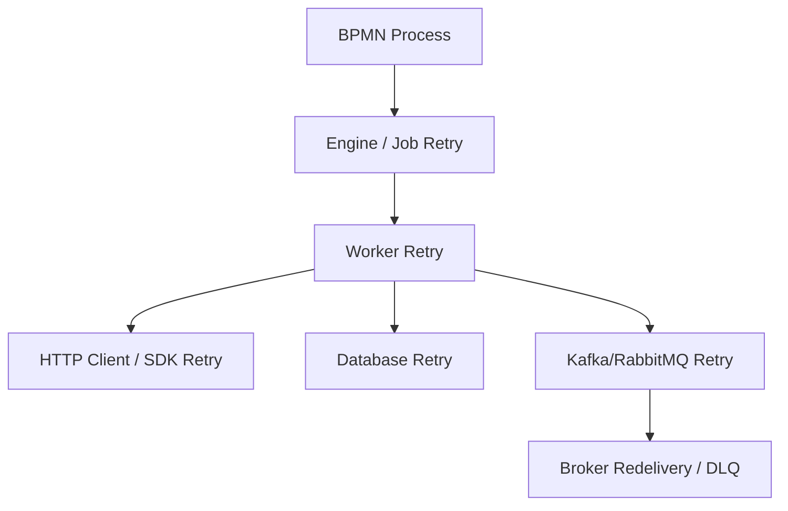
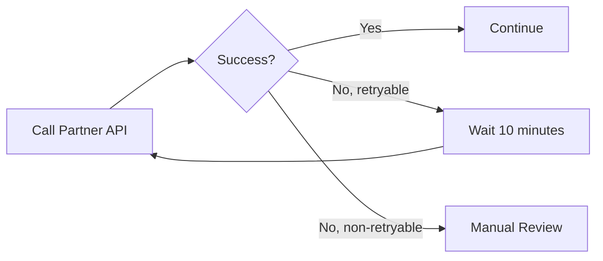

# Part 028 — Retry Strategy and Failure Handling

> Goal: make retry safe, bounded, observable, and business-aware.
>
> Retry is one of the most dangerous reliability tools in workflow systems. Used well, it absorbs transient failures and reduces manual work. Used badly, it creates duplicate side effects, retry storms, customer-impacting delays, corrupted state, noisy incidents, and hidden production debt.

---

## 1. Core mental model

Retry means:

> Attempt the same logical work again after failure.

That sounds simple, but in a workflow system the word **same** is hard.

The same work may involve:

- same process instance;
- same job or external task;
- same business entity;
- same command;
- same external API call;
- same database transition;
- same message publish;
- same human action;
- same correlation key.

A retry is safe only when repeating the work cannot create an incorrect additional business effect.

The real retry question is:

> If this step runs again, what exactly could happen twice?

---

## 2. Why retry exists

Distributed enterprise systems fail temporarily.

Examples:

- downstream API returns timeout;
- database has transient deadlock;
- network blips during cloud/on-prem call;
- Kafka/RabbitMQ broker is temporarily unavailable;
- Zeebe gateway is unreachable for a few seconds;
- Camunda 7 job executor cannot acquire jobs briefly;
- worker pod restarts during deployment;
- external fulfillment platform is overloaded;
- DNS/private endpoint issue resolves after failover.

Without retry, every transient issue becomes manual work.

With unbounded retry, every persistent issue becomes a storm.

Good retry policy finds the middle:

- try again when failure is likely transient;
- slow down when dependency is unhealthy;
- stop when automatic retry is unsafe;
- create incident when human decision is needed;
- preserve context for repair.

---

## 3. Retry is not error handling by itself

Retry answers only one question:

> Should we attempt again?

It does not answer:

- Is the step idempotent?
- Did the previous attempt partially succeed?
- Is the business state still valid?
- Is the dependency still down?
- Should the process route to manual task?
- Should compensation start?
- Should customer be notified?
- Should the process stop as incident?

Retry must be part of a larger failure-handling design.

---

## 4. Failure classification before retry

Before choosing retry, classify the failure.

| Failure type | Example | Retry? | Better handling |
|---|---|---|---|
| transient technical | HTTP 503, socket timeout | yes, with backoff | worker/engine retry |
| resource contention | DB deadlock, optimistic lock conflict | yes, short backoff | retry with jitter |
| dependency outage | partner API down | yes, slower backoff then incident | circuit breaker + incident |
| deterministic business rejection | quote rejected, product unavailable | no | BPMN error/gateway |
| invalid request/data | missing required order field | usually no | BPMN error/manual correction/incident |
| code bug | NullPointerException | no or limited | incident and fix deployment |
| non-idempotent partial success | external request may have succeeded | not blindly | reconcile first |
| authorization failure | 403 from service | usually no | config/security incident |
| rate limit | 429 | yes, respect retry-after | backoff/throttling |

---

## 5. Retry levels

Retry may exist at multiple layers.



Multiple retry layers can conflict.

Example bad stack:

```text
HTTP client retries 3 times
Worker retries internally 5 times
Camunda job retries 3 times
RabbitMQ redelivers 10 times
Kubernetes restarts worker repeatedly
```

One logical task may create hundreds of attempts.

Senior rule:

> Decide which layer owns retry for each failure category.

---

## 6. Engine-level retry

Engine-level retry means the workflow engine records failed work and schedules another attempt.

Useful for:

- service task job retry;
- async continuation retry;
- external task retry;
- Zeebe job retry;
- timer job retry;
- technical failure that can be retried later.

Advantages:

- visible in process tooling;
- retry count can lead to incident;
- process remains paused at known activity;
- operations can inspect/retry;
- retry state is durable.

Risks:

- worker must be idempotent;
- retry may run on another pod/version;
- variables may have changed;
- external side effect may have partially completed;
- retry may overload dependency.

---

## 7. Worker-level retry

Worker-level retry means the worker itself loops before reporting failure to Camunda.

Example:

```java
for (int attempt = 1; attempt <= 3; attempt++) {
  try {
    externalClient.submit(command);
    return Success;
  } catch (SocketTimeoutException e) {
    sleep(backoff(attempt));
  }
}
return Failure;
```

Worker-level retry is useful for very short transient blips.

Use it carefully.

### 7.1 Worker-level retry risks

- job timeout may expire while worker is still retrying;
- another worker may pick the job after timeout;
- long worker retry hides failure from engine observability;
- pod shutdown may interrupt loop;
- retry may ignore platform-wide dependency outage;
- retry may duplicate side effects if not idempotent.

### 7.2 Worker-level retry guideline

Use worker-level retry only when:

- attempts are short;
- job timeout comfortably exceeds retry window;
- operation is idempotent;
- error category is known transient;
- metrics count each attempt;
- engine still receives failure if retry is exhausted.

---

## 8. BPMN-level retry

BPMN-level retry means modelling the retry path explicitly.

Example:



This is useful when retry has business meaning.

Examples:

- retry partner fulfillment after waiting for maintenance window;
- ask human user to correct data before retry;
- retry only during business hours;
- escalate after retry attempts;
- use different channel/provider after repeated failure.

Avoid BPMN-level retry for simple transient technical failures that engine retry can handle more cleanly.

---

## 9. Client/SDK retry

HTTP clients, database drivers, Kafka producers, cloud SDKs, and service meshes may retry automatically.

This can be helpful or dangerous.

Hidden retry can break assumptions.

Example:

```text
Worker thinks it called billing once.
HTTP client retried POST three times.
Billing created three requests because idempotency key was missing.
```

Checklist:

- Is SDK retry enabled?
- Which status codes trigger retry?
- Does it retry POST/PUT/PATCH?
- Does it respect retry-after?
- Does it use jitter?
- Is the operation idempotent?
- Are attempts logged/metriced?
- Does the total retry window exceed job timeout?

---

## 10. Retry count

Retry count defines how many automatic attempts are allowed.

Too low:

- transient blips become incidents;
- operations workload increases;
- process reliability appears worse than it is.

Too high:

- outage becomes retry storm;
- customer waits too long;
- worker capacity is wasted;
- incidents are delayed;
- duplicate side effects become more likely;
- dependency recovery is slowed by load.

### 10.1 Retry count selection

Base retry count on:

- failure category;
- dependency recovery profile;
- business SLA;
- worker idempotency;
- cost of duplicate side effects;
- capacity limits;
- observability maturity;
- manual repair availability.

Example policy:

| Task type | Retry count | Backoff | Incident trigger |
|---|---:|---|---|
| internal read-only API | 3 | short exponential | after final failure |
| external partner write | 1–2 | long with reconciliation | if status unknown |
| DB optimistic lock | 3 | short jitter | after conflict persists |
| Kafka publish via outbox | many controlled by relay | exponential | if outbox aging breaches SLA |
| payment/order submission | low | cautious | if no idempotency confirmation |
| manual task completion listener | low | short | if validation/system error persists |

---

## 11. Retry cycle and backoff

A retry cycle defines when attempts occur.

Common strategies:

- immediate retry;
- fixed backoff;
- exponential backoff;
- exponential backoff with jitter;
- schedule-based retry;
- business-calendar-aware retry;
- manual retry only.

### 11.1 Immediate retry

Useful for extremely short transient conflicts.

Risk:

- repeats before dependency has recovered;
- consumes capacity;
- creates hot loops.

### 11.2 Fixed backoff

Example:

```text
retry every 5 minutes, 3 times
```

Useful for predictable short recovery.

Risk:

- many jobs retry at same time;
- no adaptation to outage severity.

### 11.3 Exponential backoff

Example:

```text
1 minute -> 5 minutes -> 15 minutes -> 1 hour
```

Useful for unstable dependencies.

Risk:

- may exceed business SLA;
- delayed incident if retry count too high.

### 11.4 Jitter

Jitter randomizes retry timing.

It reduces synchronized retry spikes.

Use jitter especially when many process instances depend on the same external service.

---

## 12. Retry storm

A retry storm happens when many failed tasks retry at the same time and overload the same dependency.

Causes:

- dependency outage;
- immediate retry;
- high retry count;
- synchronized timer due dates;
- worker restart after downtime;
- backlog catch-up after broker recovery;
- autoscaling increases concurrency aggressively;
- multiple retry layers stack together.

Symptoms:

- dependency error rate increases;
- worker CPU/thread usage spikes;
- job activation grows;
- queue lag grows;
- incidents explode after retries deplete;
- database connection pool saturates;
- customer workflows slow down.

Mitigations:

- exponential backoff;
- jitter;
- concurrency limits;
- circuit breaker;
- rate limiter;
- bulkhead per dependency;
- pause/suspend worker type;
- feature flag/kill switch;
- manual incident handling;
- staged retry after recovery.

---

## 13. Poison task

A poison task is a job/message/process step that will fail every time unless data, code, or environment changes.

Examples:

- process variable has incompatible schema;
- order references missing product configuration;
- worker has bug for one payload shape;
- external system rejects command deterministically;
- task requires authorization no service account has;
- message correlation key is wrong;
- migration removed activity but instance still waits there.

Retries do not fix poison tasks.

They only waste capacity and hide the real issue.

### 13.1 Poison task handling

When a task is poison:

1. Stop automatic retry.
2. Create incident or route to manual repair.
3. Capture safe diagnostic code.
4. Preserve original payload/state.
5. Determine whether data repair, code fix, compensation, or cancellation is needed.
6. Retry only after the cause changes.

---

## 14. Manual intervention

Manual intervention is appropriate when automatic retry is unsafe or insufficient.

Examples:

- external command status unknown;
- duplicate order may have been created;
- business user must correct quote data;
- process variable is invalid;
- migration mapping failed;
- downstream system needs manual reconciliation;
- security/authorization configuration must be fixed.

Manual intervention should be modelled and operated deliberately.

Options:

- BPMN user task;
- incident repair in Cockpit/Operate;
- admin-only repair endpoint;
- controlled database correction with audit;
- dedicated fallout queue;
- compensation process;
- migration runbook.

---

## 15. Incident creation and resolution

Incident creation should mean:

> Automatic recovery is exhausted or unsafe; human/system intervention is needed.

Incident resolution should mean:

> The underlying condition has changed enough that process continuation is safe.

Do not resolve incidents just to clean dashboards.

### 15.1 Incident resolution questions

Before resolving/retrying:

- What failed?
- Why did retries fail?
- Did any attempt partially succeed?
- Is the worker now fixed/deployed?
- Is the dependency recovered?
- Is domain state consistent?
- Is process variable state valid?
- Is external system state known?
- Is retry idempotent?
- Does the business need notification?

---

## 16. Camunda 7 retry perspective

Camunda 7 retry depends on whether work is executed as:

- synchronous delegate execution;
- async job;
- timer/message job;
- external task;
- batch operation;
- process instance modification/migration job.

### 16.1 Async continuation retry

`asyncBefore` or `asyncAfter` creates transaction boundaries and job executor work.

If a job fails:

- retries are decremented;
- job may be rescheduled;
- incident is created when retries reach zero;
- Cockpit/REST/ManagementService can be used for inspection/repair.

### 16.2 Failed job retry configuration

Camunda 7 allows retry cycles to be configured for failed jobs.

Important review questions:

- Is retry cycle configured explicitly?
- Is retry inherited/defaulted unexpectedly?
- Does retry match business SLA?
- Does retry align with external dependency recovery?
- Are job failures observable?

### 16.3 External task retries

External task workers set retries when reporting failure.

Worker must decide:

- remaining retries;
- retry timeout;
- error message;
- error details;
- whether to throw BPMN error instead;
- whether to extend lock before long work;
- whether to stop retry after poison condition.

Bad external task worker:

```java
catch (Exception e) {
  externalTaskService.handleFailure(task, workerId, e.getMessage(), stacktrace, 100, 0L);
}
```

Why bad:

- too many retries;
- immediate retry storm;
- sensitive stacktrace may leak;
- no failure classification;
- no idempotency check.

---

## 17. Camunda 8 / Zeebe retry perspective

In Camunda 8, a service task creates a job with a job type.

A job worker activates jobs and must report completion, failure, or BPMN error.

Retry is controlled through job retries and worker failure commands.

### 17.1 Zeebe job failure decision

When worker fails a job, it should choose:

- remaining retries;
- retry backoff;
- safe error message;
- local variables for failure context if appropriate;
- whether incident should be created by setting retries to zero;
- whether BPMN error is more appropriate.

### 17.2 Retry backoff

Backoff matters because immediate retry may run before dependency recovers.

Example policy:

```text
catalog-read-worker:
  retries: 5
  backoff: 10s, 30s, 2m, 5m, 15m

fulfillment-submit-worker:
  retries: 2
  backoff: 5m, 30m
  requires reconciliation before manual retry if status unknown
```

### 17.3 Job timeout interaction

Job timeout must be longer than normal worker processing time.

If timeout is too short:

- job becomes available again while first worker still runs;
- duplicate execution occurs;
- completion from first worker may fail;
- external side effect may already have happened.

Retry strategy and timeout strategy must be reviewed together.

---

## 18. Idempotent retry

Retry is safe only when idempotency exists at the correct boundary.

Possible idempotency keys:

- process instance key;
- business key;
- job key;
- external task ID;
- command ID;
- order ID + action type;
- quote ID + approval step;
- event ID;
- request idempotency key;
- outbox event ID.

### 18.1 Idempotency table pattern

```sql
CREATE TABLE workflow_processed_command (
  command_key text PRIMARY KEY,
  process_instance_key text NOT NULL,
  business_key text NOT NULL,
  command_type text NOT NULL,
  status text NOT NULL,
  external_reference text,
  created_at timestamptz NOT NULL DEFAULT now(),
  updated_at timestamptz NOT NULL DEFAULT now()
);
```

Worker flow:

```text
1. Build deterministic command_key.
2. Insert command_key before side effect, or reserve it transactionally.
3. If duplicate key exists, read prior result.
4. Execute side effect using same idempotency key.
5. Store external reference/result.
6. Complete job with stable output.
```

### 18.2 Idempotency is not always deduplication

Deduplication says:

> I saw this before; ignore it.

Idempotency says:

> Repeating this operation leads to the same intended business result.

For workflow workers, idempotency often requires checking current business state, not merely ignoring duplicates.

---

## 19. Retry with PostgreSQL/MyBatis

Database operations can fail transiently.

Common retryable DB errors:

- deadlock;
- serialization failure;
- optimistic lock conflict;
- connection acquisition timeout during brief failover.

Common non-retryable DB errors:

- constraint violation due to invalid data;
- missing required reference;
- incompatible schema;
- permission denied;
- SQL syntax bug.

### 19.1 Transaction boundary mismatch

Danger scenario:

```text
DB commit succeeds.
Worker fails before completing Camunda job.
Camunda retries.
DB update runs again.
```

Mitigation:

- use idempotent state transition;
- use unique constraint;
- store processed job/command;
- make update conditional on current state;
- use outbox for event publish;
- reconcile before retrying external side effect.

### 19.2 Conditional update pattern

```sql
UPDATE orders
SET status = 'FULFILLMENT_REQUESTED', updated_at = now()
WHERE order_id = :orderId
  AND status = 'VALIDATED';
```

If row count is zero, worker must inspect current state.

It may mean:

- duplicate retry already applied transition;
- illegal transition;
- concurrent process modification;
- data inconsistency.

Do not blindly fail or complete without classification.

---

## 20. Retry with Kafka

Kafka-related retry problems:

- producer retry duplicates event if idempotence/keying is wrong;
- consumer retry reprocesses same event;
- replay re-triggers old command;
- process correlation happens after instance moved on;
- event published before DB commit;
- event published after job completion fails.

Recommended patterns:

- outbox table for publishing domain events;
- stable event ID;
- consumer inbox table;
- process correlation validation;
- schema compatibility;
- replay-safe handlers;
- command/event distinction;
- business key in headers/payload.

### 20.1 Workflow event publish rule

Avoid:

```text
call Kafka producer directly
complete workflow job
hope both succeeded consistently
```

Prefer:

```text
within DB transaction:
  update business state
  insert outbox event
complete job after durable state exists
outbox relay publishes event with retry
```

---

## 21. Retry with RabbitMQ

RabbitMQ may redeliver messages.

Retry can happen in:

- consumer code;
- broker redelivery;
- dead-letter exchange delay pattern;
- workflow engine job retry;
- worker internal retry.

Define ownership.

For workflow-driven commands, prefer one primary retry owner.

If Camunda owns retry, RabbitMQ consumer should avoid uncontrolled requeue loops.
If RabbitMQ DLQ owns retry, Camunda job retry should not multiply attempts unexpectedly.

### 21.1 RabbitMQ duplicate command pattern

Use:

- command ID;
- correlation ID;
- idempotency table;
- reply correlation key;
- DLQ visibility;
- max delivery count;
- manual parking queue for poison messages.

---

## 22. Retry with Redis

Redis is often used for:

- rate limiting;
- circuit breaker state;
- distributed locks;
- short-lived dedup;
- worker coordination;
- feature flags/kill switches.

Be careful using Redis as the only source of retry/idempotency truth.

Risks:

- key expires before process completes;
- eviction removes dedup state;
- Redis outage disables protection;
- split-brain/lock expiry creates concurrent execution;
- cache state diverges from process engine.

For critical workflow idempotency, prefer PostgreSQL or another durable store.

---

## 23. Retry in Kubernetes

Kubernetes can amplify retry.

Examples:

- pod crashes after side effect but before job completion;
- deployment creates two worker versions handling same job type;
- HPA scales workers during dependency outage;
- liveness probe kills slow worker;
- graceful shutdown is too short;
- job timeout expires during pod termination.

### 23.1 Worker shutdown rule

On shutdown:

- stop activating new jobs;
- finish or safely fail active jobs;
- respect termination grace period;
- avoid completing after timeout;
- persist idempotency state before side effect;
- expose shutdown metrics.

### 23.2 Autoscaling rule

Do not autoscale blindly on backlog if the downstream dependency is failing.

Autoscaling workers during dependency outage can make failure worse.

Use:

- dependency-aware scaling;
- concurrency limits;
- backpressure;
- rate limiters;
- circuit breakers;
- kill switch per job type.

---

## 24. Retry in cloud/on-prem/hybrid

### 24.1 Cloud dependency failover

AWS/Azure managed dependencies may briefly fail during maintenance/failover.

Good retry:

- backoff;
- jitter;
- connection reset handling;
- circuit breaker;
- incident if recovery exceeds threshold.

Bad retry:

- immediate tight loop;
- retry all instances simultaneously;
- no dependency health check;
- no business SLA awareness.

### 24.2 Hybrid network

Hybrid/on-prem links may have higher latency and firewall constraints.

Retry policy should account for:

- longer network timeouts;
- certificate expiry;
- DNS propagation;
- proxy behavior;
- customer network maintenance;
- limited observability across boundary.

Do not copy cloud-internal retry settings to hybrid integrations without measuring reality.

---

## 25. Observability for retry

Track retry explicitly.

Minimum metrics:

- job failures by type;
- retries remaining distribution;
- retry attempts per job type;
- retry backoff delay;
- incident creation rate;
- incident age;
- retry success after N attempts;
- duplicate idempotency hits;
- external dependency error rate;
- worker timeout count;
- poison task count;
- manual retry count;
- retry storm detection.

Useful dimensions:

```text
processDefinitionKey
processVersion
activityId / elementId
jobType / topic
workerName
workerVersion
businessDomain
externalDependency
failureCategory
errorCode
cloudRegion / cluster
```

---

## 26. Retry debugging playbook

When a job repeatedly fails:

1. Identify job type/activity.
2. Check process instance/business key.
3. Check remaining retries and failure history.
4. Read worker logs by correlation ID.
5. Classify failure category.
6. Check whether any attempt partially succeeded.
7. Check domain database state.
8. Check outbox/inbox/idempotency table.
9. Check external system state.
10. Check worker version/deployment time.
11. Check dependency health around failure time.
12. Decide: retry, stop, repair, compensate, cancel, or migrate.

### 26.1 What not to do

Do not:

- increase retries without root-cause hypothesis;
- click retry-all during dependency outage;
- retry non-idempotent external writes blindly;
- edit process variables without audit;
- complete job manually without verifying business state;
- hide deterministic bugs behind huge retry counts.

---

## 27. Retry policy template

For every service task/job type, document:

```yaml
jobType: submit-fulfillment-order
businessMeaning: "Submit validated order to fulfillment provider"
owningTeam: "Backend / Order Fulfillment"
dependency: "Fulfillment API"
idempotencyKey: "orderId + fulfillmentAction"
sideEffects:
  - external fulfillment request
  - order state transition
  - outbox event
retryPolicy:
  retryableFailures:
    - HTTP_503
    - SOCKET_TIMEOUT_BEFORE_STATUS_KNOWN
    - DB_DEADLOCK
  nonRetryableFailures:
    - ORDER_INVALID
    - CUSTOMER_CANCELLED
    - AUTHORIZATION_DENIED
  maxAttempts: 3
  backoff: "5m, 15m, 1h"
  jitter: true
  incidentAfter: "attempts exhausted or status unknown"
manualRepair:
  requiredWhen:
    - external status unknown
    - duplicate suspected
    - payload schema incompatible
observability:
  metrics:
    - job_failure_count
    - retry_attempt_count
    - incident_count
    - duplicate_idempotency_hit
  logs:
    - correlationId
    - processInstanceKey
    - orderId
    - workerVersion
```

---

## 28. Retry policy examples

### 28.1 Read-only catalog lookup

Recommended:

- worker-level short retry for network blip;
- engine-level retry with short exponential backoff;
- incident if catalog unavailable beyond SLA;
- no compensation needed;
- cache may help but must not hide stale critical data.

### 28.2 Order submission to external system

Recommended:

- external idempotency key required;
- low retry count;
- longer backoff;
- status reconciliation before manual retry;
- incident if status unknown;
- compensation/cancellation path if duplicate or partial success.

### 28.3 Human task assignment listener

Recommended:

- low retry count;
- fail to incident if identity/group mapping invalid;
- do not auto-assign to fallback group unless business approved;
- alert because tasks may become invisible.

### 28.4 Kafka event publish

Recommended:

- use outbox relay;
- retry publish outside workflow job if possible;
- monitor outbox age;
- do not complete business process as externally visible until event publish semantics are understood.

---

## 29. Correctness concerns

Retry policy must preserve these invariants:

- no duplicate irreversible side effects;
- no illegal domain state transition;
- no business rejection treated as transient technical failure;
- no technical outage treated as business rejection;
- no retry beyond customer/business SLA without escalation;
- no hidden SDK retry multiplying attempts unexpectedly;
- no retry after process cancellation;
- no retry with stale variable schema;
- no retry after worker version incompatibility unless fixed;
- no retry that bypasses authorization or audit.

---

## 30. Performance concerns

Retries consume capacity.

Watch for:

- high retry volume after dependency outage;
- job activation backlog;
- DB connection pool exhaustion;
- message broker redelivery spikes;
- OpenSearch/Elasticsearch pressure from incident data;
- worker CPU/thread saturation;
- timeout due to too much in-worker retry;
- large failure details/history growth;
- manual task backlog caused by retry exhaustion.

Retry is part of capacity planning.

---

## 31. Security and privacy concerns

Failure details can leak sensitive data.

Retry/incident details should avoid:

- raw customer data;
- pricing details;
- full external API response with PII;
- credentials;
- tokens;
- internal secrets;
- stacktrace visible to broad users;
- unredacted request payload.

Use safe fields:

- error category;
- sanitized error code;
- correlation ID;
- worker version;
- external dependency name;
- restricted log link;
- process/job identifier.

---

## 32. PR review checklist

For each workflow/service task change:

- Is retry policy explicit?
- Who owns retry: engine, worker, SDK, broker, BPMN?
- Is operation idempotent?
- What side effect can happen twice?
- Are business errors excluded from retry?
- Are deterministic data errors excluded from retry?
- Is backoff appropriate?
- Is jitter needed?
- Does retry window fit business SLA?
- What happens after retries are exhausted?
- Is incident actionable?
- Are failure details sanitized?
- Are metrics/logs sufficient?
- Is manual repair documented?
- Is compensation needed?
- Does Kubernetes shutdown interact safely with job timeout?
- Are Kafka/RabbitMQ retries aligned with engine retry?

---

## 33. Internal verification checklist

Verify in the CSG/team environment:

- Default retry count for each process engine/task type.
- Whether retry cycles are defined in BPMN/XML or code.
- Whether Zeebe job retries are configured per service task.
- Whether Camunda 7 failed job retry cycle is customized.
- Whether external task workers set retries consistently.
- Whether worker-level HTTP/SDK retries are enabled.
- Whether RabbitMQ redelivery/DLQ retry overlaps Camunda retry.
- Whether Kafka producer/consumer retry is documented.
- Whether idempotency keys exist for side-effecting workers.
- Whether processed job/command/inbox/outbox tables exist.
- Whether retry exhaustion alerts exist.
- Whether incidents have owner and SLA.
- Whether retry-all operations are restricted.
- Whether manual repair is audited.
- Whether worker graceful shutdown is implemented.
- Whether retry dashboards show attempts, remaining retries, and incident age.

---

## 34. Practical exercise

Pick one worker:

```text
submit-order-to-fulfillment
```

Answer:

1. What is the business side effect?
2. What is the idempotency key?
3. Which failures are retryable?
4. Which failures are BPMN business errors?
5. Which failures create incident immediately?
6. What is the retry count?
7. What is the backoff?
8. What happens if worker crashes after external API success?
9. What table/log proves whether the side effect happened?
10. What dashboard shows retry storm risk?
11. Who can manually retry?
12. What audit trail is produced?

If you cannot answer these, the worker is not production-ready.

---

## 35. Mastery summary

You understand this part when you can explain:

- why retry is unsafe without idempotency;
- how engine retry, worker retry, SDK retry, broker retry, and BPMN retry differ;
- why retry storms happen;
- how retry exhaustion becomes incident;
- how to detect poison tasks;
- how to choose retry count/backoff;
- how to debug repeated job failure safely;
- how PostgreSQL/MyBatis, Kafka, RabbitMQ, Redis, Kubernetes, cloud, and hybrid environments affect retry design;
- how to review retry policy in a PR before it becomes a production incident.

A senior engineer does not ask, “How many retries should we set?” first.

A senior engineer asks:

> What can happen twice, how do we prove it, and when must automation stop?

---

## References

- Camunda 8 Docs — Service tasks: https://docs.camunda.io/docs/components/modeler/bpmn/service-tasks/
- Camunda 8 Docs — Job workers: https://docs.camunda.io/docs/components/concepts/job-workers/
- Camunda 8 Docs — Dealing with problems and exceptions: https://docs.camunda.io/docs/components/best-practices/development/dealing-with-problems-and-exceptions/
- Camunda 7 Docs — Job executor: https://docs.camunda.org/manual/latest/user-guide/process-engine/the-job-executor/
- Camunda 7 Javadocs — Incident: https://docs.camunda.org/javadoc/camunda-bpm-platform/7.0/org/camunda/bpm/engine/runtime/Incident.html
