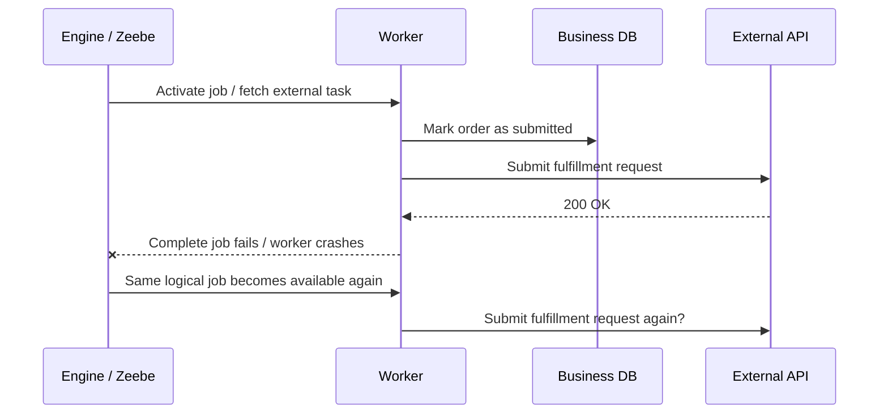
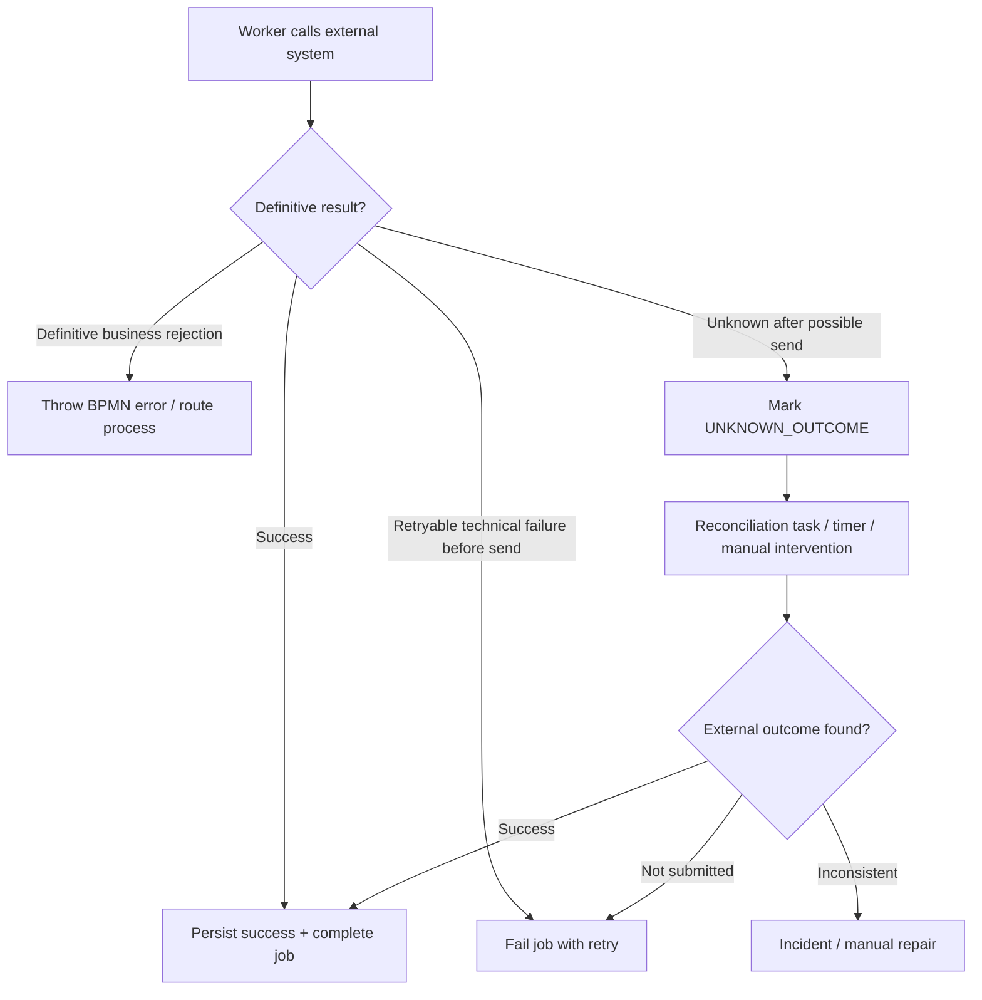

# Part 029 — Idempotency in Workflow Workers

> Goal: make workflow workers safe to retry, safe to re-deliver, safe to restart, and safe to scale horizontally.
>
> In workflow systems, duplicate execution is not an edge case. It is a normal consequence of timeout, retry, crash, failover, network uncertainty, message redelivery, rolling deployment, and human repair.

---

## 1. Core mental model

A workflow worker is idempotent when repeating the same logical command produces the same business result without creating an additional incorrect side effect.

Simple definition:

> Same logical input, same business effect, no duplicate external consequence.

That does **not** mean the code literally does nothing on the second execution. It may:

- detect the previous attempt;
- read existing state;
- return the previous result;
- skip duplicate mutation;
- re-publish a missing event;
- reconcile with an external system;
- complete the Camunda job after confirming the side effect already happened.

Idempotency is not only a code pattern. It is a correctness contract across:

- Camunda job or external task;
- business entity state;
- database transaction;
- external API call;
- event publish;
- message correlation;
- worker retry policy;
- process incident repair.

---

## 2. Why idempotency exists in workflow systems

Workflow workers run in unreliable distributed environments.

A worker can execute the side effect but fail before it tells Camunda that the job is complete.



The dangerous question is:

> What happens on the second attempt?

Without idempotency, the system may:

- create duplicate fulfillment orders;
- approve the same quote twice;
- publish duplicate domain events;
- charge twice;
- allocate inventory twice;
- send duplicate customer notifications;
- complete a stale task;
- move an entity through an illegal state transition;
- hide data corruption behind a successful retry.

---

## 3. Idempotency is not exactly-once delivery

Senior engineer rule:

> Assume at-least-once execution. Design idempotent side effects.

Camunda, Kafka, RabbitMQ, HTTP clients, Kubernetes, databases, and cloud infrastructure can reduce duplicate probability, but they do not eliminate duplicate business execution in every failure window.

Do not build your correctness model around “this cannot happen twice.”

Build around:

- **it may happen twice**;
- **we can detect it**;
- **we can make the second attempt harmless**;
- **we can repair unknown outcomes**;
- **we can prove what happened from audit data**.

---

## 4. Deduplication vs idempotency

These two are related but different.

| Concept | Meaning | Example | Limitation |
|---|---|---|---|
| Deduplication | Ignore repeated input | Do not process same Kafka message ID twice | May skip needed retry if first attempt partially failed |
| Idempotency | Repeat logical command safely | `submitOrder(orderId, commandId)` returns existing result | Requires business-aware state handling |
| Exactly-once | System-level guarantee for some operation boundary | Kafka transaction in narrow producer/consumer flow | Rarely covers external API + DB + workflow together |
| Reconciliation | Determine real outcome after uncertainty | Query fulfillment system after timeout | Slower but necessary for unknown state |

Deduplication alone is often too weak.

Bad pattern:

```text
if message_id already_seen:
  skip everything
```

If the first attempt wrote to the idempotency table but crashed before the external API call, the second attempt may be skipped incorrectly.

Better pattern:

```text
if command already completed:
  return completed result
if command in progress but stale:
  reconcile or resume safely
if command not started:
  execute with transactional markers
```

---

## 5. Where duplicate execution comes from

### 5.1 Camunda 8 / Zeebe job timeout

A Zeebe job is assigned to a worker for a timeout window. If the job is not completed within that timeout, it may become available for another worker.

Duplicate risk:

- worker is still running after timeout;
- worker completed external side effect but network failed;
- worker pod is killed during rolling deployment;
- worker overload makes completion late;
- long API call exceeds job timeout.

### 5.2 Camunda 8 job retry

When a worker fails a job with remaining retries, the engine can make the job available again. If retries reach zero, an incident can be raised.

Duplicate risk:

- failure is reported after partial success;
- retry happens with different worker version;
- variables changed between attempts;
- external system accepted the first command but returned timeout.

### 5.3 Camunda 7 external task lock expiration

In Camunda 7 external task pattern, a worker fetches and locks a task. If lock expires before completion, another worker can fetch it.

Duplicate risk:

- lock duration too short;
- worker forgets to extend lock;
- worker crashes after side effect;
- network failure on `complete`.

### 5.4 Camunda 7 JavaDelegate retry

A Java delegate may run again when async job retry occurs after exception.

Duplicate risk:

- delegate updates database and then throws;
- delegate calls external API and transaction rollback does not rollback external API;
- delegate publishes event outside the transaction;
- retry re-enters same code path.

### 5.5 Message brokers and APIs

Kafka, RabbitMQ, REST callbacks, scheduled repair jobs, and manual replays can all deliver the same logical signal more than once.

Duplicate risk:

- Kafka replay from older offset;
- RabbitMQ redelivery after consumer crash;
- REST client retries POST;
- operator manually re-runs repair;
- upstream sends duplicate callback;
- message correlation is attempted multiple times.

---

## 6. Idempotency identifiers

Good idempotency starts with choosing the right identity.

| Identifier | Source | Good for | Risk |
|---|---|---|---|
| Process instance key/id | Camunda runtime | tying work to one workflow instance | may change if process restarted |
| Business key | domain/application | quote/order/customer-level correlation | must be stable and unique enough |
| Job key | Zeebe | one concrete job record | retry may reuse same logical job, but business operation may need wider key |
| External task ID | Camunda 7 | one external task execution | can be too engine-specific |
| Command ID | API/client/domain command | safest logical operation identity | must be generated and propagated |
| Message ID | broker/upstream | broker dedup/inbox | may not match business operation |
| Correlation ID | tracing | observability | not always unique command identity |
| Idempotency key | explicit app contract | API and worker safety | must be scoped and persisted |

Senior rule:

> Use a business-level command identity for side effects, not only an engine-level job identity.

Engine identifiers help diagnostics. Business command identifiers protect correctness.

---

## 7. Recommended idempotency key strategy

For enterprise workflow workers, use a composite key.

Example:

```text
idempotency_scope = "ORDER_FULFILLMENT_SUBMISSION"
idempotency_key   = order_id + ":" + fulfillment_attempt_id
```

Or:

```text
idempotency_scope = "QUOTE_APPROVAL_DECISION"
idempotency_key   = quote_id + ":" + approval_task_id + ":" + decision_version
```

Do not use a random UUID generated inside the worker. That creates a new key on retry and defeats idempotency.

The key should be:

- deterministic for the same logical command;
- stable across retry;
- propagated to downstream APIs/events if possible;
- stored in PostgreSQL with unique constraint;
- logged with correlation ID and process instance ID/key;
- visible in operational dashboards or incident notes.

---

## 8. Idempotency table pattern

A simple PostgreSQL table can protect worker side effects.

```sql
CREATE TABLE workflow_idempotency_record (
  scope               text        NOT NULL,
  idempotency_key     text        NOT NULL,
  business_entity_id  text        NOT NULL,
  process_instance_id text        NULL,
  job_reference       text        NULL,
  status              text        NOT NULL,
  request_hash        text        NULL,
  result_payload      jsonb       NULL,
  error_code          text        NULL,
  created_at          timestamptz NOT NULL DEFAULT now(),
  updated_at          timestamptz NOT NULL DEFAULT now(),
  completed_at        timestamptz NULL,
  PRIMARY KEY (scope, idempotency_key)
);
```

Possible statuses:

```text
STARTED
SIDE_EFFECT_SUBMITTED
COMPLETED
FAILED_RETRYABLE
FAILED_FINAL
UNKNOWN_OUTCOME
RECONCILED
```

Key idea:

> The table does not merely say “seen.” It records lifecycle and outcome.

---

## 9. Worker algorithm: safe execution skeleton

```java
public WorkerResult submitOrderFulfillment(WorkflowJob job) {
  String orderId = job.variable("orderId");
  String attemptId = job.variable("fulfillmentAttemptId");
  String idempotencyKey = orderId + ":" + attemptId;

  return transactionTemplate.execute(tx -> {
    IdempotencyRecord record = idempotencyRepository.findForUpdate(
        "ORDER_FULFILLMENT_SUBMISSION",
        idempotencyKey
    );

    if (record != null && record.isCompleted()) {
      return WorkerResult.complete(record.resultVariables());
    }

    if (record == null) {
      idempotencyRepository.insertStarted(
          "ORDER_FULFILLMENT_SUBMISSION",
          idempotencyKey,
          orderId,
          job.processInstanceReference(),
          job.jobReference()
      );
    }

    Order order = orderRepository.findForUpdate(orderId);
    order.assertCanSubmitFulfillment();

    return WorkerResult.continueOutsideTransaction(
        new FulfillmentCommand(orderId, idempotencyKey)
    );
  });
}
```

Then execute external side effect with the same idempotency key:

```java
FulfillmentResponse response = fulfillmentClient.submit(command, idempotencyKey);

transactionTemplate.executeWithoutResult(tx -> {
  orderRepository.markFulfillmentSubmitted(command.orderId(), response.externalId());
  idempotencyRepository.markCompleted(
      "ORDER_FULFILLMENT_SUBMISSION",
      command.idempotencyKey(),
      Map.of("fulfillmentId", response.externalId())
  );
  outboxRepository.insertEvent(
      "OrderFulfillmentSubmitted",
      command.orderId(),
      command.idempotencyKey(),
      response.externalId()
  );
});

job.complete(Map.of("fulfillmentId", response.externalId()));
```

This skeleton is intentionally simplified. Real implementations must handle unknown external outcomes and worker crash between steps.

---

## 10. The hard failure window

The hardest window is:

```text
external API succeeded
worker crashed before DB commit or job completion
```

A local transaction cannot roll back the external API.

The correct design is usually:

1. send deterministic idempotency key to the external API;
2. on retry, check local idempotency record;
3. if local state is uncertain, query external API by idempotency key or business reference;
4. reconcile local DB with external outcome;
5. complete the workflow job only after local state is consistent.

If the external API does not support idempotency or query-by-reference, the process must treat timeout as `UNKNOWN_OUTCOME`, not blindly retry.

---

## 11. Unknown outcome pattern

Unknown outcome means:

> We cannot prove whether the side effect happened.

Example:

- HTTP request timed out after sending body;
- RabbitMQ publish succeeded but confirm was lost;
- Kafka producer got ambiguous exception;
- worker pod died after external call;
- external platform returns 500 but later processes request;
- network gateway closed connection after upstream accepted command.

Do not model unknown outcome as simple failure.

Recommended path:



---

## 12. Database write idempotency

Database idempotency is usually built with:

- unique constraints;
- optimistic locking;
- explicit state transition guards;
- command tables;
- processed job tables;
- outbox tables;
- inbox tables;
- append-only audit events.

Example safe state transition:

```sql
UPDATE orders
SET status = 'FULFILLMENT_SUBMITTED',
    fulfillment_id = :fulfillmentId,
    updated_at = now(),
    version = version + 1
WHERE order_id = :orderId
  AND status = 'VALIDATED';
```

Then check affected row count.

If zero rows were updated, do not assume success or failure immediately. Read current state.

```text
if current status == FULFILLMENT_SUBMITTED and fulfillment_id == expected:
  treat as idempotent success
else if current status is incompatible:
  fail as illegal transition / incident
else:
  retry or route to repair
```

---

## 13. Processed job table pattern

A processed job table is useful when the same Camunda job/external task could be completed more than once by competing workers.

```sql
CREATE TABLE workflow_processed_job (
  engine             text        NOT NULL,
  job_reference      text        NOT NULL,
  process_instance   text        NOT NULL,
  activity_id        text        NOT NULL,
  worker_name        text        NOT NULL,
  status             text        NOT NULL,
  completed_at       timestamptz NOT NULL DEFAULT now(),
  result_payload     jsonb       NULL,
  PRIMARY KEY (engine, job_reference)
);
```

This protects engine-level duplicate processing.

It does **not** replace business-level idempotency.

Use both when the side effect is important.

---

## 14. Inbox table pattern for consumed events

When Kafka/RabbitMQ events drive workflow actions, use an inbox table.

```sql
CREATE TABLE message_inbox (
  source_system      text        NOT NULL,
  message_id         text        NOT NULL,
  message_type       text        NOT NULL,
  correlation_key    text        NOT NULL,
  payload_hash       text        NULL,
  processing_status  text        NOT NULL,
  received_at        timestamptz NOT NULL DEFAULT now(),
  processed_at       timestamptz NULL,
  error_message      text        NULL,
  PRIMARY KEY (source_system, message_id)
);
```

Inbox protects against duplicate message delivery.

But again, do not stop at `message_id already exists`. Check processing state.

Possible states:

```text
RECEIVED
PROCESSING
PROCESSED
FAILED_RETRYABLE
FAILED_FINAL
IGNORED_DUPLICATE
UNKNOWN_OUTCOME
```

---

## 15. Outbox table pattern for published events

If a worker updates PostgreSQL and publishes an event, do not publish directly in the middle of business logic unless duplicate/loss is acceptable.

Use outbox:

```sql
CREATE TABLE event_outbox (
  event_id          uuid        PRIMARY KEY,
  aggregate_type    text        NOT NULL,
  aggregate_id      text        NOT NULL,
  event_type        text        NOT NULL,
  idempotency_key   text        NOT NULL,
  payload           jsonb       NOT NULL,
  status            text        NOT NULL,
  created_at        timestamptz NOT NULL DEFAULT now(),
  published_at      timestamptz NULL
);
```

Worker transaction:

1. update business state;
2. insert outbox event;
3. commit;
4. outbox publisher publishes to Kafka/RabbitMQ;
5. mark event published.

This gives durable recovery if the worker dies before publishing.

---

## 16. External API idempotency

For external APIs, send a deterministic idempotency key when supported.

Example headers:

```http
POST /fulfillment-requests HTTP/1.1
Idempotency-Key: order-123:fulfillment-attempt-2
X-Correlation-Id: trace-abc
```

Required behavior to verify:

- Does external API store idempotency keys?
- What is the key retention window?
- Is duplicate request with same body returned as previous success?
- What happens if same key has different body?
- Can we query by idempotency key?
- Is the operation eventually consistent?
- Can the external side effect be cancelled or compensated?

If the external API does not support idempotency, build a protective layer in your service or use a reconciliation workflow.

---

## 17. Kafka idempotency concerns

Kafka can redeliver or replay messages. A process may receive the same business event multiple times.

Worker design concerns:

- use event ID plus business key;
- store consumed message in inbox;
- make process correlation idempotent;
- include event version/schema version;
- define replay behavior explicitly;
- distinguish historical replay from live command;
- avoid starting duplicate process instance for same business command.

Bad pattern:

```text
Every OrderValidated event starts a new fulfillment process.
```

Better pattern:

```text
OrderValidated command/event has commandId.
Process start checks whether fulfillment process already exists for orderId + commandId.
Duplicate event returns existing process reference.
```

---

## 18. RabbitMQ idempotency concerns

RabbitMQ redelivery is normal after consumer crash or negative acknowledgment.

Worker design concerns:

- use message ID or command ID;
- store inbox record before side effect;
- avoid combining broker retry and Camunda retry without ownership;
- design DLQ handling as repair workflow, not data graveyard;
- preserve correlation ID in reply messages;
- ensure reply handling is idempotent.

If RabbitMQ commands trigger Camunda actions, make both steps safe:

1. consuming command message;
2. starting/correlating workflow.

---

## 19. Redis idempotency: useful but dangerous as sole protection

Redis can help with:

- short-lived dedup cache;
- rate limiting;
- worker coordination;
- kill switch;
- distributed lock;
- fast lookup cache.

But Redis should usually not be the only idempotency store for business-critical workflow side effects.

Reasons:

- TTL expiry can allow duplicate execution later;
- eviction can remove protection;
- failover can lose recent writes depending on configuration;
- cache state may diverge from PostgreSQL;
- lock correctness is subtle.

Use PostgreSQL unique constraints for durable correctness. Use Redis only as an optimization or operational guardrail.

---

## 20. Idempotent process completion

A worker may complete the side effect but fail to complete the Camunda job.

On retry, after detecting existing success, the worker should complete the job with the same output variables.

Example:

```text
if fulfillment already submitted:
  complete job with fulfillmentId
else:
  submit fulfillment
```

Do not throw incident just because local side effect already exists. Existing success is often exactly what allows safe job completion.

However, if existing state conflicts with expected variables, do not paper over it.

Example conflict:

```text
process expects fulfillmentAttemptId = A2
DB says order submitted with fulfillmentAttemptId = A1
```

That requires reconciliation or incident.

---

## 21. Idempotent BPMN message correlation

Message correlation can also duplicate.

Example:

- callback arrives twice;
- Kafka event replayed;
- operator manually replays message;
- upstream retries webhook.

Safe handling:

- store callback/inbound event in inbox;
- check if process is still waiting for that message;
- if already consumed, return idempotent success to upstream;
- if process moved past the wait state, classify as duplicate/late;
- if no process exists, classify as missing/early and decide whether to buffer or reject.

---

## 22. Idempotent human task completion

Human tasks also need idempotency.

Common scenario:

- user double-clicks Complete;
- browser retries request;
- API gateway retries;
- two approvers race;
- stale task UI submits after task was reassigned or completed.

Backend contract should include:

- task version or ETag;
- command ID for completion;
- authorization check at completion time;
- current task state check;
- business state transition guard;
- idempotent response if same command already completed;
- conflict response if different command/user completed it.

---

## 23. Worker crash matrix

| Failure point | Duplicate risk | Required protection |
|---|---|---|
| before reading variables | low | normal retry |
| after creating idempotency record | skip/resume risk | lifecycle status, not simple seen flag |
| after DB update before job complete | duplicate completion attempt | state transition guard + job completion retry |
| after external API success before DB commit | unknown outcome | external idempotency + reconciliation |
| after event publish before marking published | duplicate event | outbox idempotent publish |
| after marking job complete before response received | worker may think failed | engine/job state check if possible |
| during rolling deployment | competing versions | backward-compatible worker logic |
| after job timeout while worker still running | parallel duplicate | timeout sizing + idempotency |

---

## 24. Camunda 7-specific review points

### 24.1 JavaDelegate

Check:

- Does delegate perform side effect inside same DB transaction?
- Does side effect escape rollback boundary?
- Is async boundary configured before risky side effect?
- What happens when delegate throws after DB/API call?
- Are BPMN errors used only for business errors?
- Are technical exceptions safe to retry?

### 24.2 External task

Check:

- Is lock duration longer than expected execution time?
- Does worker extend lock for long calls?
- Is completion idempotent?
- Does `handleFailure` preserve diagnostic context?
- Does retry count match side-effect safety?
- Does worker ID appear in logs/metrics?

---

## 25. Camunda 8 / Zeebe-specific review points

Check:

- Is job timeout realistic?
- Is `maxJobsActive` aligned with downstream capacity?
- Can two workers execute same logical side effect after timeout?
- Does worker fail job only after classifying failure?
- Are remaining retries reduced intentionally?
- Is retry backoff configured for dependency outages?
- Does incident contain enough business context?
- Can retry on a different worker version remain safe?

---

## 26. Observability for idempotency

Track:

- duplicate command detected count;
- idempotent replay success count;
- unknown outcome count;
- reconciliation success/failure count;
- processed job duplicate count;
- inbox duplicate count;
- outbox publish retry count;
- external idempotency conflict count;
- illegal state transition count;
- worker timeout count;
- job retry count by activity/job type.

Logs should include:

```text
correlationId
processInstanceId/processInstanceKey
businessKey
jobKey/externalTaskId
activityId/jobType
idempotencyScope
idempotencyKey
businessEntityId
workerName
attemptNumber
outcome
```

---

## 27. Alerting signals

Create alerts for:

- spike in duplicate side-effect prevention;
- high `UNKNOWN_OUTCOME` count;
- repeated idempotency conflict for same scope;
- outbox backlog;
- inbox processing backlog;
- worker timeout exceeding threshold;
- high job retry rate;
- incident created after retry exhaustion;
- external idempotency API returning conflict.

A duplicate detected metric is not always bad. It may prove the protection is working.

A rising trend is a reliability smell.

---

## 28. Anti-patterns

### 28.1 “Camunda will not run it twice”

Wrong assumption. Retry, timeout, crash, and repair can repeat work.

### 28.2 Random idempotency key inside worker

Wrong because retry produces a new key.

### 28.3 Seen flag only

Wrong because first attempt may be incomplete.

### 28.4 Redis-only dedup for critical side effect

Risky because TTL/eviction/failover can remove protection.

### 28.5 Idempotency only at API gateway

Insufficient because worker retry may bypass the original API request.

### 28.6 Complete workflow before side effect durability

Dangerous because process advances while business state may not.

### 28.7 Retry unknown outcome blindly

Can duplicate irreversible operations.

### 28.8 Store full large payload in idempotency table without retention design

Can create storage bloat and privacy risk.

---

## 29. Internal verification checklist

Use this checklist in CSG/team codebase review.

### 29.1 Worker implementation

- Identify every JavaDelegate, external task worker, Zeebe job worker, connector, and message consumer.
- For each worker, list side effects: DB write, external API, Kafka publish, RabbitMQ publish, Redis mutation, task completion, email/notification.
- Check whether side effect can happen twice.
- Check whether worker uses deterministic idempotency key.
- Check whether idempotency key is logged.
- Check whether worker handles unknown outcome.

### 29.2 Database

- Check for idempotency table, inbox table, outbox table, processed job table, or equivalent.
- Check unique constraints.
- Check state transition guards.
- Check optimistic locking/version columns.
- Check whether process variables duplicate durable business state.
- Check retention and cleanup for idempotency records.

### 29.3 Camunda 7

- Check external task lock duration.
- Check worker lock extension.
- Check retry count in `handleFailure`.
- Check async boundary around JavaDelegate.
- Check failed job incident context.

### 29.4 Camunda 8 / Zeebe

- Check job timeout.
- Check retries and retry backoff.
- Check worker concurrency and `maxJobsActive`.
- Check duplicate execution after timeout.
- Check incident payload and Operate visibility.

### 29.5 Messaging

- Check Kafka event ID and key strategy.
- Check RabbitMQ message ID/correlation ID strategy.
- Check broker retry vs Camunda retry ownership.
- Check DLQ repair process.
- Check replay behavior.

### 29.6 External systems

- Check whether external API supports idempotency key.
- Check idempotency retention window.
- Check query-by-reference support.
- Check cancellation/compensation support.
- Check unknown outcome runbook.

### 29.7 Observability

- Check metrics for duplicate prevention, unknown outcome, retry, timeout, and reconciliation.
- Check logs include idempotency scope/key.
- Check dashboard for idempotency conflicts.
- Check alert threshold.
- Check incident notes contain business entity and process reference.

---

## 30. PR review checklist

Ask these questions in review:

1. What is the logical command identity?
2. Can this worker run twice?
3. What happens if the worker crashes after the side effect but before job completion?
4. What happens if job timeout expires while worker still runs?
5. Is the idempotency key deterministic across retry?
6. Is there a durable unique constraint?
7. Is external API idempotent?
8. How is unknown outcome handled?
9. Are DB state transitions guarded?
10. Are events published through outbox or equivalent?
11. Is duplicate message delivery safe?
12. Are retries bounded and observable?
13. Is the result of a duplicate attempt returned consistently?
14. Can support/SRE diagnose duplicate prevention from logs and dashboard?
15. Does the process model route unrecoverable idempotency conflicts to incident/manual repair?

---

## 31. Practical design rule

For every automated workflow step, write this sentence before implementing it:

```text
This worker is safe to run more than once because __________.
```

If the blank is vague, the design is not ready.

Good answers:

```text
because it uses orderId + fulfillmentAttemptId as a durable idempotency key,
checks the order state under lock, sends the same key to the fulfillment API,
and reconciles unknown outcomes before retrying.
```

Bad answers:

```text
because Camunda only sends one job.
```

```text
because retries are rare.
```

```text
because the API should not be called twice.
```

---

## 32. Key takeaways

- Workflow workers must assume at-least-once execution.
- Idempotency must be business-aware, not only engine-aware.
- Use deterministic command identity.
- Use durable database constraints for correctness.
- Use inbox/outbox patterns for event integration.
- Treat unknown outcome as a first-class state.
- External API idempotency must be verified, not assumed.
- Redis is useful but usually not sufficient as the only guard.
- Observability must expose duplicate prevention and idempotency conflict.
- A worker is not production-ready until duplicate execution is safe.

---

## 33. References for further study

- Camunda 8 Job Workers: https://docs.camunda.io/docs/components/concepts/job-workers/
- Camunda 8 Service Tasks: https://docs.camunda.io/docs/components/modeler/bpmn/service-tasks/
- Camunda 8 Dealing with Problems and Exceptions: https://docs.camunda.io/docs/components/best-practices/development/dealing-with-problems-and-exceptions/
- Camunda 8 Writing Good Workers: https://docs.camunda.io/docs/components/best-practices/development/writing-good-workers/
- Camunda 7 External Tasks: https://docs.camunda.org/manual/latest/user-guide/process-engine/external-tasks/
