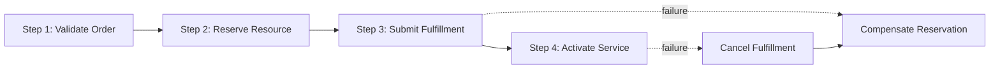
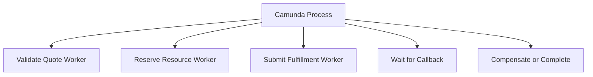
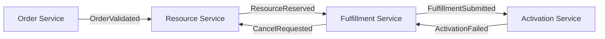
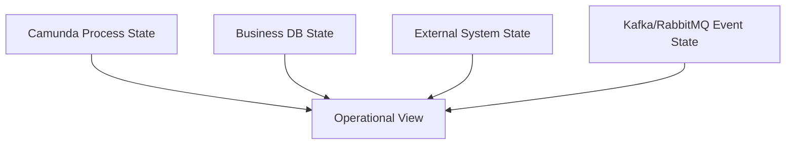
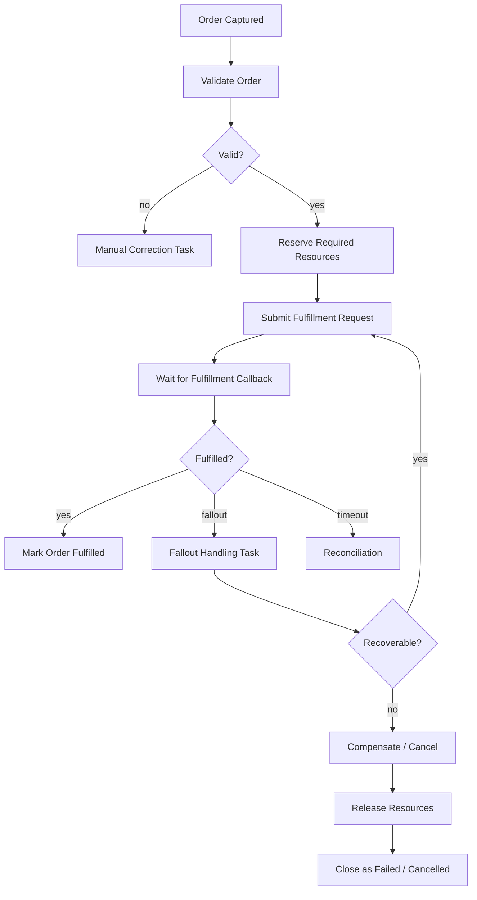

# Part 030 — Long-Running Transactions and Saga

> Goal: design long-running enterprise processes that survive partial success, partial failure, external uncertainty, retries, timeouts, human intervention, and production repair.
>
> A saga is not just “a workflow with compensation.” It is a distributed consistency strategy for business operations that cannot be protected by one database transaction.

---

## 1. Core mental model

A long-running transaction is a business operation that spans time, systems, people, and failure boundaries.

Examples:

- quote approval across pricing, legal, finance, and sales operations;
- order capture, validation, decomposition, and fulfillment;
- product provisioning across multiple downstream platforms;
- cancellation after partial fulfillment;
- amendment while an order is already in flight;
- fallout repair requiring human intervention;
- reconciliation between internal order state and external fulfillment state.

The important property:

> There is no single ACID transaction covering all steps.

Instead, the system must coordinate local transactions and side effects over time.

---

## 2. Why sagas exist

In a monolithic local transaction:

```text
BEGIN
  update quote
  insert approval
  update order
COMMIT
```

Rollback is simple because one database controls everything.

In enterprise workflow:

```text
approve quote in service A
reserve resource in service B
send command to service C
publish Kafka event
wait for fulfillment callback
ask human to resolve fallout
notify customer
```

There is no single rollback button.

If step 5 fails after steps 1–4 succeed, you need a business-aware recovery strategy.

That strategy may be:

- retry;
- compensate;
- wait;
- reconcile;
- escalate;
- route to human task;
- accept partial completion;
- cancel remaining steps;
- create incident;
- run manual repair.

A saga makes those choices explicit.

---

## 3. Saga definition

A saga is a sequence of local transactions where each completed step may have a compensating action if the overall business operation cannot continue.



Each step has:

- forward action;
- local transaction;
- durable state;
- retry policy;
- timeout policy;
- compensation action if needed;
- observability signal;
- audit trail.

---

## 4. Saga is not automatic rollback

Compensation is not the same as database rollback.

Rollback means:

> The original transaction never happened.

Compensation means:

> The original business action happened, and now a new business action attempts to reverse or neutralize it.

Example:

| Forward action | Possible compensation | Is it perfect? |
|---|---|---|
| Reserve resource | Release reservation | usually yes |
| Submit order to downstream | Cancel downstream order | maybe, if not fulfilled |
| Activate service | Deactivate service | may create customer impact |
| Send customer email | Send correction email | not a true undo |
| Publish event | Publish compensating event | consumers must understand it |
| Charge payment | Refund payment | not same as no charge |

Senior rule:

> Never claim compensation is safe until the business agrees what “undo” means.

---

## 5. Orchestration vs choreography

### 5.1 Orchestrated saga

A central process controls the sequence.



Advantages:

- visible end-to-end process;
- explicit failure path;
- easier manual intervention;
- easier SLA tracking;
- easier process audit;
- suitable for quote/order lifecycle.

Risks:

- orchestration process becomes too central;
- workers become thin wrappers around remote calls;
- process model may become god object;
- engine availability becomes operational dependency;
- teams may overuse BPMN for domain rules.

### 5.2 Choreographed saga

Services react to events without central coordinator.



Advantages:

- service autonomy;
- lower central orchestration coupling;
- natural fit for event-driven systems;
- scalable for simple flows.

Risks:

- end-to-end state is hard to see;
- failure path scattered across services;
- compensation ownership unclear;
- replay can trigger unwanted effects;
- manual repair requires cross-service knowledge;
- business stakeholders cannot easily read the process.

---

## 6. When Camunda fits saga orchestration

Camunda is a strong fit when the process has:

- explicit business lifecycle;
- long-running steps;
- wait states;
- human tasks;
- SLA timers;
- external callbacks;
- compensation paths;
- manual fallout handling;
- need for process audit;
- need for operational visibility;
- cross-system coordination;
- versioned process definitions.

Camunda is less useful when:

- the flow is a simple single-service transaction;
- only a queue worker is needed;
- there is no business process visibility requirement;
- compensation does not exist or is impossible;
- every step is synchronous and local;
- the process model would merely duplicate code.

---

## 7. BPMN elements commonly used in sagas

| BPMN element | Saga use |
|---|---|
| Service task | forward action or compensation action |
| User task | manual approval, fallout repair, manual decision |
| Timer event | timeout, SLA, waiting period, retry delay |
| Message event | external callback or event correlation |
| Error event | business failure path |
| Escalation event | non-fatal escalation to another scope/team |
| Compensation event | explicit undo/compensating activity |
| Boundary event | timeout/error around risky action |
| Event subprocess | process-wide exception/fallout handling |
| Call activity | reusable sub-process such as approval or fulfillment |
| Gateway | business decision after local transaction result |

Do not model saga only as happy path plus one generic error end event. That hides the most important design decisions.

---

## 8. Camunda 7 perspective

In Camunda 7, saga steps may be implemented with:

- JavaDelegate;
- external task worker;
- async continuation;
- BPMN error;
- compensation event;
- transaction subprocess;
- timer job;
- message correlation;
- user task;
- Cockpit incident triage.

Key concerns:

- JavaDelegate may run in engine transaction;
- external API side effect is outside engine transaction;
- failed job retry can repeat delegate logic;
- external task lock expiration can duplicate execution;
- Camunda DB history can grow significantly;
- process migration must consider running instances;
- compensation implementation must be tested, not just diagrammed.

---

## 9. Camunda 8 / Zeebe perspective

In Camunda 8, saga steps are usually implemented with:

- service tasks producing Zeebe jobs;
- job workers executing local transactions and remote calls;
- message events for external callbacks;
- timer events for timeout/SLA;
- BPMN errors for business-level failures;
- incidents for technical failures;
- compensation events/handlers where supported by the deployed version;
- Operate for instance/incident visibility;
- Tasklist for human tasks;
- exporters/search dependency for operational visibility.

Key concerns:

- job timeout can lead to duplicate execution;
- job worker retry must be idempotent;
- process variables should not become giant business snapshots;
- worker version compatibility matters during rollout;
- partition/backpressure/search health affects operations;
- compensation and BPMN feature support must be verified against the actual Camunda 8 version deployed.

---

## 10. Process state vs business state vs external state

A saga spans multiple state sources.



Each source answers a different question.

| State | Example | Main question |
|---|---|---|
| Process state | instance waiting at `WaitForFulfillmentCallback` | where is the workflow? |
| Business DB state | order status `FULFILLMENT_SUBMITTED` | what is our system of record? |
| External system state | fulfillment platform says `IN_PROGRESS` | what happened outside? |
| Message state | event delivered/published/replayed | what signals were exchanged? |
| Human task state | task assigned to fallout team | who must act? |

A production saga needs reconciliation rules between these states.

---

## 11. CPQ/order management saga example

Example high-level order fulfillment saga:



Important: this is a generic enterprise pattern, not a claim about internal CSG process design.

---

## 12. Forward action and compensation table

Every saga step should have a design table.

| Step | Forward action | Success marker | Retry policy | Compensation | Unknown outcome handling |
|---|---|---|---|---|---|
| Validate order | call validation service | validation result stored | limited retry | none | retry/query validation result |
| Reserve resource | reserve in inventory/resource system | reservation ID | retry with idempotency key | release reservation | query by reservation key |
| Submit fulfillment | create fulfillment request | fulfillment ID | cautious retry | cancel fulfillment if possible | query fulfillment by idempotency key |
| Activate service | activate downstream | activation reference | limited retry | deactivate if business permits | reconcile external service status |
| Notify customer | send notification | notification event ID | retry safely | correction notice | check notification log |

If you cannot fill this table, the saga design is incomplete.

---

## 13. Local transaction boundary

Each saga step should perform one local transaction.

Example worker flow:

```text
1. read process variables
2. load business entity under lock or version check
3. verify transition is legal
4. insert/update idempotency record
5. perform external side effect with idempotency key
6. persist result in business DB
7. insert outbox event if needed
8. complete workflow job
```

But there is no atomic transaction across steps 5 and 6 if step 5 is outside the database.

That is why idempotency and reconciliation are mandatory.

---

## 14. Timeout design

Timeouts in sagas are business decisions, not only technical settings.

Questions:

- How long should we wait for downstream fulfillment?
- Is the timeout customer-facing SLA or internal retry window?
- Should timeout trigger retry, reconciliation, escalation, or cancellation?
- Is timeout interrupting or non-interrupting?
- Can a late callback still arrive after timeout?
- What happens if late callback says success after compensation started?

Do not model timeout as generic failure without late-message policy.

---

## 15. Late event policy

Long-running processes must handle late events.

Example:

```text
T0: submit fulfillment request
T1: timer fires after 24 hours
T2: process routes to fallout/reconciliation
T3: external callback arrives with SUCCESS
```

Possible policies:

- accept late success if compensation has not started;
- ignore duplicate/late callback if already closed;
- reopen process only through manual repair;
- create incident for inconsistent external state;
- publish correction event;
- reconcile and update business state.

The policy must be explicit.

---

## 16. Manual intervention is part of saga design

Human intervention is not failure of automation. It is often required for business correctness.

Use human tasks for:

- ambiguous external response;
- missing customer data;
- approval exception;
- regulatory/commercial override;
- fulfillment fallout;
- compensation decision;
- customer-impacting cancellation;
- legal/finance review.

Human task must include:

- clear assignment group;
- due date/SLA;
- business context;
- allowed actions;
- audit trail;
- authorization;
- stale task handling;
- escalation path.

---

## 17. Reconciliation as first-class workflow

Reconciliation is how a saga recovers from unknown or divergent state.

Sources to compare:

- Camunda process state;
- business DB state;
- external system state;
- outbox/inbox state;
- Kafka/RabbitMQ event history;
- manual task state;
- audit log.

Reconciliation actions:

- complete stuck process;
- correlate missing message;
- update business state;
- trigger compensation;
- create manual task;
- mark duplicate event ignored;
- open incident;
- close false incident.

A serious workflow system needs reconciliation tooling or at least a safe runbook.

---

## 18. Stuck process patterns

A process is stuck when it remains in a state longer than expected without valid business reason.

Common stuck points:

- waiting for message that never arrives;
- timer backlog;
- human task unclaimed;
- job retries exhausted;
- incident unresolved;
- worker down;
- correlation key mismatch;
- external system completed but callback failed;
- process waiting on old version path after migration.

Detection:

- active instance age by activity;
- task aging;
- timer backlog;
- message correlation failure count;
- incident duration;
- business SLA breach;
- order/quote state mismatch.

---

## 19. Saga data model

A process instance is useful, but business systems often need a saga tracking table.

```sql
CREATE TABLE order_saga_execution (
  saga_id              uuid        PRIMARY KEY,
  order_id             text        NOT NULL,
  process_instance_ref text        NOT NULL,
  saga_type            text        NOT NULL,
  saga_status          text        NOT NULL,
  current_phase        text        NOT NULL,
  last_successful_step text        NULL,
  last_error_code      text        NULL,
  compensation_status  text        NULL,
  created_at           timestamptz NOT NULL DEFAULT now(),
  updated_at           timestamptz NOT NULL DEFAULT now()
);
```

This table should not replace Camunda runtime state. It gives the business system a durable query model and reconciliation anchor.

---

## 20. Saga status model

Example statuses:

```text
STARTED
VALIDATING
WAITING_FOR_APPROVAL
RESERVING
SUBMITTING_FULFILLMENT
WAITING_FOR_CALLBACK
FULFILLMENT_FALLOUT
RECONCILING
COMPENSATING
COMPENSATED
COMPLETED
FAILED_REQUIRES_MANUAL_REPAIR
CANCELLED
```

Avoid one vague status like `IN_PROGRESS` for everything. It kills operational visibility.

---

## 21. Compensation design rules

A compensation action must be:

- idempotent;
- business-approved;
- observable;
- authorized;
- retry-safe;
- auditable;
- explicit about partial compensation;
- safe when original forward action was only partially successful;
- safe when called after long delay.

Bad compensation:

```text
If anything fails, call cancelOrder().
```

Better compensation:

```text
If reservation exists and fulfillment has not started, release reservation.
If fulfillment exists but not activated, request cancellation.
If activated, route to manual cancellation approval.
```

---

## 22. Compensation ordering

Compensation often runs in reverse order of completed side effects.

Forward:

```text
Reserve resource -> Submit fulfillment -> Activate service
```

Compensation:

```text
Deactivate service -> Cancel fulfillment -> Release resource
```

But business rules may override pure reverse order.

Example:

- legal notification may need to happen before deactivation;
- customer communication may need approval;
- resource release may wait until cancellation is confirmed.

Model business reality, not theoretical symmetry.

---

## 23. Saga with Kafka

Kafka integration patterns:

- event starts saga;
- saga publishes command/event after step;
- saga waits for event callback;
- outbox publishes saga state changes;
- inbox deduplicates received events;
- replay is explicitly controlled.

Failure concerns:

- duplicate event starts duplicate saga;
- replay causes old compensation command;
- out-of-order event advances process incorrectly;
- schema evolution breaks worker variables;
- event arrives before process is waiting;
- event arrives after process is closed.

Required design:

- command ID/event ID;
- correlation key;
- inbox table;
- process start dedup;
- late-event policy;
- schema compatibility.

---

## 24. Saga with RabbitMQ

RabbitMQ integration patterns:

- command message starts saga;
- worker consumes task command;
- downstream replies with result message;
- DLQ becomes repair trigger;
- routing key maps to process/action.

Failure concerns:

- broker redelivery duplicates command;
- DLQ separates message from process context;
- retry happens both in RabbitMQ and Camunda;
- reply message lost or duplicated;
- routing key changes break consumers.

Required design:

- command ID;
- reply correlation ID;
- inbox/dedup table;
- DLQ ownership;
- retry ownership;
- safe requeue policy.

---

## 25. Saga with PostgreSQL/MyBatis

PostgreSQL is often the durable source of business truth.

Use it for:

- entity state;
- saga execution projection;
- idempotency records;
- inbox/outbox;
- audit trail;
- optimistic locking;
- repair notes;
- manual task references if needed.

MyBatis/JDBC concerns:

- transaction demarcation must be explicit;
- affected row count must be checked;
- state transitions need `WHERE status = expected`;
- mapper updates should not silently overwrite state;
- retry must not re-run non-idempotent SQL blindly;
- migration must preserve running saga compatibility.

---

## 26. Saga with Redis

Redis may support saga execution through:

- rate limiting downstream calls;
- short-term dedup cache;
- worker coordination;
- kill switch for risky workers;
- external lookup cache;
- task status cache for UI.

But Redis should not be the system of record for saga completion or compensation.

If Redis is down, the saga should degrade predictably:

- continue with PostgreSQL-backed correctness;
- throttle or pause risky workers;
- avoid losing durable state;
- avoid treating cache miss as business absence.

---

## 27. Kubernetes and deployment concerns

Saga workers run in pods that restart, scale, and roll.

Concerns:

- worker pod killed mid-side-effect;
- job timeout shorter than shutdown grace period;
- new worker version changes variable contract;
- rollout runs old and new workers concurrently;
- HPA scales workers beyond downstream capacity;
- network policy blocks engine/gateway/external API;
- secret rotation interrupts connector/worker.

Required safeguards:

- graceful shutdown;
- idempotency;
- version-compatible workers;
- bounded concurrency;
- readiness probe tied to dependency availability;
- kill switch for dangerous job types;
- dashboard by worker version.

---

## 28. Cloud/on-prem/hybrid concerns

Long-running processes often cross network boundaries.

Failure modes:

- cloud-to-on-prem firewall issue;
- private endpoint DNS failure;
- TLS/internal CA expiry;
- VPN/ExpressRoute/Direct Connect interruption;
- managed database failover;
- OpenSearch/Elasticsearch degradation;
- downstream platform maintenance window;
- customer-hosted environment latency.

Saga design must include:

- timeout policy;
- retry/backoff tuned to dependency type;
- manual intervention path;
- external maintenance awareness;
- reconciliation after outage;
- clear operational responsibility boundary.

---

## 29. Observability for sagas

Track:

- active saga count by type/status;
- age by current activity;
- successful completion rate;
- compensation rate;
- compensation failure rate;
- stuck process count;
- manual task aging;
- SLA breach count;
- retry rate by step;
- incident count by step;
- unknown outcome count;
- reconciliation backlog;
- late event count;
- duplicate event count;
- external system mismatch count.

Dashboards should answer:

```text
How many orders are stuck?
Where are they stuck?
Which downstream system is causing delay?
How many require manual action?
How many were compensated?
How many are customer-impacting?
```

---

## 30. Incident triage questions

When a saga fails, ask:

1. What is the business entity?
2. What process instance is involved?
3. What is the current BPMN activity?
4. What was the last successful side effect?
5. What local DB state exists?
6. What external system state exists?
7. Were any events published or received?
8. Is the failure retryable?
9. Is the outcome unknown?
10. Is compensation required?
11. Is manual approval required before compensation?
12. Is customer impact active or potential?
13. Can we safely retry from current state?
14. Do we need reconciliation first?
15. What audit evidence will prove the repair?

---

## 31. Common saga anti-patterns

### 31.1 “One generic compensation step”

Compensation must be step-specific and state-aware.

### 31.2 “Retry until it works”

Infinite retry hides failure and can hammer downstream systems.

### 31.3 “Workflow owns all business state”

Process state is not a replacement for business database state.

### 31.4 “No unknown outcome state”

Timeout after external call is not the same as failed call.

### 31.5 “No late event policy”

Late callbacks are guaranteed in long-running distributed systems.

### 31.6 “No manual repair path”

Some business failures require human judgment.

### 31.7 “Compensation not tested”

Untested compensation is operational fiction.

### 31.8 “Choreography without visibility”

Event-driven systems need end-to-end observability or they become mystery machines.

---

## 32. Internal verification checklist

Use this checklist in CSG/team review.

### 32.1 Process and BPMN

- Identify long-running processes in quote/order lifecycle.
- Check where saga orchestration exists: BPMN, code, events, scheduler, or manual operations.
- Check service tasks, message waits, timers, user tasks, and compensation paths.
- Check if failure paths are explicit or hidden in worker code.
- Check process versioning for running instances.

### 32.2 Business state

- Identify source of truth for quote/order status.
- Check mapping between process instance and business entity.
- Check state transition guards.
- Check partial success representation.
- Check cancellation/amendment/fallout state handling.

### 32.3 Compensation

- List every completed side effect that may need undo/neutralization.
- Verify compensation action exists and is idempotent.
- Verify business approval for compensation semantics.
- Verify compensation ordering.
- Verify compensation test coverage.

### 32.4 External systems

- Check idempotency support in downstream APIs.
- Check query/reconciliation capability.
- Check timeout and late callback behavior.
- Check external maintenance/outage runbook.
- Check ownership boundary with platform/SRE/customer team.

### 32.5 Messaging

- Check Kafka/RabbitMQ events that start or advance saga.
- Check duplicate/out-of-order/replay behavior.
- Check inbox/outbox usage.
- Check correlation key and business key.
- Check DLQ repair workflow.

### 32.6 Operations

- Check dashboards for active/stuck/compensating sagas.
- Check SLA/task aging alert.
- Check incident ownership.
- Check manual repair approval process.
- Check post-incident review notes.

---

## 33. PR review checklist

Ask these questions before approving saga/workflow changes:

1. What business operation is the saga protecting?
2. What are the local transactions?
3. What side effects happen outside the local transaction?
4. What is the idempotency key for each step?
5. What is the success marker for each step?
6. What happens after timeout?
7. What happens after late callback?
8. What happens after duplicate event?
9. What happens after worker crash?
10. What compensation exists for each completed side effect?
11. Is compensation always safe, or does it need human approval?
12. How is unknown outcome represented?
13. How does reconciliation work?
14. What dashboard shows saga health?
15. What runbook repairs stuck instances?
16. Is the BPMN model readable by business and precise enough for engineering?
17. Does this change affect running process instances?
18. Are worker and variable contracts backward-compatible?
19. What is customer impact if this saga stalls?
20. What audit evidence proves correct completion or compensation?

---

## 34. Practical saga design template

For each saga, maintain a design document with:

```text
Saga name:
Business goal:
Business owner:
Technical owner:
Trigger:
Correlation key:
Business entity:
Process definition/key:
Success condition:
Failure condition:
Timeout policy:
Late event policy:
Manual intervention path:
Reconciliation path:
Compensation table:
Idempotency strategy:
Inbox/outbox strategy:
Observability dashboard:
Runbook:
Security/privacy concerns:
Migration/versioning concerns:
```

If this template cannot be completed, the saga is not production-ready.

---

## 35. Key takeaways

- A long-running transaction cannot rely on one ACID boundary.
- Saga design is distributed consistency design.
- Compensation is business action, not rollback.
- Unknown outcome must be modelled explicitly.
- Late events are normal in long-running systems.
- Manual intervention is part of serious workflow design.
- Reconciliation is not optional for mission-critical processes.
- Camunda can make saga orchestration visible, but it does not automatically make side effects safe.
- Workers, databases, events, APIs, and human tasks must share one consistency story.
- A saga is production-ready only when failure, compensation, observability, and repair are designed as first-class paths.

---

## 36. References for further study

- Camunda 8 Workflow Patterns: https://docs.camunda.io/docs/components/concepts/workflow-patterns/
- Camunda 8 Compensation Events: https://docs.camunda.io/docs/components/modeler/bpmn/compensation-events/
- Camunda 8 Compensation Handler: https://docs.camunda.io/docs/components/modeler/bpmn/compensation-handler/
- Camunda 8 Dealing with Problems and Exceptions: https://docs.camunda.io/docs/components/best-practices/development/dealing-with-problems-and-exceptions/
- Camunda 8 Messages: https://docs.camunda.io/docs/components/concepts/messages/
- Camunda 8 Timer Events: https://docs.camunda.io/docs/components/modeler/bpmn/timer-events/
