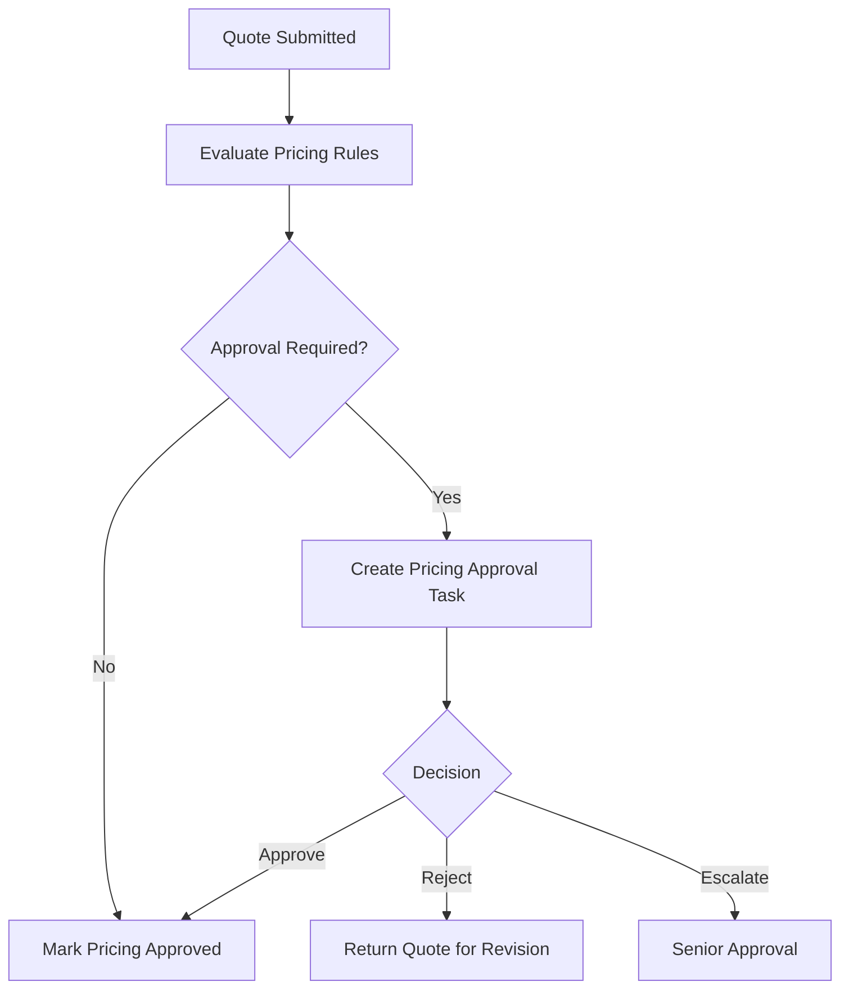
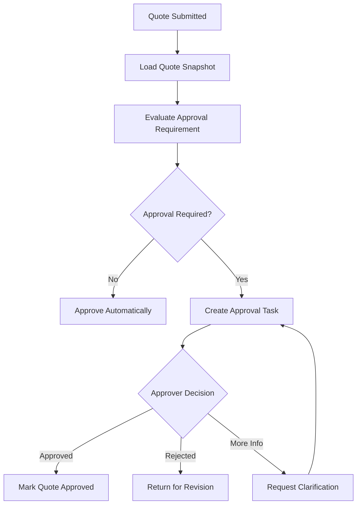
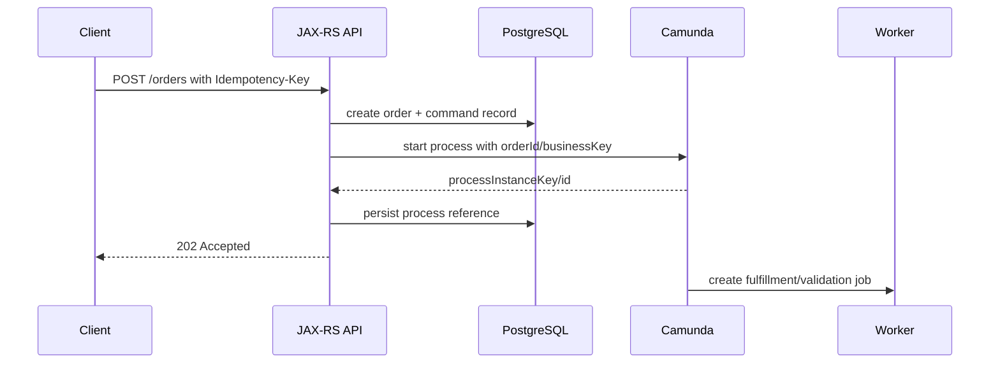
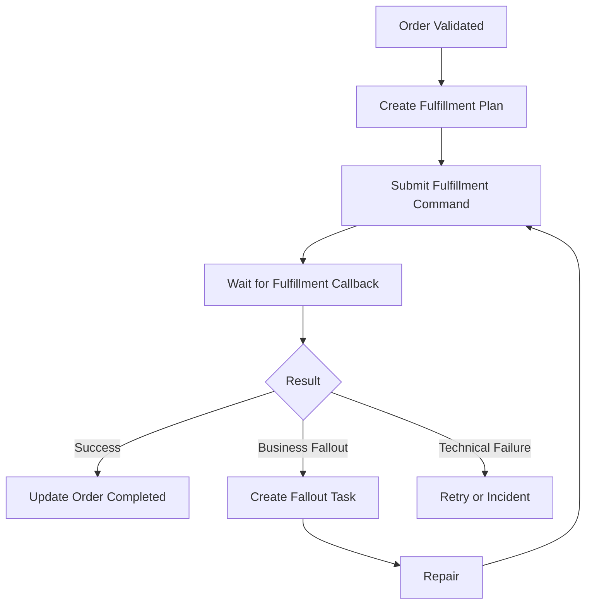
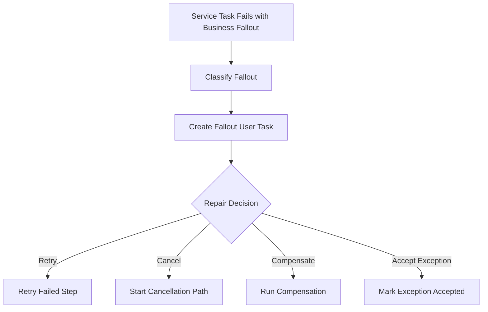
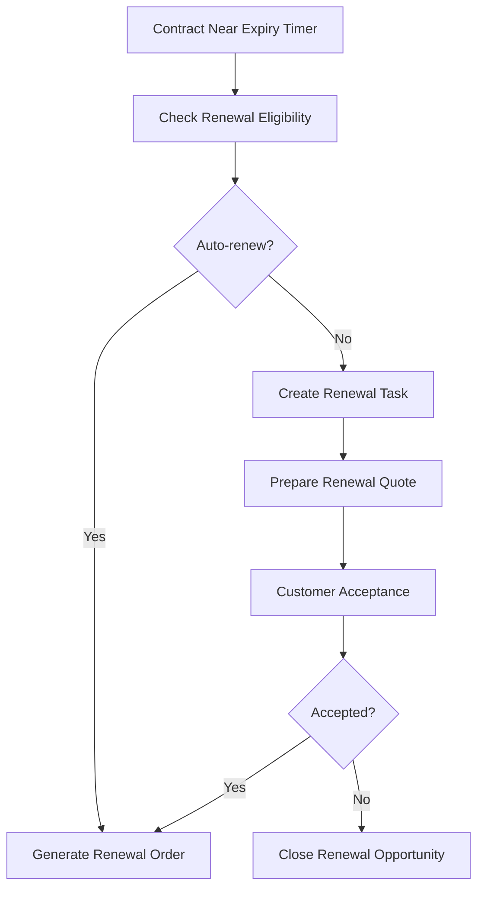

# Part 031 — Workflow in CPQ and Order Management Context

> Goal: understand how workflow orchestration appears in CPQ, quote management, order management, fulfillment, fallout, amendment, cancellation, renewal, SLA escalation, and reconciliation.
>
> This part does **not** describe the actual internal CSG process model. It gives a production-grade mental model and review framework. Anything specific to CSG must be verified internally.

---

## 1. Core mental model

CPQ and order management are not single CRUD flows.

They are long-running business processes where:

- a quote may require pricing, legal, finance, or sales approval;
- an order may need validation, decomposition, orchestration, fulfillment, and reconciliation;
- downstream systems may accept, reject, delay, partially complete, or silently fail;
- humans may need to resolve fallout;
- SLAs may trigger escalation;
- amendment and cancellation can arrive while work is already in flight;
- auditability is not optional.

In this context, workflow is useful because it makes process state, waiting, retries, timers, and manual intervention explicit.

The key shift:

```text
Simple backend mindset:
  request -> validate -> update DB -> return response

Workflow backend mindset:
  trigger -> start process -> persist state -> wait -> call systems -> receive events
          -> retry -> compensate -> escalate -> human repair -> reconcile -> complete
```

A senior engineer should not ask only:

> Which endpoint starts the process?

They should ask:

> What business operation is being protected, what can fail, who repairs it, and how do we prove the final state is correct?

---

## 2. Why CPQ/order management naturally creates workflow

A CPQ/order domain has several properties that produce workflow pressure.

### 2.1 Multi-step business lifecycle

A quote or order rarely moves from `created` to `completed` in one operation.

Typical lifecycle examples:

```text
Quote:
  Draft -> Priced -> Submitted -> Approval Required -> Approved -> Accepted -> Converted

Order:
  Captured -> Validated -> Decomposed -> Submitted -> In Fulfillment -> Completed
```

Each state transition may depend on:

- business rules;
- human decisions;
- external system response;
- catalog configuration;
- product eligibility;
- credit/risk check;
- contractual approval;
- network/resource availability;
- asynchronous downstream status.

### 2.2 Long-running duration

A process may last seconds, minutes, days, or weeks.

Examples:

- waiting for manager approval;
- waiting for customer acceptance;
- waiting for provisioning confirmation;
- waiting for downstream order status;
- waiting for fallout repair;
- waiting for cancellation confirmation.

Long duration means the system needs durable state, not in-memory continuation.

### 2.3 Cross-system coordination

Order management usually touches many systems:

- quote service;
- product catalog;
- pricing engine;
- customer/account service;
- inventory/resource system;
- billing;
- fulfillment/provisioning;
- notification;
- document generation;
- CRM;
- partner/external API;
- data warehouse or reporting.

No single service owns the whole transaction.

### 2.4 Human intervention

Human tasks are common:

- approve discount;
- approve non-standard commercial terms;
- review failed validation;
- resolve fallout;
- approve cancellation fee waiver;
- manually map an unavailable product/resource;
- resolve duplicate or conflicting customer records.

Human work needs task visibility, ownership, due date, escalation, and audit.

### 2.5 Business auditability

CPQ and order systems need evidence:

- who approved;
- what version of quote/order was approved;
- which rule was applied;
- which downstream system failed;
- when SLA breached;
- what manual repair was performed;
- which event completed the order;
- what changed during amendment/cancellation.

Workflow can help, but only if variables, events, tasks, logs, and domain audit are designed deliberately.

---

## 3. What workflow should and should not own

Workflow should own orchestration.

It should coordinate:

- process steps;
- wait states;
- timers;
- retries;
- human tasks;
- message correlation;
- compensation path;
- manual intervention;
- process-level observability.

Workflow should **not** become the only place where domain truth exists.

Domain services should still own:

- quote validity;
- order validity;
- product/catalog invariants;
- state transition legality;
- pricing calculation correctness;
- entitlement logic;
- persistence of business entities;
- idempotent command handling;
- event publishing correctness.

Bad boundary:

```text
BPMN gateway decides all quote/order business rules,
and database simply stores whatever state BPMN says.
```

Better boundary:

```text
BPMN asks domain service to evaluate/transition state.
Domain service enforces invariants and persists result.
BPMN routes based on explicit outcome.
```

---

## 4. CPQ/order workflow taxonomy

A practical taxonomy helps avoid one giant process.

### 4.1 Quote approval workflow

Typical goal:

> Ensure a quote is approved by the correct authority before it becomes externally binding.

Possible triggers:

- quote submitted;
- discount threshold exceeded;
- non-standard product bundle;
- contract term exception;
- manual submit by sales user;
- pricing engine returns approval requirement.

Possible tasks:

- evaluate approval rule;
- create manager approval task;
- create finance/legal task;
- wait for approval;
- request revision;
- expire stale approval;
- notify submitter;
- update quote status.

Key modelling concern:

Approval routing should usually be a decision/rule concern, while the approval lifecycle is workflow concern.

### 4.2 Pricing approval workflow

Typical goal:

> Control pricing exceptions, special discounts, margin risk, and commercial approval.

Possible flow:



Production concerns:

- approval threshold version;
- quote version being approved;
- stale approval after quote changed;
- approval delegation;
- timeout/escalation;
- audit of decision reason.

### 4.3 Enterprise agreement approval workflow

Typical goal:

> Route non-standard commercial or contractual terms through specialized approval.

Common complexity:

- parallel legal and finance review;
- conditional security review;
- rework loop;
- document generation;
- customer negotiation delay;
- approval expiration.

Gateway risk:

Parallel reviews need clear join semantics. A missing join can move the process forward before all required approvals complete.

### 4.4 Order capture workflow

Typical goal:

> Transform an accepted quote or customer order request into a durable order entity and process instance.

Important boundary:

Order capture may be synchronous at API level but should often return `202 Accepted` if fulfillment is long-running.

Useful pattern:

```text
POST /orders
  validate command idempotently
  create order aggregate
  start process instance
  return orderId + process tracking reference
```

Risk:

Starting workflow before durable order creation can create orphaned process instances.

Risk in the opposite direction:

Creating order but failing to start workflow creates stuck business entity.

The design must include reconciliation.

### 4.5 Order validation workflow

Typical goal:

> Validate order completeness, eligibility, catalog compatibility, customer/account status, and fulfillment readiness.

Validation may be:

- synchronous domain validation;
- asynchronous external validation;
- business rule/DMN decision;
- human validation for exceptions;
- integration validation with inventory/resource systems.

Workflow is useful when validation has wait states or manual intervention. It is overkill for purely synchronous deterministic validation.

### 4.6 Order decomposition workflow

Typical goal:

> Split a commercial order into technical/order items or fulfillment tasks.

Examples:

- decompose bundle into product components;
- split by fulfillment system;
- split by location/region;
- split by service type;
- split by dependency ordering.

Critical concern:

Decomposition output is often a business artifact and should usually be persisted in domain tables, not only process variables.

### 4.7 Fulfillment orchestration workflow

Typical goal:

> Coordinate downstream fulfillment steps until the order is completed or falls out.

Possible steps:

- submit service order;
- reserve resource;
- activate service;
- configure network;
- update billing;
- notify customer;
- wait for callbacks;
- reconcile final state.

This is where saga and compensation thinking becomes necessary.

### 4.8 Fallout handling workflow

Typical goal:

> Route failed or ambiguous fulfillment to humans or specialized repair automation.

Fallout is not just an incident.

A technical incident means the engine/worker could not proceed.

A business fallout may be a valid business state:

```text
Downstream rejected product because inventory unavailable.
Order requires manual repair.
```

Fallout usually needs:

- classification;
- ownership;
- SLA;
- reason code;
- repair task;
- retry after repair;
- customer impact marker;
- audit trail.

### 4.9 Amendment workflow

Typical goal:

> Modify an in-flight quote/order safely.

Amendment is hard because it may conflict with running process state.

Questions:

- Is the order still amendable?
- Which steps already completed?
- Which downstream systems need update?
- Does amendment require approval?
- Are old tasks still valid?
- Are old messages/callbacks still acceptable?
- Does amendment cancel or fork the existing process?

Weak design:

```text
Just update order rows and hope the existing process reacts correctly.
```

Stronger design:

```text
Amendment is a command with state transition rules, process correlation, version checks, and reconciliation.
```

### 4.10 Cancellation workflow

Typical goal:

> Stop or reverse an order safely.

Cancellation may be simple before fulfillment starts and complex after partial fulfillment.

Possible paths:

- cancel before submission;
- cancel after validation;
- cancel after downstream submission;
- cancel after partial activation;
- cancellation rejected by downstream;
- cancellation requires fee approval;
- cancellation creates compensation actions.

Cancellation must define:

- point of no return;
- compensation obligations;
- late callback policy;
- final state mapping;
- customer notification;
- audit evidence.

### 4.11 Renewal workflow

Typical goal:

> Renew customer agreement, subscription, or service package.

Typical concerns:

- renewal eligibility;
- pricing recalculation;
- contract version;
- customer acceptance;
- billing update;
- expiration timer;
- auto-renew vs manual renew;
- renewal cancellation.

Renewal often combines rule evaluation, timer events, user tasks, and external integration.

---

## 5. Mapping CPQ/order concepts to BPMN elements

| Domain concept | BPMN/Camunda concept | Caution |
|---|---|---|
| Quote submitted | Message start event, API start, or service task after domain command | Do not start process before durable entity exists unless recovery exists |
| Approval needed | User task or call activity to approval subprocess | Approval rule should not be hidden in unreadable expressions |
| Approval timeout | Boundary timer or escalation path | Timezone and business calendar must be explicit |
| Pricing decision | DMN/business rule task or domain service | Keep rule version auditable |
| Fulfillment command | Service task/job worker/external task | Must be idempotent |
| Downstream callback | Message correlation | Requires stable correlation key |
| Fallout | User task, incident, or business error path depending on semantics | Do not confuse business fallout with technical incident |
| Cancellation | Event subprocess, message event, compensation path, or separate process | Define point of no return |
| Amendment | Message event, command API, state transition, or process migration-like strategy | Avoid silent mutation of running process assumptions |
| Reconciliation | Timer-driven process, batch worker, or operational workflow | Must be safe and observable |

---

## 6. Quote approval pattern

### 6.1 Basic structure



### 6.2 Production concerns

The process must define:

- which quote version is being approved;
- whether edits invalidate existing approval;
- whether approval can be delegated;
- whether approval expires;
- how rejection reason is captured;
- how approval is audited;
- how approver authorization is enforced;
- how stale tasks are prevented;
- how duplicate completion is handled.

### 6.3 Backend contract

A human task completion endpoint should not blindly complete the Camunda task.

It should validate:

- task exists;
- task belongs to current user/group;
- quote version matches;
- domain state allows decision;
- decision payload is valid;
- command is idempotent;
- completion is auditable.

Example shape:

```text
POST /quotes/{quoteId}/approval-tasks/{taskId}/decision
Headers:
  Idempotency-Key: ...
Body:
  decision: APPROVE | REJECT | REQUEST_INFO
  reason: ...
  quoteVersion: ...
```

---

## 7. Pricing approval pattern

Pricing approval is not just an approver task.

It involves:

- price calculation;
- margin threshold;
- discount policy;
- product bundle exception;
- customer segment exception;
- region-specific policy;
- effective date;
- commercial authority.

### 7.1 Recommended separation

```text
Pricing engine / rule service:
  calculates price and returns approval requirement.

Workflow:
  routes approval, waits for decision, escalates, and records process path.

Domain service:
  enforces whether quote can transition to priced/approved/accepted.
```

### 7.2 Failure modes

| Failure | Example | Handling |
|---|---|---|
| Rule unavailable | Pricing rule service down | Retry, incident, or fallback policy |
| Rule changed mid-approval | Approval based on old threshold | Persist rule/version snapshot |
| Quote edited after approval | Approved price no longer valid | Invalidate approval and rerun |
| Approver unavailable | Task ages beyond SLA | Timer escalation |
| Duplicate decision | User double-click or retry | Idempotency + task state check |

---

## 8. Order capture pattern

Order capture is where synchronous API design meets asynchronous workflow.

### 8.1 Safe sequence

A common safe pattern:



### 8.2 Edge cases

| Failure point | Risk | Mitigation |
|---|---|---|
| DB commit succeeds, process start fails | Order exists but workflow not started | Reconciliation job starts missing workflow |
| Process starts, DB update of process reference fails | Process exists but order lacks reference | Reconciliation by business key |
| Client retries request | Duplicate order | Idempotency key + unique command record |
| Process starts wrong version | Unexpected path | Explicit process version strategy for critical processes |
| API returns before process visible | Confusing client status | Return tracking status and eventual consistency contract |

### 8.3 API response posture

For long-running order capture, prefer:

```http
202 Accepted
```

Response body:

```json
{
  "orderId": "ORD-123",
  "status": "CAPTURED",
  "workflowTrackingId": "...",
  "message": "Order accepted for asynchronous processing"
}
```

Avoid pretending fulfillment is complete when only capture succeeded.

---

## 9. Order validation pattern

Order validation can be layered:

```text
Layer 1: API syntactic validation
Layer 2: domain invariant validation
Layer 3: catalog/product eligibility validation
Layer 4: customer/account validation
Layer 5: external fulfillment readiness validation
Layer 6: manual exception validation
```

Only layers with wait states, external uncertainty, or manual work need workflow representation.

### 9.1 Anti-pattern

```text
Every small validation is a BPMN service task.
```

This creates excessive process noise.

### 9.2 Better pattern

Group synchronous validations in domain/application service.

Use workflow for:

- asynchronous validation;
- external validation;
- manual validation;
- SLA-bound validation;
- validation that changes process route.

---

## 10. Order decomposition pattern

Decomposition converts commercial intent into executable fulfillment plan.

Example:

```text
Commercial order:
  Internet Bundle + Static IP + Managed Router

Decomposed tasks:
  - provision broadband access
  - allocate static IP
  - ship router
  - configure managed service
  - activate billing
```

### 10.1 Where decomposition belongs

Decomposition logic often belongs in a domain/service layer because it is tightly coupled to catalog and fulfillment rules.

Workflow can orchestrate the result:

```text
service task: create fulfillment plan
parallel subprocess: execute plan items
message events: wait for callbacks
user task: resolve fallout
```

### 10.2 Data modelling concern

Do not store the fulfillment plan only as a large process variable.

Prefer durable tables:

```text
order
order_item
fulfillment_plan
fulfillment_task
fulfillment_task_dependency
fulfillment_event
```

Process variable should carry references and routing context:

```json
{
  "orderId": "ORD-123",
  "fulfillmentPlanId": "FP-456",
  "correlationKey": "ORD-123"
}
```

---

## 11. Fulfillment orchestration pattern

Fulfillment is usually the most workflow-heavy part.

### 11.1 Typical flow



### 11.2 Key decisions

- Is downstream interaction command/reply, event-driven, polling, or callback?
- What is the correlation key?
- What happens on duplicate callback?
- What happens on late callback after cancellation?
- What happens if downstream accepts command but never responds?
- What is retryable?
- What is business fallout?
- What is technical incident?
- Who owns manual repair?

### 11.3 Orchestration does not remove downstream uncertainty

Workflow can wait, retry, and route.

It cannot guarantee the external system actually did what it said.

For mission-critical order flows, reconciliation is required.

---

## 12. Fallout handling pattern

Fallout is a business process, not a logging detail.

### 12.1 Fallout model

A useful fallout record may include:

```text
fallout_id
order_id
process_instance_id
activity_id
failure_category
failure_code
failure_message
customer_impact
assigned_group
priority
sla_due_at
status
created_at
resolved_at
resolution_action
resolution_comment
```

### 12.2 BPMN pattern



### 12.3 Failure-oriented concerns

- Fallout task without owner becomes hidden backlog.
- Fallout without reason code cannot be analyzed.
- Fallout without SLA becomes customer-impact risk.
- Fallout without repair command becomes manual database patching.
- Fallout without audit creates compliance risk.

---

## 13. Amendment workflow pattern

Amendment is dangerous because it changes intent while execution may already be underway.

### 13.1 Design options

| Option | Description | Use when |
|---|---|---|
| Reject amendment | Do not allow changes after point of no return | Fulfillment is irreversible or too risky |
| Pause and amend | Pause process, apply amendment, continue | Workflow supports safe wait state |
| Cancel and recreate | Cancel current process/order and start new one | Change is large or process state incompatible |
| Compensation and amend | Reverse completed steps, then apply amendment | Business allows compensation |
| Parallel amendment process | Run amendment as related process | Amendment has its own lifecycle |

### 13.2 Required checks

Before applying amendment:

- current order state;
- current process activity;
- completed fulfillment steps;
- pending user tasks;
- pending callbacks;
- downstream command status;
- quote/order version;
- amendment authorization;
- compensation feasibility;
- customer impact.

### 13.3 Late event hazard

A callback from the pre-amendment state may arrive after amendment.

The system must know whether to:

- ignore it;
- apply it to old fulfillment task;
- correlate it to amended order;
- trigger reconciliation;
- raise fallout.

---

## 14. Cancellation workflow pattern

Cancellation has business semantics.

It is not just killing a process instance.

### 14.1 Cancellation states

```text
Cancellation requested
Cancellation validation required
Cancellation accepted
Cancellation command sent
Cancellation pending downstream confirmation
Cancellation completed
Cancellation rejected
Cancellation failed
Cancellation requires manual review
```

### 14.2 BPMN modelling choices

Cancellation may be represented as:

- event subprocess triggered by cancellation message;
- boundary event on long-running activity;
- separate cancellation process correlated to order;
- compensation path;
- manual user task path;
- domain command that updates entity and signals process.

### 14.3 Point of no return

Every order workflow needs a point-of-no-return policy.

Example:

```text
Before downstream submission:
  cancel locally.

After downstream acceptance but before activation:
  send cancellation command and wait.

After activation:
  create termination/disconnect process and possibly billing adjustment.
```

### 14.4 Dangerous anti-pattern

```text
Cancel process instance = cancel order.
```

This is wrong if downstream side effects already happened.

Canceling process execution does not automatically undo external business effects.

---

## 15. Renewal workflow pattern

Renewal often combines timer, rule, quote generation, approval, customer acceptance, and order execution.

### 15.1 Typical renewal flow



### 15.2 Production concerns

- timer accuracy;
- timezone;
- contract version;
- pricing rule version;
- customer acceptance proof;
- renewal cancellation;
- duplicate renewal prevention;
- renewal window expiration.

---

## 16. SLA escalation in CPQ/order workflows

SLA is not just a timer.

It is a business promise or operational commitment.

### 16.1 SLA dimensions

- approval response time;
- validation completion time;
- fulfillment completion time;
- fallout repair time;
- cancellation confirmation time;
- customer notification time;
- internal handoff time.

### 16.2 BPMN implementation options

- boundary timer on user task;
- non-interrupting timer for reminder/escalation;
- interrupting timer for timeout path;
- escalation event;
- separate monitoring process;
- external observability alert.

### 16.3 Common mistake

```text
Timer fires, sends email, and no one owns the escalation.
```

Escalation must create an accountable action.

---

## 17. Reconciliation pattern

Reconciliation detects mismatch between process state, domain state, and external system state.

### 17.1 Why it exists

Because distributed systems produce unknown outcomes:

- API call timed out but downstream processed it;
- Kafka event published but process update failed;
- worker completed DB update but failed before completing job;
- downstream callback was lost;
- process incident left order in intermediate state;
- manual repair changed DB but not process variable;
- old process version interpreted state differently.

### 17.2 Reconciliation dimensions

```text
Order DB state
Process instance state
Fulfillment task state
External system state
Published event state
User task state
Incident/fallout state
```

### 17.3 Reconciliation output

Reconciliation should produce one of:

- no action;
- retry command;
- correlate missing message;
- create fallout task;
- mark completed;
- mark failed;
- request manual review;
- raise incident;
- create compensation command;
- block further actions.

---

## 18. Camunda 7 perspective

In Camunda 7, CPQ/order workflow may be implemented using:

- embedded/shared process engine;
- Java delegate;
- external task;
- job executor;
- runtime/history tables;
- Cockpit/Tasklist;
- REST API;
- database-backed jobs and timers.

### 18.1 Strengths

- natural integration with Java applications;
- mature BPMN execution;
- Java delegate convenience;
- database-backed runtime visibility;
- Cockpit/Tasklist operational tools;
- external task option for decoupled workers.

### 18.2 Risks

- engine and application lifecycle coupling;
- delegate transaction coupling;
- database load from large runtime/history usage;
- classloading issues;
- hidden side effects inside delegates;
- process deployment coupled to application deployment;
- operational dependence on job executor.

### 18.3 CPQ/order review questions

- Are Java delegates calling external fulfillment systems directly?
- Are external tasks idempotent?
- Are order IDs used as business keys?
- Are approval/fallout user tasks observable?
- Are history tables suitable for audit and retention?
- Are process variables small and safe?

---

## 19. Camunda 8/Zeebe perspective

In Camunda 8, CPQ/order workflow is remote orchestration.

Common building blocks:

- BPMN process deployed to cluster;
- Zeebe brokers/gateway;
- job workers for service tasks;
- message correlation for callbacks;
- Operate for process/incident visibility;
- Tasklist for human tasks;
- Connectors for simpler integrations;
- exporters/search dependency for observability.

### 19.1 Strengths

- service tasks are naturally remote worker-based;
- worker scaling is independent from process engine;
- process orchestration is separated from Java/JAX-RS service runtime;
- Operate provides process instance visibility;
- job type makes worker ownership explicit.

### 19.2 Risks

- network dependency between workers and engine;
- job timeout and duplicate activation require idempotency;
- large variables can harm performance/operations;
- search/exporter dependencies matter operationally;
- worker compatibility must be managed across process versions;
- running instance migration requires discipline.

### 19.3 CPQ/order review questions

- Are job types stable and owned?
- Do workers handle duplicate execution?
- Is process instance key/business key persisted in domain DB?
- Are messages correlated with stable keys?
- Are user tasks and incidents visible to operators?
- Are variables safe for privacy and payload size?

---

## 20. Java/JAX-RS integration in CPQ/order workflow

Backend APIs should expose business operations, not engine internals.

Good API examples:

```text
POST /quotes/{quoteId}/submit
POST /quotes/{quoteId}/approval-decisions
POST /orders
POST /orders/{orderId}/cancel
POST /orders/{orderId}/amendments
GET  /orders/{orderId}/status
GET  /orders/{orderId}/workflow-timeline
```

Avoid exposing APIs such as:

```text
POST /camunda/complete-task/{taskId}
POST /camunda/correlate-message/{messageName}
```

unless they are internal admin APIs with strict authorization.

### 20.1 API responsibility

The API layer should:

- validate command;
- enforce authorization;
- enforce idempotency;
- load domain state;
- call domain service;
- start/correlate workflow if appropriate;
- persist references;
- return business-level status;
- avoid leaking engine-specific IDs unless needed for internal tracing.

---

## 21. PostgreSQL/MyBatis/JDBC implications

Workflow does not eliminate the need for careful database design.

### 21.1 Tables commonly needed around workflow

```text
quote
quote_version
quote_approval
quote_approval_audit
order
order_item
order_state_transition
order_workflow_ref
fulfillment_plan
fulfillment_task
fallout_case
workflow_command
workflow_event_inbox
workflow_outbox
processed_worker_job
reconciliation_result
```

### 21.2 MyBatis/JDBC concerns

- transaction boundary must be explicit;
- optimistic locking must prevent stale updates;
- unique constraints should enforce idempotency;
- transition tables should capture audit;
- outbox should decouple DB commit from event publish;
- process references should support reconciliation;
- queries should support operator/debugging needs.

---

## 22. Kafka integration in CPQ/order workflow

Kafka often carries business events around CPQ/order systems.

Examples:

```text
QuoteSubmitted
QuoteApproved
OrderCaptured
OrderValidated
OrderFulfillmentSubmitted
FulfillmentCompleted
FulfillmentFailed
OrderCancelled
OrderCompleted
```

### 22.1 Workflow may consume events

An event may:

- start a process;
- correlate to waiting process;
- update process variables;
- trigger reconciliation;
- create fallout.

### 22.2 Workflow may publish events

A process step may publish:

- command event;
- status event;
- domain event;
- notification event;
- audit event.

### 22.3 Production hazards

- duplicate events;
- out-of-order events;
- replay causing unintended workflow actions;
- schema evolution mismatch;
- event after cancellation/amendment;
- missing correlation key;
- consumer offset committed before process correlation succeeds.

---

## 23. RabbitMQ integration in CPQ/order workflow

RabbitMQ may be used for command queues, task queues, reply queues, or integration with legacy systems.

### 23.1 Common pattern

```text
Workflow worker sends command message.
Downstream processes command.
Downstream sends reply message.
Reply consumer correlates message to process instance.
```

### 23.2 Risks

- engine retry and queue retry conflict;
- DLQ not connected to workflow incident/fallout;
- duplicate reply;
- reply timeout;
- routing key changes breaking correlation;
- message ack before durable state update.

### 23.3 Review posture

RabbitMQ retry policy must be aligned with workflow retry policy.

Do not allow two independent retry systems to amplify each other.

---

## 24. Redis integration in CPQ/order workflow

Redis is useful around workflow, but should rarely be the source of truth.

Possible use cases:

- idempotency cache;
- rate limiter;
- short-lived lock;
- feature flag cache;
- kill switch;
- process status cache;
- user task session cache;
- external lookup cache.

Risks:

- cache staleness;
- lock expiry during long work;
- Redis outage blocking workflow;
- eviction losing idempotency record;
- inconsistent process status shown to UI.

For critical idempotency and state transitions, PostgreSQL unique constraints are usually safer than volatile cache-only records.

---

## 25. Kubernetes/cloud/on-prem implications

CPQ/order workflow becomes operationally sensitive because workers and engine may be deployed separately.

### 25.1 Kubernetes

Review:

- worker deployment replicas;
- graceful shutdown;
- readiness/liveness probes;
- resource limits;
- config and secrets;
- network policy;
- rollout strategy;
- pod disruption budget;
- autoscaling behavior.

### 25.2 AWS/Azure

Review:

- database/search dependencies;
- managed identity/IAM;
- secret management;
- private networking;
- load balancer behavior;
- observability integration;
- backup/restore;
- regional failure mode.

### 25.3 On-prem/hybrid

Review:

- firewall path;
- TLS/internal CA;
- customer-managed network instability;
- patching window;
- air-gapped deployment;
- responsibility boundary;
- support escalation path.

---

## 26. Observability model for CPQ/order workflow

A CPQ/order workflow dashboard should answer:

- How many quotes/orders are active?
- How many are waiting for human approval?
- How many are in fulfillment?
- How many are in fallout?
- How many have breached SLA?
- Which process version is producing incidents?
- Which worker/job type is failing?
- Which downstream system is causing delay?
- Which customer/accounts are impacted?
- How old are stuck processes?
- How many cancellations/amendments are pending?
- How many messages failed correlation?

### 26.1 Useful metrics

```text
process_instance_active_count
process_instance_completed_count
process_instance_failed_count
job_failure_rate_by_type
worker_latency_by_type
task_aging_by_group
sla_breach_count
fallout_case_count
message_correlation_failure_count
timer_backlog_count
reconciliation_mismatch_count
order_state_process_state_mismatch_count
```

---

## 27. Debugging CPQ/order workflow

A production-safe debug sequence:

1. Identify business entity: quoteId/orderId.
2. Find process instance by business key/correlation key.
3. Check current BPMN activity.
4. Check process version.
5. Check domain state in DB.
6. Check worker job type and latest failure.
7. Check incident/fallout task.
8. Check external system command/callback status.
9. Check Kafka/RabbitMQ event history.
10. Check process variables only after confirming privacy rules.
11. Check whether amendment/cancellation changed expected path.
12. Check reconciliation results.
13. Decide retry, correlate, compensate, repair, or escalate.

Never start by manually editing database rows.

Manual DB patching may temporarily hide the symptom while corrupting process/domain consistency.

---

## 28. Correctness concerns

Correctness questions:

- Can the same quote be approved twice?
- Can an old quote version be approved after edit?
- Can an order be fulfilled after cancellation?
- Can two amendments race?
- Can duplicate callback complete the same fulfillment step twice?
- Can a retry publish duplicate event?
- Can process state say completed while order state says failed?
- Can compensation run after customer-facing completion?
- Can a stale human task complete an invalid transition?
- Can replayed Kafka events start duplicate processes?

A workflow is not correct because the diagram looks correct.

It is correct when all state transitions and side effects are safe under retries, concurrency, delayed events, and partial failure.

---

## 29. Security and privacy concerns

CPQ/order data may include sensitive information:

- customer identifiers;
- contract terms;
- pricing/discount data;
- account information;
- user/approver identity;
- legal/commercial notes;
- fulfillment details;
- incident reason;
- PII in task forms.

Workflow-specific risks:

- sensitive variables visible in Operate/Cockpit;
- approval comments logged in plaintext;
- incident stack traces exposing payload;
- task form data accessible to wrong group;
- service account over-permissioned;
- connector secret leakage;
- workflow timeline exposing customer data.

Rule:

> Store references and minimal routing data in process variables. Store sensitive business details in protected domain tables with proper access control.

---

## 30. Performance concerns

CPQ/order workflows may scale poorly if each order generates excessive runtime artifacts.

Watch:

- number of process instances per order;
- number of service tasks per process;
- number of timers;
- number of user tasks;
- size of variables;
- history retention;
- job worker throughput;
- downstream API rate limits;
- message correlation volume;
- dashboard query load;
- reconciliation batch size.

Performance risk example:

```text
A single order with 100 order items creates 100 subprocesses,
each with 5 timers, 10 variables, and multiple history records.
```

This might be correct, but it must be capacity-planned.

---

## 31. Architecture decision checklist

Use workflow when the process has several of these:

- long-running state;
- human task;
- timer/SLA;
- retry/incident path;
- compensation;
- cross-system orchestration;
- business-visible process state;
- audit requirement;
- manual repair;
- complex lifecycle.

Prefer simpler implementation when:

- operation is synchronous and deterministic;
- state machine is enough;
- no wait state exists;
- no human task exists;
- process visibility is not needed;
- queue consumer can handle the coordination clearly;
- BPMN would only mirror code line-by-line.

---

## 32. Internal verification checklist

Verify in the actual CSG/team context:

- Which CPQ/order processes are modelled as BPMN, if any?
- Which processes are custom state machines?
- Which processes are event choreography through Kafka/RabbitMQ?
- Which processes are scheduler/batch/reconciliation jobs?
- Which Camunda version is used, if any?
- Which process starts on quote submit, order capture, fulfillment callback, or timer?
- Which BPMN models exist in repositories?
- Which DMN/rule models exist?
- Which process variables carry quote/order identifiers?
- Which process variables carry sensitive data?
- Which process key/version maps to quote/order lifecycle?
- How is business key/correlation key defined?
- How are user tasks assigned?
- How are SLA timers configured?
- How are approval/fallout tasks monitored?
- How are downstream callbacks correlated?
- How are duplicate callbacks handled?
- How are amendment and cancellation handled?
- How are process/domain state mismatches reconciled?
- What dashboards show active/stuck/fallout orders?
- What runbook repairs production workflow incidents?
- Who owns each workflow: backend, BA, product, platform, SRE, or solution architect?

---

## 33. PR review checklist

When reviewing CPQ/order workflow changes, ask:

1. What business lifecycle does this change affect?
2. What quote/order state transitions are introduced?
3. Is workflow responsible for orchestration only, or is it hiding domain rules?
4. What process version impact exists?
5. What running instances are affected?
6. What variables are added/changed?
7. Are variables small and non-sensitive?
8. What correlation key is used?
9. What happens on duplicate event/callback?
10. What happens on late event/callback?
11. What happens if worker completes DB commit but fails to complete job?
12. What happens if process starts but domain DB update fails?
13. What happens on amendment/cancellation race?
14. What SLA or timer is introduced?
15. Who owns human task backlog?
16. What dashboard/alert changes are required?
17. What audit evidence is preserved?
18. What rollback strategy exists?
19. What manual repair path exists?
20. Is this workflow simpler than the problem, or more complex than the problem?

---

## 34. Practical design template for CPQ/order workflow

```text
Workflow name:
Business process owner:
Technical owner:
Trigger:
Business entity:
Business key/correlation key:
Start condition:
Completion condition:
Cancellation condition:
Amendment policy:
Main happy path:
Human tasks:
Service tasks/job types:
External systems:
Kafka/RabbitMQ topics/queues:
Database tables touched:
Process variables:
Sensitive data policy:
Timers/SLA:
Retry policy:
Incident policy:
Fallout path:
Compensation path:
Reconciliation path:
Observability dashboard:
Runbook:
Migration/versioning concern:
Security/authorization concern:
Performance/capacity concern:
```

If this template cannot be filled, the workflow is not ready for production review.

---

## 35. Key takeaways

- CPQ/order management naturally creates long-running, cross-system, human-in-the-loop processes.
- Workflow should orchestrate lifecycle, waiting, retries, timers, escalation, and repair.
- Domain services must still own invariants and durable business state.
- Quote approval needs version-aware approval and stale-task prevention.
- Fulfillment orchestration needs correlation, retry, fallout, reconciliation, and compensation thinking.
- Amendment and cancellation are separate business processes, not simple updates.
- Fallout is a business state that needs ownership, SLA, reason code, and audit.
- Reconciliation is required because external systems create unknown outcomes.
- Camunda can make the process visible, but it cannot make bad state boundaries correct.
- Senior review must focus on failure, observability, security, state consistency, and operational repair.

---

## 36. References for further study

- Camunda 8 Processes: https://docs.camunda.io/docs/components/concepts/processes/
- Camunda 8 Job Workers: https://docs.camunda.io/docs/components/concepts/job-workers/
- Camunda 8 User Tasks: https://docs.camunda.io/docs/components/modeler/bpmn/user-tasks/
- Camunda 8 Messages: https://docs.camunda.io/docs/components/concepts/messages/
- Camunda 8 Timer Events: https://docs.camunda.io/docs/components/modeler/bpmn/timer-events/
- Camunda 8 Compensation Events: https://docs.camunda.io/docs/components/modeler/bpmn/compensation-events/
