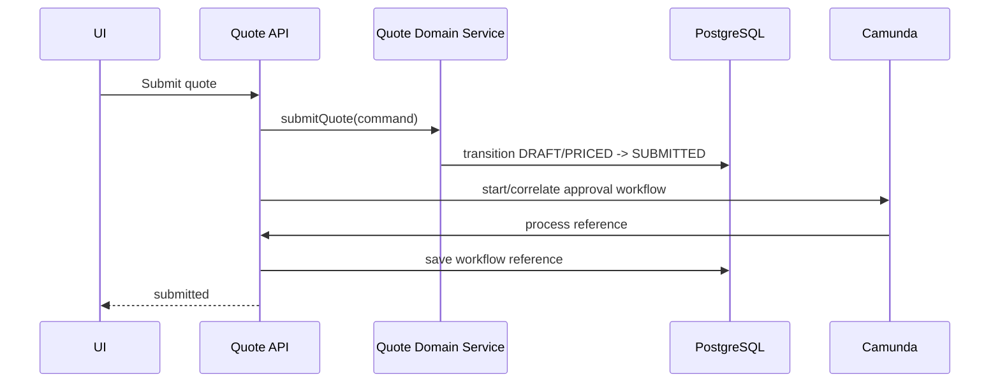
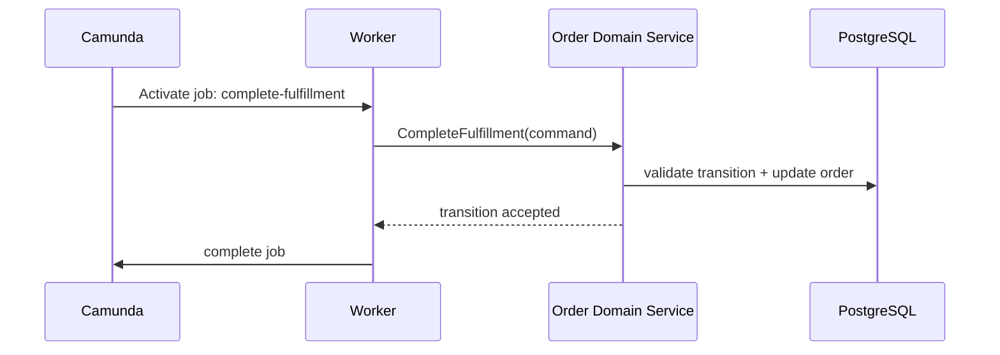
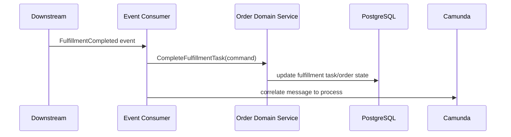

# Part 032 — Workflow and State Machine Integration

> Goal: integrate workflow and domain state machines without duplicating truth, allowing illegal transitions, or creating production states that nobody can explain.
>
> A workflow engine executes process state. A domain model protects business state. A senior engineer must know where one stops and the other begins.

---

## 1. Core mental model

In enterprise systems, several lifecycles exist at the same time.

For an order, you may have:

```text
Order entity state:
  CAPTURED -> VALIDATED -> IN_FULFILLMENT -> COMPLETED

Process instance state:
  active -> waiting at validation task -> waiting for callback -> completed

User task state:
  created -> assigned -> claimed -> completed

Worker job state:
  activated -> completed | failed | timed out

Downstream fulfillment state:
  accepted -> in_progress -> completed | rejected
```

These states are related, but they are not the same thing.

A common production failure is treating them as interchangeable.

Bad assumption:

> If the process is completed, the order must be completed.

Better assumption:

> Process completion should normally imply a domain state transition, but the system must be able to prove that transition happened durably and reconcile if it did not.

---

## 2. Why this integration matters

Workflow-state integration is where many production bugs hide.

Symptoms:

- order says `COMPLETED`, but process is still active;
- process says completed, but order remains `IN_FULFILLMENT`;
- user task is completed, but quote remains `PENDING_APPROVAL`;
- cancellation process completed, but downstream service still active;
- duplicate callback transitions entity twice;
- amendment updates order while old process path continues;
- incident is resolved but business state is still wrong;
- retry publishes event for a state that no longer applies.

These are not just Camunda bugs.

They are boundary bugs between process orchestration and domain state.

---

## 3. Definitions

### 3.1 Entity lifecycle

The lifecycle of a business entity stored in the domain database.

Examples:

```text
Quote.status
Order.status
FulfillmentTask.status
Approval.status
FalloutCase.status
```

Entity state must be protected by domain invariants and database transactions.

### 3.2 Process lifecycle

The lifecycle of a BPMN process instance.

Examples:

```text
process started
activity active
waiting at user task
waiting for message
incident created
completed
terminated
```

Process state is owned by the workflow engine.

### 3.3 Task lifecycle

The lifecycle of human or automated work.

Examples:

```text
User task:
  created -> assigned -> claimed -> completed/cancelled

Worker job:
  created -> activated -> completed/failed/timed out
```

Task state should not be confused with business completion.

A user completing an approval task is a decision event. It is not automatically the same as quote state being updated correctly.

### 3.4 External system lifecycle

The lifecycle maintained by downstream systems.

Examples:

```text
Fulfillment platform order status
Billing account status
Provisioning request status
Inventory reservation status
```

External state may diverge from internal state.

---

## 4. Source of truth principle

For every important fact, define exactly one source of truth.

Examples:

| Fact | Recommended source of truth |
|---|---|
| Current quote status | Quote domain database |
| Current order status | Order domain database |
| Current BPMN wait state | Camunda runtime/Operate/Cockpit |
| Current user task assignment | Camunda Tasklist/task service or task domain projection |
| Current fulfillment system status | Downstream fulfillment system, mirrored by integration table |
| Audit of domain transition | Domain transition/audit table |
| Audit of process path | Camunda history/exported process events |
| Correlation between order and process | Durable workflow reference table |

The process engine can be a source of truth for process execution state.

It should not silently become the only source of truth for domain status.

---

## 5. Process state vs entity state

### 5.1 Process state answers

```text
Where is the process instance currently waiting or executing?
What activity is active?
Is there an incident?
Which timer/message/user task/job is pending?
Which process version is running?
```

### 5.2 Entity state answers

```text
What is the business status of the quote/order?
Which transitions are legally allowed?
What was the previous status?
Who changed it?
What command caused it?
What version of the entity was modified?
```

### 5.3 Why separation matters

A process can be waiting at `Wait for Fulfillment Callback` while the order is `IN_FULFILLMENT`.

A process can have an incident while the order is still `VALIDATED`.

A user task can be active while quote state is `PENDING_APPROVAL`.

These are correlated states, not duplicates.

---

## 6. Quote lifecycle integration

Example quote states:

```text
DRAFT
PRICED
SUBMITTED
PENDING_APPROVAL
APPROVED
REJECTED
ACCEPTED
EXPIRED
CONVERTED_TO_ORDER
CANCELLED
```

### 6.1 Workflow involvement

Workflow may coordinate:

- submission validation;
- approval routing;
- approval SLA;
- rejection/rework;
- expiration timer;
- conversion to order.

### 6.2 Domain responsibility

Domain service must still enforce:

- cannot approve draft quote;
- cannot accept expired quote;
- cannot convert rejected quote;
- cannot approve stale quote version;
- cannot edit accepted quote without amendment rules;
- cannot bypass required approval.

### 6.3 Integration pattern



The domain transition and workflow start need a recovery strategy if one succeeds and the other fails.

---

## 7. Order lifecycle integration

Example order states:

```text
CAPTURED
VALIDATING
VALIDATION_FAILED
VALIDATED
DECOMPOSING
READY_FOR_FULFILLMENT
IN_FULFILLMENT
FALLOUT
CANCELLATION_REQUESTED
CANCELLED
COMPLETED
FAILED
```

### 7.1 Workflow involvement

Workflow may coordinate:

- validation;
- decomposition;
- fulfillment commands;
- callbacks;
- fallout handling;
- SLA timers;
- cancellation;
- amendment;
- reconciliation.

### 7.2 Domain responsibility

Domain service should enforce:

- cannot fulfill unvalidated order;
- cannot complete order with incomplete mandatory fulfillment tasks;
- cannot cancel after point of no return without special process;
- cannot apply amendment incompatible with current state;
- cannot transition from `COMPLETED` back to `IN_FULFILLMENT` by duplicate callback;
- cannot ignore version conflict.

---

## 8. State duplication risk

Duplication happens when the same concept is stored in multiple places.

Example:

```text
order.status = IN_FULFILLMENT
process variable orderStatus = VALIDATED
current BPMN activity = WaitForFulfillmentCallback
UI projection status = SUBMITTED
```

This may be normal if each field has a different semantic.

It is dangerous if all four are intended to mean the same thing.

### 8.1 Avoid vague status names

Bad:

```text
status = PROCESSING
```

Better:

```text
order.status = IN_FULFILLMENT
fulfillment_task.status = SUBMITTED_TO_DOWNSTREAM
process.activity = WAIT_FOR_FULFILLMENT_CALLBACK
```

### 8.2 Keep process variables as context, not truth

Process variable:

```json
{
  "orderId": "ORD-123",
  "fulfillmentPlanId": "FP-456",
  "requiresManualReview": true
}
```

Domain table:

```text
order.status = IN_FULFILLMENT
order.version = 12
```

The variable can route the process.

The domain table protects the business state.

---

## 9. State transition command pattern

State changes should happen through commands.

Examples:

```text
SubmitQuote
ApproveQuote
RejectQuote
AcceptQuote
CaptureOrder
ValidateOrder
StartFulfillment
CompleteFulfillmentTask
RequestCancellation
ApplyAmendment
ResolveFallout
CompleteOrder
```

Each command should define:

- command ID/idempotency key;
- actor/system;
- target entity;
- expected current state/version;
- requested transition;
- reason/comment;
- correlation ID;
- process instance reference if relevant.

### 9.1 Why commands matter

Commands make transitions auditable and idempotent.

They also create a clean boundary:

```text
Workflow requests transition.
Domain service accepts or rejects transition.
```

Workflow should not directly set `order.status` based only on BPMN path.

---

## 10. State transition event pattern

After a command succeeds, publish a domain event.

Examples:

```text
QuoteSubmitted
QuoteApproved
OrderCaptured
OrderValidated
FulfillmentStarted
FulfillmentCompleted
OrderCancelled
OrderCompleted
```

Events are facts about completed domain changes.

They can be consumed by:

- workflow process;
- read model/projection;
- notification service;
- reporting;
- integration service;
- reconciliation.

### 10.1 Avoid event-command confusion

Command:

```text
Please approve this quote.
```

Event:

```text
This quote was approved.
```

A workflow step may send a command.

A domain service publishes an event after durable transition.

---

## 11. Illegal transition handling

Illegal transitions are normal under concurrency and stale messages.

Examples:

- approve quote after it expired;
- complete fulfillment after order cancelled;
- apply amendment after completion;
- retry validation after order already cancelled;
- process old callback after new version created.

### 11.1 Domain must reject illegal transitions

Pseudo-code:

```java
if (!allowedTransitions.contains(currentStatus, command.targetStatus())) {
    throw new IllegalStateTransitionException(currentStatus, command.targetStatus());
}
```

Workflow should handle the outcome:

- BPMN business error;
- incident;
- fallout task;
- ignore duplicate/late event;
- reconciliation.

### 11.2 Do not hide illegal transition

Bad:

```text
if status already completed, return success without audit.
```

Better:

```text
if duplicate command with same idempotency key, return previous result.
if conflicting command, reject and record reason.
```

---

## 12. Concurrency model

Workflow and entity transitions can race.

### 12.1 Common races

| Race | Example |
|---|---|
| Approval vs edit | User edits quote while approver approves old version |
| Fulfillment callback vs cancellation | Downstream completes while user cancels |
| Amendment vs fulfillment | Amendment changes product while fulfillment submits old plan |
| Retry vs manual repair | Worker retry runs after operator repaired fallout |
| Duplicate message vs state transition | Same callback arrives twice |
| Process migration vs active task | Model changes while task is pending |

### 12.2 Controls

Use:

- optimistic locking;
- entity version check;
- command idempotency key;
- unique constraints;
- process correlation key;
- state transition table;
- pessimistic lock only when necessary;
- explicit late-event policy;
- safe retry semantics.

### 12.3 Optimistic locking example

```sql
UPDATE orders
SET status = 'COMPLETED', version = version + 1
WHERE order_id = :orderId
  AND status = 'IN_FULFILLMENT'
  AND version = :expectedVersion;
```

If zero rows are updated, the command did not apply. The worker must not blindly complete the workflow job as if business completion happened.

---

## 13. Workflow-driven transition pattern

In this pattern, the process orchestrates and requests domain transitions.



### 13.1 Rule

Complete the workflow job only after the domain transition succeeds or after a known idempotent previous success is confirmed.

---

## 14. Event-driven transition pattern

In this pattern, domain events drive workflow progress.



### 14.1 Edge case

If domain update succeeds but message correlation fails, reconciliation must retry correlation.

If message correlation succeeds but domain update fails, the process may move forward incorrectly.

Therefore, prefer domain transition before process correlation, plus reconciliation for failed correlation.

---

## 15. Process-first vs domain-first sequencing

### 15.1 Process-first

```text
Start/correlate process first, then update domain state.
```

Risk:

- process moves but domain state does not;
- process creates jobs based on missing data;
- rollback is hard if engine command committed.

### 15.2 Domain-first

```text
Update domain state first, then start/correlate process.
```

Risk:

- domain state changes but workflow does not start/progress;
- requires reconciliation to recover.

### 15.3 Preferred posture

For business state, domain-first is often safer because domain state remains authoritative.

But it must include:

- workflow reference table;
- outbox/retry mechanism;
- reconciliation;
- idempotent process start/correlation.

---

## 16. Workflow reference table

A workflow reference table helps connect business entity and process instance.

Example:

```sql
CREATE TABLE order_workflow_ref (
  order_id TEXT NOT NULL,
  workflow_name TEXT NOT NULL,
  process_definition_key TEXT NOT NULL,
  process_definition_version INT,
  process_instance_key TEXT NOT NULL,
  business_key TEXT NOT NULL,
  status TEXT NOT NULL,
  started_at TIMESTAMP NOT NULL,
  completed_at TIMESTAMP NULL,
  PRIMARY KEY (order_id, workflow_name)
);
```

Useful for:

- API status lookup;
- debugging;
- reconciliation;
- process migration assessment;
- operational reporting;
- manual repair.

---

## 17. State transition table

A state transition table helps audit entity changes.

Example:

```sql
CREATE TABLE order_state_transition (
  transition_id TEXT PRIMARY KEY,
  order_id TEXT NOT NULL,
  from_status TEXT NOT NULL,
  to_status TEXT NOT NULL,
  command_id TEXT NOT NULL,
  actor_type TEXT NOT NULL,
  actor_id TEXT NOT NULL,
  process_instance_key TEXT NULL,
  correlation_id TEXT NOT NULL,
  reason TEXT NULL,
  created_at TIMESTAMP NOT NULL
);

CREATE UNIQUE INDEX uq_order_transition_command
ON order_state_transition(command_id);
```

This supports:

- idempotency;
- audit;
- debugging;
- compliance;
- root cause analysis;
- reconstruction of business lifecycle.

---

## 18. Process variable design for state integration

Good variables:

```json
{
  "orderId": "ORD-123",
  "orderVersion": 17,
  "fulfillmentPlanId": "FP-456",
  "correlationKey": "ORD-123",
  "currentPhase": "FULFILLMENT"
}
```

Risky variables:

```json
{
  "entireOrder": { "...": "large object" },
  "customerPii": "...",
  "statusCopy": "COMPLETED",
  "pricingDetails": { "...": "sensitive" }
}
```

### 18.1 Variable rule

Use variables to route and correlate.

Use domain tables to decide and prove business state.

---

## 19. Camunda 7 implications

Camunda 7 can run inside Java applications or be shared/container-managed.

State integration concerns:

- Java delegate may participate in application transaction depending on setup;
- async boundaries affect commit timing;
- job executor retries may rerun delegate logic;
- external task workers are decoupled and require idempotency;
- process variables may be serialized into Camunda database;
- Cockpit/history shows process state but not necessarily domain truth.

### 19.1 Review questions

- Does delegate update order state and call external API in one transaction boundary?
- Is `asyncBefore` used before risky side effect?
- Are process variables duplicating order state?
- Are domain transitions idempotent?
- Are business key and process instance ID persisted in domain DB?
- Are failed jobs mapped to business fallout or technical incidents correctly?

---

## 20. Camunda 8/Zeebe implications

Camunda 8 job workers are remote from the engine.

State integration concerns:

- job may be activated again after timeout;
- worker may complete domain update but fail before job completion;
- worker may complete job but later discover downstream effect failed;
- variables are merged into process instance on completion;
- message correlation is separate from domain transaction;
- process instance key must be stored for traceability;
- Operate shows process state, but domain DB shows business state.

### 20.1 Review questions

- Is each job worker idempotent?
- Does worker complete job only after durable domain result?
- Does worker use command ID/job key/business key correctly?
- Is domain state transition protected by expected status/version?
- Is message correlation retried safely?
- Are process variables updated only with safe routing data?

---

## 21. Human task state integration

Human task completion must be treated as a business command.

Bad:

```text
complete Camunda task -> then maybe update quote/order status
```

Better:

```text
validate task ownership
validate entity version/state
execute domain command
persist audit
complete Camunda task
```

But this has a failure edge:

```text
domain command succeeds
Camunda task completion fails
```

You need recovery:

- retry task completion;
- reconciliation job;
- idempotent decision command;
- task/domain mismatch dashboard.

### 21.1 Stale task example

A quote approval task is created for quote version 3.

Sales edits quote to version 4.

Approver completes old task.

Correct behavior:

- reject as stale;
- ask for reapproval;
- record attempted stale decision;
- do not approve quote version 4.

---

## 22. Task state vs entity state

A task being completed only proves the task was completed.

It does not necessarily prove the business entity transitioned successfully.

Example:

```text
User task: Approval task completed
Decision: APPROVE
Domain transition: PENDING_APPROVAL -> APPROVED
```

All three should be auditable.

If the task completion succeeded but domain transition failed, the system is inconsistent.

Therefore, choose sequencing and reconciliation carefully.

---

## 23. Worker job state vs entity state

A worker job completion means the worker told the engine the task is done.

It does not automatically mean the external business effect is correct.

Example:

```text
Worker completes job after sending fulfillment command.
Downstream later rejects command.
```

The process should not mark order completed at command-send time.

It should wait for confirmed outcome or explicitly model the risk.

---

## 24. External system state integration

External systems may have their own lifecycle.

Example:

```text
Internal fulfillment task: SUBMITTED
Downstream order: ACCEPTED
Downstream order: IN_PROGRESS
Downstream order: COMPLETED
```

The internal domain should maintain a durable mirror/projection if needed.

Do not rely solely on process variables for downstream status.

### 24.1 Callback handling

When callback arrives:

1. Validate correlation key.
2. Deduplicate event.
3. Load fulfillment task/order.
4. Validate transition.
5. Persist downstream state.
6. Publish domain event if needed.
7. Correlate workflow message.
8. Record audit.

---

## 25. Reconciliation between entity and process

Reconciliation compares states and decides repair action.

### 25.1 Reconciliation query examples

```text
Orders IN_FULFILLMENT but no active process
Active processes waiting for callback but order COMPLETED
User tasks open for quote versions no longer current
Incidents for orders already cancelled
Fulfillment tasks completed externally but process still waiting
Process completed but order not in terminal state
```

### 25.2 Reconciliation actions

- correlate missing message;
- update missing workflow reference;
- create fallout case;
- retry worker command;
- mark stale task obsolete;
- start missing process;
- complete repair task;
- escalate to manual review.

### 25.3 Reconciliation safety

Reconciliation must be idempotent and audited.

It should never silently overwrite state because a dashboard says something looks wrong.

---

## 26. Terminal state alignment

Define terminal states clearly.

### 26.1 Entity terminal states

Examples:

```text
Quote: ACCEPTED, EXPIRED, REJECTED, CANCELLED, CONVERTED_TO_ORDER
Order: COMPLETED, CANCELLED, FAILED
FulfillmentTask: COMPLETED, CANCELLED, FAILED, COMPENSATED
```

### 26.2 Process terminal states

Examples:

```text
completed
terminated
cancelled by event subprocess
failed with unresolved incident
migrated/drained
```

### 26.3 Alignment policy

For each process terminal state, define expected entity terminal state.

Example:

| Process end | Expected order state |
|---|---|
| Fulfillment completed end | COMPLETED |
| Cancellation completed end | CANCELLED |
| Unrecoverable fallout end | FAILED or FALLOUT_CLOSED |
| Terminate due to duplicate process | unchanged or SUPERSEDED |

---

## 27. Versioning impact

Entity state machines and BPMN versions evolve independently.

Risks:

- new BPMN expects state that old entity model does not have;
- new domain transition rejects old process path;
- old running process sends command no longer supported;
- new worker behavior breaks old process variable contract;
- new UI allows task action incompatible with old process version.

### 27.1 Compatibility discipline

Maintain compatibility across:

- process version;
- worker version;
- API contract;
- domain state transition rules;
- database schema;
- event schema;
- task form schema;
- variable schema.

---

## 28. State/process consistency patterns

### 28.1 Strong local consistency

Use one database transaction for domain state and workflow reference when possible.

Applicable when workflow command can be made after commit/retried.

### 28.2 Eventual consistency with outbox

```text
Domain transaction writes state + outbox event.
Outbox publisher starts/correlates workflow.
Reconciliation repairs missing workflow progression.
```

### 28.3 Process command idempotency

Process start/correlation must be idempotent by business key or command ID.

### 28.4 State projection

Expose user-facing status from a read model that combines:

- entity state;
- process state;
- task state;
- external fulfillment state;
- incident/fallout state.

But the read model must not become the write authority.

---

## 29. Status projection for API/UI

A customer or operator rarely wants raw process state.

They want meaningful status.

Example projection:

```json
{
  "orderId": "ORD-123",
  "businessStatus": "IN_FULFILLMENT",
  "processPhase": "WAITING_FOR_FULFILLMENT_CALLBACK",
  "customerVisibleStatus": "Processing",
  "operatorStatus": "Waiting for downstream fulfillment confirmation",
  "slaDueAt": "2026-07-12T10:00:00Z",
  "hasIncident": false,
  "hasFallout": false
}
```

### 29.1 Projection rule

Separate:

- customer-visible status;
- operator/debugging status;
- raw process state;
- raw domain state.

Do not expose confusing engine internals to customers.

---

## 30. Failure modes

| Failure mode | Symptom | Detection | Repair |
|---|---|---|---|
| Process missing | Order exists but no process reference | Reconciliation query | Start process idempotently |
| Domain state stale | Process moved but order status unchanged | State/process mismatch dashboard | Replay transition or manual review |
| Duplicate transition | Same callback processed twice | Unique event/command key violation | Return previous result |
| Illegal transition | Worker tries invalid status change | Domain exception/log/metric | BPMN error/fallout/reconciliation |
| Stale human task | Task completes for old entity version | Version check failure | Reject task completion and recreate if needed |
| Late message | Callback after cancellation | Late event policy metric | Ignore, compensate, or fallout |
| Process completed too early | Order still waiting downstream | Terminal state alignment check | Incident/manual repair |
| Process stuck | Active wait state with no progress | Aging dashboard | Retry, correlate, or fallout |
| Incident resolved incorrectly | Engine incident gone but domain still wrong | Post-resolution reconciliation | Repair domain/process state |

---

## 31. Debugging checklist

When state and process disagree:

1. Identify business entity ID.
2. Load current entity state and version.
3. Load state transition history.
4. Load workflow reference.
5. Find active/completed process instance.
6. Identify process version and current activity.
7. Inspect incidents/jobs/tasks/messages.
8. Inspect worker logs by correlation ID.
9. Inspect external system status.
10. Inspect Kafka/RabbitMQ events and dedup records.
11. Check recent amendments/cancellations.
12. Determine which state is authoritative for the disputed fact.
13. Decide repair through command, not raw DB mutation.
14. Record repair audit.

---

## 32. Security/privacy implications

State integration often increases data exposure.

Risks:

- process variables duplicate sensitive domain data;
- workflow dashboard exposes customer/order status to unauthorized users;
- task form exposes pricing or contract data;
- audit log lacks actor identity;
- worker service account can transition states without proper authorization boundary;
- repair tool can mutate domain/process state without approval.

Controls:

- minimize variables;
- use references instead of payloads;
- enforce task authorization;
- restrict dashboard access;
- audit all state transitions;
- require approval for manual repair;
- redact logs/incidents;
- separate customer-visible and internal statuses.

---

## 33. Performance implications

State integration can create excessive writes and queries.

Watch:

- process variable updates for every state change;
- state transition audit volume;
- dashboard joins across process/domain tables;
- reconciliation scans;
- worker polling and DB updates;
- Kafka/RabbitMQ event duplication;
- history retention;
- high-cardinality metrics.

Design for:

- indexed business key;
- indexed process instance key;
- indexed order/quote status;
- bounded reconciliation windows;
- partitionable audit tables;
- efficient operator queries;
- retention/archival strategy.

---

## 34. Internal verification checklist

Verify in the actual CSG/team context:

- What are the official quote states?
- What are the official order states?
- Where are state transitions implemented?
- Is there a formal state machine library, custom transition logic, or ad hoc status update?
- Which status fields are authoritative?
- Which process variables duplicate status?
- Is process instance ID/key stored on quote/order tables?
- Is business key/correlation key consistent?
- Is there a state transition audit table?
- Are transitions idempotent?
- Are illegal transitions rejected?
- Are entity versions used for optimistic locking?
- How are human task completions mapped to domain transitions?
- How are worker completions mapped to domain transitions?
- How are external callbacks mapped to domain transitions?
- How are amendment/cancellation races handled?
- What reconciliation checks exist?
- Which dashboard shows state/process mismatch?
- What runbook repairs mismatch?
- Who approves manual repair?

---

## 35. PR review checklist

Ask these questions before approving changes:

1. What entity state changes?
2. What process state changes?
3. Are they intentionally different or accidentally duplicated?
4. What is the source of truth for each state?
5. What command causes the transition?
6. Is the command idempotent?
7. Is there an expected current state/version check?
8. What happens if the transition is illegal?
9. What happens if workflow update succeeds but domain update fails?
10. What happens if domain update succeeds but workflow update fails?
11. What happens on duplicate callback/event?
12. What happens on late callback/event?
13. What happens on concurrent amendment/cancellation?
14. Are process variables minimal and non-sensitive?
15. Is transition audit preserved?
16. Is API/UI status projection clear?
17. Is reconciliation updated?
18. Are dashboards/alerts updated?
19. Are running process versions compatible?
20. Is manual repair path safe and audited?

---

## 36. Practical state/process design template

```text
Business entity:
Authoritative state field:
Allowed states:
Allowed transitions:
Transition command list:
Transition event list:
State transition table:
Idempotency key:
Optimistic locking field:
Workflow process key:
Workflow reference field/table:
Business key:
Correlation key:
Process variables:
Human task mapping:
Worker job mapping:
External callback mapping:
Cancellation policy:
Amendment policy:
Late event policy:
Duplicate event policy:
Reconciliation query:
Repair command:
Dashboard:
Runbook:
Security/privacy concern:
Version compatibility concern:
```

If this template is unclear, the workflow-state integration is not ready for production.

---

## 37. Key takeaways

- Workflow state, entity state, task state, job state, and external state are related but not identical.
- Define one source of truth for each important fact.
- Domain services must enforce legal business transitions.
- Workflow should orchestrate transitions, not silently bypass domain invariants.
- Human task completion is a business command, not just a UI event.
- Worker job completion is not proof of external business completion unless the durable state says so.
- Duplicate, late, and out-of-order events are normal in distributed workflow systems.
- Reconciliation is the safety net between process engine, domain database, message systems, and external platforms.
- Status projection must separate customer-visible, operator-visible, domain, and process states.
- Senior review should focus on source of truth, concurrency, idempotency, illegal transitions, reconciliation, and repair.

---

## 38. References for further study

- Camunda 8 Processes: https://docs.camunda.io/docs/components/concepts/processes/
- Camunda 8 Process Instance Creation: https://docs.camunda.io/docs/components/concepts/process-instance-creation/
- Camunda 8 Job Workers: https://docs.camunda.io/docs/components/concepts/job-workers/
- Camunda 8 Messages: https://docs.camunda.io/docs/components/concepts/messages/
- Camunda 8 User Tasks: https://docs.camunda.io/docs/components/modeler/bpmn/user-tasks/
- Camunda 8 Writing Good Workers: https://docs.camunda.io/docs/components/best-practices/development/writing-good-workers/
