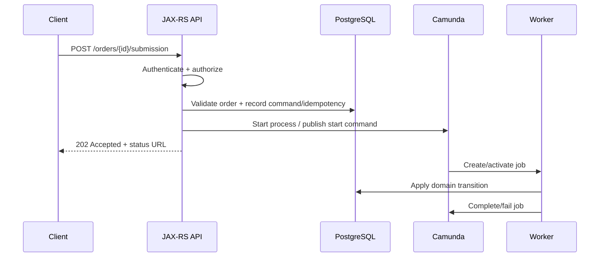
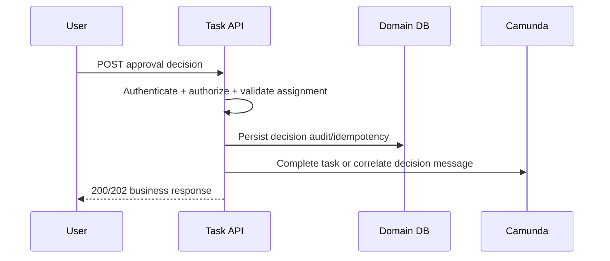
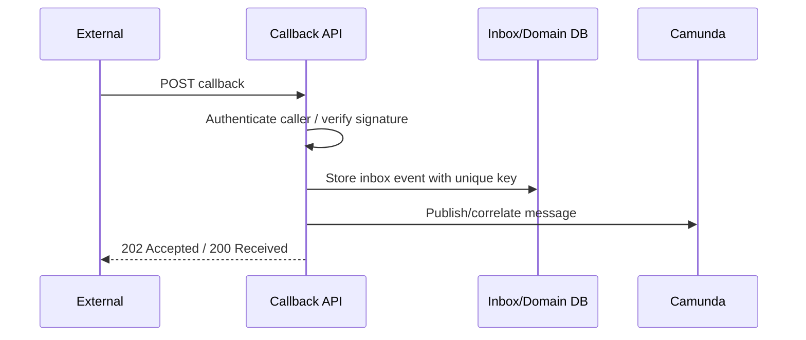

# Part 033 — Workflow and REST/JAX-RS API Integration

> Goal: design REST/JAX-RS APIs around workflow orchestration without pretending that long-running business processes are synchronous CRUD operations.
>
> A workflow API is not just an endpoint that starts Camunda. It is a contract between clients, domain state, process state, authorization, observability, and operational repair.

---

## 1. Core mental model

A REST API should expose a business command, not the workflow engine's internal mechanics.

Bad API mental model:

```text
POST /camunda/process-definition/order-approval/start
POST /camunda/task/{taskId}/complete
POST /camunda/message/order-completed/correlate
```

Better API mental model:

```text
POST /orders/{orderId}/submission
POST /quotes/{quoteId}/approval-decisions
POST /orders/{orderId}/fulfillment-callbacks
GET  /orders/{orderId}/workflow-status
```

The API should speak in domain language.

Camunda should remain an orchestration implementation behind the service boundary.

A client should normally not need to know:

- Camunda process definition key;
- process instance key;
- task ID;
- activity ID;
- job key;
- worker type;
- internal retry count;
- Operate/Cockpit URL;
- BPMN element ID;
- process variable names.

Those are implementation and diagnostic details.

The API contract should expose stable business concepts:

- quote ID;
- order ID;
- customer/account ID;
- approval decision;
- requested action;
- callback reference;
- workflow status;
- accepted/failed/rejected result;
- correlation ID;
- idempotency key;
- user/action authorization.

---

## 2. Why REST-workflow integration is dangerous

A normal CRUD API usually returns after one database transaction.

A workflow API often starts a chain like this:

```text
HTTP request
  -> validate command
  -> create/update business record
  -> start or correlate process
  -> process creates job
  -> worker calls DB/external system
  -> process waits for message/timer/user task
  -> another API completes task or correlates callback
  -> workflow eventually reaches end event
```

That chain can last seconds, minutes, days, or months.

So the API must not imply more certainty than the system can actually provide.

Bad response:

```http
HTTP/1.1 200 OK

{
  "status": "ORDER_COMPLETED"
}
```

when the process merely started.

Better response:

```http
HTTP/1.1 202 Accepted
Location: /orders/ORD-1001/workflow-status

{
  "orderId": "ORD-1001",
  "workflowStatus": "ACCEPTED",
  "businessStatus": "SUBMISSION_RECEIVED",
  "correlationId": "corr-93f6",
  "statusUrl": "/orders/ORD-1001/workflow-status"
}
```

The API must distinguish:

- command accepted;
- workflow started;
- workflow completed;
- business entity transitioned;
- manual task pending;
- process waiting for callback;
- process in incident;
- command rejected due to business rule;
- command rejected due to duplicate/idempotency conflict.

---

## 3. REST operations around workflow

A workflow-aware backend usually exposes four categories of APIs.

### 3.1 Start process via API

Used when an external client or internal service asks the domain service to begin a business process.

Examples:

```http
POST /quotes/{quoteId}/submit-for-approval
POST /orders/{orderId}/submit
POST /orders/{orderId}/cancellations
POST /orders/{orderId}/amendments
```

The API should usually perform:

```text
1. authenticate caller
2. authorize command
3. validate domain preconditions
4. enforce idempotency
5. persist command acceptance/domain state
6. start process or publish outbox event to start process
7. return 202 Accepted with traceable status
```

### 3.2 Complete human task via API

Used when a user performs a workflow action.

Examples:

```http
POST /quotes/{quoteId}/approval-decisions
POST /fallout-cases/{caseId}/resolution
POST /orders/{orderId}/manual-validation-result
```

The API should normally not say "complete task" to business clients.

It should expose the business action and internally map it to a user task completion or message correlation.

### 3.3 Correlate message via API

Used when a callback, event, or external response arrives.

Examples:

```http
POST /orders/{orderId}/fulfillment-callbacks
POST /payments/{paymentId}/authorization-callbacks
POST /inventory/{reservationId}/reservation-results
```

The API should map callback metadata to:

```text
message name + correlation key + payload + idempotency/message ID
```

### 3.4 Query process status via API

Used by clients or UIs to inspect progress.

Examples:

```http
GET /orders/{orderId}/workflow-status
GET /quotes/{quoteId}/approval-status
GET /fallout-cases/{caseId}
```

The API should usually return a domain-specific projection, not raw engine state.

---

## 4. Camunda 7 vs Camunda 8 API integration mindset

### 4.1 Camunda 7

Camunda 7 can be embedded inside a Java application or accessed remotely through its REST API.

Common Java-side patterns:

```java
runtimeService.startProcessInstanceByKey(
    "order_submission",
    orderId,
    variables
);
```

```java
taskService.complete(taskId, variables);
```

```java
runtimeService.createMessageCorrelation("FulfillmentCompleted")
    .processInstanceBusinessKey(orderId)
    .setVariables(variables)
    .correlate();
```

Key implication:

> In Camunda 7 embedded mode, your JAX-RS endpoint and process engine can participate in the same Java application runtime, but that does not automatically make the whole business process a single safe transaction.

If the endpoint starts a process and a Java delegate performs side effects in the same transaction boundary, you must understand exactly when commit, rollback, async continuation, and job executor behavior occur.

### 4.2 Camunda 8 / Zeebe

Camunda 8 is typically a remote orchestration engine. A JAX-RS service sends commands to the orchestration cluster and workers later activate jobs.

Common operations:

```text
Create process instance
Publish/correlate message
Activate/complete/fail job from worker
Query status through projection, Operate API, or application database
```

Key implication:

> In Camunda 8, your API service and Zeebe do not share one local database transaction. You must design for command acceptance, idempotency, eventual consistency, and observable status.

---

## 5. Long-running workflow API contract

A long-running workflow API should make the lifecycle explicit.

### 5.1 Command accepted is not process completed

Use `202 Accepted` when the command has been accepted but the process continues asynchronously.

Example:

```http
POST /orders/ORD-1001/submission
Idempotency-Key: idem-8a31
X-Correlation-ID: corr-2026-001
```

Response:

```http
HTTP/1.1 202 Accepted
Location: /orders/ORD-1001/workflow-status
```

```json
{
  "orderId": "ORD-1001",
  "commandId": "cmd-7219",
  "workflowStatus": "ACCEPTED",
  "businessStatus": "SUBMISSION_RECEIVED",
  "correlationId": "corr-2026-001",
  "statusUrl": "/orders/ORD-1001/workflow-status"
}
```

### 5.2 Synchronous result is exceptional

Only use synchronous result for short-running processes with no durable side effects or where retry semantics are explicitly safe.

Dangerous pattern:

```text
HTTP client waits until workflow finishes
  -> workflow calls external API
  -> external API is slow
  -> client timeout
  -> client retries
  -> duplicate process instance starts
```

Camunda 8 provides commands for asynchronous creation and creation with result. The synchronous/result style is useful for short-running processes, but if the process mutates system state, the client and service must be designed for failure and retries. Re-sending a create command can create a new process instance if idempotency is not handled by the application contract.

---

## 6. API lifecycle patterns

### 6.1 Start process lifecycle



Important invariant:

> The API response should represent what is durable at response time.

If the order row is updated but Camunda start fails, the API must not claim the workflow started.

If Camunda starts but the DB update fails, the API must not claim the domain command was accepted unless reconciliation exists.

This is why many production systems prefer an outbox pattern for the boundary between HTTP/DB and process start.

### 6.2 Complete human task lifecycle



Important invariant:

> Completing a user task is a business action and must be authorized by business policy, not only by possession of a task ID.

### 6.3 Callback/message correlation lifecycle



Important invariant:

> Callback receipt and workflow correlation should be idempotent. Duplicate callbacks should not advance the process twice.

---

## 7. Business key, business ID, correlation ID, idempotency key

These identifiers are often confused.

| Identifier | Purpose | Example | Owner |
|---|---|---:|---|
| Business key / business ID | Link process instance to domain entity | `ORD-1001` | Domain/service |
| Correlation key | Route message to waiting process subscription | `fulfillment-request-abc` | Integration contract |
| Correlation ID / trace ID | Trace request across services/logs | `corr-2026-001` | Platform/API gateway/service |
| Idempotency key | Deduplicate client command | `idem-8a31` | Client/API contract |
| Command ID | Durable domain command identity | `cmd-7219` | Application service |
| Message ID | Deduplicate message publication/callback | `msg-42` | Producer/inbox |
| Process instance key | Engine runtime identifier | `225179...` | Camunda |

Rule:

> Do not overload one ID to mean everything.

A single `orderId` may be a business ID, but it is not always enough as a message correlation key if the same order can have multiple concurrent interactions.

Example:

```text
Order ORD-1001 has two concurrent waits:
  - payment authorization callback
  - inventory reservation callback
```

Using only `ORD-1001` as the correlation key can be ambiguous.

Better:

```text
payment correlation key   = paymentRequestId
inventory correlation key = reservationRequestId
business ID               = orderId
trace correlation ID      = HTTP/request trace ID
```

---

## 8. Start process via API

### 8.1 API design

Example:

```http
POST /orders/{orderId}/submission
Content-Type: application/json
Idempotency-Key: idem-1001-submit
X-Correlation-ID: corr-1001
```

```json
{
  "requestedBy": "user-123",
  "channel": "sales-portal",
  "submissionReason": "CUSTOMER_CONFIRMED",
  "expectedVersion": 17
}
```

Response:

```json
{
  "orderId": "ORD-1001",
  "commandId": "cmd-1001-submit",
  "businessStatus": "SUBMISSION_RECEIVED",
  "workflowStatus": "START_REQUESTED",
  "statusUrl": "/orders/ORD-1001/workflow-status"
}
```

### 8.2 Validation before start

Before starting a process, validate:

- entity exists;
- caller can act on entity;
- entity is in a valid state;
- command is not stale;
- idempotency key is not reused with a different payload;
- no conflicting active process exists;
- process version choice is intentional;
- required variables are present;
- sensitive data is not sent as process variable;
- downstream systems are not in known disabled state, if the command depends on them.

### 8.3 Process version choice

Avoid implicit ambiguity.

Options:

```text
start latest process version
start specific process version
start version selected by feature flag/config
start process through deployment-aware routing
```

For customer-impacting workflows, starting `latest` blindly can be risky during rolling deployments.

Use explicit versioning when:

- workflow changes are not backward-compatible;
- old and new workers run simultaneously;
- variable schema changed;
- message names/correlation keys changed;
- external callbacks can arrive late;
- regulatory/audit behavior differs by version.

### 8.4 Start-process failure modes

| Failure | Symptom | Consequence | Design response |
|---|---|---|---|
| DB accepted command, process start failed | Command exists but no process instance | Stuck submission | Outbox or retry starter |
| Process started, DB command not recorded | Process runs with no audit row | Audit gap | Start after durable command or reconcile |
| Client retries after timeout | Duplicate process instance | Double approval/order action | Idempotency key + active process uniqueness |
| Wrong process version | Unexpected path | Business defect | Version routing and deployment controls |
| Missing required variable | Incident / failed start | Process does not execute | Contract validation |
| Large variable payload | Latency/storage pressure | Engine performance issue | Store in DB, pass reference |

---

## 9. Complete task via API

### 9.1 Do not expose raw task completion casually

Dangerous:

```http
POST /tasks/{taskId}/complete
```

This endpoint is technically convenient but weak as a business contract.

Problems:

- caller may complete a task they should not see;
- task ID may leak implementation detail;
- payload may not match expected decision schema;
- stale UI may complete an obsolete task;
- task may no longer belong to the quote/order state;
- audit may only say "task completed", not "approval rejected by X because Y".

Better:

```http
POST /quotes/{quoteId}/approval-decisions
```

```json
{
  "decision": "APPROVED",
  "reasonCode": "MARGIN_EXCEPTION_ACCEPTED",
  "comment": "Approved by sales manager after exception review.",
  "expectedTaskVersion": 5
}
```

### 9.2 Authorization model

Task completion must check:

- user identity;
- group/role membership;
- candidate group;
- assignee/claim state;
- tenant/customer boundary;
- quote/order visibility;
- delegation rules;
- maker-checker rules;
- task due/escalation state;
- domain state compatibility.

Do not trust a Camunda task query alone as the full authorization model.

### 9.3 Task completion failure modes

| Failure | Example | Prevention |
|---|---|---|
| Duplicate completion | User double-clicks approve | Idempotency key or decision unique constraint |
| Stale task UI | Task already escalated/cancelled | expected task version / current task validation |
| Unauthorized completion | User guesses task ID | domain authorization + task visibility check |
| Task completed but DB audit failed | No decision record | persist decision first or transactional boundary design |
| DB audit committed but task completion failed | Decision recorded but process stuck | outbox/manual repair/retry completion |
| Variables overwrite process context | Completion sends full UI form | explicit output mapping / minimal variables |

---

## 10. Correlate message via API

### 10.1 Message correlation is not a generic update

A message should represent something that happened outside the process.

Examples:

```text
FulfillmentAccepted
FulfillmentRejected
PaymentAuthorized
PaymentAuthorizationFailed
InventoryReserved
InventoryReservationExpired
CustomerSignedContract
```

Bad message:

```text
UpdateOrder
ContinueProcess
NextStep
Callback
```

Good message names tell you the business event.

### 10.2 Correlation contract

A callback API should define:

- authenticated source;
- message name;
- correlation key field;
- message ID/idempotency key;
- payload schema;
- TTL/buffering expectation;
- duplicate policy;
- late-arrival policy;
- failure response semantics;
- replay behavior;
- audit storage.

Camunda 8 message correlation is based on subscriptions containing a message name and correlation key. A message is not sent directly to a process instance. If the process instance has not opened the relevant subscription, behavior depends on publication/correlation mode and TTL.

### 10.3 Callback response semantics

Do not always return `500` when a message cannot be correlated.

Possible cases:

| Case | Suggested response | Meaning |
|---|---:|---|
| Duplicate callback already processed | `200 OK` | Idempotent success |
| Callback accepted for async correlation | `202 Accepted` | Stored for processing |
| Unknown external reference | `404` or `202` | Depends on security/leakage policy |
| Invalid payload/signature | `400`/`401`/`403` | Reject |
| Message too late but known | `200` with ignored status or `409` | Business policy |
| Correlation temporarily unavailable | `202` if stored, `503` if not stored | Retry policy |

If you cannot durably store the callback, returning success is dangerous.

### 10.4 Message correlation failure modes

| Failure | Root cause | Debug question |
|---|---|---|
| Message not correlated | No open subscription | Has process reached catch event? |
| Wrong instance receives message | Non-unique correlation key | Are multiple instances waiting on same key? |
| Duplicate message advances twice | No message ID/inbox dedupe | Is callback idempotent? |
| Late message ignored | Process left scope | Is late-arrival policy defined? |
| Message discarded | TTL zero and no subscription | Should buffering be enabled? |
| Correlated to new start instead of existing wait | Message start/catch ambiguity | Are message names separated? |

---

## 11. Query process status via API

### 11.1 Do not expose raw engine state to normal clients

A customer or business UI does not need this:

```json
{
  "processInstanceKey": "2251799813686019",
  "elementId": "Activity_1d9xq2p",
  "jobKey": "2251799813687001"
}
```

It needs this:

```json
{
  "orderId": "ORD-1001",
  "businessStatus": "IN_FULFILLMENT",
  "workflowPhase": "WAITING_FOR_FULFILLMENT_CALLBACK",
  "pendingHumanAction": false,
  "blocked": false,
  "lastUpdatedAt": "2026-07-11T08:15:00Z",
  "nextExpectedEvent": "FULFILLMENT_COMPLETED_OR_REJECTED"
}
```

### 11.2 Status projection sources

Possible sources:

| Source | Strength | Risk |
|---|---|---|
| Domain DB status projection | Stable API, business-friendly | May lag engine unless updated correctly |
| Engine query | Accurate runtime state | Leaks implementation and may be expensive |
| Operate/Cockpit | Good for operators | Not ideal as customer-facing API |
| Event-sourced projection | Audit-friendly | More infrastructure complexity |
| Cache | Fast | Staleness and invalidation risk |

For enterprise APIs, a domain status projection is usually better than raw workflow queries.

### 11.3 Status state vocabulary

Define a stable external vocabulary.

Example:

```text
NOT_STARTED
START_REQUESTED
RUNNING
WAITING_FOR_USER
WAITING_FOR_EXTERNAL_SYSTEM
BLOCKED_BY_INCIDENT
COMPLETED
CANCELLED
FAILED_REQUIRES_REPAIR
```

Do not expose every BPMN activity ID as a public status.

Public status should change only when meaningful to clients.

---

## 12. Polling, callback, SSE, and WebSocket

### 12.1 Polling

Simple and reliable.

```http
GET /orders/{orderId}/workflow-status
```

Use when:

- process duration is uncertain;
- UI can tolerate periodic refresh;
- infrastructure is simple;
- status endpoint is cheap.

Risks:

- high polling load;
- stale UI;
- clients polling too aggressively;
- no push notification for urgent human task.

### 12.2 Callback

Use when another system must be notified.

```text
workflow completes step -> worker publishes domain event -> subscriber/callback notified
```

Risks:

- callback delivery retry;
- receiver outage;
- security/signature;
- duplicate notification;
- event ordering.

### 12.3 SSE/WebSocket

Useful for internal operational UI or task UI.

Risks:

- connection lifecycle;
- auth refresh;
- replay after disconnect;
- scaling across pods;
- event fan-out;
- consistency with persisted state.

Do not use WebSocket as the source of truth.

Use it as a notification channel on top of a durable status source.

---

## 13. Error response mapping

A workflow API must map failures carefully.

| Condition | HTTP status | Notes |
|---|---:|---|
| Invalid JSON/schema | `400 Bad Request` | Request is malformed |
| Auth missing/invalid | `401 Unauthorized` | Authentication failure |
| Caller cannot act | `403 Forbidden` | Authorization failure |
| Entity not found | `404 Not Found` | Consider tenant leakage policy |
| Illegal domain transition | `409 Conflict` | State mismatch / stale command |
| Duplicate idempotency same payload | `200`/`202` with original result | Idempotent replay |
| Duplicate idempotency different payload | `409 Conflict` | Key misuse |
| Workflow engine unavailable after durable command stored | `202 Accepted` if async repair exists | Do not lie; expose accepted/pending |
| Workflow engine unavailable before durable acceptance | `503 Service Unavailable` | Client may retry |
| Downstream process incident | Usually `200` status query with blocked state | Incident is process state, not GET failure |

Do not map every process incident to an HTTP `500`.

An incident may be the current business/process state and should appear in status/projection for authorized operators.

---

## 14. JAX-RS implementation sketch: start workflow command

This is illustrative, not framework-prescriptive.

```java
@Path("/orders/{orderId}/submission")
@Consumes(MediaType.APPLICATION_JSON)
@Produces(MediaType.APPLICATION_JSON)
public class OrderSubmissionResource {

  private final OrderCommandService commandService;

  @POST
  public Response submitOrder(
      @PathParam("orderId") String orderId,
      @HeaderParam("Idempotency-Key") String idempotencyKey,
      @HeaderParam("X-Correlation-ID") String correlationId,
      SubmitOrderRequest request
  ) {
    SubmitOrderResult result = commandService.submit(
        new SubmitOrderCommand(orderId, idempotencyKey, correlationId, request)
    );

    URI statusUri = URI.create("/orders/" + orderId + "/workflow-status");

    return Response.accepted(new SubmitOrderResponse(
        result.orderId(),
        result.commandId(),
        result.businessStatus(),
        result.workflowStatus(),
        statusUri.toString(),
        result.correlationId()
    ))
    .location(statusUri)
    .build();
  }
}
```

Command service responsibilities:

```text
- authenticate context is already available
- authorize command
- validate entity state
- enforce idempotency
- persist command acceptance
- either start process safely or write outbox row
- return durable result
```

Avoid putting Camunda client calls directly in resource classes.

The resource should be thin.

Workflow integration belongs in application service/integration adapter code with tests.

---

## 15. JAX-RS implementation sketch: callback correlation

```java
@Path("/orders/{orderId}/fulfillment-callbacks")
@Consumes(MediaType.APPLICATION_JSON)
@Produces(MediaType.APPLICATION_JSON)
public class FulfillmentCallbackResource {

  private final FulfillmentCallbackService callbackService;

  @POST
  public Response receiveCallback(
      @PathParam("orderId") String orderId,
      @HeaderParam("X-Callback-Signature") String signature,
      @HeaderParam("X-Correlation-ID") String correlationId,
      FulfillmentCallbackRequest request
  ) {
    CallbackReceipt receipt = callbackService.receive(
        orderId,
        signature,
        correlationId,
        request
    );

    return Response.accepted(new CallbackResponse(
        receipt.callbackId(),
        receipt.orderId(),
        receipt.receiptStatus(),
        receipt.messageCorrelationStatus()
    )).build();
  }
}
```

Good callback service behavior:

```text
1. verify caller/signature
2. validate payload
3. store callback in inbox table with unique external event ID
4. decide if duplicate is idempotent replay
5. publish/correlate workflow message or enqueue outbox command
6. record correlation result
7. return receipt
```

---

## 16. API payload design

### 16.1 Start process payload

Keep start variables minimal.

Bad:

```json
{
  "fullOrderSnapshot": { "...": "large nested object" },
  "customerPII": { "...": "sensitive" },
  "allLineItems": ["..."]
}
```

Better:

```json
{
  "orderId": "ORD-1001",
  "commandId": "cmd-1001-submit",
  "requestedBy": "user-123",
  "channel": "sales-portal",
  "correlationId": "corr-1001"
}
```

Worker can load authoritative data from PostgreSQL using `orderId`.

### 16.2 Complete task payload

Capture decision as a business fact.

```json
{
  "decision": "REJECTED",
  "reasonCode": "MISSING_CUSTOMER_AUTHORIZATION",
  "comment": "Customer authorization document is missing.",
  "expectedTaskVersion": 3
}
```

### 16.3 Callback payload

Capture external identity and outcome.

```json
{
  "externalRequestId": "FUL-REQ-991",
  "externalEventId": "EVT-2026-00091",
  "outcome": "COMPLETED",
  "completedAt": "2026-07-11T08:30:00Z",
  "detailsRef": "fulfillment-system://requests/FUL-REQ-991"
}
```

Do not blindly copy callback payload into process variables.

Store external payload durably in an inbox/audit table and pass only required fields to the process.

---

## 17. Authorization concerns

Workflow APIs require layered authorization.

### 17.1 Command authorization

Can this caller request this business action?

Examples:

- submit quote;
- approve discount;
- cancel order;
- resolve fallout;
- retry failed fulfillment;
- manually override validation.

### 17.2 Entity authorization

Can this caller access this quote/order/customer/tenant?

### 17.3 Task authorization

Can this caller complete this specific pending task?

### 17.4 Operational authorization

Can this caller retry incident, migrate process, skip activity, or repair state?

Operational APIs should be separated from business APIs.

Do not expose repair operations to normal business users.

---

## 18. Observability contract

Every workflow API should emit consistent telemetry.

Required fields:

```text
correlationId
traceId
spanId
tenantId if applicable
businessId/orderId/quoteId
commandId
idempotencyKey hash/reference
processDefinitionId/key if known
processInstanceKey/id if known
messageName if applicable
correlationKey if applicable
workflowStatus
businessStatus
caller/service/user
```

Metrics:

```text
workflow_api_command_accepted_total
workflow_api_command_rejected_total
workflow_api_idempotency_replay_total
workflow_api_process_start_failure_total
workflow_api_message_correlation_failure_total
workflow_api_task_completion_failure_total
workflow_api_status_latency_ms
workflow_api_callback_duplicate_total
```

Logs should not expose sensitive process variables, PII, raw form data, or secrets.

---

## 19. API failure-mode debugging

### 19.1 Process did not start

Check:

```text
- Was HTTP command accepted?
- Was idempotency row created?
- Was outbox row created?
- Did process start command execute?
- Which process definition/version was selected?
- Did Camunda reject variables/process ID?
- Was there a network/auth failure to engine?
- Was process created but status projection not updated?
```

### 19.2 Client got timeout and retried

Check:

```text
- Did first request commit?
- Did second request reuse same idempotency key?
- Did API return original result or start duplicate process?
- Are there multiple active process instances for the same business ID?
```

### 19.3 Callback arrived but process did not move

Check:

```text
- Was callback authenticated and stored?
- Was message name correct?
- Was correlation key correct?
- Had process opened subscription?
- Was message TTL appropriate?
- Was callback duplicate/late?
- Did correlation fail synchronously or async?
```

### 19.4 User task cannot complete

Check:

```text
- Is task still active?
- Is user authorized?
- Is task assigned/claimed by someone else?
- Is entity state compatible?
- Is request stale?
- Did completion variables pass validation?
- Did Camunda completion fail after domain audit commit?
```

---

## 20. API anti-patterns

### 20.1 Exposing engine API directly

```text
Frontend -> Camunda REST API directly
```

Risk:

- authorization bypass;
- implementation leakage;
- unstable API contract;
- no domain validation;
- poor audit;
- hard migration from Camunda 7 to 8.

### 20.2 Returning completed status for accepted command

Risk:

- customer/UI believes action finished;
- downstream failure hidden;
- retries create duplicate business effects.

### 20.3 Using process instance ID as public resource ID

Risk:

- hard migration;
- tenant leakage;
- debugging details become customer contract.

### 20.4 No idempotency key

Risk:

- duplicate process starts;
- duplicate approval;
- duplicate cancellation;
- duplicate external side effect.

### 20.5 Status endpoint queries engine on every request

Risk:

- load on engine/Operate/search;
- accidental exposure of internal state;
- slow UI;
- expensive polling.

### 20.6 Callback endpoint does not store inbox record

Risk:

- lost callbacks;
- no replay;
- no duplicate detection;
- no audit.

---

## 21. Internal verification checklist

Verify in the actual CSG/team environment.

### 21.1 API inventory

- Which endpoints start workflow/processes?
- Which endpoints complete human tasks?
- Which endpoints receive callbacks and correlate messages?
- Which endpoints expose workflow/process status?
- Are any clients calling Camunda API directly?
- Are process instance IDs/task IDs exposed externally?

### 21.2 JAX-RS/resource layer

- Are Camunda client calls inside resource classes or application services?
- Is idempotency enforced at API boundary?
- Is correlation ID generated/propagated?
- Is authorization domain-aware?
- Are error responses consistent?

### 21.3 Start process contract

- Is process started synchronously or asynchronously?
- Is `202 Accepted` used for long-running processes?
- Is process version selected intentionally?
- Is business ID/business key set?
- Is duplicate active process prevented where required?

### 21.4 Task completion contract

- Are user task actions exposed as domain actions?
- Is task assignment/claim checked?
- Is stale completion prevented?
- Is decision audit persisted?
- Are completion variables minimal and validated?

### 21.5 Message/callback contract

- Are callback payloads stored durably?
- Is duplicate callback handled?
- Is correlation key unique enough?
- Is late callback policy defined?
- Is message TTL/publish/correlate behavior understood?

### 21.6 Status contract

- Is there a domain-friendly status projection?
- Does status distinguish waiting, blocked, completed, failed, manual action?
- Is engine state hidden from normal clients?
- Is status query efficient under polling load?
- Are operator-only details protected?

### 21.7 Observability

- Are command ID, business ID, process instance ID, correlation ID logged together?
- Are API metrics available?
- Are process start/correlation/task completion failures alerted?
- Can one trace a customer order from API request to process instance to worker logs?

---

## 22. PR review checklist

Ask these questions when reviewing workflow API changes.

### Contract

- What business command does this endpoint represent?
- Is the endpoint exposing Camunda internals unnecessarily?
- Does the response accurately represent durable state?
- Is `202 Accepted` used when work continues asynchronously?
- Is the public status vocabulary stable?

### Correctness

- What prevents duplicate process start?
- What prevents stale task completion?
- What prevents wrong message correlation?
- What happens if the API times out after committing?
- What happens if Camunda is unavailable?

### Data

- Are variables minimal?
- Are PII/secrets excluded?
- Is the domain DB the source of truth for business state?
- Is there an inbox/outbox for external events where needed?

### Security

- Is caller authorization domain-aware?
- Are task visibility and task action permission enforced?
- Are operational actions separated from business actions?
- Are tenant boundaries protected?

### Operations

- Can support find the process instance from order ID?
- Can support find the API command from process instance?
- Are failures observable?
- Is manual repair possible without corrupting state?

---

## 23. Practical rule of thumb

For long-running workflow APIs:

```text
Validate synchronously.
Accept durably.
Start or correlate idempotently.
Expose progress through stable domain status.
Keep Camunda internals behind the service boundary.
```

If an API cannot explain what happens after timeout, retry, duplicate callback, stale task completion, or engine outage, it is not production-ready.

---

## 24. Sources for further reading

- Camunda 8 Docs — Process instance creation: `https://docs.camunda.io/docs/components/concepts/process-instance-creation/`
- Camunda 8 Docs — Messages and correlation: `https://docs.camunda.io/docs/components/concepts/messages/`
- Camunda 8 Docs — Job workers: `https://docs.camunda.io/docs/components/concepts/job-workers/`
- Camunda 8 Docs — Writing good workers: `https://docs.camunda.io/docs/components/best-practices/development/writing-good-workers/`
- Camunda 7 Javadocs — RuntimeService: `https://docs.camunda.org/javadoc/camunda-bpm-platform/7.16/org/camunda/bpm/engine/RuntimeService.html`
