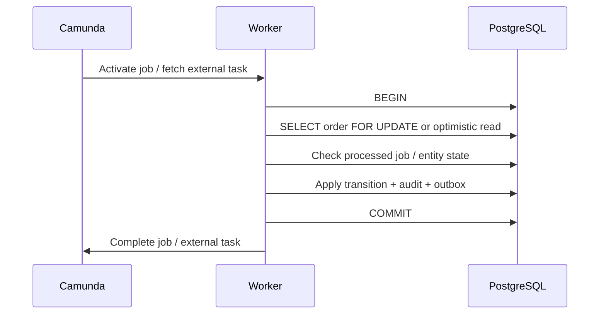

# Part 034 — Workflow and PostgreSQL/MyBatis Integration

> Goal: integrate Camunda workflow with PostgreSQL/MyBatis business data without corrupting entity state, duplicating process variables, or assuming a distributed transaction that does not exist.
>
> The workflow engine owns process execution. PostgreSQL owns durable business state. Worker code is where those two worlds can either be made reliable or quietly broken.

---

## 1. Core mental model

In enterprise Java systems, workflow and database state are related but separate.

```text
Camunda state:
  process instance
  activity instance / element instance
  job / external task
  incident
  process variables
  timers
  message subscriptions

PostgreSQL business state:
  quote row
  order row
  approval row
  fulfillment request row
  fallout case row
  audit row
  command/inbox/outbox/idempotency rows
```

Do not collapse these into one mental object.

The process instance can be active while the order row says `IN_FULFILLMENT`.

The order row can say `FAILED_REQUIRES_REPAIR` while the process has an incident.

The process can complete while a downstream audit projection is delayed.

A senior engineer asks:

> Which state is authoritative for this business fact, and what repairs divergence?

---

## 2. Why database integration is one of the hardest parts

Workflow engines create the illusion of deterministic progress.

Databases create the illusion of transactional certainty.

Distributed systems break both illusions.

Example:

```text
Worker activates job
  -> updates order status in PostgreSQL
  -> commits transaction
  -> crashes before completing job in Camunda
  -> job times out
  -> another worker activates same job
  -> worker updates order again
```

If the update is not idempotent, business state is corrupted.

Another example:

```text
JAX-RS endpoint starts process
  -> process instance created
  -> endpoint fails before command row committed
  -> process runs with no durable domain command audit
```

Another:

```text
Worker completes Camunda job first
  -> process moves forward
  -> DB update fails
  -> workflow says step done
  -> business row says step not done
```

These are not rare edge cases.

They are normal failure modes.

---

## 3. Fundamental invariants

### 3.1 PostgreSQL is the source of truth for business entities

Business entity state should live in business tables.

Examples:

```text
quote.status
order.status
approval.decision
fulfillment_request.status
fallout_case.status
```

Process variables may carry references and small execution context, but they should not replace business tables.

### 3.2 Camunda is the source of truth for process execution

Camunda owns:

```text
where the token/element is
which job is available
which user task is active
which timer is waiting
which incident exists
which message subscription is open
```

Do not mirror every process activity into business tables unless there is a clear business or operational need.

### 3.3 Workers must be idempotent

A worker may run more than once for the same logical work because of retry, timeout, crash, deployment restart, lock expiry, or network ambiguity.

### 3.4 Database commit and workflow completion are not one atomic operation

Unless you are in a carefully understood Camunda 7 embedded transaction boundary, assume:

```text
DB commit and workflow command are separate failure domains.
```

For Camunda 8, this is always the safer default: your Java worker and the orchestration engine are remote from each other.

---

## 4. Process variable vs database state

### 4.1 Bad pattern: process variable as database

```json
{
  "order": {
    "id": "ORD-1001",
    "status": "IN_FULFILLMENT",
    "customer": { "name": "...", "email": "..." },
    "lineItems": ["large payload"],
    "pricing": { "...": "..." }
  }
}
```

Problems:

- large payload increases engine/storage/network pressure;
- PII leaks into process history, incidents, logs, Operate/Cockpit;
- stale copy diverges from DB;
- variable schema changes break running processes;
- parallel worker completion can overwrite variables;
- migration becomes harder;
- data retention/deletion becomes harder.

### 4.2 Better pattern: process variable as reference/context

```json
{
  "orderId": "ORD-1001",
  "commandId": "cmd-submit-1001",
  "tenantId": "tenant-a",
  "correlationId": "corr-1001",
  "fulfillmentRequestId": "FUL-REQ-991"
}
```

Worker loads authoritative data from PostgreSQL:

```sql
select id, status, version, customer_id
from orders
where id = #{orderId};
```

Rule:

> Store facts in business tables. Store orchestration references in process variables.

---

## 5. Worker database transaction pattern

A typical worker step should look like this:

```text
1. Activate job / external task.
2. Extract minimal variables.
3. Open DB transaction.
4. Load business row by ID.
5. Check idempotency / current state / expected version.
6. Apply domain transition if still needed.
7. Insert audit/outbox/processed-job row.
8. Commit DB transaction.
9. Complete Camunda job with minimal output variables.
```

Important ordering:

```text
Commit business state before completing job.
```

Why?

If the worker completes the job first and then DB commit fails, the process has moved forward without durable business state.

If the worker commits DB first and then completion fails, the job can retry. Idempotency must detect that the business state transition already happened and then safely complete the job.

---

## 6. Worker transaction sequence



Failure-safe behavior:

| Failure point | Expected behavior |
|---|---|
| Crash before DB commit | Job retries; no business change committed |
| Crash after DB commit before job complete | Job retries; worker detects already-applied transition and completes safely |
| Camunda complete command times out | Worker must treat outcome as unknown and rely on idempotency on retry |
| DB conflict | Worker fail/retry or throw business error depending on conflict type |
| External API called inside transaction | Usually bad; can hold locks too long |

---

## 7. Idempotency table pattern

Use a durable table to record processed workflow work.

Example:

```sql
create table workflow_processed_job (
  job_identity varchar(255) primary key,
  process_instance_id varchar(255),
  business_id varchar(255) not null,
  step_name varchar(255) not null,
  result_status varchar(50) not null,
  result_payload jsonb,
  created_at timestamptz not null default now()
);
```

Possible `job_identity` values:

```text
Camunda 8 job key
Camunda 7 external task ID
processInstanceKey + activityId + business operation
business command ID
external request ID
```

Be careful:

- Camunda job key may change across retry patterns depending on engine/model behavior;
- business operation ID is often more stable than technical job ID;
- for one-time business effects, prefer a domain unique constraint.

Example unique constraint:

```sql
create unique index ux_fulfillment_request_order_step
on fulfillment_request(order_id, step_type)
where step_type = 'INITIAL_FULFILLMENT';
```

This says:

> There can be only one initial fulfillment request per order.

That is stronger than merely remembering a worker job ID.

---

## 8. Inbox table pattern

Use inbox when receiving external callbacks/events that will influence workflow.

```sql
create table integration_inbox_event (
  event_id varchar(255) primary key,
  source_system varchar(100) not null,
  event_type varchar(100) not null,
  business_id varchar(255) not null,
  correlation_key varchar(255),
  payload jsonb not null,
  received_at timestamptz not null default now(),
  processed_at timestamptz,
  processing_status varchar(50) not null,
  error_message text
);
```

Use cases:

- fulfillment callback;
- payment authorization result;
- inventory reservation result;
- partner order status update;
- Kafka consumer event;
- RabbitMQ command/reply.

Benefits:

- duplicate detection;
- replay;
- audit;
- delayed correlation;
- late-arrival analysis;
- support investigation.

Do not rely only on Camunda message correlation as your external event audit.

---

## 9. Outbox table pattern

Use outbox when a DB state change must result in a message, process start, or external command.

```sql
create table integration_outbox_event (
  event_id varchar(255) primary key,
  aggregate_type varchar(100) not null,
  aggregate_id varchar(255) not null,
  event_type varchar(100) not null,
  payload jsonb not null,
  status varchar(50) not null,
  created_at timestamptz not null default now(),
  published_at timestamptz,
  retry_count int not null default 0,
  last_error text
);
```

Example:

```text
HTTP submit order
  -> DB transaction updates order to SUBMISSION_RECEIVED
  -> same transaction inserts outbox event StartOrderSubmissionWorkflow
  -> outbox publisher starts Camunda process
  -> status updated to published
```

This avoids:

```text
DB commit succeeds, process start fails, no retry path
```

Outbox is not free.

It adds:

- publisher process;
- retry policy;
- monitoring;
- poison event handling;
- ordering decisions;
- cleanup/retention.

But for mission-critical workflow starts, it is often worth it.

---

## 10. State transition table pattern

For regulated or high-value order systems, capture state transitions explicitly.

```sql
create table order_state_transition (
  transition_id varchar(255) primary key,
  order_id varchar(255) not null,
  from_status varchar(100),
  to_status varchar(100) not null,
  command_id varchar(255),
  process_instance_id varchar(255),
  activity_id varchar(255),
  actor_type varchar(50) not null,
  actor_id varchar(255),
  reason_code varchar(100),
  created_at timestamptz not null default now()
);
```

Benefits:

- auditability;
- replay/debugging;
- illegal transition detection;
- SLA analytics;
- incident investigation;
- reconciliation.

Do not infer critical audit solely from current `order.status`.

---

## 11. Optimistic locking pattern

Most enterprise domain tables should have a version column.

```sql
alter table orders add column version bigint not null default 0;
```

Update:

```sql
update orders
set status = #{toStatus},
    version = version + 1,
    updated_at = now()
where id = #{orderId}
  and version = #{expectedVersion}
  and status = #{expectedStatus};
```

If update count is zero, the worker must decide:

```text
- already applied? complete idempotently
- illegal transition? throw BPMN error or fail job?
- concurrent operation? retry with backoff?
- stale callback? mark ignored?
```

Do not blindly retry every optimistic locking failure.

Some are business conflicts.

---

## 12. Pessimistic locking pattern

Sometimes use row lock:

```sql
select *
from orders
where id = #{orderId}
for update;
```

Use carefully.

Good for:

- short critical section;
- preventing concurrent transition;
- ensuring one worker creates one child record.

Bad for:

- external API calls while lock held;
- long-running operations;
- user think-time;
- waiting for Camunda command;
- high-throughput worker pools.

Rule:

> Never hold a database lock while waiting for an external system or human action.

---

## 13. MyBatis mapper discipline

MyBatis gives control, but also makes it easy to hide business rules in SQL fragments.

### 13.1 Good mapper style

```java
public interface OrderMapper {
  OrderRecord findById(String orderId);

  int transitionStatus(
      @Param("orderId") String orderId,
      @Param("expectedStatus") String expectedStatus,
      @Param("toStatus") String toStatus,
      @Param("expectedVersion") long expectedVersion
  );

  int insertTransition(OrderStateTransitionRecord transition);

  int insertProcessedJob(ProcessedJobRecord processedJob);
}
```

Keep domain transition logic visible in service code.

### 13.2 Risky mapper style

```xml
<update id="magicallyDoEverything">
  <!-- 200 lines of dynamic SQL deciding business flow -->
</update>
```

Problems:

- business rules hidden in SQL;
- hard to unit test;
- hard to compare with BPMN;
- hard to audit;
- hard to review correctness.

SQL should enforce invariants and persistence, not become the process model.

---

## 14. Worker service structure

Recommended layering:

```text
Camunda worker adapter
  -> application command service
      -> domain service/state machine
          -> MyBatis mapper/repository
      -> outbox/inbox/idempotency service
  -> Camunda completion/failure adapter
```

Avoid:

```text
Worker method directly contains:
  BPMN variable parsing
  SQL statements
  external API calls
  business rules
  retry decisions
  logging and metrics
  Camunda completion
```

That becomes untestable and unsafe.

---

## 15. Example worker pseudo-code

```java
public void handleValidateOrderJob(JobClient client, ActivatedJob job) {
  String orderId = job.getVariablesAsMap().get("orderId").toString();
  String commandId = job.getVariablesAsMap().get("commandId").toString();

  try {
    ValidationResult result = transactionTemplate.execute(status -> {
      if (processedJobRepository.exists(commandId, "VALIDATE_ORDER")) {
        return ValidationResult.alreadyProcessed(orderId);
      }

      Order order = orderRepository.findForUpdate(orderId);

      ValidationResult validation = orderDomainService.validate(order);

      orderRepository.transition(
          orderId,
          order.status(),
          validation.nextStatus(),
          order.version()
      );

      auditRepository.insertTransition(...);
      processedJobRepository.insert(commandId, "VALIDATE_ORDER", validation.status());

      return validation;
    });

    client.newCompleteCommand(job.getKey())
        .variables(Map.of(
            "validationStatus", result.status(),
            "orderId", orderId
        ))
        .send()
        .join();

  } catch (RecoverableDatabaseException e) {
    client.newFailCommand(job.getKey())
        .retries(job.getRetries() - 1)
        .retryBackoff(Duration.ofMinutes(2))
        .errorMessage(e.getMessage())
        .send()
        .join();

  } catch (BusinessValidationException e) {
    client.newThrowErrorCommand(job.getKey())
        .errorCode("ORDER_VALIDATION_FAILED")
        .errorMessage(e.getMessage())
        .send()
        .join();
  }
}
```

Design points:

- DB transaction is completed before job completion;
- idempotency is checked inside transaction;
- business validation failure is separated from technical DB failure;
- completion variables are minimal;
- retry backoff is intentional.

---

## 16. Transaction boundary mismatch

### 16.1 Camunda 7 embedded mode

In Camunda 7 embedded mode, Java delegates may execute in the process engine command context and may share transaction infrastructure depending on configuration.

This can be useful but dangerous.

You must know:

- whether delegate DB writes participate in the same transaction;
- where asyncBefore/asyncAfter creates transaction boundaries;
- whether Java delegate exceptions roll back process state and business DB state;
- whether external API calls happen before commit;
- whether job executor retries the same command;
- whether transaction listeners are used.

Never assume.

Verify configuration.

### 16.2 Camunda 7 external task

External task workers are separate from engine transaction.

Pattern resembles remote worker:

```text
fetch and lock
DB transaction
complete external task
```

You need idempotency because lock expiry/failure can cause reprocessing.

### 16.3 Camunda 8 job worker

Camunda 8 workers are remote by design.

There is no single transaction covering:

```text
PostgreSQL update + Zeebe job completion
```

So idempotency and retry-safe design are mandatory.

---

## 17. Database failure during workflow

### 17.1 Transient DB outage

Symptoms:

- worker fails jobs;
- retry count decreases;
- incidents after retry exhaustion;
- connection pool saturation;
- increased job latency;
- API status endpoint slow.

Response:

- fail job with backoff;
- avoid immediate retry storm;
- alert on DB pool/latency;
- pause/scale workers if DB is overloaded;
- protect DB with worker concurrency limits.

### 17.2 Deadlock

Symptoms:

- PostgreSQL deadlock error;
- worker retry succeeds sometimes;
- high concurrency around same order/quote;
- inconsistent lock ordering.

Response:

- standardize lock order;
- reduce transaction scope;
- use optimistic locking where possible;
- group operations by aggregate;
- add retry with jitter.

### 17.3 Serialization/optimistic conflict

Symptoms:

- update count zero;
- version mismatch;
- concurrent cancellation/amendment/fulfillment update.

Response:

- detect already-applied transition;
- reject illegal transition as business error;
- retry only if truly transient;
- update process path if business state changed.

---

## 18. Workflow failure after DB commit

This is the classic case.

```text
DB commit succeeds
Camunda complete job fails or times out
```

Possible outcomes:

```text
1. completion command actually reached Camunda, but worker did not receive response
2. completion command did not reach Camunda
3. Camunda completed job, but projection/Operate is delayed
4. job remains available and retries
```

Worker must treat completion timeout as unknown.

Do not immediately compensate business state unless you prove the process did not move.

On retry:

```text
- check DB state
- check processed job/business operation
- if already applied, complete job again with minimal variables
- if process already moved, duplicate complete may be rejected; log as idempotent/unknown outcome depending on client behavior
```

---

## 19. Database migration impact on workflow

A database migration can break running workflows.

Examples:

- worker expects column removed in new schema;
- BPMN variable contains old enum value;
- old process version calls worker with old payload;
- new worker no longer supports old activity behavior;
- MyBatis mapper changed SQL but old process instances still reach old path;
- status enum transition changed while process migration not done.

Migration rule:

> Process version compatibility and database schema compatibility must be planned together.

Safe migration approach:

```text
1. Additive DB change.
2. Deploy backward-compatible worker.
3. Deploy new BPMN version.
4. Let old instances drain or migrate safely.
5. Remove old compatibility only after no old instances need it.
```

---

## 20. PostgreSQL table design for workflow integration

### 20.1 Business aggregate table

```sql
create table orders (
  id varchar(255) primary key,
  tenant_id varchar(255) not null,
  status varchar(100) not null,
  version bigint not null,
  created_at timestamptz not null,
  updated_at timestamptz not null
);
```

### 20.2 Workflow link table

```sql
create table order_workflow_instance (
  order_id varchar(255) not null,
  process_name varchar(255) not null,
  process_version int,
  process_instance_id varchar(255) not null,
  engine_type varchar(50) not null,
  status varchar(100) not null,
  started_at timestamptz not null,
  ended_at timestamptz,
  primary key(order_id, process_name, process_instance_id)
);
```

Why this helps:

- lookup process by order;
- support multiple workflow types per order;
- avoid exposing engine key as business ID;
- help support and reconciliation.

### 20.3 Command table

```sql
create table workflow_command (
  command_id varchar(255) primary key,
  idempotency_key varchar(255) not null,
  command_type varchar(100) not null,
  business_id varchar(255) not null,
  request_hash varchar(255) not null,
  status varchar(50) not null,
  created_at timestamptz not null default now(),
  completed_at timestamptz,
  unique(idempotency_key, command_type)
);
```

This lets the API handle retries deterministically.

---

## 21. Reconciliation between Camunda and PostgreSQL

Reconciliation detects and repairs divergence.

Examples:

```text
DB says order IN_FULFILLMENT but no active fulfillment process exists.
Process active at fulfillment wait but fulfillment_request row missing.
Process incident exists but order status still RUNNING.
Order completed but process still active.
Outbox event stuck unpublished.
Inbox event received but not correlated.
```

Reconciliation job should:

```text
1. identify inconsistency
2. classify severity
3. avoid automatic destructive repair unless safe
4. write audit trail
5. trigger manual task/incident if needed
6. expose dashboard metric
```

Do not silently repair high-value business state without audit.

---

## 22. Performance considerations

### 22.1 Worker concurrency vs DB capacity

Worker concurrency must respect database capacity.

Bad:

```text
Scale worker pods from 2 to 20
Each pod max jobs active = 100
DB pool max = 20
```

Result:

- connection pool starvation;
- lock contention;
- job timeout;
- retry storm;
- incident spike.

Tune together:

```text
worker concurrency
max jobs active
DB connection pool
query latency
lock duration/job timeout
retry backoff
outbox publisher rate
```

### 22.2 Large variables and DB load

Even in Camunda 8, writing large variables can create broker/exporter/search/storage pressure.

In Camunda 7, large serialized variables can increase DB load and byte-array table pressure.

Use PostgreSQL for business payloads and pass references through Camunda.

### 22.3 N+1 worker queries

Avoid worker doing:

```text
load order
load customer
load each line item one by one
load each product one by one
```

Use purpose-built queries/read models for worker steps.

---

## 23. Security and privacy concerns

PostgreSQL integration can reduce process variable exposure.

Instead of storing PII in workflow variables:

```json
{
  "customerEmail": "customer@example.com",
  "nationalId": "..."
}
```

store:

```json
{
  "customerId": "CUST-1001"
}
```

Then enforce access control in the service when loading customer details.

Checklist:

- Are sensitive fields excluded from variables?
- Are callback payloads encrypted/masked if needed?
- Are audit rows access-controlled?
- Are process incident details free of secrets?
- Are SQL logs redacted?
- Is retention aligned between Camunda history and DB audit tables?

---

## 24. Observability for DB-workflow integration

Metrics:

```text
workflow_worker_db_transaction_duration_ms
workflow_worker_db_conflict_total
workflow_worker_db_deadlock_total
workflow_worker_idempotent_replay_total
workflow_outbox_pending_total
workflow_outbox_publish_failure_total
workflow_inbox_pending_total
workflow_inbox_duplicate_total
workflow_reconciliation_mismatch_total
workflow_state_transition_total
```

Log fields:

```text
orderId / quoteId
processInstanceKey / processInstanceId
processDefinitionId
activityId / elementId
jobKey / externalTaskId
commandId
idempotencyKey reference
correlationId
DB transaction result
state transition from/to
retry count
```

Trace:

```text
API command -> DB command row -> process start -> worker job -> DB transition -> job completion -> outbox event
```

If you cannot trace that path, production debugging will be guesswork.

---

## 25. Failure-mode debugging checklist

### 25.1 Business state changed but process did not move

Check:

```text
- Did worker commit DB?
- Did job completion fail?
- Is job still active/available/incident?
- Is processed job row present?
- Did worker retry and detect already-applied state?
- Can job be safely completed manually?
```

### 25.2 Process moved but DB did not change

Check:

```text
- Was job completed before DB commit?
- Was DB write skipped due to idempotency bug?
- Did worker complete with wrong branch/variables?
- Is status projection delayed?
- Is there missing audit row?
```

### 25.3 Duplicate database update

Check:

```text
- Did job timeout and retry?
- Did two workers process same logical command?
- Is unique constraint missing?
- Is idempotency key wrong?
- Is external callback duplicate?
```

### 25.4 Outbox stuck

Check:

```text
- Is publisher running?
- Is external engine/API reachable?
- Is event poison due to invalid payload?
- Is retry policy exhausted?
- Is event ordering blocking later events?
```

### 25.5 Inbox event not correlated

Check:

```text
- Is inbox event duplicate/ignored?
- Is correlation key correct?
- Is process subscription open?
- Was event late?
- Is correlation retried?
```

---

## 26. Common anti-patterns

### 26.1 Process variable as full entity snapshot

Creates stale data, privacy risk, and migration pain.

### 26.2 Completing job before committing DB

Creates process/business divergence.

### 26.3 No idempotency table or unique constraint

Makes retry unsafe.

### 26.4 Holding DB lock during external call

Creates lock contention and outage amplification.

### 26.5 Hiding business state transition inside BPMN expression

Makes state correctness hard to test and audit.

### 26.6 Treating outbox as optional for critical cross-boundary commands

Creates lost process starts/events.

### 26.7 Retrying all DB exceptions the same way

Turns business conflicts into retry storms.

### 26.8 Letting worker concurrency exceed DB capacity

Turns scaling into self-inflicted incident.

---

## 27. Internal verification checklist

Verify in the actual CSG/team environment.

### 27.1 Business state ownership

- Which PostgreSQL tables own quote/order/fallout/approval state?
- Which states are duplicated in process variables?
- Which status is shown to users/customers?
- Is source of truth documented?
- Is there reconciliation for divergence?

### 27.2 Worker database transactions

- Do workers commit DB before completing job/external task?
- Are worker operations idempotent?
- Is there a processed-job table or domain unique constraint?
- Are DB writes inside one transaction?
- Are external calls made outside DB locks?

### 27.3 MyBatis/JDBC usage

- Are mappers explicit and reviewable?
- Are transition updates guarded by expected status/version?
- Are update counts checked?
- Are SQL exceptions classified correctly?
- Are queries efficient under worker concurrency?

### 27.4 Outbox/inbox

- Is outbox used for process starts/events after DB commit?
- Is inbox used for callbacks/events before correlation?
- Are outbox/inbox retries monitored?
- Are poison events visible?
- Is replay supported safely?

### 27.5 Migration compatibility

- Can old process versions still run after DB schema changes?
- Are workers backward-compatible with old variable payloads?
- Are status enum changes coordinated with BPMN deployment?
- Is there a drain/migration plan for running instances?

### 27.6 Observability

- Can support map order ID to process instance?
- Can support map process instance to DB command/audit rows?
- Are DB conflicts/deadlocks visible in metrics?
- Are outbox/inbox lag metrics available?
- Is reconciliation mismatch measured?

---

## 28. PR review checklist

### Correctness

- What is the source of truth for each business fact?
- Does this change duplicate state between Camunda and PostgreSQL?
- What happens if the worker crashes after DB commit but before job completion?
- What happens if job completion succeeds but response is lost?
- Is the operation idempotent?

### Transaction boundaries

- Where does the DB transaction start and commit?
- Is Camunda command inside or outside DB transaction?
- Are external API calls inside DB transaction?
- Are locks held for minimal time?
- Are optimistic locking failures handled intentionally?

### Data modelling

- Are process variables minimal references?
- Are large payloads stored in DB/object storage rather than variables?
- Are sensitive fields kept out of variables/logs/incidents?
- Are variable schema changes backward-compatible?

### Integration reliability

- Is outbox/inbox needed?
- Are duplicate events/callbacks handled?
- Is retry policy compatible with DB constraints?
- Are poison messages visible?
- Is reconciliation planned?

### Operations

- Are metrics/logs sufficient for debugging?
- Are manual repair steps documented?
- Are migration implications understood?
- Can support trace API → DB → process → worker → DB?

---

## 29. Practical rule of thumb

For PostgreSQL/MyBatis integration with Camunda:

```text
Keep business truth in PostgreSQL.
Keep orchestration truth in Camunda.
Pass references, not large snapshots.
Commit DB before completing workflow work.
Make every worker idempotent.
Use outbox/inbox when crossing reliability boundaries.
Reconcile divergence explicitly.
```

If a worker cannot be safely retried after an unknown outcome, it is not production-ready.

---

## 30. Sources for further reading

- Camunda 8 Docs — Job workers: `https://docs.camunda.io/docs/components/concepts/job-workers/`
- Camunda 8 Docs — Writing good workers: `https://docs.camunda.io/docs/components/best-practices/development/writing-good-workers/`
- Camunda 8 Docs — Variables: `https://docs.camunda.io/docs/components/concepts/variables/`
- Camunda 8 Docs — Service task variable mappings: `https://docs.camunda.io/docs/components/modeler/bpmn/service-tasks/`
- Camunda 7 Docs — Database schema: `https://docs.camunda.org/manual/latest/user-guide/process-engine/database/database-schema/`
