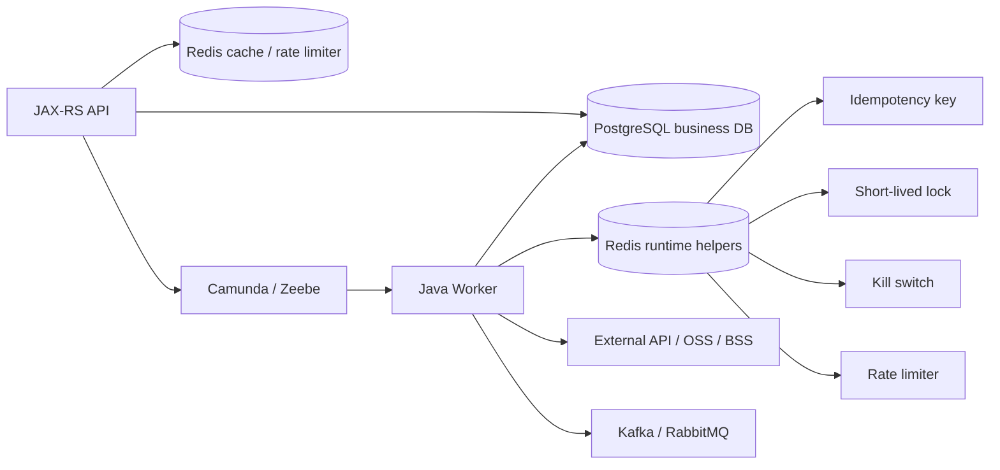
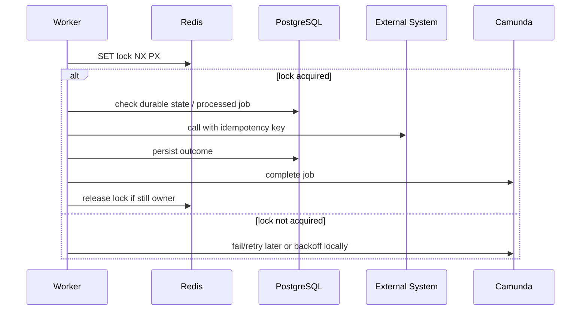

# Part 037 — Workflow and Redis Integration

## 1. Core mental model

Redis biasanya **bukan workflow engine**, **bukan source of truth proses**, dan **bukan pengganti database domain**.

Dalam sistem workflow enterprise, Redis lebih tepat diposisikan sebagai **supporting runtime infrastructure** di sekitar Camunda dan worker:

- cache status workflow untuk read API yang sangat sering dipanggil;
- idempotency helper untuk request/API/worker tertentu;
- rate limiter untuk melindungi downstream system;
- worker coordination untuk throttling ringan;
- feature flag atau kill switch untuk menghentikan worker/action berbahaya;
- short-lived lock untuk mencegah duplicate execution pada window kecil;
- cache external lookup yang mahal;
- temporary task/session state untuk UX tertentu.

Redis harus diperlakukan sebagai **ephemeral coordination layer**, bukan tempat utama menyimpan kebenaran bisnis.

Dalam konteks Camunda:

- Camunda menyimpan state prosesnya sendiri.
- PostgreSQL/business database menyimpan state domain seperti quote/order/customer/agreement.
- Kafka/RabbitMQ menyimpan event/command stream atau message delivery.
- Redis membantu performa dan koordinasi, tetapi tidak boleh menjadi satu-satunya tempat menyimpan keputusan bisnis yang harus auditable.

## 2. Where Redis fits around workflow systems



Redis integration should answer one question clearly:

> “What temporary coordination or performance concern are we solving, and what remains true if Redis loses this key?”

If the answer is “we lose the only record of business completion,” the design is wrong.

## 3. Redis use cases in workflow systems

| Use case | Good fit? | Source of truth? | Main risk |
|---|---:|---:|---|
| Process status cache | Yes | No | stale status shown to client |
| API idempotency key | Sometimes | Usually DB preferred | key expiry too early |
| Worker duplicate guard | Sometimes | DB preferred for durable side effects | lock expiry during execution |
| Distributed lock | Carefully | No | false confidence in exactly-once behavior |
| Rate limiter | Yes | No | throttling critical process too aggressively |
| Worker kill switch | Yes | No | forgotten kill switch stops production flow |
| Feature flag | Yes | No | inconsistent rollout across workers |
| External lookup cache | Yes | No | stale reference data |
| Human task draft cache | Sometimes | Usually DB preferred | losing user input |
| Business state store | No | Should be DB/domain service | audit and consistency failure |
| Workflow engine replacement | No | No | building fragile custom orchestration |

## 4. Redis must not become workflow state

A common anti-pattern is storing a workflow’s real progress in Redis because it is fast.

Example bad pattern:

```text
quote:{quoteId}:approvalStatus = APPROVED
order:{orderId}:fulfillmentStep = DEVICE_ALLOCATED
process:{processId}:currentStep = WAITING_FOR_PAYMENT
```

This is dangerous because:

- Redis keys may expire.
- Redis can be flushed or evicted depending on configuration.
- Redis is often not used as audit storage.
- Redis updates may not be transactionally tied to PostgreSQL or Camunda completion.
- Operators may not inspect Redis during incident triage.
- Reconciliation becomes difficult.

Better pattern:

```text
PostgreSQL: durable quote/order state
Camunda: durable process execution state
Redis: cache of derived status or short-lived coordination helper
```

The Redis value should be rebuildable from durable sources.

## 5. Redis for idempotency

Redis can support idempotency, especially for short-lived API protection.

Example:

```text
POST /orders/{orderId}/submit
Idempotency-Key: 7a20d1...
```

The JAX-RS API can use Redis to prevent immediate duplicate submits:

```text
SET idem:submit-order:{tenantId}:{idempotencyKey} IN_PROGRESS NX EX 300
```

If the key already exists:

- return existing response if available;
- return `409 Conflict` or `202 Accepted` if still processing;
- avoid starting a duplicate workflow instance.

However, for mission-critical operations, Redis-only idempotency is usually insufficient.

Durable idempotency should often be stored in PostgreSQL:

```sql
CREATE TABLE api_idempotency_keys (
  tenant_id           text        NOT NULL,
  idempotency_key     text        NOT NULL,
  operation_name      text        NOT NULL,
  business_id         text        NOT NULL,
  request_hash        text        NOT NULL,
  status              text        NOT NULL,
  response_payload    jsonb,
  created_at          timestamptz NOT NULL,
  completed_at        timestamptz,
  PRIMARY KEY (tenant_id, idempotency_key)
);
```

### Practical rule

Use Redis for fast duplicate suppression. Use PostgreSQL for durable idempotency when the operation creates externally visible business effects.

## 6. Redis for worker duplicate guard

Workflow workers must assume **at-least-once execution**.

A worker can be executed again when:

- job timeout expires;
- worker crashes after side effect but before completing the job;
- network fails after command submission;
- deployment restarts worker pods;
- external task lock expires;
- retry policy reactivates the same unit of work.

Redis can provide a short-lived duplicate guard:

```text
SET worker-lock:{jobType}:{businessKey} {workerId} NX PX 120000
```

This helps reduce concurrent duplicate execution.

But it does not prove the side effect happened exactly once.

A durable worker should still use one of these:

- processed job table;
- business unique constraint;
- outbox/inbox table;
- external API idempotency key;
- domain-level illegal transition guard.

### Bad worker design

```text
1. acquire Redis lock
2. call external system
3. complete Camunda job
```

This still fails if:

- external system succeeds;
- worker crashes before `complete job`;
- Redis lock expires;
- Camunda retries;
- second worker repeats the external call.

### Better worker design

```text
1. derive deterministic idempotency key
2. check durable processed_job/business state
3. optionally acquire Redis short-lived lock
4. perform side effect with idempotency key
5. persist durable outcome
6. complete Camunda job with minimal variables
```

Redis reduces probability of duplicate work. It does not remove the need for correctness at the durable boundary.

## 7. Distributed lock correctness

Redis locks are often misused.

A Redis lock is acceptable when all of these are true:

- lock protects a short critical section;
- operation is idempotent anyway;
- lock expiry is longer than normal execution time;
- worker handles lock loss safely;
- duplicate execution is tolerable or blocked elsewhere;
- the lock is not the only correctness mechanism.

A Redis lock is dangerous when:

- it protects money/order/provisioning correctness alone;
- the operation can exceed TTL unpredictably;
- external system call has unknown outcome;
- there is no durable deduplication;
- process correctness assumes exactly one worker ran;
- operators cannot inspect or repair the lock safely.

### Lock lifecycle



Always release lock using compare-and-delete semantics, not blind delete.

## 8. Redis for rate limiting workers

Workflow engines can create more work than a downstream system can tolerate.

Redis can be useful for distributed rate limiting:

- limit calls to external pricing system;
- limit order submission to provisioning API;
- limit expensive customer lookup;
- avoid retry storm during downstream outage;
- apply tenant-specific quotas.

Example conceptual key:

```text
rate:worker:{jobType}:{tenantId}:{minuteBucket}
```

Worker behavior under rate limit should be explicit:

| Strategy | When useful | Risk |
|---|---|---|
| Local wait/backoff | short delay | worker threads blocked |
| Fail job with retry | engine-managed retry | can create visible incident if retries exhausted |
| Throw BPMN error | business-level throttling path | inappropriate for technical throttling |
| Complete with deferred event | rare, advanced | can hide real work |
| Pause via kill switch | outage protection | manual resume required |

Rate limiting must be observable. Otherwise a “slow process” incident becomes hard to explain.

## 9. Redis for worker coordination

Redis can help coordinate worker fleet behavior:

- pause a job type;
- lower concurrency temporarily;
- enable dry-run mode;
- route only selected tenants;
- apply emergency blocklist;
- implement kill switch during production incident.

Example kill switch keys:

```text
kill:worker:submit-order = true
kill:tenant:{tenantId}:provisioning = true
feature:workflow:new-approval-routing = enabled
```

Rules:

- key names must be documented;
- default behavior must be safe;
- all kill switches must have dashboards;
- stale switches must be reviewed;
- changes must be auditable;
- workers must log when switch changes behavior.

A silent Redis flag that changes workflow behavior is operationally dangerous.

## 10. Redis as process status cache

Long-running workflow APIs often expose status endpoints:

```http
GET /orders/{orderId}/workflow-status
```

Querying Camunda/Operate/Cockpit or joining multiple business tables on every request may be expensive.

Redis can cache derived status:

```json
{
  "orderId": "ORD-123",
  "processStatus": "WAITING_FOR_APPROVAL",
  "currentTask": "Pricing Approval",
  "lastUpdatedAt": "2026-07-11T10:00:00Z"
}
```

But the API contract must communicate whether status is strongly consistent or eventually consistent.

### Cache invalidation options

| Approach | Description | Trade-off |
|---|---|---|
| Worker writes cache after job completion | simple | worker must remember to update cache |
| Domain event updates cache | better decoupling | event delay/out-of-order handling |
| API read-through cache | simple for status read | first request slower |
| Periodic rebuild | robust for drift | less real-time |
| No cache | simplest correctness | possible performance issue |

For production systems, status cache should include `lastUpdatedAt` and possibly `sourceVersion`.

## 11. Redis and human task UX

Redis may support human task UX, but carefully.

Potential use cases:

- short-lived UI filter preferences;
- task count cache;
- temporary draft autosave;
- user presence or active reviewer indicator;
- optimistic UI invalidation token;
- frequently used reference data for task forms.

Avoid using Redis as the only storage for:

- approval decision;
- user comment required for audit;
- form submission payload;
- task completion reason;
- delegated approver assignment;
- compliance evidence.

Human task data is usually auditable. It belongs in durable storage or Camunda task/process history, depending on internal architecture.

## 12. Redis outage impact model

Ask this for every Redis dependency:

> “If Redis is down for 30 minutes, what happens to workflow correctness?”

Possible answers:

| Redis usage | Redis down impact | Expected behavior |
|---|---|---|
| status cache | stale/miss | fall back to DB/Camunda or return degraded response |
| rate limiter | cannot limit | fail closed or use local limiter |
| kill switch | cannot read switch | fail safe based on default |
| idempotency helper | duplicate risk | fall back to PostgreSQL idempotency |
| distributed lock | concurrent execution risk | durable dedup still protects side effect |
| feature flag | inconsistent behavior | local cached value with TTL and audit |
| task count cache | UI count wrong | task detail remains correct |

If Redis outage can corrupt business state, the architecture is too dependent on Redis.

## 13. Java/JAX-RS integration pattern

For JAX-RS APIs around workflow, Redis is usually used at the API edge:

```text
Client
  -> JAX-RS Resource
  -> Idempotency filter / rate limiter
  -> Domain service
  -> PostgreSQL transaction
  -> Camunda start/correlate/complete command
```

### API idempotency guard

Pseudo-flow:

```java
// Conceptual pseudo-code only
public Response submitOrder(String orderId, String idempotencyKey) {
    String key = "idem:submit-order:" + tenantId + ":" + idempotencyKey;

    boolean acquired = redis.setNxEx(key, "IN_PROGRESS", Duration.ofMinutes(5));
    if (!acquired) {
        return Response.status(202).entity(existingStatus(orderId)).build();
    }

    try {
        SubmitResult result = service.submitOrder(orderId, idempotencyKey);
        redis.setEx(key, result.toCachedJson(), Duration.ofHours(24));
        return Response.accepted(result).build();
    } catch (Exception e) {
        // Do not blindly delete if operation outcome is unknown.
        redis.setEx(key, "UNKNOWN", Duration.ofMinutes(10));
        throw e;
    }
}
```

The important design point is not the exact code. The important point is outcome classification:

- `NOT_STARTED`
- `IN_PROGRESS`
- `COMPLETED`
- `FAILED_RETRYABLE`
- `FAILED_FINAL`
- `UNKNOWN`

Unknown outcome is the dangerous state. Redis should not hide it.

## 14. PostgreSQL vs Redis responsibility

| Responsibility | PostgreSQL | Redis |
|---|---:|---:|
| quote/order durable state | yes | no |
| workflow source of truth | Camunda engine state, not Redis | no |
| audit trail | yes | no |
| legal/compliance evidence | yes | no |
| processed job durability | yes | sometimes as helper only |
| fast duplicate suppression | optional | yes |
| short-lived lock | sometimes with DB advisory lock | yes, carefully |
| derived status cache | optional | yes |
| rate limiter | possible but less common | yes |
| kill switch | possible | yes |

If a Redis key and PostgreSQL row disagree, PostgreSQL/domain state normally wins unless internal architecture explicitly defines otherwise.

## 15. Kafka/RabbitMQ/Redis interaction

Redis often appears together with messaging.

### Kafka + Redis

Potential use cases:

- consumer dedup cache for short windows;
- per-tenant event processing rate limit;
- replay guard for non-replay-safe downstream;
- cached correlation lookup.

Risks:

- Kafka replay may exceed Redis TTL and re-trigger side effects.
- Redis dedup cache is not enough for durable exactly-once business effect.
- Event order should not depend on Redis lock if partitioning/keying is wrong.

### RabbitMQ + Redis

Potential use cases:

- command dedup window;
- worker rate limit;
- temporary lock for command processing;
- poison message suppression.

Risks:

- RabbitMQ redelivery plus Redis lock expiry can still duplicate work.
- DLQ reprocessing can happen after Redis idempotency key expired.
- Retry may happen both in broker and workflow engine.

## 16. Kubernetes and cloud/on-prem considerations

Redis integration must be reviewed in deployment context.

### Kubernetes

Check:

- Redis service discovery and DNS stability;
- connection pool sizing per worker pod;
- readiness behavior when Redis is unavailable;
- whether worker fails open or fail closed;
- Redis secret injection;
- network policy from worker/API pods to Redis;
- resource limits for Redis sidecars/proxies if used;
- HPA behavior during Redis latency spike.

### AWS

Check:

- ElastiCache/Redis topology if used;
- Multi-AZ configuration;
- TLS in transit;
- auth token/ACL;
- security group rules;
- CloudWatch metrics and alarms;
- backup/snapshot if Redis stores non-rebuildable data;
- failover behavior and client timeout settings.

### Azure

Check:

- Azure Cache for Redis tier and persistence options if used;
- private endpoint;
- TLS;
- firewall rules;
- Azure Monitor alerts;
- managed identity/key vault integration if applicable;
- failover behavior.

### On-prem/hybrid

Check:

- network latency between workers and Redis;
- firewall path;
- TLS/internal CA;
- Redis HA ownership;
- operational runbook;
- patching policy;
- backup expectations;
- who can flush keys;
- monitoring stack integration.

## 17. Security and privacy concerns

Redis keys and values often leak more than expected.

Avoid key names like:

```text
lock:john.doe@example.com:passport:12345
idem:customer:6281234567890:submit
```

Prefer opaque or hashed identifiers:

```text
lock:tenant:{tenantId}:order:{orderIdHash}:submit
```

Review:

- PII in keys;
- PII in values;
- secrets in cache;
- Redis AUTH/ACL;
- TLS;
- network policy;
- operator access;
- key retention;
- logs that print Redis keys;
- metrics labels with high-cardinality or sensitive values.

Redis is often inspected during debugging. Do not put data there that operators should not see.

## 18. Observability checklist

Redis integration should emit metrics and logs.

Useful metrics:

- Redis latency;
- Redis timeout count;
- cache hit/miss ratio;
- idempotency duplicate hit count;
- lock acquire success/failure count;
- lock wait time;
- rate limit reject/defer count;
- kill switch active state;
- worker skipped due to feature flag;
- fallback-to-DB count;
- stale status cache count;
- Redis connection pool saturation.

Useful log fields:

- correlation ID;
- process instance key/id;
- business key;
- job key/external task ID;
- Redis key category, not full sensitive key;
- lock owner;
- fallback path;
- degraded mode reason.

## 19. Failure modes

| Failure mode | Symptom | Root cause | Safe response |
|---|---|---|---|
| Redis unavailable | worker/API errors | Redis outage/network | fallback or fail safe based on operation criticality |
| lock expired mid-work | duplicate side effect | execution longer than TTL | durable idempotency and external idempotency key |
| stale cache | wrong status shown | cache invalidation delay | include lastUpdatedAt and refresh from source |
| idempotency key expired too early | duplicate process started | TTL shorter than retry/replay window | use PostgreSQL durable key |
| kill switch forgotten | process stops progressing | manual flag left enabled | dashboard + expiry + ownership |
| rate limiter too strict | backlog grows | incorrect quota | alert on deferred jobs and backlog |
| Redis memory eviction | missing keys | maxmemory policy | do not store correctness-critical state |
| Redis latency spike | worker throughput drops | network/resource issue | timeout, circuit breaker, fallback |
| secret leaked in Redis | security incident | bad value/key design | remove, rotate, audit |

## 20. Debugging playbook

When workflow issue involves Redis:

1. Identify what Redis is used for: cache, lock, idempotency, rate limit, feature flag, or coordination.
2. Find durable source of truth: Camunda instance, PostgreSQL row, event stream, external system.
3. Compare Redis value with durable state.
4. Check TTL and last update timestamp.
5. Check whether Redis key expiry could explain duplicate or missing behavior.
6. Check worker logs around lock acquisition or rate limit decision.
7. Check whether fallback path executed.
8. Check Redis latency/errors during the incident window.
9. Avoid manually deleting keys unless impact is understood.
10. If manual key manipulation is required, document who approved it and what durable state was checked first.

## 21. PR review checklist

Use this checklist when reviewing Redis usage in workflow-related code.

### Correctness

- Is Redis used only as helper/cache/coordination layer?
- What remains true if Redis key disappears?
- Is there durable state in PostgreSQL/Camunda/external system?
- Is idempotency durable enough for the operation?
- Can duplicate worker execution still be safe?
- Is lock TTL correct relative to worst-case execution time?
- Is lock release owner-safe?

### Workflow integration

- Does Redis behavior affect process path?
- Is process variable updated consistently with Redis/cache?
- Does Camunda retry interact safely with Redis TTL?
- Does worker complete job only after durable side effect is recorded?
- Is unknown outcome handled explicitly?

### API integration

- Is idempotency key required for unsafe API operations?
- Does duplicate request return deterministic response?
- Does status endpoint indicate freshness?
- Is fallback to durable source available?

### Messaging integration

- Is Kafka replay safe if Redis dedup key expired?
- Is RabbitMQ redelivery safe if Redis lock expired?
- Are retry layers documented?

### Operations

- Are Redis metrics available?
- Are kill switches visible and owned?
- Are cache keys documented?
- Are Redis outages covered in runbook?
- Are manual key operations controlled?

### Security

- Do keys/values avoid PII and secrets?
- Is TLS/auth enabled where required?
- Are Redis keys excluded or redacted from logs?
- Is access limited by network policy/security group?

## 22. Internal verification checklist

Verify these in CSG/team context before assuming any Redis behavior:

- Does Quote & Order use Redis around workflow or worker execution?
- Which Redis deployment is used: managed cloud, Kubernetes, on-prem, shared platform?
- Is Redis used for idempotency, cache, lock, rate limiter, feature flag, task/session state, or worker coordination?
- Which keys affect Camunda process execution?
- Are key names documented?
- Are TTLs documented and tested?
- Are Redis values rebuildable from PostgreSQL/Camunda/event history?
- Is Redis ever used as source of truth for quote/order/workflow status?
- Is there a durable processed job/inbox/outbox table?
- Do workers rely on Redis lock for correctness?
- What happens when Redis is unavailable?
- Are worker retries safe after Redis outage?
- Are Redis metrics included in observability dashboards?
- Is there an alert for Redis latency, unavailable nodes, memory pressure, and evictions?
- Are Redis keys redacted from logs?
- Are feature flags/kill switches auditable?
- Who can change Redis values in production?
- Is manual Redis key deletion part of any runbook?
- Are cloud/on-prem network boundaries documented?
- Does Redis integration behave differently between dev, staging, and production?

## 23. Practical design rules

1. Redis is a helper, not the source of truth.
2. If the operation has business/legal/customer impact, store durable idempotency in PostgreSQL or domain service.
3. Locks reduce concurrency; they do not guarantee exactly-once side effects.
4. Every Redis key that changes workflow behavior needs owner, TTL, observability, and runbook.
5. Status cache must be explicitly stale-tolerant.
6. Feature flags and kill switches must be visible to operators.
7. Never hide business decisions only in Redis.
8. Redis outage must degrade safely.
9. Avoid PII and secrets in Redis keys and values.
10. Always design worker correctness assuming Redis lies, disappears, or times out.

## 24. Senior engineer takeaway

Redis is powerful around workflow systems because it is fast, flexible, and easy to integrate.

That is also why it is dangerous.

A senior engineer should not ask only:

> “Can Redis solve this?”

The better questions are:

> “What correctness guarantee do we need?”  
> “What durable state proves the side effect happened?”  
> “What happens if Redis expires this key?”  
> “Can we debug this at 3 AM without guessing?”

Use Redis to improve performance and operability. Do not use it to smuggle hidden workflow state outside Camunda and the domain database.

## References

- Camunda 8 documentation — Job workers: https://docs.camunda.io/docs/components/concepts/job-workers/
- Camunda 8 best practices — Writing good workers: https://docs.camunda.io/docs/components/best-practices/development/writing-good-workers/
- Camunda 8 best practices — Handling data in processes: https://docs.camunda.io/docs/components/best-practices/development/handling-data-in-processes/
- Redis documentation: https://redis.io/docs/latest/
