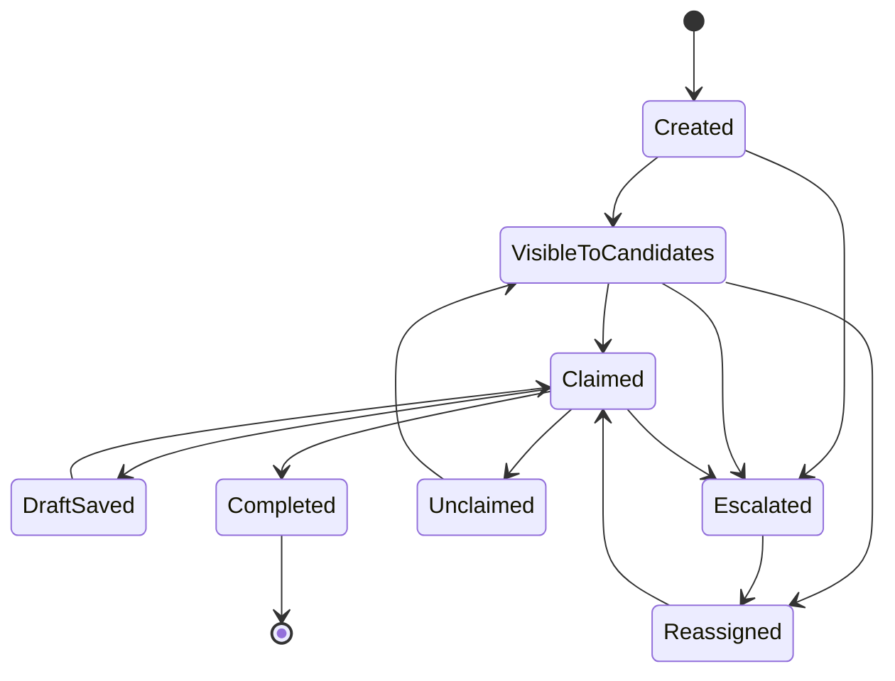
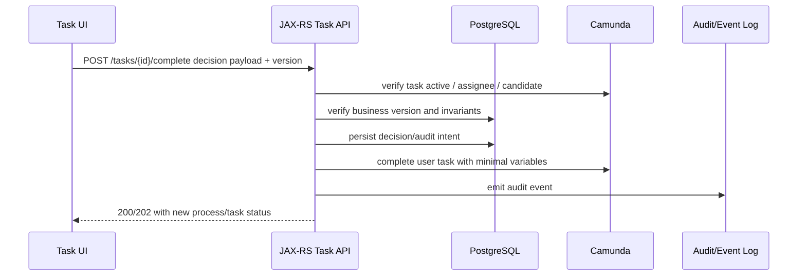

# Part 038 — Human Task UX and Backend Contract

## 1. Core mental model

A human task is not just “a screen where someone clicks approve.”

In workflow systems, a human task is a **controlled business decision point** with lifecycle, authorization, auditability, SLA, concurrency, and operational consequences.

A good human task contract answers:

- Who can see the task?
- Who can claim it?
- Who is allowed to complete it?
- What data must be shown?
- What data can be edited?
- What validation applies?
- What decision is being captured?
- What audit evidence is required?
- What happens when the task ages?
- What happens when two users act at the same time?
- What happens if the task disappears while the UI is open?
- What process path is taken after completion?

In CPQ/order management, a human task may represent:

- pricing approval;
- quote approval;
- order fallout resolution;
- manual validation;
- exception handling;
- cancellation approval;
- amendment review;
- provisioning intervention;
- SLA escalation decision;
- reconciliation confirmation.

This means the backend contract must be stricter than a normal CRUD form.

## 2. User task vs Tasklist vs custom task UI

Do not collapse these concepts:

| Concept | Meaning |
|---|---|
| BPMN user task | BPMN element where process waits for human work |
| Camunda Tasklist | Camunda-provided UI/API for user task interaction |
| Custom task application | Internal frontend/backend built around Camunda task APIs or mirrored task data |
| Business task | The business decision or manual activity represented by the task |
| Form | UI schema or screen used to capture input |
| Assignment rule | Logic determining assignee/candidate users/groups |
| Authorization rule | Security rule determining who may view/act |
| Audit trail | Evidence of who did what, when, and why |

A BPMN user task does not automatically solve UX, authorization, audit, SLA, or business validation. Those require explicit design.

## 3. Lifecycle of a human task



Not every system implements every state explicitly, but production behavior usually exists whether the model names it or not.

If the backend does not define this lifecycle, the frontend will invent one.

## 4. Minimum backend contract for human task API

A custom task backend should expose clear operations.

### List tasks

```http
GET /tasks?status=open&candidateGroup=pricing-approver&sort=dueDate
```

Contract concerns:

- pagination;
- filtering;
- sorting;
- authorization;
- tenant isolation;
- task aging;
- SLA indicators;
- stale task exclusion;
- search performance;
- sensitive field minimization.

### Get task detail

```http
GET /tasks/{taskId}
```

Contract concerns:

- task metadata;
- process/business identifiers;
- form schema or screen type;
- current variables needed by UI;
- user permissions;
- optimistic version/ETag;
- due date/follow-up date;
- audit summary;
- allowed actions.

### Claim task

```http
POST /tasks/{taskId}/claim
```

Contract concerns:

- only allowed candidate can claim;
- already claimed task returns deterministic response;
- concurrent claim handled safely;
- audit event created;
- process/task state not corrupted.

### Unclaim task

```http
POST /tasks/{taskId}/unclaim
```

Contract concerns:

- only current assignee or privileged role can unclaim;
- task becomes visible to candidates again;
- audit event created;
- stale UI gets clear response.

### Save draft

```http
PUT /tasks/{taskId}/draft
```

Contract concerns:

- draft is not process completion;
- draft validation may be weaker than submit validation;
- draft ownership is clear;
- draft data retention is defined;
- sensitive draft data is protected;
- concurrent draft updates are controlled.

### Complete task

```http
POST /tasks/{taskId}/complete
```

Contract concerns:

- user is authorized;
- task is still active;
- submitted form is valid;
- decision is explicit;
- required comment/reason captured;
- process variables are minimal and controlled;
- downstream process path is deterministic;
- duplicate complete is safe;
- audit event is durable.

## 5. Assignment is not authorization

Assignment answers:

> “Who is expected to work on this?”

Authorization answers:

> “Who is legally/technically allowed to view or perform this action?”

They often overlap, but they are not identical.

Bad design:

```text
candidateGroup = pricing-team
therefore everyone in pricing-team can see all pricing tasks across all tenants/customers/products
```

Better design:

```text
candidateGroup = pricing-approver
AND tenant permission
AND product segment permission
AND region permission
AND task action permission
```

For CSG-like enterprise systems, task visibility may need to include:

- tenant/customer boundary;
- market/region;
- product family;
- contract sensitivity;
- quote/order ownership;
- escalation role;
- separation of duties;
- break-glass access.

## 6. Camunda 7 vs Camunda 8 considerations

### Camunda 7

Typical concepts:

- user task in BPMN;
- TaskService;
- assignee;
- candidate users/groups;
- task listeners;
- task variables;
- form integration depending on implementation;
- Tasklist/Cockpit if used;
- authorization model if enabled.

Java/JAX-RS applications may either:

- call Camunda TaskService directly in the same app;
- expose task APIs that wrap TaskService;
- mirror tasks into internal database/search index;
- use Camunda Tasklist as-is.

### Camunda 8

Typical concepts:

- user task in BPMN;
- Tasklist;
- assignee/candidate users/groups depending on user task type and Tasklist/authorization model;
- Tasklist API;
- forms;
- Identity/authorization model;
- job worker-like behavior for listeners in newer platform capabilities if used.

Important: actual behavior around task visibility, candidate users/groups, authorization, Tasklist version, and custom task UI must be verified against the Camunda version and deployment model in use.

Do not assume Camunda 7 TaskService semantics map one-to-one to Camunda 8 Tasklist semantics.

## 7. Human task data model

A human task usually needs at least these identifiers:

| Field | Purpose |
|---|---|
| taskId | engine/task identifier |
| processInstanceId/key | trace to workflow runtime |
| processDefinitionKey | type of process |
| businessKey/correlationKey | link to quote/order/customer |
| tenantId | isolation boundary |
| taskType | business meaning of task |
| assignee | current owner |
| candidateGroups | eligible groups |
| dueDate | SLA tracking |
| createdAt | aging calculation |
| claimedAt | ownership tracking |
| completedAt | audit |
| decision | business outcome |
| decisionReason | audit/explanation |
| version/etag | concurrency control |

Do not expose raw process variables blindly to the frontend.

Use a task view model:

```json
{
  "taskId": "abc123",
  "taskType": "PRICING_APPROVAL",
  "businessRef": {
    "quoteId": "Q-12345",
    "customerName": "Acme Corp"
  },
  "state": "CLAIMED",
  "assignee": "user-42",
  "dueDate": "2026-07-12T09:00:00Z",
  "allowedActions": ["SAVE_DRAFT", "APPROVE", "REJECT", "UNCLAIM"],
  "version": "17"
}
```

This protects the UI from engine internals and protects the engine from UI coupling.

## 8. Form contract

A form contract should define:

- schema version;
- required fields;
- read-only fields;
- editable fields;
- validation rules;
- conditional fields;
- allowed decisions;
- evidence/comment requirements;
- attachment policy;
- sensitive fields;
- output variable mapping;
- audit fields.

### Bad form pattern

```json
{
  "approved": true,
  "data": "...huge arbitrary payload..."
}
```

### Better form pattern

```json
{
  "decision": "APPROVE",
  "reasonCode": "MARGIN_EXCEPTION_ACCEPTED",
  "comment": "Approved after review of enterprise agreement terms.",
  "reviewedPriceVersion": "PV-2026-07-11-01"
}
```

A task completion payload should capture the business decision, not dump the entire screen state into process variables.

## 9. Validation model

Validation should happen in layers:

| Layer | Responsibility |
|---|---|
| Frontend | immediate UX feedback |
| Task API | security, task state, payload shape, action permission |
| Domain service | business invariant and illegal transition guard |
| Workflow model | process routing based on validated decision |
| Worker/downstream service | side-effect validation and integration guard |

Never rely only on frontend validation.

For example, pricing approval completion should check:

- task is active;
- user is authorized;
- quote still exists;
- quote version matches reviewed version;
- margin exception still applies;
- approval threshold matches user authority;
- required comment exists;
- decision is valid for current quote state;
- completion has not already happened.

## 10. Concurrency and stale UI

Human tasks are prone to stale UI.

Examples:

- User A opens task.
- User B claims task.
- User A tries to complete task.

Or:

- User A opens approval task.
- Quote is amended by another process.
- User A approves stale quote version.

The backend must reject stale actions.

Patterns:

- ETag/version on task detail;
- quote/order version check;
- task active check before completion;
- assignee check;
- optimistic locking in business DB;
- clear error response for stale UI;
- frontend refresh instruction.

Example response:

```json
{
  "errorCode": "TASK_STALE",
  "message": "The task has changed since it was opened. Refresh before continuing.",
  "currentTaskState": "CLAIMED_BY_OTHER_USER"
}
```

Avoid generic `500` for stale task behavior. It is a normal concurrency case.

## 11. Complete task is a command, not a form save

Completing a task advances the process.

That means it may trigger:

- gateway routing;
- service task execution;
- event publication;
- downstream order action;
- compensation path;
- SLA closure;
- customer-visible status change.

Therefore `complete task` must be treated as a command with business impact.

A safe completion flow:



The exact order depends on internal architecture, but the consistency model must be explicit.

## 12. Completing task and database transaction boundary

A difficult question:

> “Should we update PostgreSQL first or complete the Camunda task first?”

There is no universal answer because Camunda and business database may not share the same transaction boundary.

### DB first

```text
1. persist approval decision
2. complete task
```

Risk:

- DB commit succeeds;
- task completion fails;
- system shows approval decision but workflow still waits.

Mitigation:

- completion retry;
- outbox command to complete task;
- reconciliation process;
- idempotent complete operation.

### Camunda first

```text
1. complete task
2. persist approval decision
```

Risk:

- process advances;
- DB write fails;
- audit/domain evidence missing.

This is usually worse for human decision audit.

### Recommended mindset

For auditable decisions, persist decision evidence durably before or atomically with completion if supported. If atomic transaction is impossible, use outbox/reconciliation and make completion idempotent.

## 13. Task audit model

Human task audit should answer:

- who saw the task;
- who claimed it;
- who completed it;
- when it was completed;
- what decision was made;
- what data version was reviewed;
- what comment/reason was provided;
- what authorization allowed the action;
- whether task was escalated/reassigned;
- whether task was completed after SLA breach;
- whether break-glass access was used.

Minimum audit event:

```json
{
  "eventType": "TASK_COMPLETED",
  "taskId": "abc123",
  "processInstanceKey": "2251799813685249",
  "businessKey": "QUOTE-Q-12345",
  "tenantId": "tenant-a",
  "actor": "user-42",
  "decision": "APPROVE",
  "reasonCode": "MARGIN_EXCEPTION_ACCEPTED",
  "reviewedBusinessVersion": "quote-version-19",
  "timestamp": "2026-07-11T10:00:00Z",
  "correlationId": "req-789"
}
```

Audit should not depend only on frontend logs.

## 14. SLA and aging

A human task without SLA usually becomes an invisible queue.

SLA model should define:

- due date;
- follow-up date;
- priority;
- escalation path;
- interrupting vs non-interrupting escalation;
- reminder cadence;
- ownership after escalation;
- business impact of breach;
- dashboard metric;
- customer notification rule if applicable.

In BPMN, SLA may be modeled with boundary timer events or event subprocesses. In backend/task UI, it must appear in sorting, filtering, dashboard, and alerting.

Metrics:

- task age;
- tasks created per day;
- tasks completed per day;
- backlog by group;
- overdue count;
- SLA breach rate;
- median completion time;
- p95 completion time;
- reassignment count;
- claim-to-complete duration;
- aging by tenant/product/region.

## 15. Task search and list performance

Task lists are operational screens. They must be fast and filterable.

Common filters:

- candidate group;
- assignee;
- tenant/customer;
- quote/order ID;
- process type;
- task type;
- priority;
- due date;
- SLA breached;
- created date;
- escalation status;
- product family;
- region;
- risk flag.

Performance risk:

- querying engine runtime tables directly;
- joining large process variable tables;
- exposing arbitrary variable search;
- missing tenant filters;
- sorting by non-indexed fields;
- high-cardinality dashboard queries;
- loading full variable payload for list screen.

A production task UI often needs a read-optimized projection or search index, but that projection must be reconciled with Camunda/task source of truth.

## 16. Human task and Redis

Redis can support task UX but must be used carefully.

Good uses:

- task count cache;
- user filter preferences;
- short-lived UI session state;
- temporary autosave if loss is acceptable;
- rate limiting task search;
- cache reference data for forms.

Dangerous uses:

- storing final approval decision only in Redis;
- storing audit comment only in Redis;
- storing task assignment source of truth only in Redis;
- using Redis lock as the only protection against concurrent completion;
- caching sensitive form data without retention/access controls.

If human task output is compliance-relevant, it must be durable and auditable.

## 17. Integration with Kafka/RabbitMQ

Human task completion often emits events or commands.

Examples:

- `QuoteApproved`
- `QuoteRejected`
- `OrderFalloutResolved`
- `ManualProvisioningApproved`
- `CancellationApproved`

Pattern:

```text
complete task
  -> persist audit decision
  -> process advances
  -> worker publishes event via outbox
```

Avoid publishing critical business events directly from the frontend or before durable task completion.

Risks:

- event published but task completion fails;
- task completed but event not published;
- duplicate completion publishes duplicate event;
- event lacks task/process correlation metadata;
- downstream cannot trace human decision.

Event metadata should include:

- business key;
- process instance key/id;
- task ID;
- actor/user ID;
- decision;
- correlation ID;
- causation ID;
- tenant ID;
- reviewed business version.

## 18. Authorization failure modes

| Failure mode | Impact | Prevention |
|---|---|---|
| task visible to wrong group | data leak / unauthorized decision | strict task visibility and tenant filters |
| user can complete unassigned task | process integrity issue | assignee/candidate/action permission check |
| candidate group too broad | excessive access | least-privilege group design |
| frontend hides action but API allows it | privilege escalation | backend authorization always enforced |
| stale identity mapping | user loses/gains access incorrectly | sync monitoring and fallback process |
| break-glass not audited | compliance issue | explicit break-glass reason and audit |
| task variables expose PII | privacy issue | task view model and field-level filtering |
| tenant filter missing | cross-tenant data exposure | tenant-aware query enforcement |

## 19. Business failure modes

| Failure mode | Symptom | Likely cause |
|---|---|---|
| Task not visible | user cannot find work | assignment/authorization/search projection issue |
| Task visible but cannot claim | stale task or permission mismatch | task already claimed / wrong group |
| Task cannot complete | validation/process variable issue | missing required output variable |
| Task completed but process stuck | gateway condition mismatch | decision variable name/value wrong |
| Task completed twice | duplicate request / stale UI | missing idempotency/concurrency guard |
| Wrong approver completed task | weak authorization | assignment treated as authorization |
| SLA breached silently | missing timer/alert | no observability |
| Decision not auditable | evidence missing | completion payload too weak |
| Approval based on stale quote | business version not checked | no optimistic version validation |
| Reassignment lost | state stored outside durable system | projection/Redis-only state |

## 20. Production debugging playbook

When a user says “I cannot see/complete my task,” debug in this order:

1. Identify task ID, process instance ID/key, business key, tenant, user, group, and timestamp.
2. Check whether task exists and is active in Camunda/Tasklist/source of truth.
3. Check assignee, candidate users, candidate groups, and authorization model.
4. Check tenant/customer/product/region filters.
5. Check whether custom task projection/search index is stale.
6. Check if task was claimed by another user.
7. Check if task was completed/cancelled/escalated already.
8. Check frontend task version/ETag against current backend version.
9. Check process variables required by form or completion mapping.
10. Check gateway condition after task completion if process stuck.
11. Check audit logs for claim/complete/reassign events.
12. Check worker/job failures triggered after completion.
13. Check SLA/timer events if escalation expected.
14. Check Redis/cache only after durable task/process state is known.

Do not manually complete or delete tasks before understanding downstream process impact.

## 21. API response design

Human task APIs should return errors that are operationally meaningful.

| Error code | Meaning |
|---|---|
| `TASK_NOT_FOUND` | task ID does not exist or not visible to caller |
| `TASK_NOT_ACTIVE` | task already completed/cancelled/migrated |
| `TASK_ALREADY_CLAIMED` | another user owns the task |
| `TASK_NOT_ASSIGNED_TO_USER` | current user cannot complete |
| `TASK_STALE` | version mismatch or business object changed |
| `TASK_VALIDATION_FAILED` | payload incomplete or invalid |
| `TASK_DECISION_NOT_ALLOWED` | decision invalid for current business state |
| `TASK_AUTHORIZATION_FAILED` | caller lacks permission |
| `TASK_COMPLETION_UNKNOWN` | backend cannot determine completion outcome |
| `PROCESS_ADVANCE_FAILED` | task completion or subsequent process step failed |

Avoid returning only `500`. Human task errors are often expected domain/concurrency/security outcomes.

## 22. Observability checklist

Track at least:

- open tasks by type/group/tenant;
- overdue tasks;
- task age p50/p95/p99;
- claim-to-complete duration;
- unclaimed task backlog;
- reassignment count;
- completion failure count;
- stale completion attempt count;
- authorization denial count;
- form validation failure count;
- task projection lag if custom projection exists;
- process incidents after task completion;
- SLA breach rate;
- manual repair count;
- break-glass access count.

Logs should include:

- correlation ID;
- task ID;
- process instance key/id;
- business key;
- actor ID;
- tenant ID;
- action;
- decision;
- task version;
- business object version;
- authorization decision reason;
- outcome.

## 23. PR review checklist

### Task modelling

- Is this really a human task or should it be automated?
- Is the task name business-readable?
- Is assignment defined clearly?
- Is due date/SLA defined?
- Is escalation path defined?
- Is completion output minimal and explicit?

### API contract

- Are list/detail/claim/unclaim/save/complete operations defined?
- Are errors deterministic and meaningful?
- Is duplicate completion safe?
- Is stale UI handled?
- Is idempotency considered?
- Is pagination/filtering safe and tenant-aware?

### Authorization

- Is backend authorization enforced independent of frontend?
- Is assignment separated from permission?
- Are tenant/customer/product/region constraints applied?
- Is break-glass access audited?

### Data and validation

- Are form fields versioned?
- Are required decision reasons captured?
- Is business object version checked?
- Are sensitive variables hidden?
- Are process variables minimal?

### Consistency

- Is task completion consistent with PostgreSQL/domain state?
- Is audit persisted durably?
- Is outbox/event publication safe?
- Is process advance failure recoverable?

### Operations

- Are task metrics/dashboard available?
- Are SLA alerts defined?
- Is projection lag monitored?
- Is manual repair runbook defined?
- Can support trace task from UI to process instance to business object?

## 24. Internal verification checklist

Verify these inside CSG/team context:

- Does Quote & Order use Camunda Tasklist, custom task UI, or both?
- Are user tasks modeled in BPMN or represented in internal tables?
- Which task lifecycle states are supported: claim, unclaim, delegate, reassign, save draft, complete?
- Are candidate users/groups used?
- Is Tasklist V1/V2 or another task model used?
- How is task visibility implemented?
- Is assignment different from authorization?
- Which identity provider/group mapping is used?
- Is tenant/customer/product/region filtering enforced?
- Are forms Camunda forms, custom frontend forms, or backend-driven schemas?
- Where are task drafts stored?
- Where are approval decisions and comments stored?
- Is task completion audited outside Camunda history?
- Are task variables sensitive?
- Is task completion protected from stale quote/order version?
- Is duplicate completion idempotent?
- Are task events published to Kafka/RabbitMQ?
- Is there a task projection/search index?
- Is projection lag monitored?
- Are aging tasks and SLA breaches visible on dashboard?
- Is there a runbook for invisible task, stuck task, and wrong assignment?
- Who owns human task UX: backend, frontend, product, BA, workflow/platform team, or SRE?

## 25. Senior engineer takeaway

Human tasks are where workflow meets real organizational behavior.

A weak human task design creates:

- invisible queues;
- unauthorized approvals;
- stale decisions;
- audit gaps;
- SLA breaches;
- manual repair chaos;
- angry operations teams.

A strong human task design treats every user action as a controlled business command.

The senior review question is:

> “Can we prove who made the decision, on what data, with what authority, at what time, and how the process advanced afterward?”

If the answer is unclear, the task contract is not production-ready.

## References

- Camunda 8 documentation — User tasks: https://docs.camunda.io/docs/components/modeler/bpmn/user-tasks/
- Camunda 8 documentation — Tasklist user guide: https://docs.camunda.io/docs/components/tasklist/userguide/using-tasklist/
- Camunda 8 documentation — User task access restrictions: https://docs.camunda.io/docs/components/tasklist/user-task-access-restrictions/
- Camunda 8 best practices — Understanding human task management: https://docs.camunda.io/docs/components/best-practices/architecture/understanding-human-tasks-management/
- Camunda 8 API — Assign task: https://docs.camunda.io/docs/apis-tools/tasklist-api-rest/specifications/assign-task/
