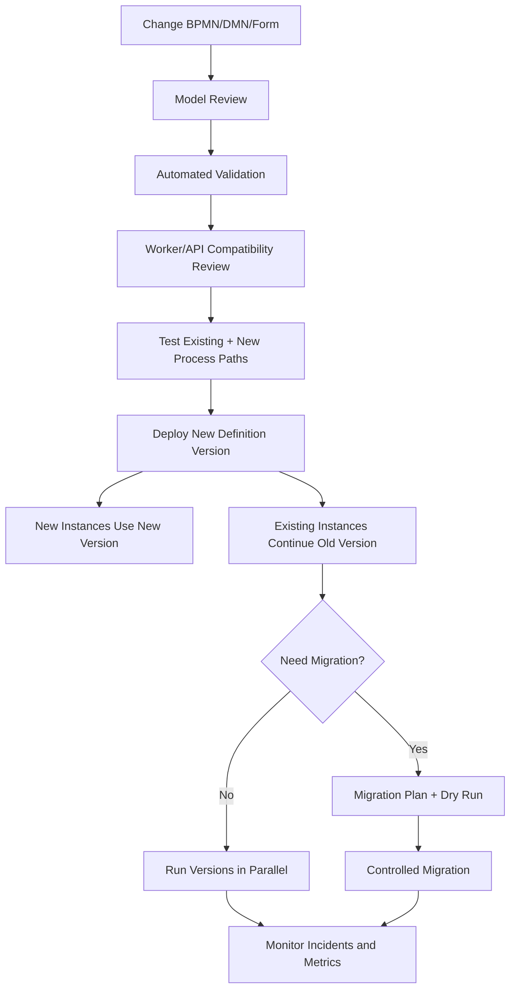

# Part 041 — Process Versioning and Deployment

## 1. Core mental model

A BPMN deployment is not only a file upload.

It is the moment a new executable business process contract becomes available to production.

That contract affects:

- new process instances;
- running process instances;
- worker job types;
- Java delegates;
- external task topics;
- Zeebe job workers;
- process variables;
- message correlation;
- timer subscriptions;
- user task forms;
- task assignment;
- DMN decisions;
- APIs that start or query workflow;
- operational dashboards;
- incident runbooks;
- compliance/audit evidence.

Senior rule:

> Treat BPMN/DMN/form deployment like application deployment with stateful backward compatibility constraints.

A workflow definition may outlive multiple application releases. A running order process may still be executing yesterday's BPMN while today's worker code is deployed. That is where many production workflow bugs come from.

## 2. What process definition versioning means

A process definition is the deployed executable BPMN model.

A process instance is a running execution of one process definition version.

When a process definition changes and is deployed, the engine typically registers a new version for the same process ID/key. The usual runtime model is:

- running instances continue on the process definition version they started with;
- new instances usually start on the latest version unless a specific version is requested;
- multiple versions may run in parallel;
- workers and APIs must remain compatible with all active versions.

This is convenient, but dangerous if the team assumes deployment means all in-flight processes immediately use the new model.

They usually do not.

## 3. Versioning lifecycle

A safe lifecycle looks like this:



The most important question after deployment is not "was the BPMN deployed?"

The real question is:

> Which runtime population is now executing which process version, with which worker code, variable contract, and correlation contract?

## 4. Deployment is different from migration

Do not collapse these concepts:

| Concept | Meaning | Risk |
|---|---|---|
| Deploy new process version | Make a new BPMN/DMN/form version available | new instances may behave differently |
| Run versions in parallel | Old and new instances coexist | worker/API compatibility burden |
| Migrate running instances | Move active instances from one definition to another | state corruption if mapping is wrong |
| Modify process instance | Repair a specific instance state without changing definition | operational surgery risk |
| Cancel/restart | Stop an instance and recreate from known state | new IDs/keys and audit complexity |
| Roll back deployment | Stop starting new instances on bad version | running instances may already exist |

Senior engineers must force the team to name which operation they intend.

"We need to deploy the new BPMN" and "we need to migrate all running orders" are not the same operation.

## 5. Camunda 7 versioning mental model

In Camunda 7:

- BPMN/DMN deployments are persisted in the engine database;
- process definitions get versions;
- the latest version is often used when starting by process definition key;
- starting by process definition ID targets an exact definition version;
- running instances execute according to their bound definition version;
- Java delegates and listeners are loaded from application code, not versioned the same way as BPMN;
- external task topics may be consumed by workers that are deployed independently;
- history tables preserve execution evidence depending on history level and cleanup policy.

The biggest Camunda 7 deployment hazard is **model-code skew**.

Example:

- BPMN v3 references delegate class `ValidateOrderDelegate`.
- application release v10 changes behavior of that delegate;
- old process instances from BPMN v1/v2 still call the same class name;
- the code now assumes variables introduced only in BPMN v3;
- old instances fail with missing variable or wrong branch.

This is why senior review must include both BPMN version and Java class compatibility.

## 6. Camunda 8 / Zeebe versioning mental model

In Camunda 8/Zeebe:

- process models are deployed to the orchestration cluster;
- process definitions get versions;
- process instances execute against the deployed process version they started with;
- service tasks create jobs using job type and variable context;
- job workers are external processes/services;
- worker code is deployed independently from BPMN;
- Operate can show process versions and instances;
- migration can be done through operations tooling or APIs, subject to limitations;
- search/export components may lag or fail independently from execution.

The biggest Camunda 8 deployment hazard is **job contract skew**.

Example:

- BPMN v4 uses job type `order.reserveInventory` with variable `orderLineIds`.
- worker release v12 now expects `reservationRequest.items`.
- old instances still create `order.reserveInventory` jobs with old variable shape.
- the worker crashes or fails the job repeatedly.
- incidents appear even though the new BPMN is correct.

A Zeebe job type is a distributed contract. Treat it like an API endpoint.

## 7. Version tag and process identity discipline

A process definition should have stable identity and explicit release metadata.

Common identity fields/concepts:

| Concept | Purpose | Review concern |
|---|---|---|
| Process ID/key | stable technical identity | must not change casually |
| Process name | human-readable label | avoid ambiguous names |
| Version | engine-assigned definition version | useful for runtime selection |
| Version tag | release/business version metadata if used | align with release notes |
| Business key/correlation key | instance-level business identity | must be stable and searchable |
| Deployment ID/key | technical deployment record | needed for debugging |
| Git commit/SHA | artifact provenance | required for auditability |

Process ID changes are not cosmetic. They can break:

- start-by-key calls;
- message correlation;
- dashboards;
- monitoring filters;
- migration plans;
- authorization rules;
- reporting;
- incident runbooks.

## 8. Starting latest vs starting exact version

There are two broad start strategies:

### Start latest

Use the latest deployed version by process key.

Good when:

- new instances should always use the newest process;
- rollout is tightly controlled;
- compatibility is well-tested;
- there is no need for client-driven version selection.

Risk:

- a bad deployment affects all new starts immediately;
- clients may unknowingly start a new version;
- behavior changes without API contract change.

### Start exact version

Start a specific process definition version or ID.

Good when:

- external clients need stable behavior;
- process version is part of product/order contract;
- rollout is phased;
- canary or tenant-specific rollout is needed.

Risk:

- client/API must know version selection;
- old versions may stay active too long;
- operational complexity increases.

Senior default:

> Start latest only when the API and process contract are intentionally designed for latest behavior.

For long-running enterprise order processes, version choice is a business and operational decision, not just a technical default.

## 9. Running versions in parallel

Running versions in parallel is often the safest default after deployment.

It avoids immediate migration risk. But it creates compatibility obligations:

- worker must handle old and new variables;
- user task forms must remain available for old tasks;
- DMN decisions must remain callable if old BPMN references them;
- message names and correlation keys must remain compatible;
- timer behavior must be understood for old instances;
- incident runbooks must know old process versions;
- dashboards must distinguish old vs new version failures.

Parallel versions are safe only if the team actively manages them.

Unmanaged parallel versions become process archaeology.

## 10. When to migrate running instances

Migration may be appropriate when:

- the old process has a production bug;
- the old path will cause future incident or wrong business outcome;
- operational complexity of parallel versions is too high;
- a regulatory/commercial rule must apply to active cases;
- a new manual intervention task must be inserted before completion;
- a broken gateway/timer/message expression must be fixed for stuck instances.

Migration may be wrong when:

- the change is purely for new business behavior;
- active instances are already past the changed section;
- variable shape differs too much;
- external systems already observed the old state;
- compensation/reconciliation is not understood;
- there is no dry-run or rollback plan;
- the team cannot identify affected instance population.

Migration is not a substitute for poor deployment discipline.

## 11. Change classification

Before deployment, classify the BPMN/DMN/form change.

| Change | Usually safe? | Review focus |
|---|---:|---|
| Rename label only | often | confirm element ID unchanged if needed |
| Rename element ID | risky | migration, history, dashboards, incidents |
| Add new path for new instances | often | gateway default, variable availability |
| Change service task job type/topic | risky | worker compatibility |
| Change Java delegate class/expression | risky | old instance compatibility |
| Change input/output mapping | risky | variable compatibility |
| Change message name | high risk | correlation compatibility |
| Change correlation key | high risk | callback/event integration |
| Add timer boundary | medium/high | SLA behavior and migration impact |
| Remove timer | medium/high | escalation behavior and active subscriptions |
| Change user task form | medium | old tasks and audit |
| Change assignment rule | medium/high | authorization and task visibility |
| Change DMN decision output | risky | downstream worker/API contract |
| Remove activity | high risk | migration mapping and running tokens |
| Change gateway semantics | high risk | correctness and stuck token risk |
| Change compensation | high risk | recovery correctness |

The most dangerous changes are not visually large. A one-line expression change can break thousands of active instances.

## 12. Compatibility dimensions

Deployment review must cover several contracts.

### BPMN compatibility

Questions:

- Are element IDs stable where needed?
- Are old active paths still valid?
- Are gateway conditions compatible with existing variables?
- Are timers/messages/events changed intentionally?
- Are compensation/error paths still reachable?

### Worker compatibility

Questions:

- Can current worker process jobs from old versions?
- Can old worker process jobs from new version during rolling deployment?
- Are job type/topic names stable?
- Are required variables versioned or optional?
- Is idempotency key unchanged?

### Variable compatibility

Questions:

- Are new variables optional for old instances?
- Are removed variables still referenced by old BPMN?
- Are variable type changes backward-compatible?
- Are defaults applied safely?
- Are large/sensitive variables introduced?

### Message compatibility

Questions:

- Did message name change?
- Did correlation key change?
- Do external systems know the new contract?
- What happens to late messages for old instances?
- Does replay create duplicate correlation?

### Human task compatibility

Questions:

- Are old task forms still deployed/served?
- Do old task completion APIs still accept old payload shape?
- Did assignment rule change?
- Did task authorization change?
- Can users complete tasks created before deployment?

### DMN compatibility

Questions:

- Is decision key stable?
- Did hit policy change?
- Did output column name/type change?
- Does BPMN bind to latest or specific decision version?
- Are old approval decisions auditable?

## 13. Deployment pipeline for workflow artifacts

A production-grade pipeline should treat BPMN/DMN/forms as code.

Minimum pipeline stages:

```mermaid
flowchart LR
    A[Pull Request] --> B[Static Model Validation]
    B --> C[Semantic Review]
    C --> D[Unit/Scenario Tests]
    D --> E[Worker Contract Tests]
    E --> F[Integration Tests]
    F --> G[Security/PII Scan]
    G --> H[Approval]
    H --> I[Deploy to Lower Env]
    I --> J[Smoke Test]
    J --> K[Deploy to Production]
    K --> L[Monitor Version-Specific Metrics]
```



Pipeline should validate:

- BPMN XML is syntactically valid;
- required Camunda extension attributes exist;
- service task job type/topic has a known worker;
- user task form reference exists;
- DMN reference exists;
- message names are registered/documented;
- correlation keys are documented;
- variable names match worker contract;
- sensitive variable names are flagged;
- timer definitions are reviewed;
- process ID changes are blocked unless explicitly approved.

## 14. GitOps deployment discipline

If workflow artifacts are deployed through GitOps:

- BPMN/DMN/forms should live in version-controlled repositories;
- deployed version should be traceable to commit SHA;
- environment promotion should be explicit;
- drift between repository and deployed engine should be detectable;
- rollback should be an explicit operation;
- manual deployment through UI should be controlled or audited;
- emergency deployment should create follow-up repository reconciliation.

Dangerous smell:

> Production process model exists only in Camunda runtime and not in Git.

That means the team cannot reliably review, reproduce, diff, or roll back process behavior.

## 15. Java/JAX-RS impact

Workflow deployment affects Java/JAX-RS APIs in several ways.

### Start endpoint

Example endpoint:

```http
POST /orders/{orderId}/workflow/start
Idempotency-Key: ...
X-Correlation-Id: ...
```

Review questions:

- Does it start latest or exact process version?
- Is the version selection explicit?
- Is the request idempotent?
- Is business key stable?
- Does API response expose process version?
- Does API contract change when BPMN changes?

### Status endpoint

Example endpoint:

```http
GET /orders/{orderId}/workflow/status
```

Review questions:

- Does it distinguish process version?
- Does it map internal BPMN state to stable external status?
- Does it expose sensitive variable/task data?
- Does it handle multiple process instances per order?
- Does it handle migrated instances?

### Task completion endpoint

Example endpoint:

```http
POST /tasks/{taskId}/complete
```

Review questions:

- Does it validate task belongs to current user/tenant/order?
- Does it support old form payload shape?
- Does it handle stale task completion?
- Is completion idempotent or safely rejected?
- Does it expose clear error mapping?

## 16. PostgreSQL/MyBatis/JDBC impact

Workflow versioning must align with business database schema evolution.

Common failure:

1. BPMN v5 introduces variable `approvalPolicyVersion`.
2. Worker v9 expects new column `approval_policy_version`.
3. DB migration is deployed after worker or BPMN.
4. Jobs fail with SQL errors.
5. Retry storm begins.

Safe ordering should be explicit.

Typical expand-contract sequence:

1. Add nullable column/table/index.
2. Deploy worker that can handle old and new shape.
3. Deploy BPMN that starts writing new shape.
4. Backfill/reconcile if needed.
5. Monitor old version population.
6. Remove old shape only after no active instances depend on it.

MyBatis mapper review:

- avoid assuming new variable field exists;
- make reads tolerant during rollout;
- use optimistic locking for state transitions;
- keep idempotency/processed-job tables compatible;
- ensure DB migration and BPMN deployment are ordered.

## 17. Kafka/RabbitMQ/Redis impact

### Kafka

Versioning risks:

- old process publishes old event schema;
- new process publishes new event schema;
- consumer cannot handle both;
- replay starts processes using obsolete assumptions;
- message correlation key changes while old events still arrive.

Mitigation:

- version event schema;
- maintain backward-compatible consumers;
- include process version metadata where useful;
- keep correlation keys stable;
- define replay policy per process version.

### RabbitMQ

Versioning risks:

- routing key changes;
- reply queue correlation changes;
- DLQ contains messages for old workflow contract;
- retry policy changes while messages are pending;
- worker handles old/new command shape incorrectly.

Mitigation:

- version message payload;
- preserve routing for old versions until drained;
- document DLQ replay rules;
- avoid blind requeue across model versions.

### Redis

Versioning risks:

- cached workflow status does not include version;
- idempotency key format changes;
- lock key format changes;
- feature flag changes process behavior mid-instance;
- stale cache hides migration/deployment result.

Mitigation:

- include version in cache value where relevant;
- keep idempotency key stable;
- use short TTL for derived state;
- invalidate cache on deployment/migration events;
- do not use Redis as source of truth for process version.

## 18. Kubernetes/cloud/on-prem impact

Workflow deployment is rarely just BPMN deployment.

It may require coordinated rollout of:

- worker Deployment;
- Java/JAX-RS service;
- BPMN/DMN/form artifact;
- database migration Job;
- connector runtime configuration;
- Kubernetes Secret/ConfigMap;
- feature flag;
- Kafka/RabbitMQ schema/routing config;
- Redis key policy;
- dashboard/alert rules;
- runbook update.

In Kubernetes:

- rolling deployment can temporarily run old and new workers together;
- job workers must be backward-compatible during rollout;
- graceful shutdown must stop job activation before pod termination;
- readiness probe should reflect worker ability to handle current contract;
- ConfigMap/Secret versioning must be controlled.

In cloud/on-prem/hybrid:

- network routes and IAM/managed identity changes must align with process deployment;
- on-prem customer environments may upgrade slower;
- air-gapped deployments require artifact provenance;
- rollback may be constrained by DB/search/schema migration.

## 19. Safe rollout patterns

### Pattern A — Compatible first

Use when BPMN introduces new variable/worker behavior.

1. Deploy worker compatible with old and new contracts.
2. Deploy DB/schema expansion if needed.
3. Deploy BPMN new version.
4. Monitor new version.
5. Remove old compatibility only after old instances drain.

### Pattern B — Versioned job type

Use when worker behavior changes incompatibly.

- old BPMN uses `order.validate.v1`;
- new BPMN uses `order.validate.v2`;
- old worker handles v1;
- new worker handles v2;
- old versions drain naturally.

This increases operational complexity but reduces ambiguity.

### Pattern C — Feature-gated start

Use when rollout should be tenant/customer/region-specific.

- API decides which process version/key to start;
- feature flag is evaluated before process start;
- started process behavior remains stable for that instance;
- do not change flag mid-instance unless intentionally modelled.

### Pattern D — Drain old versions

Use when migration risk is higher than waiting.

- deploy new version for new instances;
- let old instances complete;
- block new starts on old version;
- keep old worker/forms until population reaches zero;
- archive runbook.

### Pattern E — Controlled migration

Use when old instances must be corrected.

- identify affected population;
- test migration plan;
- run small batch;
- monitor;
- continue in batches;
- keep rollback/manual repair plan.

## 20. Rollback reality

Rollback is not simple for workflow.

Rolling back application code may not roll back:

- process definitions already deployed;
- process instances already started on bad version;
- jobs already created with new job type;
- messages already correlated;
- external API calls already made;
- DB state already transitioned;
- events already published;
- user tasks already completed;
- audit/history records already written.

A realistic rollback plan includes:

- stop starting new instances on bad version;
- disable/scale down problematic workers if needed;
- pause message consumers if safe;
- identify affected process instances;
- decide drain, migrate, modify, compensate, or cancel/restart;
- fix worker compatibility;
- publish corrective events only through controlled process;
- update dashboard and runbook.

Senior rule:

> Workflow rollback is usually a forward recovery operation.

## 21. Failure modes

Common deployment/versioning failures:

| Failure | Symptom | Likely cause |
|---|---|---|
| New process not starting | 404/not found/start failure | process key mismatch or deployment failed |
| Wrong version started | unexpected path | start-latest default or feature flag bug |
| Old instance fails after worker deploy | incidents on old version | worker not backward-compatible |
| Message not correlated | callback ignored | message name/correlation key changed |
| Timer behavior changed unexpectedly | SLA false breach or no escalation | timer definition changed without migration plan |
| User cannot complete old task | form/API rejects payload | old form contract removed |
| DMN decision fails | missing output/input | decision version/output changed |
| DB SQL error after deployment | worker retry storm | DB migration ordering mismatch |
| Duplicate side effect | external API called twice | retry + non-idempotent worker |
| Dashboard misleading | metrics mix versions | no version dimension |

## 22. Detection and observability

Version-aware observability should include:

- process start count by process ID and version;
- active instance count by version;
- completed/cancelled/failed count by version;
- incidents by process version and activity ID;
- job failure rate by job type/topic and process version;
- worker version/build handling each job;
- task aging by process version;
- message correlation failures by message name/version;
- timer backlog by process version;
- DB errors by worker/build;
- deployment event timeline;
- Git commit/build SHA associated with worker and BPMN deployment.

Without version dimensions, a bad deployment can hide inside aggregate metrics.

## 23. Production-safe debugging steps

When a workflow issue appears after deployment:

1. Identify process definition key and version.
2. Identify process instance key/ID and business key.
3. Check whether the instance started before or after deployment.
4. Check active activity/element ID.
5. Check job type/topic and worker build version.
6. Check variable shape and missing fields.
7. Check DMN/form/message/timer references.
8. Check DB migration and application deployment timeline.
9. Check Kafka/RabbitMQ/Redis messages/cache around the same time.
10. Decide whether to retry, fix worker, migrate, modify, compensate, or manually repair.

Never blindly retry all incidents after a deployment until compatibility has been verified.

## 24. PR review checklist

Use this checklist for any PR that changes BPMN, DMN, forms, workers, APIs, or DB schema.

- [ ] Does the process ID/key change?
- [ ] Does any element ID change?
- [ ] Are service task job types/topics changed?
- [ ] Are Java delegate classes/expressions changed?
- [ ] Are external task topics changed?
- [ ] Are Zeebe job types changed?
- [ ] Are process variables added/removed/renamed/type-changed?
- [ ] Are message names or correlation keys changed?
- [ ] Are timers changed?
- [ ] Are boundary events changed?
- [ ] Are gateways or conditions changed?
- [ ] Are user task forms/assignment rules changed?
- [ ] Are DMN inputs/outputs/hit policies changed?
- [ ] Can current workers handle old versions?
- [ ] Can old workers safely coexist during rolling deployment?
- [ ] Is DB migration order safe?
- [ ] Are event schemas backward-compatible?
- [ ] Are sensitive variables introduced?
- [ ] Are metrics/alerts updated?
- [ ] Is rollback/forward recovery documented?
- [ ] Is migration needed for running instances?
- [ ] Is there an internal verification checklist attached?

## 25. Deployment runbook skeleton

A release runbook should include:

### Before deployment

- [ ] Confirm artifact versions and Git commit.
- [ ] Confirm BPMN/DMN/form diff reviewed.
- [ ] Confirm worker/API compatibility.
- [ ] Confirm DB migration status.
- [ ] Confirm external schema/routing changes.
- [ ] Confirm dashboards and alerts.
- [ ] Confirm rollback/forward recovery plan.
- [ ] Confirm migration decision: none, later, immediate, or batch.

### During deployment

- [ ] Deploy DB expansion first if needed.
- [ ] Deploy backward-compatible workers/API.
- [ ] Deploy BPMN/DMN/form artifacts.
- [ ] Run smoke test by starting controlled process instance.
- [ ] Verify process version in runtime tooling.
- [ ] Verify job worker activation/completion.
- [ ] Verify user task form if applicable.
- [ ] Verify message correlation if applicable.

### After deployment

- [ ] Monitor incidents by process version.
- [ ] Monitor job failures by worker version.
- [ ] Monitor task aging/SLA.
- [ ] Monitor DB/Kafka/RabbitMQ/Redis errors.
- [ ] Confirm new process starts use intended version.
- [ ] Confirm old versions still complete safely.
- [ ] Record deployment evidence.

## 26. Internal verification checklist

Verify these in CSG/team context before assuming anything:

- [ ] Whether Camunda is used at all, and which version/platform.
- [ ] Actual process definition keys/IDs for Quote & Order workflows.
- [ ] How BPMN/DMN/forms are stored: Git repo, artifact repo, runtime only, or mixed.
- [ ] Whether deployment is manual, API-driven, CI/CD, GitOps, or platform-managed.
- [ ] Whether new process instances start latest or exact version.
- [ ] Whether process version is visible in API/status/debug tooling.
- [ ] Whether worker job types/topics are versioned or stable.
- [ ] Whether Java delegates must support old BPMN versions.
- [ ] Whether external task workers must support old topics/variables.
- [ ] Whether Zeebe workers are backward-compatible across active process versions.
- [ ] Whether old forms remain available for old user tasks.
- [ ] Whether DMN decisions are version-bound or latest-bound.
- [ ] Whether message names/correlation keys changed historically.
- [ ] Whether DB migrations are coordinated with BPMN deployment.
- [ ] Whether Kafka/RabbitMQ schemas/routing are versioned.
- [ ] Whether Redis cache/idempotency keys include process version assumptions.
- [ ] Whether dashboards include process version dimension.
- [ ] Whether incident runbooks distinguish versions.
- [ ] Whether running instance migration is used or avoided.
- [ ] Whether production rollback is defined as forward recovery.

## 27. Senior engineer heuristics

1. **A BPMN change is a stateful release.** Review it like code plus data migration.
2. **Running instances do not disappear.** Old process versions must remain supported or migrated.
3. **Job type is an API contract.** Breaking it is like changing a REST endpoint without versioning.
4. **Variables are schema.** Treat variable shape changes like database or event schema changes.
5. **Start-latest is a policy.** Do not let it be an accidental default.
6. **Rollback is usually forward repair.** Workflow side effects cannot be uncalled.
7. **Version-aware dashboards are mandatory.** Aggregates hide bad deployments.
8. **Migrate only with evidence.** A migration plan without affected-instance analysis is a gamble.
9. **Git is the source of deployment truth.** Runtime-only model changes are operational debt.
10. **Every BPMN deployment needs an owner.** Someone must own compatibility, incidents, and repair.

## 28. Official documentation anchors

Use these as starting points, then verify exact deployed version:

- Camunda 8 best practices for versioning process definitions.
- Camunda 8 process instance creation and version behavior.
- Camunda 8 process instance migration and Operate migration user guide.
- Camunda 7 process definition, repository service, runtime service, and migration API documentation.
- Camunda 7 database schema and deployment documentation.
- Camunda 8 Zeebe job worker and service task documentation.

Documentation gives the engine semantics. Production safety depends on your deployed topology, worker compatibility, API contract, database migration ordering, and internal release process.
