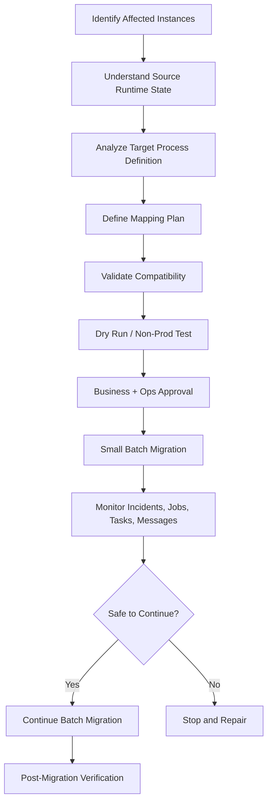

# Part 042 — Process Instance Migration

## 1. Core mental model

Process instance migration is controlled surgery on live workflow state.

It changes which process definition a running instance follows while trying to preserve its runtime state: active element, variables, jobs, incidents, subscriptions, task metadata, and execution context where supported.

It is not a normal deployment.

It is not a retry.

It is not a harmless diagram update.

Senior rule:

> Migration should be treated like production data migration plus state-machine surgery.

A wrong migration can create process states that could never occur through normal BPMN execution. That means the engine may accept the operation, but the business process may become semantically invalid.

## 2. What migration solves

Migration is used when a running process instance should continue under a different process definition.

Common reasons:

- fix a BPMN bug affecting active instances;
- add a required step before completion;
- correct an expression/gateway condition;
- repair a process stuck because of bad model logic;
- move instances away from an obsolete process version;
- reduce operational burden of running multiple versions;
- prepare instances for a larger platform migration;
- align active cases with regulatory or business requirement changes.

Migration is not automatically required for every deployment. Many deployments should let old instances drain naturally.

## 3. Migration vs modification vs cancellation/restart

Do not confuse these operations:

| Operation | What it changes | When to use |
|---|---|---|
| Deploy new version | available process model for new starts | normal rollout |
| Process instance migration | definition binding of running instance | running instances need new model |
| Process instance modification | runtime state of one instance | repair specific stuck/wrong state |
| Retry job | failed job execution attempt | transient or fixed worker error |
| Resolve incident | operational marker after failure fixed | after root cause is fixed |
| Cancel and restart | terminate old instance and create new one | migration unsupported or unsafe |
| Manual repair | controlled data/process correction | business-approved exception path |

Migration changes the map.

Modification changes the current position on the map.

Retry tries the same step again.

Cancel/restart creates a new journey.

## 4. Migration lifecycle

A disciplined migration lifecycle:



The lifecycle starts with affected-instance analysis, not with the migration API.

## 5. Affected-instance analysis

Before designing a migration plan, answer:

- Which process definition key/ID is affected?
- Which source versions are affected?
- How many active instances exist per version?
- Which activities are active?
- Which instances have incidents?
- Which instances have active user tasks?
- Which instances are waiting for message/timer/signal events?
- Which instances have active external tasks/jobs?
- Which business entities are attached to those instances?
- Which tenants/customers/accounts are impacted?
- Which instances are near completion?
- Which instances are in risky compensation/fallout/manual repair states?

Migration by process version alone is too broad. Runtime state matters more than version count.

## 6. Migration plan mental model

A migration plan maps source process elements to target process elements.

The mapping says:

> If an instance is currently active at source element `X`, preserve that active state by moving it to target element `Y`.

Important mapping concerns:

- element type compatibility;
- scope/subprocess compatibility;
- active jobs and their job type/topic;
- local variables;
- event subscriptions;
- incidents;
- user task metadata;
- timer/message/signal behavior;
- gateway state;
- sequence flow state;
- call activity relationship;
- compensation subscriptions.

A migration plan is an executable assumption about runtime state.

## 7. Camunda 7 migration model

In Camunda 7, migration is generally handled through the process engine migration APIs and tooling, depending on edition/tooling availability.

Important concepts:

- source process definition;
- target process definition;
- migration plan;
- migration instruction;
- activity instance mapping;
- validation report;
- migration execution;
- batch migration if supported/used;
- incident/job state interaction;
- history/audit effects.

Camunda 7 migration is tightly connected to its database-backed runtime model. You must consider:

- runtime execution tree;
- activity instance tree;
- transition instances;
- jobs;
- incidents;
- variables;
- task entities;
- history records;
- Java delegate compatibility;
- classloading and deployment cache.

A Camunda 7 migration that maps BPMN correctly can still fail later if Java delegate code or variable contract is incompatible.

## 8. Camunda 8 / Zeebe migration model

In Camunda 8/Zeebe, process instance migration can be performed using operations tooling such as Operate or APIs, subject to supported limitations.

Important concepts:

- source process definition key/version;
- target process definition key/version;
- process instance key;
- element instance;
- mapping instructions;
- active element mapping;
- jobs and incidents associated with active elements;
- local/global variables;
- event subscriptions;
- batch operation monitoring;
- post-migration incident resolution.

Zeebe migration tries to preserve process instance state with minimal interference. But some runtime objects have important behavior:

- active service task jobs may keep their existing job properties;
- expressions/input mappings may not be re-evaluated unless the activity is recreated through modification;
- user task metadata may be preserved where supported;
- catch events/timers/messages may need explicit mapping behavior;
- unsupported mappings require alternative repair strategy.

The safe assumption:

> Migration changes the definition relationship; it does not magically re-run the process step from scratch.

## 9. Element mapping correctness

Element mapping is not about visual similarity. It is about execution semantics.

### Usually reasonable mappings

- service task to equivalent service task;
- user task to equivalent user task;
- subprocess to equivalent subprocess with same scope semantics;
- gateway to equivalent gateway where join/split semantics remain valid;
- message catch to message catch with intentional subscription behavior;
- timer boundary to timer boundary with reviewed timer reset/preservation effect.

### Dangerous mappings

- service task to user task;
- user task to service task;
- exclusive gateway to parallel gateway;
- active task inside subprocess to task outside different scope;
- element before join to element after join;
- compensation handler to unrelated normal task;
- task requiring new variables that old instance never set;
- event subscription changed without understanding pending external messages.

A mapping can be technically accepted in some cases but business-invalid.

## 10. Active vs inactive parts of the process

A migration that changes inactive future path is often safer.

Example:

- active instance is waiting at service task `A`;
- target process keeps `A` but adds user task `B` after `A`;
- map `A -> A`;
- once `A` completes, the instance follows target path and reaches `B`.

This is safer because the currently active state is preserved.

Changing the active element itself is riskier.

Example:

- active instance is at `Validate Order`;
- target removes it and replaces it with `Validate Commercial Terms`;
- mapping must explain whether the existing job/task remains valid;
- worker contract, variables, and idempotency must be checked.

The more you change the active part, the more the operation resembles runtime surgery.

## 11. Jobs and worker contract after migration

For service tasks, migration can preserve existing active jobs.

That creates a critical question:

> After migration, which worker will execute the active job, and with which job type/topic, timeout, retries, variables, and idempotency key?

Risks:

- target BPMN shows a new job type but active job keeps old job type;
- worker expects new variables not present in old instance;
- retry count remains almost exhausted;
- incident is resolved but root cause remains;
- job completes into a target path that assumes missing data;
- duplicate side effect happens after retry.

Review must include worker code and runtime job state, not just BPMN diff.

## 12. Variables and data compatibility

Variables usually migrate with the process instance. But that does not mean they are valid for the new process.

Check:

- required variables in target BPMN;
- variable names changed;
- variable type changed;
- JSON shape changed;
- local variables attached to active elements;
- variables created by skipped source steps;
- variables expected by new gateway conditions;
- sensitive variables now exposed by new forms/tasks;
- variable retention/audit requirements.

A migration plan may require pre-setting variables before migration.

Example:

```json
{
  "approvalPolicyVersion": "2026-Q3",
  "migrationReason": "Fix approval gateway expression",
  "migrationBatchId": "MIG-2026-07-11-001"
}
```

Do not set variables silently. Migration variables are audit evidence.

## 13. User tasks during migration

User task migration affects humans and audit trails.

Review:

- active assignee;
- candidate users/groups;
- due date;
- follow-up date;
- form key/form ID;
- task local variables;
- task comments;
- task listeners;
- authorization;
- tenant/customer visibility;
- task search/index state;
- notification state;
- stale UI behavior.

Dangerous cases:

- user opens old task UI while migration happens;
- form changes and saved draft is no longer valid;
- assignment rule changes but active task stays assigned;
- due date/timer resets unexpectedly;
- completed task audit no longer matches process path.

Human tasks are business commitments. Migration must respect the operational team using them.

## 14. Timers, messages, signals, and catch events

Migration around catch events is high risk because the process may be waiting for time or external input.

### Timer risk

- timer may be preserved;
- timer may be recreated/reset;
- SLA window may change;
- overdue escalation may be lost or repeated;
- timer backlog may spike after migration.

### Message risk

- message name may change;
- correlation key may change;
- old callback may arrive after migration;
- duplicate message may correlate differently;
- pending message subscription may be removed.

### Signal risk

- signal broadcast behavior can affect many instances;
- migration may change subscription behavior;
- signal names must be stable and reviewed.

Catch-event migration is not just technical. It changes what future external event the process is waiting for.

## 15. Gateways and parallel execution

Gateways are dangerous during migration because they encode token synchronization.

Review:

- active tokens before/after gateway;
- completed incoming branches;
- active parallel branches;
- joining gateway mapping;
- sequence flow mapping;
- inclusive gateway semantics;
- default flow behavior;
- variables needed by conditions;
- whether migration can create unreachable or stuck join state.

Example risk:

- source process has two parallel branches;
- one branch completed and waits at join;
- other branch active;
- target process adds a third incoming branch to the join;
- instance may wait forever if migration semantics do not account for the new join requirement.

Parallel gateway migration requires extreme care.

## 16. Subprocess, call activity, and composition migration

Subprocess migration requires scope compatibility.

Check:

- embedded subprocess source and target IDs;
- event subprocess behavior;
- transaction subprocess behavior;
- local variables inside subprocess;
- boundary events attached to subprocess;
- compensation handlers;
- active child element mappings;
- call activity state.

For call activity:

- migrating the parent call activity does not necessarily migrate the called child process;
- child process may need separate migration;
- parent-child variable mapping must remain valid;
- version binding of called process must be reviewed;
- incident in child process may block parent regardless of parent migration.

Composition increases migration blast radius.

## 17. Compensation and business repair

Compensation migration is one of the highest-risk areas.

Questions:

- Which compensation subscriptions exist?
- Which completed activities are compensatable?
- Did target model remove or rename compensation handler?
- Did compensation logic change?
- Are external side effects already performed?
- Is compensation idempotent?
- Is manual repair preferable?

For order management, compensation may mean:

- cancel reservation;
- reverse provisioning step;
- release resource;
- void payment authorization;
- send corrective notification;
- reopen fallout case;
- create manual intervention task.

Never assume compensation can be migrated safely just because the diagram validates.

## 18. Incidents and migration

Migration can be used to correct process definitions that caused incidents.

Typical sequence:

1. Identify incident root cause.
2. Fix BPMN/DMN/worker/model in a new deployment.
3. Migrate affected instance to fixed definition.
4. Resolve incident or retry job as appropriate.
5. Verify instance progresses.

Do not resolve incident before fixing the cause.

Do not retry incident after migration without understanding whether the active job still has old properties.

Incident migration review:

- incident type;
- failed activity ID;
- failed job type/topic;
- retry count remaining;
- exception message;
- variable state;
- target element mapping;
- post-migration retry plan.

## 19. Migration preflight checklist

Before migration:

- [ ] Source process definition key/version identified.
- [ ] Target process definition key/version deployed and tested.
- [ ] Affected process instance population exported.
- [ ] Instances grouped by active activity/incident/task state.
- [ ] Business entities mapped to process instances.
- [ ] Tenant/customer impact assessed.
- [ ] Element mapping plan prepared.
- [ ] Variable compatibility reviewed.
- [ ] Worker compatibility reviewed.
- [ ] User task/form compatibility reviewed.
- [ ] Message/timer/signal subscription impact reviewed.
- [ ] Gateway/parallel path impact reviewed.
- [ ] Subprocess/call activity impact reviewed.
- [ ] Compensation impact reviewed.
- [ ] DB state compatibility reviewed.
- [ ] Kafka/RabbitMQ/Redis side effects reviewed.
- [ ] Non-prod dry run completed.
- [ ] Monitoring dashboard ready.
- [ ] Manual repair fallback documented.
- [ ] Business/platform/SRE approval obtained.

## 20. Dry-run strategy

A dry run should use representative runtime states.

Do not test only a happy-path instance at the start event.

Test cases should include:

- instance active at service task;
- instance active at user task;
- instance waiting on message;
- instance waiting on timer;
- instance inside subprocess;
- instance with child call activity;
- instance with incident;
- instance with one completed parallel branch;
- instance with old variable shape;
- instance with sensitive/user task data;
- instance near completion;
- instance in fallout/manual intervention state.

After dry run, verify:

- active element after migration;
- variables;
- jobs;
- task assignment;
- event subscriptions;
- timer behavior;
- incident state;
- business DB state;
- worker completion;
- dashboard visibility.

## 21. Batch migration strategy

For production, prefer batch migration over all-at-once.

Suggested order:

1. Migrate one low-risk test instance.
2. Migrate a small batch from one active activity group.
3. Monitor job/task/timer/message behavior.
4. Migrate remaining instances in the same group.
5. Repeat per active activity group.
6. Stop immediately on unexpected incident pattern.

Do not mix very different runtime states in the same first batch.

A process version with 10,000 active instances may require several migration plans, not one.

## 22. Rollback and forward recovery

Migration rollback is often difficult.

You may be able to migrate back technically, but business state may have changed after migration:

- jobs completed;
- external systems called;
- user tasks completed;
- events published;
- DB state changed;
- timer subscriptions reset;
- incidents resolved;
- compensation triggered.

Therefore, a rollback plan should be framed as **forward recovery**:

- stop further migration;
- identify migrated population;
- pause risky workers if necessary;
- inspect affected active state;
- decide migrate back, modify, compensate, or manual repair;
- record audit reason;
- publish corrective communication if business users are affected.

Senior rule:

> A migration plan without a forward recovery plan is incomplete.

## 23. Java/JAX-RS impact

Migration changes what APIs may observe and allow.

### Status APIs

After migration:

- status mapping may change;
- active task may be different;
- process version changes;
- business status may need recalculation;
- cached status may be stale.

Status API must not assume one process version.

### Task APIs

After migration:

- task ID/key may or may not change depending operation;
- form contract may change;
- task completion request may need old/new payload handling;
- stale UI must be handled gracefully.

### Callback/correlation APIs

After migration:

- message name may change;
- correlation key must remain stable;
- late callback may target old expectation;
- duplicate callback may arrive after process advanced.

API layer must be migration-aware enough to produce safe errors and support operational debugging.

## 24. PostgreSQL/MyBatis/JDBC impact

Migration should be coordinated with business DB state.

Review:

- quote/order current state;
- process instance key stored in business table;
- process version stored or derivable;
- migration batch ID stored if required;
- optimistic lock/version field;
- pending outbox events;
- processed job/inbox table;
- idempotency records;
- reconciliation queries.

Potential problem:

- process migrates to target path requiring `approval_policy_version`;
- DB row does not have that column/value populated;
- worker fails after migration;
- incident is created;
- team retries without setting variable/DB state;
- failure repeats.

Migration must include data readiness.

## 25. Kafka/RabbitMQ/Redis impact

### Kafka

Questions:

- Are events pending for old process version?
- Will replay start/correlate migrated instances incorrectly?
- Do event schemas differ between source and target?
- Are outbox events already written before migration?
- Should migration publish a process-migrated domain event or only internal audit?

### RabbitMQ

Questions:

- Are command/reply messages in-flight?
- Are DLQ messages tied to old workflow contract?
- Will requeue after migration cause duplicate step?
- Is reply correlation key still valid?
- Should consumers be paused during migration?

### Redis

Questions:

- Is process status cached?
- Does cache include process version?
- Are idempotency keys based on old activity ID/job type?
- Are locks active during migration?
- Should migration invalidate cache?

Supporting systems must be part of migration analysis because workflow state is rarely isolated.

## 26. Kubernetes/cloud/on-prem impact

Migration execution depends on deployment environment.

In Kubernetes:

- worker pods may roll during migration;
- old and new workers may coexist;
- autoscaling may amplify retry storm;
- pod termination may interrupt active jobs;
- migration tooling/API credentials must be controlled;
- batch operation may need operator access.

In AWS/Azure:

- network/IAM may restrict migration API access;
- RDS/PostgreSQL/search performance may degrade during batch migration;
- logs/metrics should capture migration batch ID;
- backup/restore snapshot timing matters.

On-prem/hybrid:

- maintenance windows may be required;
- customer-controlled environments may lag behind;
- firewall rules may block tooling;
- support responsibility boundary must be explicit;
- rollback may require customer coordination.

Migration is an operational event, not only an engine API call.

## 27. Failure modes

Common migration failure modes:

| Failure | Symptom | Likely cause |
|---|---|---|
| Migration command rejected | validation error | unsupported element mapping |
| Instance stuck after migration | no outgoing progress | invalid gateway/join/token state |
| Job fails after migration | incident | worker/variable/job type mismatch |
| User task invisible | operators cannot see task | assignment/authorization/form mismatch |
| Timer fires incorrectly | early/late escalation | timer subscription reset/preserved unexpectedly |
| Message not correlated | callback lost | message subscription/name/key changed |
| Duplicate external side effect | duplicate API/event | retry after migration without idempotency |
| Child process remains old | parent migrated but child not | call activity migration misconception |
| Compensation missing | repair path broken | handler removed/renamed/incompatible |
| Dashboard wrong | process appears missing | index/export/tooling lag or version filter |
| Business state mismatch | order status contradicts process | DB state not migrated/reconciled |

## 28. Production-safe debugging after migration

If a migrated instance fails:

1. Confirm migration batch ID and timestamp.
2. Compare source and target process versions.
3. Inspect active element after migration.
4. Inspect active jobs and job type/topic.
5. Inspect retry count and incident details.
6. Inspect global/local variables.
7. Inspect user task assignment/form if applicable.
8. Inspect event subscriptions/timers/messages.
9. Inspect business DB state.
10. Inspect worker version/build handling the job.
11. Inspect Kafka/RabbitMQ messages around migration time.
12. Inspect Redis cache/locks if used.
13. Decide retry, variable repair, process modification, compensation, or manual repair.

Do not repair by guessing. Migration failures are stateful and cumulative.

## 29. Migration approval checklist

Before approving migration:

- [ ] Business reason is clear.
- [ ] Affected instance list is known.
- [ ] Source and target versions are known.
- [ ] Runtime states are grouped.
- [ ] Migration plan is documented.
- [ ] Unsupported mappings are identified.
- [ ] Worker compatibility is proven.
- [ ] Variable compatibility is proven.
- [ ] Message/timer behavior is reviewed.
- [ ] User task impact is reviewed.
- [ ] DB state readiness is verified.
- [ ] Event/cache/queue impact is reviewed.
- [ ] Dry run succeeded on representative states.
- [ ] Monitoring and alerting are ready.
- [ ] Batch strategy is defined.
- [ ] Stop condition is defined.
- [ ] Forward recovery plan exists.
- [ ] Audit evidence will be recorded.
- [ ] Product/BA/SRE/platform/backend owners approve.

## 30. Internal verification checklist

Verify in CSG/team context before assuming anything:

- [ ] Whether process instance migration is used in actual CSG workflow operations.
- [ ] Which Camunda version/platform is deployed, if any.
- [ ] Whether migration is done via Cockpit, Operate, API, scripts, or platform tooling.
- [ ] Whether there is an approved migration runbook.
- [ ] Whether process versions are visible in internal dashboards.
- [ ] Whether process instance keys/business keys are stored in Quote/Order DB tables.
- [ ] Whether active instances can be queried by process version and activity.
- [ ] Whether incidents can be grouped by version/activity/job type.
- [ ] Whether old and new workers can coexist.
- [ ] Whether user task forms are versioned and retained.
- [ ] Whether DMN decisions are versioned and migration-compatible.
- [ ] Whether message names/correlation keys are stable across versions.
- [ ] Whether timers/SLA changes have migration guidance.
- [ ] Whether compensation/fallout/manual intervention flows are migration-safe.
- [ ] Whether Kafka/RabbitMQ/Redis side effects are included in migration plan.
- [ ] Whether business users are informed when active tasks/processes migrate.
- [ ] Whether migration audit evidence is retained.
- [ ] Whether customer-impact classification is required.
- [ ] Whether rollback is actually possible or only forward recovery.

## 31. Senior engineer heuristics

1. **Migration is live-state surgery.** Treat it with the same seriousness as production data migration.
2. **Map runtime state, not diagrams.** Active tokens, jobs, tasks, and subscriptions matter more than visual similarity.
3. **Start with inactive-path changes.** They are usually safer than changing active elements.
4. **Workers decide whether migration succeeds after validation.** BPMN may migrate, then worker contract fails.
5. **Variables are hidden migration dependencies.** Missing values often appear only after the next task executes.
6. **Gateways are migration traps.** Parallel/inclusive joins can create stuck states if misunderstood.
7. **Timers and messages are external promises.** Migration can change what the process is waiting for.
8. **Child processes need separate thought.** Parent migration does not automatically solve child state.
9. **Rollback is rarely clean.** Plan forward recovery and manual repair.
10. **Batch by runtime shape.** Do not migrate all instances as one anonymous population.

## 32. Official documentation anchors

Use these as starting points, then verify exact deployed version:

- Camunda 8 process instance migration concept documentation.
- Camunda 8 Operate process instance migration user guide.
- Camunda 8 process instance modification documentation.
- Camunda 8 migration command/API references.
- Camunda 7 migration API/Javadoc and process instance migration documentation.
- Camunda 8 migration journey and Camunda 7 to Camunda 8 migration tooling notes.
- Camunda testing documentation for validating migration scenarios.

Documentation explains what the engine supports. It does not prove a migration is semantically correct for your business process, worker code, database state, event streams, or operator workflow.
