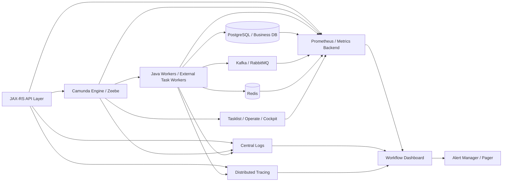

# Part 045 — Observability and Monitoring

## 1. Core mental model

Workflow observability is not just "can I see the diagram in Cockpit or Operate?"

Workflow observability means you can answer, quickly and safely:

- Which business process instances are active, completed, failed, cancelled, or stuck?
- Which process versions are producing incidents?
- Which activities are slow?
- Which jobs are waiting too long?
- Which workers are failing, timing out, or not polling?
- Which user tasks are aging beyond SLA?
- Which timers are backlogged?
- Which external messages cannot be correlated?
- Which variable payloads are too large or unsafe?
- Which database/search/broker dependency is becoming the bottleneck?
- Which customers, tenants, orders, quotes, or business flows are impacted?

A workflow engine creates a second runtime universe beside your Java/JAX-RS services and business database. If you only observe the service but not the workflow runtime, you will miss the real failure. If you only observe the workflow runtime but not the worker, database, and message broker, you will misdiagnose the failure.

Senior rule:

> A production workflow is observable only when business state, process state, worker state, infrastructure state, and customer impact can be correlated.

In CPQ/order management, an incident is rarely just a technical incident. It can mean:

- a quote is not approved;
- an order is not decomposed;
- fulfillment is not triggered;
- fallout is not assigned;
- SLA is breached;
- customer-facing status is misleading;
- manual operations cannot see what to do next.

## 2. What observability must cover

A workflow system has multiple observability surfaces.

| Surface | What it tells you | Typical tooling |
|---|---|---|
| Process runtime | where instances are waiting/failing | Camunda Cockpit, Operate, API, runtime tables/logs |
| Human task runtime | task queue, assignment, aging, completion | Tasklist, custom UI, task APIs |
| Worker runtime | job activation, execution, failure, timeout | app metrics, logs, traces |
| Engine/broker runtime | health, partitions, job backlog, backpressure | Prometheus, Actuator, Kubernetes metrics |
| Database/runtime storage | Camunda 7 runtime/history load, business DB impact | PostgreSQL metrics, slow query logs |
| Search/export storage | Operate/Tasklist/Optimize visibility and lag | Elasticsearch/OpenSearch/RDBMS secondary storage metrics |
| Messaging | event publish/correlation/duplicate/late messages | Kafka/RabbitMQ metrics, DLQ, consumer lag |
| API layer | start/complete/correlate/status endpoints | API gateway, JAX-RS metrics, access logs |
| Business layer | quote/order/customer impact | product dashboard, domain tables, audit reports |

A dashboard that only shows JVM CPU and pod restarts is infrastructure monitoring, not workflow observability.

## 3. Camunda 7 observability mental model

Camunda 7 is database-backed. Runtime state, jobs, incidents, tasks, variables, deployments, and history live in relational tables.

Important observability implications:

- runtime pressure often appears as database pressure;
- failed jobs and incidents are visible in engine state;
- job executor issues can stop automation even when the application pod is healthy;
- history level and cleanup directly affect DB size and query behavior;
- Java delegates may fail inside the same JVM and transaction boundary as the engine;
- external task workers may fail outside the engine but leave locked tasks, retries, or incidents behind;
- Cockpit visibility depends on history/runtime state and proper configuration.

### Camunda 7 monitoring questions

Ask:

- Is the process engine up?
- Is the job executor acquiring jobs?
- Are failed jobs increasing?
- Are incidents increasing?
- Are timers firing?
- Are external tasks locked but not completed?
- Are user tasks aging?
- Is the DB connection pool saturated?
- Are Camunda runtime/history queries slow?
- Is history cleanup running?
- Are variable payloads causing byte-array table growth?
- Are process deployments creating too many versions?

### Camunda 7 observable entities

| Entity | Why it matters |
|---|---|
| Process definition | deployed model version; wrong version causes unexpected behavior |
| Process instance | business flow currently running |
| Execution/token | where the process is currently waiting |
| Job | async continuation, timer, message job, retry unit |
| Incident | runtime failure that needs attention |
| External task | decoupled worker work item |
| User task | manual decision/intervention item |
| Variable | process context, correlation, routing, state hints |
| History event | audit/debug/trend source |

## 4. Camunda 8 / Zeebe observability mental model

Camunda 8/Zeebe is a distributed orchestration platform. Observability must span:

- clients;
- gateways;
- brokers;
- partitions;
- workers;
- exporters;
- Operate;
- Tasklist;
- Optimize if used;
- Identity;
- secondary storage such as Elasticsearch/OpenSearch/RDBMS depending on deployment/version/configuration;
- Kubernetes/cloud/on-prem infrastructure.

Important operational distinction:

- Zeebe primary state is responsible for process execution.
- Secondary storage supports visibility/search/tooling in self-managed deployments depending on configuration.
- Worker behavior is outside the broker and must be instrumented separately.

Do not assume "Operate shows it" means "the engine is healthy." Operate can lag or fail while Zeebe continues executing. Conversely, Zeebe can have execution pressure while the UI remains reachable.

### Camunda 8 monitoring questions

Ask:

- Are gateways accepting REST/gRPC traffic?
- Are brokers healthy?
- Are partitions healthy and led?
- Is there backpressure?
- Are jobs being activated?
- Are jobs timing out?
- Are retries being exhausted?
- Are incidents increasing?
- Are exporters healthy?
- Is secondary storage lagging or saturated?
- Are workers connected and polling/streaming?
- Is Operate showing fresh data?
- Are Tasklist queries and task operations healthy?
- Are process deployments succeeding?
- Are message correlations failing?

## 5. Monitoring architecture

A production-grade workflow monitoring architecture usually has this shape:



The key is correlation.

Every meaningful log, metric label, trace span, and dashboard drill-down should let you pivot across:

- `businessKey`;
- `processInstanceKey` or process instance ID;
- `processDefinitionKey` / process definition ID;
- process version;
- job key or external task ID;
- activity ID;
- worker name;
- correlation ID;
- tenant/customer/account ID if applicable;
- quote/order ID;
- message key/event key;
- API request ID.

## 6. Business-process observability

Infrastructure metrics tell you whether systems are alive. Business-process metrics tell you whether work is moving.

### Core business-process metrics

| Metric | Meaning | Why it matters |
|---|---|---|
| Active process instances | currently running workflows | volume and stuck risk |
| Completed process instances | successful completion count | throughput |
| Failed/incident process instances | workflows requiring intervention | production risk |
| Average cycle time | start-to-end duration | business performance |
| P95/P99 cycle time | tail latency | SLA risk |
| Instances by activity | where processes are waiting | bottleneck detection |
| Instances by version | version distribution | rollout/migration safety |
| Incidents by activity | failure hotspot | PR/release review |
| User tasks by age | manual backlog | operational queue health |
| SLA breach count | business deadline misses | customer impact |
| Message correlation failures | callbacks/events not attached | integration correctness |
| Timer backlog | overdue time-based work | scheduler/engine pressure |

### CPQ/order management examples

For quote/order workflow, useful metrics include:

- quote approval cycle time;
- approval task aging by group;
- order validation failure rate;
- order decomposition backlog;
- fulfillment orchestration duration;
- fallout count by reason;
- manual intervention age;
- cancellation/amendment process failures;
- renewal workflow SLA breach;
- stuck orders by product family/customer/region;
- instances waiting for external system callback;
- events received but not correlated.

These metrics need business labels. A pure process metric without business dimensions can hide localized customer impact.

## 7. Process instance monitoring

Process instance monitoring answers: "Where is the business process now?"

Track:

- started count;
- active count;
- completed count;
- cancelled/terminated count;
- failed/incident count;
- active by BPMN activity;
- active by process version;
- active by tenant/customer/product/order type;
- age distribution;
- oldest active instance;
- instances waiting on external callback;
- instances waiting on human task;
- instances waiting on timer;
- instances waiting on worker job.

### Diagnostic dimensions

Do not only count instances globally. Slice by:

- process definition;
- version;
- activity ID;
- worker type;
- business entity type;
- customer/tenant;
- environment;
- deployment release;
- region;
- integration partner;
- priority/SLA class.

A global incident rate of 0.1% can still mean one enterprise customer has 100% order failures.

## 8. Incident monitoring

An incident is a workflow runtime asking for human/operator attention.

Track:

- incident count;
- new incidents per minute/hour;
- open incidents by process definition;
- open incidents by activity;
- open incidents by version;
- open incidents by worker;
- incident age;
- incident recurrence after retry;
- incidents created after a deployment;
- incidents resolved manually vs automatically;
- incidents reopened or followed by compensation/manual repair.

### Incident severity mapping

| Severity | Example | Action |
|---|---|---|
| SEV1 | widespread order fulfillment blocked | page immediately |
| SEV2 | one major customer or critical SLA class blocked | page owning team |
| SEV3 | limited workflow incident with manual workaround | queue for triage |
| SEV4 | non-production/test incident | investigate during working hours |

### Incident dashboard minimum

For each incident row, show:

- process definition and version;
- process instance ID/key;
- business key;
- activity ID and name;
- incident type;
- failure message summary;
- created time;
- retry count or remaining retries;
- worker name if applicable;
- last deployment/release;
- owner team;
- customer/tenant impact if known;
- link to Cockpit/Operate/log trace/domain entity.

If an incident dashboard cannot tell who owns action, it is not operationally complete.

## 9. Job latency and worker metrics

Job latency is one of the most important signs of workflow health.

Separate these time spans:

| Span | Meaning |
|---|---|
| Creation-to-activation latency | engine created job, worker picked it up later |
| Activation-to-start latency | worker received job but waited in local queue/thread pool |
| Execution latency | worker executing business logic |
| Complete-command latency | worker sent completion, engine acknowledged later |
| Failure-to-retry latency | failed job waiting for retry/backoff |
| Timeout latency | job became available again after worker did not complete |

### Worker metrics

Every Java worker should expose at least:

- jobs activated count;
- jobs completed count;
- jobs failed count;
- BPMN errors thrown count;
- job timeout count if detectable;
- execution duration histogram;
- external API duration histogram;
- database operation duration histogram;
- retry count distribution;
- active job gauge;
- local queue depth;
- worker thread pool saturation;
- graceful shutdown in-progress gauge;
- idempotency conflict count;
- duplicate job detection count;
- downstream error type count.

### Worker labels

Recommended labels:

- worker name;
- job type/topic;
- process ID;
- activity ID;
- environment;
- version/release;
- result class: `completed`, `failed`, `bpmn_error`, `timeout`, `duplicate_ignored`;
- downstream system if relevant.

Avoid high-cardinality labels such as raw order ID, quote ID, or process instance ID in Prometheus-style metrics. Put those in logs/traces instead.

## 10. Human task observability

Human task visibility is operational queue visibility.

Track:

- open task count;
- task count by candidate group;
- task count by assignee;
- unassigned task count;
- claimed-but-not-completed count;
- task age distribution;
- oldest task age;
- due-date breach count;
- follow-up-date breached count;
- claim-to-completion duration;
- save-draft frequency;
- validation failure count;
- concurrent completion conflict count;
- reassignment/delegation count;
- task cancellation count because process moved on.

### Manual intervention dashboard

For CPQ/order management, show:

- fallout tasks by reason;
- order tasks waiting for operations team;
- approval tasks by approver group;
- tasks blocked by missing data;
- tasks without candidate group;
- tasks with assignee who is inactive or out of team;
- tasks older than SLA;
- tasks created by new process version.

Senior rule:

> A user task without age, owner, SLA, and escalation visibility is a hidden production queue.

## 11. SLA monitoring

An SLA metric must distinguish business time from technical time.

Examples:

- Quote approval must complete within 2 business days.
- Order validation must complete within 5 minutes.
- Fallout task must be assigned within 30 minutes.
- External fulfillment callback must arrive within 24 hours.
- Manual repair must not exceed customer-impact threshold.

### SLA metric model

| SLA type | Start point | End point | Breach signal |
|---|---|---|---|
| Process SLA | process start | process completion | instance age > threshold |
| Activity SLA | activity entered | activity left | activity duration > threshold |
| User task SLA | task created | task completed | task age/due date breach |
| Worker SLA | job created/activated | job completed | job latency > threshold |
| Callback SLA | request sent/event expected | message correlated | missing message beyond threshold |
| Incident SLA | incident created | incident resolved | open incident age > threshold |

### Alerting nuance

Not every SLA breach should page.

Page when:

- customer-facing SLA is breached;
- high-priority order/quote segment is blocked;
- many instances breach together;
- breach correlates with a deployment/outage;
- manual queue owner is absent;
- breach will cause financial/regulatory/customer impact.

Create ticket/report when:

- breach is isolated and manual queue can handle it;
- breach is historical trend, not immediate incident;
- breach is caused by known business delay.

## 12. Timer backlog monitoring

Timers look simple in BPMN but become production scheduling load.

Track:

- number of scheduled timers;
- due timers not fired;
- timer execution lag;
- timer jobs by process/activity/version;
- timer creation rate;
- timer firing rate;
- timer incidents/failures;
- timer migration impact;
- timer burst after downtime;
- SLA timer vs retry timer vs escalation timer.

### Failure signs

- many timers become due at the same minute because of batch process start;
- timer jobs accumulate after engine/broker/DB outage;
- timers fire but downstream worker fails;
- timezone mismatch creates apparent early/late escalation;
- timers are migrated incorrectly during process version change;
- business-calendar assumption is not encoded.

For senior review, ask:

- Is the timer a business SLA or technical timeout?
- What happens if the timer fires late?
- What happens if many timers fire together?
- Is the timer visible in dashboards?
- Who owns timer breach triage?

## 13. Message correlation monitoring

Message correlation is where event-driven systems and workflow systems meet.

Track:

- message received count;
- message correlated count;
- message not-correlated count;
- duplicate message count;
- late message count;
- expired message count;
- message correlation latency;
- message name distribution;
- correlation key missing/invalid count;
- message waiting for process instance count if supported;
- Kafka/RabbitMQ consumer lag feeding correlation;
- API callback errors for correlation endpoint.

### Debug fields for every correlation attempt

Log or trace:

- message name;
- correlation key;
- business key;
- process definition ID/key;
- expected activity ID if known;
- source system;
- event ID/message ID;
- event timestamp;
- received timestamp;
- correlation result;
- duplicate/late/missing classification;
- process instance ID/key if correlated.

Do not make engineers reconstruct correlation from raw payload manually during an incident.

## 14. Variable observability

Variables are not just data. They affect routing, correlation, worker input, security, and performance.

Track:

- variable payload size distribution;
- large variable count;
- object/serialized variable count in Camunda 7;
- sensitive variable detection result;
- variables written per activity;
- variables read per worker;
- variable update failures;
- variable serialization/deserialization errors;
- variable schema/version mismatches;
- variable overwrite/race incidents;
- variable retention exposure.

### Red flags

- entire quote/order payload stored as process variable;
- customer PII visible in Operate/Cockpit/Tasklist;
- raw external API response stored indefinitely;
- worker writes all variables back after reading them;
- variable names changed without backward compatibility;
- routing depends on variable that can be missing/null;
- process variable used as source of truth instead of PostgreSQL domain table.

## 15. Database monitoring for Camunda 7 and business integration

For Camunda 7, database is part of the engine's runtime path.

Track:

- DB connection pool usage;
- query latency;
- lock wait/deadlock count;
- runtime table size;
- history table size;
- job table size;
- incident table size;
- byte array table growth;
- history cleanup progress;
- deployment table growth;
- index usage;
- autovacuum/maintenance health in PostgreSQL;
- slow queries from Cockpit/Tasklist/custom reports.

For business DB integration, track:

- worker transaction failures;
- optimistic lock conflicts;
- idempotency table conflicts;
- outbox backlog;
- inbox backlog;
- reconciliation mismatches;
- domain state/process state divergence.

### Important distinction

A workflow incident may be caused by business DB failure, not Camunda failure.

Example:

- worker updates `order_state` in PostgreSQL;
- DB commit fails because of optimistic lock;
- worker fails job;
- workflow creates incident after retries;
- operator sees Camunda incident but root cause is domain concurrency.

Dashboard should make this relationship visible.

## 16. Zeebe partition and broker health monitoring

For Camunda 8, monitor Zeebe internals separately from workers and UI.

Track:

- broker health;
- gateway health;
- partition health;
- leader/follower status;
- Raft/replication health where exposed;
- disk usage;
- snapshot/export progress;
- backpressure signal;
- command rejection rate;
- job activation rate;
- job completion rate;
- incident rate;
- stream processor lag if exposed;
- exporter lag;
- gateway request latency;
- broker CPU/memory;
- network errors between gateway/broker/worker.

### Partition-aware thinking

In Zeebe, capacity and failure are not always uniform.

A single hot partition can create symptoms such as:

- certain process instances slow;
- job activation uneven;
- incidents clustered by process/tenant/key distribution;
- exporter lag for one partition;
- backpressure even when average cluster CPU looks acceptable.

Senior debugging must ask: "Is this global, per partition, per process, per worker, or per tenant?"

## 17. Exporter and secondary storage monitoring

Operate, Tasklist, Optimize, and search APIs depend on exported/secondary data depending on deployment mode and version.

Track:

- exporter enabled/healthy;
- export lag;
- Elasticsearch/OpenSearch/RDBMS secondary storage health;
- indexing latency;
- index size;
- shard/segment pressure if using Elasticsearch/OpenSearch;
- query latency;
- retention cleanup;
- backup/snapshot success;
- mismatch between engine state and UI visible state.

### Failure mode

If exporter or secondary storage lags:

- process may execute correctly;
- Operate may show stale state;
- Tasklist may show delayed task data;
- custom dashboards may undercount incidents;
- operators may retry/repair based on stale view.

Runbooks must include a freshness check.

## 18. Logging strategy

Logs are for forensic context, not metric aggregation.

Log at important lifecycle boundaries:

- API request accepted;
- process start requested;
- process instance created;
- worker job activated;
- worker idempotency check result;
- downstream call started/completed/failed;
- DB write attempted/committed/failed;
- event publish attempted/committed/failed;
- job completed/failed/BPMN error thrown;
- message correlation attempted/result;
- task completed/rejected;
- compensation started/completed/failed;
- manual repair executed.

### Required log fields

Use structured logs with:

- timestamp;
- log level;
- environment;
- service name;
- release version;
- trace ID;
- correlation ID;
- business key;
- process instance ID/key;
- process definition ID/key;
- activity ID;
- job key/external task ID;
- worker name;
- tenant/customer ID if allowed;
- order/quote ID if allowed;
- event ID;
- error class;
- failure category.

### Do not log

- secrets;
- passwords;
- tokens;
- full PII payloads;
- full quote/order payloads if sensitive;
- raw external API response unless sanitized;
- huge variables;
- unbounded stack traces in high-volume loops.

## 19. Tracing strategy

Distributed tracing should connect:

- JAX-RS API request;
- process start/correlation call;
- worker job handling;
- PostgreSQL/MyBatis call;
- Kafka/RabbitMQ publish/consume;
- Redis call;
- external API call;
- task completion API;
- compensation path.

### Trace boundaries

A process instance may live for days or months. A trace usually cannot cover the entire process lifetime as one continuous span.

Use traces for individual technical transactions and use business/process IDs to stitch lifecycle over time.

Recommended pattern:

- `traceId` for request/worker execution;
- `correlationId` for cross-service operation;
- `businessKey` for workflow lifecycle;
- process instance ID/key for engine lookup;
- event ID for messaging idempotency.

## 20. Dashboard design

A production workflow dashboard should have levels.

### Level 1 — Executive/business health

Shows:

- total active orders/quotes;
- completed flow count;
- SLA breach count;
- stuck high-priority flows;
- manual backlog;
- customer impact.

Audience:

- product;
- operations;
- delivery managers;
- incident commander.

### Level 2 — Engineering health

Shows:

- incidents by process/activity/version;
- job latency;
- worker error rate;
- timer backlog;
- message correlation failure;
- DB/search/broker health;
- deployment correlation.

Audience:

- backend engineers;
- platform;
- SRE.

### Level 3 — Debug drill-down

Shows:

- one process instance timeline;
- variables snapshot/redacted view;
- worker logs;
- downstream call result;
- domain DB state;
- messages/events sent/received;
- incident history;
- manual repair actions.

Audience:

- on-call engineer;
- workflow owner;
- support engineer with correct authorization.

## 21. Alerting strategy

Alert on symptoms that require action, not every raw metric movement.

### Good alerts

- open incidents above threshold for production process;
- incident rate jumps after deployment;
- no job completions for critical worker while jobs are created;
- user task SLA breach for critical group;
- timer backlog above threshold;
- message correlation failure rate above baseline;
- exporter lag causing stale visibility;
- Zeebe backpressure persists;
- Camunda 7 job executor stops acquiring jobs;
- PostgreSQL connection pool saturated;
- Elasticsearch/OpenSearch unavailable for Operate/Tasklist-critical operations;
- outbox backlog prevents workflow events.

### Bad alerts

- CPU > 70% for 5 minutes without business symptom;
- any single retry failure;
- expected nightly timer burst;
- user task count high without SLA dimension;
- raw process start count anomaly without known expected volume baseline;
- log error count without classification.

### Alert payload

Every alert should include:

- affected process;
- environment;
- severity;
- metric value and threshold;
- started time;
- likely owner;
- dashboard link;
- runbook link;
- recent deployment link;
- customer/tenant impact if available;
- safe first action.

## 22. Example Prometheus-style metrics

Metric names vary by instrumentation and deployment. Treat these as naming patterns, not exact vendor promises.

```text
workflow_process_instances_started_total{process_id,version,environment}
workflow_process_instances_completed_total{process_id,version,environment}
workflow_process_instances_active{process_id,version,activity_id,environment}
workflow_incidents_open{process_id,activity_id,version,environment}
workflow_incidents_created_total{process_id,activity_id,version,environment}
workflow_user_tasks_open{process_id,candidate_group,environment}
workflow_user_task_age_seconds_bucket{process_id,candidate_group,environment}
workflow_jobs_created_total{job_type,process_id,activity_id,environment}
workflow_jobs_completed_total{job_type,worker,environment}
workflow_jobs_failed_total{job_type,worker,failure_category,environment}
workflow_job_latency_seconds_bucket{job_type,worker,environment}
workflow_message_correlation_failures_total{message_name,source_system,environment}
workflow_timer_backlog{process_id,activity_id,environment}
workflow_worker_active_jobs{worker,job_type,environment}
workflow_worker_duplicate_jobs_total{worker,job_type,environment}
```

### Example alert expressions

Illustrative only:

```text
# Critical worker is not completing jobs while jobs are being created.
rate(workflow_jobs_created_total{job_type="order-validation"}[10m]) > 0
and
rate(workflow_jobs_completed_total{job_type="order-validation"}[10m]) == 0
```

```text
# Open incidents for production order process are increasing.
increase(workflow_incidents_created_total{process_id="order-fulfillment",environment="prod"}[15m]) > 10
```

```text
# Task aging threshold breached.
histogram_quantile(0.95, rate(workflow_user_task_age_seconds_bucket{candidate_group="fallout-ops"}[15m])) > 86400
```

## 23. Release correlation

Every dashboard should support release correlation.

Track:

- process model version deployed;
- worker application release;
- JAX-RS API release;
- database migration version;
- connector config version;
- Kubernetes deployment revision;
- feature flag state;
- Git commit SHA;
- deployment timestamp.

When incident rate jumps, first ask:

- Did a BPMN/DMN/form change deploy?
- Did a worker change deploy?
- Did database schema change?
- Did API contract change?
- Did integration partner behavior change?
- Did traffic pattern change?
- Did Kubernetes/cloud infrastructure change?

## 24. Production debugging workflow

Use this sequence during incident triage.

### Step 1 — Classify symptom

Is it:

- process not starting;
- process stuck;
- worker not executing;
- worker failing;
- message not correlated;
- timer not firing;
- task not visible;
- task not completable;
- incident created;
- SLA breached;
- UI stale;
- database/search/broker pressure?

### Step 2 — Scope blast radius

Determine:

- one instance or many;
- one process or many;
- one version or many;
- one worker or many;
- one tenant/customer or many;
- one region/environment or many;
- after deployment or long-running trend.

### Step 3 — Locate current wait state

Find:

- current BPMN activity;
- activity type;
- token/element instance location;
- job/task/timer/message waiting state;
- incident/failure reason;
- variable values needed for routing.

### Step 4 — Correlate technical state

Check:

- worker logs and metrics;
- API logs;
- DB transaction state;
- Kafka/RabbitMQ event state;
- Redis lock/cache/idempotency state;
- external API response;
- Kubernetes pod health;
- engine/broker health.

### Step 5 — Decide safe action

Options:

- wait because retry/backoff is working;
- fix downstream and retry job;
- manually correlate missing message;
- complete/assign human task;
- update domain data then retry;
- cancel/terminate process;
- migrate instance;
- run compensation;
- create customer-impact report;
- rollback/forward-fix deployment.

Never retry blindly before checking idempotency and side effects.

## 25. Observability anti-patterns

### Anti-pattern: dashboard by component only

You have CPU, memory, pod restarts, but no process metrics.

Failure:

- customer flow is stuck but all pods are green.

Correction:

- add business/process/job/task/incident metrics.

### Anti-pattern: no activity-level labels

You know incidents are high but not which BPMN activity causes them.

Failure:

- debugging requires manual instance inspection.

Correction:

- label incidents/jobs by process ID, version, and activity ID.

### Anti-pattern: process variable as debug dump

Teams store huge payloads "for debugging."

Failure:

- DB/search/storage pressure;
- sensitive data exposure;
- slow UI and export.

Correction:

- store minimal variable references, sanitized summary, and link to controlled audit/domain storage.

### Anti-pattern: alerts without owner

Pager fires but no one knows whether backend, SRE, product ops, or external vendor owns action.

Correction:

- alert metadata must include owner and runbook.

### Anti-pattern: no freshness indicator

Operate/Tasklist/dashboard looks normal but data is stale.

Correction:

- show last exported/ingested timestamp and exporter lag.

## 26. Java/JAX-RS observability integration

For workflow-facing APIs, instrument:

- process start endpoint latency/error rate;
- task completion endpoint latency/error rate;
- message correlation endpoint latency/error rate;
- status endpoint latency/error rate;
- idempotency duplicate count;
- authorization denial count;
- 202 Accepted response count;
- callback response count;
- external API timeout count;
- invalid process/action attempts.

### API log example

```json
{
  "event": "workflow.start.accepted",
  "service": "quote-order-api",
  "operation": "startOrderFulfillment",
  "businessKey": "order-12345",
  "processId": "order-fulfillment",
  "processVersion": "17",
  "correlationId": "corr-abc",
  "requestId": "req-xyz",
  "tenantId": "tenant-redacted",
  "result": "accepted"
}
```

## 27. PostgreSQL/MyBatis observability integration

For worker DB interactions, instrument:

- mapper latency;
- transaction duration;
- rows updated count;
- optimistic lock conflict count;
- unique constraint violation count for idempotency;
- outbox insert count;
- outbox publish lag;
- inbox processed count;
- reconciliation mismatch count;
- DB error category.

### MyBatis debugging concern

If a worker fails after a MyBatis mapper update, the workflow may retry. You must know whether the DB write committed.

Useful fields:

- transaction ID if available;
- affected row count;
- idempotency key;
- version before/after;
- outbox event ID;
- domain state before/after;
- process instance ID/key;
- job key.

## 28. Kafka/RabbitMQ/Redis observability integration

### Kafka

Track:

- consumer lag;
- event publish failure;
- outbox backlog;
- duplicate event count;
- event schema failure;
- message correlation failure;
- replay mode marker;
- DLQ or dead-letter topic count if used.

### RabbitMQ

Track:

- queue depth;
- unacked messages;
- redelivery count;
- DLQ count;
- retry queue count;
- publish confirm failure;
- reply timeout;
- correlation ID mismatch.

### Redis

Track:

- lock acquisition failure;
- lock contention;
- idempotency key hit/miss;
- cache hit/miss;
- stale cache detection;
- command latency;
- eviction count;
- Redis unavailable fallback count.

## 29. Kubernetes/cloud/on-prem monitoring

### Kubernetes

Monitor:

- pod restarts;
- readiness/liveness failures;
- resource throttling;
- OOM kill;
- node pressure;
- persistent volume usage;
- network policy errors;
- service endpoint changes;
- rolling deployment duration;
- pod disruption events;
- secret/config rollout.

### AWS/Azure

Monitor cloud-managed dependencies:

- managed database CPU/IO/connections;
- OpenSearch/Elasticsearch health if used;
- load balancer errors;
- IAM/managed identity auth errors;
- key vault/secret manager access failures;
- VPC/VNet/network security rules;
- DNS and private endpoint health;
- backup success/failure.

### On-prem/hybrid

Monitor:

- firewall drops;
- certificate expiry;
- internal CA chain;
- network latency across boundary;
- air-gapped patch drift;
- backup storage capacity;
- monitoring agent health;
- responsibility handoff between teams/customer/platform.

## 30. Internal verification checklist

Use this checklist inside CSG/team context.

### Actual runtime and version

- Which Camunda version is used, if any?
- Camunda 7, Camunda 8 SaaS, Camunda 8 self-managed, or custom workflow?
- Cockpit, Operate, Tasklist, Optimize, custom UI, or internal dashboard?
- Is secondary storage Elasticsearch/OpenSearch/RDBMS/H2/local-only depending on environment?
- Is observability different between dev/test/prod?

### Process observability

- Are process instance counts visible by definition/version/activity?
- Are active/stuck/completed/failed instances visible?
- Are incidents visible with business key and owner?
- Are task aging and SLA breach visible?
- Are timers and message correlation failures visible?
- Can operators see customer/tenant impact safely?

### Worker observability

- Do Java workers expose metrics?
- Do logs include process instance ID/key, job key, activity ID, business key, and correlation ID?
- Is worker failure classified?
- Are retries, BPMN errors, duplicate jobs, and idempotency conflicts measured?
- Is graceful shutdown visible during deployment?

### API observability

- Are start/complete/correlate/status endpoints instrumented?
- Are 202 Accepted flows tracked to actual process instance creation?
- Are idempotency duplicates visible?
- Are authorization denials visible?
- Are callback failures classified?

### Database and messaging observability

- Are PostgreSQL/MyBatis worker transactions observable?
- Are outbox/inbox backlogs visible?
- Are Kafka/RabbitMQ delays and DLQs visible?
- Are Redis lock/cache/idempotency failures visible?
- Are process state and domain state reconciliation mismatches measured?

### Operational readiness

- Are alerts actionable and owner-tagged?
- Are runbooks linked from alerts?
- Are dashboards redacted for sensitive data?
- Are freshness/lag indicators visible for exported UI data?
- Are post-incident notes linked to workflow/version/worker release?

## 31. PR review checklist

When reviewing a PR that touches workflow observability, ask:

- Does this change introduce a new process/activity/job/task that needs metrics?
- Does it add a new failure mode that needs an alert or dashboard?
- Are incident messages actionable?
- Are worker logs structured and correlated?
- Are sensitive variables/logs redacted?
- Are high-cardinality metric labels avoided?
- Are new timers observable?
- Are new message correlations observable?
- Are new user tasks visible by queue/age/SLA?
- Is the dashboard updated for new process version/activity?
- Is the runbook updated?
- Is release correlation possible?

## 32. Senior engineer heuristics

Use these heuristics:

1. If it can get stuck, it needs a stuck detector.
2. If it can retry, it needs retry metrics and idempotency evidence.
3. If it can create manual work, it needs queue age and owner visibility.
4. If it waits for an external event, it needs correlation success/failure metrics.
5. If it depends on time, it needs timer lag and SLA monitoring.
6. If it stores data, it needs payload size and privacy review.
7. If it crosses a service boundary, it needs trace/log correlation.
8. If it pages someone, it needs a runbook and owner.
9. If it changes process version, it needs release correlation.
10. If it affects customer/business status, it needs business-impact mapping.

## 33. Official references

- Camunda 8 components metrics: https://docs.camunda.io/docs/self-managed/operational-guides/monitoring/metrics/
- Camunda 8 Orchestration Cluster monitoring: https://docs.camunda.io/docs/self-managed/components/orchestration-cluster/core-settings/concepts/monitoring/
- Camunda 8 job workers: https://docs.camunda.io/docs/components/concepts/job-workers/
- Camunda 8 messages: https://docs.camunda.io/docs/components/concepts/messages/
- Camunda 8 secondary storage: https://docs.camunda.io/docs/self-managed/concepts/secondary-storage/
- Camunda 7 database schema: https://docs.camunda.org/manual/latest/user-guide/process-engine/database/database-schema/
- Camunda 7 job executor: https://docs.camunda.org/manual/latest/user-guide/process-engine/the-job-executor/

## 34. Closing mental model

Observability is not a reporting layer after the system is built. It is part of workflow correctness.

A workflow design is incomplete until it answers:

- how do we know it is moving;
- how do we know it is stuck;
- how do we know who is impacted;
- how do we know who owns repair;
- how do we know retry is safe;
- how do we know dashboards are fresh;
- how do we know sensitive data is not exposed;
- how do we know a new release made things worse.

For senior backend engineers, workflow observability is the bridge between BPMN diagrams and production truth.
