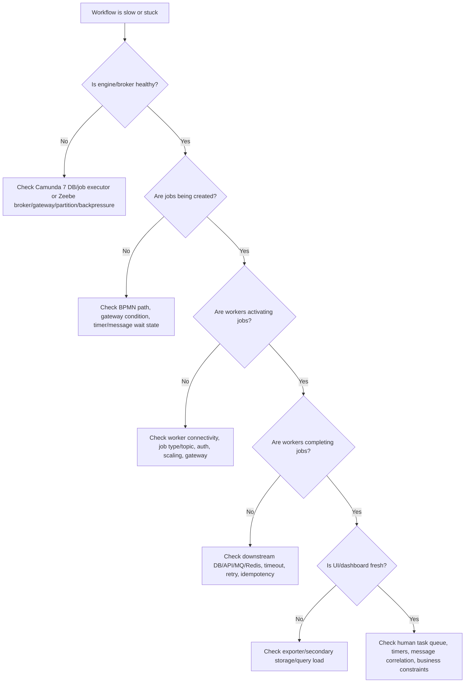

# Part 046 — Performance and Capacity Planning

## 1. Core mental model

Workflow performance is not only "how fast can the engine execute BPMN?"

Workflow performance is the combined behavior of:

- process model complexity;
- number of active process instances;
- number of jobs created;
- worker throughput;
- retry behavior;
- timer density;
- message correlation volume;
- user task queue volume;
- variable payload size;
- Camunda 7 database load or Camunda 8 Zeebe/secondary storage load;
- Kafka/RabbitMQ/Redis pressure;
- PostgreSQL/MyBatis transaction pressure;
- Kubernetes/cloud/on-prem resource constraints;
- operational visibility tooling load.

Senior rule:

> A workflow engine rarely fails because one BPMN element is slow. It fails because process volume, payload size, worker concurrency, retries, storage, and downstream dependencies interact badly.

Performance planning must answer two different questions:

1. Can the runtime execute the expected work?
2. Can the surrounding system observe, recover, and operate that work under failure?

If you only test happy-path throughput, you have not capacity-planned a workflow system.

## 2. Capacity dimensions

Think in capacity dimensions, not just CPU and memory.

| Dimension | Question |
|---|---|
| Process volume | how many instances start per minute/hour/day? |
| Active instance count | how many instances remain open at peak? |
| Process duration | how long do instances stay active? |
| Job volume | how many service-task jobs per process? |
| Worker throughput | how many jobs can workers complete per second/minute? |
| Worker concurrency | how many jobs execute in parallel safely? |
| External dependency capacity | can DB/API/message broker handle worker fan-out? |
| Timer volume | how many timers are scheduled and due together? |
| Message volume | how many correlation attempts occur? |
| User task volume | how many tasks wait for humans? |
| Variable payload | how much state is stored per instance? |
| History/export volume | how much historical/visibility data is produced? |
| Incident/retry volume | what happens during partial outage? |
| Search/UI query load | can operators inspect data under incident? |

## 3. Basic capacity formulas

These formulas are approximations for reasoning. Validate with real load tests.

### Active process instances

```text
active_instances ≈ start_rate_per_hour × average_duration_hours
```

Example:

```text
500 order processes/hour × 12 hours average duration = 6,000 active instances
```

If 5% of orders get stuck for 7 days, active instance count rises dramatically:

```text
stuck_instances ≈ start_rate_per_day × stuck_ratio × stuck_duration_days
```

### Job creation rate

```text
job_rate ≈ process_start_rate × average_service_tasks_per_process
```

If one order process has 20 service tasks and starts 1,000 times/hour:

```text
20,000 jobs/hour ≈ 5.56 jobs/second
```

That may sound small, but if each job calls slow external APIs or writes large DB transactions, workers/downstream systems may become the bottleneck.

### Worker required concurrency

```text
required_concurrency ≈ target_throughput_per_second × average_job_duration_seconds
```

If you need 50 jobs/sec and each job takes 500 ms:

```text
required_concurrency ≈ 50 × 0.5 = 25 concurrent jobs
```

Add safety margin for variance, tail latency, retries, and graceful shutdown.

### Little's Law for workflow queues

```text
WIP = throughput × cycle_time
```

If a human approval queue completes 100 tasks/day and average task age is 3 days:

```text
WIP ≈ 300 open tasks
```

If WIP is 1,000 with the same completion rate, either cycle time is worse or incoming rate exceeds capacity.

## 4. Performance bottleneck taxonomy

| Bottleneck | Symptom |
|---|---|
| Process model complexity | too many activities/jobs/timers per instance |
| Variable payload size | slow export, storage growth, UI/search pressure |
| Worker CPU | active job queue grows, high execution latency |
| Worker I/O | external API/DB latency dominates |
| Worker concurrency too high | downstream saturation, retry storm |
| Worker concurrency too low | job backlog and SLA breach |
| Camunda 7 DB load | slow jobs, Cockpit slowness, lock contention |
| Camunda 7 job executor | jobs not acquired quickly, timer lag |
| Zeebe broker pressure | backpressure, command rejection, latency |
| Zeebe partition hot spot | uneven latency/failures |
| Exporter/secondary storage | Operate/Tasklist stale or slow |
| Kafka/RabbitMQ backlog | delayed correlation/event publish |
| Redis misuse | lock contention, stale cache, false idempotency |
| Human bottleneck | task aging, SLA breach, manual queue growth |

## 5. Process complexity and model cost

Every BPMN element is not equal in runtime cost.

High-cost patterns include:

- many service tasks per process instance;
- many async boundaries;
- many timers;
- many boundary events;
- large parallel gateways;
- high-volume call activities;
- complex variable mappings;
- large payloads passed between subprocesses;
- many message subscriptions/correlations;
- frequent incident/retry paths;
- long-running instances with large history footprints;
- user tasks that stay open for months.

### Senior modelling heuristic

Ask for each activity:

- Does this need to be a separate BPMN step?
- Does this need to be async?
- Does this create an observable business milestone?
- Does this create a job or timer per instance?
- Does this need compensation/retry/incident boundary?
- Could several purely technical steps be collapsed inside one idempotent worker?
- Would collapsing reduce observability too much?

Too much BPMN granularity increases runtime overhead. Too little BPMN granularity hides business progress and recovery points.

## 6. Variable and payload size planning

Variables directly affect performance, storage, export, network, and UI visibility.

### Bad pattern

```text
process variable = entire quote/order aggregate + pricing details + customer profile + external API response
```

Problems:

- large engine payload;
- slow serialization/deserialization;
- storage growth;
- UI/search index pressure;
- sensitive data exposure;
- backward compatibility pain;
- worker overwrite risk;
- increased network transfer.

### Better pattern

```text
process variables = businessKey + orderId + quoteId + routing flags + small decision outputs + correlation keys
business state = PostgreSQL domain tables
large payloads = controlled document/object storage or domain service, referenced by ID
```

### Sizing variables

Estimate:

```text
total_payload ≈ active_instances × average_variable_payload_size
```

If 200,000 active process instances store 20 KB each:

```text
~4 GB active payload
```

That payload can stress engine/runtime storage, export, search, backup, and UI queries.

Camunda documentation for Zeebe sizing notes that each partition typically handles a limited total payload budget; larger payloads slow processing and may require more partitions. Treat this as a design constraint, not merely an infrastructure setting.

## 7. Camunda 7 performance model

Camunda 7 performance is heavily tied to relational database behavior.

Main drivers:

- runtime table writes/reads;
- job acquisition queries;
- optimistic locking;
- history event inserts;
- variable serialization;
- byte array storage;
- incidents/failed jobs;
- external task fetch-and-lock queries;
- Cockpit/Tasklist queries;
- history cleanup;
- DB connection pool;
- transaction boundaries.

### Camunda 7 performance questions

Ask:

- How many jobs are created per second?
- How many timers are due per minute?
- How many async continuations are used?
- How many external tasks are locked concurrently?
- What is the history level?
- How large are variables?
- Are Java delegates doing slow external calls inside engine transaction?
- Is job executor tuned?
- Is DB connection pool sufficient?
- Are history cleanup and archival configured?
- Are Cockpit/custom queries hitting large history tables?

### Job executor tuning awareness

Camunda 7 job executor behavior affects:

- acquisition speed;
- lock duration;
- retry behavior;
- exclusive job execution;
- timer processing;
- async continuations;
- thread utilization;
- DB contention.

Do not tune job executor blindly. Measure:

- job acquisition latency;
- job execution duration;
- DB query latency;
- failed job rate;
- lock wait/deadlock rate;
- CPU/memory;
- downstream dependency pressure.

Increasing thread count can make performance worse if DB or downstream APIs are already saturated.

## 8. Camunda 7 database capacity planning

Plan for these table families:

| Table family | Capacity concern |
|---|---|
| Runtime tables | active executions, jobs, variables, tasks |
| History tables | audit/history growth |
| Byte array table | serialized variables and large data |
| Job tables | async/timer/retry workload |
| Incident tables | operational failure volume |
| Deployment tables | process version accumulation |
| Identity tables | user/group/authorization if used |

### PostgreSQL concerns

For PostgreSQL-backed Camunda/business state, monitor:

- connection pool saturation;
- CPU and IO;
- slow queries;
- index bloat;
- table bloat;
- autovacuum lag;
- lock waits;
- deadlocks;
- WAL volume;
- backup/restore duration;
- storage growth;
- long-running transactions.

### History level impact

Higher history level gives more audit/debug visibility but increases write volume and storage.

Decision questions:

- What audit evidence is required?
- How long must history be retained?
- Who queries history and how often?
- Is history cleanup tested?
- Are reports served from Camunda history directly or from a separate analytics pipeline?

## 9. Camunda 8 / Zeebe performance model

Camunda 8/Zeebe performance is shaped by distributed engine behavior.

Main drivers:

- broker CPU/memory/disk;
- number of partitions;
- replication factor;
- command rate;
- job creation/activation/completion rate;
- worker concurrency and timeout;
- payload size;
- process instance count;
- exporters;
- secondary storage;
- Operate/Tasklist query load;
- gateway request volume;
- network latency;
- backpressure.

### Zeebe performance questions

Ask:

- How many process instances start per second?
- How many jobs are created/completed per second?
- How large are variables?
- How long do process instances stay active?
- How many partitions are configured?
- Are keys distributed evenly?
- Are brokers under backpressure?
- Are exporters lagging?
- Are workers keeping up?
- Are job timeouts too short/long?
- Is Operate/Tasklist/secondary storage fresh?
- Is the bottleneck broker, gateway, worker, exporter, search, or downstream system?

## 10. Zeebe partition planning

Partitions are a core capacity concept in Zeebe.

More partitions can increase processing capacity and distribute load, but they also add operational complexity and resource requirements.

### Partition planning inputs

- expected active payload;
- process instance count;
- job rate;
- command rate;
- incident/retry volume;
- replication factor;
- broker count;
- disk performance;
- exporter throughput;
- worker distribution;
- operational recovery target.

### Partition anti-patterns

- choosing partition count without payload estimate;
- assuming partitions can be changed casually after production launch;
- ignoring replication factor;
- ignoring exporter/search capacity;
- ignoring hot process/key distribution;
- sizing only for average load, not incident/retry bursts.

### Hot partition symptoms

- uneven job latency;
- process-specific slowness;
- one partition shows higher lag/pressure;
- exporter lag concentrated;
- incidents cluster unexpectedly;
- gateway latency increases under specific business key patterns.

## 11. Backpressure

Backpressure is the system saying: "I cannot safely accept more work at this rate."

In workflow systems, backpressure can appear at:

- API layer;
- Camunda 8 gateway/broker;
- worker local queue;
- database pool;
- Kafka/RabbitMQ;
- Redis;
- external API;
- search/export pipeline;
- human task queue.

### Healthy reaction to backpressure

The system should:

- reject or slow new work predictably;
- preserve existing process consistency;
- avoid retry storms;
- avoid worker fan-out into unhealthy downstreams;
- expose clear metrics;
- provide user/client response semantics;
- recover without manual data surgery.

### Bad reaction

- clients retry immediately;
- workers increase concurrency automatically;
- message queues redeliver aggressively;
- engine creates incidents at huge rate;
- DB pools saturate;
- dashboards become stale;
- operators retry failed jobs blindly.

## 12. Worker throughput planning

Worker capacity is usually the first practical bottleneck.

### Worker throughput equation

```text
worker_throughput ≈ worker_instances × concurrency_per_instance / average_execution_time_seconds
```

Example:

```text
5 pods × 20 concurrent jobs / 0.5 sec = 200 jobs/sec theoretical
```

But theoretical throughput is not real throughput.

Real throughput is limited by:

- DB connection pool;
- external API rate limit;
- CPU;
- memory;
- Kafka/RabbitMQ publishing;
- Redis latency;
- idempotency table writes;
- serialization/deserialization;
- workflow engine command latency;
- retry/failure rate.

### Worker concurrency checklist

Before increasing concurrency, verify:

- worker is idempotent;
- downstream system has capacity;
- DB pool and transaction isolation are safe;
- external API has rate limits and circuit breaker;
- job timeout exceeds P99 execution time plus margin;
- graceful shutdown drains active jobs;
- max active jobs does not exceed local queue capacity;
- logs/metrics do not become bottleneck;
- retry policy will not multiply traffic.

## 13. Worker timeout and retry capacity

Job timeout affects duplicate execution risk and capacity.

If timeout is too short:

- job may be reassigned while original worker still executing;
- duplicate side effects increase;
- idempotency table conflicts rise;
- external systems receive repeated calls;
- incidents become confusing.

If timeout is too long:

- failed/crashed worker holds job too long;
- recovery is slow;
- SLA suffers;
- stuck jobs remain invisible unless monitored.

### Timeout sizing heuristic

```text
job_timeout >= P99_execution_time + downstream_tail_latency_margin + shutdown_margin
```

But do not set it so high that crashed workers block recovery for hours.

### Retry capacity planning

Retries multiply workload.

```text
effective_job_attempts = original_jobs × (1 + average_retries_per_job)
```

During downstream outage:

```text
effective_load = normal_load + retry_load + redelivery_load + manual_retry_load
```

Capacity planning must include failure load, not just normal load.

## 14. External dependency capacity

Workflow workers often fan out to systems that are not sized for workflow retries.

### PostgreSQL

Plan:

- connection pool per worker pod;
- total connections across replicas;
- transaction duration;
- lock conflicts;
- idempotency unique constraints;
- outbox write volume;
- migration impact;
- slow query behavior under concurrency.

### External APIs

Plan:

- rate limits;
- timeout;
- circuit breaker;
- idempotency support;
- bulkhead isolation;
- fallback behavior;
- retry-after handling;
- degraded mode.

### Kafka/RabbitMQ

Plan:

- producer throughput;
- consumer lag;
- queue depth;
- DLQ volume;
- redelivery behavior;
- message size;
- schema validation cost;
- replay pressure.

### Redis

Plan:

- command rate;
- lock contention;
- key TTL;
- memory and eviction;
- outage fallback;
- cluster/shard behavior if used.

## 15. Timer and SLA capacity

Timers create scheduled load.

### Timer burst patterns

Burst can happen when:

- many process instances start together;
- many tasks have same due date;
- engine/broker downtime delays timers;
- clock/timezone mistake aligns timers;
- migration causes timer recreation;
- retry cycles are synchronized.

### Timer capacity checklist

- How many timers are scheduled?
- How many become due per minute?
- What happens after downtime?
- Is there jitter for technical retry timers?
- Are business SLA timers separate from technical retry timers?
- Is timer lag measured?
- Are timer jobs visible by process/activity/version?

## 16. Message correlation capacity

High-volume message correlation can bottleneck API, engine, and storage.

Plan for:

- correlation attempts per second;
- message payload size;
- missing/late/duplicate messages;
- message TTL;
- Kafka/RabbitMQ consumer lag;
- API callback spikes;
- correlation key distribution;
- message start vs intermediate catch behavior;
- incident/manual repair for unmatched events.

### Correlation pressure failure mode

Example:

1. Fulfillment system sends callbacks in burst.
2. JAX-RS callback endpoint accepts them.
3. Correlation attempts spike.
4. Some keys do not match because process has not reached wait state.
5. Messages expire or fail.
6. Orders appear stuck waiting for callback.

Capacity planning must define buffering and late-message policy.

## 17. User task capacity

Human work has capacity too.

Plan:

- tasks created per day;
- tasks completed per user/group per day;
- average task handling time;
- task aging distribution;
- SLA threshold;
- reassignment/delegation rate;
- absence/shift coverage;
- task search/filter query volume;
- custom Tasklist/API load;
- stale UI/concurrent completion conflicts.

### Human queue calculation

```text
required_human_capacity = incoming_tasks_per_day × average_handling_minutes / available_minutes_per_person_per_day
```

If 600 fallout tasks/day × 10 minutes each = 6,000 minutes/day.

At 300 available minutes/person/day:

```text
20 people required
```

If only 8 people are available, workflow throughput will degrade regardless of engine capacity.

## 18. Search, Operate, Tasklist, and Optimize load

Visibility tooling has its own capacity.

Track:

- query volume;
- dashboard refresh interval;
- index/storage size;
- export lag;
- retention policy;
- task search filters;
- incident search filters;
- variable search usage;
- concurrent operators;
- incident-day query spikes.

### Common failure

During incident, everyone opens Operate/Cockpit/dashboard, increasing query load exactly when the system is under pressure.

Mitigation:

- prebuilt dashboards;
- cached aggregate metrics;
- limited high-cardinality searches;
- runbook links;
- read replicas or separate analytics path where appropriate;
- retention and index lifecycle management.

## 19. Kubernetes resource planning

For Kubernetes deployment, plan resources for:

- Camunda engine/brokers/gateways;
- workers;
- Tasklist/Operate/Optimize/Identity if self-managed;
- Elasticsearch/OpenSearch/RDBMS secondary storage if in-cluster;
- PostgreSQL/RDS/Azure DB connections;
- Kafka/RabbitMQ/Redis clients;
- monitoring sidecars/agents.

### Resource concerns

- CPU throttling increases worker and broker latency;
- memory pressure causes pod restarts and job timeouts;
- disk pressure affects broker/storage/search;
- HPA based only on CPU may ignore job backlog;
- rolling deployments can kill workers mid-job;
- PDB/anti-affinity affect availability;
- readiness probes should not mark worker ready before it can safely process jobs;
- liveness probes should not restart long-running workers unnecessarily.

### Scaling workers

Scale by:

- job backlog;
- activation latency;
- execution latency;
- downstream capacity;
- queue depth;
- SLA pressure;
- failure rate.

Do not scale only by CPU.

## 20. Cloud/on-prem capacity differences

### AWS/Azure

Capacity depends on:

- EKS/AKS node pools;
- managed database tier;
- OpenSearch/Elasticsearch/search backend capacity;
- load balancer limits;
- NAT gateway/network limits;
- IAM/managed identity latency or failures;
- Secrets Manager/Key Vault access patterns;
- backup/snapshot windows;
- multi-AZ/zone design.

### On-prem/hybrid

Capacity depends on:

- network latency across firewall;
- TLS/internal CA overhead and expiry;
- fixed hardware limits;
- change window constraints;
- slower patching;
- backup storage limits;
- monitoring stack maturity;
- customer-owned infrastructure variability;
- responsibility boundary.

Do not copy cloud sizing assumptions into on-prem environments without verification.

## 21. Load testing strategy

Workflow load tests must include process behavior, not only endpoint throughput.

### Test types

| Test | Goal |
|---|---|
| Smoke test | process can run end-to-end |
| Baseline load test | expected normal volume |
| Peak load test | expected peak volume |
| Soak test | long-running stability and storage growth |
| Burst test | sudden start/callback/timer spike |
| Failure load test | downstream outage and retry behavior |
| Migration test | running instance/version change impact |
| Human queue simulation | task accumulation and completion capacity |
| Replay test | Kafka/event replay impact |
| Recovery test | engine/broker/worker restart behavior |

### Load test must measure

- process start rate;
- process completion rate;
- active instance count;
- job latency;
- worker throughput;
- worker failure rate;
- incident rate;
- retry volume;
- DB CPU/IO/locks;
- Kafka/RabbitMQ lag;
- Redis latency;
- exporter lag;
- Operate/Tasklist query latency;
- timer lag;
- message correlation success/failure;
- memory/CPU/disk;
- cost if cloud.

## 22. Failure-mode load testing

Test unhappy paths deliberately.

### Scenarios

1. External API slows to P99 = 10 seconds.
2. PostgreSQL returns transient connection errors.
3. Kafka publish succeeds but worker fails before completing job.
4. RabbitMQ redelivers duplicate reply.
5. Redis unavailable during idempotency check.
6. Worker pod is killed mid-job.
7. Zeebe gateway temporarily unavailable.
8. Camunda 7 job executor pauses.
9. Exporter/secondary storage lags.
10. Timer burst occurs after outage.
11. Message arrives before process reaches catch event.
12. Human tasks exceed SLA.
13. BPMN deployment creates new version while old instances run.

For each scenario, measure:

- recovery time;
- duplicate side effects;
- incident creation;
- manual repair need;
- dashboard accuracy;
- alert actionability;
- customer impact.

## 23. Capacity planning worksheet

Use this worksheet before production rollout.

```text
Process ID:
Process version:
Environment:
Expected starts/hour:
Peak starts/hour:
Average process duration:
P95 process duration:
Average service tasks/process:
Average user tasks/process:
Average timers/process:
Average messages/process:
Average variable payload size:
Max variable payload size:
Expected active instances:
Peak active instances:
Expected jobs/hour:
Peak jobs/hour:
Average worker duration by job type:
P95/P99 worker duration by job type:
Worker replicas:
Worker concurrency per replica:
DB operations per job:
External API calls per job:
Kafka/RabbitMQ messages per job:
Redis commands per job:
Expected retry rate:
Failure-mode retry rate:
Incident threshold:
SLA thresholds:
Retention requirement:
Dashboard/query requirements:
Backup/restore requirement:
Operational owner:
Runbook link:
```

## 24. Capacity model example: order fulfillment

Assume:

```text
Peak order starts/hour = 2,000
Average process duration = 8 hours
Average service tasks/order = 15
Average user tasks/order = 0.2
Average timers/order = 3
Average variable payload = 6 KB
Average job execution time = 400 ms
Target completion capacity = peak rate
```

Approximate:

```text
active_instances = 2,000 × 8 = 16,000
jobs/hour = 2,000 × 15 = 30,000
jobs/sec = 8.33
required_concurrency = 8.33 × 0.4 = 3.33
```

The formula suggests low concurrency, but real sizing must add:

- P99 execution time;
- retry load;
- downstream latency;
- deployment rolling restart;
- worker pod failure;
- DB contention;
- event bursts;
- timers due together;
- operational dashboard queries.

A practical concurrency might be much higher, but only if DB/external systems can handle it.

## 25. Performance debugging decision tree



## 26. Common performance failure modes

### Failure mode: worker concurrency overloads PostgreSQL

Symptom:

- worker pods scaled up;
- DB connections saturated;
- lock waits increase;
- jobs fail/retry;
- incidents rise.

Fix:

- reduce concurrency;
- align pool sizes;
- optimize queries;
- use backpressure/circuit breaker;
- batch cautiously;
- review idempotency table indexes.

### Failure mode: payload bloat slows everything

Symptom:

- Operate/Cockpit slow;
- storage grows fast;
- export lag increases;
- variable serialization errors;
- worker network payload increases.

Fix:

- store references, not full payloads;
- remove unused variables;
- redact sensitive data;
- move audit payload to controlled store;
- validate variable size in tests.

### Failure mode: retry storm after dependency outage

Symptom:

- external API down;
- many jobs fail;
- retries align;
- downstream recovers then gets overwhelmed;
- incidents spike.

Fix:

- exponential backoff/jitter;
- circuit breaker;
- retry budget;
- manual intervention for poison jobs;
- controlled replay/retry runbook.

### Failure mode: timer burst after downtime

Symptom:

- engine/broker resumes;
- many overdue timers fire;
- workers/downstream saturated;
- SLA alerts flood.

Fix:

- timer lag dashboard;
- capacity buffer;
- throttle downstream calls;
- stagger technical timers;
- classify expected recovery storm.

### Failure mode: Tasklist/custom UI query pressure

Symptom:

- user task UI slow during incident;
- operators refresh repeatedly;
- search backend load increases;
- visibility lags.

Fix:

- cached queue summaries;
- indexed filters;
- pagination;
- limited variable search;
- incident-mode dashboard.

## 27. Performance anti-patterns

### Anti-pattern: sizing by CPU only

CPU is green, but jobs are slow because DB/API/search is saturated.

Correction:

- size by workflow throughput and dependency pressure.

### Anti-pattern: max worker concurrency everywhere

High concurrency increases downstream pressure and duplicate side effects.

Correction:

- tune per job type and downstream limit.

### Anti-pattern: storing complete aggregates as variables

Large variables degrade engine/search/history and expose sensitive data.

Correction:

- store IDs and minimal routing/decision data.

### Anti-pattern: no failure-mode load testing

Happy path passes, outage causes retry storm.

Correction:

- include dependency failure, worker kill, timer burst, and replay tests.

### Anti-pattern: treating human work as infinite capacity

Engine scales but operators do not.

Correction:

- model task arrival/completion rate and escalation capacity.

### Anti-pattern: scaling workers faster than process visibility

Workers complete work but UI/export lags; operators see stale state.

Correction:

- include exporter/search/Tasklist capacity in throughput plan.

## 28. Java/JAX-RS performance implications

Workflow-facing APIs must not block unnecessarily.

### Start process endpoint

Prefer:

- validate request;
- create business record/idempotency record;
- start process or enqueue start command;
- return `202 Accepted` with status URL for long-running work.

Avoid:

- waiting for entire process to complete;
- holding DB transaction while engine and external systems work;
- hiding async workflow behind synchronous success response.

### Status endpoint

Status endpoint should be efficient.

Avoid querying heavy process history on every customer poll.

Options:

- domain status table updated by process/worker;
- cached summary with TTL;
- event-driven status projection;
- direct engine query only for internal/debug endpoints;
- rate-limit high-frequency polling.

### Task completion endpoint

Task completion can trigger downstream process work.

Plan:

- validation cost;
- authorization check cost;
- optimistic locking/concurrent completion;
- process completion command latency;
- follow-up job burst;
- audit write.

## 29. PostgreSQL/MyBatis performance implications

Workflow workers often create many small transactions.

### MyBatis concerns

- N+1 selects in worker;
- inefficient mapper queries;
- missing indexes on business key/status;
- too many DB round trips per job;
- long transactions around external calls;
- large result maps;
- slow serialization;
- optimistic lock retries;
- batch update lock contention.

### Better pattern

- read only needed columns;
- update by primary key/business key with version;
- keep transaction short;
- external call outside DB transaction where safe;
- use outbox for event publish;
- use idempotency unique constraint;
- record worker attempt/result;
- measure mapper latency.

## 30. Kafka/RabbitMQ/Redis performance implications

### Kafka

Capacity risks:

- event replay triggers many correlations;
- consumer lag delays workflow progression;
- schema validation slows worker;
- large messages increase network/storage cost;
- outbox backlog grows during broker issue.

### RabbitMQ

Capacity risks:

- redelivery storm;
- DLQ growth;
- unacked messages;
- prefetch too high;
- retry queues align;
- reply queues accumulate stale replies.

### Redis

Capacity risks:

- lock hot key;
- eviction of idempotency keys;
- key cardinality explosion;
- high latency blocking workers;
- stale cached process status;
- Redis outage disables safety mechanism.

## 31. Performance and security/privacy

Performance shortcuts can create security problems.

Examples:

- caching task lists without tenant/role filter;
- storing sensitive payload in variable for faster access;
- logging full payload to debug performance;
- exposing high-cardinality customer data in metrics labels;
- using Redis cache as authorization source without invalidation;
- broad dashboard access to speed incident triage.

Senior rule:

> Performance optimization must not bypass authorization, audit, data minimization, or tenant isolation.

## 32. Internal verification checklist

### Volume and traffic

- What are expected and peak process start rates?
- How many active process instances exist at peak?
- How long do quote/order workflows stay open?
- Which workflows have the largest active WIP?
- Which workflows generate the most jobs?
- Which processes generate the most timers/messages/user tasks?

### Engine/runtime

- If Camunda 7: what is DB load, history level, job executor config, and runtime/history table growth?
- If Camunda 8: what is broker/gateway/partition topology, replication factor, exporter/secondary storage setup, and backpressure behavior?
- Are process variables small enough?
- Are large payloads stored outside workflow runtime?
- Are incidents/retries included in capacity estimates?

### Worker capacity

- What is average/P95/P99 worker execution time by job type?
- What is worker concurrency per pod?
- What is max jobs active/fetch size/lock duration/job timeout?
- Are workers idempotent under duplicate execution?
- Does worker scaling respect DB/API/MQ/Redis limits?
- Is graceful shutdown tested?

### Database/messaging/cache

- Are PostgreSQL connection pools sized across all worker replicas?
- Are MyBatis queries indexed and measured?
- Is outbox/inbox capacity tested?
- Is Kafka/RabbitMQ lag/replay/DLQ behavior tested?
- Is Redis eviction/TTL/latency/outage behavior tested?

### Human and operational capacity

- Are human task queues sized by real operator capacity?
- Are SLA thresholds realistic?
- Can dashboards handle incident-day query load?
- Are runbooks tested under high incident volume?
- Is support/customer impact reporting scalable?

### Deployment and infrastructure

- Are Kubernetes resource requests/limits based on load test evidence?
- Does HPA scale on meaningful workflow metrics?
- Are PDB/anti-affinity configured for availability?
- Are cloud/on-prem dependencies sized and monitored?
- Are backup/restore and retention included in capacity plan?

## 33. PR review checklist

When reviewing workflow performance impact, ask:

- Does this BPMN change increase number of jobs/timers/messages/tasks?
- Does this worker add external calls or DB writes?
- Does this change increase variable payload size?
- Does this process version increase active instance duration?
- Does this add retry paths that can multiply load?
- Does this create new human task queues?
- Does this add message correlation under burst/replay conditions?
- Does this change require new indexes?
- Does this affect history/export/search volume?
- Does this affect worker concurrency or timeout?
- Does this change require load testing?
- Does it update capacity assumptions and dashboards?

## 34. Senior engineer capacity heuristics

1. Count jobs, not just processes.
2. Count active instances, not just starts.
3. Count retries as extra traffic.
4. Size workers against downstream capacity, not just CPU.
5. Keep variables small by design.
6. Treat timers as scheduled load.
7. Treat user tasks as human queues.
8. Treat Operate/Cockpit/Tasklist as production dependencies for operations.
9. Test failure load, not only happy path.
10. Never tune by guess when metrics can be captured.

## 35. Official references

- Camunda 8 sizing your environment: https://docs.camunda.io/docs/components/best-practices/architecture/sizing-your-environment/
- Camunda 8 job workers: https://docs.camunda.io/docs/components/concepts/job-workers/
- Camunda 8 Java client job worker guide: https://docs.camunda.io/docs/apis-tools/java-client/job-worker/
- Camunda 8 monitoring metrics: https://docs.camunda.io/docs/self-managed/operational-guides/monitoring/metrics/
- Camunda 8 gateway configuration and Prometheus metrics: https://docs.camunda.io/docs/self-managed/components/orchestration-cluster/zeebe/configuration/gateway-config/
- Camunda 8 secondary storage: https://docs.camunda.io/docs/self-managed/concepts/secondary-storage/
- Camunda 7 performance tuning: https://docs.camunda.io/docs/8.7/components/best-practices/operations/performance-tuning-camunda-c7/
- Camunda 7 job executor: https://docs.camunda.org/manual/latest/user-guide/process-engine/the-job-executor/

## 36. Closing mental model

Performance and capacity planning for Camunda is not a one-time sizing spreadsheet. It is an engineering discipline that connects:

- BPMN modelling choices;
- worker design;
- database and messaging behavior;
- retry/incident policy;
- variable/payload discipline;
- deployment topology;
- human operations;
- observability;
- business SLA.

A senior engineer should be able to say:

- what limits the workflow today;
- what will break at 2×, 5×, and 10× volume;
- what happens when a downstream dependency fails;
- which metrics prove the assumption;
- which runbook keeps customer impact controlled.

Capacity is not just about running faster. It is about failing predictably, recovering safely, and keeping business processes moving under real production constraints.
