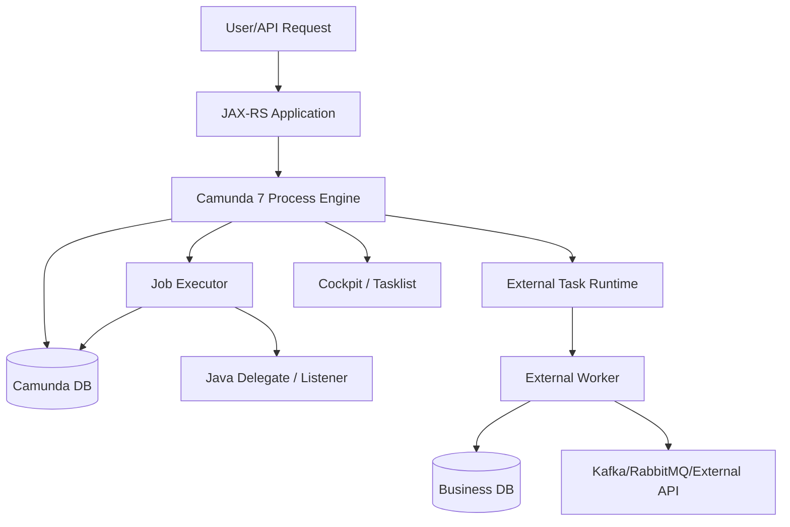

# Part 047 — Camunda 7 Operations

## 1. Core mental model

Camunda 7 operations is mostly the discipline of operating a Java process engine whose runtime state is persisted in a relational database.

That one sentence matters.

Camunda 7 is not just a library that draws BPMN diagrams. It is a runtime that owns:

- deployed BPMN/DMN definitions;
- process instances;
- executions/tokens;
- jobs;
- incidents;
- user tasks;
- external tasks;
- process variables;
- runtime and historic audit data;
- process application registration;
- Java delegate classloading;
- transaction boundaries;
- job acquisition and retry behavior.

In a Java/JAX-RS enterprise system, Camunda 7 can be embedded in the same application runtime, deployed as a shared engine, or operated as a separate engine distribution. The operational consequences are very different.

Senior rule:

> In Camunda 7, many workflow incidents are actually database, transaction, classloading, deployment, or job executor incidents wearing a BPMN costume.

For a CPQ/order management system, a Camunda 7 outage is not only "workflow engine down". It may mean:

- quote approval cannot advance;
- pricing exception cannot be routed;
- order validation does not continue;
- fulfillment orchestration stops;
- fallout tasks age silently;
- timers do not fire;
- retries do not happen;
- manual operations cannot repair instances;
- audit/history becomes unavailable;
- deployment rollback creates version/class mismatch.

## 2. Operational surfaces in Camunda 7

Camunda 7 has several surfaces that must be operated together.

| Surface | What can fail | Operational symptom |
|---|---|---|
| Process engine | engine not booting, wrong config, schema mismatch | app startup failure, REST/Cockpit unavailable |
| Job executor | acquisition stopped, thread starvation, retry exhaustion | async tasks/timers stop progressing |
| Database | connection pool saturation, locks, slow queries, schema mismatch | engine slow, incidents, transaction failures |
| Process applications | deployment mismatch, classloading error, delegate missing | jobs fail with class not found or bean resolution errors |
| BPMN deployment | wrong version, bad model, missing TTL, incompatible migration | new instances start incorrectly or fail |
| External tasks | locked tasks, stale workers, wrong topics, retry exhausted | external automation stops or duplicates side effects |
| Cockpit | operations UI unavailable or missing data | operators cannot inspect/repair process instances |
| Tasklist | task visibility, auth, form, assignment issue | users cannot claim/complete work |
| History cleanup | cleanup disabled, too aggressive, competing with jobs | DB bloat, slow queries, missing audit data |
| REST API | auth/config/version issue | automation scripts/runbooks fail |

Operating Camunda 7 means making sure all surfaces agree about version, schema, configuration, identity, model deployment, and runtime ownership.

## 3. Production invariants

A Camunda 7 environment is production-ready only when these invariants hold:

1. **The engine boots only against the intended schema version.**
2. **The job executor is intentionally enabled or disabled per node.**
3. **Only the correct nodes acquire jobs.**
4. **BPMN/DMN artifacts are versioned, reviewed, and deployed through a controlled pipeline.**
5. **Java delegates/listeners are available on every node that can execute their jobs.**
6. **External task workers have clear topics, lock durations, retry policy, and idempotency.**
7. **Runtime tables remain small enough for predictable job acquisition and queries.**
8. **History retention and cleanup are configured explicitly.**
9. **Cockpit/Tasklist access is secured and auditable.**
10. **Manual repair actions are scripted, reviewed, and logged.**
11. **Backups include both Camunda database state and relevant application/business state.**
12. **Rollback strategy accounts for running process instances, not only application binaries.**

If any of these invariants are missing, the system may pass happy-path testing but fail during migration, worker outage, deployment rollback, or high retry volume.

## 4. Camunda 7 health model

Do not reduce Camunda 7 health to "the pod is up" or "the JVM is running".

A useful health model has layers.

Each layer needs separate signals.

| Layer | Minimum signal |
|---|---|
| Application/JAX-RS | readiness, request latency, error rate, thread pool, deployment version |
| Engine | boot success, schema compatibility, process engine name, deployment count |
| Job executor | active/acquiring state, acquisition latency, jobs due, failed jobs, retries |
| Database | connection pool, locks, deadlocks, slow queries, storage, table bloat |
| Delegates/listeners | exception rate, execution time, business error vs technical error |
| External tasks | locked tasks, lock expiration, retry count, topic lag, worker liveness |
| Cockpit/Tasklist | availability, auth failures, query latency |
| History cleanup | cleanup jobs, duration, deleted rows, failures, DB load impact |

A node can be healthy for JAX-RS traffic and unhealthy for workflow progress. A node can serve REST while its job executor is disabled. A process engine can be up while history cleanup is silently disabled. A worker can be alive while all tasks are locked by a dead worker until lock expiry.

## 5. Engine health checklist

For Camunda 7, check these first during production triage:

- Is the application actually connected to the expected Camunda database?
- Is the process engine name/environment correct?
- Did the engine apply or expect a schema update?
- Are BPMN/DMN deployments visible?
- Are new process instances startable?
- Are existing instances queryable?
- Are runtime tables growing unexpectedly?
- Are history tables growing beyond retention assumptions?
- Is Cockpit showing current runtime state?
- Are Tasklist queries returning expected candidate/assigned tasks?
- Are authorization filters hiding tasks or process instances?

A common operational mistake is to treat "engine API responds" as enough. For workflow systems, health means the engine can execute, persist, query, retry, and expose operator views.

## 6. Job executor operations

The job executor is the operational heart of Camunda 7 automation.

It executes:

- async continuations;
- timer events;
- some message jobs;
- failed job retries;
- history cleanup jobs;
- batch jobs;
- migration/modification batches depending on operation.

A Camunda 7 process can look stuck simply because the job executor is not acquiring jobs.

### 6.1 Job executor failure modes

| Failure mode | Symptom | Likely cause |
|---|---|---|
| Job executor disabled | async tasks/timers never run | config mismatch, embedded engine default, node role mistake |
| Job acquisition slow | due jobs pile up | DB slow query, locks, thread pool too small |
| Jobs repeatedly fail | retries decrease, incident appears | delegate/worker exception, bad variable, downstream outage |
| Exclusive jobs serialize too much | throughput low | exclusive configuration, same process instance contention |
| Timer backlog | SLA/timer events late | acquisition delay, DB pressure, job executor saturation |
| Retry storm | downstream dependency overwhelmed | retry too aggressive, no circuit breaker |
| Deployment class mismatch | jobs fail after rollout | old jobs executed by node without old delegate class |

### 6.2 Triage sequence for job executor issue

Use this order:

1. Confirm whether job executor should run on this node.
2. Check job executor activation config.
3. Check DB connection pool and transaction errors.
4. Count due jobs and failed jobs.
5. Identify whether failures concentrate on one process definition/activity.
6. Inspect exception message and stack trace.
7. Check whether variable payload or serialization is failing.
8. Check whether the delegate/listener class exists in the deployed artifact.
9. Check downstream dependency health.
10. Decide retry, incident resolution, model fix, code fix, or manual repair.

Do not blindly increase retries. Retry is safe only if the failed operation is idempotent and the downstream dependency is recovering.

## 7. Failed jobs and incidents

A failed job is a technical execution unit that failed. An incident is a production signal that the process needs attention.

In Camunda 7, incidents often come from:

- async service task failure;
- timer execution failure;
- Java delegate exception;
- expression evaluation failure;
- variable serialization/deserialization failure;
- external task retry exhaustion;
- message correlation/continuation issue;
- DB transaction failure;
- deployment/classloading mismatch.

### 7.1 Incident triage questions

Ask:

- Which process definition key and version?
- Which process instance/business key?
- Which activity ID failed?
- Which job ID/external task ID failed?
- How many retries remain?
- What exception type?
- Is it deterministic or transient?
- Did the failure start after deployment?
- Is it isolated to one tenant/customer/order or systemic?
- Was there a downstream outage?
- Did duplicate side effects already happen?
- Is manual retry safe?

### 7.2 Incident ownership

Every incident needs one of these owners:

| Incident type | Primary owner |
|---|---|
| BPMN model error | workflow/model owner + backend reviewer |
| Delegate code error | backend service owner |
| External task worker error | worker owner |
| DB contention/schema error | backend + DBA/platform |
| Infrastructure outage | platform/SRE |
| Authorization/task visibility issue | identity/security + backend |
| Bad process data | product/BA + backend |
| Manual business decision stuck | operations/business team |

If ownership is unclear, incidents age. Aging incidents are a process governance failure, not just an engineering bug.

## 8. Database operations

Camunda 7 is database-backed. The database is not just storage; it is part of the execution runtime.

Operationally relevant table families:

| Prefix | Meaning | Operational concern |
|---|---|---|
| `ACT_RE_*` | repository/deployment data | version bloat, wrong deployment, model resources |
| `ACT_RU_*` | runtime state | active executions, tasks, variables, jobs, incidents |
| `ACT_HI_*` | history/audit | retention, growth, query load, compliance |
| `ACT_ID_*` | identity | local identity usage, auth assumptions |
| `ACT_GE_*` | general data | byte arrays, deployment resources, serialized values |

Senior rule:

> In Camunda 7, runtime table growth, history bloat, and large serialized variables become workflow latency.

### 8.1 Database signals to monitor

Monitor:

- DB connection pool usage;
- active connections;
- transaction latency;
- slow queries;
- lock waits;
- deadlocks;
- table size growth;
- index bloat;
- autovacuum health in PostgreSQL;
- storage pressure;
- backup duration;
- replication lag if applicable;
- query latency for job acquisition and task/process queries.

### 8.2 PostgreSQL-specific concerns

If Camunda 7 uses PostgreSQL, validate:

- appropriate isolation level;
- connection pool sizing relative to job executor threads and app traffic;
- autovacuum behavior on frequently updated runtime tables;
- bloat in job, variable, task, and history tables;
- slow query logs for Cockpit/Tasklist queries;
- backup/restore time objective;
- migration script execution procedure;
- whether application business tables and Camunda tables share the same DB instance or cluster.

Sharing the same PostgreSQL cluster for business tables and Camunda runtime can be acceptable, but it couples workflow load with business API latency. During incident storms, Camunda retries can pressure the same DB that serves customer-facing endpoints.

## 9. History cleanup operations

History is necessary for audit and debugging, but unbounded history becomes an operational liability.

Camunda 7 history cleanup is not "free". It is executed via jobs and therefore competes with other job executor work. If cleanup is too aggressive, it can steal resources from timers and async continuations. If cleanup is absent, history tables grow until Cockpit queries, backups, and DB maintenance suffer.

### 9.1 Cleanup decisions

Decide explicitly:

- history level;
- history time-to-live per process/decision;
- cleanup strategy;
- cleanup window;
- batch size;
- degree of parallelism;
- whether every engine node participates;
- retention requirements for audit/compliance;
- whether history cleanup could remove data needed for incident analysis.

### 9.2 Failure modes

| Failure mode | Consequence |
|---|---|
| No TTL | cleanup may not remove intended data |
| No cleanup window | automatic cleanup may not run |
| Batch too large | transaction timeout, DB pressure |
| Parallelism too high | job executor/DB resources stolen from process execution |
| TTL too short | audit/debug evidence lost |
| Cleanup stuck | history tables grow, backups slow |
| Cleanup on wrong nodes | uneven load, inconsistent config |

### 9.3 Runbook for history bloat

1. Confirm table growth and top tables.
2. Confirm history level and TTL policy.
3. Confirm cleanup window and last successful cleanup.
4. Check failed cleanup jobs.
5. Reduce batch size if cleanup times out.
6. Lower degree of parallelism if cleanup competes with business jobs.
7. Run cleanup manually only after impact assessment.
8. Avoid direct DB deletes unless approved by vendor/support and internal governance.
9. Capture evidence for retention/compliance before deletion.

## 10. Deployment cache and classloading operations

Camunda 7 process applications and Java delegates create a tight coupling between deployed BPMN and application classes.

This matters during rolling deployment.

A running process instance may wait at an async boundary. Later, a job executor node executes the job. If the BPMN activity points to a delegate class or expression that is missing or incompatible on that node, the job fails.

### 10.1 Classloading failure modes

- delegate class missing after refactor;
- Spring/CDI bean renamed;
- expression no longer resolves;
- listener class not packaged;
- process application not registered;
- old process version references old code unavailable in new artifact;
- rolling deploy has mixed nodes with different delegate versions;
- shared engine loads process app resources differently from embedded engine.

### 10.2 Safe rollout rule

For Camunda 7 Java delegates:

> Do not remove or rename delegate classes used by running process versions unless all affected instances have completed, migrated, or been given a compatible adapter.

Better patterns:

- keep old delegate classes as wrappers;
- use stable delegate names and route internally by version;
- deploy backward-compatible worker/delegate behavior;
- avoid putting process-version-specific assumptions in shared delegate code;
- use explicit process version and activity ID mapping in tests;
- drain old versions before removing compatibility code.

## 11. Cockpit operations

Cockpit is not just a dashboard. It is often the operational control plane for Camunda 7.

Cockpit may be used to:

- inspect process definitions;
- inspect process instances;
- view current activity;
- inspect variables;
- view incidents;
- retry failed jobs;
- correlate messages;
- suspend/resume definitions or instances;
- modify process instances;
- migrate process instances;
- inspect deployments;
- run batch operations.

### 11.1 Cockpit safety

Control Cockpit access carefully.

Dangerous operations include:

- retrying failed jobs without understanding side effects;
- modifying process instances manually;
- changing variables;
- suspending/resuming definitions;
- deleting/cancelling instances;
- correlating messages manually;
- performing batch operations.

Every manual operation should produce an audit trail:

- who performed it;
- when;
- why;
- affected process/business keys;
- before/after state;
- approval/ticket link;
- customer impact;
- rollback/repair plan.

## 12. Tasklist operations

Tasklist operations focus on manual work not disappearing.

Monitor:

- open task count;
- task age by process/activity/candidate group;
- claim/unclaim patterns;
- completion failure;
- task visibility issues;
- authorization failures;
- stale forms;
- task variables missing or malformed;
- users unable to find tasks;
- SLA breach and escalation.

Common failure modes:

- candidate group changed but identity mapping not updated;
- tenant ID missing;
- task created without due date;
- form expects variable that does not exist;
- variable type changed between process versions;
- task completed concurrently;
- UI caches stale task state;
- custom task API filters incorrectly.

For CPQ/order management, an aged task can be more severe than a failed job because no automated incident may be created. Manual task aging needs explicit alerting.

## 13. External task operations

If Camunda 7 external tasks are used, operate both sides:

- engine-side external task state;
- worker-side polling/lock/complete/fail behavior.

Monitor:

- active topics;
- fetch-and-lock rate;
- locked external tasks;
- lock expiration;
- retry count;
- worker ID distribution;
- worker failure rate;
- complete/failure latency;
- BPMN error usage;
- topic-level incident count.

Failure patterns:

- lock duration too short: duplicate execution risk;
- lock duration too long: slow recovery after worker death;
- worker fetches too many tasks: downstream overload;
- worker completes after lock expiry: completion conflict;
- retry count exhausted without incident ownership;
- long polling misconfigured;
- worker version incompatible with process version.

## 14. Rolling deployment strategy

Camunda 7 rolling deployment must account for four versioned things:

1. application binary;
2. BPMN/DMN model;
3. database schema;
4. running process instance state.

A normal Java service rollback is not enough when the process engine already deployed a new process version or migrated instances.

### 14.1 Safer deployment checklist

Before deployment:

- identify BPMN/DMN changes;
- identify delegate/listener changes;
- identify external task topic/variable contract changes;
- identify DB schema changes;
- identify running process versions affected;
- check whether new model is backward-compatible;
- run migration/drain strategy if needed;
- prepare incident rollback plan;
- prepare forward fix plan.

During deployment:

- deploy one environment at a time;
- monitor failed jobs and incidents immediately;
- monitor job executor acquisition;
- monitor DB load;
- monitor task creation/completion;
- monitor start-process endpoint errors;
- monitor business KPIs such as order progression.

After deployment:

- compare incidents by process version;
- compare job latency by activity;
- validate old running instances still advance;
- validate new instances start expected version;
- validate Tasklist/Cockpit visibility;
- keep compatibility code until old instances are gone or migrated.

## 15. Engine upgrade and database schema upgrade

Camunda 7 upgrades are operationally sensitive because application libraries and database schema must be compatible.

Do not treat an engine upgrade as a dependency bump.

Upgrade risk areas:

- schema update scripts;
- job executor behavior changes;
- history cleanup behavior;
- REST API behavior;
- Cockpit/Tasklist compatibility;
- authorization behavior;
- expression/delegate behavior;
- serialization format;
- database dialect behavior;
- migration guide notes between skipped minor versions.

### 15.1 Upgrade checklist

- Identify current Camunda version.
- Identify target Camunda version.
- Read every intermediate minor version migration guide.
- Confirm whether database update scripts are cumulative or sequential for your path.
- Backup database before schema migration.
- Test upgrade against production-like data volume.
- Test representative running instances.
- Test failed jobs/incidents before and after upgrade.
- Test Cockpit/Tasklist access.
- Test history cleanup.
- Test rollback/restore procedure.
- Confirm support/EOL timeline with vendor and internal platform governance.

## 16. Backup and restore

For Camunda 7, backup/restore must preserve consistency between:

- Camunda runtime DB;
- Camunda history DB if separate;
- business DB tables referenced by process instances;
- worker outbox/inbox/idempotency tables;
- message broker offsets or queues;
- deployed application binaries;
- BPMN/DMN artifacts;
- secrets/config;
- audit logs.

If you restore only Camunda DB without business DB, process instances may point to quote/order state that no longer matches. If you restore business DB without Camunda DB, business records may indicate workflow in progress while no process instance exists.

### 16.1 Restore validation questions

After restore, validate:

- can process engine boot;
- schema version matches engine version;
- process definitions are present;
- running instances are queryable;
- jobs are not duplicated unexpectedly;
- timers are not firing in a dangerous burst;
- workers are paused until validation completes;
- business DB and process state reconcile;
- Cockpit/Tasklist are usable;
- audit/compliance requirements are preserved.

## 17. Kubernetes/cloud/on-prem operational notes

### 17.1 Kubernetes

If Camunda 7 runs in Kubernetes:

- explicitly configure which pods run job executor;
- avoid every horizontally scaled API pod acquiring jobs unless intended;
- configure readiness to include DB/engine readiness, not only HTTP port;
- handle graceful shutdown so job execution is not killed mid-side-effect;
- configure resource limits to avoid CPU throttling job executor threads;
- use pod disruption budgets if engine nodes are critical;
- validate rolling deployment behavior with running jobs;
- externalize DB and secrets properly.

### 17.2 AWS/Azure

For cloud deployments:

- validate managed PostgreSQL failover behavior;
- monitor connection pool after failover;
- test backup restore with actual RPO/RTO;
- configure private networking and TLS;
- store secrets in Secrets Manager/Key Vault or equivalent;
- export logs/metrics to centralized monitoring;
- account for cross-AZ latency and DB I/O limits.

### 17.3 On-prem/hybrid

For on-prem/hybrid:

- verify firewall path between app, DB, workers, and operators;
- document internal CA/TLS trust chain;
- verify patch windows;
- verify backup media and restore procedure;
- clarify responsibility boundary between product team, platform, DBA, and customer operations;
- verify whether operators have Cockpit/Tasklist access during incident windows.

## 18. Production runbooks

### 18.1 Failed job runbook

1. Identify process definition, version, instance, activity, and business key.
2. Read exception and retry count.
3. Classify as transient, deterministic, data-related, code-related, or infrastructure-related.
4. Check downstream dependency health.
5. Check if side effect may already have occurred.
6. If retry-safe, retry after dependency recovery.
7. If data fix is needed, get approval and update through supported API/tooling.
8. If code/model fix is needed, deploy fix and retry.
9. Record incident resolution.
10. Add test/alert to prevent recurrence.

### 18.2 Job executor down runbook

1. Confirm job executor activation.
2. Confirm node role.
3. Check DB connection pool.
4. Check application logs for acquisition errors.
5. Count due jobs and timer backlog.
6. Restart node only if safe and after understanding current jobs.
7. Monitor catch-up behavior after recovery.
8. Watch for retry storm.

### 18.3 History cleanup failure runbook

1. Check cleanup job failures.
2. Check DB locks and transaction timeouts.
3. Reduce batch size if needed.
4. Adjust cleanup window.
5. Reduce degree of parallelism if competing with business jobs.
6. Confirm TTL policy.
7. Do not direct-delete without governance.

### 18.4 Cockpit unavailable runbook

1. Check whether engine is still executing.
2. Check webapp logs/auth/session config.
3. Check DB query latency.
4. Check authorization changes.
5. Provide fallback REST/API query scripts if approved.
6. Avoid manual DB edits.

## 19. Anti-patterns

- All API pods run job executor unintentionally.
- Job executor disabled everywhere.
- BPMN deployment mixed with application deployment without compatibility planning.
- Java delegate classes removed while old process versions still run.
- History cleanup disabled forever.
- History cleanup run during peak business load.
- Cockpit admin access given broadly.
- Manual variable edits without audit trail.
- Retrying incidents blindly.
- Treating process engine DB as reporting database.
- Large process variables stored instead of domain references.
- No backup restore test.
- No runbook for stuck processes.
- No alert for aged user tasks.

## 20. PR review checklist

When reviewing Camunda 7 operational changes, ask:

- Does this change affect BPMN/DMN deployment?
- Does it introduce or rename Java delegates/listeners?
- Does it change async boundaries or retry behavior?
- Does it change external task topics or worker contracts?
- Does it change process variable names/types?
- Does it change history TTL or cleanup behavior?
- Does it change DB schema or indexes?
- Does it affect job executor node roles?
- Does it affect Cockpit/Tasklist authorization?
- Does it affect running process instances?
- Does rollback require process migration or manual repair?
- Are metrics/alerts updated?
- Is there an operational runbook?

## 21. Internal verification checklist

Verify in the actual CSG/team environment:

- Whether Camunda 7 is used at all.
- Whether it is embedded, shared, remote, or not present.
- Actual Camunda version and support/EOL plan.
- Whether process engine tables are in PostgreSQL, another RDBMS, or a managed database.
- Whether business DB and Camunda DB are shared or separate.
- Which nodes run job executor.
- Job executor thread pool/acquisition configuration.
- Failed job and incident dashboard location.
- Cockpit/Tasklist availability and access model.
- History level and history TTL policy.
- History cleanup schedule, batch size, and participation per node.
- Process application deployment model.
- Java delegate/listener package and classloading strategy.
- External task topics and worker topology.
- Backup/restore procedure and last restore test date.
- Upgrade procedure and schema migration ownership.
- Production runbook for failed jobs, stuck process, migration failure, and manual repair.
- SRE/platform/backend/BA ownership boundaries.

## 22. Senior engineer summary

Camunda 7 operations is not only engine administration. It is the ability to keep a database-backed workflow runtime, Java execution model, business process state, manual task system, and operational repair loop coherent under failure.

The strongest Camunda 7 operators can answer:

- what is stuck;
- why it is stuck;
- whether retry is safe;
- whether data is consistent;
- whether the issue is BPMN, Java, DB, worker, or infrastructure;
- whether customer/business impact is contained;
- whether manual repair is safe;
- whether the same failure will recur.

That is the operational bar.

## Official references to verify

- Camunda 7 Manual — The Job Executor: `https://docs.camunda.org/manual/latest/user-guide/process-engine/the-job-executor/`
- Camunda 7 Manual — Database Schema: `https://docs.camunda.org/manual/latest/user-guide/process-engine/database/database-schema/`
- Camunda 7 Manual — History Cleanup: `https://docs.camunda.org/manual/latest/user-guide/process-engine/history/history-cleanup/`
- Camunda 7 Manual — Minor Version Update: `https://docs.camunda.org/manual/latest/update/minor/`
