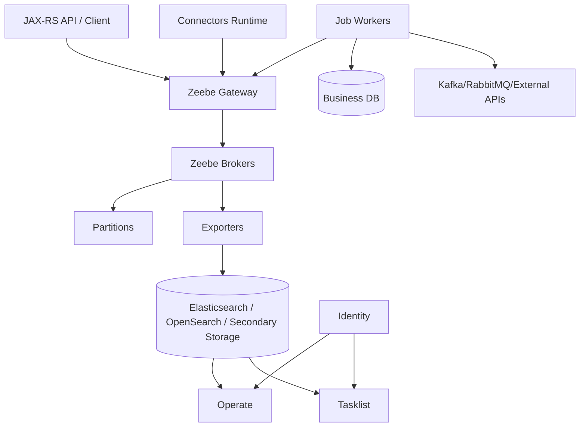

# Part 048 — Camunda 8 Operations

## 1. Core mental model

Camunda 8 operations is the discipline of operating a distributed process orchestration platform.

Unlike Camunda 7, Camunda 8/Zeebe is not an embedded Java process engine inside your JAX-RS service. Your Java service or worker is a client of a remote orchestration runtime.

The operational center shifts from:

> database-backed Java engine inside/near the application

into:

> distributed broker/gateway/worker/search/control-plane ecosystem.

Senior rule:

> In Camunda 8, workflow progress depends on broker partition health, gateway connectivity, worker behavior, exporter/secondary-storage freshness, and operational tooling availability.

For enterprise CPQ/order management, this means an order process may be blocked because:

- a worker cannot activate jobs;
- a gateway is unavailable;
- a broker partition has no healthy leader;
- Zeebe applies backpressure;
- exporters lag and Operate looks stale;
- Elasticsearch/OpenSearch is degraded;
- Identity prevents operators from seeing incidents;
- Tasklist cannot show manual tasks;
- a connector runtime is down;
- workers are deployed but cannot authenticate;
- a process deployment went to the wrong environment/version.

Camunda 8 operations is not only "keep Zeebe up". It is keeping orchestration, workers, operators, identity, task users, secondary storage, and deployment pipeline coherent.

## 2. Main operational components

A Camunda 8 self-managed environment typically involves these components.

| Component | Main role | Operational concern |
|---|---|---|
| Zeebe Gateway | Client entry point for deploy/start/correlate/job activation | connectivity, auth, load, management API, version compatibility |
| Zeebe Broker | distributed process execution and durable log/state | partition health, leader/follower, disk, snapshots, backpressure |
| Partitions | distribute process instance/job load | leader availability, replication, hotspotting |
| Workers | execute jobs outside the engine | connectivity, retries, timeouts, idempotency, safe shutdown |
| Operate | process/incident observability and operations | stale data, auth, secondary storage query health |
| Tasklist | human task UI/API | task visibility, auth, form/task latency |
| Identity | authentication/authorization | login failure, token/config, role/group mapping |
| Connectors | managed/custom integration runtime | secret, connectivity, retry, observability |
| Elasticsearch/OpenSearch/secondary storage | indexing/query/visibility/analytics | exporter lag, shard/replica health, disk, query latency |
| Optimize if used | analytics/reporting | data freshness, query load, retention |
| Web Modeler if used | modeling/deployment collaboration | persistence, auth, environment separation |
| Kubernetes/Helm | deployment substrate | StatefulSet, PVC, resources, probes, PDB, NetworkPolicy |

In Camunda 8, process execution can continue while Operate visibility is delayed. This distinction is critical. Stale Operate data is not always stopped workflow execution; it may be exporter or secondary storage lag.

## 3. Operational invariants

A Camunda 8 production environment is healthy only when these invariants hold:

1. **Gateways are reachable by workers and API clients.**
2. **Brokers have healthy partitions with leaders.**
3. **Replication and snapshots are functioning.**
4. **Backpressure is understood and visible.**
5. **Workers activate and complete jobs within timeout.**
6. **Worker retries and idempotency are safe.**
7. **Operate and Tasklist data freshness is monitored.**
8. **Secondary storage is healthy and not manually modified.**
9. **Identity/authz does not block operational repair.**
10. **Connectors have managed secrets and observable failures.**
11. **Backup/restore covers all required components with matching backup IDs/version.**
12. **Rolling upgrades respect version compatibility and stateful component sequencing.**
13. **Process deployment is controlled and environment-specific.**
14. **Runbooks distinguish engine failure from worker failure from visibility failure.**

If an operator cannot distinguish these, triage will be slow and dangerous.

## 4. Camunda 8 health model

Health is multi-dimensional.

| Health dimension | Example question |
|---|---|
| Gateway health | can clients connect, deploy, start, correlate, activate jobs? |
| Broker health | are brokers alive and able to process records? |
| Partition health | does each partition have a leader and replicas? |
| Worker health | are jobs activated, completed, failed, or timed out? |
| Backpressure | is Zeebe rejecting/throttling work to protect itself? |
| Export health | are records exported to secondary storage? |
| Operate freshness | is UI showing current state or stale exported state? |
| Tasklist health | can users see, assign, and complete tasks? |
| Identity health | can users/workers authenticate/authorize? |
| Secondary storage health | are indices/shards/replicas/storage/query latency healthy? |
| Kubernetes health | are pods scheduled, ready, persistent volumes bound, resources sufficient? |

## 5. Zeebe Gateway operations

The gateway is the main contact point between clients/workers and brokers.

Operational symptoms of gateway problems:

- process deployment fails;
- start process request fails;
- message correlation times out or errors;
- workers cannot activate jobs;
- workers report unavailable/deadline exceeded;
- API latency increases;
- authentication/authorization errors spike;
- gateway pod restarts;
- management/actuator health endpoints fail.

### 5.1 Gateway triage checklist

- Are gateway pods running and ready?
- Is the service/ingress/network path correct?
- Can workers resolve gateway DNS?
- Are TLS/mTLS/OAuth credentials valid?
- Is the gateway compatible with broker version?
- Are broker endpoints reachable from gateway?
- Are there connection pool, memory, or CPU issues?
- Are gRPC/REST ports exposed correctly?
- Are Kubernetes NetworkPolicies blocking clients?
- Did a recent Helm/config change alter port/auth settings?

Do not assume worker code is broken until you verify gateway reachability and authentication.

## 6. Zeebe broker and partition operations

The broker owns durable workflow execution. It writes and processes records, manages state, and hosts partitions.

Partition health matters because process instances and jobs are distributed across partitions. If one partition is unhealthy, only part of workload may be impacted, which makes incidents appear inconsistent.

### 6.1 Broker/partition signals

Monitor:

- broker pod readiness;
- broker restarts;
- disk usage;
- CPU/memory;
- partition leader/follower status;
- replication health;
- snapshot progress;
- processing latency;
- append latency;
- export latency;
- backpressure state;
- job activation latency;
- incident creation rate;
- command rejection/error rate.

### 6.2 Partition failure modes

| Failure mode | Symptom |
|---|---|
| No leader for partition | affected instances/jobs stop progressing |
| Broker disk full | processing/export/snapshot failure, pod crash risk |
| Broker CPU saturated | high latency, backpressure, job activation delay |
| Network split | leader election/replication instability |
| Snapshot failure | recovery risk, disk growth |
| Hot partition | subset of process instances slow |
| Mis-sized cluster | persistent backpressure under normal load |

### 6.3 Triage sequence

1. Identify whether issue affects all processes or only subset.
2. Check gateway health.
3. Check broker pod health.
4. Check partition leadership.
5. Check disk usage and PVC health.
6. Check CPU/memory throttling.
7. Check backpressure metrics.
8. Check exporter lag and secondary storage health.
9. Check worker activation by job type.
10. Compare with recent deployment/config/process model changes.

## 7. Backpressure operations

Backpressure is not automatically bad. It is a protection mechanism that prevents the system from accepting more work than it can safely process.

Bad backpressure is persistent, unplanned, and business-impacting.

Common causes:

- too many process instances started at once;
- job workers completing/failing too slowly;
- large variable payloads;
- too many retries/incidents;
- slow exporters;
- secondary storage pressure;
- broker CPU/disk saturation;
- undersized partition/broker configuration;
- bursty timers or message correlations;
- replay/load test accidentally pointed at production.

### 7.1 Backpressure response

Do not immediately scale workers blindly. More workers can increase command volume and make broker pressure worse.

Response sequence:

1. Confirm which component is applying pressure.
2. Check broker CPU, memory, disk, and partition health.
3. Check exporter/secondary storage lag.
4. Check worker failure/retry rate.
5. Check recent traffic burst or timer burst.
6. Pause non-critical process starts if possible.
7. Reduce worker concurrency if downstream failures are causing retry storm.
8. Scale brokers/partitions only through validated capacity plan.
9. Capture business impact before manual repair.

## 8. Worker connectivity and job activation

In Camunda 8, automation lives in workers. A healthy cluster with unhealthy workers still means business process stagnation.

Monitor workers per job type:

- active worker count;
- activate jobs success/failure;
- jobs activated per minute;
- jobs completed per minute;
- jobs failed per minute;
- BPMN errors thrown;
- job timeout rate;
- job retries remaining;
- max jobs active;
- handler duration;
- downstream call latency;
- graceful shutdown behavior;
- duplicate side-effect detection;
- idempotency table conflicts.

### 8.1 Worker failure patterns

| Pattern | Symptom | Risk |
|---|---|---|
| Worker not connected | jobs remain available/unhandled | stuck process |
| Worker too slow | job timeout, duplicate activation | duplicate side effects |
| Worker fails too fast | retries exhausted, incidents | incident storm |
| Worker concurrency too high | downstream DB/API overloaded | cascading failure |
| Worker incompatible version | variables missing, bad commands | deterministic failure |
| Worker no idempotency | duplicate order/API/event | business corruption |
| Worker killed during deploy | unknown outcome | partial side effects |

### 8.2 Worker deployment rule

> A worker deployment is a workflow runtime change, not only an application deployment.

Before rolling worker deployment:

- verify graceful shutdown;
- verify max jobs active;
- verify job timeout relative to handler duration;
- verify idempotency key;
- verify backward compatibility with running process versions;
- verify secrets and gateway auth;
- verify canary metrics by job type;
- verify rollback behavior.

## 9. Incidents and Operate operations

Operate is the primary place operators inspect process instances and incidents in Camunda 8.

But remember:

> Operate is based on exported/indexed data. If export/secondary storage is lagging, Operate can be stale even when Zeebe execution continues.

### 9.1 Incident triage questions

- Which process definition ID and version?
- Which process instance key?
- Which element instance/activity?
- Which job type?
- Which worker handled it?
- What variables were present?
- How many retries remain?
- Is the failure transient or deterministic?
- Did it start after worker/model/deployment change?
- Is Operate data fresh?
- Is repair through Operate safe?
- Could retry duplicate side effects?

### 9.2 Operate safety

Manual repair in Operate can be powerful and dangerous.

Treat these as controlled operations:

- variable update;
- incident resolution;
- moving token/element instance if supported in your version;
- cancelling process instance;
- retrying failed work;
- batch operations.

Require:

- ticket/change record;
- business key list;
- exact before/after state;
- approval for customer-impacting repair;
- idempotency review before retry;
- audit note;
- post-repair verification.

## 10. Tasklist operations

Tasklist health means humans can see and complete the right tasks at the right time.

Monitor:

- open user tasks;
- task creation rate;
- task completion rate;
- task age by type/group/tenant;
- task assignment/claim failures;
- form rendering errors;
- authorization failures;
- Tasklist query latency;
- stale task data due to secondary storage lag;
- concurrent completion conflicts.

Failure modes:

- Identity misconfiguration hides tasks;
- candidate group mapping wrong;
- form variable missing;
- task state stale;
- user completes task after process moved forward;
- Tasklist unavailable while Zeebe continues creating tasks;
- operator assumes no task exists because UI is stale.

For CPQ/order management, Tasklist outage can block quote approval, fallout handling, manual validation, and escalation processes.

## 11. Identity operations

Identity is an operational dependency, not only a security component.

If Identity or its upstream IdP is broken:

- operators cannot access Operate;
- users cannot access Tasklist;
- service accounts may not authenticate;
- connectors/workers may fail depending on credential model;
- emergency repair may be blocked.

Operational checklist:

- validate IdP availability;
- validate client secrets/certificates;
- validate token issuer/audience;
- validate role/group mapping;
- validate tenant mapping;
- validate service account rotation;
- validate break-glass access procedure;
- validate audit trail for operator actions.

Do not design incident response that requires a UI login path that fails during the same incident.

## 12. Connectors operations

Connectors reduce custom worker code, but they are still production integration points.

Operate them like workers:

- track connector runtime health;
- track outbound connector success/failure;
- track inbound trigger behavior;
- track secret resolution failures;
- track downstream API latency;
- track retry behavior;
- track incident creation;
- track payload size;
- track connector template changes;
- track version compatibility.

Connector failure modes:

- secret missing or rotated incorrectly;
- network path blocked;
- downstream API throttling;
- retry storm;
- payload/schema mismatch;
- connector template incompatible with process model;
- insufficient logging for debugging;
- using connector for logic that should be custom worker code.

Senior rule:

> Use connectors for integration plumbing; use workers for business-critical orchestration behavior that needs strong idempotency, domain logic, and custom observability.

## 13. Secondary storage operations

Camunda 8 uses secondary storage for indexing/search/visibility/analytics. Depending on version and configuration, this may involve Elasticsearch, OpenSearch, RDBMS-backed secondary storage, or other documented supported options.

Secondary storage is not the same as Zeebe primary execution state.

Operational consequences:

- Zeebe may continue while Operate/Tasklist visibility is delayed;
- exporter lag can make incidents appear late;
- search cluster pressure can slow dashboards;
- manual index modifications are dangerous;
- backup/restore must coordinate primary and secondary stores;
- retention and shard/replica sizing affect both cost and reliability.

### 13.1 Secondary storage signals

Monitor:

- exporter lag;
- indexing latency;
- search cluster health;
- shard/replica allocation;
- disk usage;
- JVM heap if Elasticsearch/OpenSearch;
- query latency;
- index template conflicts;
- backup snapshot success;
- retention/data purge jobs;
- Operate/Tasklist query errors.

### 13.2 Dangerous anti-pattern

Never directly edit secondary storage data as a normal repair procedure.

If Operate shows wrong data, diagnose exporter lag, index health, or support-guided reindex/recovery. Direct edits can corrupt visibility, break upgrades, or create unsupported states.

## 14. Process deployment operations

A Camunda 8 process deployment changes future process behavior. It may also affect workers if job types, variables, messages, timers, or forms changed.

Deployment runbook:

1. Validate BPMN/DMN/forms locally.
2. Check job type compatibility.
3. Check message names/correlation keys.
4. Check variables and input/output mappings.
5. Check task forms and authorization.
6. Deploy to lower environment.
7. Start representative process instances.
8. Trigger workers, messages, timers, BPMN errors, and incidents.
9. Validate Operate/Tasklist visibility.
10. Deploy to production through controlled pipeline.
11. Monitor incidents by process version.
12. Keep old workers compatible until old process instances complete or migrate.

Bad process deployment can be worse than bad code deployment because old running instances remain alive while new instances start on new version.

## 15. Rolling upgrade operations

Camunda 8 self-managed upgrades involve stateful distributed components. Treat upgrades as platform changes.

Upgrade risk areas:

- Helm chart version;
- Camunda component version compatibility;
- Zeebe broker/gateway compatibility;
- exporter/search schema/index changes;
- Identity configuration;
- Tasklist/Operate compatibility;
- connector runtime compatibility;
- worker client compatibility;
- configuration property changes;
- backup compatibility;
- Kubernetes resource changes.

### 15.1 Upgrade checklist

- Identify current component versions.
- Identify target version and supported upgrade path.
- Read release notes and migration guide.
- Validate Helm chart version matrix.
- Take coordinated backup.
- Test upgrade in production-like environment.
- Test process deployment/start/correlation/job activation.
- Test existing running instances.
- Test Operate/Tasklist/Identity login.
- Test secondary storage/exporter health.
- Test rollback or forward-recovery plan.
- Freeze risky process/worker deployments during platform upgrade.

## 16. Backup and restore operations

Backup/restore in Camunda 8 must be coordinated.

A restore must account for:

- Zeebe broker state;
- secondary storage state;
- Operate/Tasklist/indexed data;
- Optimize data if used;
- Web Modeler data if used;
- Identity/config/secrets;
- worker/business DB state;
- message offsets/queues;
- deployed artifacts and Helm values.

The key operational rule:

> Restore matching backups from the same backup point/version. Do not mix Zeebe state from one time with secondary storage from another unless the official procedure explicitly supports it.

### 16.1 Restore validation

After restore:

- keep workers paused until state is verified;
- verify broker startup;
- verify partition health;
- verify gateway connectivity;
- verify secondary storage restored;
- verify Operate/Tasklist visibility;
- verify running process instances;
- verify incidents/jobs;
- verify no timer burst causes unsafe side effects;
- reconcile business DB vs process state;
- restart workers gradually;
- monitor duplicate/late side effects.

## 17. Kubernetes operations

Camunda 8 self-managed is commonly deployed through Kubernetes and Helm.

Key Kubernetes checks:

- namespaces and separation of management/orchestration workloads;
- StatefulSet for broker stateful workloads;
- PVC binding and storage class performance;
- pod anti-affinity;
- resource requests/limits;
- readiness/liveness probes;
- pod disruption budgets;
- NetworkPolicy;
- service/ingress configuration;
- TLS certificates;
- secrets and config maps;
- Helm values drift;
- node pool sizing;
- persistent volume backup;
- rolling restart behavior;
- worker deployment rollout.

For brokers, disk and network stability matter as much as CPU. For workers, graceful shutdown and concurrency matter as much as pod readiness.

## 18. Cloud/on-prem/hybrid operations

### 18.1 AWS/Azure

In managed cloud deployments, validate:

- private networking to brokers/gateway;
- managed OpenSearch/Elasticsearch equivalent health;
- managed PostgreSQL if Web Modeler/other components use it;
- object storage backup bucket;
- IAM/workload identity;
- Secrets Manager/Key Vault integration;
- load balancer timeout;
- DNS/certificate rotation;
- CloudWatch/Azure Monitor alerts;
- cross-zone storage/network behavior.

### 18.2 On-prem/hybrid

In on-prem/hybrid deployments, validate:

- firewall and proxy behavior for workers;
- TLS/internal CA trust;
- air-gapped image/chart distribution;
- patch/upgrade procedure;
- backup storage;
- monitoring integration;
- responsibility boundary between customer/platform/product team;
- disaster recovery drill;
- remote worker connectivity across network boundaries.

Hybrid worker topology deserves special care. A worker outside the Kubernetes cluster may fail due to firewall, DNS, TLS, proxy, or network latency even when the cluster is healthy.

## 19. Production runbooks

### 19.1 Worker not receiving jobs

1. Check worker logs and authentication.
2. Check gateway DNS/connectivity.
3. Check gateway health.
4. Check job type matches BPMN task type.
5. Check process instances are actually waiting at that task.
6. Check partition/broker health.
7. Check backpressure.
8. Check worker max jobs active and timeout.
9. Check version compatibility.
10. Check if another worker is consuming jobs.

### 19.2 Job repeatedly failing

1. Identify process instance key and element ID.
2. Identify job type and worker version.
3. Inspect failure message and variables.
4. Classify transient vs deterministic.
5. Check downstream DB/API/Kafka/RabbitMQ.
6. Check idempotency before retry.
7. Deploy worker/model/data fix if needed.
8. Resolve incident only after root cause is addressed.
9. Record repair details.

### 19.3 Operate stale or unavailable

1. Check whether Zeebe execution is still progressing.
2. Check exporter lag.
3. Check secondary storage health.
4. Check Operate pod logs/readiness.
5. Check Identity/auth failures.
6. Avoid assuming process state from stale UI.
7. Use approved API/management tools if needed.
8. Do not manually edit secondary storage.

### 19.4 Partition/broker issue

1. Identify affected broker/partition.
2. Check pod/PVC/node health.
3. Check leader/follower state.
4. Check disk/memory/CPU.
5. Check recent node disruption or network event.
6. Check snapshot/exporter logs.
7. Follow platform runbook for restart/recovery.
8. Validate process progression after recovery.
9. Watch for timer/job catch-up burst.

### 19.5 Backup restore drill

1. Pick restore point.
2. Restore secondary storage as required by official procedure.
3. Restore Zeebe cluster state.
4. Start all components in correct order.
5. Verify component versions match backup.
6. Validate Operate/Tasklist/Identity.
7. Validate process instance progression.
8. Reconcile business DB.
9. Start workers gradually.
10. Capture RTO/RPO result.

## 20. Alerting strategy

Minimum production alerts:

- gateway unavailable;
- broker unavailable;
- partition without leader;
- broker disk high;
- broker restart loop;
- persistent backpressure;
- exporter lag high;
- secondary storage red/yellow or equivalent degraded status;
- Operate unavailable;
- Tasklist unavailable;
- Identity unavailable;
- worker activation errors;
- job timeout rate high;
- incident count increasing;
- task age SLA breached;
- message correlation failure spike;
- timer backlog;
- process deployment failure;
- connector failure spike;
- backup failure.

Alerts should include business context where possible:

- process definition;
- process version;
- job type;
- tenant/customer;
- quote/order ID;
- environment;
- deployment version;
- incident count by age.

## 21. Anti-patterns

- Treating Operate freshness as identical to Zeebe execution health.
- Scaling workers up during downstream outage, creating retry storm.
- Using job timeout shorter than real handler duration.
- No graceful shutdown for workers.
- No idempotency table for side-effecting workers.
- No partition/broker dashboard.
- No exporter/secondary storage lag alert.
- Manually editing Elasticsearch/OpenSearch indices.
- Treating connectors as invisible black boxes.
- No break-glass access when Identity fails.
- No backup restore drill.
- Process deployment not tied to worker compatibility.
- Helm values changed manually outside GitOps.
- No runbook for stuck incidents.

## 22. PR review checklist

When reviewing Camunda 8 operational changes, ask:

- Does this change affect job types?
- Does it affect worker timeout/retry/concurrency?
- Does it affect variable payload size?
- Does it affect message correlation key/name?
- Does it affect user task/form/authorization?
- Does it affect connector secret/config/runtime?
- Does it affect gateway/broker/partition sizing?
- Does it affect Elasticsearch/OpenSearch/secondary storage?
- Does it affect Helm values/resources/PVCs?
- Does it affect Identity/OIDC config?
- Does it affect backup/restore procedure?
- Does it affect running process versions?
- Are metrics/alerts updated?
- Is there a runbook for failure and rollback?

## 23. Internal verification checklist

Verify in the actual CSG/team environment:

- Whether Camunda 8 is used.
- Whether it is SaaS or self-managed.
- Actual Camunda version and upgrade path.
- Whether deployment uses Helm, GitOps, custom manifests, or managed platform automation.
- Zeebe broker count, gateway count, and partition count.
- Broker PVC/storage class and backup configuration.
- Whether Elasticsearch, OpenSearch, RDBMS secondary storage, or another supported option is used.
- Exporter configuration and data freshness dashboard.
- Operate/Tasklist/Identity availability and access model.
- Worker topology: in-cluster, external, hybrid, per team, per job type.
- Worker auth/secret model.
- Job timeout/retry convention.
- Backpressure dashboard and response runbook.
- Incident dashboard and ownership model.
- Connector usage and connector runtime ownership.
- Backup/restore drill evidence.
- Upgrade runbook and version compatibility matrix.
- Kubernetes namespace, StatefulSet, PVC, PDB, resource, and NetworkPolicy configuration.
- Cloud/on-prem networking path for workers.
- SRE/platform/backend/product/BA operational ownership boundaries.

## 24. Senior engineer summary

Camunda 8 operations requires distributed-systems thinking.

A senior backend engineer should be able to determine whether a workflow failure is caused by:

- process model problem;
- worker problem;
- gateway problem;
- broker/partition problem;
- exporter/secondary storage problem;
- Operate/Tasklist/Identity problem;
- connector problem;
- Kubernetes/cloud/on-prem infrastructure problem;
- downstream business system problem;
- deployment/version compatibility problem.

The safe operating posture is:

1. protect workflow correctness;
2. protect business state;
3. protect idempotency;
4. protect observability;
5. protect auditability;
6. repair only with enough evidence;
7. automate runbooks after repeated incidents.

Camunda 8 can be a strong orchestration platform, but only if the team treats brokers, workers, search, identity, connectors, and process models as one production system.

## Official references to verify

- Camunda 8 Docs — Zeebe on Self-Managed: `https://docs.camunda.io/docs/self-managed/components/orchestration-cluster/zeebe/overview/`
- Camunda 8 Docs — Management API: `https://docs.camunda.io/docs/self-managed/components/orchestration-cluster/zeebe/operations/management-api/`
- Camunda 8 Docs — Manage secondary storage: `https://docs.camunda.io/docs/self-managed/concepts/secondary-storage/managing-secondary-storage/`
- Camunda 8 Docs — Restore a backup: `https://docs.camunda.io/docs/self-managed/operational-guides/backup-restore/elasticsearch/es-restore/`
- Camunda 8 Docs — Helm installation: `https://docs.camunda.io/docs/self-managed/setup/install/`
- Camunda 8 Docs — Kubernetes/Helm production guide: `https://docs.camunda.io/docs/self-managed/operational-guides/production-guide/helm-chart-production-guide/`
