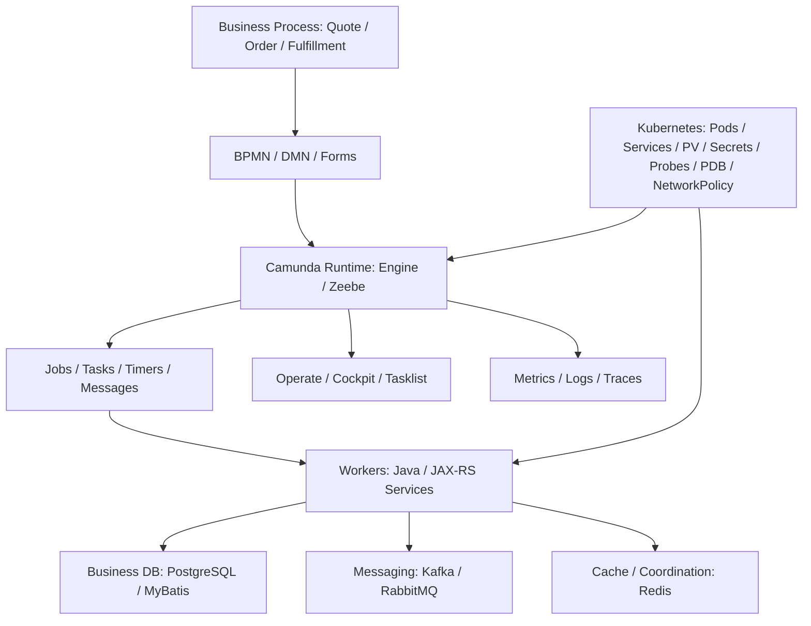

# Part 049 — Camunda in Kubernetes

> Fokus part ini: memahami bagaimana Camunda berjalan di Kubernetes sebagai sistem orchestration production, bukan sekadar `helm install`.

Kubernetes tidak otomatis membuat Camunda menjadi reliable. Kubernetes hanya memberi primitive: scheduling, service discovery, restart, config injection, secret injection, persistent storage, rollout, dan resource isolation. Reliability tetap lahir dari desain topology, storage, worker contract, retry policy, observability, backup, dan runbook.

Camunda di Kubernetes harus dibaca sebagai gabungan beberapa runtime:

1. **workflow engine / orchestration cluster**,
2. **worker applications**,
3. **human task / operational UI**,
4. **database atau secondary storage**,
5. **identity and security boundary**,
6. **network path antara client, worker, broker/engine, dan external systems**,
7. **GitOps / CI/CD path untuk BPMN, DMN, forms, connectors, dan worker code**.

Untuk senior backend engineer, pertanyaan utamanya bukan “pod-nya running atau tidak?”, tetapi:

- Apakah process instance tetap aman saat pod di-restart?
- Apakah worker bisa berhenti tanpa menggandakan side effect?
- Apakah Zeebe broker atau Camunda 7 engine punya persistence yang benar?
- Apakah retry storm dapat membuat cluster collapse?
- Apakah deployment worker compatible dengan BPMN version yang sudah aktif?
- Apakah Kubernetes scaling memperbaiki bottleneck atau justru memperbanyak duplicate execution?
- Apakah failure dapat dideteksi dari metric, log, trace, dan dashboard operasional?

---

## 1. Kubernetes Mental Model for Workflow Systems

Workflow system berbeda dari stateless REST API biasa.

REST API stateless biasanya berurusan dengan request-response pendek. Workflow engine berurusan dengan **stateful orchestration**: process instance, jobs, timers, messages, incidents, user tasks, retries, and historical/audit data.

Di Kubernetes, ada tiga jenis state yang harus dipisahkan:

| State type | Contoh | Harus diperlakukan bagaimana |
|---|---|---|
| **Business state** | quote status, order status, approval decision, fulfillment step | Source of truth di business database/domain service |
| **Workflow runtime state** | process instance, token/element instance, job, timer, incident | Dikelola Camunda runtime/Zeebe state/database |
| **Operational state** | logs, metrics, traces, dashboard, backup, dead letters | Dikelola observability/platform tooling |

Kesalahan umum adalah memperlakukan Kubernetes restart sebagai solusi semua masalah. Restart pod dapat membantu jika pod crash karena transient issue, tetapi tidak menyelesaikan:

- process variable corrupt,
- bad BPMN deployment,
- incompatible worker version,
- missing correlation key,
- duplicate side effect,
- database lock contention,
- exhausted retries,
- stuck human task,
- unavailable external dependency,
- overloaded secondary storage,
- Zeebe partition leadership problem,
- Camunda 7 job executor backlog.

Kubernetes adalah runtime substrate. Correctness workflow tetap berada di desain Camunda, worker, database transaction, message semantics, dan runbook.

---

## 2. Deployment Shape: Camunda 7 vs Camunda 8

### 2.1 Camunda 7 on Kubernetes

Camunda 7 sering muncul dalam beberapa bentuk:

1. **Embedded engine inside Java/JAX-RS application**  
   Engine hidup di dalam aplikasi backend. Pod aplikasi bukan hanya REST API, tetapi juga process engine runtime.

2. **Shared/container-managed engine**  
   Engine berjalan sebagai shared service dalam container/application server.

3. **External task workers as separate deployments**  
   Engine membuat external task, worker pods melakukan fetch-and-lock.

4. **Cockpit/Tasklist/Admin as operational UI**  
   Bisa berada di aplikasi yang sama atau deployment berbeda, tergantung packaging.

Implikasi Kubernetes:

- jika embedded engine diskalakan horizontal, setiap pod engine bisa ikut mengambil job;
- database Camunda 7 menjadi pusat contention dan durability;
- rolling deployment harus memperhatikan delegate classloading, deployment cache, BPMN version, dan job executor;
- resource limit terlalu agresif dapat membuat Java process engine sering restart;
- liveness probe yang salah dapat membunuh pod saat engine sedang lambat karena DB pressure.

### 2.2 Camunda 8 / Zeebe on Kubernetes

Camunda 8 self-managed secara natural lebih cocok dipahami sebagai distributed orchestration cluster:

- **Zeebe brokers** menyimpan dan memproses workflow state;
- **Zeebe gateway** menjadi entrypoint client/worker;
- **Operate** untuk operational visibility;
- **Tasklist** untuk human task;
- **Identity** untuk authentication/authorization;
- **Connectors** untuk integration abstraction;
- **secondary storage** untuk search/read/query UI dan beberapa API use case;
- **job workers** berjalan sebagai aplikasi terpisah, biasanya Deployment.

Camunda mendokumentasikan Kubernetes + Helm sebagai pendekatan production yang direkomendasikan untuk Camunda 8 self-managed. Tetapi “recommended” bukan berarti default chart values sudah cukup untuk production. Nilai production harus disesuaikan dengan topology, storage, identity, ingress, network policy, resource, backup, dan observability.

---

## 3. Kubernetes Object Mapping

Mapping mental model yang berguna:

| Kubernetes object | Peran di Camunda deployment |
|---|---|
| `Namespace` | Boundary deployment, RBAC, quota, network policy |
| `StatefulSet` | Cocok untuk komponen stateful seperti Zeebe broker atau storage internal jika digunakan |
| `Deployment` | Cocok untuk gateway, UI, connectors, workers, stateless application services |
| `Service` | Stable network identity untuk gateway, workers, UI, engine endpoint |
| `Ingress` / Gateway API | External/internal HTTP access untuk UI/API |
| `ConfigMap` | Non-secret configuration: endpoints, feature flags, log levels |
| `Secret` | Credentials, tokens, TLS material, connector secrets, DB password |
| `PersistentVolumeClaim` | Durable disk untuk broker/storage bila diperlukan |
| `ServiceAccount` | Identity pod untuk Kubernetes API/cloud IAM integration |
| `PodDisruptionBudget` | Melindungi availability saat voluntary disruption |
| `NetworkPolicy` | Membatasi pod-to-pod dan pod-to-external traffic |
| `HorizontalPodAutoscaler` | Scaling workers/gateway/stateless components, bukan magic throughput fix |
| `TopologySpreadConstraints` / anti-affinity | Mendistribusikan pods antar node/AZ |
| `ResourceQuota` / `LimitRange` | Menjaga namespace tidak mengambil resource berlebihan |

Senior review harus melihat object ini sebagai **contract operasional**, bukan YAML noise.

---

## 4. Helm Chart Strategy

Helm memberi packaging dan parameterization. GitOps memberi reconciliation. Keduanya tidak menggantikan review arsitektur.

### 4.1 Values file harus diperlakukan sebagai architecture artifact

`values.yaml` Camunda production sebaiknya direview seperti code:

- component enable/disable,
- replica count,
- persistence,
- resource requests/limits,
- ingress,
- TLS,
- authentication,
- external database/search endpoint,
- secrets reference,
- pod disruption budget,
- affinity/topology spread,
- NetworkPolicy,
- metrics exposure,
- backup configuration,
- upgrade strategy.

Anti-pattern:

```yaml
# Anti-pattern: values file tidak menjelaskan intent production.
zeebe:
  replicas: 1
elasticsearch:
  enabled: true
resources: {}
```

Lebih baik:

```yaml
# Example only. Verify against actual Camunda chart version.
zeebe:
  replicas: 3
  resources:
    requests:
      cpu: "2"
      memory: "4Gi"
    limits:
      memory: "4Gi"
  pvcSize: "64Gi"

global:
  identity:
    auth:
      enabled: true

# Prefer managed secondary storage in production when aligned with platform standards.
elasticsearch:
  enabled: false

operate:
  enabled: true

tasklist:
  enabled: true
```

Checklist utama: jangan copy-paste Helm values dari quickstart ke production.

### 4.2 Version pinning

Pin chart version dan application version. Jangan bergantung pada implicit latest.

```bash
helm repo add camunda https://helm.camunda.io
helm repo update
helm search repo camunda/camunda-platform --versions
```

Di GitOps, chart version harus eksplisit:

```yaml
apiVersion: source.toolkit.fluxcd.io/v1
kind: HelmRepository
metadata:
  name: camunda
spec:
  url: https://helm.camunda.io
---
apiVersion: helm.toolkit.fluxcd.io/v2
kind: HelmRelease
metadata:
  name: camunda
spec:
  chart:
    spec:
      chart: camunda-platform
      version: "<pin-exact-chart-version>"
      sourceRef:
        kind: HelmRepository
        name: camunda
```

Hal yang perlu diverifikasi:

- chart version compatible dengan Camunda version;
- upgrade notes dibaca;
- breaking changes di component config dipahami;
- rollback procedure tidak diasumsikan mudah untuk stateful system.

---

## 5. StatefulSet vs Deployment

### 5.1 Kapan StatefulSet penting

Gunakan StatefulSet mental model ketika komponen butuh:

- stable network identity,
- stable persistent volume,
- ordered rollout,
- identity per replica,
- data locality / partition state.

Zeebe broker adalah contoh stateful workload. Broker tidak boleh diperlakukan seperti stateless worker biasa.

Risiko jika salah memahami stateful workload:

- pod restart menjadi rebalancing mahal;
- PVC hilang berarti state loss jika backup tidak benar;
- node drain bisa menurunkan quorum/availability;
- storage latency dapat menjadi workflow latency;
- scaling broker tidak otomatis memindahkan semua bottleneck.

### 5.2 Kapan Deployment cukup

Deployment cocok untuk:

- Zeebe gateway,
- Operate/Tasklist/Identity-like stateless frontends tergantung versi/topology,
- connectors runtime jika stateless,
- Java/JAX-RS workers,
- external task workers,
- API services yang start/correlate process.

Deployment restart harus aman. Untuk workers, ini berarti:

- graceful shutdown,
- tidak mengambil job baru saat termination,
- menyelesaikan atau melepas in-flight job dengan aman,
- idempotency terhadap retry after timeout,
- readiness false sebelum shutdown efektif.

---

## 6. Worker Deployment Pattern

Workflow workers adalah tempat side effect terjadi. Di Kubernetes, worker pods harus dirancang lebih hati-hati daripada stateless REST handler.

### 6.1 Worker lifecycle

Worker lifecycle ideal:

1. Pod starts.
2. App initializes config, DB pool, HTTP clients, Kafka/RabbitMQ clients, Redis clients.
3. App becomes ready only after dependencies minimum healthy.
4. Worker activates/fetches jobs.
5. Worker processes job with idempotency guard.
6. Worker commits business side effect.
7. Worker completes/fails/BPMN-errors job.
8. During shutdown, worker stops polling/activation.
9. In-flight work finishes or safely times out.
10. Pod exits.

### 6.2 Graceful shutdown

Example Spring-ish pseudocode, conceptually applicable to Java/JAX-RS worker runtime:

```java
public final class WorkflowWorkerLifecycle {
  private final AtomicBoolean acceptingJobs = new AtomicBoolean(false);
  private final ExecutorService executor;

  public void start() {
    acceptingJobs.set(true);
    // Register Zeebe worker or Camunda 7 external task worker here.
  }

  public void beginShutdown() {
    acceptingJobs.set(false);
    // Stop job activation / fetch-and-lock.
    // Wait for bounded in-flight jobs.
    executor.shutdown();
  }

  public boolean isReady() {
    return acceptingJobs.get() && dependenciesHealthy();
  }
}
```

Kubernetes termination settings harus mendukung ini:

```yaml
spec:
  terminationGracePeriodSeconds: 60
  containers:
    - name: quote-order-worker
      lifecycle:
        preStop:
          exec:
            command: ["/bin/sh", "-c", "sleep 10"]
      readinessProbe:
        httpGet:
          path: /health/ready
          port: 8080
      livenessProbe:
        httpGet:
          path: /health/live
          port: 8080
```

`preStop sleep` bukan solusi utama. Ia hanya memberi waktu kecil agar endpoint readiness turun dari service endpoint sebelum SIGTERM efektif. Logic utama tetap di aplikasi worker.

### 6.3 Worker scaling

Scaling worker bukan hanya menaikkan replicas.

Pertimbangkan:

- max active jobs per worker;
- thread pool size;
- DB pool size;
- external API rate limit;
- Kafka/RabbitMQ publish throughput;
- Redis connection limit;
- job timeout;
- retry policy;
- partition distribution;
- CPU/memory request;
- downstream service capacity.

Formula kasar:

```text
total_worker_capacity ≈ replicas × concurrency_per_pod × avg_success_rate_per_thread
```

Tetapi capacity efektif dibatasi oleh dependency paling sempit:

```text
effective_capacity = min(
  worker_cpu_capacity,
  db_capacity,
  external_api_capacity,
  broker_gateway_capacity,
  kafka_or_rabbitmq_capacity,
  redis_capacity,
  rate_limit_budget
)
```

Scaling worker tanpa memperhatikan idempotency dan downstream capacity dapat menghasilkan:

- retry storm,
- DB lock contention,
- external API throttling,
- duplicate side effect,
- larger incident backlog,
- noisy alerting.

---

## 7. Resource Requests and Limits

### 7.1 Requests are scheduling contracts

`requests` menentukan resource minimum untuk scheduling. Jika terlalu rendah, pod mungkin ditempatkan di node yang tidak punya headroom nyata. Untuk Java/Camunda component, ini bisa terlihat sebagai:

- GC pressure,
- latency spike,
- timeout,
- worker fail job,
- gateway/broker instability,
- readiness flapping.

### 7.2 Limits are failure triggers if misused

Memory limit terlalu rendah menyebabkan OOMKilled. CPU limit terlalu rendah menyebabkan throttling.

Untuk workflow system, CPU throttling dapat terlihat sebagai:

- worker lambat menyelesaikan job;
- job timeout;
- duplicate activation setelah timeout;
- false incident;
- delayed timer;
- delayed message correlation handling;
- poor UI responsiveness.

Example worker resource block:

```yaml
resources:
  requests:
    cpu: "500m"
    memory: "1Gi"
  limits:
    memory: "1Gi"
```

Gunakan CPU limit dengan hati-hati. Banyak platform memilih menetapkan CPU request tanpa CPU limit untuk latency-sensitive JVM workloads, tetapi ini harus mengikuti standard SRE/platform internal.

### 7.3 JVM container awareness

Untuk Java/JAX-RS workers dan Camunda 7 embedded engine:

- pastikan JVM container-aware;
- set heap sebagai porsi dari memory limit, bukan sama dengan limit;
- sisakan native memory, metaspace, thread stacks, direct buffers;
- monitor GC pause;
- jangan menyimpulkan workflow lambat hanya dari CPU pod.

Example JVM option:

```bash
JAVA_TOOL_OPTIONS="-XX:MaxRAMPercentage=70 -XX:+ExitOnOutOfMemoryError"
```

---

## 8. Probes: Liveness, Readiness, Startup

Probe yang salah dapat membuat outage lebih buruk.

### 8.1 Liveness probe

Liveness seharusnya menjawab: “apakah proses ini macet dan perlu direstart?”

Jangan memasukkan dependency transient seperti DB/API eksternal ke liveness. Jika DB lambat lalu semua pods restart, outage akan membesar.

Buruk:

```java
GET /health/live
  checks database
  checks kafka
  checks zeebe
  checks redis
```

Lebih aman:

```java
GET /health/live
  checks app event loop / JVM basic health
```

### 8.2 Readiness probe

Readiness menjawab: “apakah pod ini siap menerima traffic atau job?”

Untuk worker, readiness harus false ketika:

- app masih booting;
- worker sedang draining;
- dependency utama tidak tersedia;
- config invalid;
- database migration belum siap;
- credential invalid.

### 8.3 Startup probe

Startup probe berguna untuk komponen yang startup-nya lama. Tanpa startup probe, liveness bisa membunuh pod sebelum selesai bootstrap.

```yaml
startupProbe:
  httpGet:
    path: /health/startup
    port: 8080
  failureThreshold: 30
  periodSeconds: 10
```

---

## 9. Pod Disruption Budget and Rolling Deployment

PDB melindungi dari voluntary disruption seperti node drain atau cluster upgrade.

Example:

```yaml
apiVersion: policy/v1
kind: PodDisruptionBudget
metadata:
  name: quote-order-worker-pdb
spec:
  minAvailable: 2
  selector:
    matchLabels:
      app: quote-order-worker
```

Untuk worker, PDB menjaga kapasitas minimum. Untuk Zeebe broker, PDB dapat membantu menjaga quorum/availability, tetapi harus disesuaikan dengan topology broker dan partition replication.

Rolling deployment worker harus mempertimbangkan:

- old worker masih compatible dengan old/new BPMN?
- new worker compatible dengan old running instances?
- job type berubah atau tidak?
- variable contract berubah atau tidak?
- database migration sudah backward-compatible?
- canary worker aman atau tidak?
- deployment dapat dihentikan jika incident naik?

---

## 10. Anti-Affinity and Topology Spread

Workflow infrastructure harus tahan terhadap node/AZ-level failure.

Gunakan anti-affinity/topology spread untuk:

- menyebar broker pods;
- menyebar gateway pods;
- menyebar critical workers;
- mengurangi single-node blast radius;
- menghindari semua replicas jatuh saat node drain.

Example:

```yaml
spec:
  topologySpreadConstraints:
    - maxSkew: 1
      topologyKey: topology.kubernetes.io/zone
      whenUnsatisfiable: ScheduleAnyway
      labelSelector:
        matchLabels:
          app: quote-order-worker
```

Namun topology spread bukan pengganti:

- backup;
- replication;
- tested restore;
- data consistency design;
- external dependency HA.

---

## 11. Persistent Volume Strategy

Stateful components membutuhkan storage yang benar.

Pertanyaan review:

- StorageClass apa yang dipakai?
- Apakah volume encrypted?
- Apakah reclaim policy aman?
- Apakah snapshot/backup diuji?
- Apakah disk latency dipantau?
- Apakah PVC resize strategy tersedia?
- Apakah node/AZ binding dipahami?
- Apakah restore procedure diuji di environment non-prod?

Untuk Camunda 7, persistence utama biasanya di database. Untuk Camunda 8, Zeebe broker state dan secondary storage memiliki kebutuhan durability yang berbeda. Jangan menganggap satu backup untuk semua cukup.

Backup harus konsisten dengan dependency:

- Zeebe state,
- secondary storage,
- identity data,
- external DB,
- BPMN/DMN artifacts in Git,
- worker version/container image,
- Helm values.

---

## 12. NetworkPolicy and Service Boundaries

NetworkPolicy membuat eksplisit siapa boleh bicara ke siapa.

Example intent:

```text
workers -> zeebe-gateway
workers -> business database
workers -> Kafka/RabbitMQ/Redis
operate/tasklist -> secondary storage
user browser -> ingress -> tasklist/operate
external clients -> ingress/API gateway -> JAX-RS API
```

Anti-pattern:

```text
all pods can talk to all pods on all ports
```

Minimum review:

- worker hanya bisa mengakses gateway dan dependency yang dibutuhkan;
- UI tidak bisa langsung mengakses business DB;
- Camunda operational UI dibatasi internal/VPN/SSO;
- database/search tidak diekspos publik;
- namespace boundary jelas;
- egress ke external API dikontrol;
- DNS dependency dimonitor.

---

## 13. Ingress, TLS, and Internal Access

Tidak semua Camunda component perlu public ingress.

Biasanya:

- Tasklist mungkin internal user-facing;
- Operate biasanya internal operations-facing;
- Zeebe gateway biasanya internal service-facing;
- connectors/runtime biasanya internal;
- API service mungkin public/private tergantung product;
- Cockpit/Tasklist Camunda 7 harus dibatasi ketat.

TLS checklist:

- TLS terminates di ingress atau service mesh?
- mTLS antar service dipakai atau tidak?
- certificate rotation otomatis?
- internal CA trusted oleh workers?
- gRPC gateway connectivity tested?
- hostname/cert SAN sesuai?
- TLS failure alert tersedia?

---

## 14. ConfigMap and Secret Discipline

ConfigMap untuk non-secret config:

- endpoint name,
- feature flag non-sensitive,
- worker job type,
- log level,
- timeout value,
- concurrency value.

Secret untuk:

- DB password,
- OAuth client secret,
- connector secret,
- Kafka/RabbitMQ credential,
- Redis password,
- TLS private key,
- service token.

Anti-pattern:

```yaml
apiVersion: v1
kind: ConfigMap
metadata:
  name: camunda-worker-config
data:
  DB_PASSWORD: "plaintext"
```

Secret tetap bukan magic security jika:

- semua developer bisa read secret;
- secret dicetak di logs;
- environment variable terekspos ke connector expression;
- pod exec dibuka terlalu luas;
- secret rotation tidak diuji.

---

## 15. GitOps for Camunda and Workers

GitOps cocok untuk Camunda karena workflow artifact harus versioned dan reviewable.

Repository ideal memisahkan:

```text
repo/
  bpmn/
  dmn/
  forms/
  connectors/
  workers/
  helm-values/
  kustomize/
  environments/
    dev/
    test/
    staging/
    prod/
  runbooks/
  dashboards/
```

Hal yang harus bisa dilacak:

- BPMN version deployed ke environment;
- worker image tag yang compatible;
- Helm chart version;
- config/secret reference;
- migration script;
- observability dashboard;
- rollback/forward-fix plan;
- approval trail.

GitOps anti-pattern:

- manual edit di cluster;
- BPMN deployed dari laptop;
- process model berubah tanpa PR review;
- worker image `latest`;
- production values tidak dikunci;
- no drift alert.

---

## 16. Camunda 7 Kubernetes Failure Modes

### 16.1 Embedded engine pod restart

Symptom:

- job executor stops temporarily;
- in-flight delegate transaction rolls back;
- external clients see 5xx;
- acquired locks may release later;
- repeated restarts create backlog.

Debug:

- pod restart count;
- JVM OOM/GC logs;
- DB connection pool metrics;
- failed jobs;
- incident count;
- deployment version;
- job executor acquisition logs.

### 16.2 Multiple embedded engines competing

Symptom:

- job throughput unpredictable;
- optimistic locking exceptions;
- duplicate-ish side effect if delegates not idempotent;
- DB load spike.

Debug:

- number of engine pods;
- job executor enabled per pod;
- async boundaries;
- exclusive jobs;
- delegate idempotency;
- DB locks and slow queries.

### 16.3 Classloading after rolling deploy

Symptom:

- old process instance reaches delegate class not available anymore;
- expression cannot resolve bean;
- job repeatedly fails.

Debug:

- process definition version;
- app image version;
- delegate class existence;
- deployment cache;
- old running instances;
- rollback compatibility.

---

## 17. Camunda 8 Kubernetes Failure Modes

### 17.1 Broker pod restart

Symptom:

- temporary partition unavailability;
- gateway request failures;
- worker activation latency;
- Operate lag;
- increased backpressure.

Debug:

- broker pod logs;
- partition health;
- leader/follower status;
- disk latency;
- PVC health;
- memory/CPU throttling;
- cluster topology.

### 17.2 Gateway unavailable

Symptom:

- workers cannot activate jobs;
- process start/correlation fails;
- API services see gRPC/connection errors.

Debug:

- gateway pod readiness;
- service endpoints;
- network policy;
- TLS config;
- DNS;
- broker connectivity;
- client retry config.

### 17.3 Worker scaled too aggressively

Symptom:

- external API throttling;
- DB connection exhaustion;
- job failures increase;
- incidents rise;
- retry storm.

Debug:

- worker replicas;
- max jobs active;
- DB pool usage;
- external API 429/5xx;
- fail job reasons;
- retry distribution.

### 17.4 Secondary storage lag

Symptom:

- Operate/Tasklist stale;
- process state appears delayed;
- operators retry manually based on stale UI;
- search query slow.

Debug:

- exporter health;
- secondary storage health;
- indexing lag;
- disk pressure;
- CPU/memory;
- query latency.

---

## 18. Kubernetes Observability Checklist

Minimum dashboard:

### Cluster/workload

- pod restart count;
- pod readiness flaps;
- CPU throttling;
- memory usage/OOMKilled;
- network errors;
- PVC usage;
- disk latency;
- node pressure;
- deployment rollout status.

### Camunda runtime

- active process instances;
- jobs activated/completed/failed;
- incidents;
- retry exhaustion;
- timer backlog;
- message correlation failures;
- user task aging;
- gateway/broker health;
- partition health;
- exporter lag;
- Camunda 7 DB/job executor health.

### Worker

- job latency;
- job duration;
- fail rate;
- BPMN error rate;
- timeout rate;
- duplicate/idempotency hit rate;
- downstream dependency latency;
- in-flight jobs during shutdown.

### Business

- quote approval aging;
- order fallout count;
- fulfillment backlog;
- cancellation/amendment stuck count;
- SLA breach;
- manual intervention queue size.

---

## 19. Production-Safe Debugging Steps

When workflow issue happens in Kubernetes:

1. Identify business impact.
2. Identify process definition and version.
3. Identify process instance/business key/correlation key.
4. Check current activity/job/task/timer/message wait state.
5. Check worker deployment version and rollout time.
6. Check pod restart/OOM/throttling.
7. Check engine/broker/gateway health.
8. Check database/search/Kafka/RabbitMQ/Redis dependency.
9. Check recent GitOps sync and Helm release changes.
10. Avoid manual retry until idempotency and side effect status are known.
11. If retry is safe, retry with audit trail.
12. If not safe, use manual repair path with approval.

Never start with “delete the pod” unless you understand what state the pod owns and what side effect was in-flight.

---

## 20. Internal Verification Checklist

Verify in CSG/team before assuming any of the following:

### Camunda and deployment model

- Is Camunda used at all?
- Which version: Camunda 7, Camunda 8 SaaS, Camunda 8 self-managed, or custom workflow?
- Is Camunda 7 embedded inside Java/JAX-RS service?
- Is Camunda 8 deployed via Helm?
- Are workers inside the same Kubernetes cluster or external?
- Are operational tools exposed: Cockpit, Tasklist, Operate, Optimize?

### Kubernetes manifests / Helm / GitOps

- Where are Helm values stored?
- Which chart version is pinned?
- Are manifests managed by Argo CD, Flux, Jenkins, GitHub Actions, or another pipeline?
- Is production manually mutable?
- Is drift detection enabled?
- Are BPMN/DMN/forms deployed through CI/CD?

### Runtime and storage

- For Camunda 7: which PostgreSQL/RDBMS schema stores runtime/history?
- For Camunda 8: what stores Zeebe broker data?
- What is secondary storage: Elasticsearch, OpenSearch, RDBMS, or other supported backend?
- Are PVCs encrypted and backed up?
- Are restore procedures tested?

### Worker operations

- What are worker deployments?
- What are job types/topics?
- What is max concurrency per worker?
- What is graceful shutdown behavior?
- What is idempotency mechanism?
- What happens during rolling deployment?

### Security

- Who can access Tasklist/Operate/Cockpit?
- Are service accounts least privilege?
- Are secrets in Kubernetes Secret, external secret manager, or plain env vars?
- Is TLS/mTLS enforced?
- Are NetworkPolicies enabled?

### Observability

- Which dashboard shows incidents, job failures, worker latency, task aging, SLA breach?
- Are logs correlated by process instance/business key/correlation ID?
- Are traces propagated from JAX-RS API to worker to external dependency?
- Are retry storms alerted?
- Are manual repairs audited?

---

## 21. PR Review Checklist

Use this when reviewing Kubernetes/Camunda-related PRs:

### Deployment

- [ ] Chart version pinned.
- [ ] App image tag immutable.
- [ ] Values file reviewed for production intent.
- [ ] Rollout strategy safe for stateful/stateless component.
- [ ] PDB configured for critical workloads.
- [ ] Affinity/topology spread considered.

### Worker correctness

- [ ] Worker has graceful shutdown.
- [ ] Worker stops taking jobs before termination.
- [ ] Job timeout aligned with processing duration.
- [ ] Idempotency key defined.
- [ ] Retry behavior understood.
- [ ] DB/API/event side effects are safe on duplicate execution.

### Resource and scaling

- [ ] CPU/memory requests defined.
- [ ] JVM memory configured against container memory.
- [ ] HPA does not exceed downstream capacity.
- [ ] DB pool sizing matches replica count.
- [ ] External API rate limit considered.

### Security

- [ ] Secrets not in ConfigMap/plain YAML.
- [ ] ServiceAccount/RBAC least privilege.
- [ ] NetworkPolicy considered.
- [ ] UI ingress protected by SSO/VPN/private network.
- [ ] TLS configuration verified.

### Observability

- [ ] Metrics exposed and scraped.
- [ ] Logs include correlation identifiers.
- [ ] Alerts exist for incidents/job failures/task aging.
- [ ] Dashboards updated with new component/job type.
- [ ] Runbook updated.

### GitOps

- [ ] No manual deployment dependency.
- [ ] Environment promotion path clear.
- [ ] Rollback/forward-fix path documented.
- [ ] BPMN/DMN and worker version compatibility checked.

---

## 22. Failure-Oriented Questions Senior Engineers Should Ask

- What happens if this worker pod is killed after DB commit but before job completion?
- What happens if Kubernetes restarts all workers during an external API outage?
- Can this HPA create a retry storm?
- Can two worker versions process the same process version safely?
- What if Operate/Tasklist is stale during incident response?
- What if a NetworkPolicy blocks workers from the Zeebe gateway?
- What if the secret rotates while pods are running?
- What if a broker pod cannot reattach its volume?
- What if a node drain happens during peak order fulfillment?
- What if a bad BPMN deployment is synced by GitOps to production?

---

## 23. Practical Mental Model

For Camunda in Kubernetes, think in layers:



Kubernetes is the platform. Camunda is the orchestrator. Workers own side effects. Database owns business state. Observability owns truth during incident response. GitOps owns repeatable deployment. Runbook owns recovery.

---

## 24. Sources and Further Reading

- Camunda 8 Self-Managed deployment overview: Kubernetes + Helm is recommended for production-ready environments.
- Camunda Helm chart documentation: production installation, chart parameters, and deployment reference.
- Camunda secondary storage documentation: Operate, Tasklist, Identity, and search APIs depend on secondary storage options depending on deployment and version.
- Camunda supported environments documentation: deployment options and Kubernetes support model.
- Kubernetes documentation: workloads, probes, StatefulSet, Deployment, Services, NetworkPolicy, PDB, resource management.

---

## 25. Key Takeaway

Camunda in Kubernetes is not just “Camunda running as pods”. It is a distributed production workflow system whose correctness depends on:

- stable runtime state,
- safe worker lifecycle,
- durable storage,
- controlled rollout,
- explicit network/security boundaries,
- accurate observability,
- compatible BPMN/worker versions,
- tested backup/restore,
- and disciplined incident handling.

A senior engineer should review Kubernetes YAML as workflow correctness infrastructure, not as deployment plumbing.
