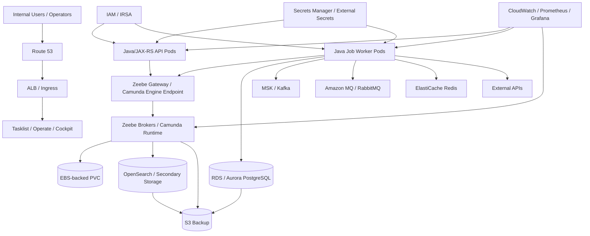
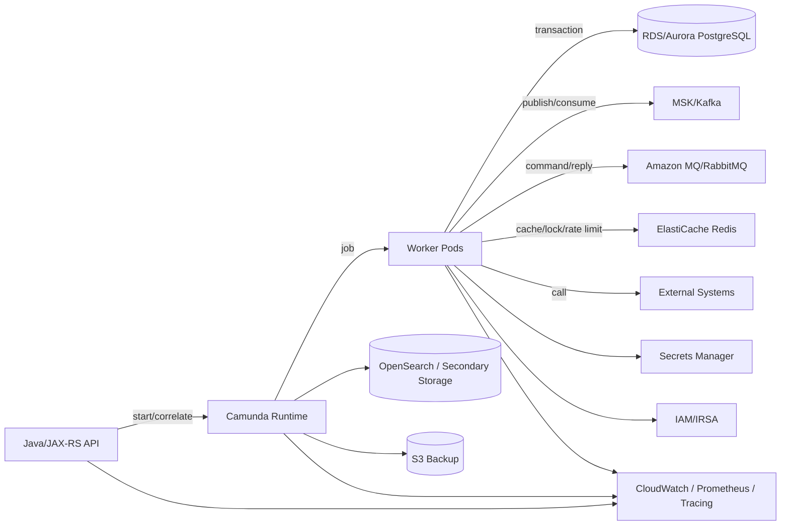

# Part 050 — Camunda on AWS

> Fokus part ini: memahami deployment Camunda di AWS sebagai production architecture, terutama ketika Camunda, Java/JAX-RS workers, PostgreSQL, Kafka/RabbitMQ/Redis, Kubernetes, networking, IAM, backup, dan observability bertemu dalam satu sistem mission-critical.

AWS tidak otomatis membuat Camunda highly available. AWS memberi building blocks: EKS, EC2, RDS/Aurora, OpenSearch, S3, IAM, Secrets Manager, KMS, VPC, Load Balancer, Route 53, CloudWatch, EBS, EFS, MSK, MQ, ElastiCache. Reliability lahir dari bagaimana building blocks itu dipilih, dikonfigurasi, dihubungkan, dimonitor, dan dioperasikan.

Untuk CSG Quote & Order atau enterprise CPQ/order management context, AWS deployment harus dibaca dari sudut pandang risiko business process:

- Apakah quote approval tetap jalan saat worker rollout?
- Apakah order fulfillment tidak menggandakan side effect saat retry?
- Apakah fallout/manual intervention tetap visible saat search/indexing dependency lambat?
- Apakah process instance bisa dipulihkan setelah cluster/storage issue?
- Apakah secrets dan PII tidak bocor ke logs, variables, incident, atau task forms?
- Apakah cloud failure mode punya runbook jelas?

Jangan mengarang detail internal. Semua deployment detail CSG harus diverifikasi lewat repository, platform/SRE, architecture docs, dan production dashboard.

---

## 1. AWS Deployment Mental Model

Camunda di AWS biasanya hadir dalam salah satu bentuk berikut:

| Shape | Runtime | Typical AWS components | Main risk |
|---|---|---|---|
| Camunda 7 embedded in Java service | Java/JAX-RS app includes process engine | EKS/ECS/EC2 + RDS PostgreSQL/Aurora + ALB/NLB | DB contention, job executor scaling, classloading, rolling deploy |
| Camunda 7 shared engine | Engine as shared Java app | EKS/ECS/EC2 + RDS + ALB + Cockpit/Tasklist | shared runtime ownership, schema upgrade, operational coupling |
| Camunda 8 self-managed on EKS | Zeebe + Camunda components | EKS + EBS + OpenSearch/RDBMS secondary storage + S3 backup + IAM/Secrets | broker/storage/search topology, partition health, backup/restore |
| Workers on EKS | Java/JAX-RS job workers | EKS + RDS + MSK/RabbitMQ/MQ + ElastiCache + Secrets Manager | duplicate side effect, retry storm, downstream throttling |
| Hybrid AWS/on-prem | Engine or workers split across network boundary | VPC, VPN/Direct Connect, private endpoints, firewalls | latency, TLS, network partition, responsibility boundary |

The most important architectural question:

```text
Where does each kind of state live, and who owns recovery?
```

- Business state: PostgreSQL/domain service.
- Workflow runtime state: Camunda 7 DB or Zeebe broker state.
- Search/visibility state: OpenSearch/Elasticsearch/RDBMS secondary storage depending on version/topology.
- Message state: Kafka/MSK, RabbitMQ/Amazon MQ, SQS if used internally.
- Cache/coordination state: Redis/ElastiCache.
- Deployment state: GitOps/Helm/ECR image tags.
- Recovery state: backups, snapshots, runbooks, audit trail.

---

## 2. Reference AWS Topology

A typical production-oriented AWS topology may look like this:



This is not a prescription. It is a map of concerns. Actual CSG architecture must be verified internally.

---

## 3. Camunda 7 on AWS

### 3.1 Runtime shape

Camunda 7 is Java-based and often deployed as:

- embedded engine in backend app;
- shared engine service;
- engine + Cockpit/Tasklist web app;
- external task workers as independent apps.

On AWS, the most common backing store is a managed relational database such as RDS PostgreSQL or Aurora PostgreSQL, if PostgreSQL is the chosen DB. For CSG, verify actual DB vendor/schema.

### 3.2 RDS/Aurora as Camunda 7 runtime database

Camunda 7 database is not just reporting storage. It is runtime coordination:

- deployments,
- runtime executions,
- variables,
- jobs,
- incidents,
- history,
- identity if used,
- locks and optimistic locking behavior.

AWS implications:

- RDS failover can pause job execution;
- connection pool misconfiguration can exhaust DB connections;
- Multi-AZ improves availability but does not remove failover impact;
- read replica is not a substitute for runtime write availability;
- history cleanup can compete with runtime workload;
- DB storage growth must be monitored;
- backup retention and PITR must match audit/regulatory needs.

### 3.3 Camunda 7 embedded engine on EKS

If Camunda 7 is embedded in Java/JAX-RS pods:

- every app pod may become part of job execution;
- rolling deployment changes both API and engine runtime;
- job executor thread pool and DB pool must be sized together;
- classloading/delegate compatibility becomes deployment risk;
- pod restart can interrupt delegate work;
- liveness probe must not create restart storm during RDS slowdown.

Review questions:

- Which pods have job executor enabled?
- Is job executor disabled for API-only pods?
- Are async jobs exclusive where needed?
- Are delegates idempotent?
- Are old process instances compatible with new image?
- Is RDS connection pool per replica accounted for?

### 3.4 Camunda 7 external task workers on AWS

External task workers may run on EKS/ECS/EC2. They need:

- worker identity,
- network access to engine endpoint,
- lock duration aligned with processing time,
- idempotency for duplicate fetch after lock expiry,
- safe shutdown during deployment,
- metrics for lock extension/failure/retry.

AWS-specific risks:

- ALB/NLB timeout breaks long polling;
- security group blocks engine endpoint;
- DNS/cache issue causes worker disconnect;
- Secrets Manager permission failure prevents startup;
- NAT gateway issue blocks external APIs;
- pod scheduled in subnet without route to dependency.

---

## 4. Camunda 8 on AWS EKS

Camunda documentation includes EKS-oriented deployment guidance for self-managed Camunda 8. The practical architecture usually includes:

- EKS cluster;
- Camunda Helm chart;
- Zeebe brokers with persistent volumes;
- Zeebe gateway;
- Operate/Tasklist/Identity/Connectors depending on enabled components;
- secondary storage such as OpenSearch/Elasticsearch or RDBMS depending on version/topology and support matrix;
- S3 or object storage for backups if configured;
- IAM Roles for Service Accounts for cloud permissions;
- Secrets Manager/External Secrets for credentials;
- ALB/NLB/Ingress for UI/API exposure.

### 4.1 EKS cluster concerns

EKS design affects workflow reliability.

Review:

- private vs public node groups;
- multi-AZ node groups;
- subnet sizing;
- pod density;
- CNI IP exhaustion;
- security groups for pods if used;
- node instance type memory/IO profile;
- managed node group vs Karpenter/autoscaler;
- cluster upgrade plan;
- add-on versions: VPC CNI, CoreDNS, kube-proxy, EBS CSI driver;
- PDBs before node upgrades;
- worker disruption during node rotation.

### 4.2 Zeebe brokers and EBS-backed PVC

Zeebe broker state should be treated as critical state.

AWS EBS considerations:

- volume type and IOPS/throughput;
- encryption with KMS;
- AZ binding;
- snapshot policy;
- restore test;
- disk pressure alert;
- PVC expansion procedure;
- node drain behavior;
- EBS attach/detach delays;
- backup consistency with Camunda procedure.

Failure example:

```text
Broker pod rescheduled -> EBS volume attach delayed -> partition unavailable -> workers cannot activate jobs -> API starts timing out -> retry backlog grows.
```

Debug path:

1. Check broker pod event.
2. Check PVC/PV status.
3. Check EBS attach event.
4. Check partition health.
5. Check gateway errors.
6. Check worker activation latency.
7. Check incidents/backpressure.

### 4.3 Zeebe Gateway and load balancing

Gateway is the contact point for clients/workers.

AWS concerns:

- internal load balancer vs cluster-internal service;
- gRPC support and timeout;
- TLS termination and certificate trust;
- security group ingress;
- NLB health check;
- DNS resolution;
- client retry/backoff;
- cross-AZ traffic cost/latency.

For workers inside EKS, Kubernetes Service may be enough. For workers outside EKS, internal NLB/private endpoint may be required.

### 4.4 Secondary storage: OpenSearch/RDBMS

Operate/Tasklist/search-oriented capabilities depend on secondary storage architecture. AWS deployment may use Amazon OpenSearch Service or another supported backend depending on Camunda version, topology, and support matrix.

Risks:

- OpenSearch indexing lag makes Operate stale;
- shard pressure causes slow queries;
- disk watermark blocks writes;
- security group blocks component access;
- index retention is not aligned with audit needs;
- manual index manipulation corrupts operational visibility;
- backup/restore not coordinated with Zeebe.

Review questions:

- Which secondary storage backend is used?
- Is it managed or in-cluster?
- What is retention?
- Is encryption enabled?
- Is access private?
- Are dashboards monitoring indexing lag and search latency?
- Is restore procedure tested?

---

## 5. AWS Networking Design

Networking is often where workflow failure hides.

### 5.1 VPC and subnet placement

Production pattern usually prefers:

- private subnets for EKS nodes;
- private subnets for RDS/OpenSearch/Redis/MQ;
- public subnets only for load balancers if needed;
- NAT gateway for controlled outbound internet access;
- VPC endpoints for AWS services when possible;
- dedicated security groups per component class.

Workflow implication:

- if workers cannot reach Zeebe gateway, jobs stop;
- if workers cannot reach DB, jobs fail/retry;
- if workers cannot reach external API, compensation/retry may trigger;
- if Operate cannot reach secondary storage, incident visibility degrades;
- if DNS/CoreDNS fails, everything looks random.

### 5.2 Security groups

Security groups should encode the intended dependency graph.

Example intent:

```text
worker-sg -> zeebe-gateway-sg: 26500/gRPC
worker-sg -> rds-sg: 5432
worker-sg -> redis-sg: 6379
worker-sg -> kafka-sg: broker ports
camunda-components-sg -> opensearch-sg: 443
alb-sg -> tasklist/operate ingress: 8080/8443
```

Anti-pattern:

```text
0.0.0.0/0 allowed to workflow UI or runtime ports
```

### 5.3 Private endpoints and VPC endpoints

Use private connectivity where possible for:

- Secrets Manager;
- S3;
- ECR;
- CloudWatch Logs;
- STS;
- KMS;
- OpenSearch endpoint;
- RDS/Aurora;
- MSK/RabbitMQ/Redis.

If NAT is the only path and NAT fails, workers may lose access to AWS APIs or external services.

---

## 6. IAM, IRSA, and Service Accounts

IAM must be least privilege.

IRSA lets Kubernetes service accounts assume IAM roles. Camunda documentation includes AWS IRSA validation guidance for EKS deployments. In practice, use IRSA to avoid static AWS credentials in pods.

Common permissions:

- read specific Secrets Manager secret;
- write logs/metrics if needed;
- access S3 backup bucket;
- access KMS key for decrypt/encrypt;
- pull from ECR via node/cluster integration;
- access managed OpenSearch with IAM if configured.

Bad pattern:

```text
all Camunda pods share broad admin IAM role
```

Better pattern:

```text
zeebe-backup-sa -> S3 backup bucket only
worker-payment-sa -> specific secret + specific downstream permission
operate-sa -> secondary storage access only
```

Review questions:

- Which service account maps to which IAM role?
- Are policies resource-scoped?
- Is STS endpoint reachable privately?
- Are permissions tested in non-prod?
- Are failed permission errors observable?

---

## 7. Secrets Manager, KMS, and External Secrets

Secrets likely include:

- DB credentials;
- OAuth/OIDC client secrets;
- connector secrets;
- Kafka/RabbitMQ credentials;
- Redis auth;
- TLS private keys;
- API tokens;
- Camunda client credentials.

AWS pattern:

- store secret in Secrets Manager or Parameter Store;
- encrypt with KMS;
- sync into Kubernetes Secret via External Secrets Operator or CSI driver;
- mount/inject into pod;
- rotate with controlled rollout.

Failure modes:

- worker cannot start after secret rotation;
- old pod keeps old credential until restart;
- external secret sync fails;
- KMS permission denied;
- secret accidentally logged;
- connector has access to too broad environment variables.

Security review:

- no secret in Git;
- no secret in ConfigMap;
- no secret in BPMN/DMN/form file;
- no secret in process variable;
- no secret in incident message;
- no secret in logs/traces;
- rotation tested.

---

## 8. Load Balancer, DNS, and TLS

### 8.1 ALB vs NLB

High-level guidance:

- ALB is common for HTTP UI/API ingress;
- NLB may be preferred for gRPC/TCP-style gateway access depending on architecture;
- internal load balancer is usually safer for workflow runtime endpoints;
- public exposure of operational UI should be avoided or heavily protected.

### 8.2 Route 53 and DNS

DNS failure can look like random worker failure.

Monitor:

- DNS resolution latency;
- CoreDNS errors;
- Route 53 health checks if used;
- certificate hostname mismatch;
- stale DNS during failover.

### 8.3 TLS and ACM

TLS checklist:

- ACM certificate managed and monitored;
- internal certs trusted by JVM;
- mTLS if required by platform;
- cert rotation does not break workers;
- gRPC clients support TLS config;
- endpoint hostname matches cert SAN.

---

## 9. RDS/Aurora PostgreSQL

PostgreSQL may be involved in multiple ways:

1. Business database for quote/order state.
2. Camunda 7 engine database if Camunda 7 is used.
3. Camunda 8 secondary storage option for supported components/topologies, depending on version.
4. Identity/Web Modeler-related database, depending on deployment.

Do not merge these concerns without deliberate architecture review.

### 9.1 Business DB vs Camunda DB

Keep mental separation:

```text
business DB: domain source of truth
Camunda DB/runtime storage: workflow runtime/internal state
secondary storage: search/query/visibility support
```

If the same PostgreSQL cluster hosts multiple schemas, review blast radius:

- slow query in business app affects workflow;
- history cleanup affects business DB performance;
- migration locks impact worker throughput;
- backup/restore scope becomes complicated.

### 9.2 RDS failure modes

- failover causes temporary connection errors;
- connection pool does not recover cleanly;
- max connections exhausted by worker replicas;
- storage autoscaling lag;
- slow query from missing index;
- lock contention from concurrent workers;
- transaction ID wraparound risk if neglected;
- parameter group change requires reboot;
- maintenance window surprises workflow load.

### 9.3 MyBatis/JDBC worker concerns

Worker code should:

- use bounded transactions;
- commit business DB change before completing job if using commit-before-complete pattern;
- store idempotency key with unique constraint;
- use optimistic locking for entity transition;
- write outbox event in same transaction;
- avoid holding DB transaction while waiting external API;
- expose SQL errors with correlation ID.

Example idempotency table:

```sql
CREATE TABLE workflow_processed_job (
  idempotency_key text PRIMARY KEY,
  process_instance_key text NOT NULL,
  job_key text NOT NULL,
  worker_type text NOT NULL,
  business_key text NOT NULL,
  processed_at timestamptz NOT NULL DEFAULT now(),
  result_ref text
);
```

---

## 10. OpenSearch / Elasticsearch on AWS

If Amazon OpenSearch Service or Elasticsearch-compatible storage is used for Camunda secondary storage, treat it as operationally critical for visibility and some query paths.

Risks:

- indexing lag makes process state appear stale;
- shard imbalance causes search latency;
- high JVM pressure on OpenSearch nodes;
- disk watermark stops indexing;
- security plugin/IAM misconfiguration blocks Camunda components;
- snapshot repository not configured;
- domain upgrade changes behavior;
- query dashboards overload cluster.

Observability:

- index latency;
- rejected writes;
- search latency;
- JVM memory pressure;
- disk usage;
- cluster status;
- shard allocation;
- exporter lag;
- Operate/Tasklist freshness.

Runbook question:

```text
If OpenSearch is stale but Zeebe runtime is healthy, what should operators trust and what actions are unsafe?
```

Usually, avoid manual retries based only on stale UI. Confirm runtime state from authoritative API/tooling and worker logs.

---

## 11. S3 Backup and Restore

S3 is often used as durable object storage for backups, snapshots, or exported artifacts.

Backup scope must be explicit:

- Zeebe backup if Camunda 8 self-managed supports/configures it;
- OpenSearch/secondary storage snapshot;
- RDS automated backup/PITR/snapshot;
- Helm values;
- BPMN/DMN/forms/connectors from Git;
- worker image tags from ECR;
- secrets metadata/rotation plan;
- dashboards/runbooks.

S3/KMS checklist:

- bucket private;
- versioning enabled if required;
- lifecycle policy defined;
- KMS encryption;
- IAM role scoped;
- cross-region replication if required;
- restore tested;
- backup success alert;
- backup age alert;
- restore time objective measured.

Critical point: backup that is never restored is only a hope, not a recovery capability.

---

## 12. AWS Messaging Dependencies

### 12.1 Kafka / MSK

If workflow integrates with Kafka/MSK:

- event correlation key must be stable;
- replay behavior must be safe;
- consumer group reset must not duplicate process starts unsafely;
- schema registry compatibility matters;
- MSK broker outage affects process starts/correlation/publish;
- IAM/SASL/TLS config must be rotated safely.

Review:

- idempotent process start;
- outbox for event publish;
- inbox for event consume;
- correlation key mapping;
- replay runbook;
- topic retention vs business SLA.

### 12.2 RabbitMQ / Amazon MQ

If RabbitMQ/Amazon MQ is used:

- ack/redelivery semantics interact with worker retry;
- DLQ can hide workflow failures;
- reply correlation must be deterministic;
- message TTL must align with process timeout;
- broker failover can duplicate delivery.

Review:

- queue durability;
- DLQ policy;
- retry layer boundary;
- duplicate message handling;
- routing key governance;
- alert on DLQ growth.

### 12.3 Redis / ElastiCache

If Redis/ElastiCache is used:

- do not make it source of truth for process state;
- TTL must be deliberate;
- failover can drop transient locks;
- cluster mode impacts key distribution;
- security groups and TLS matter;
- cache staleness can mislead UI/status.

Review:

- idempotency store durability expectation;
- distributed lock correctness;
- rate limiter fallback;
- process status cache invalidation;
- Redis outage behavior.

---

## 13. Observability on AWS

A production deployment should connect Camunda, Kubernetes, AWS, and business process metrics.

### 13.1 CloudWatch logs

Log fields should include:

- process definition key;
- process instance key/id;
- business key;
- correlation ID;
- order/quote ID;
- job type/topic;
- worker name/version;
- retry count;
- external dependency target;
- error category.

Avoid logging:

- PII;
- secrets;
- full process variable payload;
- token values;
- raw task form data.

### 13.2 Metrics

Camunda/workflow metrics:

- process starts/completions;
- active process instances;
- incidents;
- failed jobs;
- retries exhausted;
- job activation latency;
- worker processing duration;
- task aging;
- SLA breach;
- message correlation failure;
- timer backlog;
- Zeebe partition health;
- Camunda 7 DB/job executor metrics.

AWS metrics:

- EKS pod restart/OOM/throttling;
- node pressure;
- RDS CPU/connections/latency/locks/storage;
- OpenSearch cluster health/JVM/disk/indexing latency;
- ALB/NLB 4xx/5xx/target health;
- NAT gateway error/bytes;
- MSK/RabbitMQ broker health;
- ElastiCache CPU/memory/eviction/failover;
- S3 backup success/age.

### 13.3 Tracing

Trace propagation should connect:

```text
REST request -> process start/correlation -> worker job -> DB update -> Kafka/RabbitMQ publish -> external API -> job complete/fail
```

Without this, production debugging becomes guesswork.

---

## 14. High Availability and DR

HA is not a single checkbox.

### 14.1 Availability dimensions

- EKS control plane availability;
- worker pod availability;
- Zeebe broker quorum/partition availability;
- gateway availability;
- RDS/Aurora availability;
- OpenSearch availability;
- Kafka/RabbitMQ availability;
- Redis availability;
- network availability;
- identity provider availability;
- operator UI availability.

### 14.2 Disaster recovery questions

- What is RPO for workflow runtime state?
- What is RTO for Camunda runtime?
- Can business continue manually during outage?
- Are manual tasks exportable/visible?
- Are process variables recoverable?
- Are events replayable?
- Is replay safe?
- Are backup IDs coordinated across dependencies?
- Who approves restore?
- How is customer impact assessed?

### 14.3 Multi-region caution

Workflow multi-region active-active is difficult because process execution is stateful and ordering-sensitive. Do not assume multi-region active-active unless architecture explicitly supports it.

Safer common patterns:

- single active region with tested restore;
- warm standby with controlled failover;
- business-level reconciliation;
- event replay with idempotency;
- customer-impact runbook.

---

## 15. Common AWS Failure Modes

### 15.1 EKS node drain during peak workflow

Impact:

- workers terminate;
- in-flight jobs may timeout;
- broker pods reschedule;
- capacity drops;
- retry backlog grows.

Mitigation:

- PDB;
- graceful shutdown;
- topology spread;
- max unavailable control;
- maintenance window;
- worker idempotency.

### 15.2 RDS failover

Impact:

- JDBC errors;
- transaction rollback;
- job failure;
- Camunda 7 runtime pause;
- worker retry.

Mitigation:

- connection pool validation;
- retry with idempotency;
- failover-tested JDBC config;
- alert on failover;
- runbook for unknown commit outcome.

### 15.3 OpenSearch disk watermark

Impact:

- indexing stops/slows;
- Operate/Tasklist stale;
- incident visibility degraded.

Mitigation:

- disk alert;
- retention policy;
- index lifecycle;
- capacity planning;
- operator guidance not to trust stale UI blindly.

### 15.4 IAM/IRSA misconfiguration after deployment

Impact:

- pods cannot read secrets;
- backups fail;
- OpenSearch access denied;
- workers fail startup.

Mitigation:

- policy validation;
- IRSA checks;
- readiness fails fast;
- permission-specific alert;
- least privilege tests in CI/non-prod.

### 15.5 NAT gateway outage or route issue

Impact:

- external API calls fail;
- Secrets Manager/STS access may fail if no VPC endpoint;
- worker jobs fail/retry.

Mitigation:

- VPC endpoints;
- private dependencies;
- egress monitoring;
- circuit breakers;
- retry backoff.

### 15.6 Bad BPMN/worker rollout

Impact:

- new jobs fail;
- old process instances incompatible;
- incidents spike;
- manual repair needed.

Mitigation:

- model validation;
- backward-compatible variable contract;
- canary worker;
- deployment gates;
- forward fix plan;
- process version strategy.

---

## 16. AWS Production Debugging Flow

When production workflow incident happens on AWS:

1. **Business impact**  
   Which quote/order/customer/process segment is affected?

2. **Workflow state**  
   Which process definition/version/instance/activity/job/task/message/timer?

3. **Worker state**  
   Which worker deployment/image/job type? Recent rollout?

4. **Kubernetes state**  
   Pod restarts, OOM, CPU throttling, readiness flaps, node issues.

5. **Camunda runtime state**  
   Camunda 7 job executor/DB or Camunda 8 gateway/broker/partition/backpressure.

6. **AWS dependency state**  
   RDS, OpenSearch, EBS, ALB/NLB, Route 53, IAM, Secrets Manager, KMS, NAT, MSK/MQ, ElastiCache.

7. **Side effect state**  
   Did DB commit? Did event publish? Did external API accept command?

8. **Retry safety**  
   Is idempotency proven? Is manual retry safe?

9. **Repair path**  
   Retry, fail with BPMN error, compensate, manually repair, migrate, or wait.

10. **Audit**  
   Record operator, timestamp, reason, affected business keys, and outcome.

---

## 17. Internal Verification Checklist

### AWS environment

- Is CSG deployment on AWS, Azure, on-prem, hybrid, or multiple?
- If AWS: which accounts/environments host Camunda/workers?
- Is EKS used? Which cluster and namespace?
- Are nodes private? Which subnets/AZs?
- Is deployment managed by Helm, Argo CD, Flux, Terraform, Jenkins, GitHub Actions, or another tool?

### Camunda version and topology

- Is Camunda 7 used? Embedded/shared/standalone?
- Is Camunda 8 used? SaaS or self-managed?
- If self-managed: EKS Helm or EC2/manual?
- What components are enabled: Operate, Tasklist, Identity, Optimize, Connectors?
- Are workers inside EKS or outside?

### Storage

- For Camunda 7: which RDS/Aurora/PostgreSQL schema stores runtime/history?
- For Camunda 8: where is broker state stored?
- Which secondary storage is used: OpenSearch, Elasticsearch, RDBMS, or other supported backend?
- Are backups configured and tested?
- What is RPO/RTO?

### Network/security

- Which endpoints are public vs private?
- Are UI tools behind SSO/VPN/private network?
- Are security groups least privilege?
- Are VPC endpoints used for AWS APIs?
- Is TLS/mTLS enabled?
- Are certificates rotated safely?

### IAM/secrets

- Are service accounts mapped to IAM roles via IRSA?
- Which pods can read which secrets?
- Are secrets in Secrets Manager/Parameter Store/Kubernetes Secret?
- Is KMS key policy correct?
- Is rotation tested?

### Workers and integration

- What job types/topics exist?
- What external dependencies do workers call?
- Is idempotency table implemented?
- Is outbox/inbox used for Kafka/RabbitMQ?
- Is Redis used for lock/cache/rate limit?
- What happens if dependency is throttled or down?

### Observability

- Are CloudWatch/Prometheus/Grafana dashboards available?
- Are Camunda incidents alerted?
- Are worker failures and job latency alerted?
- Are RDS/OpenSearch/EKS metrics correlated with workflow incidents?
- Are logs searchable by business key/process instance/correlation ID?

---

## 18. AWS PR Review Checklist

### Infrastructure

- [ ] EKS/ECS/EC2 deployment target clear.
- [ ] Helm/Terraform/GitOps changes reviewed.
- [ ] Multi-AZ placement considered.
- [ ] PDB/topology spread/anti-affinity considered.
- [ ] Storage class/PVC/EBS behavior understood.
- [ ] Backup and restore impact reviewed.

### Security

- [ ] IAM permissions least privilege.
- [ ] IRSA/service account mapping correct.
- [ ] Secrets not stored in Git or ConfigMap.
- [ ] KMS encryption used where required.
- [ ] Security groups restrict runtime/search/database access.
- [ ] UI endpoints protected.

### Runtime compatibility

- [ ] BPMN/DMN version compatible with worker image.
- [ ] Running instances on old versions considered.
- [ ] Message correlation compatibility checked.
- [ ] Variable contract backward-compatible.
- [ ] Rollback/forward fix path documented.

### Worker reliability

- [ ] Idempotency key defined.
- [ ] DB transaction boundary reviewed.
- [ ] External API retry/backoff reviewed.
- [ ] Kafka/RabbitMQ duplicate/replay behavior reviewed.
- [ ] Redis outage behavior reviewed.
- [ ] Graceful shutdown implemented.

### Observability and runbook

- [ ] Dashboard updated.
- [ ] Alert rules updated.
- [ ] Logs include process/business/correlation IDs.
- [ ] Runbook updated.
- [ ] Manual repair/audit path documented.

---

## 19. Architecture Decision Questions

Use these in ADR or design review:

1. Why AWS self-managed instead of Camunda SaaS or another deployment?
2. Why EKS instead of ECS/EC2/manual deployment?
3. Where is workflow runtime state stored?
4. What is the HA model?
5. What is the DR model?
6. What is the worker scaling model?
7. What is the idempotency model?
8. What is the backup/restore procedure?
9. What is the security boundary for operators and workers?
10. What happens during RDS/OpenSearch/EKS/AZ outage?
11. What happens when a worker version is incompatible with process version?
12. Who owns incidents: backend, platform, SRE, product ops, or shared?

---

## 20. Practical AWS Failure Scenario

### Scenario

A new worker version is deployed to EKS. Shortly after rollout, incidents spike for `SubmitOrderToFulfillment` jobs.

### Possible causes

- new worker image cannot parse old variable schema;
- Secrets Manager secret permission broken;
- RDS connection pool exhausted due to increased replicas;
- OpenSearch stale, operators retry wrong instances;
- external fulfillment API returns 429;
- NAT route issue blocks outbound call;
- job timeout too short for new processing duration;
- idempotency table migration missing;
- security group change blocks dependency;
- BPMN process version creates job type not handled by worker.

### Safe debug path

1. Check deployment timestamp and image diff.
2. Check incident reason and job type.
3. Check affected process versions.
4. Check worker logs by correlation ID.
5. Check RDS connection/locks/errors.
6. Check external API status/rate limits.
7. Check IAM/Secrets errors.
8. Check job retry count and timeout.
9. Confirm side effect status before retry.
10. Decide: rollback worker, forward fix, pause worker, manual repair, or migrate process.

---

## 21. Mermaid: AWS Dependency Graph for Workflow Correctness



Correctness is the emergent property of this whole graph. A failure in any edge can surface as a Camunda incident.

---

## 22. Sources and Further Reading

- Camunda Self-Managed deployment and Helm documentation.
- Camunda Amazon EKS deployment guidance.
- Camunda secondary storage documentation.
- Camunda IRSA guidance for EKS deployments.
- Camunda resource planning and reference architecture documentation.
- AWS EKS, RDS/Aurora, OpenSearch, S3, IAM, Secrets Manager, KMS, CloudWatch, Load Balancing, Route 53, and VPC documentation.

---

## 23. Key Takeaway

Camunda on AWS should be reviewed as a **workflow-critical cloud architecture**, not as a collection of managed services.

A senior engineer should be able to answer:

- where state lives;
- how workers fail safely;
- how retries avoid duplicate side effects;
- how RDS/OpenSearch/EKS failures surface;
- how secrets and IAM are scoped;
- how backup/restore works;
- how process versions and worker versions roll out;
- how operators debug incidents without making business state worse.

AWS gives strong primitives. Workflow correctness still has to be engineered.
