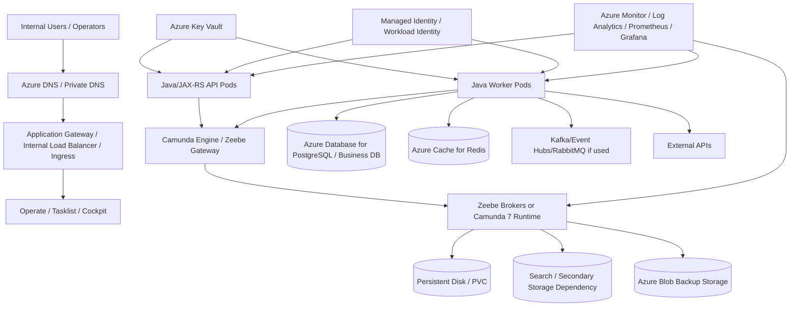

# Part 051 — Camunda on Azure

> Fokus part ini: memahami deployment Camunda di Azure sebagai production architecture, terutama ketika Camunda, Java/JAX-RS workers, PostgreSQL, Kafka/RabbitMQ/Redis, Kubernetes, identity, private networking, backup, monitoring, dan hybrid deployment bertemu dalam sistem workflow mission-critical.

Azure bukan sekadar tempat menjalankan container. Untuk workflow system, Azure menjadi **operational envelope**: cluster, network, identity, secret, database, search dependency, storage, monitoring, DNS, certificate, dan disaster recovery.

Camunda di Azure perlu dibaca dari pertanyaan yang lebih penting daripada “bagaimana install chart?”:

```text
Jika workflow sedang memproses quote/order penting, apa yang terjadi ketika AKS node restart, PostgreSQL failover, search dependency tertinggal, worker kehilangan credential, private DNS salah, atau koneksi hybrid putus?
```

Dalam konteks CSG Quote & Order, jangan mengarang detail internal. Gunakan materi ini sebagai mental model dan checklist. Semua topology, namespace, secret store, retry policy, deployment model, monitoring, dan runbook harus diverifikasi di internal CSG/team.

---

## 1. Azure Deployment Mental Model

Camunda on Azure biasanya hadir dalam beberapa bentuk:

| Shape | Runtime | Common Azure building blocks | Main operational risk |
|---|---|---|---|
| Camunda 7 embedded in Java/JAX-RS service | Engine hidup di aplikasi Java | AKS/VM/App Service, Azure Database for PostgreSQL, Application Gateway/Load Balancer | DB contention, job executor scaling, rolling deployment, classpath/delegate coupling |
| Camunda 7 shared engine | Engine sebagai service terpisah | AKS/VM, PostgreSQL, ingress, internal DNS, Cockpit/Tasklist | shared ownership, schema upgrade, engine availability, DB pool pressure |
| Camunda 8 self-managed | Zeebe/Camunda stack remote | AKS, persistent disks, managed/self-managed search dependency, Blob backup, Key Vault, Azure Monitor | partition health, broker storage, gateway connectivity, search freshness, backup consistency |
| Java job workers | Worker terpisah dari engine | AKS pods, Azure Database for PostgreSQL, Event Hubs/Kafka-compatible endpoint if used, RabbitMQ if used, Azure Cache for Redis, Key Vault | duplicate side effects, retry storm, credential expiry, network/policy failures |
| Hybrid/on-prem split | Engine/worker/data separated by network boundary | ExpressRoute/VPN, Private Link, firewall, DNS resolver, internal CA | latency, split-brain operations, unclear ownership, firewall drift |

The core model:

```text
Workflow correctness = runtime state + business state + integration state + operational state + recovery state.
```

Azure contributes to all five:

- Runtime state: Camunda 7 DB or Zeebe broker state.
- Business state: PostgreSQL/domain database.
- Integration state: Event Hubs/Kafka, RabbitMQ, external APIs, Redis cache, inbox/outbox tables.
- Operational state: AKS deployments, Helm values, GitOps drift, dashboards, alerts.
- Recovery state: backups, snapshots, restore procedures, incident notes, audit evidence.

If one of these is undocumented, workflow production recovery becomes guesswork.

---

## 2. Reference Azure Topology

A production-oriented Azure deployment may look conceptually like this:



This diagram is not a prescription. It is a checklist of relationships.

A real design must answer:

- Is the Camunda runtime accessible only privately?
- Are workers inside the same AKS cluster or external?
- Are PostgreSQL, Redis, messaging, and search accessed through private endpoints?
- Are secrets injected via Key Vault integration or Kubernetes Secret sync?
- Are backup and restore tested, not merely configured?
- Are dashboards observing workflow business health, not only pod health?

---

## 3. Camunda 7 on Azure

### 3.1 Runtime shape

Camunda 7 is a Java-based process engine. In Azure it may run as:

- embedded engine inside a Java/JAX-RS application;
- shared engine application deployed on AKS or VM;
- application server style deployment;
- separate external task workers consuming topics;
- Cockpit/Tasklist/REST API exposed behind internal ingress.

The biggest production question is not “where is the WAR/JAR running?” but:

```text
Who owns the Camunda 7 database, job executor scaling, schema upgrade, and operational recovery?
```

### 3.2 Azure Database for PostgreSQL as runtime DB

If Camunda 7 uses PostgreSQL on Azure, the database is part of the engine runtime, not a passive reporting store.

It contains:

- process definitions;
- runtime executions;
- jobs;
- incidents;
- variables;
- task state;
- history records depending on history level;
- byte array payloads and serialized data;
- deployment metadata.

Operational concerns:

- connection pool saturation;
- lock contention on runtime/job tables;
- slow history cleanup;
- query latency during high job volume;
- schema migration during engine upgrade;
- backup/restore coordination with business database;
- maintenance window impact;
- read replica misuse for runtime operations;
- long-running transactions caused by delegate code.

For Camunda 7, managed PostgreSQL does not remove engine-level correctness concerns. It reduces infrastructure burden, but job executor behavior, history growth, retry storms, and variable bloat remain application/runtime concerns.

### 3.3 Camunda 7 on AKS

If Camunda 7 runs in AKS:

- multiple pod replicas may run job executors;
- rolling deployment can affect delegate class availability;
- old process instances may still reference old delegate behavior;
- startup deployment may deploy new process definitions automatically;
- readiness probes must not mark the app ready before engine and DB are usable;
- shutdown must allow in-flight jobs or external task operations to finish safely.

Common failure mode:

```text
New pod starts, deploys new BPMN, old pods still execute old code, workers/delegates are incompatible with process variables or activity IDs.
```

Mitigation:

- explicit process versioning;
- worker backward compatibility;
- controlled deployment pipeline;
- smoke test after deployment;
- disable auto-deploy where inappropriate;
- monitor incident spike after rollout.

---

## 4. Camunda 8 on Azure

### 4.1 Runtime shape

Camunda 8 self-managed on Azure normally means running the Camunda stack on AKS using Helm, with Zeebe/Camunda runtime components plus management/visibility components and secondary storage/search dependency.

The key difference from Camunda 7:

```text
Camunda 8 is a remote distributed orchestration platform. Your Java/JAX-RS services and job workers are clients of the orchestration cluster.
```

Implication:

- workers must tolerate network interruption;
- job activation may be delayed by backpressure;
- job timeout can make work available to another worker;
- Operate/Tasklist visibility may depend on exported/indexed data freshness;
- backup/restore must be coordinated across runtime and storage dependencies;
- scaling is not simply “increase application replicas.”

### 4.2 AKS as the runtime substrate

AKS gives:

- managed Kubernetes control plane;
- node pools;
- autoscaling;
- Azure CNI/networking options;
- integration with Azure Monitor;
- managed identity/workload identity patterns;
- ingress/load balancer integration;
- disk/PVC integration;
- private cluster options.

But AKS does not automatically guarantee:

- correct Zeebe partition sizing;
- safe backup/restore;
- zero-downtime worker compatibility;
- secure variable handling;
- correct retry/idempotency;
- no private DNS misconfiguration;
- predictable latency across hybrid boundary;
- business-level workflow observability.

### 4.3 Zeebe broker and persistent storage

Zeebe broker state depends on persistent storage. In AKS this often means PVC backed by Azure managed disks or another supported storage class.

Review concerns:

- storage class supports required access mode;
- disk latency is acceptable;
- node/pod rescheduling does not violate recovery expectations;
- zone placement is understood;
- volume expansion is controlled;
- backup strategy is not only disk snapshot;
- broker restart time is observed;
- resource limits do not cause disk or memory pressure.

Do not assume a generic Kubernetes storage class is production-safe for workflow runtime state.

### 4.4 Secondary storage and search dependency

Camunda 8 visibility components depend on exported data. Depending on version/topology, this may involve Elasticsearch/OpenSearch or another supported secondary storage model. In Azure, that dependency may be:

- self-managed inside AKS;
- managed through a marketplace/managed service;
- operated by platform team;
- external to the AKS cluster;
- replaced by supported architecture in newer Camunda versions.

The exact component must be verified.

Failure mode:

```text
Zeebe continues processing, but Operate/Tasklist visibility lags because secondary storage/exporting/indexing is unhealthy.
```

Impact:

- operators may think process is stuck;
- task visibility may be delayed;
- incident dashboards become stale;
- debugging relies on incomplete visibility;
- compliance/audit extraction may lag.

Operational response:

- distinguish runtime health from visibility health;
- monitor exporter lag/indexing lag;
- monitor search cluster health;
- keep runbook for reindex/recovery if supported;
- avoid manual edits to secondary storage unless directed by vendor/support/runbook.

---

## 5. Azure Networking Model for Camunda

### 5.1 VNet, subnet, and network boundary

A production Azure deployment should have explicit network boundaries:

- AKS subnet;
- database subnet/private endpoint subnet;
- ingress subnet if using Application Gateway;
- outbound egress control;
- private DNS zones;
- firewall/NSG rules;
- route tables if hub-spoke is used;
- peering/ExpressRoute/VPN if hybrid.

Workflow systems are sensitive to network design because they coordinate long-running business state. A brief network partition can cause:

- worker activation failure;
- message correlation delay;
- API callback failure;
- tasklist visibility failure;
- duplicate retry after timeout;
- incident creation;
- SLA breach escalation.

### 5.2 Private endpoints and Private Link

Use private access for dependencies when required by security posture:

- Azure Database for PostgreSQL;
- Key Vault;
- Storage Account/Blob;
- Redis;
- monitoring/export endpoints where applicable;
- container registry if used;
- external APIs through private connectivity if available.

Review questions:

- Are public endpoints disabled where required?
- Does AKS resolve private DNS correctly?
- Are private endpoints in correct subnet/VNet?
- Are NSG rules too broad?
- Are outbound dependencies documented?
- Does local/dev/stage/prod use the same DNS assumptions?

### 5.3 DNS as a workflow dependency

DNS failure can look like worker failure, Camunda outage, database outage, or connector outage.

Common examples:

- private DNS zone not linked to AKS VNet;
- custom DNS forwarder fails;
- on-prem resolver cannot resolve Azure private zones;
- stale DNS after private endpoint recreation;
- split-horizon DNS returns public endpoint from worker pod;
- CoreDNS overload in AKS.

Debugging path:

```bash
nslookup <dependency-host>
dig <dependency-host>
kubectl exec -n <namespace> <pod> -- nslookup <dependency-host>
kubectl logs -n kube-system deploy/coredns
```

Do not debug workflow incident only from Camunda UI. Validate name resolution from the worker/runtime pod itself.

---

## 6. Identity, Secret, and Credential Model

### 6.1 Managed identity and workload identity

Azure managed identity or workload identity can reduce static secret exposure, but it must be deliberately designed.

Use cases:

- worker reads secrets from Key Vault;
- pod authenticates to Azure services;
- pipeline deploys Helm chart;
- backup job writes to Blob Storage;
- monitoring agent pushes telemetry;
- application accesses managed database if identity-based auth is used.

Risk:

```text
Pod identity too broad = every worker can read every secret or modify unrelated cloud resources.
```

Review:

- one identity per workload class where possible;
- least privilege Key Vault access;
- scoped storage permissions;
- no shared high-privilege identity across all namespaces;
- credential rotation policy;
- audit trail for identity usage;
- emergency revocation process.

### 6.2 Key Vault and Kubernetes secrets

Common patterns:

| Pattern | Description | Risk |
|---|---|---|
| Kubernetes Secret only | Secret stored in cluster | easy but may violate security posture |
| Key Vault CSI driver | secret mounted into pods | mount lifecycle and rotation must be understood |
| External Secrets operator | syncs Key Vault to Kubernetes Secret | secret duplicated into cluster |
| App fetches Key Vault at runtime | app/worker resolves secret dynamically | startup latency, availability dependency, auth complexity |

Workflow-specific concerns:

- connector secrets must not be stored as plain process variables;
- worker credentials must not appear in logs/incidents;
- secret rotation must not break long-running workers mid-task;
- secret versioning must be coordinated with rollout;
- failed auth should produce clear incident/alert.

### 6.3 Service accounts and Camunda credentials

For Camunda 8 workers, verify:

- how workers authenticate to gateway/API;
- how credentials are stored;
- whether credentials are per environment;
- whether worker identity maps to process/task permissions;
- whether revocation disables only the intended worker;
- whether CI/CD can deploy secrets safely.

For Camunda 7 external task workers, verify:

- REST endpoint auth;
- worker ID convention;
- TLS/mTLS if required;
- network allowlist;
- secret rotation.

---

## 7. Azure Database for PostgreSQL and Camunda

### 7.1 Database roles

There may be multiple PostgreSQL roles in a workflow architecture:

- Camunda 7 runtime DB;
- business/domain DB;
- worker idempotency/inbox/outbox DB;
- audit/reporting DB;
- read model DB.

Do not conflate them.

Bad pattern:

```text
Process variables become the source of truth because the workflow engine is easier to query than the business database.
```

Better pattern:

- process variables carry orchestration context;
- business database owns quote/order state;
- worker writes idempotently to business DB;
- process completes job only after durable side effects are recorded;
- outbox/inbox coordinates messages.

### 7.2 Azure PostgreSQL failure modes

Common failure modes:

- connection exhaustion;
- server failover causing transient connection errors;
- maintenance window restart;
- storage pressure;
- slow queries from worker/table growth;
- lock contention from state transitions;
- migration lock blocking worker writes;
- DNS/private endpoint issue;
- SSL certificate configuration issue;
- backup restore to wrong point-in-time;
- parameter changes requiring restart.

Workflow impact:

- worker fails job repeatedly;
- retry storm increases DB load;
- process incidents spike;
- duplicate event publishing if outbox logic is unsafe;
- process state and business state diverge.

### 7.3 DB debugging path

When workflow failure involves PostgreSQL:

1. Identify process instance/job/task.
2. Identify business entity ID and correlation ID.
3. Check worker logs for SQL exception category.
4. Check DB connection pool metrics.
5. Check DB CPU, IOPS, lock waits, active sessions.
6. Check migration/deployment events.
7. Check retry count and incident creation time.
8. Check whether side effect committed before job failure.
9. Check idempotency table/outbox/inbox state.
10. Retry only after duplicate side effect risk is understood.

---

## 8. Messaging on Azure: Kafka, Event Hubs, RabbitMQ, and Workflow

### 8.1 Kafka vs Event Hubs compatibility awareness

Some Azure architectures use Event Hubs with Kafka-compatible endpoints. That does not automatically mean every Kafka operational assumption is identical.

Verify:

- topic/event hub mapping;
- consumer group behavior;
- partition count;
- retention policy;
- replay behavior;
- auth mechanism;
- schema registry/governance;
- ordering guarantees;
- monitoring and lag metrics;
- connector compatibility;
- retry and dead-letter strategy.

Workflow impact:

- duplicate event can start duplicate process;
- replay can correlate stale messages;
- out-of-order event can move process incorrectly;
- expired message correlation can create stuck processes;
- partitioning mismatch can break per-order ordering.

### 8.2 RabbitMQ on Azure

Azure does not make RabbitMQ semantics disappear. If RabbitMQ is used, it may be:

- self-managed on AKS;
- self-managed on VM;
- provided by marketplace/managed offering;
- replaced by Azure Service Bus for some use cases.

Do not assume Azure Service Bus is a drop-in RabbitMQ replacement. Messaging semantics, routing, DLQ, sessions, lock/ack model, and operational model differ.

Workflow review:

- what message starts/correlates process;
- what retry layer owns retry;
- how DLQ is drained;
- how replies are correlated;
- how duplicate commands are deduplicated;
- how poison messages are tied to process incidents.

### 8.3 Redis on Azure

Azure Cache for Redis may support:

- idempotency helper;
- rate limiter;
- short-lived cache;
- distributed coordination;
- UI/task status cache;
- feature flag/kill switch support.

But Redis should not be the only durable source of workflow correctness.

Review:

- TTL correctness;
- eviction policy;
- failover behavior;
- key naming;
- secret/auth/TLS;
- private endpoint;
- cache invalidation;
- fallback behavior when Redis is unavailable.

---

## 9. Application Gateway, Ingress, and API Exposure

### 9.1 Exposure model

Camunda-related endpoints may include:

- Operate/Tasklist/Cockpit UI;
- Camunda REST API if exposed;
- Zeebe Gateway endpoint;
- custom Java/JAX-RS workflow API;
- worker health endpoints;
- webhook/callback endpoints;
- connector inbound endpoints.

Each endpoint needs a deliberate exposure decision:

| Endpoint | Typical exposure | Key concern |
|---|---|---|
| Operator UI | internal only | access control, audit, PII visibility |
| Zeebe gateway | private service | worker auth, network policy, mTLS/TLS |
| Custom workflow API | internal/external depending on product | idempotency, authorization, rate limiting |
| Callback endpoint | external/internal | authentication, replay protection, correlation |
| Worker health endpoint | cluster/internal | no sensitive state leakage |

### 9.2 Application Gateway / ingress concerns

Review:

- TLS termination point;
- certificate source and rotation;
- WAF if public;
- path routing;
- backend health probe;
- request timeout;
- max body size;
- WebSocket/SSE if used;
- source IP preservation;
- access logs;
- internal vs public load balancer;
- DNS records.

Workflow-specific failure mode:

```text
Callback endpoint times out or blocks large payload, external system retries, duplicate correlation occurs, process moves twice or incident is created.
```

Mitigation:

- idempotency key;
- correlation key;
- accepted/async API pattern;
- request size limit by contract;
- duplicate detection;
- alert on correlation failure.

---

## 10. Azure Monitor, Logs, Metrics, and Traces

### 10.1 What to monitor

Pod health is insufficient. Monitor workflow health.

Camunda/runtime metrics:

- process instance creation rate;
- active/completed/failed process count;
- incident count;
- job activation/completion/failure rate;
- job latency;
- worker timeout/failure rate;
- backpressure;
- partition health if Camunda 8;
- job executor health if Camunda 7;
- exporter/indexing lag;
- Tasklist/Operate/Cockpit availability.

Application metrics:

- API request latency;
- 202 Accepted count;
- callback success/failure;
- message correlation success/failure;
- DB transaction latency;
- outbox lag;
- worker throughput;
- worker failure categories;
- duplicate detection count;
- retry exhaustion count.

Azure platform metrics:

- AKS node CPU/memory/disk;
- pod restarts;
- throttling/OOMKilled;
- Azure PostgreSQL connections/CPU/IOPS/locks;
- Redis memory/evictions/failover;
- messaging lag/dead letters;
- Key Vault throttling/failures;
- Application Gateway 4xx/5xx/backend health;
- private endpoint/network errors;
- DNS/CoreDNS errors.

### 10.2 Log Analytics query mindset

Good workflow debugging depends on common fields:

- `correlationId`;
- `causationId`;
- `processInstanceKey` or process instance ID;
- `businessKey`;
- `quoteId`/`orderId` where safe;
- `jobKey` or external task ID;
- `workerName`;
- `taskDefinitionId`;
- `messageName`;
- `correlationKey`;
- `tenantId`;
- `deploymentVersion`;
- `podName`;
- `namespace`.

Without these, Azure Monitor becomes a log bucket, not an observability system.

### 10.3 Alert design

Alert on symptoms that matter:

- incident rate above baseline;
- retry exhaustion;
- user task aging above SLA;
- timer backlog;
- worker failure rate spike;
- no jobs completed for critical job type;
- message correlation failure spike;
- DB connection pool saturation;
- Zeebe partition unhealthy;
- exporter/search lag;
- private endpoint/DNS failure;
- Key Vault auth failure;
- backup failure;
- deployment drift.

Avoid alerts that only say “pod restarted” without workflow impact context.

---

## 11. Backup, Restore, and Disaster Recovery on Azure

### 11.1 Backup scope

A workflow system may require coordinated backups for:

- Zeebe broker state;
- secondary storage/search;
- Camunda 7 runtime DB;
- business PostgreSQL DB;
- audit database;
- Blob storage backup repository;
- BPMN/DMN artifact repository;
- Helm values/GitOps repo;
- secrets metadata/configuration;
- runbooks and incident records.

A disk snapshot alone is not enough for a distributed workflow platform if it does not produce a consistent restore point across runtime and dependencies.

### 11.2 Azure Blob backup storage

If Blob Storage is used for backup:

- enforce private access where required;
- use encryption and access policy;
- scope managed identity permissions;
- configure lifecycle policy carefully;
- test restore from backup, not only backup creation;
- protect against accidental deletion;
- document retention and compliance requirements.

### 11.3 DR questions

Ask:

- What is RPO for workflow runtime state?
- What is RTO for workflow orchestration availability?
- Can quote/order business state be restored consistently with workflow state?
- What happens to in-flight jobs after restore?
- How are external systems reconciled after restore?
- Can messages be replayed safely?
- Are workers idempotent after disaster recovery?
- Does restoring search visibility create stale or missing operational views?
- Who authorizes manual repair?

---

## 12. High Availability on Azure

High availability is not a single checkbox.

### 12.1 HA dimensions

| Dimension | Question |
|---|---|
| AKS nodes | Are critical pods spread across nodes/zones? |
| Runtime state | Can broker/engine recover after node loss? |
| Database | Is PostgreSQL configured for HA and backups? |
| Search dependency | Is visibility/search dependency resilient? |
| Worker replicas | Can workers scale without duplicate side effects? |
| Ingress | Is Application Gateway/Load Balancer resilient? |
| Secrets | Can workloads start if Key Vault temporarily throttles? |
| Network | Are private DNS and routing redundant? |
| Monitoring | Does alerting survive partial outage? |
| Deployment | Can rollout be paused/rolled forward safely? |

### 12.2 Zone and region awareness

Verify:

- AKS node pools zone distribution;
- persistent disk zone binding;
- PostgreSQL zone redundancy if used;
- search dependency zone model;
- Application Gateway zone configuration;
- Redis HA/failover;
- cross-region DR requirements;
- backup region/replication policy.

For workflow systems, multi-zone improves infrastructure resilience but does not solve application-level duplicate processing, retry storms, compensation, or external consistency.

---

## 13. Azure-Specific Failure Modes

### 13.1 AKS node upgrade drains worker pods

Symptom:

- worker pods terminate;
- jobs in progress timeout;
- another worker picks job;
- duplicate side effect risk.

Mitigation:

- graceful shutdown;
- termination grace period;
- idempotency table;
- job timeout aligned with operation duration;
- PodDisruptionBudget;
- rollout and node upgrade windows.

### 13.2 Key Vault throttling or permission drift

Symptom:

- pods fail startup;
- connector/worker cannot authenticate;
- sudden job failures across many job types.

Debug:

- check managed identity assignment;
- check Key Vault access policy/RBAC;
- check secret version;
- check Key Vault diagnostic logs;
- check pod mount/sync status.

### 13.3 Private DNS misconfiguration

Symptom:

- works from laptop but fails inside pod;
- worker cannot reach PostgreSQL/Redis/Key Vault;
- intermittent resolution after endpoint change.

Debug:

- run DNS lookup from pod;
- verify private DNS zone link;
- check CoreDNS;
- check hub-spoke resolver;
- compare prod/stage DNS.

### 13.4 Azure PostgreSQL failover

Symptom:

- transient SQL exceptions;
- job failures spike;
- retry storm increases DB load;
- workflow incidents appear.

Mitigation:

- connection pool validation;
- transient error retry at correct layer;
- idempotent DB writes;
- circuit breaker/rate limiting;
- alert correlation with DB failover event.

### 13.5 Search/secondary storage lag

Symptom:

- Operate/Tasklist stale;
- operators cannot see latest process state;
- runtime still progressing;
- incident investigation confused.

Mitigation:

- monitor exporter/index lag;
- separate runtime health from visibility health;
- document fallback debugging path;
- avoid manual mutation of secondary storage.

### 13.6 Application Gateway timeout

Symptom:

- start process or callback endpoint returns timeout;
- client retries;
- duplicate start/correlation risk.

Mitigation:

- `202 Accepted` for long-running operations;
- idempotency key;
- correlation key;
- strict request payload limit;
- backend timeout aligned to API contract.

### 13.7 Blob backup fails silently

Symptom:

- backup job appears configured but no restorable backup exists;
- restore test fails;
- backup identity lost permission.

Mitigation:

- alert on backup success/failure;
- verify backup object presence;
- test restore periodically;
- protect backup storage with lifecycle and deletion policy.

---

## 14. Java/JAX-RS Worker Design on Azure

Azure deployment does not change core worker rules.

A worker must still be:

- idempotent;
- retry-safe;
- observable;
- graceful during shutdown;
- bounded in concurrency;
- explicit about DB transaction boundary;
- clear about external side effects;
- careful with process variables;
- secure in secret handling;
- compatible with process versioning.

### 14.1 Worker startup checklist

On startup, worker should validate:

- required environment variables exist;
- Key Vault/secret resolution works;
- Camunda gateway/engine reachable;
- DB reachable if needed;
- message broker reachable if needed;
- Redis reachable if required, or fallback configured;
- build/version metadata logged;
- worker name and job types logged;
- concurrency config visible.

### 14.2 Worker shutdown checklist

On shutdown:

- stop accepting new work;
- complete/fail in-flight jobs safely;
- avoid marking job complete before durable side effect;
- flush outbox if pattern requires;
- close DB/message connections;
- expose shutdown reason in logs;
- finish within termination grace period;
- rely on idempotency for any unknown outcome.

### 14.3 Azure autoscaling risk

Horizontal scaling increases job throughput only if downstream systems can handle it.

Review:

- worker max jobs active;
- DB connection pool per replica;
- PostgreSQL max connections;
- Kafka/RabbitMQ consumer/producer limits;
- Redis connection limits;
- external API rate limits;
- Camunda backpressure;
- retry amplification under outage.

---

## 15. Security and Privacy in Azure Workflow Deployment

Workflow systems often carry sensitive business process data.

Review exposure points:

- process variables;
- task form data;
- incident/error message;
- logs;
- traces;
- metric labels;
- connector config;
- Key Vault secrets;
- Kubernetes Secret copies;
- PostgreSQL tables;
- search indices;
- backup storage;
- support dumps;
- screenshots from operator tools.

Azure controls to verify:

- private endpoints;
- NSG rules;
- managed identity permissions;
- Key Vault access logs;
- encryption at rest;
- TLS in transit;
- Azure Policy;
- activity logs;
- diagnostic settings;
- log retention;
- data deletion policy;
- backup access control.

Security anti-pattern:

```text
The API is private, but Operate/Tasklist exposes full process variables to too many internal roles.
```

Security review must include UI/operator access, not only external API exposure.

---

## 16. Production Debugging Flow on Azure

When a workflow incident happens on Azure:

```text
Start from business impact, then runtime state, then worker state, then dependency state, then cloud platform state.
```

### 16.1 First questions

- Which quote/order/customer/tenant is affected?
- Which process definition/version?
- Which process instance/key/business key?
- Which activity/job/task is stuck or failing?
- Is this isolated or systemic?
- Did it start after deployment, cloud event, DB failover, AKS upgrade, or network change?
- Are retries still happening?
- Is manual repair safe?

### 16.2 Azure signals to inspect

- AKS pod status/restarts/events;
- worker logs;
- Camunda runtime logs;
- Operate/Cockpit incident view;
- Azure PostgreSQL metrics;
- Redis metrics;
- messaging metrics;
- Key Vault diagnostic logs;
- Application Gateway backend health;
- Azure Monitor alerts;
- private DNS resolution from pod;
- GitOps deployment history;
- Azure Activity Log.

### 16.3 Do not immediately retry

Before retry:

- check whether DB write committed;
- check whether external API side effect happened;
- check outbox/inbox state;
- check duplicate detection table;
- check downstream event was published;
- check compensation path;
- confirm ownership and approval for manual action.

Retry is an operation against business state, not merely a technical button.

---

## 17. Azure Architecture Review Checklist

Use this checklist when reviewing architecture/PR/deployment changes.

### 17.1 Runtime and deployment

- Which Camunda version is used?
- SaaS or self-managed?
- If self-managed, which AKS cluster/namespace?
- Helm chart version?
- Camunda app version?
- Process deployment pipeline?
- Worker deployment pipeline?
- GitOps repository?
- Drift detection?
- Rollback/forward recovery plan?

### 17.2 Network

- VNet/subnet documented?
- Private endpoints documented?
- Public endpoints disabled where required?
- NSG rules minimal?
- Private DNS zones linked correctly?
- Hub-spoke resolver documented?
- ExpressRoute/VPN dependency documented?
- Ingress exposure clear?
- TLS certificate ownership clear?

### 17.3 Identity and secrets

- Managed identity/workload identity used?
- Key Vault permissions least privilege?
- Secret rotation tested?
- Connector secrets protected?
- Worker credentials scoped?
- Admin credentials isolated?
- Audit log enabled?

### 17.4 Data and dependencies

- PostgreSQL HA/backup/monitoring configured?
- Search/secondary storage dependency documented?
- Blob backup tested?
- Redis role clearly non-source-of-truth?
- Kafka/RabbitMQ/Event Hubs semantics documented?
- Outbox/inbox/idempotency tables present where needed?

### 17.5 Observability

- Runtime dashboard exists?
- Worker dashboard exists?
- Business SLA dashboard exists?
- Alerts for incident/retry/task aging/message failure?
- Azure platform alerts mapped to workflow impact?
- Correlation ID propagated?
- Logs redact sensitive data?

### 17.6 Operations

- Runbook exists?
- Backup restore tested?
- AKS upgrade procedure known?
- PostgreSQL failover response known?
- Search recovery procedure known?
- Incident owner known?
- Manual repair approval path known?
- Customer impact checklist exists?

---

## 18. Internal Verification Checklist

Untuk konteks CSG, verifikasi hal berikut sebelum menganggap materi ini cocok dengan sistem nyata:

### Camunda and runtime

- Apakah CSG memakai Camunda 7, Camunda 8, SaaS, self-managed, atau workflow engine lain?
- Jika Azure digunakan, apakah runtime berjalan di AKS, VM, App Service, atau hybrid?
- Apakah ada Zeebe Gateway/Broker, Operate, Tasklist, Identity, Connectors?
- Apakah Camunda 7 memakai embedded engine atau shared engine?
- Apakah Cockpit/Tasklist/Operate digunakan oleh support/operator?

### AKS and Kubernetes

- Cluster AKS mana yang menjalankan runtime/worker?
- Namespace apa?
- Helm chart dan values berada di repository mana?
- Apakah ada GitOps controller?
- Bagaimana upgrade AKS dan node pool dilakukan?
- Apakah ada PDB/topology spread/anti-affinity?
- Apakah resource request/limit sesuai capacity plan?

### Azure networking

- VNet/subnet/network diagram terbaru ada di mana?
- Apakah cluster private?
- Apakah dependencies memakai private endpoint?
- Bagaimana DNS resolver dikonfigurasi?
- Apakah ada ExpressRoute/VPN ke on-prem/customer site?
- Apakah ingress internal atau public?
- Bagaimana TLS certificate dikelola?

### Identity and secret

- Apakah workload identity/managed identity digunakan?
- Apakah secret dari Azure Key Vault atau Kubernetes Secret langsung?
- Bagaimana secret rotation dilakukan?
- Siapa yang punya akses ke Key Vault?
- Apakah connector secret pernah masuk process variable/log?

### Data and integration

- Apakah Camunda 7 memakai Azure Database for PostgreSQL?
- Apakah business DB juga Azure PostgreSQL?
- Apakah Camunda 8 memakai Elasticsearch/OpenSearch/secondary storage apa?
- Apakah backup memakai Azure Blob?
- Apakah Kafka, RabbitMQ, Redis berjalan di Azure atau on-prem/cloud lain?
- Apakah ada Event Hubs Kafka-compatible endpoint?
- Apakah outbox/inbox/idempotency table dipakai?

### Observability and runbook

- Dashboard apa yang dipakai untuk process instance, incident, worker, SLA?
- Alert apa yang mengarah ke workflow support?
- Apakah Azure Monitor/Log Analytics menyimpan correlation ID?
- Apakah ada runbook untuk worker down, DB failover, message correlation failure, search lag, backup restore?
- Siapa incident owner lintas backend/platform/SRE/product?

---

## 19. PR Review Checklist

Saat mereview perubahan yang menyentuh Camunda on Azure:

- Apakah perubahan memengaruhi runtime, worker, process model, secret, network, atau storage?
- Apakah process versioning aman?
- Apakah worker backward compatible?
- Apakah idempotency tetap terjaga setelah autoscaling/retry?
- Apakah endpoint baru private/public dengan alasan jelas?
- Apakah Key Vault permission minimal?
- Apakah Azure Monitor alert diperbarui?
- Apakah deployment values berubah?
- Apakah private DNS/endpoint berubah?
- Apakah DB connection pool dan worker concurrency sesuai?
- Apakah backup/restore impact dipahami?
- Apakah rollback sebenarnya mungkin, atau perlu forward fix?
- Apakah runbook diperbarui?

---

## 20. Common Anti-Patterns

### Anti-pattern 1 — Treating AKS as the architecture

Kubernetes is not the architecture. It is the runtime substrate. The architecture is the relationship between process state, business state, workers, integrations, security, and operations.

### Anti-pattern 2 — Public operator UI without strict access control

Operate/Tasklist/Cockpit may expose business process variables and task data. Internal-only does not mean safe.

### Anti-pattern 3 — Secret copied everywhere

Key Vault is useful, but if secrets are copied to logs, variables, incident messages, Kubernetes manifests, or connector configs without control, the system is still unsafe.

### Anti-pattern 4 — Redis as durable workflow state

Redis may support cache/lock/rate limit/idempotency helper, but process correctness should not depend only on volatile cache state.

### Anti-pattern 5 — Search health confused with runtime health

Operate/Tasklist visibility lag does not always mean Zeebe runtime is stopped. Separate runtime, exporter, and visibility diagnosis.

### Anti-pattern 6 — No restore test

A configured backup that has never been restored is an assumption, not a recovery capability.

### Anti-pattern 7 — Worker autoscaling without downstream capacity

Scaling worker replicas can overload PostgreSQL, messaging, Redis, external API, or Camunda gateway, especially during retry storms.

---

## 21. Senior Engineer Takeaways

Camunda on Azure should be reviewed as a workflow platform running inside a cloud operating model.

The core senior-engineer questions are:

- What is the source of truth for each state?
- What happens when Azure infrastructure partially fails?
- How do workers behave under retry, timeout, shutdown, and duplicate activation?
- Are secrets, variables, incidents, and logs safe?
- Can operators see business-impacting stuck processes?
- Can we restore runtime and business state consistently?
- Is the deployment model compatible with long-running process instances?
- Are cloud responsibilities clear across backend, platform, SRE, security, product, and customer operations?

If these are unclear, the Azure deployment may run successfully during demos but fail during production incidents.

---

## References

- Camunda 8 Docs — Microsoft AKS: https://docs.camunda.io/docs/self-managed/deployment/helm/cloud-providers/azure/microsoft-aks/
- Camunda 8 Docs — Deploy and manage Camunda Self-Managed: https://docs.camunda.io/docs/self-managed/deployment/
- Camunda 8 Docs — Kubernetes with Helm production installation: https://docs.camunda.io/docs/self-managed/deployment/helm/install/production/
- Camunda 8 Docs — Backup and restore: https://docs.camunda.io/docs/self-managed/operational-guides/backup-restore/backup-and-restore/
- Camunda 8 Docs — Restore backup: https://docs.camunda.io/docs/self-managed/operational-guides/backup-restore/elasticsearch/es-restore/
- Camunda 8 Docs — Secondary storage: https://docs.camunda.io/docs/self-managed/concepts/secondary-storage/managing-secondary-storage/
