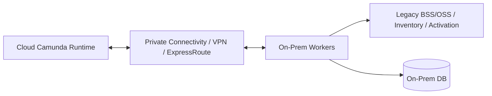
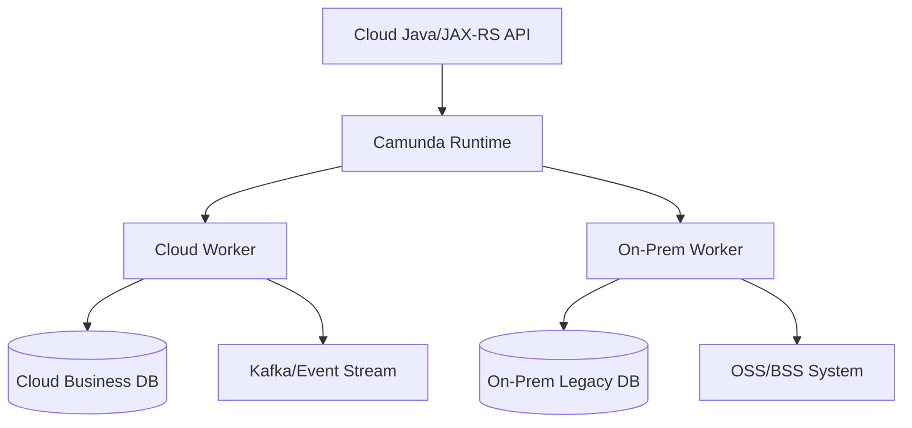

# Part 052 — Camunda On-Prem and Hybrid Deployment

> Fokus part ini: memahami Camunda ketika deployment tidak hidup di cloud sederhana, tetapi berada di on-prem, private data center, customer-managed environment, air-gapped network, hybrid cloud, atau topology yang membelah engine, worker, database, messaging, dan operator tools melintasi network boundary.

On-prem dan hybrid deployment adalah ujian kedewasaan workflow engineering. Masalahnya bukan hanya “bisa install Camunda tanpa cloud.” Masalah sebenarnya adalah:

```text
Bisakah long-running business process tetap observable, recoverable, secure, and supportable ketika network, ownership, patching, certificate, backup, monitoring, dan operational access tidak sepenuhnya berada di satu boundary?
```

Dalam konteks enterprise CPQ/order management, on-prem/hybrid sering muncul karena:

- customer requirement;
- data residency;
- regulated environment;
- telco BSS/OSS integration;
- legacy system proximity;
- private connectivity requirement;
- SaaS not allowed;
- disconnected or semi-connected operations;
- cloud/on-prem split between order capture, fulfillment, billing, inventory, and activation systems.

Jangan mengarang detail internal CSG. Gunakan part ini untuk membangun review checklist dan debugging mindset. Semua topology, firewall, certificate, deployment, monitoring, and runbook harus diverifikasi di internal team/platform/SRE/customer environment.

---

## 1. On-Prem and Hybrid Mental Model

In cloud-only deployment, many platform dependencies are standardized. In on-prem/hybrid, every dependency may have a local variant:

| Concern | Cloud-managed shape | On-prem/hybrid shape | Risk |
|---|---|---|---|
| Kubernetes | AKS/EKS | self-managed Kubernetes, OpenShift, Rancher, vendor platform | cluster behavior and support boundary vary |
| Database | managed PostgreSQL/RDS/Azure DB | self-managed PostgreSQL/Oracle/SQL Server depending architecture | patching, backup, HA, tuning, ownership |
| Search/secondary storage | managed/self-managed search | self-managed Elasticsearch/OpenSearch or supported storage | capacity, backup, corruption, reindex, ownership |
| Secrets | Key Vault/Secrets Manager | Vault, CyberArk, K8s Secret, custom secret store | rotation and access audit inconsistency |
| Identity | cloud IAM/OIDC | corporate AD/LDAP/OIDC/SAML/internal IAM | group mapping, token expiry, tenant isolation |
| Monitoring | CloudWatch/Azure Monitor | Prometheus/Grafana/ELK/Splunk/Datadog/custom | missing business-level workflow alerts |
| Connectivity | private endpoint/VPC/VNet | firewall, DMZ, proxy, NAT, VPN, MPLS, ExpressRoute/Direct Connect | latency, DNS, certificate, allowlist drift |
| Backup | object storage snapshots | NFS, SAN, backup appliance, object store, tape/offline | restore validation and consistency |
| Patching | managed upgrade path | local patch window and customer change process | security drift and version lag |

The main principle:

```text
On-prem/hybrid workflow architecture is not a deployment mode; it is an operational contract.
```

If the operational contract is vague, production recovery will be vague.

---

## 2. Deployment Shapes

### 2.1 Fully on-prem Camunda

All components run inside the private data center/customer environment:

- Camunda runtime;
- workers;
- database;
- messaging;
- Redis/cache;
- operator UI;
- monitoring;
- backup;
- identity integration;
- CI/CD or manual release mechanism.

Advantages:

- local data control;
- lower latency to legacy systems;
- easier compliance with strict residency;
- fewer external connectivity dependencies.

Risks:

- self-managed everything;
- patching delay;
- hardware/storage responsibility;
- local monitoring gaps;
- manual deployment drift;
- air-gapped image/artifact management;
- support access difficulty.

### 2.2 Cloud runtime, on-prem workers

Camunda runtime runs in cloud, workers run on-prem near legacy systems.



Advantages:

- centralized workflow visibility;
- cloud-managed operations for runtime;
- workers remain close to legacy systems.

Risks:

- worker activation depends on network;
- network partition creates job timeout/duplicate risk;
- latency affects throughput;
- inbound/outbound firewall rules become critical;
- credential/certificate lifecycle crosses boundaries;
- cloud operators may not see on-prem dependency health.

### 2.3 On-prem runtime, cloud workers/services

Camunda runtime runs on-prem, while some workers or APIs run in cloud.

Advantages:

- runtime/data stays on-prem;
- cloud services can perform scalable tasks;
- external integrations may be easier from cloud.

Risks:

- on-prem runtime exposure to cloud;
- strict firewall/proxy setup;
- cloud worker cannot reach runtime during network issue;
- debugging spans two observability stacks;
- security review is more complex.

### 2.4 Split business state

Workflow runtime, business database, and external systems are split across environments.

Example:



This is the hardest form. It requires explicit consistency and reconciliation design.

---

## 3. Network Boundary as a First-Class Design Object

### 3.1 Network boundary determines failure modes

On-prem/hybrid workflows fail through network boundaries:

- firewall rule missing;
- NAT timeout;
- proxy rejects request;
- TLS chain not trusted;
- internal CA certificate expired;
- DNS resolver returns wrong address;
- route table misconfigured;
- MTU issue;
- VPN tunnel degraded;
- ExpressRoute/Direct Connect circuit issue;
- packet inspection appliance breaks long-lived connections;
- outbound allowlist not updated after deployment;
- callback endpoint blocked;
- idle connection reset.

Workflow impact:

- worker cannot activate/complete jobs;
- message correlation fails;
- process start callback fails;
- timer fires but escalation action cannot reach notification system;
- external API call times out and retries;
- job timeout causes duplicate work;
- incident storm hides the root network issue.

### 3.2 Connectivity inventory

Document every dependency:

| Source | Destination | Protocol | Port | Auth | DNS | Owner | Criticality |
|---|---|---|---|---|---|---|---|
| Worker pod | Zeebe Gateway / Camunda REST | gRPC/HTTP | verify | token/mTLS/basic | verify | backend/platform | critical |
| Worker pod | PostgreSQL | TCP | verify | DB credential/TLS | verify | DBA/platform | critical |
| Worker pod | Kafka/RabbitMQ | TCP/TLS | verify | SASL/TLS/userpass | verify | platform | critical |
| Runtime | Search dependency | HTTP/TCP | verify | internal auth | verify | platform | critical |
| Runtime | Backup storage | HTTP/NFS/S3-compatible | verify | key/cert | verify | infra | critical |
| Operator UI | Identity provider | HTTPS/LDAP/etc | verify | SSO | verify | IAM team | high |
| External system | Callback API | HTTPS | verify | token/mTLS | verify | product/platform | high |

If this table does not exist, troubleshooting will be slow.

### 3.3 Firewall and allowlist drift

Firewall rules often become stale because workflow evolves:

- new worker job type calls new endpoint;
- new connector added;
- new callback URL created;
- new namespace/cluster introduced;
- IP range changes after node pool expansion;
- ingress controller changes;
- certificate CN/SAN changes;
- DNS name changes.

PR review must ask:

```text
Does this BPMN/worker/integration change require a network/firewall change?
```

---

## 4. TLS, mTLS, and Internal CA

### 4.1 TLS is operational, not decorative

TLS failures in workflow systems are production incidents because they stop orchestration.

Common TLS failure modes:

- expired certificate;
- wrong certificate chain;
- internal CA not trusted by Java truststore;
- hostname mismatch;
- certificate rotation not rolled to all workers;
- mTLS client certificate expired;
- proxy terminates TLS unexpectedly;
- service mesh policy blocks traffic;
- old JVM lacks required cipher/protocol.

### 4.2 Java/JAX-RS worker truststore risk

Java workers need correct truststore configuration.

Check:

- JVM truststore location;
- internal CA bundle injection;
- container image includes CA certificates;
- Kubernetes secret/configmap mount;
- certificate rotation process;
- JAX-RS HTTP client trust config;
- Kafka/RabbitMQ/Redis TLS config;
- PostgreSQL TLS config;
- gRPC TLS config for Zeebe if used.

Failure pattern:

```text
Camunda job fails with generic HTTP/client exception, but root cause is truststore/certificate chain mismatch.
```

### 4.3 mTLS decision

mTLS may be required across environments.

Use it deliberately:

- define client certificate ownership;
- define rotation process;
- define revocation process;
- automate secret distribution;
- alert before expiry;
- avoid embedding certs in image;
- document support procedure.

mTLS without operational rotation discipline becomes scheduled downtime.

---

## 5. Identity and Access in On-Prem/Hybrid

### 5.1 Identity sources

Possible sources:

- Active Directory;
- LDAP;
- SAML/OIDC provider;
- corporate IAM;
- customer IAM;
- local Camunda identity;
- service accounts;
- Kubernetes service account;
- Vault/CyberArk identities;
- static credentials in legacy systems.

Workflow identity concerns:

- who can start a process;
- who can view process instance;
- who can see variables;
- who can claim/complete user task;
- who can retry failed job;
- who can modify variables;
- who can perform migration;
- who can access audit/history;
- who owns worker credentials;
- how tenant/customer isolation is enforced.

### 5.2 Role mapping risk

Hybrid systems often have group mapping gaps:

```text
Corporate group exists in IAM, but Camunda/Tasklist role mapping is stale or different in on-prem environment.
```

Impact:

- users cannot see tasks;
- wrong group can see sensitive tasks;
- support cannot repair incidents;
- audit evidence is incomplete;
- emergency access is ad hoc.

Review:

- identity provider integration;
- group synchronization;
- role/permission mapping;
- tenant mapping;
- service account scoping;
- break-glass access;
- audit logs.

---

## 6. Database Dependency On-Prem

### 6.1 Camunda 7 database

If Camunda 7 is on-prem, the database may be self-managed.

Review:

- DB engine/version supported by Camunda version;
- schema ownership;
- migration procedure;
- backup/PITR;
- HA/failover;
- connection pool;
- lock contention;
- slow query monitoring;
- history cleanup;
- storage growth;
- database patch window;
- audit/retention requirements.

Camunda 7 runtime database is not optional infrastructure. It is the coordination layer.

### 6.2 Business database

Worker writes to business DB must be designed for partial failure.

Pattern:

```text
Perform durable business side effect in DB.
Record idempotency/processed job marker.
Commit DB transaction.
Then complete/fail workflow job.
```

If job completion fails after DB commit, retry must not duplicate business action.

### 6.3 Cross-boundary database access

Avoid unreviewed cross-boundary DB access:

- cloud worker directly writes on-prem DB through VPN;
- on-prem worker writes cloud DB through firewall;
- worker queries remote DB synchronously for every job;
- process engine and business DB share same server without capacity isolation.

Risks:

- high latency;
- connection drops;
- lock wait amplification;
- hard-to-debug transaction timeout;
- security exceptions;
- blast radius across systems.

---

## 7. Search and Secondary Storage Dependency

For Camunda 8, visibility and operational querying depend on exported/indexed data or supported secondary storage.

In on-prem/hybrid, this dependency may be:

- self-managed Elasticsearch/OpenSearch;
- platform-provided search cluster;
- local storage service;
- cloud-managed search reachable privately;
- version-specific supported secondary storage.

Questions:

- who owns the cluster?
- how is it backed up?
- how is index retention configured?
- what happens when it is unavailable?
- how do we monitor exporter lag?
- how do we distinguish runtime progress from visibility lag?
- can operators still triage without UI visibility?
- is sensitive variable data indexed?

Failure pattern:

```text
Process runtime continues, but Tasklist/Operate appears stale because secondary storage/export path is unhealthy.
```

Runbook must separate runtime recovery from visibility recovery.

---

## 8. Worker Connectivity and Placement

### 8.1 Worker placement options

| Placement | Benefit | Risk |
|---|---|---|
| Same cluster as runtime | lower latency, simpler network | shared blast radius |
| Separate cluster same site | isolation | networking/auth complexity |
| On-prem worker, cloud runtime | close to legacy systems | WAN dependency for job activation/completion |
| Cloud worker, on-prem runtime | scalable worker infra | runtime exposure and firewall complexity |
| Worker near external system | reduced API latency | split observability and deployment ownership |

### 8.2 Worker failure under network partition

If worker activates a job, performs side effect, then loses connectivity before completing the job:

```text
Side effect may have happened.
Workflow job may become available again after timeout.
Another worker may repeat it.
```

This is why idempotency is non-negotiable.

Required safeguards:

- idempotency key;
- processed job table;
- unique constraint;
- external API idempotency key;
- outbox/inbox;
- safe retry semantics;
- job timeout aligned to realistic operation duration;
- worker shutdown handling;
- unknown outcome reconciliation.

### 8.3 Long-lived connections

Hybrid networks may terminate idle connections. Workers and clients must handle:

- gRPC reconnect;
- HTTP connection pool reset;
- database connection validation;
- Kafka/RabbitMQ reconnect;
- Redis reconnect;
- exponential backoff;
- circuit breaker;
- alert on sustained disconnect.

---

## 9. Air-Gapped Deployment

### 9.1 What air-gapped means operationally

Air-gapped means the environment cannot freely pull images, charts, dependencies, or updates from the internet.

This affects:

- Camunda Helm chart;
- Docker images;
- third-party chart dependencies;
- Java worker images;
- Maven artifacts;
- OS packages;
- vulnerability scanning database;
- license validation if applicable;
- modeler/tooling distribution;
- patch delivery;
- documentation access;
- support bundle export.

Camunda documentation notes that Helm chart installation in air-gapped environments requires extra steps because charts depend on third-party images and charts.

### 9.2 Image and artifact management

You need:

- internal container registry;
- mirrored Camunda images;
- mirrored third-party images;
- pinned image tags/digests;
- internal Helm repository;
- signed artifacts if required;
- SBOM and vulnerability scan process;
- upgrade bundle process;
- rollback image availability;
- provenance verification.

Anti-pattern:

```text
Production air-gapped environment cannot pull previous image version during rollback because only the latest image was imported.
```

### 9.3 Patch management

Air-gapped environments often lag.

Review:

- security patch cadence;
- emergency patch path;
- CVE triage owner;
- Camunda version lifecycle;
- Java/JVM base image patching;
- OS package patching;
- database patching;
- search cluster patching;
- Kubernetes patching;
- certificate rotation;
- offline documentation/runbook availability.

---

## 10. Backup Storage and Restore

### 10.1 Backup is a business process dependency

For workflow systems, backup is not just infrastructure hygiene. Backup determines whether order/quote processes can be recovered consistently.

Backup scope:

- Camunda 7 runtime DB if used;
- Zeebe broker backup if Camunda 8;
- secondary storage/search backup;
- business DB backup;
- messaging state if needed;
- Redis only if durable role is claimed, though avoid this;
- BPMN/DMN/forms/connectors repository;
- worker image artifacts;
- Helm/GitOps manifests;
- secrets/config metadata;
- audit logs;
- incident notes.

### 10.2 Backup consistency problem

A dangerous state:

```text
Workflow runtime restored to 10:00, business DB restored to 09:55, Kafka replay starts at 10:05.
```

This creates impossible business/process combinations.

DR plan must define:

- restore order;
- backup ID/cutover point;
- external system reconciliation;
- message replay window;
- idempotency behavior after restore;
- manual repair authority;
- evidence collection.

### 10.3 Restore test

Ask for proof:

- When was last restore test?
- Was it full cluster restore or only DB restore?
- Were workflow instances inspected after restore?
- Were user tasks visible?
- Were incidents preserved?
- Did workers resume safely?
- Were external systems reconciled?
- Was the test documented?

A backup without restore test is not a recovery capability.

---

## 11. Monitoring Stack On-Prem/Hybrid

### 11.1 Monitoring fragmentation

Hybrid environments often have multiple monitoring stacks:

- cloud monitoring;
- on-prem Prometheus/Grafana;
- ELK/OpenSearch;
- Splunk;
- Datadog/New Relic;
- custom NOC dashboard;
- customer monitoring;
- application logs in separate stores.

Risk:

```text
Camunda runtime metrics are in one system, worker logs in another, database metrics in a third, and business SLA dashboard does not exist.
```

### 11.2 Required workflow observability

Minimum operational signals:

- process instance start/completion/failure rate;
- incident count by process/job type;
- failed jobs/retry exhaustion;
- worker active/completed/failed job count;
- worker latency;
- user task aging;
- SLA breach;
- message correlation failure;
- timer backlog;
- DB connection pool;
- runtime DB/search storage health;
- broker/partition health if Camunda 8;
- job executor health if Camunda 7;
- queue lag/dead letters;
- outbox lag;
- hybrid network latency/loss;
- certificate expiry;
- backup success/failure.

### 11.3 Cross-stack correlation

Every log/metric should carry:

- correlation ID;
- causation ID;
- business key;
- process instance ID/key;
- job key/external task ID;
- worker name;
- job type/topic;
- tenant/customer context if safe;
- deployment version;
- environment/site.

Without correlation, hybrid debugging becomes manual archaeology.

---

## 12. Cloud-to-On-Prem Workflow Interaction

### 12.1 Pattern: cloud process calls on-prem system

Example:

- cloud API starts order workflow;
- cloud Camunda creates job;
- cloud worker calls on-prem fulfillment/activation service through private link/VPN;
- response determines next BPMN path.

Risks:

- on-prem system slow;
- firewall intermittent;
- API call times out;
- job retries duplicate command;
- on-prem system performs action but response lost;
- cloud process creates incident while on-prem state changed.

Mitigation:

- command ID/idempotency key;
- explicit pending/accepted state;
- callback or polling reconciliation;
- outbox on on-prem side;
- timeout policy;
- manual fallout queue;
- integration-specific dashboard.

### 12.2 Pattern: cloud process waits for on-prem event

Example:

- process sends activation command;
- waits for message correlation from on-prem system.

Risks:

- message never arrives;
- duplicate message arrives;
- late message arrives after timeout/compensation;
- wrong correlation key;
- on-prem event format changes;
- bridge drops event.

Mitigation:

- correlation key contract;
- TTL/expiration policy;
- duplicate handling;
- late message policy;
- schema governance;
- reconciliation query;
- timer-based escalation.

---

## 13. On-Prem-to-Cloud Workflow Interaction

### 13.1 Pattern: on-prem service starts cloud process

Risks:

- cloud API unavailable;
- on-prem retries duplicate start;
- network/proxy changes payload;
- identity token unavailable;
- response timeout after process start;
- customer firewall blocks new endpoint.

Mitigation:

- idempotent start API;
- client-generated business key/idempotency key;
- `202 Accepted` pattern;
- process status endpoint;
- retry with backoff;
- audit log of start attempts;
- on-prem outbox.

### 13.2 Pattern: on-prem worker connects to cloud Zeebe/Camunda

Risks:

- long-lived connection instability;
- TLS/mTLS certificate mismatch;
- job activation latency;
- job completion timeout;
- worker version drift;
- local clock drift affects logs/timers/debugging;
- operator cannot see worker host metrics.

Mitigation:

- stable private connectivity;
- reconnect/backoff;
- certificate rotation automation;
- worker heartbeat/metrics;
- version inventory;
- graceful shutdown;
- idempotent side effects.

---

## 14. Operational Responsibility Boundary

Hybrid systems fail politically before technically when ownership is unclear.

Define who owns:

| Area | Possible owner |
|---|---|
| BPMN/DMN model | backend/product/BA/solution architect |
| Worker implementation | backend team |
| Camunda runtime | platform/SRE/application team/customer |
| Database | DBA/platform/customer |
| Search/secondary storage | platform/SRE/customer |
| Messaging | platform/integration team |
| Redis/cache | platform/backend |
| Kubernetes cluster | platform/SRE/customer |
| Network/firewall | network team/customer |
| Certificates | security/platform/customer |
| Identity/groups | IAM/security/customer |
| Monitoring/alerting | SRE/NOC/platform/backend |
| Incident coordination | support/SRE/product/backend |
| Manual repair approval | business owner/support lead |

For every production workflow, define:

- technical owner;
- business owner;
- operational owner;
- escalation path;
- data owner;
- security owner;
- support hours/SLA;
- customer communication owner.

---

## 15. Release and Deployment in On-Prem/Hybrid

### 15.1 Deployment constraints

On-prem/hybrid deployments may include:

- limited maintenance windows;
- manual approval gates;
- customer change advisory board;
- artifact import process;
- no internet access;
- local registry;
- local Helm chart repository;
- custom certificate injection;
- environment-specific firewall tickets;
- delayed observability setup;
- rollback restrictions.

### 15.2 BPMN deployment risk

Process definition deployment is not harmless.

Review:

- new process version impact;
- running instance behavior;
- worker compatibility;
- variable compatibility;
- message correlation compatibility;
- user task form compatibility;
- migration need;
- rollout sequence across sites;
- rollback or forward fix plan;
- customer/site-specific customization.

### 15.3 Worker deployment risk

Worker deployment can cause:

- duplicate job execution during rolling restart;
- in-flight job timeout;
- incompatible variable handling;
- missing certificate/secret;
- firewall rule missing for new dependency;
- DB migration not applied;
- changed external API contract;
- different version across sites.

Checklist:

- drain/shutdown configured;
- idempotency tested;
- backward compatibility tested;
- secrets present;
- network allowlist updated;
- migration applied;
- smoke test completed;
- monitoring updated.

---

## 16. Performance and Capacity in Hybrid Systems

### 16.1 Latency matters differently

Workflow systems can tolerate long business duration, but not unmanaged infrastructure latency.

Hybrid latency affects:

- job activation;
- job completion;
- external API calls;
- DB transactions;
- message correlation;
- task UI responsiveness;
- operator debugging;
- retry timing;
- SLA timer accuracy perception.

### 16.2 Capacity dimensions

Measure:

- process instances per day/hour;
- jobs per instance;
- average job duration;
- worker concurrency;
- DB transactions per job;
- external API latency;
- message volume;
- retry amplification;
- incident backlog;
- task aging;
- network latency/loss;
- bandwidth for backups/export;
- search index growth;
- history retention growth.

### 16.3 Backpressure planning

Backpressure should protect downstream systems.

Tools:

- worker max concurrency;
- max active jobs;
- rate limiter;
- circuit breaker;
- queue buffer;
- retry backoff;
- bulkhead by job type;
- kill switch;
- manual pause/resume procedure;
- autoscaling with downstream constraints.

Anti-pattern:

```text
Network outage ends, thousands of retries resume at once, overwhelming on-prem legacy system.
```

Mitigation:

- exponential backoff with jitter;
- rate limits per downstream;
- retry storm alert;
- manual throttle.

---

## 17. Security and Privacy On-Prem/Hybrid

### 17.1 Data exposure points

Sensitive data may exist in:

- process variables;
- Camunda history tables;
- Operate/Tasklist/Cockpit;
- worker logs;
- incident messages;
- task forms;
- search indices;
- backup storage;
- support bundles;
- monitoring labels;
- Kafka/RabbitMQ messages;
- Redis keys/values;
- database audit tables.

Hybrid makes this harder because data may cross boundaries.

Review:

- what data may cross cloud/on-prem;
- encryption in transit;
- encryption at rest;
- masking/redaction;
- tenant/customer isolation;
- retention policy;
- deletion policy;
- audit access;
- support access;
- backup access;
- incident screenshot policy.

### 17.2 Support access risk

In on-prem/customer environments, support access may require:

- bastion host;
- VPN;
- audited session;
- temporary credential;
- customer approval;
- read-only access;
- break-glass procedure.

Never design production support around undocumented direct database access.

---

## 18. Production Debugging Flow On-Prem/Hybrid

Use this sequence:

```text
Business symptom → process state → worker state → integration state → platform state → network/certificate/identity state → recovery action.
```

### 18.1 Business symptom

- Which quote/order/customer is affected?
- Is this a single process or systemic?
- Is there SLA/customer impact?
- Is manual intervention needed?

### 18.2 Process state

- process definition/version;
- process instance ID/key;
- current activity;
- waiting event/task/job;
- incident;
- retry count;
- variables/correlation key;
- migration/deployment history.

### 18.3 Worker state

- worker process running?
- correct version?
- connected to runtime?
- receiving jobs?
- failing jobs?
- concurrency/backpressure?
- graceful shutdown events?
- certificate/auth errors?

### 18.4 Integration state

- DB committed?
- external API side effect happened?
- message published/consumed?
- outbox/inbox state?
- Redis cache/lock state?
- duplicate detection?

### 18.5 Platform/network state

- pod/VM health;
- Kubernetes events;
- DB health;
- search health;
- firewall change;
- DNS resolution;
- certificate validity;
- VPN/ExpressRoute status;
- proxy logs;
- identity provider health.

### 18.6 Recovery action

Before retry/manual repair:

- confirm side effect status;
- classify duplicate risk;
- identify owner;
- record evidence;
- use documented repair path;
- validate post-repair process and business state.

---

## 19. On-Prem Runbook Checklist

A serious runbook should include:

### 19.1 Access

- how to access Camunda UI;
- how to access logs;
- how to access metrics;
- how to access Kubernetes/VM;
- how to access database read-only;
- how to access backup console;
- how to request firewall/network support;
- how to request customer approval.

### 19.2 Health checks

- runtime health;
- worker health;
- DB health;
- search health;
- messaging health;
- Redis health;
- identity health;
- certificate expiry;
- network connectivity;
- backup status.

### 19.3 Common incidents

- worker down;
- job not activated;
- job completion fails;
- process not starting;
- message not correlated;
- timer not firing;
- task not visible;
- DB connection exhaustion;
- search lag;
- certificate expired;
- firewall blocked;
- backup failed;
- deployment failed;
- process migration failed.

### 19.4 Repair procedures

- retry failed job;
- resolve incident;
- correct variable safely;
- re-correlate message;
- resume paused worker;
- replay event safely;
- trigger compensation;
- move to manual fallout;
- reconcile business state;
- document customer impact.

---

## 20. Internal Verification Checklist

Untuk konteks CSG, verifikasi hal berikut:

### Deployment shape

- Apakah ada deployment Camunda on-prem/hybrid?
- Apakah engine/runtime berada di cloud, on-prem, atau customer environment?
- Apakah worker berada di lokasi berbeda dari runtime?
- Apakah database/messaging/Redis/search berada di lokasi berbeda?
- Apakah ada air-gapped deployment?
- Apakah ada customer-specific deployment topology?

### Network and security

- Network diagram terbaru ada di mana?
- Firewall rules dikelola siapa?
- Apakah ada VPN/ExpressRoute/Direct Connect/MPLS?
- Apakah DNS resolution lintas boundary terdokumentasi?
- Apakah TLS/internal CA/mTLS digunakan?
- Bagaimana certificate rotation dilakukan?
- Apakah support access diaudit?

### Runtime and data

- Camunda 7 atau Camunda 8?
- DB runtime apa?
- Search/secondary storage apa?
- Backup storage apa?
- Apakah backup/restore diuji?
- Apakah process variables mengandung sensitive data?
- Bagaimana history retention dikelola?

### Worker and integration

- Worker job type/topic apa saja?
- Worker berada di environment mana?
- Bagaimana worker authenticate ke runtime?
- Bagaimana idempotency diterapkan?
- Apakah outbox/inbox table digunakan?
- Apakah external API calls melewati firewall/proxy?
- Apakah retry/backoff berbeda per downstream?

### Observability and operations

- Monitoring stack apa yang digunakan?
- Apakah runtime, worker, DB, messaging, Redis, network ada dalam satu dashboard?
- Apakah business SLA dashboard ada?
- Apakah logs punya correlation ID/process instance ID/business key?
- Siapa owner incident workflow?
- Apakah runbook on-prem/hybrid ada dan diuji?

### Release and governance

- Bagaimana BPMN/DMN/worker artifact dipromosikan ke on-prem?
- Apakah ada GitOps atau manual deployment?
- Bagaimana drift dideteksi?
- Apakah rollback image/chart tersedia di registry internal?
- Apakah patching policy jelas?
- Apakah customer approval diperlukan?

---

## 21. PR Review Checklist

Saat mereview perubahan workflow dalam on-prem/hybrid environment:

- Apakah perubahan membutuhkan firewall rule baru?
- Apakah dependency endpoint baru butuh DNS/certificate?
- Apakah worker akan berjalan di environment yang sama dengan dependency?
- Apakah job timeout realistis untuk hybrid latency?
- Apakah retry/backoff melindungi downstream on-prem system?
- Apakah side effect idempotent?
- Apakah correlation key stabil lintas system?
- Apakah process variable membawa data yang boleh melewati boundary?
- Apakah log/trace aman untuk customer environment?
- Apakah monitoring/alert diperbarui?
- Apakah deployment artifact tersedia offline jika air-gapped?
- Apakah rollback/forward recovery feasible?
- Apakah runbook diperbarui?
- Apakah ownership lintas team jelas?

---

## 22. Common Anti-Patterns

### Anti-pattern 1 — Treating on-prem as “just another cluster”

On-prem has different ownership, networking, patching, backup, certificate, and access constraints. Treating it like cloud Kubernetes leads to operational surprises.

### Anti-pattern 2 — No connectivity inventory

If no one can list source/destination/protocol/port/auth/owner, incident triage will depend on guessing.

### Anti-pattern 3 — Manual firewall process not tied to PR/deployment

Workflow PR adds a new external call, but firewall request happens after deployment fails.

### Anti-pattern 4 — No certificate expiry alert

Certificate expiration becomes workflow outage.

### Anti-pattern 5 — Runtime visible, worker blind

Operators can see incidents in Camunda UI but cannot see worker logs/metrics because worker runs in customer/on-prem environment.

### Anti-pattern 6 — Backup without restore drill

Backup job exists, but no one knows if Camunda runtime, search, business DB, and external state can be restored consistently.

### Anti-pattern 7 — Duplicate state after network partition

Worker performs side effect, loses connection before completion, job retries, and business action happens twice.

### Anti-pattern 8 — Support runbook requires tribal knowledge

If only one senior engineer knows how to repair stuck process in on-prem environment, the system is not production-ready.

---

## 23. Senior Engineer Takeaways

On-prem/hybrid Camunda deployment is about more than installation. It is about **operational survivability**.

A senior engineer should be able to ask:

- Where is workflow runtime state?
- Where is business state?
- Where is visibility/search state?
- Where are workers located?
- What happens during network partition?
- What happens after side effect succeeds but job completion fails?
- How are certificates and secrets rotated?
- Who owns firewall/DNS/identity/database/search/backup?
- Are process variables safe across boundary?
- Can we debug without direct production shell access?
- Can we restore consistently?
- Can we support customer incidents under time pressure?

If those answers are unclear, the deployment may be technically installed but operationally fragile.

---

## References

- Camunda 8 Docs — Deploy and manage Camunda Self-Managed: https://docs.camunda.io/docs/self-managed/deployment/
- Camunda 8 Docs — Kubernetes with Helm production installation: https://docs.camunda.io/docs/self-managed/deployment/helm/install/production/
- Camunda 8 Docs — Air-gapped Helm installation: https://docs.camunda.io/docs/self-managed/deployment/helm/configure/registry-and-images/air-gapped-installation/
- Camunda 8 Docs — Backup and restore: https://docs.camunda.io/docs/self-managed/operational-guides/backup-restore/backup-and-restore/
- Camunda 8 Docs — Restore backup: https://docs.camunda.io/docs/self-managed/operational-guides/backup-restore/elasticsearch/es-restore/
- Camunda 8 Docs — Kubernetes reference architecture: https://docs.camunda.io/docs/self-managed/reference-architecture/kubernetes/
