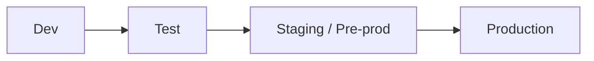
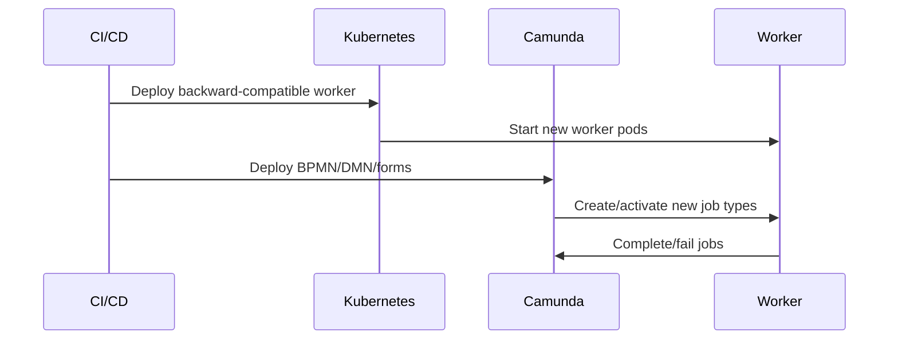
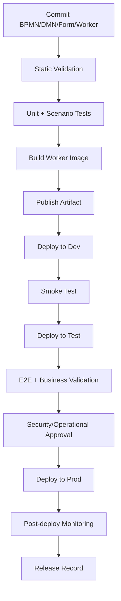

# Part 053 — CI/CD and GitOps for Workflow Artifacts

> Fokus part ini: memperlakukan BPMN, DMN, forms, connector configuration, worker code, deployment descriptors, and operational metadata sebagai production-controlled artifacts. Workflow bukan file diagram yang di-upload manual; workflow adalah executable business logic yang harus masuk review, testing, promotion, observability, rollback/forward recovery, and audit trail.

Workflow artifact lifecycle adalah salah satu area yang paling sering diremehkan. Banyak incident workflow bukan terjadi karena Camunda buruk, tetapi karena artifact lifecycle tidak diperlakukan setara dengan application code.

Contoh masalah umum:

- BPMN diubah manual di environment testing tetapi tidak ada commit.
- DMN berubah tanpa automated regression test.
- Worker code sudah deploy, tetapi BPMN masih mengarah ke job type lama.
- BPMN deploy ke production tanpa version tag.
- Running process instance masih berada di old version tetapi worker sudah tidak compatible.
- Connector secret berubah di runtime tanpa audit.
- Rollback dianggap bisa “undo deployment”, padahal running instance sudah tersebar di berbagai versi.
- GitOps hanya mengelola Kubernetes manifest, tetapi tidak mengelola BPMN/DMN deployment state.

Prinsip utama:

```text
Workflow artifacts are executable production contracts.
Treat them like code, version them like APIs, test them like state machines,
and operate them like long-running distributed systems.
```

Dalam konteks CSG Quote & Order, jangan mengarang pipeline internal. Gunakan part ini sebagai checklist untuk mengecek apakah BPMN, DMN, forms, workers, connectors, Kubernetes manifests, GitOps repository, deployment logs, version tags, and runbook benar-benar ada dan konsisten.

---

## 1. What Counts as Workflow Artifact?

Workflow artifact bukan hanya `.bpmn`.

Dalam production system, workflow artifact bisa mencakup:

| Artifact | Example | Why it matters |
|---|---|---|
| BPMN process model | quote approval, order fulfillment, fallout process | executable process flow |
| DMN decision table | approval routing, pricing exception, eligibility | executable decision logic |
| Form definition | user task form, manual correction form | human task input contract |
| Connector template/config | HTTP/Kafka/RabbitMQ connector | integration contract |
| Worker code | Java worker, external task worker, Zeebe job worker | automation implementation |
| Worker config | job type, topic, concurrency, timeout, credentials | runtime behavior |
| Process deployment script | deploy resources command/API | release mechanism |
| Environment config | endpoint, tenant, auth, secret names | environment binding |
| Kubernetes manifest | worker Deployment, ConfigMap, Secret, HPA | runtime hosting |
| GitOps app definition | Argo CD/Flux app, Helm values | reconciliation contract |
| Test fixtures | process scenario data, mock external API | regression confidence |
| Observability config | alerts, dashboards, logs, traces | production visibility |
| Runbook | retry, repair, rollback, migration instructions | incident response |

The core rule:

```text
If changing it can change workflow behavior, it belongs in the controlled release lifecycle.
```

Do not restrict review to BPMN diagrams only. A harmless-looking worker configuration change can be more dangerous than a BPMN change.

---

## 2. BPMN as Code

### 2.1 What “BPMN as code” means

BPMN as code does not mean manually writing XML all day. It means:

- BPMN files live in source control.
- BPMN changes go through pull request review.
- BPMN is validated before deployment.
- BPMN is tested as executable logic.
- BPMN version is tied to release/change ticket.
- BPMN deployment is reproducible.
- BPMN deployed state can be traced back to commit SHA.
- BPMN change has rollback/forward-recovery strategy.

Bad model:

```text
Designer exports BPMN -> someone uploads to environment -> no clear commit -> no test -> no rollback plan.
```

Better model:

```text
BPMN commit -> PR review -> static validation -> process tests -> package artifact -> deploy to dev/test/stage/prod -> tag release -> monitor.
```

### 2.2 BPMN source control rules

Store BPMN in repository paths that make ownership clear:

```text
/workflows
  /quote
    quote-approval.bpmn
    quote-approval.dmn
    quote-approval.form
  /order
    order-validation.bpmn
    order-fulfillment.bpmn
  /fallout
    manual-fallout-resolution.bpmn
```

Alternative if workflow belongs to service repository:

```text
/order-service
  /src/main/resources/processes
    order-validation.bpmn
    order-fulfillment.bpmn
  /src/test/resources/process-scenarios
    order-validation-happy-path.json
    order-validation-fallout-path.json
```

Pick one based on ownership. The important part is not the folder name. The important part is that the artifact has:

- clear owner;
- review history;
- test coverage;
- deployment path;
- environment mapping;
- operational metadata.

### 2.3 BPMN diff problem

BPMN is XML. XML diffs can be noisy because visual modeler changes layout metadata.

Common pain:

- moving a shape creates large XML diff;
- layout changes obscure semantic changes;
- ID changes make review hard;
- auto-formatting differs by Modeler version;
- reviewers miss condition expression changes.

Mitigation:

- standardize Camunda Modeler version if possible;
- avoid unnecessary diagram layout churn;
- review both visual diagram and XML diff;
- require a semantic change summary in PR;
- lint for missing IDs/names/documentation;
- include generated diagram preview in PR if tooling exists;
- keep process model small enough to review.

PR description should explicitly say:

```text
Semantic BPMN changes:
- added non-interrupting SLA timer on Manager Approval task
- changed approval routing condition from amount > 10000 to amount >= 10000
- added job type order.validate.eligibility.v2
- changed message correlation key from quoteId to orderId
- no change to worker timeout or retry count
```

If the PR description cannot explain the process change, the PR is not ready.

---

## 3. DMN as Code

DMN deserves the same discipline as BPMN. In some systems, DMN changes are more business-critical than BPMN changes because a single row can change approval routing, pricing exception, product eligibility, or customer treatment.

### 3.1 DMN lifecycle

A production-grade DMN lifecycle includes:


### 3.2 DMN review concerns

Reviewers should check:

- input names and types;
- output names and types;
- hit policy;
- overlapping rows;
- gaps between ranges;
- default rule behavior;
- business owner approval;
- version tag;
- test cases for boundary values;
- compatibility with calling BPMN/business rule task;
- auditability of decision result.

Example risk:

```text
approvalLevel = SENIOR_MANAGER when amount > 10000
```

Changing `>` to `>=` changes boundary behavior. That must be tested.

### 3.3 DMN should not become unreviewed business production patching

Be careful if business users can edit decision tables directly in a web tool. That may be legitimate, but then you still need:

- maker-checker approval;
- audit log;
- effective date;
- test suite or validation sandbox;
- rollback/retire mechanism;
- change ticket linkage;
- production monitoring after activation.

If DMN can change production behavior without engineering review, the organization must intentionally accept that governance model.

---

## 4. Forms as Code

User task forms are part of workflow correctness.

A form defines:

- what data human operators can see;
- what data they can submit;
- validation rules;
- default values;
- sensitive field exposure;
- implied business action;
- task completion payload;
- audit surface.

Treat forms as deployable artifacts.

### 4.1 Form review checklist

Review:

- field names and process variable mapping;
- required/optional fields;
- validation rules;
- hidden fields;
- read-only fields;
- sensitive/PII field exposure;
- role-specific visibility;
- stale task behavior;
- concurrent completion behavior;
- draft vs complete semantics;
- compatibility with old running user tasks.

A form change can break running user tasks if:

- it expects a new variable not present in old instances;
- it stops submitting a variable expected by downstream worker;
- it changes enum values;
- it exposes sensitive data that was previously hidden;
- it changes validation and blocks task completion.

### 4.2 Form deployment coupling

Avoid assuming form and process deployment are always atomic.

Possible shapes:

| Shape | Risk |
|---|---|
| BPMN references embedded form | BPMN deployment controls form version more tightly |
| BPMN references external form key | form/process version mismatch possible |
| custom frontend renders task form | backend task contract and UI deployment must stay compatible |
| Tasklist renders Camunda form | authorization/data exposure must be checked in Tasklist context |

Internal verification checklist must identify which shape CSG uses.

---

## 5. Connector Config as Code

Connectors can hide operationally important integration behavior.

Connector artifact may include:

- connector type;
- endpoint URL;
- method;
- headers;
- request body mapping;
- response mapping;
- retry behavior;
- authentication mode;
- secret reference;
- timeout;
- error mapping;
- message topic/queue/exchange;
- correlation data.

### 5.1 Why connector config must be reviewed

A connector change can:

- send data to wrong endpoint;
- expose sensitive variable;
- change timeout behavior;
- change retry pressure;
- break correlation;
- bypass custom worker idempotency;
- publish incompatible message schema;
- introduce secret leakage;
- change environment-specific routing.

Connector config should not be a hidden UI-only configuration unless the organization has governance for that.

### 5.2 Connector vs worker deployment

| Concern | Connector config | Custom worker |
|---|---|---|
| simple HTTP call | often good | possible overkill |
| complex idempotency | weak unless carefully designed | better |
| custom transaction boundary | limited | better |
| domain validation | weak | better |
| observability customization | limited/moderate | better |
| secret lifecycle | connector secret provider | app/platform secret mechanism |
| versioned logic | config/artifact driven | code release driven |

Rule of thumb:

```text
Use connector for simple integration edges.
Use worker for domain-sensitive, stateful, idempotency-heavy, or failure-sensitive automation.
```

---

## 6. Worker Deployment Lifecycle

Workflow deployment and worker deployment are coupled by contract, even if deployed separately.

Contracts include:

- Camunda 7 external task topic;
- Camunda 8 job type;
- input variables;
- output variables;
- retry behavior;
- timeout expectation;
- BPMN error codes;
- incident message convention;
- idempotency key;
- business key/correlation key;
- authorization/credential;
- side effects;
- compatibility with process versions.

### 6.1 Deployment order problem

Suppose BPMN deploys first and introduces a new job type:

```text
order.reserve-inventory.v2
```

If worker for `order.reserve-inventory.v2` is not deployed yet:

- jobs are created;
- no worker activates them;
- process instances wait;
- SLA may breach;
- operator sees stuck jobs but root cause is release ordering.

If worker deploys first and old BPMN still sends v1 variables:

- worker may fail due to missing variables;
- incident may be created;
- retry storms may happen;
- old running instances may break.

### 6.2 Compatibility-first rollout

Safer approach:

```text
1. Deploy worker that can handle old and new contract.
2. Deploy BPMN/DMN/form artifact that starts using new contract.
3. Monitor new process instances.
4. Drain old running instances.
5. Remove old worker behavior only after old process versions are no longer active.
```

This is similar to API version rollout. Workflow worker contract is an API.

### 6.3 Worker backward compatibility checklist

Check:

- can worker handle missing new variable?
- can worker tolerate extra variable?
- can worker produce both old and new output names during transition?
- are BPMN error codes stable?
- are job type/topic names versioned?
- are retries compatible?
- does idempotency key remain stable?
- does new worker still support old running process version?
- is old worker still deployed until drain completes?

---

## 7. Environment Promotion Model

A mature workflow promotion model looks like:



But the important question is not environment names. The important question is what evidence is required to promote.

### 7.1 Promotion gates

| Gate | Evidence |
|---|---|
| Static validation | BPMN/DMN parse, lint, naming, missing implementation |
| Unit/scenario tests | happy path, failure path, timer path, message path |
| Worker tests | input/output contract, idempotency, retry behavior |
| Integration tests | PostgreSQL/Kafka/RabbitMQ/Redis/external API |
| Security review | variables, forms, secrets, auth, tenant isolation |
| Observability review | logs, metrics, dashboards, alerts |
| Migration review | running instance impact, compatibility, rollback plan |
| Business validation | BA/Product/Solution Architect sign-off |
| Operational approval | SRE/platform runbook readiness |

### 7.2 Environment parity

Workflow behavior can differ between environments because:

- different Camunda version;
- different BPMN/DMN deployment state;
- different worker version;
- different feature flags;
- different secrets/endpoints;
- different timer clock/timezone assumptions;
- different Kafka/RabbitMQ topics/queues;
- different database schema version;
- different authorization groups;
- different tenant setup;
- different history/retention setting.

Promotion must validate environment compatibility, not only artifact syntax.

---

## 8. Model Validation and Linting

Static validation should catch obvious problems before runtime.

### 8.1 BPMN validation examples

Check for:

- missing service task implementation/job type/topic;
- missing user task assignment rule;
- missing timer expression;
- missing message name;
- missing correlation key expression;
- gateway without default flow where needed;
- unreadable gateway condition;
- event subprocess misuse;
- unhandled BPMN error if expected;
- service task with no retry policy;
- async boundary missing in Camunda 7 where transaction isolation needed;
- call activity binding to latest without intention;
- process without version tag;
- undocumented sensitive variables;
- unused variables;
- giant variable mappings;
- unnamed events/gateways/tasks;
- diagram too large for effective review.

### 8.2 DMN validation examples

Check for:

- invalid hit policy;
- duplicate/conflicting rules;
- missing default row;
- uncovered ranges;
- invalid FEEL expression;
- output type mismatch;
- missing boundary test cases;
- unapproved business owner change;
- decision key collision;
- version tag missing.

### 8.3 Naming convention lint

Example naming rules:

```text
Process ID: quote_approval_v1
Service task name: Reserve Inventory
Job type: order.reserve-inventory.v1
Message name: OrderValidated
BPMN error code: ORDER_VALIDATION_FAILED
Variable: orderId, quoteId, tenantId, correlationId
DMN decision ID: approval_routing_decision
```

The goal is not aesthetic consistency. The goal is operational searchability.

When production is down, consistent names reduce triage time.

---

## 9. Automated Testing in Pipeline

A workflow pipeline without tests is mostly packaging.

### 9.1 Test layers

```text
BPMN syntax validation
  ↓
BPMN scenario tests
  ↓
DMN decision tests
  ↓
Worker unit tests
  ↓
Worker integration tests
  ↓
End-to-end workflow tests
  ↓
Performance/smoke tests
```

### 9.2 Minimum test matrix

For each critical process:

| Scenario | Required? | Example |
|---|---:|---|
| happy path | yes | quote approved, order submitted |
| business rejection | yes | quote rejected, order invalid |
| worker technical failure | yes | API timeout, DB failure |
| retry success | yes | first failure, second success |
| retry exhaustion | yes | incident created |
| BPMN error path | yes | validation failed handled by boundary event |
| timer/SLA path | if used | manager approval overdue |
| message correlation | if used | fulfillment callback correlates orderId |
| duplicate event | if event-driven | same Kafka event replayed |
| human task completion | if used | claim/complete with authorized user |
| compensation | if used | reserve succeeded, charge failed, release reserve |
| migration compatibility | if changed | old instance survives new worker |

### 9.3 Pipeline should test old + new compatibility

When worker contract changes, test:

- old BPMN + new worker;
- new BPMN + new worker;
- old running instance + new variables;
- new process version + old external message if possible;
- old job type still handled until drain.

Do not only test latest BPMN happy path.

---

## 10. Version Tagging and Release Identity

Camunda process definition version is not the same as business release version.

You need traceability across:

- Git commit SHA;
- build number;
- application version;
- BPMN version tag;
- DMN version tag;
- form version;
- worker Docker image tag;
- Helm chart version;
- environment;
- deployment timestamp;
- change ticket;
- approver.

Example metadata file:

```yaml
workflowRelease:
  releaseId: quote-order-workflow-2026.07.11-001
  gitCommit: abc123def
  changeTicket: CHG-12345
  artifacts:
    - name: quote-approval.bpmn
      versionTag: 1.8.0
    - name: approval-routing.dmn
      versionTag: 1.4.2
    - name: manager-approval.form
      versionTag: 1.2.0
  workers:
    - image: registry.example.com/order-worker:2.9.0
      jobTypes:
        - order.validate.v2
        - order.reserve-inventory.v1
  approvedBy:
    - backend-tech-lead
    - solution-architect
    - sre-oncall
```

This does not need to be exactly this shape. But production must answer:

```text
Which commit introduced the process version currently running this customer order?
```

If that question cannot be answered, traceability is weak.

---

## 11. Rollback vs Forward Recovery

Workflow rollback is not the same as application rollback.

### 11.1 Why rollback is hard

After deploying a BPMN version:

- new instances may already have started on new version;
- some instances may be waiting at new activity;
- workers may have performed side effects;
- DMN may have produced decisions;
- external systems may have received messages;
- human users may have completed tasks;
- timers may have been scheduled;
- incidents may have been created.

You cannot assume “redeploy old BPMN” reverts business reality.

### 11.2 Safer recovery options

| Situation | Safer response |
|---|---|
| no new instances started | disable/start old version or redeploy old artifact |
| few new instances, no side effects | cancel/restart with approval |
| new instances with side effects | forward fix + reconciliation |
| wrong DMN decision | deploy corrected DMN + identify affected decisions |
| worker bug | roll forward worker fix; retry incidents after fix |
| wrong message correlation | stop intake, correct mapping, manually repair affected instances |
| bad form blocks task completion | deploy compatible form fix |

Most production workflow incidents require forward recovery, not rollback.

### 11.3 Rollback plan in PR

Every risky workflow PR should state:

```text
Rollback / recovery plan:
- Can this change be reverted by redeploying old artifact? yes/no
- Are running instances affected? yes/no
- Are external side effects already possible? yes/no
- How to detect affected instances?
- How to stop new starts?
- How to repair affected instances?
- Who approves manual repair?
```

---

## 12. GitOps Reconciliation for Workflow Systems

GitOps commonly reconciles Kubernetes resources. Workflow systems add another layer: deployed process definitions may live inside Camunda runtime, not only Kubernetes.

### 12.1 What GitOps can manage well

- worker Deployments;
- worker ConfigMaps;
- worker Secrets references;
- Camunda Helm values;
- namespaces;
- service accounts;
- network policies;
- observability configs;
- deployment jobs that deploy BPMN/DMN;
- connector runtime configuration;
- environment-specific endpoints.

### 12.2 What GitOps may not automatically reconcile

- already deployed process definitions inside engine;
- running process instances;
- process version cleanup;
- manually deployed BPMN/DMN through UI/API;
- Tasklist form state depending deployment mode;
- incidents and retries;
- manual variable patches;
- Cockpit/Operate operator actions.

### 12.3 Drift detection

Define drift explicitly:

```text
Expected Git state != runtime deployed workflow state
```

Drift examples:

- production has BPMN version not in Git;
- production has DMN with different version tag;
- worker image tag differs from GitOps desired state;
- connector endpoint changed manually;
- secret reference changed outside GitOps;
- process deployed to staging but not promoted through pipeline;
- old process definitions remain active unexpectedly.

Useful drift report fields:

| Field | Example |
|---|---|
| environment | prod-eu-1 |
| process ID | order_fulfillment |
| deployed version | 17 |
| version tag | 2.4.1 |
| expected version tag | 2.4.0 |
| deployment time | 2026-07-11T08:00Z |
| deployment source | pipeline/manual/unknown |
| commit SHA | abc123 or unknown |
| action | investigate/manual deployment suspected |

---

## 13. Deployment Strategies

### 13.1 Deploy process first vs worker first

Prefer worker-first if new BPMN creates new job type. Prefer process-first only if worker already handles the future contract.



### 13.2 Blue-green worker deployment

Useful when worker change is risky:

- deploy new worker version alongside old;
- route only new job type to new worker;
- keep old worker for old process versions;
- monitor failure rate and latency;
- drain old jobs;
- remove old worker when safe.

### 13.3 Feature flag with workflow

Feature flags can help, but they are dangerous if they change process behavior mid-instance.

Safe uses:

- choose process version at start;
- enable new worker behavior for new process only;
- gate new external integration;
- disable risky worker side effect quickly.

Risky uses:

- changing gateway outcome halfway through process;
- changing compensation behavior after side effect;
- changing message correlation key dynamically;
- changing task authorization after assignment;
- changing DMN outcome without audit.

### 13.4 Kill switch

A workflow kill switch should be explicit.

Possible kill switches:

- stop new process starts;
- stop consuming external events;
- pause specific worker job type;
- disable connector integration;
- fail fast with controlled BPMN error;
- route to manual fallout;
- reduce worker concurrency;
- disable retry storm source.

Kill switch must not silently lose work.

---

## 14. Deployment Approval Model

Workflow changes often require cross-functional approval.

Approvers may include:

- backend owner;
- workflow/platform owner;
- product owner;
- BA/business process owner;
- solution architect;
- SRE/platform;
- security/compliance;
- support/operations.

Approval should depend on change class.

| Change class | Required review |
|---|---|
| visual layout only | lightweight engineering review |
| gateway condition change | backend + BA/product |
| DMN rule change | BA/product + test evidence |
| new service task | backend + SRE + observability |
| new external integration | backend + security + platform |
| compensation change | architecture + operations |
| migration of running instances | architecture + SRE + business approval |
| sensitive form/variable change | security/privacy review |

A workflow PR is not just code correctness. It is business process correctness.

---

## 15. Deployment Pipeline Blueprint

A practical pipeline can look like this:



### 15.1 Build output should include a manifest

Example:

```yaml
artifactManifest:
  releaseId: camunda-workflow-2026-07-11.01
  commit: abc123def
  bpmn:
    - file: workflows/order/order-fulfillment.bpmn
      processId: order_fulfillment
      versionTag: 2.7.0
  dmn:
    - file: workflows/order/approval-routing.dmn
      decisionId: approval_routing
      versionTag: 1.9.0
  forms:
    - file: workflows/order/manual-fallout.form
      formId: manual_fallout
      versionTag: 1.3.0
  workers:
    - service: order-worker
      image: registry.example.com/order-worker:3.2.1
      jobTypes:
        - order.validate.v2
        - order.reserve.v1
  migration:
    required: false
  rollout:
    strategy: worker-first
```

This manifest becomes operational evidence.

---

## 16. Environment-Specific Configuration

Never hardcode environment-specific values into BPMN if avoidable.

Avoid:

```text
https://prod-inventory.example.com/reserve
```

inside model if the same artifact moves across environments.

Prefer:

```text
inventory.reserve.endpoint = ${INVENTORY_RESERVE_ENDPOINT}
```

or equivalent configuration mechanism.

### 16.1 Config review

Check:

- endpoint host;
- tenant ID;
- authentication mode;
- secret reference;
- timeout;
- retry/backoff;
- Kafka topic;
- RabbitMQ exchange/queue/routing key;
- Redis database/key prefix;
- database schema;
- feature flag default;
- log level;
- metrics label.

Environment config is part of workflow behavior.

---

## 17. Secrets and Credentials in Pipeline

Workflow pipelines often touch secrets indirectly.

Examples:

- connector secret reference;
- worker OAuth client secret;
- Kafka SASL credential;
- RabbitMQ password;
- database credential;
- Redis password;
- TLS certificate;
- cloud IAM role;
- Camunda API token;
- deployment service account.

Rules:

- never store secret value in BPMN/DMN/forms;
- store only secret reference;
- avoid logging resolved secret;
- verify least privilege;
- rotate secrets without redeploying process model if possible;
- audit who can deploy artifacts that reference secrets;
- separate deploy permission from admin repair permission.

A person who can deploy connector config pointing to a secret effectively has power to use that secret through the workflow.

---

## 18. Observability as Deployment Requirement

Do not deploy workflow artifacts without monitoring.

For each new/changed workflow, define:

- process start rate;
- active instance count;
- completed/terminated/cancelled count;
- incident count;
- job failure rate;
- retry exhaustion count;
- worker latency;
- worker throughput;
- task aging;
- SLA breach;
- message correlation failure;
- timer backlog;
- external dependency error rate;
- process version distribution;
- business impact metric.

### 18.1 Post-deploy monitoring window

After production deployment, watch:

```text
T+5 minutes  : deployment success, worker health, no immediate incident spike
T+30 minutes : new instances flowing, job latency normal, message correlation normal
T+2 hours    : no timer/task backlog, no retry storm
T+24 hours   : daily business pattern normal, SLA/task aging normal
```

Adjust window based on process frequency. A low-volume process may need longer observation.

---

## 19. Workflow Artifact PR Template

A practical PR template:

```markdown
## Workflow Change Summary
- Process/decision/form changed:
- Business reason:
- Semantic BPMN/DMN changes:
- Worker contract changes:
- External integration changes:

## Compatibility
- Running instances affected: yes/no
- Old worker compatible with new model: yes/no
- New worker compatible with old model: yes/no
- Variable compatibility checked: yes/no
- Message correlation compatibility checked: yes/no

## Testing Evidence
- BPMN scenario tests:
- DMN test cases:
- Worker tests:
- Integration tests:
- Manual validation:

## Operations
- Metrics/alerts updated:
- Dashboard link:
- Runbook updated:
- Rollback/forward recovery plan:
- Kill switch:

## Security/Compliance
- Sensitive variables checked:
- Form privacy checked:
- Secret references checked:
- Tenant/authorization checked:

## Internal Verification
- CSG process owner confirmed:
- SRE/platform reviewed:
- BA/product reviewed:
- Deployment window approved:
```

This forces the right conversation before production.

---

## 20. Failure Modes in Workflow CI/CD

### 20.1 BPMN deploy succeeds, worker not ready

Symptoms:

- process starts;
- instances wait at service task;
- no job completion;
- job activation count zero;
- SLA starts breaching.

Likely causes:

- worker not deployed;
- job type mismatch;
- worker credentials wrong;
- network issue;
- worker disabled by feature flag.

Fix:

- deploy/enable compatible worker;
- verify job type;
- monitor backlog;
- avoid mass retry unless idempotent.

### 20.2 Worker deploy succeeds, BPMN not deployed

Symptoms:

- worker healthy but no jobs;
- new feature appears inactive;
- API starts old process version.

Likely causes:

- BPMN deployment job failed;
- wrong tenant/environment;
- API starts explicit old version;
- feature flag still routes old process.

Fix:

- verify deployed definitions;
- verify start-by-key/version behavior;
- verify release manifest.

### 20.3 DMN version mismatch

Symptoms:

- process takes unexpected route;
- approval routing changes unexpectedly;
- decision audit shows old/new version ambiguity.

Likely causes:

- business rule task binding uses latest unintentionally;
- DMN deployed separately;
- version tag not controlled;
- old process calls new decision.

Fix:

- verify resource binding strategy;
- deploy corrected DMN;
- identify affected decisions;
- decide manual repair/re-evaluation policy.

### 20.4 Form blocks human task completion

Symptoms:

- users cannot complete task;
- validation error;
- missing variable;
- task stuck/aging.

Likely causes:

- form expects variable not present in old instances;
- frontend/backend mismatch;
- authorization hidden required field;
- enum value mismatch.

Fix:

- deploy compatible form;
- patch variable if approved;
- add fallback default;
- update test coverage.

### 20.5 Manual deployment drift

Symptoms:

- production behavior does not match Git;
- version tag unknown;
- process deployed outside pipeline;
- old artifact unexpectedly active.

Fix:

- freeze manual deployment path;
- compare runtime definitions to Git manifest;
- reconstruct release history;
- decide whether to redeploy canonical artifact;
- update access control.

---

## 21. Java/JAX-RS Integration Impact

For Java/JAX-RS services, workflow artifact CI/CD impacts:

- endpoint contract;
- request/response status semantics;
- process start behavior;
- task completion behavior;
- message correlation endpoint;
- idempotency key handling;
- worker library compatibility;
- serialization/deserialization;
- exception mapping;
- authorization;
- audit logging.

Example release risk:

```text
JAX-RS endpoint starts process by BPMN process ID "order_fulfillment".
New BPMN version expects variable `orderContext.customerSegment`.
API still sends only `orderId` and `tenantId`.
Process starts successfully but fails later at DMN/service task.
```

Pipeline should catch this with contract tests.

---

## 22. PostgreSQL/MyBatis/JDBC Impact

Workflow release can break DB integration through:

- new worker writes new table column;
- MyBatis mapper expects migrated schema;
- process variable name changed but DB update code did not;
- outbox event schema changed;
- idempotency table key changed;
- migration runs after worker deploy;
- rollback leaves DB schema incompatible;
- long-running old process uses old data assumption.

Deployment order must consider database migration:

```text
1. Deploy backward-compatible DB schema.
2. Deploy worker compatible with old and new process variables.
3. Deploy BPMN/DMN change.
4. Drain old instances.
5. Remove old schema/worker compatibility later.
```

Do not combine destructive DB migration with workflow model change unless you have a strong migration plan.

---

## 23. Kafka/RabbitMQ/Redis Impact

### 23.1 Kafka

Check:

- topic name;
- event schema version;
- event key;
- correlation key;
- replay behavior;
- consumer group;
- outbox compatibility;
- duplicate event handling.

A BPMN change that changes message correlation must coordinate with Kafka producers/consumers.

### 23.2 RabbitMQ

Check:

- exchange;
- queue;
- routing key;
- DLQ policy;
- ack/retry behavior;
- reply correlation;
- message TTL;
- duplicate handling.

Do not let RabbitMQ retry and Camunda retry multiply into a retry storm.

### 23.3 Redis

Check:

- idempotency key prefix;
- lock key format;
- TTL;
- cache invalidation;
- feature flag;
- kill switch;
- Redis outage fallback.

Redis configuration change can change worker safety.

---

## 24. Kubernetes/Cloud/On-Prem Deployment Impact

Workflow artifact release is incomplete if runtime hosting is ignored.

Check:

- worker Deployment updated;
- ConfigMap/Secret reference updated;
- readiness/liveness probe safe;
- HPA or worker concurrency aligned with expected job volume;
- resource request/limit updated;
- NetworkPolicy allows new dependency;
- cloud IAM/service account updated;
- Key Vault/Secrets Manager/Vault secret exists;
- on-prem firewall allowlist updated;
- DNS/certificate valid;
- rollback/forward-fix deployable in maintenance window.

In hybrid/on-prem, deployment failure may be caused by firewall/CA/DNS, not application code.

---

## 25. Internal Verification Checklist

Use this checklist against CSG/team reality.

### Artifact ownership

- Where are BPMN files stored?
- Where are DMN files stored?
- Where are forms stored?
- Who owns connector configuration?
- Who owns worker code?
- Who approves business process changes?
- Who approves production deployment?

### Deployment mechanism

- Are workflows deployed through CI/CD?
- Are workflows deployed manually through UI/API?
- Are BPMN/DMN/forms packaged with application or deployed separately?
- Is deployment tied to Git commit SHA?
- Is deployment tied to change ticket?
- Are version tags required?
- Is there a deployment manifest?

### Testing

- Are BPMN scenario tests present?
- Are DMN tests present?
- Are worker integration tests present?
- Are message/timer/error/compensation paths tested?
- Are old-running-instance compatibility tests present?
- Are tests run in CI?

### GitOps and environment promotion

- Which GitOps tool is used, if any?
- Does GitOps manage Camunda runtime only, workers only, or BPMN deployment too?
- Is runtime deployed state compared against Git desired state?
- Are manual deployments blocked or audited?
- Are dev/test/stage/prod environments aligned?

### Worker compatibility

- Are job types/topics versioned?
- Are workers backward compatible with old process versions?
- Is worker-first rollout used when needed?
- Are old workers retained until old process instances drain?
- Is there a process version distribution dashboard?

### Operational readiness

- Are dashboards updated before deploy?
- Are alerts updated before deploy?
- Is runbook updated before deploy?
- Is rollback/forward recovery documented?
- Is kill switch tested?
- Is SRE/platform aware of release risk?

### Security

- Are secret values excluded from BPMN/DMN/forms?
- Are connector secrets referenced safely?
- Are deployment credentials least-privilege?
- Are sensitive process variables reviewed?
- Are tenant/authorization implications reviewed?

---

## 26. Senior Engineer Review Heuristics

Ask these questions in PR/architecture review:

1. What production behavior changes?
2. Which running process versions are affected?
3. Which worker contracts change?
4. What happens to old instances?
5. What happens if the worker deploy fails?
6. What happens if BPMN deploy succeeds but DMN deploy fails?
7. What happens if the new process creates jobs no worker can handle?
8. What happens if the new DMN decision is wrong?
9. What side effects can happen before failure?
10. How do we identify affected instances?
11. How do we stop new starts?
12. How do we repair safely?
13. What dashboard confirms healthy rollout?
14. Who owns incident response?
15. What internal CSG assumption must be verified before merge?

If the team cannot answer these, the workflow change is not production-ready.

---

## 27. Key Takeaways

- BPMN, DMN, forms, connectors, worker code, and deployment config are all workflow artifacts.
- Workflow artifacts are executable production contracts, not documentation.
- BPMN as code means source control, review, validation, testing, promotion, deployment traceability, and operational ownership.
- Worker deployment and process deployment are coupled through job type/topic, variables, errors, retry, timeout, and idempotency contracts.
- Running process instances make rollback difficult; forward recovery is often safer than naive rollback.
- GitOps must consider runtime workflow state, not only Kubernetes manifests.
- Every workflow deployment must be observable, testable, traceable, and repairable.
- Senior engineers should review workflow changes as business process changes, distributed systems changes, and production operations changes at the same time.

