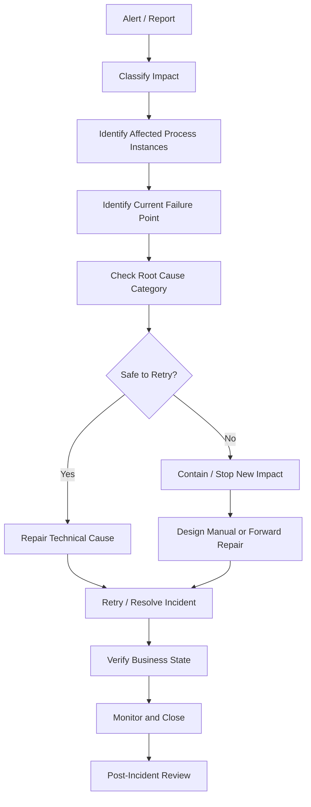

# Part 054 — Operational Runbook

> Fokus part ini: membangun runbook operasional untuk workflow production system. Targetnya bukan hanya tahu “klik retry” di Cockpit/Operate, tetapi mampu melakukan triage customer-impact-aware, membedakan symptom vs root cause, mencegah duplicate side effect, dan melakukan repair dengan approval yang benar.

Workflow incident berbeda dari service incident biasa karena state-nya long-running. Satu process instance bisa hidup selama menit, jam, hari, atau minggu. Ketika ada failure, pertanyaan operasionalnya bukan hanya:

```text
Service sudah up atau belum?
```

Pertanyaannya adalah:

```text
Instance mana yang terdampak?
Side effect apa yang sudah terjadi?
Apakah aman di-retry?
Apakah business state dan process state masih konsisten?
Apakah customer/order/quote sudah terdampak?
Siapa yang berwenang melakukan manual repair?
```

Runbook ini harus disesuaikan dengan internal CSG/team. Jangan mengarang topology, dashboard, retry policy, incident owner, database schema, worker implementation, atau operational tooling. Gunakan bagian `Internal verification checklist` untuk mengisi realitas internal.

---

## 1. Operational Principles

### 1.1 Do not blindly retry

Retry adalah aksi mutasi. Dalam workflow, retry bisa:

- memanggil external API lagi;
- menulis database lagi;
- publish event lagi;
- mengirim notification lagi;
- membuat duplicate order action;
- mengubah external system state;
- menutup incident tanpa memperbaiki root cause.

Sebelum retry, jawab:

```text
Is the task idempotent?
Did the previous attempt produce side effects?
Is the root cause fixed?
Can the worker safely run again?
```

### 1.2 Separate technical recovery from business recovery

Technical recovery:

- restart worker;
- fix configuration;
- restore DB connection;
- increase retries;
- resolve incident;
- redeploy corrected BPMN/worker.

Business recovery:

- correct quote/order status;
- reverse external reservation;
- re-send customer/order event;
- manually approve/reject task;
- reconcile with billing/inventory/fulfillment;
- notify support/customer success;
- create audit note.

Do not call incident resolved if only technical symptom is fixed but business state remains inconsistent.

### 1.3 Preserve evidence before repair

Before changing anything:

- capture process instance ID/key;
- capture business key/order ID/quote ID;
- capture current activity/task/job;
- capture variables relevant to failure;
- capture incident message/stack trace;
- capture worker logs;
- capture external API response if available;
- capture DB rows if relevant;
- capture Kafka/RabbitMQ message metadata;
- capture timeline.

Operational actions without evidence make post-incident review weak.

### 1.4 One incident, one owner

Workflow incidents can span backend, SRE, product, BA, platform, DB, and external integration teams. Still, every active incident needs one accountable coordinator.

The coordinator does not need to know every detail. They ensure:

- customer impact is tracked;
- triage is coordinated;
- risky repair actions are approved;
- communication is consistent;
- timeline is recorded;
- post-incident review happens.

---

## 2. Incident Triage Flow

Use this high-level flow before jumping into specific runbooks.



### 2.1 Minimum triage data

Collect:

| Data | Why it matters |
|---|---|
| environment | dev/test/stage/prod/customer env |
| process ID | which BPMN model |
| process definition version | version-specific bug detection |
| process instance ID/key | runtime target |
| business key | quote/order/customer tracing |
| current activity | where token/element is stuck |
| incident/job/task ID | repair target |
| worker job type/topic | automation owner |
| retries remaining | retry state |
| error message | root cause clue |
| last updated time | aging/stuck detection |
| external dependency | DB/API/Kafka/RabbitMQ/Redis/search |
| customer/business impact | urgency and communication |

---

## 3. Runbook: Failed Job / Incident

### 3.1 Symptoms

- Camunda incident created.
- Failed job visible in Cockpit/Operate.
- Process instance stuck at service task.
- Worker logs show exception.
- Retries exhausted.
- Job latency/backlog increases.

### 3.2 Common causes

- transient external API failure;
- database unavailable;
- invalid/missing variable;
- serialization/deserialization failure;
- worker bug;
- authentication/authorization failure;
- wrong endpoint/config;
- payload too large;
- downstream system rejected request;
- BPMN model expects old/new variable contract;
- worker cannot handle process version.

### 3.3 Triage steps

1. Identify process instance and business key.
2. Identify failed activity/job type/topic.
3. Read incident message and worker error.
4. Check retries remaining and last failure timestamp.
5. Check whether the worker action has external side effects.
6. Check external dependency health.
7. Check process variables needed by worker.
8. Check recent deployments of BPMN/DMN/worker/config.
9. Determine if failure is transient, data-related, code-related, or model-related.
10. Decide repair action.

### 3.4 Safe repair options

| Cause | Repair |
|---|---|
| transient dependency outage | wait/fix dependency, then retry |
| missing variable | patch variable only with approval, then retry |
| invalid variable | correct variable with audit, then retry |
| worker bug | deploy fix, then retry affected incidents |
| wrong config | fix config/secret/endpoint, restart worker, retry |
| non-retryable business issue | route to BPMN error/manual fallout if possible |
| duplicate side effect risk | reconcile external state before retry |

### 3.5 Do not do this

- Do not increase retries blindly.
- Do not resolve incident without fixing root cause.
- Do not patch variables without audit trail.
- Do not retry non-idempotent job without checking external state.
- Do not delete process instance unless business approved.
- Do not manually change DB runtime tables unless vendor/support-approved and runbook explicitly allows it.

---

## 4. Runbook: Worker Down

### 4.1 Symptoms

- Jobs created but not activated.
- Service tasks stuck.
- Worker metrics show zero active/completed jobs.
- Kubernetes pods crashlooping or not ready.
- Camunda 8 job activation fails.
- Camunda 7 external task fetch-and-lock not happening.
- Queue/topic backlog grows.

### 4.2 Common causes

- worker deployment failed;
- worker image bad;
- missing environment variable;
- secret missing/expired;
- Camunda endpoint unreachable;
- auth token invalid;
- TLS/certificate problem;
- network policy/firewall issue;
- worker disabled by feature flag;
- resource limit too low;
- database connection pool exhausted;
- dependency startup order problem.

### 4.3 Triage steps

```text
1. Check worker pods/process health.
2. Check logs for startup failure.
3. Check readiness/liveness probe.
4. Check connection to Camunda endpoint.
5. Check credential/secret mount.
6. Check job type/topic configuration.
7. Check recent deployment/config changes.
8. Check external dependencies used during startup.
9. Check worker concurrency and thread pool exhaustion.
10. Check backlog size and customer impact.
```

### 4.4 Repair

- roll forward with fixed config/image;
- roll back worker if compatible with current BPMN;
- restore secret/certificate;
- fix NetworkPolicy/firewall/DNS;
- reduce concurrency if dependency overloaded;
- scale worker if backlog is safe and downstream capacity allows;
- pause new process starts if backlog creates SLA/customer risk.

### 4.5 Safety check before scaling

Scaling workers can make outage worse if downstream is failing.

Before scaling:

- Is downstream healthy?
- Are jobs idempotent?
- Is backlog retry-safe?
- Are rate limits known?
- Is DB capacity sufficient?
- Are Kafka/RabbitMQ/Redis dependencies stable?

---

## 5. Runbook: Stuck Process

### 5.1 Symptoms

- Process instance active for too long.
- No incident, but no progress.
- Token/element waiting unexpectedly.
- Business order/quote stuck in intermediate state.
- SLA breached.

### 5.2 Common causes

- waiting at user task with no assignee;
- waiting for message that never arrives;
- waiting for timer far in future due to wrong expression/timezone;
- waiting at receive task;
- job not created due to model path;
- gateway condition routed to dead path;
- call activity child process stuck;
- event subprocess behavior misunderstood;
- external system never sent callback;
- process state and entity state diverged.

### 5.3 Triage steps

1. Identify current active activity/element.
2. Determine whether it is a valid wait state.
3. Check expected event: human task, message, timer, job, child process.
4. Check business key and external state.
5. Check whether token path is correct based on variables.
6. Check gateway decisions and DMN output.
7. Check pending message/timer/job/task.
8. Check process version and recent model changes.
9. Check whether old process version has known bug.
10. Decide repair or wait.

### 5.4 Repair options

- assign/claim/complete human task if business-approved;
- correlate missing message if event was received elsewhere and verified;
- patch variable if wrong/missing and approved;
- migrate instance if model bug and safe mapping exists;
- cancel/restart process only with business approval;
- trigger reconciliation process;
- route to manual fallout.

Do not “unstick” process by forcing token movement unless you fully understand side effects and audit requirements.

---

## 6. Runbook: Timer Backlog

### 6.1 Symptoms

- Timers fire late.
- SLA escalation delayed.
- Job executor overloaded.
- Zeebe timer processing lag suspected.
- Many instances waiting on timer.
- Sudden spike after maintenance/restart.

### 6.2 Common causes

- too many timer jobs created at once;
- retry timers causing burst;
- cron/cycle expression creates synchronized load;
- Camunda 7 job executor under-provisioned;
- Camunda 7 DB load/high lock contention;
- Zeebe broker/backpressure issue;
- worker/service dependency slow after timer fires;
- timezone/expression error;
- maintenance window accumulated timer backlog.

### 6.3 Triage steps

- measure timer backlog count;
- identify process versions producing timers;
- check expected vs actual due time;
- check job executor/broker health;
- check database/search/CPU pressure;
- check downstream worker capacity;
- check recent deployment adding timers;
- check whether timers are SLA-critical or technical retry timers.

### 6.4 Repair

- restore engine/broker/job executor health;
- scale workers only if downstream can handle burst;
- reduce new process starts if backlog is growing;
- spread future timers with jitter if model allows;
- correct timer expression in new version;
- identify instances affected by wrong timer;
- communicate SLA/customer impact.

---

## 7. Runbook: Message Correlation Failure

### 7.1 Symptoms

- External callback/event received but process does not progress.
- Message correlation API returns not found/failure.
- Kafka/RabbitMQ event consumed but no process instance updated.
- Process waits at message catch/receive task.
- Duplicate/late message logs appear.

### 7.2 Common causes

- wrong message name;
- wrong correlation key;
- process not yet waiting at catch event;
- message arrived too early and TTL expired;
- message arrived too late after process moved on;
- duplicate event;
- out-of-order event;
- tenant mismatch;
- process version changed correlation logic;
- business key vs correlation key confusion;
- API/event payload schema changed.

### 7.3 Triage steps

1. Capture event/message metadata.
2. Identify expected message name.
3. Identify expected correlation key expression.
4. Verify process instance is waiting at matching catch event.
5. Check tenant/environment.
6. Check TTL/expiration behavior if applicable.
7. Check duplicate/out-of-order policy.
8. Check Kafka/RabbitMQ replay or DLQ.
9. Check recent BPMN/API/schema changes.
10. Decide whether manual correlation is safe.

### 7.4 Repair

- replay event if consumer lost it and duplicate-safe;
- manually correlate only after verifying target instance;
- patch correlation variable only with approval;
- route late event to reconciliation/fallout;
- fix producer schema/key mapping;
- deploy corrected BPMN/worker for future events;
- update event contract tests.

### 7.5 Never assume business key equals correlation key

They may be same, but that must be verified.

Example:

```text
businessKey = orderId
correlationKey = fulfillmentRequestId
```

Using the wrong key can correlate an event to the wrong process instance.

---

## 8. Runbook: User Task Aging

### 8.1 Symptoms

- User tasks remain open beyond SLA.
- Tasklist queue grows.
- Manual approval/fallout backlog increases.
- Assignee unavailable.
- Tasks not visible to expected group.
- Users cannot complete task.

### 8.2 Common causes

- no candidate group;
- wrong group/role mapping;
- assignee left team;
- task filter hides task;
- due date missing/wrong;
- form validation blocks completion;
- stale UI/task already completed;
- authorization rule too strict;
- escalation timer not configured or failed;
- business team capacity issue.

### 8.3 Triage steps

- identify task ID and process instance;
- check candidate user/group/assignee;
- check tenant/role/permission;
- check due date/follow-up/SLA;
- check form data and validation errors;
- check task creation timestamp;
- check escalation timers;
- check business queue owner;
- check whether task is truly actionable.

### 8.4 Repair

- reassign task with approval;
- add candidate group if model/config allows;
- correct IAM/group mapping;
- deploy form fix;
- patch missing variables only with audit;
- trigger escalation process;
- route to fallback queue;
- update capacity planning if backlog is business workload.

Human task backlog is not always technical incident. It may be business capacity incident.

---

## 9. Runbook: SLA Breach

### 9.1 Symptoms

- SLA alert fires.
- Task/process exceeds due date.
- Customer-facing deadline missed.
- Order/quote aging metric spikes.

### 9.2 Classify breach

| Type | Example | Response |
|---|---|---|
| technical blockage | worker down, incident, DB outage | technical repair + impact review |
| human capacity | approval queue too large | operational escalation |
| external dependency | inventory/billing/OSS delay | partner/system escalation |
| model error | timer/due date wrong | deploy fix + identify affected instances |
| data issue | missing required data | manual correction/reconciliation |

### 9.3 Triage steps

- identify affected instances/tasks;
- group by current activity;
- determine whether breach is systemic or isolated;
- check whether timers/escalations fired;
- check worker/dependency health;
- check recent deployments;
- estimate customer impact;
- decide remediation priority.

### 9.4 Repair

- resolve blocking incident;
- increase manual capacity or reassign;
- escalate external dependency;
- deploy timer/model fix;
- run reconciliation;
- notify stakeholders/customers if required.

---

## 10. Runbook: Process Migration Failure

### 10.1 Symptoms

- migration command fails;
- instance migration partially succeeds/fails;
- migrated instance creates new incident;
- task/job/variable mismatch after migration;
- process enters unreachable/invalid path.

### 10.2 Common causes

- activity mapping missing;
- source and target activities incompatible;
- new gateway requires variable not present;
- removed boundary event changed behavior;
- task form not compatible;
- worker contract changed;
- call activity binding changed;
- message/timer wait state not mapped safely;
- migration applied to wrong process version/tenant.

### 10.3 Triage steps

- identify source/target process definition;
- identify mapping instructions used;
- identify failed instances;
- inspect current activity before and after migration;
- inspect variable compatibility;
- inspect active jobs/tasks/timers/messages;
- check incidents after migration;
- compare with dry-run/test result;
- decide whether forward repair is needed.

### 10.4 Repair

- stop further migration batch;
- isolate affected instances;
- fix target model if needed;
- patch variables if approved;
- migrate to corrected version if safe;
- manually repair individual instances;
- communicate business impact;
- document irreversible actions.

Rollback after migration may not be possible or safe. Treat migration as production surgery.

---

## 11. Runbook: Bad BPMN/DMN/Form Deployment

### 11.1 Symptoms

- new process instances fail immediately;
- unexpected gateway path;
- worker job type mismatch;
- user task form broken;
- DMN returns unexpected result;
- message correlation stops;
- incidents spike after deployment.

### 11.2 Immediate containment

- stop or reduce new process starts if possible;
- disable event consumer that starts affected process if safe;
- stop using new version from API if routing allows;
- keep old workers alive;
- notify incident owner and business owner;
- identify process instances started on bad version.

### 11.3 Diagnosis

- compare deployed version tag to expected release manifest;
- inspect semantic BPMN/DMN/form change;
- check worker compatibility;
- check variable/input-output mapping;
- check message correlation key;
- check recent DB/schema/config changes;
- check test evidence gap.

### 11.4 Repair options

- deploy corrected BPMN/DMN/form;
- route new starts to older safe version if supported;
- migrate affected instances if safe;
- cancel/restart affected instances with approval;
- patch variables/forms;
- forward-fix worker;
- manually repair business state.

Do not assume redeploying old BPMN fixes already-started instances.

---

## 12. Runbook: Database Issue

### 12.1 Symptoms

For Camunda 7:

- engine slow/unavailable;
- job executor fails acquisition;
- optimistic locking spike;
- DB connection pool exhausted;
- history cleanup load;
- slow queries on runtime/history tables.

For workers/business DB:

- worker fails DB calls;
- business state not updated;
- idempotency table unavailable;
- outbox stuck;
- transaction timeout;
- lock contention.

### 12.2 Triage steps

- identify whether issue is Camunda runtime DB or business DB;
- check connection pool;
- check DB CPU/IO/locks;
- check slow queries;
- check recent migration;
- check history cleanup/batch jobs;
- check worker retry storm;
- check outbox/inbox backlog;
- check data consistency for affected business keys.

### 12.3 Repair

- restore DB health;
- pause heavy workers if retry storm worsens DB load;
- throttle process starts;
- postpone cleanup jobs if allowed;
- fix bad query/index/migration;
- retry idempotent jobs after DB health recovers;
- reconcile business state vs process state.

Do not let retry behavior DDoS your own database.

---

## 13. Runbook: Zeebe Broker / Gateway Issue

### 13.1 Symptoms

- clients cannot deploy/start/correlate/activate jobs;
- gateway unavailable;
- broker unhealthy;
- partition unavailable;
- leader election instability;
- backpressure errors;
- job activation latency rises;
- Operate data delayed due to exporter/secondary storage issue.

### 13.2 Triage steps

- check gateway health;
- check broker health;
- check partition leadership;
- check disk usage;
- check CPU/memory;
- check network between gateway/broker;
- check backpressure metrics;
- check exporter/secondary storage health;
- check recent Helm/config upgrade;
- check worker/client error patterns.

### 13.3 Repair

- restore unhealthy pod/node;
- fix resource exhaustion;
- fix persistent volume/storage issue;
- fix network issue;
- reduce client/worker pressure;
- pause new starts if cluster unstable;
- follow backup/restore procedure if data loss/corruption suspected;
- escalate to platform/vendor support if needed.

Do not manipulate broker state manually without approved support guidance.

---

## 14. Runbook: Operate / Cockpit / Tasklist Issue

### 14.1 Symptoms

- operator UI unavailable;
- process appears missing;
- incident not visible;
- task list not loading;
- data stale;
- users cannot see tasks;
- admin cannot resolve incident through UI.

### 14.2 Important distinction

UI issue is not always engine issue.

Possible split:

```text
Engine is healthy, but UI/search/index is stale or unavailable.
```

For Camunda 8, Operate/Tasklist visibility depends on exported/indexed data. For Camunda 7, Cockpit/Tasklist depend on engine/database and webapp configuration.

### 14.3 Triage steps

- check engine/broker health separately from UI health;
- check secondary storage/indexing freshness if relevant;
- check identity/auth;
- check UI pod/service/ingress;
- check API behind UI;
- check specific tenant/role;
- check whether incident/task exists via API/DB-supported operational path;
- check recent deployment/config changes.

### 14.4 Repair

- restore UI/search/index dependency;
- fix identity/authorization mapping;
- use approved API/CLI alternative for urgent operations;
- avoid manual DB edits;
- communicate operator tooling degradation separately from engine outage.

---

## 15. Manual Repair Checklist

Manual repair is high-risk. Use when automated path is unavailable or unsafe.

### 15.1 Before manual repair

Confirm:

- process instance ID/key;
- business key;
- current activity;
- customer/business impact;
- proposed repair action;
- side effects already occurred;
- idempotency status;
- approval authority;
- audit record location;
- rollback/forward recovery plan;
- monitoring after repair.

### 15.2 Manual repair action types

| Action | Risk |
|---|---|
| increase retries | duplicate side effects if not idempotent |
| resolve incident | hides root cause if premature |
| update variables | changes process path and audit state |
| complete user task | bypasses normal business actor |
| correlate message | may wake wrong process instance |
| cancel process instance | may abandon business work |
| migrate process instance | can create unreachable state |
| patch business DB | can diverge from process state |
| replay event | can duplicate downstream effects |

### 15.3 Repair evidence

Record:

```text
- who performed repair
- who approved repair
- when it was performed
- affected instance/business key
- exact action taken
- reason
- pre-repair state
- post-repair state
- validation result
- follow-up item
```

---

## 16. Customer Impact Checklist

For CPQ/order management, customer impact may not be obvious from engine metrics.

Check:

- How many quotes/orders affected?
- Which customers/tenants affected?
- Are orders blocked, delayed, duplicated, cancelled, or incorrectly approved?
- Did any external system receive duplicate command/event?
- Did pricing/approval decision change incorrectly?
- Are manual tasks aging beyond SLA?
- Did any customer-facing notification fire incorrectly?
- Is revenue recognition/billing/fulfillment affected?
- Is regulatory/compliance/audit trail affected?
- Is support/customer success informed?

Map technical symptom to business impact.

Example:

```text
Technical symptom: 600 incidents on order.reserve-inventory.v1
Business impact: 600 orders may not have inventory reserved; 47 are premium customer orders; 12 breached fulfillment SLA.
```

---

## 17. Communication Template

### 17.1 Initial incident note

```markdown
## Workflow Incident Initial Assessment
Environment:
Detected at:
Detected by:
Primary symptom:
Affected process:
Affected version(s):
Affected business keys count:
Customer/tenant impact:
Current containment:
Suspected root cause:
Next update:
Owner:
```

### 17.2 Repair note

```markdown
## Workflow Repair Action
Instance/business keys affected:
Repair type:
Reason:
Approval:
Side-effect assessment:
Action taken:
Validation:
Remaining risk:
Follow-up:
```

### 17.3 Closure note

```markdown
## Workflow Incident Closure
Start time:
End time:
Duration:
Root cause:
Affected instances:
Business impact:
Repair actions:
Preventive actions:
Dashboard/runbook/test updates:
Owner for follow-up:
```

---

## 18. Java/JAX-RS Runbook Concerns

When workflow is integrated through Java/JAX-RS APIs, check:

- process start endpoint errors;
- task completion endpoint errors;
- message correlation endpoint errors;
- idempotency key persistence;
- correlation ID propagation;
- request timeout vs process async behavior;
- API auth/tenant check;
- API returns 202 but process never starts;
- API starts wrong process version;
- error mapping hides workflow incident;
- API retry creates duplicate process instance.

Runbook question:

```text
Is the incident inside Camunda, inside JAX-RS boundary, inside worker, or inside external dependency?
```

Do not collapse these into one vague “workflow failed” label.

---

## 19. PostgreSQL/MyBatis/JDBC Runbook Concerns

Check:

- business row for quote/order state;
- process instance mapping table if exists;
- idempotency/processed job table;
- outbox/inbox state;
- transaction logs/application logs;
- optimistic locking errors;
- migration version;
- mapper query changes;
- DB connection pool;
- long-running locks;
- stale cache after DB repair.

When repairing DB state, always reconcile process state.

Example mismatch:

```text
Order DB state = RESERVED
Process instance still waiting at Reserve Inventory service task incident
```

Retrying blindly may reserve inventory again unless worker is idempotent.

---

## 20. Kafka/RabbitMQ/Redis Runbook Concerns

### 20.1 Kafka

Check:

- topic;
- partition;
- offset;
- consumer group lag;
- event key;
- schema version;
- duplicate/replay policy;
- outbox publication;
- correlation key;
- DLQ/retry topic if used.

### 20.2 RabbitMQ

Check:

- exchange;
- queue;
- routing key;
- unacked messages;
- redelivery count;
- DLQ;
- TTL;
- reply queue;
- consumer connection;
- duplicate handling.

### 20.3 Redis

Check:

- idempotency keys;
- lock keys;
- TTL;
- eviction;
- Redis health;
- feature flag/kill switch;
- cache staleness;
- rate limiter state.

Redis outage can make idempotency or coordination unsafe. Do not assume Redis is only “cache” if workers depend on it for safety.

---

## 21. Kubernetes/Cloud/On-Prem Runbook Concerns

### 21.1 Kubernetes

Check:

- pod status;
- restart count;
- logs;
- readiness/liveness probe;
- resource limits;
- HPA scaling;
- PVC status;
- node pressure;
- service/ingress;
- NetworkPolicy;
- secret/config mount;
- rollout history.

### 21.2 AWS/Azure

Check:

- managed database health;
- managed search health;
- IAM/managed identity;
- security group/NSG;
- private endpoint;
- load balancer;
- DNS;
- cloud monitor alerts;
- secret manager/key vault;
- backup status.

### 21.3 On-prem/hybrid

Check:

- firewall;
- DNS;
- proxy;
- internal CA;
- certificate expiry;
- VPN/private link;
- packet inspection;
- monitoring access;
- customer change window;
- support boundary.

Hybrid workflow issues are often network/certificate/ownership issues disguised as worker failures.

---

## 22. Internal Verification Checklist

Use this to build the real CSG/team runbook.

### Ownership

- Who owns each process model?
- Who owns worker code?
- Who owns Camunda runtime?
- Who owns database/search dependency?
- Who owns Kafka/RabbitMQ/Redis?
- Who approves manual repair?
- Who communicates customer impact?

### Tooling

- Which operational UI is used: Cockpit, Tasklist, Operate, custom dashboard?
- Which metrics/dashboard system is used?
- Which log/trace system is used?
- Which alert channels exist?
- Which API/CLI is approved for repair?
- Are production variable patches allowed?

### Incident policy

- What creates incident vs alert?
- Who is on-call?
- What is severity mapping?
- What is SLA for failed job/user task/timer backlog?
- What is required before retry?
- What is required before resolving incident?
- What is required before cancelling/migrating process instance?

### Data and correlation

- What is business key?
- What is correlation key?
- Where is process-instance-to-order/quote mapping stored?
- Where is idempotency state stored?
- Where is outbox/inbox state stored?
- Where are manual repair audit notes stored?

### Deployment and rollback

- How are BPMN/DMN/forms deployed?
- How are worker versions deployed?
- How are bad deployments contained?
- How are affected instances identified?
- Is forward recovery preferred over rollback?
- Is there a migration runbook?

### Security and compliance

- Who can see process variables?
- Who can patch variables?
- Who can resolve incidents?
- Who can complete/reassign user tasks?
- Are sensitive variables redacted?
- Are manual repairs audited?
- Are customer-impacting repairs approved?

---

## 23. Senior Engineer Incident Questions

During an incident, ask:

1. Is this a process issue, worker issue, dependency issue, data issue, or operator tooling issue?
2. Which process versions are affected?
3. Which business keys are affected?
4. What side effects already happened?
5. Is retry safe?
6. Is the worker idempotent?
7. Is the process waiting correctly or stuck incorrectly?
8. Is the business state consistent with process state?
9. Is customer impact growing?
10. Do we need to stop new starts or pause workers?
11. Who must approve repair?
12. How will we verify repair worked?
13. What test/alert/runbook was missing?
14. What internal assumption caused slow diagnosis?

---

## 24. Key Takeaways

- Workflow runbooks must be business-state-aware, not only service-health-aware.
- Failed job retry is dangerous unless idempotency and side effects are understood.
- Stuck process, timer backlog, message correlation failure, user task aging, and SLA breach require different triage paths.
- Manual repair must be audited and approved.
- Operator UI failure is not always engine failure.
- Production workflow debugging must preserve evidence before repair.
- Customer impact must be mapped from process instances to quote/order/business keys.
- Senior engineers should coordinate technical recovery, business recovery, and prevention work.

