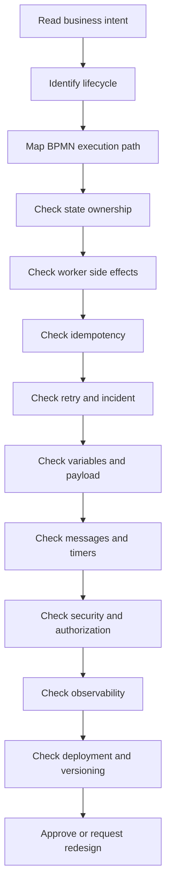

# Part 059 — Workflow Anti-Patterns

> Fokus part ini: mengenali desain workflow yang terlihat rapi di diagram tetapi berbahaya saat berjalan di production. Anti-pattern workflow hampir selalu muncul dari satu kesalahan inti: diagram terlihat seperti proses bisnis, tetapi runtime behavior-nya tidak aman terhadap failure, retry, concurrency, versioning, security, dan operational repair.

Anti-pattern workflow tidak selalu tampak buruk pada awalnya. Banyak anti-pattern justru muncul dari niat baik:

```text
"supaya semua proses terlihat jelas di BPMN"
"supaya BA bisa lihat semua rule"
"supaya tidak perlu bikin service tambahan"
"supaya cepat, taruh saja datanya di variable"
"supaya kalau gagal retry terus"
"supaya tidak ribet, satu process saja untuk semua flow"
```

Masalahnya, workflow engine bukan magic layer. Workflow engine hanya membuat lifecycle proses menjadi eksplisit. Jika desain lifecycle salah, Camunda hanya membuat kesalahan itu lebih terlihat, lebih persist, dan lebih sulit dibersihkan.

---

## 1. Mental Model Anti-Pattern

Anti-pattern adalah desain yang tampak menyelesaikan masalah lokal tetapi menciptakan risiko sistemik.

Dalam workflow system, risiko sistemik biasanya muncul di area berikut:

```text
Business correctness
Runtime state consistency
Worker idempotency
Retry and incident ownership
Variable compatibility
Message correlation
Timer and SLA behavior
Human task accountability
Security and privacy exposure
Deployment and migration safety
Production observability
Manual repair discipline
```

Cara membaca anti-pattern:

```text
Looks okay in diagram
        ↓
Fails under retry/concurrency/versioning
        ↓
Creates ambiguous production state
        ↓
Requires manual repair without reliable evidence
        ↓
Becomes customer-impacting incident
```

Senior engineer tidak hanya bertanya:

```text
Apakah BPMN-nya valid?
```

Pertanyaan yang lebih penting:

```text
Apakah proses ini tetap benar kalau worker crash setelah DB commit?
Apakah message duplicate bisa membuat proses lompat state?
Apakah timer firing setelah migration masih valid?
Apakah user task bisa diselesaikan oleh role yang salah?
Apakah running instance lama tetap compatible dengan worker baru?
Apakah incident ini punya owner dan runbook?
```

---

## 2. Anti-Pattern Catalog

Bagian ini menggunakan format yang sama untuk setiap anti-pattern:

```text
Symptom
Why it happens
Production risk
How to detect
How to fix
PR review question
Internal verification checklist
```

---

## 3. Anti-Pattern: God Process

### Symptom

Satu BPMN berusaha memodelkan semua variasi proses:

```text
quote creation
pricing approval
discount exception
legal review
order capture
order decomposition
fulfillment
fallout
cancellation
amendment
renewal
manual correction
reconciliation
notification
reporting
```

Diagram menjadi sangat besar, gateway terlalu banyak, subprocess tidak jelas, dan setiap perubahan kecil berisiko menyentuh flow yang tidak terkait.

### Why it happens

Biasanya karena tim ingin punya "single source of truth" visual untuk semua proses. Masalahnya, single diagram bukan berarti single truth. Diagram besar sering menyembunyikan coupling yang tidak perlu.

### Production risk

```text
- deployment kecil berdampak ke banyak flow
- migration running instance menjadi sulit
- test matrix meledak
- incident triage lambat karena path terlalu banyak
- BA/Product sulit memvalidasi perubahan secara lokal
- worker contract menjadi kabur
- compensation path tidak terlihat jelas
```

### How to detect

Tanda-tanda god process:

```text
1 BPMN punya terlalu banyak business scenario berbeda
banyak gateway dengan expression teknis
banyak variable global yang dipakai lintas area
subprocess hanya dipakai untuk merapikan gambar, bukan boundary lifecycle
call activity tidak punya ownership jelas
semua failure diarahkan ke satu generic manual handling task
```

### How to fix

Gunakan komposisi yang lebih eksplisit:

```text
Parent process: high-level lifecycle orchestration
Child process: reusable bounded process
Subprocess: local scope untuk cohesive activity group
DMN/rules service: decision logic
Domain state machine: invariant dan entity lifecycle
Worker/service: technical side effect
```

Contoh pemisahan yang lebih sehat:

```text
Quote Approval Process
Order Capture Process
Order Fulfillment Process
Fallout Handling Process
Cancellation Process
Reconciliation Process
```

Jangan otomatis memecah menjadi banyak process. Pecah ketika boundary lifecycle, ownership, versioning, atau failure handling berbeda.

### PR review question

```text
Apakah perubahan ini memperbesar process yang sudah terlalu besar?
Apakah flow baru punya lifecycle/owner/failure mode berbeda sehingga lebih cocok menjadi child process?
Apakah test matrix masih realistis?
```

### Internal verification checklist

- Cek BPMN terbesar di codebase.
- Cek jumlah gateway/service task/user task dalam satu process.
- Cek apakah satu diagram dipakai untuk banyak product/tenant/scenario.
- Cek apakah incident triage membutuhkan pengetahuan tribal karena diagram terlalu kompleks.
- Cek apakah BA/Product masih bisa membaca process tanpa engineering walkthrough panjang.

---

## 4. Anti-Pattern: BPMN as Code Replacement

### Symptom

Tim memasukkan logic teknis terlalu banyak ke BPMN:

```text
complex FEEL/expression in gateway
business calculation in script task
technical branching based on service response shape
data transformation in input/output mapping
retry routing by string parsing
JSON manipulation inside model
```

BPMN berubah menjadi low-code implementation surface, bukan process contract.

### Why it happens

Karena BPMN terasa mudah diubah tanpa menyentuh code. Tetapi kemudahan perubahan bukan berarti aman. Logic yang seharusnya punya unit test, type safety, code review, dan domain ownership justru pindah ke expression yang sulit dicari dan sulit diobservasi.

### Production risk

```text
- rule berubah tanpa test memadai
- expression runtime error membuat incident
- domain invariant tersebar di diagram
- logic sulit di-refactor
- version compatibility memburuk
- debugging butuh membuka model, variable, expression, dan worker sekaligus
```

### How to detect

Cari expression yang melakukan lebih dari routing sederhana:

```text
= price.total > 10000 and customer.segment = "ENTERPRISE" and product.family in ["...", "..."] and ...
```

Atau script task yang melakukan kerja domain:

```text
calculatePrice()
validateContractEligibility()
buildFulfillmentPlan()
updateOrderState()
```

### How to fix

Letakkan logic di tempat yang tepat:

```text
BPMN: orchestration and lifecycle
DMN: explicit decision table yang business-owned dan testable
Domain service: invariant and state transition
Worker: technical side effect and integration
Rules engine: complex, frequently changing, high-volume rule evaluation
```

BPMN boleh punya expression, tetapi idealnya expression menjawab pertanyaan sederhana:

```text
Apakah path A atau path B?
Apakah event ini diterima?
Apakah variable decision result bernilai APPROVED?
```

### PR review question

```text
Apakah logic di BPMN ini benar-benar flow decision, atau business rule/domain rule yang harus dipindah?
Apakah expression ini punya test?
Apakah jika expression gagal, error-nya observable?
```

### Internal verification checklist

- Cari gateway expression yang terlalu panjang.
- Cari script task yang memuat business logic.
- Cek apakah DMN dipakai untuk decision yang seharusnya externalized.
- Cek apakah domain invariant ada di service layer, bukan hanya BPMN.
- Cek apakah expression punya test coverage.

---

## 5. Anti-Pattern: Business Rules Hidden in Gateways

### Symptom

Gateway diberi nama teknis dan expression menyimpan business decision:

```text
Gateway: Check Condition
Expression: ${discount > 15 && customerType == 'VIP' && region != 'X'}
```

Padahal secara bisnis itu mungkin berarti:

```text
Requires regional pricing approval?
Eligible for automated enterprise discount?
Needs legal exception review?
```

### Why it happens

Karena gateway sering dianggap tempat alami untuk semua if/else. Padahal gateway harus merepresentasikan hasil keputusan, bukan menjadi decision engine tersembunyi.

### Production risk

```text
- BA/Product tidak sadar rule sebenarnya ada di BPMN
- rule berubah tanpa governance
- approval routing salah
- audit sulit menjelaskan kenapa path dipilih
- test hanya mengecek happy path
```

### How to detect

Tanda gateway menyembunyikan rule:

```text
nama gateway generic: Check, Validate, Is OK?
condition expression panjang
condition mengakses banyak field domain
condition berubah sering
condition penting untuk audit/compliance
```

### How to fix

Ubah pola menjadi:

```text
Business rule task / rules service / domain service menghasilkan decision result
Gateway hanya route berdasarkan result
```

Contoh lebih sehat:

```text
Evaluate Approval Routing Decision
        ↓ result.approvalPath
Exclusive Gateway: Approval Path?
        ├── AUTO_APPROVED
        ├── MANAGER_APPROVAL
        └── LEGAL_REVIEW
```

### PR review question

```text
Apakah gateway ini mengevaluasi rule, atau hanya merutekan hasil rule?
Apakah keputusan ini perlu audit trail?
Apakah BA/Product bisa membaca alasan path dipilih?
```

### Internal verification checklist

- Cek gateway yang memakai expression kompleks.
- Cek apakah approval/pricing/eligibility decision tersebar di BPMN.
- Cek apakah decision result disimpan sebagai variable yang auditable.
- Cek apakah rule punya owner.
- Cek apakah ada DMN/rules service yang lebih tepat.

---

## 6. Anti-Pattern: Too Many Variables

### Symptom

Process instance membawa terlalu banyak data:

```text
quote object full
order object full
customer profile full
catalog snapshot full
pricing response full
fulfillment plan full
API response raw
internal debug payload
```

Worker membaca dan menulis banyak variable tanpa kontrak yang jelas.

### Why it happens

Karena variable terasa praktis sebagai shared memory antar task. Tetapi workflow variable bukan database domain model. Variable adalah runtime context untuk orchestration.

### Production risk

```text
- payload besar memperlambat engine/exporter/search
- variable overwrite di parallel path
- sensitive data bocor ke history/log/incident/task UI
- version compatibility rusak saat schema object berubah
- worker coupling meningkat
- debugging sulit karena tidak jelas siapa mengubah variable
```

### How to detect

Cek tanda berikut:

```text
worker fetch all variables
worker complete dengan all variables
variable berisi full entity snapshot
variable berubah bentuk antar version
variable dipakai sebagai source of truth entity
variable object tidak punya schema/version
```

### How to fix

Gunakan prinsip:

```text
Process variable kecil, eksplisit, dan lifecycle-aware.
Business table tetap source of truth untuk entity.
Worker hanya mengambil variable yang dibutuhkan.
Worker hanya mengupdate variable yang menjadi output kontraknya.
```

Contoh variable sehat:

```json
{
  "quoteId": "Q-123",
  "orderId": "O-456",
  "correlationId": "...",
  "approvalDecision": "MANAGER_REQUIRED",
  "fulfillmentRequestId": "...",
  "retryCategory": "TEMPORARY_EXTERNAL_FAILURE"
}
```

### PR review question

```text
Apakah variable ini benar-benar diperlukan untuk orchestration?
Apakah datanya bisa diambil dari business table berdasarkan ID?
Apakah variable ini aman masuk history/search/log/incident?
```

### Internal verification checklist

- Cek average dan p95 variable payload size.
- Cek variable yang berisi PII/secret.
- Cek worker yang fetch/write all variables.
- Cek variable schema compatibility antar version.
- Cek apakah process variable menggantikan PostgreSQL business table.

---

## 7. Anti-Pattern: Large Payload in Process Variable

### Symptom

Process variable menyimpan payload besar, seperti:

```text
catalog snapshot ratusan KB/MB
full quote line item tree
large external API response
binary/base64 document
debug dump
fulfillment decomposition result lengkap
```

### Why it happens

Karena ingin menghindari query ulang ke service/database. Namun workflow engine bukan object store, cache besar, atau audit warehouse.

### Production risk

```text
- persistence/search/exporter load meningkat
- history cleanup membesar
- backup/restore lebih lambat
- Operate/Cockpit/Tasklist menjadi berat
- network payload worker meningkat
- variable serialization failure
- PII exposure radius membesar
```

### How to fix

Pola yang lebih aman:

```text
Store large data in domain database/object storage.
Pass only stable reference in process variable.
Use schema/version for referenced data.
Make worker fetch detail explicitly.
Persist audit summary, not raw payload.
```

Contoh:

```json
{
  "quoteId": "Q-123",
  "catalogSnapshotRef": "catalog-snapshot-2026-07-11/Q-123",
  "pricingDecisionId": "PD-789"
}
```

### PR review question

```text
Apakah variable ini akan tetap aman pada volume production?
Apakah kita membutuhkan seluruh payload, atau hanya ID/reference/decision result?
Apa dampaknya ke history retention, search, backup, dan incident UI?
```

### Internal verification checklist

- Cek top largest variables.
- Cek variable serialization failures.
- Cek history/search storage growth.
- Cek worker network payload.
- Cek policy untuk binary/document/large JSON.

---

## 8. Anti-Pattern: Synchronous Blocking External Calls Inside Critical Flow

### Symptom

Service task memanggil external API secara sinkron dan menunggu lama:

```text
Validate Order → call external inventory API synchronously
Submit Fulfillment → wait for downstream system response
Check Customer → call CRM synchronously
Reserve Resource → block until network call completes
```

### Why it happens

Karena flow bisnis terasa linear. Tetapi external system sering punya latency, throttling, downtime, partial success, dan unknown outcome.

### Production risk

```text
- worker thread starvation
- job timeout
- duplicate execution after timeout
- retry storm ke downstream system
- process stuck akibat external outage
- slow API perceived as workflow outage
```

### How to fix

Pilih pattern sesuai kebutuhan:

```text
Short deterministic call: synchronous worker call with timeout and idempotency
Long-running external action: send command + wait for message/callback
Unreliable external system: outbox + async worker + correlation
High-volume integration: queue/event stream + backpressure-aware consumer
Manual dependency: user task/fallout queue
```

### PR review question

```text
Berapa timeout external call?
Apakah external API idempotent?
Apa yang terjadi jika worker crash setelah call sukses tapi sebelum complete job?
Apakah callback/message correlation lebih tepat?
```

### Internal verification checklist

- Cek service task yang memanggil external API.
- Cek timeout, retry, circuit breaker, bulkhead.
- Cek idempotency support downstream.
- Cek p95/p99 latency external dependency.
- Cek fallback/manual intervention path.

---

## 9. Anti-Pattern: Non-Idempotent Worker

### Symptom

Worker melakukan side effect tanpa deduplication:

```text
insert order line
charge customer
publish event
create downstream order
send notification
complete approval action
```

Jika job diulang, side effect juga diulang.

### Why it happens

Karena engineer menganggap satu job hanya dieksekusi satu kali. Dalam distributed systems, asumsi itu berbahaya. Retry, timeout, worker crash, network split, redeploy, dan lock expiration dapat menyebabkan re-execution.

### Production risk

```text
- duplicate order
- duplicate event
- duplicate downstream request
- incorrect state transition
- conflicting fulfillment action
- customer-visible inconsistency
```

### How to fix

Gunakan idempotency key dan persistence guard:

```text
idempotency_key = processInstanceKey + jobType + businessOperation
or
idempotency_key = businessCommandId
```

Pola DB:

```sql
insert into processed_workflow_command(idempotency_key, status, created_at)
values (?, 'PROCESSING', now())
on conflict do nothing;
```

Side effect harus bisa ditentukan ulang:

```text
If already done → return previous result
If in progress → avoid duplicate side effect
If failed before side effect → retry safely
If unknown outcome → reconcile before retry
```

### PR review question

```text
Apa idempotency key worker ini?
Apa unique constraint-nya?
Apa yang terjadi jika worker crash setelah side effect sukses tetapi sebelum job complete?
```

### Internal verification checklist

- Cek semua worker yang melakukan side effect.
- Cek processed job/command table.
- Cek external API idempotency key.
- Cek duplicate event handling.
- Cek unknown outcome reconciliation path.

---

## 10. Anti-Pattern: No Retry Policy

### Symptom

Semua failure diperlakukan sama:

```text
throw exception
engine default retry
incident eventually
manual retry by operator
```

Tidak ada klasifikasi failure.

### Why it happens

Karena retry dianggap urusan engine. Padahal retry adalah business + technical policy.

### Production risk

```text
- temporary failure menjadi manual incident terlalu cepat
- permanent failure diretry berkali-kali
- downstream outage dihantam retry storm
- manual repair tidak tahu failure category
- SLA tidak bisa diprediksi
```

### How to fix

Klasifikasikan failure:

```text
TEMPORARY_TECHNICAL: retry with backoff
PERMANENT_TECHNICAL: incident/manual repair
BUSINESS_REJECTED: BPMN error or business path
VALIDATION_FAILED: user/business correction path
DOWNSTREAM_UNKNOWN: pause/reconcile/manual decision
SECURITY_FORBIDDEN: no blind retry
```

Retry policy harus menjawab:

```text
berapa kali?
jarak antar retry?
siapa owner setelah habis?
apakah retry idempotent?
apakah downstream aman menerima retry?
apakah ada alert?
```

### PR review question

```text
Failure apa saja yang mungkin terjadi?
Mana yang retryable dan mana yang tidak?
Apa evidence operator untuk memutuskan manual repair?
```

### Internal verification checklist

- Cek retry config per service task/job type.
- Cek failure category di worker.
- Cek incident owner.
- Cek alert retry exhaustion.
- Cek backoff terhadap downstream capacity.

---

## 11. Anti-Pattern: Infinite Retry

### Symptom

Task diretry terus tanpa batas efektif:

```text
retry every minute forever
worker catches exception and requeues silently
RabbitMQ redelivery loop
Kafka consumer keeps failing same event
manual retry repeatedly without fix
```

### Why it happens

Karena tim ingin sistem self-healing. Tetapi retry tanpa diagnosis bukan self-healing; itu failure amplification.

### Production risk

```text
- retry storm
- DB/search/log explosion
- downstream overload
- noisy alert
- incident masking
- process never reaches manual repair path
```

### How to fix

Gunakan bounded retry:

```text
short retry for transient errors
longer backoff for dependency outage
incident/manual task after exhaustion
dead-letter or fallout queue for poison message
reconciliation for unknown outcome
```

### PR review question

```text
Apa kondisi stop retry?
Apa yang terjadi setelah retry habis?
Siapa owner failure tersebut?
```

### Internal verification checklist

- Cek retry loop di worker/queue/engine.
- Cek DLQ/fallout path.
- Cek retry metric dan alert.
- Cek manual repair runbook.
- Cek protection terhadap downstream outage.

---

## 12. Anti-Pattern: No Incident Ownership

### Symptom

Incident muncul di Cockpit/Operate atau dashboard, tetapi tidak jelas siapa yang harus bertindak.

```text
Backend thinks SRE owns it
SRE thinks product/backend owns business failure
Product thinks workflow auto-recovers
BA does not know incident exists
Customer support sees symptom first
```

### Why it happens

Karena incident dianggap technical artifact, bukan operational work item.

### Production risk

```text
- stuck process terlalu lama
- SLA breach tidak terlihat
- manual repair dilakukan tanpa context
- repeated incident tidak diperbaiki root cause-nya
- customer impact membesar
```

### How to fix

Setiap incident type perlu owner:

```text
Job failure due to worker exception → owning backend team
Message correlation failure → integration owner + workflow owner
User task aging → business operations owner
SLA breach → product/business owner + ops
Broker/engine outage → platform/SRE
Data inconsistency → backend + DBA/platform + business owner
```

### PR review question

```text
Jika task ini incident, siapa yang menerima alert?
Apa runbook-nya?
Apa manual repair yang allowed dan forbidden?
```

### Internal verification checklist

- Cek incident dashboard owner.
- Cek alert routing.
- Cek runbook per incident category.
- Cek manual repair permission.
- Cek post-incident review history.

---

## 13. Anti-Pattern: Process State Duplicated Everywhere

### Symptom

Status proses disimpan di banyak tempat:

```text
Camunda process state
quote.status
order.status
task.status
Redis cache
search index
Kafka latest event projection
frontend local state
manual spreadsheet/report
```

Tidak jelas mana source of truth.

### Why it happens

Karena setiap layer butuh status untuk kebutuhan berbeda. Itu normal. Yang buruk adalah ketika status-status itu dianggap sama padahal lifecycle-nya berbeda.

### Production risk

```text
- UI menampilkan status salah
- process sudah lanjut tetapi order masih pending
- order completed tetapi process stuck
- manual operator mengambil action berdasarkan stale state
- reconciliation tidak punya rule
```

### How to fix

Definisikan state taxonomy:

```text
Entity state: quote/order lifecycle and domain invariant
Process state: orchestration progress
Task state: human work item lifecycle
Worker/job state: technical execution lifecycle
Integration state: downstream command/event status
Projection/cache state: derived read model
```

Tentukan source of truth per pertanyaan:

```text
Can this order be cancelled? → domain state machine
Where is the process stuck? → process engine
Who must approve? → task service/tasklist
Was downstream command sent? → outbox/integration table
What should UI show? → read model with freshness metadata
```

### PR review question

```text
Status baru ini merepresentasikan lifecycle apa?
Apakah status ini derived atau authoritative?
Bagaimana reconciliation jika status berbeda?
```

### Internal verification checklist

- Cek semua kolom status terkait quote/order/process/task.
- Cek mapping status ke process instance/activity.
- Cek Redis/search projection freshness.
- Cek reconciliation job/runbook.
- Cek UI status source.

---

## 14. Anti-Pattern: No Versioning Strategy

### Symptom

BPMN, worker, API, variable, message, dan DB schema berubah tanpa kompatibilitas.

```text
process v2 expects variable approvalDecision
running process v1 still sends old variable approvalResult
worker v2 handles only new job type
message correlation key changes
user task form field renamed
DB migration removes field used by old process
```

### Why it happens

Karena proses dianggap seperti code stateless. Workflow tidak stateless. Running process instance bisa hidup melewati beberapa release.

### Production risk

```text
- old instances fail after deployment
- worker cannot handle old job variables
- message correlation breaks
- migration becomes emergency work
- rollback does not restore old runtime state
```

### How to fix

Gunakan compatibility matrix:

```text
BPMN version ↔ worker version
BPMN version ↔ variable schema
BPMN version ↔ API contract
BPMN version ↔ message names/correlation keys
BPMN version ↔ DB schema
BPMN version ↔ form schema
```

Deployment harus menjawab:

```text
Apa yang terjadi pada running instances lama?
Apakah worker baru backward-compatible?
Apakah migration diperlukan?
Apakah drain strategy cukup?
Apa forward recovery jika deployment salah?
```

### PR review question

```text
Apakah perubahan ini compatible dengan running instances?
Apakah worker bisa membaca variable lama dan baru?
Apakah message correlation tetap valid?
```

### Internal verification checklist

- Cek process definition versioning convention.
- Cek version tag.
- Cek worker compatibility.
- Cek variable schema migration.
- Cek active instance count sebelum deploy.

---

## 15. Anti-Pattern: No Observability

### Symptom

Ketika proses gagal, tim hanya punya log worker dan tebakan:

```text
Tidak tahu berapa process stuck
Tidak tahu task mana yang aging
Tidak tahu job latency
Tidak tahu retry exhaustion
Tidak tahu message correlation failure rate
Tidak tahu worker throughput
Tidak tahu timer backlog
```

### Why it happens

Karena observability dianggap tambahan setelah proses jalan. Untuk workflow, observability adalah bagian dari desain correctness.

### Production risk

```text
- incident baru terlihat setelah customer complain
- retry storm tidak terdeteksi
- SLA breach terlambat
- worker degradation tidak terlihat
- manual repair tanpa evidence
```

### How to fix

Minimum signal:

```text
active process count by definition/version
incident count by type/task
job latency and failure rate by job type
worker throughput and error rate
task aging by candidate group
SLA breach count
timer backlog
message correlation failure
variable payload size trend
DB/search/broker health
```

### PR review question

```text
Metric apa yang membuktikan flow ini sehat?
Alert apa yang akan fire jika flow ini stuck?
Dashboard mana yang operator buka saat incident?
```

### Internal verification checklist

- Cek dashboard per process definition.
- Cek worker metrics per job type.
- Cek alert incident/SLA/timer/message failure.
- Cek log correlation ID.
- Cek runbook link dari alert.

---

## 16. Anti-Pattern: Human Task Without SLA

### Symptom

User task dibuat tanpa due date, escalation, ownership, aging dashboard, atau fallback.

```text
Manual Review
Approve Quote
Resolve Fallout
Validate Order
Legal Check
```

Task bisa diam berhari-hari tanpa alert.

### Why it happens

Karena human task diperlakukan sebagai UI item, bukan operational obligation.

### Production risk

```text
- quote/order stuck tanpa alarm
- SLA breach
- customer update tidak akurat
- backlog operasi tidak terlihat
- responsibility unclear
```

### How to fix

Setiap human task butuh:

```text
candidate group/assignee rule
due date or SLA
follow-up date if needed
escalation path
visibility rule
audit reason on completion/rejection
stale task handling
concurrent completion guard
aging dashboard
```

### PR review question

```text
Siapa yang melihat task ini?
Kapan task ini dianggap overdue?
Apa yang terjadi jika tidak ada yang mengambil task?
```

### Internal verification checklist

- Cek user task without due date.
- Cek candidate group/assignee.
- Cek task aging dashboard.
- Cek escalation timer.
- Cek audit reason/form data.

---

## 17. Anti-Pattern: Workflow Engine Used as Database

### Symptom

Tim query Camunda untuk menjawab semua kebutuhan bisnis:

```text
current order state
quote search
customer history
operational reporting
audit warehouse
billing evidence
fulfillment details
```

Process variable dan history dianggap primary data store.

### Why it happens

Karena engine menyimpan runtime dan history, sehingga terlihat seperti database siap pakai. Tetapi engine database/search index bukan domain database.

### Production risk

```text
- domain query lambat dan coupling ke engine schema
- history cleanup bertabrakan dengan reporting need
- sensitive data exposure meningkat
- migration engine menjadi sulit
- operational tools dipakai sebagai product data API
```

### How to fix

Gunakan separation:

```text
Camunda runtime: process execution state
Camunda history/operate/cockpit: operational visibility
Domain DB: business source of truth
Read model/search: product query/reporting
Audit store: compliance evidence if required
```

### PR review question

```text
Apakah data ini domain data atau process runtime data?
Apakah query product/reporting bergantung ke engine internal schema?
Apa rencana jika history cleanup berjalan?
```

### Internal verification checklist

- Cek query langsung ke Camunda tables/search index.
- Cek product API yang membaca engine state langsung.
- Cek reporting dependency ke process history.
- Cek audit requirement vs history retention.
- Cek migration portability.

---

## 18. Anti-Pattern: Connector Overuse

### Symptom

Semua integration dimodelkan sebagai connector karena cepat:

```text
HTTP connector for complex business API
Kafka connector for critical event publish
RabbitMQ connector for command/reply with custom retry
connector expression builds complex payload
secrets and headers scattered in model/template
```

### Why it happens

Connector menurunkan friction integrasi. Namun untuk logic kompleks, connector bisa menyembunyikan reliability dan observability requirement.

### Production risk

```text
- retry behavior tidak sesuai domain
- payload transformation sulit dites
- secret exposure risk
- custom observability terbatas
- idempotency sulit dikontrol
- error classification terlalu generic
```

### How to fix

Gunakan rule of thumb:

```text
Connector cocok untuk simple, bounded, low-risk integration.
Custom worker cocok untuk integration yang butuh domain logic, idempotency, transaction boundary, custom retry, or rich observability.
```

### PR review question

```text
Apakah connector ini cukup untuk reliability/security/observability requirement?
Apakah custom worker lebih tepat?
Bagaimana connector failure dideteksi dan diperbaiki?
```

### Internal verification checklist

- Cek semua connector usage.
- Cek secret management.
- Cek retry/failure behavior.
- Cek payload mapping complexity.
- Cek connector observability dashboard.

---

## 19. Anti-Pattern: Message Correlation by Mutable Attribute

### Symptom

Message correlation memakai data yang bisa berubah:

```text
customer email
quote display number yang bisa regenerated
order status
external reference yang belum final
temporary session ID
```

### Why it happens

Karena field tersebut mudah tersedia di event/API callback. Namun correlation key harus stabil.

### Production risk

```text
- message tidak correlated
- message correlated ke process yang salah
- duplicate process instance
- late callback tidak bisa diproses
- manual repair sulit karena key tidak stabil
```

### How to fix

Gunakan key yang stabil dan unik untuk business operation:

```text
quoteId
orderId
processBusinessKey
fulfillmentRequestId
externalCommandId
correlationId generated at command time
```

Simpan mapping jika downstream memakai key berbeda:

```text
workflow_correlation_mapping
- internal_process_instance_key
- business_key
- external_request_id
- message_name
- created_at
- status
```

### PR review question

```text
Apakah correlation key immutable selama lifecycle process?
Apakah key unik terhadap process instance target?
Apa yang terjadi jika callback datang terlambat?
```

### Internal verification checklist

- Cek correlation key per message event.
- Cek key mutability.
- Cek mapping internal/external request ID.
- Cek duplicate/late message policy.
- Cek observability correlation failure.

---

## 20. Anti-Pattern: Worker Completes Job Before Durable Side Effect

### Symptom

Worker menyelesaikan job sebelum side effect benar-benar durable:

```text
complete job
then commit DB
```

Atau:

```text
complete job
then publish event
```

Jika langkah setelah complete gagal, process lanjut padahal side effect tidak terjadi.

### Why it happens

Karena developer melihat `complete job` sebagai akhir fungsi, bukan boundary durability.

### Production risk

```text
- process moves forward with missing DB update
- downstream event never published
- state divergence
- no retry because engine thinks job succeeded
- manual repair requires reconstruction
```

### How to fix

Umumnya lebih aman:

```text
1. acquire job
2. check idempotency
3. perform durable side effect
4. persist result/outbox
5. complete job with minimal output variables
```

Jika step 5 gagal setelah side effect berhasil, idempotency harus membuat retry aman.

### PR review question

```text
Apakah job complete dilakukan setelah semua durable side effect aman?
Jika complete gagal setelah commit, apakah retry idempotent?
```

### Internal verification checklist

- Cek worker ordering: DB commit vs job complete.
- Cek event publish pattern.
- Cek idempotency on complete failure.
- Cek outbox transaction.
- Cek retry after unknown outcome.

---

## 21. Anti-Pattern: Migration as Default Change Strategy

### Symptom

Setiap perubahan BPMN diasumsikan bisa diselesaikan dengan migration running instances.

```text
ubah gateway → migrate all instances
hapus activity → migrate all instances
ubah variable contract → migrate all instances
ubah subprocess → migrate all instances
```

### Why it happens

Karena migration terlihat seperti cara cepat agar semua instance memakai versi baru. Padahal migration adalah operasi live-state yang berisiko.

### Production risk

```text
- migrated instance masuk state yang tidak reachable normal
- timer/message/subprocess mapping salah
- user task berubah tanpa business awareness
- rollback sulit
- incident massal
```

### How to fix

Pilih strategi sesuai perubahan:

```text
Backward-compatible deployment: preferred for small changes
Drain old instances: preferred if lifecycle pendek
Start new instances on new version: safe default
Targeted migration: only for well-understood active instances
Manual repair/restart: for exceptional broken instances
```

### PR review question

```text
Apakah migration benar-benar perlu?
Berapa active instance affected?
Apakah ada dry run, mapping, validation, dan rollback/forward repair plan?
```

### Internal verification checklist

- Cek active instance count per version.
- Cek migration plan dan mapping.
- Cek dry run evidence.
- Cek incident rollback/forward recovery plan.
- Cek approval dari process owner/business owner.

---

## 22. Anti-Pattern: Premature Workflow Engine

### Symptom

Workflow engine dipakai untuk flow yang sebenarnya sederhana:

```text
single-step async job
simple status update
basic scheduled retry
single queue consumer
simple CRUD approval with one state transition
```

### Why it happens

Karena workflow engine dianggap enterprise-grade default. Namun setiap engine membawa operational cost.

### Production risk

```text
- unnecessary operational dependency
- more complex deployment/monitoring
- harder local development
- versioning/migration burden
- debugging lebih berat dari masalah aslinya
```

### How to fix

Gunakan workflow engine ketika ada kebutuhan nyata:

```text
long-running process
multi-step orchestration
human task and SLA
explicit compensation
cross-service visibility
manual intervention
business-readable lifecycle
process audit requirement
```

Gunakan alternatif ketika lebih cocok:

```text
state machine for entity lifecycle
queue worker for async job
scheduler for time-based technical task
rules service/DMN for decision
event choreography for loosely coupled domain events
case management for unpredictable knowledge work
```

### PR review question

```text
Apa kebutuhan yang tidak bisa diselesaikan cukup dengan state machine/queue/scheduler?
Apa operational cost menambahkan workflow engine?
```

### Internal verification checklist

- Cek process yang hanya satu-dua step.
- Cek apakah engine dipakai sebagai queue.
- Cek apakah visibility/human task/SLA benar-benar dibutuhkan.
- Cek operational burden vs value.
- Cek alternatif arsitektur yang lebih sederhana.

---

## 23. Anti-Pattern Detection Matrix

| Smell | Likely Anti-Pattern | Production Symptom | Primary Fix |
|---|---|---|---|
| BPMN sangat besar | God process | triage lambat, test matrix besar | split by lifecycle/ownership |
| Gateway expression panjang | hidden rules | approval/routing salah | DMN/domain decision result |
| Variable berisi full object | variable bloat | DB/search/exporter load | store reference, not payload |
| Worker tanpa idempotency | non-idempotent worker | duplicate side effect | idempotency key + unique constraint |
| Retry forever | infinite retry | retry storm | bounded retry + incident |
| User task tanpa due date | no SLA | task aging | SLA timer + dashboard |
| Tidak ada dashboard | no observability | customer detects first | metrics + alert + runbook |
| Status tersebar | duplicated state | UI/process mismatch | source-of-truth taxonomy |
| BPMN berubah tanpa version plan | no versioning | old instance fails | compatibility matrix |
| Query product ke engine DB | engine as database | coupling/retention issue | domain DB/read model |

---

## 24. Senior Review Flow

Gunakan urutan ini saat review BPMN/worker PR:



Key idea:

```text
Do not approve a workflow PR only because the happy path looks correct.
Approve it when the failure path, retry path, version path, and debug path are also coherent.
```

---

## 25. Production Debugging Heuristics

Saat production issue terjadi, cari anti-pattern dari symptom:

### 25.1 Duplicate downstream action

Kemungkinan:

```text
non-idempotent worker
job timeout too short
worker crash after side effect before complete
queue redelivery not deduped
Kafka replay not guarded
```

### 25.2 Process stuck

Kemungkinan:

```text
message correlation failed
timer not firing or backlog
worker not activating job
incident without owner
gateway path missing join
human task invisible to users
```

### 25.3 SLA breach

Kemungkinan:

```text
human task without due date/escalation
timer timezone/business calendar mismatch
worker backlog
manual fallout queue not monitored
```

### 25.4 Cannot migrate process

Kemungkinan:

```text
process too large
version compatibility ignored
variable schema changed breaking old instances
subprocess/call activity binding unclear
timer/message mapping changed
```

### 25.5 Sensitive data visible in tools

Kemungkinan:

```text
large/sensitive variables
raw API response persisted
incident includes payload
logs include variable dump
connector secret accidentally exposed
```

---

## 26. Refactoring Playbook

Anti-pattern tidak selalu bisa diperbaiki sekaligus. Gunakan staged refactoring.

### Stage 1 — Make risk visible

```text
add metrics
add incident classification
document owner
add dashboard panels
add logs with correlation ID
capture active instance count
```

### Stage 2 — Stop bleeding

```text
disable infinite retry
add idempotency guard
reduce variable payload
add manual fallout path
add alert for stuck process
protect downstream with rate limit/circuit breaker
```

### Stage 3 — Separate responsibilities

```text
move rules out of gateway
move business state to domain state machine
move large payload to DB/object storage
split god process by lifecycle
replace complex connector with custom worker
```

### Stage 4 — Safe rollout

```text
deploy backward-compatible version
keep old worker compatibility
migrate only targeted instances
reconcile existing inconsistent data
document runbook and ownership
```

---

## 27. Workflow Anti-Pattern PR Checklist

Before approving a workflow change, ask:

```text
[ ] Is the process scope cohesive?
[ ] Is BPMN only orchestrating, not replacing domain code?
[ ] Are business rules explicit and testable?
[ ] Are variables minimal, safe, and versioned?
[ ] Are large payloads stored outside the process engine?
[ ] Are worker side effects idempotent?
[ ] Is job completion ordered after durable side effect?
[ ] Is retry bounded and classified?
[ ] Is incident ownership clear?
[ ] Are human tasks assigned, authorized, and SLA-managed?
[ ] Are message correlation keys stable?
[ ] Are timer semantics explicit?
[ ] Is source of truth for state clear?
[ ] Is observability designed before release?
[ ] Is version compatibility reviewed?
[ ] Is migration avoided unless justified?
[ ] Is security/privacy exposure reviewed?
[ ] Is there an operational runbook?
```

---

## 28. Internal Verification Checklist

Gunakan checklist ini untuk audit codebase dan runtime internal:

### BPMN/model

```text
[ ] Largest BPMN diagrams by element count
[ ] Gateway expressions longer than simple routing
[ ] Script tasks with business logic
[ ] User tasks without due date or candidate group
[ ] Service tasks without explicit retry policy
[ ] Message events with mutable correlation key
[ ] Timers without timezone/SLA semantics
[ ] Compensation handlers that are drawn but not tested
```

### Worker/code

```text
[ ] Workers without idempotency key
[ ] Workers completing job before DB commit/event outbox
[ ] Workers fetching all variables
[ ] Workers writing large variable objects
[ ] Workers swallowing exceptions and retrying silently
[ ] Workers without correlation ID logging
[ ] Workers without graceful shutdown behavior
```

### Data/storage

```text
[ ] Process variables containing full quote/order/customer objects
[ ] Sensitive data in variables/logs/incidents
[ ] Queries against Camunda internal tables for product features
[ ] Redis/search cache used as source of truth
[ ] Missing reconciliation between process state and DB state
```

### Operations

```text
[ ] Incidents without owner
[ ] Retry storms in metrics/logs
[ ] Task aging without alert
[ ] Timer backlog without dashboard
[ ] Message correlation failure without alert
[ ] No runbook for manual repair
[ ] No active-instance review before deployment
```

### Architecture

```text
[ ] Workflow used where state machine/queue/scheduler would be enough
[ ] God process with too many unrelated lifecycles
[ ] No process versioning strategy
[ ] Migration assumed as default
[ ] Connector used for complex critical integration without reliability review
```

---

## 29. Mini Exercises

### Exercise 1 — Diagnose a stuck order process

You see:

```text
Order status = SUBMITTED
Process active at Wait for Fulfillment Reply
No incident
No user task
No new worker logs
Kafka has fulfillment.completed event
```

Likely anti-patterns to investigate:

```text
message correlation by wrong/mutable key
event consumed but not correlated
duplicate/out-of-order event ignored incorrectly
source-of-truth mismatch between DB and process
no observability for correlation failure
```

### Exercise 2 — Review a worker PR

PR adds:

```text
worker SubmitOrderWorker
calls downstream API
publishes Kafka event
completes Zeebe job
no processed_job table
retries = 5
```

Review questions:

```text
What is the idempotency key?
What if API succeeds but Kafka publish fails?
What if Kafka publish succeeds but complete job fails?
Is downstream command idempotent?
Is event publish transactional with DB/outbox?
What metric tells us duplicate side effect happened?
```

### Exercise 3 — Identify god process risk

Diagram contains:

```text
Quote approval
Order validation
Fulfillment orchestration
Cancellation
Manual fallout
Renewal
Billing notification
```

Likely problem:

```text
The process mixes multiple lifecycle ownership boundaries.
Change/migration/test/debug blast radius is too large.
```

Better direction:

```text
Parent lifecycle process + bounded child processes, or separate process definitions connected by domain events/messages.
```

---

## 30. Key Takeaways

Anti-pattern workflow design is dangerous because process engines preserve state. Bad design does not disappear after a request ends; it becomes a running process instance, a stuck token, a failed job, an aging task, a duplicated side effect, or an ambiguous migration.

The strongest senior-engineer posture is not "use Camunda everywhere" or "avoid workflow engines". The right posture is:

```text
Use workflow when lifecycle visibility and orchestration are worth the operational cost.
Keep domain state, business rules, worker side effects, and process flow in the right boundaries.
Design failure, retry, incident, security, observability, and versioning before production.
```

Workflow anti-patterns are easiest to fix during PR review. They are expensive to fix after thousands of process instances are already running.
