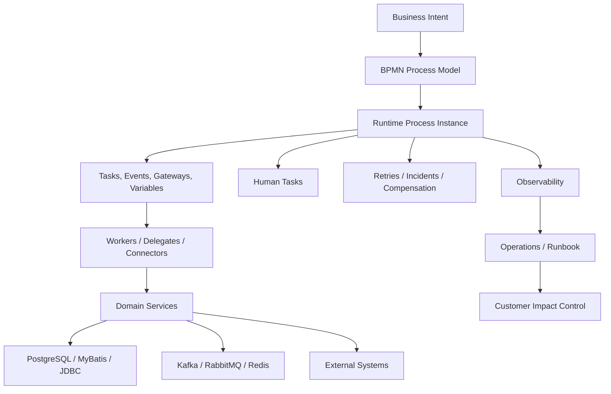
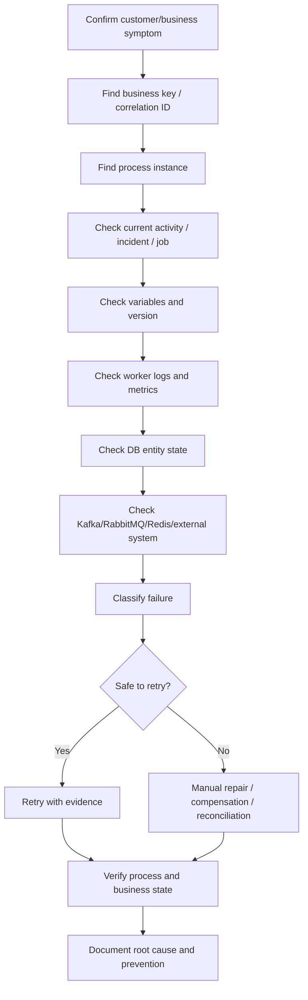

# Part 060 — Final Part: Camunda Mastery Map for Senior Backend Engineer

> Fokus part ini: merangkum seluruh seri menjadi peta penguasaan praktis. Setelah bagian ini, targetnya bukan sekadar "paham Camunda", tetapi mampu masuk ke diskusi architecture, PR review, incident triage, migration planning, dan production readiness workflow system sebagai senior backend engineer.

Camunda mastery bukan hafalan simbol BPMN. Camunda mastery adalah kemampuan membaca proses sebagai kombinasi:

```text
business lifecycle
runtime execution model
distributed system
state machine
human operation
integration contract
failure handling mechanism
observability surface
security boundary
production asset
```

Jika Anda bisa menjelaskan dan men-debug semua layer itu, Anda sudah berpikir seperti workflow engineer senior.

---

## 1. The Complete Mental Model

Workflow system yang sehat memiliki struktur berikut:



Setiap panah adalah contract. Setiap contract bisa gagal. Setiap failure harus punya detection, owner, and repair path.

---

## 2. What Good Looks Like

Workflow system yang mature punya ciri berikut:

```text
BPMN readable by business and precise enough for engineering
Process scope cohesive and versioned
Workers idempotent and observable
Variables minimal and safe
Retry bounded and failure-aware
Incidents owned and actionable
Human tasks assigned, authorized, and SLA-managed
Messages correlated by stable keys
Timers aligned with business meaning
State source of truth explicit
Integration uses outbox/inbox where needed
Security and privacy designed upfront
Deployment controlled through CI/CD or GitOps
Operations runbook tested and known
```

Sebaliknya, workflow system yang immature biasanya punya ciri:

```text
BPMN big but unclear
Variables carry full domain objects
Worker side effects not idempotent
Retry policy is default or infinite
Incident dashboard has no owner
Process state duplicates entity state everywhere
No active-instance review before deployment
Migration treated casually
Observability only added after incidents
```

---

## 3. Mastery Area 1 — BPMN Mental Model

### What you must understand

BPMN adalah tiga hal sekaligus:

```text
Notation: visual language for business process
Execution model: runtime graph of tasks/events/gateways/tokens/jobs
Communication contract: shared artifact between BA/Product/Engineering/Ops
```

### What you must be able to do

```text
Read BPMN as runtime behavior, not only diagram.
Identify wait states, transaction boundaries, async points, human tasks, and external events.
Explain why a process instance is stuck at an activity.
Review gateway correctness.
Distinguish business error, technical failure, escalation, incident, and compensation.
```

### Senior questions

```text
What is the token waiting for?
Is this gateway routing a decision result or hiding business rules?
What event can wake this process up?
What happens if this timer fires after the business entity already changed?
What is the expected terminal state?
```

### Red flags

```text
gateway names are generic
process has many unrelated lifecycles
boundary events exist but are not tested
compensation is drawn but not implemented
message events use mutable correlation keys
```

---

## 4. Mastery Area 2 — Camunda 7 Mental Model

### What you must understand

Camunda 7 is a Java-based BPMN process engine. Its operational model is strongly shaped by:

```text
embedded/shared engine
process application
JavaDelegate/listener execution
external task pattern
job executor
relational database persistence
runtime/history tables
transaction boundaries
Cockpit/Tasklist operations
```

### What you must be able to do

```text
Explain embedded vs shared engine trade-off.
Read service API responsibility: RuntimeService, RepositoryService, TaskService, HistoryService, ManagementService.
Diagnose job executor/backlog/failed job problems.
Explain asyncBefore/asyncAfter as transaction boundary tools.
Review JavaDelegate side effects and exception handling.
Review external task fetch-and-lock behavior.
Understand DB pressure from variables/history/jobs/incidents.
```

### Senior questions

```text
Is this delegate running inside the same transaction as process advancement?
Should this task be asyncBefore/asyncAfter?
Could this JavaDelegate rollback create duplicate external side effect?
Is the job executor healthy?
Is history level compatible with audit and performance?
```

### Red flags

```text
business API queries Camunda internal tables directly
large serialized variables
JavaDelegate makes network call without idempotency
job executor thread pool tuned without workload evidence
history cleanup ignored until DB grows too large
```

---

## 5. Mastery Area 3 — Camunda 8 / Zeebe Mental Model

### What you must understand

Camunda 8/Zeebe is a distributed process orchestration platform. Its mental model is different from embedded Java engine.

Core concepts:

```text
Zeebe broker
Gateway
Partition
Log stream / records
Process instance key
Element instance
Job type
Job worker
Job activation/completion/failure
Operate/Tasklist/Optimize/Identity/Connectors
Exporter and secondary storage
Self-managed vs SaaS deployment
```

### What you must be able to do

```text
Explain why workers are remote and decoupled.
Explain job timeout/retry/incident lifecycle.
Review worker concurrency and max jobs active.
Diagnose worker not receiving jobs.
Read Operate to find process instance state.
Understand partition/backpressure/exporter/search dependency at operations level.
Design workers that survive duplicate execution and rolling deployment.
```

### Senior questions

```text
What job type does this task create?
Which worker owns it?
What is the job timeout and retry policy?
What happens if the worker completes side effect but cannot complete job?
Is secondary storage lag affecting visibility?
Is this connector sufficient, or should it be a custom worker?
```

### Red flags

```text
worker assumes exactly-once execution
job timeout shorter than downstream p99 latency
worker fetches/writes all variables
Operate visibility treated as domain source of truth
search dependency ignored in capacity planning
```

---

## 6. Mastery Area 4 — Workflow vs State Machine Decision

### What you must understand

Workflow is not always the answer. Senior judgment means choosing the smallest model that preserves correctness.

Use workflow engine when you need:

```text
long-running multi-step lifecycle
human task and SLA
explicit orchestration across services
business-visible process state
manual intervention/fallout
message/timer/error/compensation semantics
process audit and operational visibility
```

Use state machine when you need:

```text
entity lifecycle invariants
strict legal transitions
compact state transition logic
domain-owned status model
```

Use queue/scheduler/event choreography when you need:

```text
simple async execution
time-based technical task
loosely coupled event reaction
high-throughput background processing
```

### Senior questions

```text
Is this a business process or entity lifecycle?
Do we need human task/SLA/visibility/manual repair?
Can a simple state machine plus queue solve this?
What is the operational cost of adding workflow engine here?
```

### Red flags

```text
workflow engine used as queue
state machine used for multi-day human process
Kafka choreography hides critical business lifecycle
scheduler owns business SLA without process visibility
```

---

## 7. Mastery Area 5 — BPMN Modelling Checklist

Use this checklist for every process model:

```text
[ ] Process has one clear business purpose.
[ ] Start event trigger is explicit.
[ ] End states are meaningful.
[ ] Service tasks represent clear automation boundaries.
[ ] User tasks have owner, assignment, SLA, and authorization.
[ ] Gateways are named by business question.
[ ] Gateway conditions are simple and testable.
[ ] Message events use stable correlation keys.
[ ] Timer events have business meaning and timezone awareness.
[ ] Error/escalation/incident paths are deliberate.
[ ] Compensation is implemented and tested if modeled.
[ ] Subprocess/call activity boundary is justified.
[ ] Variable mapping is explicit.
[ ] Process versioning impact is understood.
```

Golden rule:

```text
A BPMN model is good when a business stakeholder can understand intent and an engineer can predict runtime behavior.
```

---

## 8. Mastery Area 6 — Worker Design Checklist

A workflow worker is not just a function. It is a distributed side-effect executor.

### Worker contract

```text
input variables required
business operation performed
external dependencies called
DB tables updated
events emitted
output variables produced
failure categories reported
idempotency key used
metrics/logs/traces emitted
```

### Checklist

```text
[ ] Job type/topic is stable and named clearly.
[ ] Worker only fetches required variables.
[ ] Worker validates input variables.
[ ] Worker has deterministic idempotency key.
[ ] Worker uses DB unique constraint or durable dedupe where needed.
[ ] Side effect occurs before job completion.
[ ] Complete failure after side effect is retry-safe.
[ ] Unknown outcome has reconciliation path.
[ ] Failure is classified: retryable, non-retryable, business error, security, data issue.
[ ] Worker has timeout aligned with dependency latency.
[ ] Worker has bounded concurrency.
[ ] Worker supports graceful shutdown.
[ ] Logs include correlation ID, business key, process instance key, job key.
[ ] Metrics exist by job type and failure category.
```

### Senior questions

```text
What makes this worker idempotent?
What happens if it crashes after DB commit?
What happens if job completion fails?
Is retry safe against external dependency?
What is the manual repair path?
```

---

## 9. Mastery Area 7 — Variable Design Checklist

Variables should be treated as API contracts between process and workers.

### Good variable design

```text
small
explicit
schema-aware
version-compatible
non-sensitive by default
reference-oriented
owned by clear producer/consumer
```

### Checklist

```text
[ ] Variable is needed for orchestration, not just convenience.
[ ] Large domain object is replaced with ID/reference.
[ ] Sensitive/PII data is minimized or avoided.
[ ] Variable producer and consumer are known.
[ ] Variable name is stable and documented.
[ ] Variable shape is backward-compatible.
[ ] Input/output mapping is explicit.
[ ] Parallel paths do not overwrite each other.
[ ] Worker does not write unrelated variables.
[ ] Variable retention/history/search impact is understood.
```

### Senior questions

```text
Why is this data in the process engine instead of domain DB?
Can running instances old/new both understand this variable?
Can this variable appear in logs/incidents/task UI/search?
What is the payload size at p95/p99?
```

---

## 10. Mastery Area 8 — Retry, Incident, and Failure Checklist

### Failure taxonomy

```text
Business rejection: expected business path
Validation failure: user/data correction path
Temporary technical failure: retry with backoff
Permanent technical failure: incident/manual repair
Security/authorization failure: stop and investigate
Unknown external outcome: reconcile before retry
```

### Checklist

```text
[ ] Each service task/job has retry policy.
[ ] Retry count and backoff are intentional.
[ ] Retry is safe due to idempotency.
[ ] Retry storm risk is bounded.
[ ] Incident is created for non-recoverable/exhausted failure.
[ ] Incident has owner and alert route.
[ ] Incident message contains useful but non-sensitive detail.
[ ] Manual repair action is documented.
[ ] BPMN error is used for business-handled deviation, not random technical exception.
[ ] Escalation is used for non-critical business escalation where appropriate.
[ ] Compensation is tested if required.
```

### Senior questions

```text
Is this failure expected or exceptional?
Should process handle it or create incident?
Will retry make the situation worse?
Who owns the incident after retry exhaustion?
What evidence does operator need to repair it?
```

---

## 11. Mastery Area 9 — Idempotency Checklist

Idempotency is the difference between safe workflow retry and production damage.

### Checklist

```text
[ ] Every side-effecting worker has idempotency key.
[ ] Key includes business operation identity, not only technical attempt ID.
[ ] Duplicate job execution returns previous result safely.
[ ] External API idempotency is used if available.
[ ] Database writes use unique constraints or compare-and-set transitions.
[ ] Event publishing uses outbox or deterministic event ID.
[ ] Inbox/deduplication exists for consumed events/messages.
[ ] Unknown outcome triggers reconciliation, not blind retry.
```

### Senior questions

```text
Can this worker run twice without changing final business state incorrectly?
What if the first run succeeded but the worker crashed before reporting success?
What if Kafka/RabbitMQ redelivers the message?
What if process migration reactivates a similar step?
```

---

## 12. Mastery Area 10 — Saga and Compensation Checklist

Workflow orchestration is often used for long-running distributed consistency.

### Saga design

```text
Step 1: reserve or create business effect
Step 2: persist operation evidence
Step 3: continue process
Failure: classify
Recovery: retry, compensate, reconcile, or manual repair
```

### Checklist

```text
[ ] Each step has clear business effect.
[ ] Each effect has compensability classification.
[ ] Compensation is semantically valid, not just reverse API call.
[ ] Timeout policy is explicit.
[ ] Late event policy is explicit.
[ ] Manual intervention exists for non-compensable failure.
[ ] Reconciliation can detect partial success.
[ ] Audit trail explains what happened.
[ ] Business owner accepts compensation semantics.
```

### Senior questions

```text
Is this action reversible, compensatable, or final?
What external system is authoritative after partial failure?
What happens if compensation fails?
What customer-visible state should be shown during recovery?
```

---

## 13. Mastery Area 11 — Integration Checklist

### REST/JAX-RS

```text
[ ] Long-running operations return 202 Accepted or explicit async contract.
[ ] Start process is idempotent.
[ ] Complete task validates authorization and stale state.
[ ] Correlate message uses stable key.
[ ] Status endpoint does not leak internal engine details unnecessarily.
```

### PostgreSQL/MyBatis/JDBC

```text
[ ] Business DB remains source of truth for entities.
[ ] Worker transaction boundary is explicit.
[ ] Outbox/inbox used where needed.
[ ] Optimistic locking protects state transition.
[ ] DB migration is compatible with running process versions.
```

### Kafka

```text
[ ] Event key/correlation key stable.
[ ] Duplicate and replay behavior safe.
[ ] Out-of-order events handled.
[ ] Schema evolution considered.
[ ] Event metadata contains trace/correlation identifiers.
```

### RabbitMQ

```text
[ ] Ack/redelivery/DLQ policy clear.
[ ] Retry layering with workflow engine is not conflicting.
[ ] Reply correlation is stable.
[ ] Duplicate message handling exists.
[ ] Routing key design maps to business operation.
```

### Redis

```text
[ ] Redis is not source of truth.
[ ] TTL and eviction behavior are safe.
[ ] Locks are short-lived and correctness-reviewed.
[ ] Cache staleness is visible.
[ ] Outage impact is acceptable.
```

---

## 14. Mastery Area 12 — Security and Privacy Checklist

Workflow systems are dangerous places for sensitive data because process variables, task forms, logs, incidents, and history can all copy data.

### Checklist

```text
[ ] Process/task/variable access control reviewed.
[ ] Tenant isolation reviewed.
[ ] Worker credentials use least privilege.
[ ] Connector secrets are stored in approved secret provider.
[ ] Sensitive variables minimized or avoided.
[ ] PII not dumped into logs/incidents.
[ ] Task forms hide unauthorized fields.
[ ] Audit trail exists for business actions.
[ ] Retention and deletion policy known.
[ ] TLS/mTLS/OIDC/OAuth integration verified where applicable.
```

### Senior questions

```text
Who can see this variable in Operate/Cockpit/Tasklist/logs?
Does this incident message contain PII?
Can a worker access data for the wrong tenant?
Can an operator complete a task they should only view?
```

---

## 15. Mastery Area 13 — Observability Checklist

Workflow observability must answer business and technical questions.

### Business questions

```text
How many quotes/orders are active?
Where are they waiting?
Which task group is aging?
Which SLA is breached?
Which customer-impacting flow is stuck?
```

### Technical questions

```text
Which job type is failing?
What is worker latency and throughput?
Are timers backlogged?
Are messages failing correlation?
Are incidents increasing after release?
Is DB/search/broker dependency healthy?
```

### Checklist

```text
[ ] Dashboard per critical process.
[ ] Metrics per process definition/version.
[ ] Worker metrics per job type.
[ ] Incident count by task/error category.
[ ] Task aging by candidate group.
[ ] SLA breach alert.
[ ] Timer backlog alert.
[ ] Message correlation failure alert.
[ ] Variable payload size trend.
[ ] Correlation ID across API, worker, DB, Kafka/RabbitMQ, process instance.
[ ] Runbook linked from alert.
```

---

## 16. Mastery Area 14 — Performance and Capacity Checklist

### Capacity drivers

```text
process instance volume
job volume per instance
worker throughput
retry rate
timer volume
message correlation volume
variable payload size
history retention
Camunda 7 DB load
Zeebe partition load
exporter/search load
Tasklist/Operate query load
```

### Checklist

```text
[ ] Expected volume and peak volume known.
[ ] Worker concurrency based on dependency capacity.
[ ] Job timeout based on p99 latency plus margin.
[ ] Retry load modeled during downstream outage.
[ ] Variable payload size bounded.
[ ] History/search retention planned.
[ ] Camunda 7 DB indexes/pool/cleanup monitored.
[ ] Camunda 8 partitions/exporters/search monitored.
[ ] Kubernetes resource requests/limits reviewed.
[ ] Load test includes failure paths, not only happy path.
```

### Senior questions

```text
What happens when downstream is slow for one hour?
Can retry traffic exceed normal traffic?
What is the largest variable payload?
What is the bottleneck: engine, DB, broker, search, worker, downstream, or human task?
```

---

## 17. Mastery Area 15 — Production Readiness Checklist

A workflow is not production-ready just because BPMN deploys.

```text
[ ] Business owner confirmed process lifecycle.
[ ] BPMN reviewed for correctness.
[ ] DMN/rules reviewed if used.
[ ] Worker contract documented.
[ ] Variables documented and minimized.
[ ] Retry and incident policy defined.
[ ] Idempotency implemented.
[ ] Human task assignment/SLA defined.
[ ] Message/timer behavior tested.
[ ] Security/privacy reviewed.
[ ] Observability dashboard exists.
[ ] Alerts route to owner.
[ ] Runbook exists.
[ ] Load/capacity assumption documented.
[ ] Deployment/versioning plan exists.
[ ] Rollback/forward recovery plan exists.
[ ] Internal verification items completed.
```

---

## 18. Senior Engineer Operating Model

A senior engineer in workflow systems should operate across five modes.

### Mode 1 — Model reviewer

```text
Read BPMN as execution graph.
Challenge ambiguous gateway and event semantics.
Ask about lifecycle, ownership, and versioning.
```

### Mode 2 — Distributed systems reviewer

```text
Check idempotency, retries, concurrency, timeout, backpressure, and unknown outcome.
Challenge exactly-once assumptions.
```

### Mode 3 — Domain boundary reviewer

```text
Separate workflow orchestration from entity state machine and business rules.
Keep domain invariant in domain layer.
```

### Mode 4 — Production readiness reviewer

```text
Demand metrics, alerts, runbooks, ownership, and manual repair plan before release.
```

### Mode 5 — Incident investigator

```text
Trace process instance, job, variable, worker logs, DB state, event stream, user task, and external system state without corrupting evidence.
```

---

## 19. Architecture Decision Template for Workflow Use

Use this mini-ADR whenever a team proposes new workflow or major process change.

```md
# ADR: Workflow Design for <Process Name>

## Context
- Business process:
- Trigger:
- Expected duration:
- Human tasks:
- External systems:
- Volume:
- SLA:

## Decision
- Use workflow engine? yes/no
- If yes, Camunda 7 or Camunda 8/Zeebe?
- Process definition:
- Worker model:
- Human task model:
- Integration model:

## Alternatives Considered
- State machine:
- Queue worker:
- Scheduler:
- Event choreography:
- Rules/DMN:

## Runtime Contract
- Business key:
- Correlation keys:
- Variables:
- Job types/topics:
- Retry policy:
- Incident owner:

## Consistency and Failure
- Idempotency strategy:
- Outbox/inbox:
- Compensation:
- Reconciliation:
- Manual repair:

## Operations
- Metrics:
- Alerts:
- Dashboard:
- Runbook:
- Deployment/versioning:
- Migration strategy:

## Security
- Sensitive variables:
- Authorization:
- Tenant isolation:
- Audit/retention:

## Consequences
- Benefits:
- Risks:
- Open questions:
- Internal verification checklist:
```

---

## 20. Production Debugging Master Flow

When a workflow issue occurs, use this sequence:



Rules:

```text
Never retry blindly.
Never repair process state without checking business DB state.
Never modify variables without understanding worker contract.
Never assume no incident means no failure.
Never treat UI state as source of truth without freshness metadata.
```

---

## 21. Internal Verification Master Checklist

Use this checklist during onboarding or system audit.

### Platform/version

```text
[ ] Is Camunda used? Which version?
[ ] Camunda 7 embedded/shared/standalone?
[ ] Camunda 8 SaaS/self-managed?
[ ] Zeebe topology known?
[ ] Tooling: Cockpit, Tasklist, Operate, Optimize, Identity?
```

### Artifact inventory

```text
[ ] BPMN files location.
[ ] DMN files location.
[ ] Forms location.
[ ] Connector config location.
[ ] Worker repositories.
[ ] Deployment pipeline.
[ ] GitOps repository.
```

### Runtime inventory

```text
[ ] Critical process definitions.
[ ] Active process counts.
[ ] Process versions in use.
[ ] Job types/topics.
[ ] Worker ownership.
[ ] User task groups.
[ ] Message names/correlation keys.
[ ] Timer/SLA definitions.
```

### Data/consistency

```text
[ ] Business key convention.
[ ] Process variable design.
[ ] Source of truth for quote/order state.
[ ] Outbox/inbox tables.
[ ] Processed job/idempotency tables.
[ ] Reconciliation jobs/processes.
```

### Operations

```text
[ ] Incident dashboard.
[ ] Worker dashboard.
[ ] SLA/task aging dashboard.
[ ] Timer backlog dashboard.
[ ] Alert routes.
[ ] Runbooks.
[ ] Manual repair permissions.
```

### Security/compliance

```text
[ ] Process/task authorization.
[ ] Tenant isolation.
[ ] Sensitive variables.
[ ] Secret management.
[ ] Audit trail.
[ ] Retention/history cleanup.
[ ] Log redaction.
```

### Deployment/change

```text
[ ] Versioning strategy.
[ ] Worker compatibility strategy.
[ ] Active-instance review before deployment.
[ ] Migration policy.
[ ] Rollback/forward recovery strategy.
[ ] Release approval process.
```

---

## 22. 30/60/90-Day Learning Plan in a Real Enterprise Team

### First 30 days — Map the system

```text
Find BPMN/DMN artifacts.
Identify Camunda version and deployment model.
List critical process definitions.
Trace one happy path end-to-end.
Trace one failure path end-to-end.
Identify worker repositories and owners.
Find dashboards and runbooks.
```

Deliverable:

```text
Workflow system map: process → worker → DB/event/API → dashboard/runbook.
```

### Days 31–60 — Review correctness

```text
Review variable design.
Review idempotency of critical workers.
Review retry and incident policy.
Review message correlation keys.
Review human task SLA.
Review deployment/versioning strategy.
```

Deliverable:

```text
Risk register with top workflow correctness and operations gaps.
```

### Days 61–90 — Improve production posture

```text
Add or improve metrics/alerts.
Strengthen worker idempotency.
Reduce variable payload.
Document runbooks.
Improve PR checklist.
Propose ADR for major workflow boundaries.
Mentor team on workflow failure modes.
```

Deliverable:

```text
Production readiness improvement plan for workflow systems.
```

---

## 23. Senior-Level PR Review Questions

Use these questions repeatedly.

### BPMN

```text
What lifecycle does this process own?
What is the start trigger?
What are terminal states?
What can block progress?
What happens on timeout/error/escalation?
```

### Worker

```text
What is the side effect?
What is idempotency key?
What happens after crash?
What happens after duplicate activation?
How is failure classified?
```

### Data

```text
Which data is process variable vs domain DB?
What is source of truth?
Can old process versions read new data shape?
Does this variable contain sensitive data?
```

### Integration

```text
What correlation key is used?
Can message be duplicate, late, or out-of-order?
Is event replay safe?
Is external API idempotent?
```

### Operations

```text
What dashboard shows this flow health?
What alert fires when stuck?
Who owns incident?
What runbook repairs it?
What is customer impact if it fails?
```

---

## 24. Common Weak Assumptions to Challenge

```text
"The worker will only run once."
No. Assume duplicate execution.

"The API call either succeeds or fails."
No. Unknown outcome exists.

"The process diagram is the source of truth for order state."
Not necessarily. Domain state may own legality.

"Retry will fix temporary problems."
Only if retry is bounded, idempotent, and downstream-safe.

"No incident means no problem."
Process can be waiting forever without incident.

"Migration can fix deployment mistakes."
Migration can create worse state if not planned.

"Variables are convenient shared memory."
They are persistent runtime contracts with security and versioning impact.

"Human task means someone will handle it."
Only if assignment, visibility, SLA, and ownership are clear.
```

---

## 25. Self-Assessment Rubric

### Foundation

You can:

```text
explain workflow vs state machine
read basic BPMN
understand process instance vs process definition
identify service task/user task/gateway/event
```

### Intermediate

You can:

```text
review BPMN for readability and correctness
explain Camunda 7 vs Camunda 8 difference
build basic worker/delegate
handle variables and message correlation
```

### Advanced

You can:

```text
design idempotent workers
classify failure and retry policy
integrate with PostgreSQL/Kafka/RabbitMQ/Redis
review human task SLA and authorization
write workflow tests
```

### Production/Architecture-level

You can:

```text
plan process versioning and migration
debug production incidents safely
model capacity and observability
review Kubernetes/cloud/on-prem deployment impact
design runbooks and manual repair paths
```

### Principal-level

You can:

```text
decide when workflow engine should or should not be used
split process/domain/rules/state boundaries cleanly
lead migration strategy
challenge weak process design
mentor engineers in workflow failure thinking
align business, engineering, and operations around process ownership
```

---

## 26. How to Keep Learning Camunda in Production

The fastest learning path is not reading every feature. It is repeatedly tracing real processes.

For each important process, answer:

```text
Why does this process exist?
What business lifecycle does it own?
What starts it?
What can pause it?
What wakes it?
What variables does it carry?
What workers does it call?
What state does it update?
What events does it publish/consume?
What failures are expected?
What failures create incidents?
Who owns manual repair?
How is customer impact detected?
How is the process changed safely?
```

Keep a personal workflow notebook:

```text
Process name
Business owner
Technical owner
BPMN file
DMN file
Worker mapping
API endpoints
DB tables
Kafka/RabbitMQ topics/queues
Redis usage
Dashboards
Alerts
Runbooks
Known incidents
Open risks
```

---

## 27. Final Mastery Summary

Camunda is useful because it makes long-running business processes explicit. But explicit does not automatically mean correct.

Correctness comes from disciplined boundaries:

```text
BPMN owns process orchestration.
Domain model owns business invariants.
DMN/rules service owns business decisions where appropriate.
Workers own technical side effects.
Database owns durable business state.
Queues/events own asynchronous communication.
Observability owns detection.
Runbooks own recovery.
Security owns safe access.
Versioning owns safe change.
```

The senior engineer mindset is:

```text
Can I explain the lifecycle?
Can I predict failure behavior?
Can I prove retry is safe?
Can I find the source of truth?
Can I detect stuck work?
Can I repair without corrupting state?
Can I deploy change without breaking running instances?
Can I prevent this workflow from becoming a production incident?
```

If yes, you are not just using Camunda. You are engineering workflow systems.

---

## 28. Final Internal Verification Checklist

Before considering this series complete in your actual work context, verify:

```text
[ ] Which Camunda version/deployment model is actually used internally.
[ ] Where BPMN/DMN/form/connector artifacts live.
[ ] Which processes are business-critical.
[ ] Which workers/delegates implement each service task.
[ ] How user tasks are assigned and authorized.
[ ] How process variables are designed and retained.
[ ] Which business key/correlation key conventions are used.
[ ] How retries and incidents are configured.
[ ] How idempotency is implemented.
[ ] How process state maps to quote/order/entity state.
[ ] How PostgreSQL/MyBatis transactions interact with workers.
[ ] How Kafka/RabbitMQ/Redis are used around workflows.
[ ] How Kubernetes/cloud/on-prem deployment is operated.
[ ] Which dashboards and alerts exist.
[ ] Which runbooks exist and who owns them.
[ ] How process deployment/versioning/migration is governed.
[ ] Which anti-patterns currently exist and need refactoring.
```

This final checklist is intentionally practical. The real mastery happens when every item has an answer grounded in actual codebase, deployed process, dashboard, and incident history.

---

## 29. Closing Principle

The best workflow systems are not the ones with the most BPMN elements. They are the ones where business process, engineering implementation, and production operations agree on the same lifecycle.

That agreement is the real value of Camunda.
