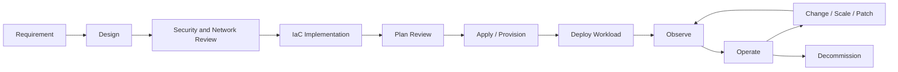
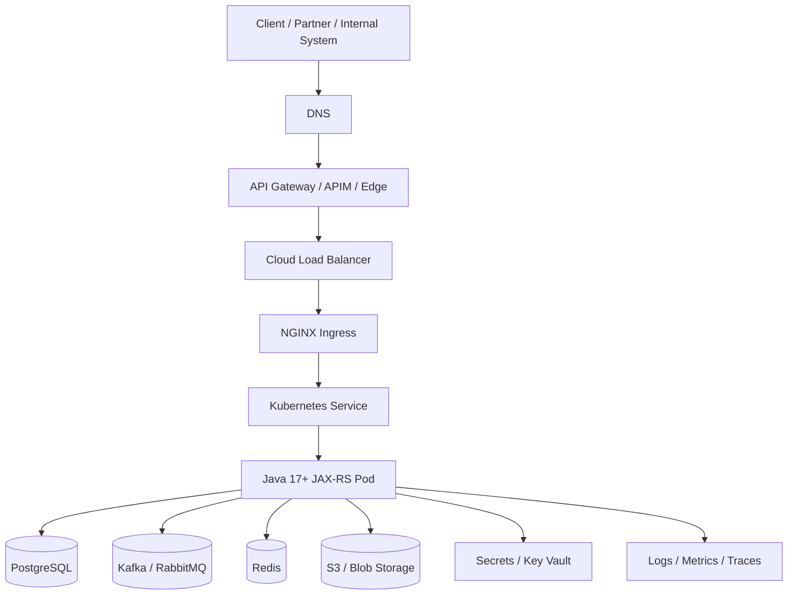

# Part 001 — Cloud Platform Foundation for Backend Engineers

> Fokus part ini bukan “cara klik AWS Console atau Azure Portal”. Fokusnya adalah membangun mental model cloud sebagai platform production untuk backend system: compute, network, identity, storage, observability, security, cost, dan operational ownership.

Senior backend engineer tidak perlu menjadi cloud administrator penuh sejak hari pertama. Tetapi senior backend engineer harus mampu membaca dampak cloud terhadap correctness, latency, security, deployment, rollback, incident response, dan cost. Untuk sistem seperti CPQ, quote management, order management, quote-to-cash, telco BSS/OSS, dan enterprise integration, cloud bukan sekadar tempat menjalankan container. Cloud adalah bagian dari runtime contract aplikasi.

---

## 1. Core mental model

Cloud platform adalah kumpulan control plane dan data plane yang menyediakan resource komputasi, jaringan, identity, storage, observability, security, dan managed services melalui API.

Cara berpikir yang paling berguna:

```text
Application code
  ↓
Runtime platform
  ↓
Kubernetes / VM / managed compute
  ↓
Cloud networking + identity + storage + observability
  ↓
Cloud provider physical infrastructure
```

Untuk backend engineer, setiap request production melewati beberapa boundary:

```text
Client
  → DNS
  → edge / gateway / load balancer
  → ingress
  → Kubernetes service
  → pod
  → Java/JAX-RS resource method
  → database / broker / cache / object storage / external service
```

Cloud memengaruhi semua boundary tersebut.

Kesalahan umum engineer yang baru masuk cloud adalah menganggap cloud sebagai “server orang lain”. Itu terlalu sempit. Cloud lebih tepat dipahami sebagai programmable infrastructure dengan policy, quota, identity, routing, billing, telemetry, dan failure mode sendiri.

---

## 2. Kenapa cloud platform ada?

Cloud muncul untuk menyelesaikan beberapa masalah enterprise infrastructure:

| Masalah tradisional | Pendekatan cloud |
|---|---|
| Provisioning server lama | Resource dibuat via API/IaC |
| Capacity planning kaku | Scale up/down lebih cepat |
| Hardware lifecycle manual | Provider mengelola physical layer |
| Banyak undifferentiated heavy lifting | Managed service mengurangi operational burden |
| Environment sulit distandardisasi | Landing zone, account/subscription, policy, template |
| Audit dan governance tersebar | Centralized identity, logs, policy, billing |
| DR mahal dan manual | Region/AZ, backup, replication, infrastructure automation |

Tetapi cloud tidak otomatis membuat sistem reliable. Cloud hanya memberi primitives. Reliability tetap bergantung pada desain workload, konfigurasi platform, dan discipline operasional.

---

## 3. Infrastructure as a Service, Platform as a Service, Managed Service, Serverless

### 3.1 Infrastructure as a Service

IaaS memberi resource dasar seperti VM, disk, network, firewall, dan load balancer.

Contoh:

- AWS EC2
- Azure Virtual Machines
- AWS VPC
- Azure VNet
- AWS EBS
- Azure Managed Disk

Backend impact:

- Tim masih bertanggung jawab besar atas OS, patching, runtime, scaling, monitoring, hardening, dan deployment.
- Cocok untuk workload legacy, custom runtime, atau deployment yang membutuhkan kontrol rendah-level.
- Operational burden tinggi dibanding managed Kubernetes atau PaaS.

Failure mode umum:

- VM kehabisan disk.
- Patch OS tertunda.
- Security baseline drift.
- Instance ditempatkan di AZ tunggal.
- Network rule terlalu longgar atau terlalu sempit.

### 3.2 Platform as a Service

PaaS memberi runtime/platform lebih tinggi. Banyak detail OS dan middleware dikelola provider.

Contoh:

- Azure App Service
- AWS Elastic Beanstalk awareness
- Managed database seperti RDS/Azure Database for PostgreSQL dapat dianggap managed platform untuk database workload.

Backend impact:

- Deployment lebih cepat.
- Kontrol infrastructure lebih terbatas.
- Debugging perlu memahami platform abstraction.
- Cocok untuk service yang tidak membutuhkan kontrol Kubernetes mendalam.

Failure mode umum:

- Timeout platform default tidak cocok.
- Scaling rule salah.
- Connection limit ke database tercapai.
- Log/metric tidak lengkap karena runtime abstraction.

### 3.3 Managed service

Managed service adalah layanan yang sebagian besar operation-nya dikelola cloud provider, tetapi konfigurasi, akses, data, capacity choice, dan integrasi tetap tanggung jawab customer/team.

Contoh:

- Amazon RDS for PostgreSQL
- Azure Database for PostgreSQL Flexible Server
- Amazon MSK
- Amazon MQ
- Amazon ElastiCache
- Azure Cache for Redis
- AWS Secrets Manager
- Azure Key Vault
- Amazon S3
- Azure Blob Storage

Backend impact:

- Aplikasi harus memahami endpoint, auth, TLS, timeout, retry, throttling, quota, private connectivity, dan observability.
- Managed bukan berarti “tidak perlu dioperasikan”. Managed berarti sebagian operasi berpindah ke provider, tetapi failure handling tetap harus ada di workload.

Failure mode umum:

- Service throttling.
- Credential expired.
- Private endpoint DNS salah.
- Maintenance window berdampak ke aplikasi.
- Quota tercapai.
- Region outage.
- Misconfigured IAM/RBAC.

### 3.4 Serverless service

Serverless menghilangkan sebagian besar manajemen server, tetapi menambahkan runtime constraints.

Contoh:

- AWS Lambda
- Azure Functions
- Event-driven managed service

Backend impact:

- Cocok untuk event handler, async job, lightweight integration, scheduled task.
- Tidak selalu cocok untuk long-running enterprise transaction atau low-latency synchronous API dengan kompleksitas tinggi.
- Perlu memahami cold start, timeout maksimum, concurrency, retry semantics, idempotency, dan event duplication.

Failure mode umum:

- Retry event menyebabkan duplicate side effect.
- Cold start menambah latency.
- Timeout function tidak sinkron dengan timeout caller.
- Secret/config retrieval memperlambat invocation.
- Observability terfragmentasi.

---

## 4. Control plane vs data plane

Ini salah satu konsep paling penting.

### 4.1 Control plane

Control plane adalah API dan mekanisme untuk membuat, mengubah, menghapus, mengonfigurasi, dan mengamati resource.

Contoh:

- Create VPC/VNet
- Create EKS/AKS cluster
- Update IAM role/RBAC assignment
- Create load balancer
- Create private endpoint
- Change route table
- Deploy managed PostgreSQL
- Rotate secret
- Push config

Control plane biasanya dipakai oleh:

- Terraform/IaC
- cloud console
- CLI
- CI/CD pipeline
- GitOps controller
- platform automation
- admin/operator

### 4.2 Data plane

Data plane adalah jalur traffic runtime yang digunakan aplikasi ketika memproses request.

Contoh:

- HTTP request client ke API
- pod Java call PostgreSQL
- pod publish Kafka event
- service upload object ke S3/Blob
- application fetch secret/config
- NGINX ingress forward request ke pod
- Redis GET/SET

### 4.3 Kenapa perbedaan ini penting?

Karena control plane failure dan data plane failure punya dampak berbeda.

Contoh:

| Skenario | Control plane | Data plane | Dampak |
|---|---:|---:|---|
| Tidak bisa create new pod karena cloud API issue | Bermasalah | Existing traffic mungkin tetap jalan | Deployment/scaling terganggu |
| Route table salah | Berubah via control plane | Runtime traffic gagal | Outage aplikasi |
| IAM role policy diubah | Berubah via control plane | SDK call AccessDenied | Feature tertentu gagal |
| Region control plane degraded | Bermasalah | Existing DB connection mungkin tetap hidup | Operasi perubahan terbatas |
| DNS private endpoint salah | Config/control berubah | Runtime call salah tujuan | Timeout/TLS/access error |

Senior engineer harus selalu bertanya:

```text
Apakah ini masalah control plane, data plane, atau crossing di antara keduanya?
```

Dalam incident, pertanyaan ini mengurangi noise. Jika data plane masih jalan, jangan membuat perubahan control plane agresif yang bisa memperburuk keadaan.

---

## 5. Region, Availability Zone, fault domain

### 5.1 Region

Region adalah area geografis cloud tempat resource dijalankan. Region dipilih karena beberapa alasan:

- latency ke user atau sistem downstream
- data residency
- compliance
- service availability
- cost
- DR strategy
- operational ownership

Backend impact:

- Service di region berbeda menambah latency.
- Cross-region traffic bisa mahal.
- Data replication cross-region menambah consistency complexity.
- Endpoint SDK biasanya region-specific.
- DR tidak otomatis hanya karena service berada di cloud.

### 5.2 Availability Zone

Availability Zone adalah fault-isolated location di dalam region. Tujuannya untuk mengurangi risiko satu failure domain menjatuhkan seluruh workload.

Backend impact:

- Multi-AZ database lebih resilient dibanding single-AZ.
- Kubernetes node harus tersebar lintas AZ untuk high availability.
- Load balancer dan target harus sehat lintas AZ.
- Cross-AZ traffic dapat berdampak pada latency dan cost.
- Stateful workload harus memahami replication dan failover.

### 5.3 Fault domain

Fault domain adalah boundary kegagalan yang mungkin gagal bersama.

Contoh fault domain:

- satu pod
- satu node
- satu node pool/node group
- satu subnet
- satu AZ
- satu region
- satu account/subscription
- satu identity provider path
- satu DNS zone
- satu managed database cluster
- satu Kafka broker set
- satu NAT gateway
- satu CI/CD pipeline

Kesalahan desain umum adalah hanya memikirkan compute redundancy, tetapi melupakan dependency tunggal seperti NAT Gateway, DNS resolver, private endpoint, secret manager, registry, atau identity provider.

---

## 6. Account/subscription boundary

### 6.1 AWS account

Di AWS, account adalah boundary penting untuk resource, billing, identity, service quota, dan blast radius. Banyak enterprise menggunakan beberapa AWS account untuk memisahkan environment, workload, shared services, network, security, logging, dan sandbox.

### 6.2 Azure subscription

Di Azure, subscription adalah boundary penting untuk billing, resource placement, quota, dan access scope. Azure juga menggunakan management group untuk governance di atas subscription dan resource group untuk mengelompokkan resource dalam subscription.

### 6.3 Backend impact

Untuk Java/JAX-RS service, account/subscription boundary berdampak ke:

- endpoint yang dipakai
- credential yang diberikan
- role/RBAC scope
- network reachability
- private DNS binding
- logging destination
- cost allocation
- deployment pipeline
- quota
- incident escalation

Pertanyaan review:

```text
Service ini berjalan di account/subscription mana?
Dependency-nya berada di boundary yang sama atau berbeda?
Jika berbeda, bagaimana trust, network route, DNS, dan audit-nya bekerja?
```

---

## 7. Resource ownership

Cloud resource harus punya ownership yang jelas. Tanpa ownership, incident akan tersendat di area abu-abu.

Ownership minimal:

| Resource | Owner yang perlu jelas |
|---|---|
| VPC/VNet | platform/network team |
| Subnet | platform/network team |
| Route table/UDR | platform/network team |
| Firewall | network/security team |
| EKS/AKS cluster | platform/SRE team |
| Namespace | platform + application team |
| ServiceAccount/workload identity | platform + application team |
| IAM role/RBAC assignment | security/platform/application team |
| Secret | application owner + security/platform |
| PostgreSQL | database/platform/application owner |
| Kafka/RabbitMQ | messaging/platform/application owner |
| Redis | platform/application owner |
| Load balancer/ingress | platform + application owner |
| Observability dashboard | SRE + application owner |
| CI/CD pipeline | DevOps/platform/application owner |
| Terraform module | platform/IaC owner |

Rule of thumb:

```text
Every production resource must have an owner, lifecycle, source of truth, and rollback path.
```

---

## 8. Shared responsibility model

Cloud provider dan customer berbagi tanggung jawab. Provider mengelola sebagian layer infrastructure; customer tetap bertanggung jawab terhadap konfigurasi, data, identity, workload, access, dan banyak aspek security/operations.

Prinsip praktis:

```text
Provider secures the cloud.
You secure what you put in the cloud.
```

Tetapi dalam enterprise, “you” bukan satu orang. “You” adalah gabungan:

- platform team
- SRE/DevOps
- security team
- network team
- database/messaging team
- backend application team
- compliance/risk team

### 8.1 Contoh pembagian tanggung jawab

| Area | Provider | Customer/team |
|---|---|---|
| Physical datacenter | Mengelola | Memilih region/AZ sesuai requirement |
| Hypervisor/managed control plane | Mengelola | Mengonfigurasi service dengan benar |
| Network primitives | Menyediakan | Mendesain CIDR, routing, firewall, endpoint |
| IAM/RBAC system | Menyediakan | Menulis least privilege policy |
| Managed database engine | Mengelola sebagian | Schema, connection, backup config, capacity, access |
| Object storage service | Menyediakan | Bucket/container policy, encryption, lifecycle, data classification |
| Kubernetes managed control plane | Mengelola sebagian | Workload, namespace, network policy, ingress, autoscaling |
| Observability platform | Menyediakan | Instrumentation, dashboards, alerts, retention |
| Secrets service | Menyediakan | Secret lifecycle, rotation, access, caching, reload |

### 8.2 Jebakan umum

Jangan menyimpulkan:

```text
Managed service = provider bertanggung jawab penuh.
```

Yang benar:

```text
Managed service = provider mengambil sebagian operational burden, tetapi customer tetap bertanggung jawab terhadap konfigurasi, akses, data, lifecycle, usage pattern, observability, dan failure handling.
```

Contoh:

- RDS/Azure PostgreSQL managed, tetapi connection pool salah tetap bisa menjatuhkan aplikasi.
- S3/Blob managed, tetapi bucket/container public policy tetap bisa menjadi data leakage.
- EKS/AKS managed, tetapi pod resource limit salah tetap bisa menyebabkan node pressure.
- Secrets Manager/Key Vault managed, tetapi secret cache/reload salah tetap bisa menyebabkan outage saat rotation.

---

## 9. Cloud vs on-prem

Cloud dan on-prem berbeda bukan hanya lokasi server. Perbedaannya ada pada operating model.

| Dimension | On-prem | Cloud |
|---|---|---|
| Provisioning | Ticket/manual/capacity planned | API/IaC-driven |
| Network | Biasanya relatif statis | Programmable, policy-heavy |
| Identity | AD/internal IAM dominan | Cloud IAM/RBAC + federation |
| Scaling | Hardware-bound | Quota/cost/policy-bound |
| Cost | CapEx + allocated infra | Usage-based + hidden transfer/logging cost |
| Observability | Tooling internal | Cloud-native + external tooling |
| Failure model | Datacenter/device oriented | Region/AZ/service quota/control plane/data plane oriented |
| Governance | Change board/manual | Policy-as-code + audit logs |
| Deployment | Often slower | Fast but easier to misconfigure at scale |

Cloud memberi kecepatan, tetapi juga membuat kesalahan lebih cepat menyebar jika guardrail lemah.

---

## 10. Cloud in enterprise Java/JAX-RS systems

Untuk Java/JAX-RS service, cloud berdampak di beberapa layer.

### 10.1 Runtime configuration

Aplikasi tidak lagi hanya membaca `application.properties`. Ia bisa mengambil konfigurasi dari:

- environment variable
- Kubernetes ConfigMap
- AWS Systems Manager Parameter Store
- AWS AppConfig
- Azure App Configuration
- mounted volume
- GitOps-rendered manifest

Failure mode:

- config environment salah
- stale config cache
- config tidak sinkron antar pod
- config service unreachable
- fallback default tidak aman

### 10.2 Secret retrieval

Secret bisa berasal dari:

- Kubernetes Secret
- AWS Secrets Manager
- SSM SecureString
- Azure Key Vault
- External Secrets Operator
- CSI driver

Failure mode:

- identity tidak punya akses
- secret version salah
- rotation tidak diikuti reload
- secret ter-log
- secret cache expired bersamaan

### 10.3 Cloud SDK calls

Aplikasi Java mungkin memakai AWS SDK atau Azure SDK untuk:

- object storage
- secret/config
- queue/event
- signing URL
- identity/token
- monitoring/custom metrics

Failure mode:

- credential provider chain salah
- region/endpoint salah
- private endpoint DNS salah
- retry terlalu agresif
- timeout terlalu panjang
- pagination tidak lengkap
- throttling tidak ditangani

### 10.4 Database and messaging

Cloud mengubah cara aplikasi mencapai PostgreSQL, Kafka, RabbitMQ, Redis, dan Camunda dependency.

Yang harus dipikirkan:

- private endpoint atau public endpoint?
- TLS required?
- DNS name stable?
- failover mengubah endpoint?
- connection pool cukup adaptif?
- cross-AZ/cross-region latency?
- broker upgrade window?
- backup/restore test?
- event duplication/idempotency?

### 10.5 Kubernetes runtime

Dalam EKS/AKS, Java service dipengaruhi oleh:

- pod resource request/limit
- JVM memory sizing
- liveness/readiness/startup probe
- ServiceAccount/workload identity
- DNS/CoreDNS
- NetworkPolicy
- ingress/load balancer
- HPA/KEDA/autoscaling
- node pool/node group
- pod disruption budget
- rollout strategy

Cloud bukan layer setelah aplikasi. Cloud adalah bagian dari runtime aplikasi.

---

## 11. Generic cloud lifecycle

Cloud resource biasanya melewati lifecycle berikut:



Untuk setiap lifecycle, backend engineer perlu bertanya:

| Stage | Pertanyaan senior engineer |
|---|---|
| Requirement | Apa production concern yang sebenarnya? Latency, security, DR, cost, compliance? |
| Design | Boundary mana yang berubah: network, identity, data, runtime, ownership? |
| Security review | Apakah least privilege, private connectivity, encryption, audit sudah jelas? |
| IaC | Apakah resource dibuat declarative dan repeatable? |
| Plan review | Apa yang akan berubah? Apa blast radius? |
| Provision | Apakah resource punya tags, owner, logging, policy? |
| Deploy | Apakah aplikasi punya config, secret, timeout, retry, probe, rollback? |
| Observe | Apakah logs/metrics/traces menjawab pertanyaan incident? |
| Operate | Bagaimana backup, scaling, rotation, certificate, quota, patching? |
| Decommission | Apakah data, DNS, secret, IAM, cost, dan dependencies dibersihkan? |

---

## 12. Failure-oriented cloud model

Senior engineer perlu melihat cloud sebagai kumpulan failure domain.

### 12.1 Failure categories

| Category | Contoh symptom |
|---|---|
| DNS | pod resolve endpoint ke IP salah, NXDOMAIN, stale record |
| Network route | timeout, unreachable, asymmetric route |
| Firewall/SG/NSG | connection refused/timeout dari subnet tertentu |
| Identity | AccessDenied, AuthorizationFailed, token expired |
| Secret/config | startup gagal, runtime config salah, rotation break |
| SDK | retry storm, timeout panjang, throttling, pagination bug |
| Load balancer | 502/503/504, unhealthy target |
| Kubernetes | CrashLoopBackOff, OOMKilled, readiness failed |
| Managed database | connection exhausted, failover, maintenance impact |
| Broker/cache | lag, backpressure, eviction, failover |
| Quota | cannot scale, cannot create ENI/IP/LB/endpoint |
| Observability | missing logs, no correlation ID, dashboard misleading |
| Cost | NAT/logging/cross-AZ spike |

### 12.2 Debugging principle

Gunakan alur dari dekat ke jauh:

```text
Application symptom
  → pod health
  → application logs
  → SDK/client error
  → DNS resolution
  → network path
  → identity permission
  → target service health
  → quota/throttle
  → recent changes
```

Jangan langsung mengubah IAM, route table, atau firewall tanpa bukti. Cloud incident sering memburuk karena “trial-and-error config changes”.

---

## 13. Production architecture lens

Saat membaca cloud architecture, gunakan lens berikut.

### 13.1 Correctness lens

- Apakah request bisa diproses idempotent?
- Apakah retry cloud SDK bisa menyebabkan duplicate write?
- Apakah event broker bisa mengirim duplicate message?
- Apakah object upload partial ditangani?
- Apakah config change bisa menghasilkan behavior berbeda antar pod?

### 13.2 Networking lens

- Dari mana traffic masuk?
- Di mana DNS resolve?
- Apakah jalur public atau private?
- Subnet mana yang dilewati?
- Route table mana yang berlaku?
- Firewall/SG/NSG mana yang memfilter?
- Apakah ada NAT/proxy/TLS inspection?

### 13.3 Identity/security lens

- Principal apa yang dipakai service?
- Scope permission-nya apa?
- Apakah static secret atau workload identity?
- Apakah policy least privilege?
- Apakah data terenkripsi?
- Apakah audit log cukup?

### 13.4 Performance lens

- Apa latency budget end-to-end?
- Timeout setiap layer berapa?
- Retry policy bisa memperburuk overload?
- Connection pool cocok dengan database/broker limit?
- Cross-AZ/cross-region call terjadi?
- SDK sync/async memengaruhi thread pool?

### 13.5 Cost lens

- Apakah traffic keluar lewat NAT Gateway?
- Apakah logs terlalu verbose?
- Apakah metrics/traces high-cardinality?
- Apakah resource idle?
- Apakah cross-AZ/cross-region traffic perlu?
- Apakah managed service overprovisioned?

### 13.6 Observability lens

- Apakah ada correlation ID?
- Apakah logs punya environment, service, version, request ID?
- Apakah metric punya label yang cukup tetapi tidak high-cardinality?
- Apakah trace melewati HTTP, broker, SDK, DB?
- Apakah dashboard menjawab “siapa terdampak, sejak kapan, dependency mana?”

---

## 14. Example: Java/JAX-RS service on managed Kubernetes



Hal yang perlu dipahami backend engineer:

- DNS dan gateway memengaruhi route request sebelum aplikasi menerima request.
- Load balancer health check harus cocok dengan readiness endpoint.
- Ingress timeout harus sinkron dengan application timeout.
- Kubernetes Service hanya mengirim ke pod yang dianggap ready.
- JVM memory harus cocok dengan container limit.
- Database pool harus cocok dengan database max connection.
- Broker retry harus idempotent.
- Object storage SDK harus punya timeout/retry/pagination yang benar.
- Secret/config retrieval harus punya cache dan failure strategy.
- Logs/metrics/traces harus membawa correlation ID.

---

## 15. Design invariants untuk backend engineer

Gunakan invariants ini saat mereview cloud-backed service.

### 15.1 Runtime identity invariant

```text
Setiap workload production harus punya identity eksplisit, least privilege, auditable, dan tidak bergantung pada long-lived static credential jika workload identity tersedia.
```

### 15.2 Private connectivity invariant

```text
Dependency internal atau sensitif harus punya jalur private yang dapat dibuktikan melalui DNS, route, firewall, endpoint, dan flow logs.
```

### 15.3 Timeout invariant

```text
Timeout harus semakin pendek saat mendekati caller, dan total retry tidak boleh melebihi latency budget request.
```

### 15.4 Observability invariant

```text
Setiap dependency call penting harus dapat dikorelasikan dari request masuk sampai downstream call melalui logs, metrics, dan/atau traces.
```

### 15.5 Ownership invariant

```text
Setiap cloud resource production harus memiliki owner, purpose, environment, source of truth, rollback path, dan decommission plan.
```

### 15.6 Cost invariant

```text
Setiap desain yang menambah network hop, NAT, cross-AZ, cross-region, logging volume, atau managed capacity harus punya cost reasoning.
```

---

## 16. Anti-patterns

### 16.1 “It works from my laptop” cloud integration

Local credential dan public endpoint sering berbeda dari runtime production yang memakai workload identity dan private endpoint.

Yang harus dicek:

- credential chain local vs pod
- region/endpoint
- DNS private endpoint
- proxy/NO_PROXY
- timeout/retry
- permission scope

### 16.2 Static cloud credential di secret

Static access key/client secret meningkatkan risiko leakage dan rotation failure.

Alternatif lebih baik:

- AWS IRSA untuk EKS
- Azure Workload Identity untuk AKS
- managed identity jika sesuai
- CI/CD OIDC federation untuk deployment

### 16.3 Public endpoint karena private endpoint sulit

Public endpoint kadang lebih cepat untuk development, tetapi berisiko di production.

Yang harus dipertanyakan:

- apakah data sensitif lewat internet path?
- apakah firewall allowlist cukup?
- apakah DNS mengarah ke private IP?
- apakah audit membuktikan private path?

### 16.4 Retry tanpa budget

Retry yang tidak dibatasi dapat memperburuk outage.

Check:

- max attempts
- backoff
- jitter
- total timeout
- circuit breaker
- idempotency
- metrics untuk retry count

### 16.5 Cloud resource manual tanpa IaC

Manual change membuat drift dan memperlambat RCA.

Check:

- apakah resource ada di Terraform/Bicep/CloudFormation/ARM?
- apakah ada plan review?
- apakah ada owner?
- apakah change terekam?

---

## 17. Internal verification checklist

Gunakan checklist ini untuk mulai memahami cloud usage internal tanpa mengarang detail.

### 17.1 Cloud usage

- Cloud provider apa yang dipakai untuk workload terkait: AWS, Azure, atau keduanya?
- Apakah deployment utama cloud, on-prem, atau hybrid?
- Environment apa saja yang tersedia: dev, test, staging, perf, prod, sandbox?
- Apakah setiap environment dipisahkan secara account/subscription atau hanya namespace/resource group?
- Region mana yang digunakan?
- Apakah ada multi-AZ atau zone-redundant requirement?

### 17.2 Ownership

- Siapa owner VPC/VNet?
- Siapa owner EKS/AKS cluster?
- Siapa owner namespace aplikasi?
- Siapa owner IAM/RBAC policy?
- Siapa owner secret/config?
- Siapa owner PostgreSQL/Kafka/RabbitMQ/Redis/Camunda?
- Siapa owner observability dashboard?
- Siapa owner CI/CD dan GitOps?

### 17.3 Architecture documents

- Apakah ada cloud landing zone diagram?
- Apakah ada network diagram?
- Apakah ada service dependency map?
- Apakah ada ingress/egress flow diagram?
- Apakah ada DR architecture?
- Apakah ada runbook incident?
- Apakah ada PR/ADR template untuk cloud changes?

### 17.4 Runtime platform

- Apakah aplikasi berjalan di EKS, AKS, VM, atau platform lain?
- Apakah cluster endpoint public atau private?
- Apa ingress controller yang digunakan?
- Apakah service memakai NGINX, cloud load balancer, API gateway, atau APIM?
- Bagaimana image ditarik dari registry?
- Bagaimana secret/config disuntikkan?

### 17.5 Security and compliance

- Bagaimana least privilege diterapkan?
- Apakah workload memakai static secret atau workload identity?
- Apakah private endpoint digunakan untuk database/storage/registry/secret?
- Apakah encryption at rest dan in transit diwajibkan?
- Di mana audit log disimpan?
- Apakah PII boleh muncul di log?
- Apakah ada compliance evidence repository?

### 17.6 Observability and operations

- Di mana application logs berada?
- Di mana platform logs berada?
- Apakah trace/correlation ID standar?
- Dashboard apa yang wajib dicek saat incident?
- Alert apa yang owner-nya backend team?
- Bagaimana rollback dilakukan?
- Bagaimana quota/cost dipantau?

---

## 18. PR review checklist

Gunakan saat mereview PR/ADR yang menyentuh cloud.

### 18.1 Architecture

- Apakah problem yang diselesaikan jelas?
- Apakah cloud service yang dipilih sesuai workload?
- Apakah ada managed service yang lebih tepat?
- Apakah control plane dan data plane impact dijelaskan?
- Apakah ownership jelas?

### 18.2 Networking

- Apakah traffic path digambar?
- Apakah DNS behavior jelas?
- Apakah dependency diakses public atau private?
- Apakah route/firewall/security group/NSG berubah?
- Apakah ada cross-region/cross-cloud dependency?

### 18.3 Identity and security

- Principal apa yang digunakan?
- Permission scope apa?
- Apakah least privilege?
- Apakah static credential dihindari?
- Apakah secret/config aman?
- Apakah audit log cukup?

### 18.4 Reliability

- Timeout dan retry dijelaskan?
- Circuit breaker perlu?
- Failure mode ditulis?
- Fallback atau graceful degradation ada?
- Rollback path jelas?

### 18.5 Observability

- Log/metric/trace apa yang ditambahkan?
- Correlation ID tersedia?
- Alert perlu?
- Dashboard perlu diupdate?
- Bagaimana membedakan app failure vs cloud dependency failure?

### 18.6 Cost and capacity

- Apakah ada cost impact?
- Apakah ada NAT/data transfer/logging cost?
- Apakah quota cukup?
- Apakah scaling behavior jelas?
- Apakah resource diberi tag cost allocation?

---

## 19. Mini case study: secret retrieval failure

Skenario:

```text
Java/JAX-RS service gagal startup karena tidak bisa membaca database password dari secret manager.
```

Kemungkinan root cause:

- workload identity belum terpasang di ServiceAccount
- IAM/RBAC policy tidak mengizinkan read secret
- secret name/path salah
- secret version disabled
- private endpoint DNS salah
- pod tidak bisa egress ke secret manager
- SDK credential chain memakai credential local yang tidak ada di pod
- timeout SDK terlalu pendek/panjang
- secret manager throttling

Debugging sequence:

```text
1. Cek pod event dan application log.
2. Identifikasi error: credential, access denied, DNS, timeout, TLS, throttling.
3. Cek ServiceAccount dan annotation/workload identity.
4. Cek IAM/RBAC assignment.
5. Cek DNS dari pod.
6. Cek route/firewall/private endpoint.
7. Cek secret exists/version/enabled.
8. Cek cloud audit log.
9. Cek recent changes.
10. Rollback config/deployment jika production impact tinggi.
```

Lesson:

```text
Secret manager adalah managed service, tetapi integrasinya tetap melibatkan identity, DNS, network, SDK, config, observability, dan deployment lifecycle.
```

---

## 20. What good looks like

Cloud-ready backend service yang sehat biasanya punya karakteristik berikut:

- Runtime identity jelas dan secretless jika memungkinkan.
- Semua dependency penting punya timeout, retry budget, dan metrics.
- DNS dan network path terdokumentasi.
- Private endpoint digunakan untuk dependency sensitif jika platform mendukung.
- Config dan secret dipisahkan.
- Log tidak memuat PII/secret.
- Correlation ID konsisten.
- Readiness/liveness/startup probe sesuai behavior aplikasi.
- Resource request/limit realistis.
- Deployment rollback cepat.
- IaC/GitOps menjadi source of truth.
- Dashboard menjawab pertanyaan incident.
- Cost owner dan tags jelas.
- DR/backup bukan asumsi, tetapi pernah diuji.

---

## 21. Ringkasan

Cloud untuk backend engineer harus dipahami sebagai runtime platform, bukan hanya hosting layer. Setiap aplikasi Java/JAX-RS yang berjalan di EKS/AKS atau mengakses managed service cloud akan dipengaruhi oleh networking, identity, DNS, private connectivity, SDK behavior, config/secret management, observability, cost, quota, dan DR.

Mental model paling penting dari part ini:

```text
Cloud architecture = resource boundary + network path + identity path + data path + operational ownership + failure model.
```

Jika salah satu tidak jelas, production readiness belum lengkap.

---

## 22. Referensi resmi untuk verifikasi

- AWS Shared Responsibility Model: https://docs.aws.amazon.com/whitepapers/latest/aws-risk-and-compliance/shared-responsibility-model.html
- AWS Well-Architected Security Pillar — Shared Responsibility: https://docs.aws.amazon.com/wellarchitected/latest/security-pillar/shared-responsibility.html
- AWS Regions and Availability Zones: https://docs.aws.amazon.com/global-infrastructure/latest/regions/aws-regions-availability-zones.html
- Azure shared responsibility in the cloud: https://learn.microsoft.com/en-us/azure/security/fundamentals/shared-responsibility
- Azure reliability shared responsibility: https://learn.microsoft.com/en-us/azure/reliability/concept-shared-responsibility
- Azure regions overview: https://learn.microsoft.com/en-us/azure/reliability/regions-overview
- Azure availability zones overview: https://learn.microsoft.com/en-us/azure/reliability/availability-zones-overview
